# Data Catalog Governance with AWS Glue

## Problem

Healthcare organizations struggle with data governance compliance when managing patient information across multiple data lakes and analytics platforms. Without proper data classification, access controls, and audit trails, companies face regulatory violations, data breaches, and inability to track sensitive data usage. Traditional governance solutions require extensive manual oversight and fail to scale with growing data volumes, creating compliance gaps and operational inefficiencies.

## Solution

AWS Glue Data Catalog provides comprehensive governance capabilities by implementing automated data classification, fine-grained access controls, and audit logging. This solution combines AWS Glue's PII detection with Lake Formation's security policies and CloudTrail's monitoring to create a robust governance framework that automatically identifies sensitive data, applies appropriate access controls, and maintains detailed compliance audit trails.

## Architecture Diagram

```mermaid
graph TB
    subgraph "Data Sources"
        S3[S3 Data Lake]
        RDS[RDS Database]
    end
    
    subgraph "Data Catalog Governance"
        CRAWLER[AWS Glue Crawler]
        CATALOG[Data Catalog]
        CLASSIFIER[PII Classifier]
        POLICIES[Lake Formation Policies]
    end
    
    subgraph "Access Control"
        IAM[IAM Roles]
        LF[Lake Formation]
        USERS[Data Analysts]
    end
    
    subgraph "Monitoring & Audit"
        CT[CloudTrail]
        CW[CloudWatch]
        S3_AUDIT[S3 Audit Logs]
    end
    
    S3-->CRAWLER
    RDS-->CRAWLER
    CRAWLER-->CATALOG
    CATALOG-->CLASSIFIER
    CLASSIFIER-->POLICIES
    POLICIES-->LF
    IAM-->LF
    LF-->USERS
    USERS-->CATALOG
    CATALOG-->CT
    CT-->S3_AUDIT
    CT-->CW
    
    style CATALOG fill:#FF9900
    style CLASSIFIER fill:#3F8624
    style LF fill:#232F3E
    style CT fill:#FF4B4B
```



## Prerequisites

1. AWS account with administrative permissions for Glue, Lake Formation, IAM, and CloudTrail
2. AWS CLI v2 installed and configured (or AWS CloudShell)
3. Basic knowledge of data governance concepts, IAM policies, and SQL
4. Existing S3 bucket with sample data containing PII (will be created if needed)
5. Estimated cost: $20-40 for running crawlers, classifiers, and storing audit logs

> **Note**: This recipe involves working with sensitive data classification. Ensure you have proper authorization before running PII detection on production data.

## Preparation

```bash
# Set environment variables
export AWS_REGION=$(aws configure get region)
export AWS_ACCOUNT_ID=$(aws sts get-caller-identity \
    --query Account --output text)

# Generate unique identifiers for resources
RANDOM_SUFFIX=$(aws secretsmanager get-random-password \
    --exclude-punctuation --exclude-uppercase \
    --password-length 6 --require-each-included-type \
    --output text --query RandomPassword)

export GOVERNANCE_BUCKET="data-governance-${RANDOM_SUFFIX}"
export DATABASE_NAME="governance_catalog_${RANDOM_SUFFIX}"
export CRAWLER_NAME="governance-crawler-${RANDOM_SUFFIX}"
export AUDIT_BUCKET="governance-audit-${RANDOM_SUFFIX}"
export CLASSIFIER_NAME="pii-classifier-${RANDOM_SUFFIX}"

# Create S3 buckets for data and audit logs
aws s3 mb s3://${GOVERNANCE_BUCKET} --region ${AWS_REGION}
aws s3 mb s3://${AUDIT_BUCKET} --region ${AWS_REGION}

# Create sample data with PII for testing
cat > sample_customer_data.csv << 'EOF'
customer_id,first_name,last_name,email,ssn,phone,address,city,state,zip
1,John,Doe,john.doe@email.com,123-45-6789,555-123-4567,123 Main St,Anytown,NY,12345
2,Jane,Smith,jane.smith@email.com,987-65-4321,555-987-6543,456 Oak Ave,Somewhere,CA,67890
3,Bob,Johnson,bob.johnson@email.com,456-78-9012,555-456-7890,789 Pine Rd,Nowhere,TX,54321
EOF

# Upload sample data to S3
aws s3 cp sample_customer_data.csv s3://${GOVERNANCE_BUCKET}/data/
rm sample_customer_data.csv

echo "✅ Environment prepared with buckets and sample data"
```

## Steps

1. **Create Data Catalog Database**:

   The AWS Glue Data Catalog serves as the central metadata repository for your data governance framework. This managed service automatically stores table definitions, schema information, and other metadata that enables discovery, organization, and governance of your data assets. Creating a dedicated database establishes the foundational structure for organizing tables and applying governance policies across your data lake.

   ```bash
   # Create database in AWS Glue Data Catalog
   aws glue create-database \
       --database-input Name=${DATABASE_NAME},Description="Data governance catalog database"
   
   echo "✅ Created Data Catalog database: ${DATABASE_NAME}"
   ```

   The database now serves as the logical container for all tables that will be discovered by our crawler. This centralized metadata structure enables consistent governance policies, search capabilities, and access controls across all your data assets.

2. **Create IAM Role for Glue Crawler**:

   AWS Glue crawlers require specific IAM permissions to access your data sources and write metadata to the Data Catalog. The service-linked role enables the crawler to assume the necessary permissions while maintaining security boundaries. This role-based access control ensures that only authorized services can discover and catalog your data, following AWS security best practices for service-to-service authentication.

   ```bash
   # Create trust policy for Glue service
   cat > glue-trust-policy.json << 'EOF'
   {
       "Version": "2012-10-17",
       "Statement": [
           {
               "Effect": "Allow",
               "Principal": {
                   "Service": "glue.amazonaws.com"
               },
               "Action": "sts:AssumeRole"
           }
       ]
   }
   EOF
   
   # Create IAM role for Glue crawler
   aws iam create-role \
       --role-name GlueGovernanceCrawlerRole \
       --assume-role-policy-document file://glue-trust-policy.json
   
   # Attach necessary policies
   aws iam attach-role-policy \
       --role-name GlueGovernanceCrawlerRole \
       --policy-arn arn:aws:iam::aws:policy/service-role/AWSGlueServiceRole
   
   aws iam attach-role-policy \
       --role-name GlueGovernanceCrawlerRole \
       --policy-arn arn:aws:iam::aws:policy/AmazonS3ReadOnlyAccess
   
   export GLUE_ROLE_ARN="arn:aws:iam::${AWS_ACCOUNT_ID}:role/GlueGovernanceCrawlerRole"
   
   echo "✅ Created IAM role for Glue crawler"
   ```

   The crawler role now has the minimum required permissions to read S3 data and write metadata to the Data Catalog. This security configuration enables automated data discovery while maintaining strict access controls and audit trails for compliance requirements.

3. **Create PII Classifier for Data Classification**:

   Data classification is fundamental to effective governance, particularly for identifying personally identifiable information (PII) that requires special handling under regulations like GDPR, HIPAA, and CCPA. AWS Glue classifiers analyze data structure and content to automatically categorize information types, enabling automated policy enforcement and compliance monitoring. This custom classifier specifically targets common PII fields to ensure sensitive customer data is properly identified and protected.

   ```bash
   # Create custom classifier for PII detection
   aws glue create-classifier \
       --csv-classifier Name=${CLASSIFIER_NAME},Delimiter=',',QuoteSymbol='"',ContainsHeader=PRESENT,Header='customer_id,first_name,last_name,email,ssn,phone,address,city,state,zip',DisableValueTrimming=false,AllowSingleColumn=false
   
   echo "✅ Created PII classifier: ${CLASSIFIER_NAME}"
   ```

   The classifier now understands the structure of your customer data and will automatically identify PII fields during the crawling process. This automated classification enables consistent governance policies across all similar datasets and provides the foundation for implementing data protection measures.

4. **Create and Run Glue Crawler with Classification**:

   AWS Glue crawlers automate the discovery process by scanning your data sources and inferring schema, format, and structure. When combined with classifiers, crawlers can automatically identify and categorize sensitive data types during the discovery process. This automation is crucial for scalable governance as it eliminates manual metadata creation and ensures consistent classification across your entire data estate. The crawler operates serverlessly, scaling automatically to handle large datasets while maintaining detailed metadata about data lineage and structure.

   ```bash
   # Create crawler with PII classification capabilities
   aws glue create-crawler \
       --name ${CRAWLER_NAME} \
       --role ${GLUE_ROLE_ARN} \
       --database-name ${DATABASE_NAME} \
       --targets S3Targets=[{Path=s3://${GOVERNANCE_BUCKET}/data/}] \
       --classifiers ${CLASSIFIER_NAME} \
       --description "Governance crawler with PII classification"
   
   # Start the crawler
   aws glue start-crawler --name ${CRAWLER_NAME}
   
   echo "✅ Created and started crawler: ${CRAWLER_NAME}"
   ```

   The crawler is now actively scanning your S3 data, creating table definitions, and applying PII classifications automatically. This process establishes the complete metadata foundation required for implementing access controls and monitoring data usage across your organization.

5. **Wait for Crawler Completion and Verify Tables**:

   Crawler execution time depends on data volume and complexity, making it essential to monitor completion before proceeding with governance configuration. The crawler analyzes file structures, infers schemas, and applies classifications, creating comprehensive metadata that serves as the foundation for all subsequent governance activities. Verifying table creation ensures that the metadata repository is properly populated and ready for policy enforcement.

   ```bash
   # Wait for crawler to complete
   echo "Waiting for crawler to complete..."
   while true; do
       CRAWLER_STATE=$(aws glue get-crawler \
           --name ${CRAWLER_NAME} \
           --query 'Crawler.State' --output text)
       if [ "$CRAWLER_STATE" = "READY" ]; then
           break
       fi
       echo "Crawler state: $CRAWLER_STATE"
       sleep 30
   done
   
   # List tables created by crawler
   aws glue get-tables \
       --database-name ${DATABASE_NAME} \
       --query 'TableList[*].[Name,StorageDescriptor.Columns[*].Name]' \
       --output table
   
   echo "✅ Crawler completed successfully"
   ```

   The Data Catalog now contains complete metadata for your datasets, including schema definitions, data types, and PII classifications. This rich metadata enables advanced governance capabilities like fine-grained access controls, automated policy enforcement, and comprehensive audit trails.

6. **Enable Lake Formation for Fine-Grained Access Control**:

   AWS Lake Formation transforms your data lake into a governed, secure repository by providing fine-grained access control that extends beyond traditional IAM permissions. By registering S3 locations with Lake Formation, you enable column-level, row-level, and tag-based access controls that automatically enforce governance policies when users query data. This integration bridges the gap between data storage and access management, ensuring that sensitive information is protected while maintaining data accessibility for authorized users.

   ```bash
   # Register S3 location with Lake Formation
   aws lakeformation register-resource \
       --resource-arn arn:aws:s3:::${GOVERNANCE_BUCKET}/data/ \
       --use-service-linked-role
   
   # Create data lake administrator settings
   aws lakeformation put-data-lake-settings \
       --data-lake-settings DataLakeAdmins=[{DataLakePrincipalIdentifier=arn:aws:iam::${AWS_ACCOUNT_ID}:root}],CreateDatabaseDefaultPermissions=[],CreateTableDefaultPermissions=[]
   
   echo "✅ Configured Lake Formation for data governance"
   ```

   Lake Formation now manages access to your data lake, providing centralized governance that works seamlessly with analytics services like Athena, Redshift, and EMR. This configuration enables policy-based access control that automatically adapts to data classification changes and organizational requirements.

7. **Create Data Governance Policies**:

   Effective data governance requires granular policies that define who can access what data under which conditions. IAM policies establish the baseline permissions for service access, while Lake Formation policies provide fine-grained controls based on data classification and business context. This layered approach ensures that data access aligns with organizational roles and compliance requirements while maintaining operational efficiency for authorized users.

   ```bash
   # Create policy for data analysts (read-only access)
   cat > data-analyst-policy.json << EOF
   {
       "Version": "2012-10-17",
       "Statement": [
           {
               "Effect": "Allow",
               "Action": [
                   "glue:GetDatabase",
                   "glue:GetTable",
                   "glue:GetTables",
                   "glue:GetPartition",
                   "glue:GetPartitions",
                   "lakeformation:GetDataAccess"
               ],
               "Resource": "*"
           },
           {
               "Effect": "Allow",
               "Action": [
                   "s3:GetObject",
                   "s3:ListBucket"
               ],
               "Resource": [
                   "arn:aws:s3:::${GOVERNANCE_BUCKET}/*",
                   "arn:aws:s3:::${GOVERNANCE_BUCKET}"
               ]
           }
       ]
   }
   EOF
   
   # Create IAM policy for data analysts
   aws iam create-policy \
       --policy-name DataAnalystGovernancePolicy \
       --policy-document file://data-analyst-policy.json
   
   echo "✅ Created data governance policies"
   ```

   The governance policies now provide structured access controls that separate metadata operations from data access, enabling secure data discovery while maintaining strict controls over sensitive information. This policy framework scales with your organization and adapts to changing compliance requirements.

8. **Set Up Automated PII Detection Job**:

   Automated PII detection is essential for maintaining governance at scale, especially as new data sources are continuously onboarded. AWS Glue's DetectPII transform uses machine learning to identify personally identifiable information beyond simple pattern matching, recognizing context and relationships within data. This capability ensures that sensitive information is consistently identified and protected across diverse data formats and sources, reducing the risk of exposure through human oversight or inconsistent manual classification.

   ```bash
   # Create Glue job for PII detection and classification
   cat > pii-detection-script.py << 'EOF'
   import sys
   from awsglue.transforms import *
   from awsglue.utils import getResolvedOptions
   from pyspark.context import SparkContext
   from awsglue.context import GlueContext
   from awsglue.job import Job
   from awsglue.dynamicframe import DynamicFrame
   
   args = getResolvedOptions(sys.argv, ['JOB_NAME', 'DATABASE_NAME', 'TABLE_NAME'])
   sc = SparkContext()
   glueContext = GlueContext(sc)
   spark = glueContext.spark_session
   job = Job(glueContext)
   job.init(args['JOB_NAME'], args)
   
   # Read data from Data Catalog
   datasource = glueContext.create_dynamic_frame.from_catalog(
       database=args['DATABASE_NAME'],
       table_name=args['TABLE_NAME'],
       transformation_ctx="datasource"
   )
   
   # Apply PII detection transform
   pii_transform = DetectPII.apply(
       frame=datasource,
       entity_types_to_detect=["EMAIL", "SSN", "PHONE", "ADDRESS"],
       transformation_ctx="pii_transform"
   )
   
   # Log PII detection results
   print("PII Detection completed for table: " + args['TABLE_NAME'])
   
   job.commit()
   EOF
   
   # Upload PII detection script to S3
   aws s3 cp pii-detection-script.py s3://${GOVERNANCE_BUCKET}/scripts/
   
   echo "✅ Created PII detection job script"
   ```

   The automated PII detection job provides continuous monitoring of data quality and compliance as new data arrives. This proactive approach ensures that governance policies remain effective and that sensitive information is consistently protected across your entire data lake ecosystem.

9. **Enable CloudTrail for Audit Logging**:

   Comprehensive audit logging is fundamental to data governance compliance, providing immutable records of all data access and administrative activities. AWS CloudTrail captures detailed information about who performed what actions, when they occurred, and from which source, creating the audit trail required for regulatory compliance and security incident investigation. By configuring data events for Glue tables, you capture granular information about data access patterns that support both compliance reporting and security monitoring.

   ```bash
   # Create CloudTrail for auditing Data Catalog access
   aws cloudtrail create-trail \
       --name DataCatalogGovernanceTrail \
       --s3-bucket-name ${AUDIT_BUCKET} \
       --include-global-service-events \
       --is-multi-region-trail \
       --enable-log-file-validation
   
   # Start logging
   aws cloudtrail start-logging \
       --name DataCatalogGovernanceTrail
   
   # Create event selector for Glue Data Catalog events
   aws cloudtrail put-event-selectors \
       --trail-name DataCatalogGovernanceTrail \
       --event-selectors ReadWriteType=All,IncludeManagementEvents=true,DataResources=[{Type=AWS::Glue::Table,Values=[arn:aws:glue:${AWS_REGION}:${AWS_ACCOUNT_ID}:table/${DATABASE_NAME}/*]}]
   
   echo "✅ Enabled CloudTrail audit logging"
   ```

   CloudTrail now provides complete visibility into data catalog operations, creating the comprehensive audit trail necessary for demonstrating compliance with data protection regulations. This monitoring foundation supports both proactive security management and reactive incident response capabilities.

10. **Create Data Governance Dashboard**:

    Operational visibility is crucial for maintaining effective data governance, enabling teams to monitor compliance activities, track data discovery progress, and identify potential issues before they impact business operations. CloudWatch dashboards provide centralized monitoring of governance metrics, combining operational data with security events to create comprehensive oversight. This monitoring capability supports both day-to-day operations and strategic governance planning by providing data-driven insights into governance effectiveness.

    ```bash
    # Create CloudWatch dashboard for governance metrics
    cat > governance-dashboard.json << EOF
    {
        "widgets": [
            {
                "type": "metric",
                "x": 0,
                "y": 0,
                "width": 12,
                "height": 6,
                "properties": {
                    "metrics": [
                        ["AWS/Glue", "glue.driver.aggregate.numCompletedTasks", "JobName", "${CRAWLER_NAME}"],
                        ["AWS/Glue", "glue.driver.aggregate.numFailedTasks", "JobName", "${CRAWLER_NAME}"]
                    ],
                    "period": 300,
                    "stat": "Sum",
                    "region": "${AWS_REGION}",
                    "title": "Data Catalog Crawler Metrics"
                }
            },
            {
                "type": "log",
                "x": 0,
                "y": 6,
                "width": 12,
                "height": 6,
                "properties": {
                    "query": "SOURCE '/aws/glue/crawlers' | fields @timestamp, @message\n| filter @message like /PII/\n| sort @timestamp desc\n| limit 100",
                    "region": "${AWS_REGION}",
                    "title": "PII Detection Events"
                }
            }
        ]
    }
    EOF
    
    # Create CloudWatch dashboard
    aws cloudwatch put-dashboard \
        --dashboard-name DataGovernanceDashboard \
        --dashboard-body file://governance-dashboard.json
    
    echo "✅ Created governance monitoring dashboard"
    ```

    The governance dashboard now provides real-time visibility into data catalog operations and PII detection activities, enabling proactive monitoring and rapid response to governance events. This centralized monitoring supports both operational excellence and compliance reporting requirements.

11. **Configure Access Control with Lake Formation**:

    Lake Formation's permission model enables granular access control that goes beyond traditional IAM policies, allowing organizations to implement sophisticated governance strategies based on data classification, user roles, and business context. By granting specific permissions to defined principals, you create a scalable access control framework that automatically enforces governance policies across all analytics services. This centralized approach ensures consistent security controls while maintaining the flexibility to adapt to changing organizational requirements.

    ```bash
    # Get table name for permissions configuration
    TABLE_NAME=$(aws glue get-tables \
        --database-name ${DATABASE_NAME} \
        --query 'TableList[0].Name' --output text)
    
    # Create IAM role for data analysts
    cat > data-analyst-trust-policy.json << 'EOF'
    {
        "Version": "2012-10-17",
        "Statement": [
            {
                "Effect": "Allow",
                "Principal": {
                    "AWS": "arn:aws:iam::${AWS_ACCOUNT_ID}:root"
                },
                "Action": "sts:AssumeRole"
            }
        ]
    }
    EOF
    
    # Replace placeholder with actual account ID
    sed -i.bak "s/\${AWS_ACCOUNT_ID}/${AWS_ACCOUNT_ID}/g" data-analyst-trust-policy.json
    
    aws iam create-role \
        --role-name DataAnalystGovernanceRole \
        --assume-role-policy-document file://data-analyst-trust-policy.json
    
    # Attach the policy to the role
    aws iam attach-role-policy \
        --role-name DataAnalystGovernanceRole \
        --policy-arn arn:aws:iam::${AWS_ACCOUNT_ID}:policy/DataAnalystGovernancePolicy
    
    if [ "$TABLE_NAME" != "None" ] && [ -n "$TABLE_NAME" ]; then
        # Grant select permissions on table
        aws lakeformation grant-permissions \
            --principal DataLakePrincipalIdentifier=arn:aws:iam::${AWS_ACCOUNT_ID}:role/DataAnalystGovernanceRole \
            --resource Table="{DatabaseName='${DATABASE_NAME}',Name='${TABLE_NAME}'}" \
            --permissions SELECT
        
        echo "✅ Granted table permissions to data analysts"
    else
        echo "⚠️  No tables found to grant permissions"
    fi
    ```

    The access control configuration now enables secure, role-based access to data catalog resources while maintaining audit trails and compliance oversight. This permission structure scales with organizational growth and adapts to evolving governance requirements.

12. **Test Data Classification and Access Controls**:

    Validation testing ensures that your governance framework functions correctly and provides the expected security controls. By examining table metadata and permission assignments, you verify that classification algorithms have correctly identified sensitive data types and that access controls are properly configured. This testing phase is critical for confirming that your governance implementation meets compliance requirements and provides the security posture needed for production workloads.

    ```bash
    # Check table schema with column classifications
    if [ "$TABLE_NAME" != "None" ] && [ -n "$TABLE_NAME" ]; then
        aws glue get-table \
            --database-name ${DATABASE_NAME} \
            --name ${TABLE_NAME} \
            --query 'Table.StorageDescriptor.Columns[*].[Name,Type,Parameters]' \
            --output table
        
        # List Lake Formation permissions
        aws lakeformation list-permissions \
            --resource Table="{DatabaseName='${DATABASE_NAME}',Name='${TABLE_NAME}'}" \
            --query 'PrincipalResourcePermissions[*].[Principal,Permissions]' \
            --output table
    fi
    
    echo "✅ Verified data classification and access controls"
    ```

    The governance framework is now fully operational with automated classification, access controls, and monitoring capabilities. This comprehensive system provides the foundation for secure, compliant data lake operations while maintaining the flexibility to support evolving business requirements.

## Validation & Testing

1. **Verify Data Catalog Population**:

   ```bash
   # Check database and table creation
   aws glue get-database --name ${DATABASE_NAME} \
       --query 'Database.[Name,Description]' --output table
   
   aws glue get-tables --database-name ${DATABASE_NAME} \
       --query 'TableList[*].[Name,StorageDescriptor.Location]' --output table
   ```

   Expected output: Database and table information showing successful catalog population

2. **Test PII Detection Results**:

   ```bash
   # Get table name and check for PII classification in table metadata
   TABLE_NAME=$(aws glue get-tables \
       --database-name ${DATABASE_NAME} \
       --query 'TableList[0].Name' --output text)
       
   if [ "$TABLE_NAME" != "None" ] && [ -n "$TABLE_NAME" ]; then
       aws glue get-table --database-name ${DATABASE_NAME} \
           --name ${TABLE_NAME} \
           --query 'Table.StorageDescriptor.Columns[?contains(Name, `ssn`) || contains(Name, `email`) || contains(Name, `phone`)].[Name,Type,Parameters]' \
           --output table
   fi
   ```

   Expected output: Columns containing PII data types should be identified

3. **Verify Access Controls**:

   ```bash
   # Test Lake Formation permissions
   aws lakeformation list-permissions \
       --principal DataLakePrincipalIdentifier=arn:aws:iam::${AWS_ACCOUNT_ID}:role/DataAnalystGovernanceRole \
       --query 'PrincipalResourcePermissions[*].[Resource,Permissions]' \
       --output table
   ```

   Expected output: Permissions granted to data analyst role

4. **Check Audit Trail**:

   ```bash
   # Verify CloudTrail is logging Data Catalog events
   aws cloudtrail describe-trails \
       --trail-name-list DataCatalogGovernanceTrail \
       --query 'trailList[*].[Name,S3BucketName,IsLogging]' \
       --output table
   
   # Check for recent audit logs
   aws s3 ls s3://${AUDIT_BUCKET}/ --recursive | head -5
   ```

   Expected output: Active trail and audit log files in S3

## Cleanup

1. **Stop CloudTrail logging**:

   ```bash
   # Stop CloudTrail logging
   aws cloudtrail stop-logging \
       --name DataCatalogGovernanceTrail
   
   # Delete CloudTrail
   aws cloudtrail delete-trail \
       --name DataCatalogGovernanceTrail
   
   echo "✅ Stopped CloudTrail logging"
   ```

2. **Remove Lake Formation configurations**:

   ```bash
   # Get table name for cleanup
   TABLE_NAME=$(aws glue get-tables \
       --database-name ${DATABASE_NAME} \
       --query 'TableList[0].Name' --output text 2>/dev/null)
   
   # Revoke Lake Formation permissions
   if [ "$TABLE_NAME" != "None" ] && [ -n "$TABLE_NAME" ]; then
       aws lakeformation revoke-permissions \
           --principal DataLakePrincipalIdentifier=arn:aws:iam::${AWS_ACCOUNT_ID}:role/DataAnalystGovernanceRole \
           --resource Table="{DatabaseName='${DATABASE_NAME}',Name='${TABLE_NAME}'}" \
           --permissions SELECT 2>/dev/null || true
   fi
   
   # Deregister S3 location
   aws lakeformation deregister-resource \
       --resource-arn arn:aws:s3:::${GOVERNANCE_BUCKET}/data/ 2>/dev/null || true
   
   echo "✅ Removed Lake Formation configurations"
   ```

3. **Delete Glue resources**:

   ```bash
   # Delete crawler
   aws glue delete-crawler --name ${CRAWLER_NAME} 2>/dev/null || true
   
   # Delete classifier
   aws glue delete-classifier --name ${CLASSIFIER_NAME} 2>/dev/null || true
   
   # Delete database and tables
   aws glue delete-database --name ${DATABASE_NAME} 2>/dev/null || true
   
   echo "✅ Deleted Glue resources"
   ```

4. **Remove IAM roles and policies**:

   ```bash
   # Detach and delete IAM policies for crawler role
   aws iam detach-role-policy \
       --role-name GlueGovernanceCrawlerRole \
       --policy-arn arn:aws:iam::aws:policy/service-role/AWSGlueServiceRole 2>/dev/null || true
   
   aws iam detach-role-policy \
       --role-name GlueGovernanceCrawlerRole \
       --policy-arn arn:aws:iam::aws:policy/AmazonS3ReadOnlyAccess 2>/dev/null || true
   
   # Delete crawler IAM role
   aws iam delete-role --role-name GlueGovernanceCrawlerRole 2>/dev/null || true
   
   # Detach and delete IAM policies for analyst role
   aws iam detach-role-policy \
       --role-name DataAnalystGovernanceRole \
       --policy-arn arn:aws:iam::${AWS_ACCOUNT_ID}:policy/DataAnalystGovernancePolicy 2>/dev/null || true
   
   # Delete analyst IAM role
   aws iam delete-role --role-name DataAnalystGovernanceRole 2>/dev/null || true
   
   # Delete custom policy
   aws iam delete-policy \
       --policy-arn arn:aws:iam::${AWS_ACCOUNT_ID}:policy/DataAnalystGovernancePolicy 2>/dev/null || true
   
   echo "✅ Removed IAM roles and policies"
   ```

5. **Clean up S3 buckets and local files**:

   ```bash
   # Empty and delete S3 buckets
   aws s3 rm s3://${GOVERNANCE_BUCKET} --recursive 2>/dev/null || true
   aws s3 rb s3://${GOVERNANCE_BUCKET} 2>/dev/null || true
   
   aws s3 rm s3://${AUDIT_BUCKET} --recursive 2>/dev/null || true
   aws s3 rb s3://${AUDIT_BUCKET} 2>/dev/null || true
   
   # Clean up local files
   rm -f glue-trust-policy.json data-analyst-policy.json
   rm -f data-analyst-trust-policy.json data-analyst-trust-policy.json.bak
   rm -f pii-detection-script.py governance-dashboard.json
   
   echo "✅ Cleaned up S3 buckets and local files"
   ```

6. **Remove CloudWatch dashboard**:

   ```bash
   # Delete CloudWatch dashboard
   aws cloudwatch delete-dashboards \
       --dashboard-names DataGovernanceDashboard 2>/dev/null || true
   
   echo "✅ Removed CloudWatch dashboard"
   ```

## Discussion

This comprehensive data governance solution addresses the critical need for automated data classification and access control in modern data lakes. AWS Glue Data Catalog serves as the central metadata repository, while the crawler automatically discovers and classifies data using built-in PII detection capabilities. The [AWS Glue Data Catalog](https://docs.aws.amazon.com/glue/latest/dg/manage-catalog.html) provides managed metadata services that support discovery, organization, and governance of data assets across your organization. The integration with Lake Formation provides fine-grained access controls that go beyond traditional IAM policies, enabling column-level and row-level security.

The solution's strength lies in its automation and scalability. Unlike manual governance approaches, this system automatically identifies sensitive data as it's ingested, applies appropriate classification tags, and enforces access policies without human intervention. The PII detection capabilities are particularly valuable for healthcare, financial services, and other regulated industries where data privacy is paramount. According to [AWS Glue Data Catalog best practices](https://docs.aws.amazon.com/glue/latest/dg/best-practice-catalog.html), automated classification reduces governance overhead while improving compliance consistency.

Lake Formation's integration with AWS Glue enables organizations to implement sophisticated security models including tag-based access control, time-based access restrictions, and data filtering at the query level. The [fine-grained access control capabilities](https://docs.aws.amazon.com/lake-formation/latest/dg/access-control-fine-grained.html) ensure that analysts can only access data they're authorized to see, while maintaining audit trails for compliance reporting. The CloudTrail integration provides complete visibility into who accessed what data and when, creating the comprehensive audit trail required for regulatory compliance.

> **Tip**: Consider implementing data lineage tracking by enabling AWS Glue DataBrew profiling jobs to understand data quality and relationships across your data lake ecosystem.

## Challenge

Extend this solution by implementing these enhancements:

1. **Advanced PII Masking**: Implement dynamic data masking using AWS Glue ETL jobs to automatically replace sensitive data with masked values for non-privileged users while preserving data utility for analytics.

2. **Automated Policy Management**: Build a Lambda function that automatically creates and updates Lake Formation policies based on data classification tags and organizational hierarchy from Active Directory or LDAP.

3. **Real-time Compliance Dashboard**: Create a comprehensive compliance dashboard using Amazon QuickSight that displays data access patterns, policy violations, and governance metrics with automated alerting for suspicious activities.

4. **Cross-Account Data Sharing**: Implement secure cross-account data sharing using Lake Formation's resource sharing capabilities while maintaining governance controls and audit trails across organizational boundaries.

5. **Machine Learning-Based Classification**: Integrate Amazon Comprehend or custom SageMaker models to enhance PII detection with context-aware classification that can identify sensitive data patterns specific to your industry or use case.

## Infrastructure Code

### Available Infrastructure as Code:

- [Infrastructure Code Overview](code/README.md) - Detailed description of all infrastructure components
- [AWS CDK (Python)](code/cdk-python/) - AWS CDK Python implementation
- [AWS CDK (TypeScript)](code/cdk-typescript/) - AWS CDK TypeScript implementation
- [CloudFormation](code/cloudformation.yaml) - AWS CloudFormation template
- [Bash CLI Scripts](code/scripts/) - Example bash scripts using AWS CLI commands to deploy infrastructure
- [Terraform](code/terraform/) - Terraform configuration files