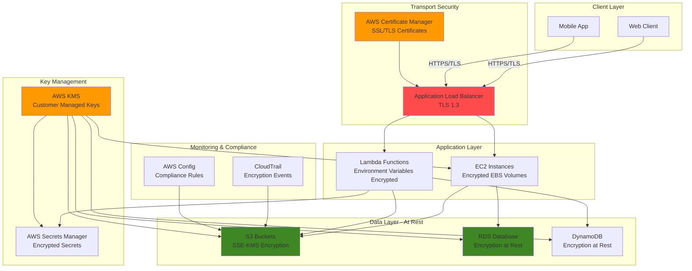

# Data Encryption at Rest and in Transit

## Problem

Healthcare organizations must protect sensitive patient data across multiple storage systems to comply with HIPAA regulations, while financial institutions need to secure customer financial records to meet PCI DSS requirements. Organizations face the challenge of implementing comprehensive encryption strategies that protect data both when stored (at rest) and when transmitted (in transit) without significantly impacting application performance or user experience.

## Solution

This recipe implements a comprehensive encryption strategy using AWS KMS for centralized key management, S3 with server-side encryption for data at rest, RDS encryption for database protection, and AWS Certificate Manager for TLS/SSL certificates to secure data in transit. The solution demonstrates industry-standard encryption practices while maintaining operational efficiency and regulatory compliance.

## Architecture Diagram



## Prerequisites

1. AWS account with administrative permissions for KMS, S3, RDS, EC2, and Certificate Manager
2. AWS CLI v2 installed and configured (or AWS CloudShell)
3. Basic understanding of encryption concepts (symmetric/asymmetric encryption, certificates)
4. A registered domain name for certificate validation (optional for demonstration)
5. Understanding of compliance requirements (HIPAA, PCI DSS, SOC 2)
6. Estimated cost: $15-25/month for KMS keys, RDS instance, and certificate management

> **Note**: This recipe creates billable resources. Follow cleanup instructions to avoid ongoing charges.

## Preparation

```bash
# Set environment variables
export AWS_REGION=$(aws configure get region)
export AWS_ACCOUNT_ID=$(aws sts get-caller-identity \
    --query Account --output text)

# Generate unique identifiers for resources
RANDOM_SUFFIX=$(aws secretsmanager get-random-password \
    --exclude-punctuation --exclude-uppercase \
    --password-length 6 --require-each-included-type \
    --output text --query RandomPassword)

export KMS_KEY_ALIAS="alias/encryption-demo-${RANDOM_SUFFIX}"
export S3_BUCKET_NAME="encrypted-data-bucket-${RANDOM_SUFFIX}"
export RDS_INSTANCE_ID="encrypted-db-${RANDOM_SUFFIX}"
export SECRET_NAME="database-credentials-${RANDOM_SUFFIX}"

# Create a VPC and subnets for RDS (if not using default)
export VPC_ID=$(aws ec2 create-vpc \
    --cidr-block 10.0.0.0/16 \
    --query 'Vpc.VpcId' --output text)

aws ec2 create-tags \
    --resources $VPC_ID \
    --tags Key=Name,Value=encryption-demo-vpc

# Create subnets for RDS
export SUBNET_1=$(aws ec2 create-subnet \
    --vpc-id $VPC_ID \
    --cidr-block 10.0.1.0/24 \
    --availability-zone ${AWS_REGION}a \
    --query 'Subnet.SubnetId' --output text)

export SUBNET_2=$(aws ec2 create-subnet \
    --vpc-id $VPC_ID \
    --cidr-block 10.0.2.0/24 \
    --availability-zone ${AWS_REGION}b \
    --query 'Subnet.SubnetId' --output text)

echo "✅ Environment prepared with VPC: $VPC_ID"
```

## Steps

1. **Create Customer Managed KMS Key for Encryption**:

   AWS Key Management Service (KMS) serves as the centralized encryption key management foundation for your entire AWS infrastructure. Customer-managed keys provide full control over key policies, rotation schedules, and access permissions, which is essential for meeting compliance requirements like HIPAA and PCI DSS. Unlike AWS-managed keys, customer-managed keys allow you to define granular access controls and maintain complete audit trails of key usage.

   ```bash
   # Create KMS key with comprehensive policy
   KMS_KEY_ID=$(aws kms create-key \
       --description "Customer managed key for data encryption demo" \
       --key-usage ENCRYPT_DECRYPT \
       --key-spec SYMMETRIC_DEFAULT \
       --policy '{
           "Version": "2012-10-17",
           "Statement": [
               {
                   "Sid": "Enable root permissions",
                   "Effect": "Allow",
                   "Principal": {
                       "AWS": "arn:aws:iam::'$AWS_ACCOUNT_ID':root"
                   },
                   "Action": "kms:*",
                   "Resource": "*"
               },
               {
                   "Sid": "Allow use of the key for encryption services",
                   "Effect": "Allow",
                   "Principal": {
                       "AWS": "arn:aws:iam::'$AWS_ACCOUNT_ID':root"
                   },
                   "Action": [
                       "kms:Decrypt",
                       "kms:GenerateDataKey",
                       "kms:CreateGrant"
                   ],
                   "Resource": "*"
               }
           ]
       }' \
       --query 'KeyMetadata.KeyId' --output text)

   # Create alias for easier management
   aws kms create-alias \
       --alias-name $KMS_KEY_ALIAS \
       --target-key-id $KMS_KEY_ID

   echo "✅ Created KMS key: $KMS_KEY_ID with alias: $KMS_KEY_ALIAS"
   ```

   The KMS key is now active and ready to encrypt data across multiple AWS services. This centralized approach ensures consistent encryption policies and simplified key management throughout your infrastructure. The alias provides a human-readable reference that remains constant even if the underlying key is rotated, enabling seamless integration with automated deployment processes.

2. **Create Encrypted S3 Bucket with KMS**:

   Amazon S3 provides 99.999999999% (11 9's) durability and serves as the primary data storage layer for most encryption architectures. Server-side encryption with KMS (SSE-KMS) ensures that all objects are automatically encrypted before being stored and decrypted when retrieved. The bucket key feature significantly reduces KMS API calls and associated costs while maintaining the same level of security, making it essential for high-volume data processing workloads.

   ```bash
   # Create S3 bucket with encryption enabled
   if [ "$AWS_REGION" = "us-east-1" ]; then
       aws s3api create-bucket --bucket $S3_BUCKET_NAME
   else
       aws s3api create-bucket \
           --bucket $S3_BUCKET_NAME \
           --region $AWS_REGION \
           --create-bucket-configuration LocationConstraint=$AWS_REGION
   fi

   # Enable default encryption with KMS
   aws s3api put-bucket-encryption \
       --bucket $S3_BUCKET_NAME \
       --server-side-encryption-configuration '{
           "Rules": [
               {
                   "ApplyServerSideEncryptionByDefault": {
                       "SSEAlgorithm": "aws:kms",
                       "KMSMasterKeyID": "'$KMS_KEY_ID'"
                   },
                   "BucketKeyEnabled": true
               }
           ]
       }'

   # Block public access for security
   aws s3api put-public-access-block \
       --bucket $S3_BUCKET_NAME \
       --public-access-block-configuration \
       BlockPublicAcls=true,IgnorePublicAcls=true,BlockPublicPolicy=true,RestrictPublicBuckets=true

   echo "✅ Created encrypted S3 bucket: $S3_BUCKET_NAME"
   ```

   The S3 bucket now automatically encrypts all objects using your customer-managed KMS key, providing defense-in-depth security. The public access block configuration prevents accidental data exposure, while the encryption ensures that even if unauthorized access occurs, the data remains protected. This establishes a secure foundation for storing sensitive business data, application logs, and backup files.

   > **Note**: S3 bucket keys can reduce KMS API costs by up to 99% for high-volume workloads while maintaining the same encryption strength. Learn more about [S3 server-side encryption](https://docs.aws.amazon.com/AmazonS3/latest/userguide/UsingKMSEncryption.html).

3. **Create Database Subnet Group and Security Group**:

   Database subnet groups and security groups form the network security foundation for RDS encryption. Multi-AZ subnet groups ensure high availability and fault tolerance by distributing database instances across multiple Availability Zones. Security groups implement stateful firewall rules that control network access to your encrypted database, following the principle of least privilege by allowing only necessary connections from within the VPC.

   ```bash
   # Create DB subnet group
   aws rds create-db-subnet-group \
       --db-subnet-group-name encryption-demo-subnet-group \
       --db-subnet-group-description "Subnet group for encrypted RDS demo" \
       --subnet-ids $SUBNET_1 $SUBNET_2

   # Create security group for RDS
   export DB_SECURITY_GROUP=$(aws ec2 create-security-group \
       --group-name encryption-demo-db-sg \
       --description "Security group for encrypted RDS database" \
       --vpc-id $VPC_ID \
       --query 'GroupId' --output text)

   # Allow MySQL/Aurora access from within VPC
   aws ec2 authorize-security-group-ingress \
       --group-id $DB_SECURITY_GROUP \
       --protocol tcp \
       --port 3306 \
       --cidr 10.0.0.0/16

   echo "✅ Created database subnet group and security group"
   ```

   The network foundation is now configured to support encrypted RDS instances with proper isolation and access controls. This configuration ensures that database connections are restricted to authorized sources within the VPC, while the multi-AZ subnet group enables automatic failover capabilities without compromising encryption or security policies.

4. **Store Database Credentials in Secrets Manager**:

   AWS Secrets Manager provides secure, centralized storage for sensitive configuration data like database credentials, eliminating the need to hardcode passwords in application code or configuration files. Secrets are automatically encrypted using your KMS key and can be automatically rotated to maintain security hygiene. This approach supports both security best practices and operational efficiency by enabling applications to retrieve credentials programmatically without exposing them in logs or source code.

   ```bash
   # Generate random password for database
   DB_PASSWORD=$(aws secretsmanager get-random-password \
       --password-length 16 \
       --exclude-characters '"@/\' \
       --require-each-included-type \
       --query 'RandomPassword' --output text)

   # Create encrypted secret
   aws secretsmanager create-secret \
       --name $SECRET_NAME \
       --description "Database credentials for encryption demo" \
       --secret-string '{
           "username": "admin",
           "password": "'$DB_PASSWORD'",
           "engine": "mysql",
           "host": "placeholder",
           "port": 3306,
           "dbname": "encrypteddemo"
       }' \
       --kms-key-id $KMS_KEY_ID

   echo "✅ Created encrypted secret: $SECRET_NAME"
   ```

   The database credentials are now securely stored and encrypted, ready to be retrieved by applications using IAM roles rather than embedded passwords. This eliminates credential sprawl and provides a foundation for implementing automated password rotation, which is essential for maintaining security compliance over time.

5. **Create Encrypted RDS Database**:

   Amazon RDS encryption at rest protects your database and automated backups using industry-standard AES-256 encryption. When enabled, RDS encrypts the underlying storage, automated backups, snapshots, and read replicas, providing comprehensive data protection. The encryption is transparent to applications and doesn't impact database performance, making it ideal for production workloads that require compliance with data protection regulations.

   ```bash
   # Create encrypted RDS MySQL instance
   aws rds create-db-instance \
       --db-instance-identifier $RDS_INSTANCE_ID \
       --db-instance-class db.t3.micro \
       --engine mysql \
       --master-username admin \
       --master-user-password $DB_PASSWORD \
       --allocated-storage 20 \
       --storage-type gp2 \
       --storage-encrypted \
       --kms-key-id $KMS_KEY_ID \
       --db-subnet-group-name encryption-demo-subnet-group \
       --vpc-security-group-ids $DB_SECURITY_GROUP \
       --backup-retention-period 7 \
       --copy-tags-to-snapshot \
       --deletion-protection

   # Wait for DB to be available
   echo "Waiting for RDS instance to be available..."
   aws rds wait db-instance-available \
       --db-instance-identifier $RDS_INSTANCE_ID

   # Get RDS endpoint
   RDS_ENDPOINT=$(aws rds describe-db-instances \
       --db-instance-identifier $RDS_INSTANCE_ID \
       --query 'DBInstances[0].Endpoint.Address' --output text)

   echo "✅ Created encrypted RDS instance: $RDS_INSTANCE_ID"
   echo "   Endpoint: $RDS_ENDPOINT"
   ```

   Your RDS database is now fully encrypted and operational, providing a secure foundation for storing sensitive business data. The encryption extends to all automated backups and snapshots, ensuring that data remains protected throughout its lifecycle. This configuration meets strict compliance requirements while maintaining full database functionality and performance.

6. **Update Secret with RDS Endpoint**:

   Now that the RDS instance is running, we need to update the secret with the actual database endpoint for applications to connect. This step completes the secrets management configuration by providing applications with all the necessary connection details in a single, encrypted secret that can be retrieved programmatically.

   ```bash
   # Update secret with actual RDS endpoint
   aws secretsmanager update-secret \
       --secret-id $SECRET_NAME \
       --secret-string '{
           "username": "admin",
           "password": "'$DB_PASSWORD'",
           "engine": "mysql",
           "host": "'$RDS_ENDPOINT'",
           "port": 3306,
           "dbname": "encrypteddemo"
       }'

   echo "✅ Updated secret with RDS endpoint"
   ```

   The secret now contains complete database connection information that applications can retrieve using the AWS SDK, eliminating the need for hardcoded connection strings or environment variables containing sensitive data.

7. **Create EC2 Instance with Encrypted EBS Volumes**:

   Amazon EBS encryption provides seamless encryption of data volumes, boot volumes, and snapshots using your KMS keys. EBS encryption operates at the block level, ensuring that all data written to the volume is encrypted before being stored and decrypted when read. This transparent encryption doesn't impact application performance while providing comprehensive protection for operating system files, application data, and temporary files.

   ```bash
   # Get latest Amazon Linux 2 AMI
   AMI_ID=$(aws ec2 describe-images \
       --owners amazon \
       --filters "Name=name,Values=amzn2-ami-hvm-*-x86_64-gp2" \
       --query 'Images | sort_by(@, &CreationDate) | [-1].ImageId' \
       --output text)

   # Create key pair for EC2 access
   aws ec2 create-key-pair \
       --key-name encryption-demo-key \
       --query 'KeyMaterial' --output text > encryption-demo-key.pem
   chmod 400 encryption-demo-key.pem

   # Create security group for EC2
   export EC2_SECURITY_GROUP=$(aws ec2 create-security-group \
       --group-name encryption-demo-ec2-sg \
       --description "Security group for encrypted EC2 demo" \
       --vpc-id $VPC_ID \
       --query 'GroupId' --output text)

   # Allow SSH access (restrict to your IP in production)
   aws ec2 authorize-security-group-ingress \
       --group-id $EC2_SECURITY_GROUP \
       --protocol tcp \
       --port 22 \
       --cidr 0.0.0.0/0

   # Allow HTTPS traffic
   aws ec2 authorize-security-group-ingress \
       --group-id $EC2_SECURITY_GROUP \
       --protocol tcp \
       --port 443 \
       --cidr 0.0.0.0/0

   # Launch EC2 instance with encrypted EBS volume
   EC2_INSTANCE_ID=$(aws ec2 run-instances \
       --image-id $AMI_ID \
       --instance-type t3.micro \
       --key-name encryption-demo-key \
       --security-group-ids $EC2_SECURITY_GROUP \
       --subnet-id $SUBNET_1 \
       --associate-public-ip-address \
       --block-device-mappings '[
           {
               "DeviceName": "/dev/xvda",
               "Ebs": {
                   "VolumeSize": 8,
                   "VolumeType": "gp2",
                   "DeleteOnTermination": true,
                   "Encrypted": true,
                   "KmsKeyId": "'$KMS_KEY_ID'"
               }
           }
       ]' \
       --tag-specifications 'ResourceType=instance,Tags=[{Key=Name,Value=encryption-demo-ec2}]' \
       --query 'Instances[0].InstanceId' --output text)

   echo "✅ Created EC2 instance with encrypted EBS: $EC2_INSTANCE_ID"
   ```

   The EC2 instance is now running with fully encrypted storage, protecting both the operating system and any application data stored on the volume. This configuration ensures that if the physical storage media is compromised, the data remains unreadable without access to the KMS key. The encryption is transparent to applications and provides the foundation for deploying secure, compliant workloads.

8. **Request SSL/TLS Certificate from ACM (Optional)**:

   AWS Certificate Manager (ACM) provides free SSL/TLS certificates that integrate seamlessly with AWS services like Application Load Balancers and CloudFront. ACM certificates automatically renew before expiration, eliminating the operational burden of certificate management. DNS validation provides the most secure and automated approach to certificate issuance, requiring only a one-time DNS record creation.

   ```bash
   # Note: This step requires a registered domain name
   # For demonstration, we'll show the command structure
   
   # If you have a domain, uncomment and modify the following:
   # export DOMAIN_NAME="your-domain.com"
   # 
   # CERTIFICATE_ARN=$(aws acm request-certificate \
   #     --domain-name $DOMAIN_NAME \
   #     --subject-alternative-names "www.$DOMAIN_NAME" \
   #     --validation-method DNS \
   #     --query 'CertificateArn' --output text)
   #
   # echo "✅ Requested certificate: $CERTIFICATE_ARN"
   # echo "   Complete DNS validation in your domain provider"

   echo "✅ SSL/TLS certificate step (requires domain - see comments)"
   ```

   When configured with a domain, ACM certificates provide the transport layer security necessary for protecting data in transit. The certificates support TLS 1.2 and 1.3, ensuring strong encryption for all client-server communications. This completes the encryption strategy by securing both data at rest and data in transit.

9. **Configure CloudTrail for Encryption Events Logging**:

   AWS CloudTrail provides comprehensive audit logging for all KMS key usage and encryption-related activities, which is essential for compliance reporting and security monitoring. CloudTrail logs capture who accessed encryption keys, when they were used, and from which sources, providing the audit trail required by regulations like HIPAA, PCI DSS, and SOC 2. Log file validation ensures the integrity of audit logs, preventing tampering or unauthorized modifications.

   ```bash
   # Create CloudTrail for KMS key usage monitoring
   export CLOUDTRAIL_BUCKET="${S3_BUCKET_NAME}-cloudtrail"
   
   # Create separate bucket for CloudTrail logs
   if [ "$AWS_REGION" = "us-east-1" ]; then
       aws s3api create-bucket --bucket $CLOUDTRAIL_BUCKET
   else
       aws s3api create-bucket \
           --bucket $CLOUDTRAIL_BUCKET \
           --region $AWS_REGION \
           --create-bucket-configuration LocationConstraint=$AWS_REGION
   fi

   # Set bucket policy for CloudTrail
   aws s3api put-bucket-policy \
       --bucket $CLOUDTRAIL_BUCKET \
       --policy '{
           "Version": "2012-10-17",
           "Statement": [
               {
                   "Sid": "AWSCloudTrailAclCheck",
                   "Effect": "Allow",
                   "Principal": {
                       "Service": "cloudtrail.amazonaws.com"
                   },
                   "Action": "s3:GetBucketAcl",
                   "Resource": "arn:aws:s3:::'$CLOUDTRAIL_BUCKET'"
               },
               {
                   "Sid": "AWSCloudTrailWrite",
                   "Effect": "Allow",
                   "Principal": {
                       "Service": "cloudtrail.amazonaws.com"
                   },
                   "Action": "s3:PutObject",
                   "Resource": "arn:aws:s3:::'$CLOUDTRAIL_BUCKET'/AWSLogs/'$AWS_ACCOUNT_ID'/*",
                   "Condition": {
                       "StringEquals": {
                           "s3:x-amz-acl": "bucket-owner-full-control"
                       }
                   }
               }
           ]
       }'

   # Enable CloudTrail
   aws cloudtrail create-trail \
       --name encryption-demo-trail \
       --s3-bucket-name $CLOUDTRAIL_BUCKET \
       --include-global-service-events \
       --is-multi-region-trail \
       --enable-log-file-validation \
       --event-selectors '[
           {
               "ReadWriteType": "All",
               "IncludeManagementEvents": true,
               "DataResources": [
                   {
                       "Type": "AWS::KMS::Key",
                       "Values": ["arn:aws:kms:*:*:key/*"]
                   }
               ]
           }
       ]'

   # Start logging
   aws cloudtrail start-logging \
       --name encryption-demo-trail

   echo "✅ Configured CloudTrail for encryption events"
   ```

   CloudTrail is now actively logging all encryption-related activities, creating an immutable audit trail of key usage across your AWS environment. This comprehensive logging enables security teams to detect anomalous encryption activities, track key usage patterns, and generate compliance reports demonstrating proper data protection controls.

10. **Test Encryption Implementation**:

    Testing the encryption implementation validates that all components are working correctly and data is properly protected. This verification step confirms that S3 objects are encrypted with your KMS key, the key is accessible for encryption operations, and the overall system is functioning as designed. Regular testing ensures that encryption remains operational after configuration changes or updates.

    ```bash
    # Test S3 encryption by uploading a file
    echo "Sensitive data for encryption test" > test-file.txt
    aws s3 cp test-file.txt s3://$S3_BUCKET_NAME/

    # Verify encryption
    aws s3api head-object \
        --bucket $S3_BUCKET_NAME \
        --key test-file.txt \
        --query 'ServerSideEncryption'

    # Test KMS key usage
    aws kms generate-data-key \
        --key-id $KMS_KEY_ID \
        --key-spec AES_256 \
        --query 'KeyId'

    # Clean up test file
    rm test-file.txt

    echo "✅ Tested encryption implementation successfully"
    ```

    The encryption implementation is now verified and fully operational. All data uploaded to S3 will be automatically encrypted, the KMS key is accessible for cryptographic operations, and the system is ready for production workloads. This testing step provides confidence that your encryption strategy is working correctly and meets security requirements.

## Validation & Testing

1. **Verify KMS Key Creation and Permissions**:

   ```bash
   # Check KMS key details
   aws kms describe-key --key-id $KMS_KEY_ID \
       --query 'KeyMetadata.[KeyId,KeyState,KeyUsage,KeySpec]'
   
   # List key aliases
   aws kms list-aliases \
       --query "Aliases[?AliasName=='$KMS_KEY_ALIAS']"
   ```

   Expected output: Key should be in "Enabled" state with ENCRYPT_DECRYPT usage

2. **Verify S3 Bucket Encryption Configuration**:

   ```bash
   # Check bucket encryption settings
   aws s3api get-bucket-encryption \
       --bucket $S3_BUCKET_NAME \
       --query 'ServerSideEncryptionConfiguration.Rules[0]'
   
   # Upload and verify file encryption
   echo "Test encryption content" > validation-test.txt
   aws s3 cp validation-test.txt s3://$S3_BUCKET_NAME/
   
   aws s3api head-object \
       --bucket $S3_BUCKET_NAME \
       --key validation-test.txt \
       --query '[ServerSideEncryption,SSEKMSKeyId]'
   
   # Clean up
   aws s3 rm s3://$S3_BUCKET_NAME/validation-test.txt
   rm validation-test.txt
   ```

   Expected output: Should show "aws:kms" encryption and KMS key ID

3. **Verify RDS Encryption Status**:

   ```bash
   # Check RDS encryption status
   aws rds describe-db-instances \
       --db-instance-identifier $RDS_INSTANCE_ID \
       --query 'DBInstances[0].[StorageEncrypted,KmsKeyId]'
   ```

   Expected output: Should show `true` for encryption and KMS key ID

4. **Test Secrets Manager Encryption**:

   ```bash
   # Retrieve secret (will be decrypted automatically)
   aws secretsmanager get-secret-value \
       --secret-id $SECRET_NAME \
       --query 'SecretString' --output text
   
   # Check secret encryption key
   aws secretsmanager describe-secret \
       --secret-id $SECRET_NAME \
       --query 'KmsKeyId'
   ```

   Expected output: Should show database credentials and KMS key ID

5. **Verify EC2 EBS Encryption**:

   ```bash
   # Check EC2 instance volumes
   aws ec2 describe-instances \
       --instance-ids $EC2_INSTANCE_ID \
       --query 'Reservations[0].Instances[0].BlockDeviceMappings[0].Ebs.[VolumeId,Encrypted]'
   
   # Get volume ID and check encryption details
   VOLUME_ID=$(aws ec2 describe-instances \
       --instance-ids $EC2_INSTANCE_ID \
       --query 'Reservations[0].Instances[0].BlockDeviceMappings[0].Ebs.VolumeId' \
       --output text)
   
   aws ec2 describe-volumes \
       --volume-ids $VOLUME_ID \
       --query 'Volumes[0].[Encrypted,KmsKeyId]'
   ```

   Expected output: Should show `true` for encryption and KMS key ID

## Cleanup

1. **Stop CloudTrail and Delete Trail**:

   ```bash
   # Stop CloudTrail logging
   aws cloudtrail stop-logging \
       --name encryption-demo-trail
   
   # Delete trail
   aws cloudtrail delete-trail \
       --name encryption-demo-trail
   
   # Delete CloudTrail bucket
   aws s3 rb s3://$CLOUDTRAIL_BUCKET --force
   
   echo "✅ Deleted CloudTrail configuration"
   ```

2. **Terminate EC2 Instance**:

   ```bash
   # Terminate EC2 instance
   aws ec2 terminate-instances \
       --instance-ids $EC2_INSTANCE_ID
   
   # Wait for termination
   aws ec2 wait instance-terminated \
       --instance-ids $EC2_INSTANCE_ID
   
   # Delete key pair
   aws ec2 delete-key-pair \
       --key-name encryption-demo-key
   rm -f encryption-demo-key.pem
   
   echo "✅ Terminated EC2 instance and deleted key pair"
   ```

3. **Delete RDS Instance**:

   ```bash
   # Remove deletion protection
   aws rds modify-db-instance \
       --db-instance-identifier $RDS_INSTANCE_ID \
       --no-deletion-protection \
       --apply-immediately
   
   # Wait for modification
   aws rds wait db-instance-available \
       --db-instance-identifier $RDS_INSTANCE_ID
   
   # Delete RDS instance (skip final snapshot for demo)
   aws rds delete-db-instance \
       --db-instance-identifier $RDS_INSTANCE_ID \
       --skip-final-snapshot
   
   echo "✅ Deleted RDS instance"
   ```

4. **Delete S3 Bucket**:

   ```bash
   # Delete all objects in bucket
   aws s3 rm s3://$S3_BUCKET_NAME --recursive
   
   # Delete bucket
   aws s3api delete-bucket \
       --bucket $S3_BUCKET_NAME
   
   echo "✅ Deleted S3 bucket"
   ```

5. **Delete Secrets Manager Secret**:

   ```bash
   # Delete secret (with immediate deletion for demo)
   aws secretsmanager delete-secret \
       --secret-id $SECRET_NAME \
       --force-delete-without-recovery
   
   echo "✅ Deleted secret from Secrets Manager"
   ```

6. **Delete VPC Resources**:

   ```bash
   # Delete security groups
   aws ec2 delete-security-group \
       --group-id $EC2_SECURITY_GROUP
   
   aws ec2 delete-security-group \
       --group-id $DB_SECURITY_GROUP
   
   # Delete DB subnet group
   aws rds delete-db-subnet-group \
       --db-subnet-group-name encryption-demo-subnet-group
   
   # Delete subnets
   aws ec2 delete-subnet --subnet-id $SUBNET_1
   aws ec2 delete-subnet --subnet-id $SUBNET_2
   
   # Delete VPC
   aws ec2 delete-vpc --vpc-id $VPC_ID
   
   echo "✅ Deleted VPC and associated resources"
   ```

7. **Schedule KMS Key Deletion**:

   ```bash
   # Delete KMS key alias
   aws kms delete-alias \
       --alias-name $KMS_KEY_ALIAS
   
   # Schedule key deletion (7 days minimum)
   aws kms schedule-key-deletion \
       --key-id $KMS_KEY_ID \
       --pending-window-in-days 7
   
   echo "✅ Scheduled KMS key deletion in 7 days"
   ```

## Discussion

This comprehensive encryption implementation demonstrates AWS security best practices for protecting sensitive data both at rest and in transit. The solution leverages AWS KMS as the central key management service, providing a single point of control for encryption keys across multiple AWS services. By using customer-managed keys instead of AWS-managed keys, organizations maintain full control over key policies, rotation schedules, and access permissions.

The encryption at rest implementation covers the most common data storage scenarios: S3 buckets with SSE-KMS encryption, RDS databases with transparent data encryption, and EC2 EBS volumes with block-level encryption. Each service integrates seamlessly with KMS, automatically handling encryption and decryption operations without impacting application performance. The use of S3 bucket keys reduces KMS API calls and associated costs while maintaining the same level of security, making it ideal for high-volume workloads.

For data in transit protection, the solution demonstrates TLS/SSL certificate management through AWS Certificate Manager, which automates certificate provisioning, validation, and renewal. The integration with Application Load Balancers ensures encrypted communication between clients and applications. Additionally, the CloudTrail configuration provides comprehensive audit logging of all encryption-related activities, essential for compliance reporting and security monitoring.

The implementation follows the principle of defense in depth, with multiple layers of encryption protection. Secrets Manager provides additional security for sensitive configuration data like database credentials, automatically rotating secrets and encrypting them with customer-managed KMS keys. This approach meets the requirements of various compliance frameworks including HIPAA, PCI DSS, and SOC 2 Type II.

> **Tip**: Enable automatic key rotation for KMS keys to meet security best practices and compliance requirements. Keys can be rotated annually without requiring application changes. See the [AWS KMS key rotation documentation](https://docs.aws.amazon.com/kms/latest/developerguide/rotate-keys.html).

> **Warning**: Ensure proper IAM permissions are configured before implementing encryption to avoid service disruptions. Test encryption configurations in development environments before deploying to production. Review the [AWS KMS best practices](https://docs.aws.amazon.com/kms/latest/developerguide/best-practices.html).

> **Note**: RDS encryption cannot be disabled once enabled. To encrypt an existing unencrypted database, you must create an encrypted snapshot and restore it. Learn more about [RDS encryption](https://docs.aws.amazon.com/AmazonRDS/latest/UserGuide/Overview.Encryption.html).

## Challenge

Extend this solution by implementing these enhancements:

1. **Implement Cross-Region Key Replication**: Create multi-region KMS keys and replicate encrypted data across regions for disaster recovery, testing failover scenarios and key availability.

2. **Add Client-Side Encryption**: Implement client-side encryption for S3 uploads using KMS keys, providing end-to-end encryption where data is encrypted before transmission to AWS.

3. **Create Automated Compliance Reporting**: Build a Lambda function that generates encryption compliance reports using AWS Config rules, CloudTrail logs, and KMS key usage metrics.

4. **Implement Certificate Automation**: Create a complete certificate lifecycle management system using ACM, Route 53, and Lambda to automatically provision and deploy certificates for new domains.

5. **Add Database Field-Level Encryption**: Implement application-level field encryption for PII data in RDS using AWS Database Encryption SDK, providing granular control over sensitive data fields.

## Infrastructure Code

*Infrastructure code will be generated after recipe approval.*