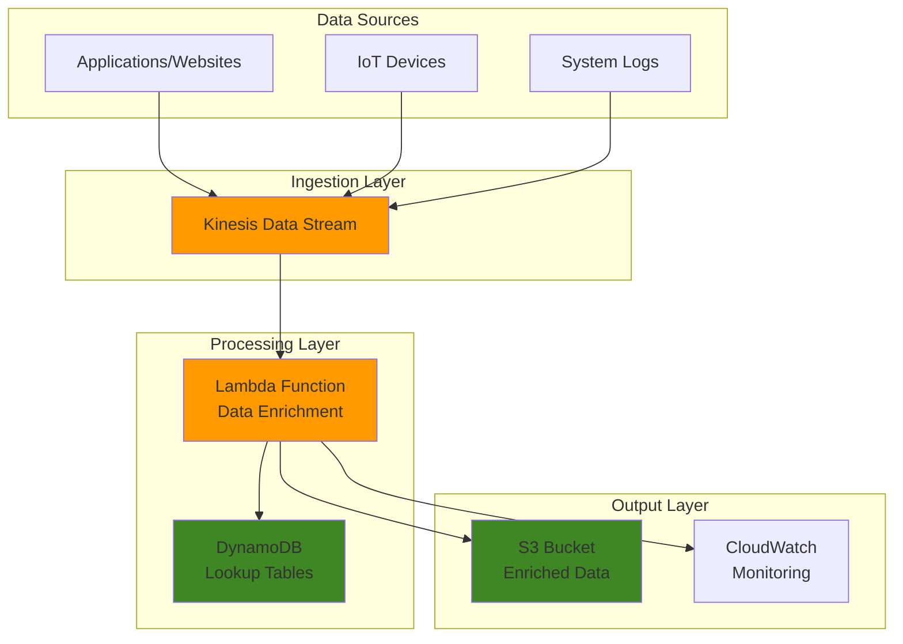

# Streaming Data Enrichment with Kinesis


## Problem

E-commerce companies need to process millions of clickstream events in real-time to personalize customer experiences and trigger immediate actions like recommendations or fraud detection. Raw event data often lacks context such as user profiles, product details, or geographic information, requiring real-time enrichment to maximize business value. Traditional batch processing introduces delays that make real-time decision-making impossible.

## Solution

This solution implements a streaming data enrichment pipeline using Amazon Kinesis Data Streams as the ingestion layer and AWS Lambda functions for real-time data transformation and enrichment. The architecture processes events as they arrive, enriches them with contextual data from external sources, and outputs enriched events for downstream analytics and decision-making systems.

## Architecture Diagram



## Prerequisites

1. AWS account with permissions for Kinesis, Lambda, DynamoDB, S3, and CloudWatch
2. AWS CLI v2 installed and configured (or AWS CloudShell)
3. Basic understanding of streaming data processing concepts
4. Familiarity with Python programming for Lambda functions
5. Estimated cost: $5-15/month for development workload (depends on data volume)

> **Note**: This recipe creates resources that incur charges. Monitor your usage and clean up resources when finished.

## Preparation

```bash
# Set environment variables
export AWS_REGION=$(aws configure get region)
export AWS_ACCOUNT_ID=$(aws sts get-caller-identity \
    --query Account --output text)

# Generate unique identifiers for resources
RANDOM_SUFFIX=$(aws secretsmanager get-random-password \
    --exclude-punctuation --exclude-uppercase \
    --password-length 6 --require-each-included-type \
    --output text --query RandomPassword)

export STREAM_NAME="data-enrichment-stream-${RANDOM_SUFFIX}"
export FUNCTION_NAME="data-enrichment-function-${RANDOM_SUFFIX}"
export BUCKET_NAME="enriched-data-bucket-${RANDOM_SUFFIX}"
export TABLE_NAME="enrichment-lookup-table-${RANDOM_SUFFIX}"
export ROLE_NAME="data-enrichment-role-${RANDOM_SUFFIX}"

echo "Stream Name: ${STREAM_NAME}"
echo "Function Name: ${FUNCTION_NAME}"
echo "Bucket Name: ${BUCKET_NAME}"
echo "Table Name: ${TABLE_NAME}"
echo "Role Name: ${ROLE_NAME}"
```

## Steps

1. **Create DynamoDB table for lookup data**:

   DynamoDB serves as the high-performance lookup layer for our streaming data enrichment pipeline. As a fully managed NoSQL database service, DynamoDB provides single-digit millisecond latency for read operations, making it ideal for real-time data enrichment scenarios where speed is critical. The table will store user profiles and contextual information that will be joined with streaming events to create enriched data for downstream analytics and decision-making systems.

   ```bash
   # Create DynamoDB table for user profile lookups
   aws dynamodb create-table \
       --table-name ${TABLE_NAME} \
       --attribute-definitions \
           AttributeName=user_id,AttributeType=S \
       --key-schema \
           AttributeName=user_id,KeyType=HASH \
       --billing-mode PAY_PER_REQUEST \
       --tags Key=Purpose,Value=DataEnrichment \
             Key=Environment,Value=Development
   
   # Wait for table to be active
   aws dynamodb wait table-exists \
       --table-name ${TABLE_NAME}
   
   echo "✅ DynamoDB table created: ${TABLE_NAME}"
   ```

   The table is now ready to serve as our enrichment data source. Using PAY_PER_REQUEST billing mode ensures cost-effective operation during development and testing phases, automatically scaling with demand without requiring capacity planning. This foundation enables our Lambda function to perform fast lookups during stream processing.

   > **Note**: Learn more about DynamoDB's core concepts and capabilities in the [DynamoDB Developer Guide](https://docs.aws.amazon.com/amazondynamodb/latest/developerguide/HowItWorks.CoreComponents.html).

2. **Populate lookup table with sample data**:

   Sample user profiles provide the contextual data that transforms raw streaming events into valuable business insights. In production environments, this data would typically come from customer databases, CRM systems, or data warehouses. The enrichment process adds dimensions like customer segment, location, and preferences to streaming events, enabling real-time personalization, targeted marketing, and improved customer experience decisions.

   ```bash
   # Add sample user profiles for enrichment
   aws dynamodb put-item \
       --table-name ${TABLE_NAME} \
       --item '{
           "user_id": {"S": "user123"},
           "name": {"S": "John Doe"},
           "email": {"S": "john@example.com"},
           "segment": {"S": "premium"},
           "location": {"S": "New York"}
       }'
   
   aws dynamodb put-item \
       --table-name ${TABLE_NAME} \
       --item '{
           "user_id": {"S": "user456"},
           "name": {"S": "Jane Smith"},
           "email": {"S": "jane@example.com"},
           "segment": {"S": "standard"},
           "location": {"S": "California"}
       }'
   
   echo "✅ Sample data populated in lookup table"
   ```

   The lookup table now contains user profiles that will be joined with streaming events during processing. These profiles include business-relevant attributes like customer segment (premium vs standard) and location, which are essential for personalization engines, fraud detection systems, and analytics platforms that require enriched data to make informed decisions.

3. **Create S3 bucket for enriched data output**:

   Amazon S3 provides the durable, scalable storage foundation for our enriched streaming data. With 99.999999999% (11 9's) durability, S3 ensures that enriched data remains available for downstream analytics, machine learning pipelines, and business intelligence tools. The bucket will store enriched events in a time-partitioned structure, enabling efficient querying and cost optimization through lifecycle policies.

   ```bash
   # Create S3 bucket for storing enriched data
   aws s3 mb s3://${BUCKET_NAME} \
       --region ${AWS_REGION}
   
   # Enable versioning for data integrity
   aws s3api put-bucket-versioning \
       --bucket ${BUCKET_NAME} \
       --versioning-configuration Status=Enabled
   
   echo "✅ S3 bucket created: ${BUCKET_NAME}"
   ```

   The S3 bucket is now configured with versioning enabled, providing data protection and audit capabilities. This storage layer supports the entire analytics ecosystem, from real-time querying with Amazon Athena to batch processing with Amazon EMR, while maintaining cost-effectiveness through intelligent tiering and lifecycle management.

4. **Create IAM role for Lambda function**:

   IAM roles provide secure, temporary credential delegation without hardcoding secrets in application code. This execution role enables the Lambda function to access AWS services using the principle of least privilege, ensuring the function can only access the specific resources it needs for data enrichment operations. The role establishes a secure foundation for interacting with Kinesis streams, DynamoDB tables, and S3 buckets while maintaining comprehensive audit trails.

   ```bash
   # Create trust policy for Lambda
   cat > /tmp/trust-policy.json << EOF
   {
       "Version": "2012-10-17",
       "Statement": [
           {
               "Effect": "Allow",
               "Principal": {
                   "Service": "lambda.amazonaws.com"
               },
               "Action": "sts:AssumeRole"
           }
       ]
   }
   EOF
   
   # Create IAM role
   aws iam create-role \
       --role-name ${ROLE_NAME} \
       --assume-role-policy-document \
           file:///tmp/trust-policy.json
   
   # Attach basic Lambda execution policy
   aws iam attach-role-policy \
       --role-name ${ROLE_NAME} \
       --policy-arn arn:aws:iam::aws:policy/service-role/AWSLambdaBasicExecutionRole
   
   echo "✅ IAM role created: ${ROLE_NAME}"
   ```

   The IAM role is now established with basic Lambda execution permissions, including CloudWatch Logs access for monitoring and debugging. This security foundation uses temporary, rotatable credentials rather than permanent access keys, reducing security risks while enabling comprehensive logging and monitoring capabilities.

   > **Note**: Learn more about Lambda execution roles and security best practices in the [Lambda Developer Guide](https://docs.aws.amazon.com/lambda/latest/dg/lambda-intro-execution-role.html).

5. **Create custom policy for Lambda permissions**:

   Fine-grained IAM policies implement the principle of least privilege by granting only the specific permissions required for the Lambda function to perform its data enrichment tasks. This custom policy enables the function to read from Kinesis streams, perform lookups in DynamoDB, and write enriched data to S3 while preventing access to other AWS resources or operations that aren't needed for the workflow.

   ```bash
   # Create policy with necessary permissions
   cat > /tmp/lambda-policy.json << EOF
   {
       "Version": "2012-10-17",
       "Statement": [
           {
               "Effect": "Allow",
               "Action": [
                   "kinesis:DescribeStream",
                   "kinesis:DescribeStreamSummary",
                   "kinesis:GetRecords",
                   "kinesis:GetShardIterator",
                   "kinesis:ListShards",
                   "kinesis:SubscribeToShard"
               ],
               "Resource": "*"
           },
           {
               "Effect": "Allow",
               "Action": [
                   "dynamodb:GetItem",
                   "dynamodb:Query",
                   "dynamodb:Scan"
               ],
               "Resource": "*"
           },
           {
               "Effect": "Allow",
               "Action": [
                   "s3:PutObject",
                   "s3:PutObjectAcl"
               ],
               "Resource": "arn:aws:s3:::${BUCKET_NAME}/*"
           }
       ]
   }
   EOF
   
   # Create and attach custom policy
   aws iam create-policy \
       --policy-name ${ROLE_NAME}-policy \
       --policy-document file:///tmp/lambda-policy.json
   
   aws iam attach-role-policy \
       --role-name ${ROLE_NAME} \
       --policy-arn arn:aws:iam::${AWS_ACCOUNT_ID}:policy/${ROLE_NAME}-policy
   
   echo "✅ Custom policy created and attached"
   ```

   The custom policy is now attached to the Lambda execution role, providing precisely the permissions needed for stream processing, data enrichment, and output storage. This security model ensures that the function cannot access resources beyond its operational requirements, maintaining a strong security posture while enabling full functionality.

6. **Create Lambda function for data enrichment**:

   AWS Lambda provides the serverless compute foundation for our real-time data enrichment pipeline. Lambda automatically scales based on the incoming stream volume, eliminating the need for infrastructure management while ensuring consistent performance. The function processes batches of streaming records, enriches them with contextual data from DynamoDB, and stores the results in S3 for downstream consumption.

   ```bash
   # Create Lambda function code
   cat > /tmp/enrichment_function.py << 'EOF'
   import json
   import boto3
   import base64
   import datetime
   from decimal import Decimal
   
   dynamodb = boto3.resource('dynamodb')
   s3 = boto3.client('s3')
   
   def lambda_handler(event, context):
       # Get environment variables
       table_name = os.environ['TABLE_NAME']
       bucket_name = os.environ['BUCKET_NAME']
       
       table = dynamodb.Table(table_name)
       
       for record in event['Records']:
           # Decode Kinesis data
           payload = base64.b64decode(record['kinesis']['data'])
           data = json.loads(payload)
           
           # Enrich data with user profile
           user_id = data.get('user_id')
           if user_id:
               try:
                   response = table.get_item(Key={'user_id': user_id})
                   if 'Item' in response:
                       # Add user profile data to event
                       user_profile = response['Item']
                       data['user_name'] = user_profile.get('name', 'Unknown')
                       data['user_email'] = user_profile.get('email', 'Unknown')
                       data['user_segment'] = user_profile.get('segment', 'Unknown')
                       data['user_location'] = user_profile.get('location', 'Unknown')
                   else:
                       data['user_name'] = 'Unknown'
                       data['user_segment'] = 'Unknown'
               except Exception as e:
                   print(f"Error enriching user data: {e}")
                   data['enrichment_error'] = str(e)
           
           # Add processing timestamp
           data['processing_timestamp'] = datetime.datetime.utcnow().isoformat()
           data['enriched'] = True
           
           # Store enriched data in S3
           timestamp = datetime.datetime.utcnow().strftime('%Y/%m/%d/%H')
           key = f"enriched-data/{timestamp}/{record['kinesis']['sequenceNumber']}.json"
           
           try:
               s3.put_object(
                   Bucket=bucket_name,
                   Key=key,
                   Body=json.dumps(data),
                   ContentType='application/json'
               )
               print(f"Successfully processed record: {record['kinesis']['sequenceNumber']}")
           except Exception as e:
               print(f"Error storing enriched data: {e}")
               raise
       
       return f"Successfully processed {len(event['Records'])} records"
   
   import os
   EOF
   
   # Create deployment package
   cd /tmp && zip enrichment_function.zip enrichment_function.py
   
   # Create Lambda function
   aws lambda create-function \
       --function-name ${FUNCTION_NAME} \
       --runtime python3.9 \
       --role arn:aws:iam::${AWS_ACCOUNT_ID}:role/${ROLE_NAME} \
       --handler enrichment_function.lambda_handler \
       --zip-file fileb://enrichment_function.zip \
       --timeout 60 \
       --memory-size 256 \
       --environment Variables="{TABLE_NAME=${TABLE_NAME},BUCKET_NAME=${BUCKET_NAME}}"
   
   echo "✅ Lambda function created: ${FUNCTION_NAME}"
   ```

   The Lambda function is now deployed and ready to process streaming data. The function includes error handling for enrichment failures, time-based partitioning for S3 storage, and comprehensive logging for monitoring. This serverless architecture automatically scales with stream volume while maintaining cost efficiency by only charging for actual processing time.

   > **Note**: Learn more about Lambda fundamentals and best practices in the [Lambda Developer Guide](https://docs.aws.amazon.com/lambda/latest/dg/welcome.html).

7. **Create Kinesis Data Stream**:

   Amazon Kinesis Data Streams provides the scalable, real-time data ingestion backbone for our streaming architecture. With the ability to handle millions of records per second, Kinesis ensures reliable capture and ordering of streaming events from multiple sources. The stream acts as a buffer between data producers and consumers, enabling decoupled architecture that can scale independently while maintaining data durability and ordering guarantees.

   ```bash
   # Create Kinesis Data Stream with 2 shards
   aws kinesis create-stream \
       --stream-name ${STREAM_NAME} \
       --shard-count 2
   
   # Wait for stream to be active
   aws kinesis wait stream-exists \
       --stream-name ${STREAM_NAME}
   
   # Add tags to the stream
   aws kinesis add-tags-to-stream \
       --stream-name ${STREAM_NAME} \
       --tags Purpose=DataEnrichment,Environment=Development
   
   echo "✅ Kinesis Data Stream created: ${STREAM_NAME}"
   ```

   The Kinesis stream is now active and ready to receive data from multiple sources. Each shard can handle up to 1,000 records per second or 1 MB per second of incoming data, with the 2-shard configuration providing 2,000 records/second capacity. This scalable ingestion layer enables real-time processing while maintaining data ordering within each shard.

   > **Note**: Learn more about Kinesis Data Streams concepts and scaling in the [Kinesis Developer Guide](https://docs.aws.amazon.com/streams/latest/dev/introduction.html).

8. **Create event source mapping to connect Kinesis to Lambda**:

   The event source mapping creates the crucial connection between Kinesis Data Streams and Lambda, enabling automatic invocation of the enrichment function as new records arrive. This serverless integration eliminates the need for custom polling logic while providing built-in error handling, retry mechanisms, and parallelization across shards. The mapping configuration balances processing latency with cost efficiency through batching parameters.

   ```bash
   # Get stream ARN
   STREAM_ARN=$(aws kinesis describe-stream \
       --stream-name ${STREAM_NAME} \
       --query 'StreamDescription.StreamARN' \
       --output text)
   
   # Create event source mapping
   aws lambda create-event-source-mapping \
       --event-source-arn ${STREAM_ARN} \
       --function-name ${FUNCTION_NAME} \
       --starting-position LATEST \
       --batch-size 10 \
       --maximum-batching-window-in-seconds 5
   
   echo "✅ Event source mapping created"
   echo "Stream ARN: ${STREAM_ARN}"
   ```

   The event source mapping is now configured to batch up to 10 records or wait up to 5 seconds before invoking the Lambda function. This configuration optimizes for both latency and cost, reducing the number of Lambda invocations while maintaining near real-time processing. The mapping automatically handles shard scaling, error handling, and maintains processing checkpoints for reliable stream processing.

9. **Enable enhanced monitoring on Kinesis stream**:

   Enhanced monitoring provides detailed, shard-level metrics that are essential for monitoring stream performance and diagnosing issues in real-time data processing pipelines. These metrics enable proactive monitoring of throughput, latency, and potential bottlenecks, allowing for quick identification and resolution of performance issues before they impact downstream systems.

   ```bash
   # Enable enhanced monitoring for better observability
   aws kinesis enable-enhanced-monitoring \
       --stream-name ${STREAM_NAME} \
       --shard-level-metrics IncomingRecords,OutgoingRecords,IncomingBytes,OutgoingBytes
   
   echo "✅ Enhanced monitoring enabled"
   ```

   Enhanced monitoring is now active, providing detailed visibility into stream performance at the shard level. These metrics feed into CloudWatch, enabling automated alerting and scaling decisions based on actual stream utilization patterns and performance characteristics.

10. **Create CloudWatch alarms for monitoring**:

    CloudWatch alarms provide proactive monitoring and alerting capabilities essential for maintaining reliable streaming data pipelines. These alarms detect processing errors, throughput anomalies, and system health issues before they impact business operations. The monitoring strategy enables automated responses to issues while providing visibility into system performance and reliability metrics.

    ```bash
    # Create alarm for Lambda function errors
    aws cloudwatch put-metric-alarm \
        --alarm-name "${FUNCTION_NAME}-Errors" \
        --alarm-description "Lambda function errors" \
        --metric-name Errors \
        --namespace AWS/Lambda \
        --statistic Sum \
        --period 300 \
        --threshold 1 \
        --comparison-operator GreaterThanOrEqualToThreshold \
        --evaluation-periods 1 \
        --dimensions Name=FunctionName,Value=${FUNCTION_NAME}
    
    # Create alarm for Kinesis incoming records
    aws cloudwatch put-metric-alarm \
        --alarm-name "${STREAM_NAME}-IncomingRecords" \
        --alarm-description "Kinesis incoming records" \
        --metric-name IncomingRecords \
        --namespace AWS/Kinesis \
        --statistic Sum \
        --period 300 \
        --threshold 0 \
        --comparison-operator LessThanThreshold \
        --evaluation-periods 2 \
        --dimensions Name=StreamName,Value=${STREAM_NAME}
    
    echo "✅ CloudWatch alarms created"
    ```

    The monitoring infrastructure is now established with alarms for both Lambda function errors and Kinesis stream activity. These alarms provide immediate notification of processing failures and can trigger automated remediation actions, ensuring high availability and reliability of the streaming data enrichment pipeline.

## Validation & Testing

1. **Send test data to Kinesis stream**:

   ```bash
   # Send sample clickstream event
   aws kinesis put-record \
       --stream-name ${STREAM_NAME} \
       --partition-key "user123" \
       --data '{
           "event_type": "page_view",
           "user_id": "user123",
           "page": "/product/abc123",
           "timestamp": "'$(date -u +%Y-%m-%dT%H:%M:%SZ)'",
           "session_id": "session_xyz"
       }'
   
   # Send another event for different user
   aws kinesis put-record \
       --stream-name ${STREAM_NAME} \
       --partition-key "user456" \
       --data '{
           "event_type": "add_to_cart",
           "user_id": "user456",
           "product_id": "prod789",
           "quantity": 2,
           "timestamp": "'$(date -u +%Y-%m-%dT%H:%M:%SZ)'",
           "session_id": "session_abc"
       }'
   ```

   Expected output: Both commands should return `ShardId` and `SequenceNumber` confirming successful data ingestion.

2. **Verify Lambda function execution**:

   ```bash
   # Check Lambda function logs
   aws logs describe-log-groups \
       --log-group-name-prefix "/aws/lambda/${FUNCTION_NAME}"
   
   # Get recent log events (wait 2-3 minutes after sending data)
   aws logs filter-log-events \
       --log-group-name "/aws/lambda/${FUNCTION_NAME}" \
       --start-time $(date -d '5 minutes ago' +%s)000
   ```

   Expected output: Log events showing successful record processing and no errors.

3. **Check enriched data in S3**:

   ```bash
   # List enriched data files
   aws s3 ls s3://${BUCKET_NAME}/enriched-data/ --recursive
   
   # Download and examine an enriched data file
   LATEST_FILE=$(aws s3 ls s3://${BUCKET_NAME}/enriched-data/ --recursive | tail -1 | awk '{print $4}')
   aws s3 cp s3://${BUCKET_NAME}/${LATEST_FILE} /tmp/enriched_sample.json
   cat /tmp/enriched_sample.json
   ```

   Expected output: JSON files containing original event data plus enriched user profile information.

4. **Monitor stream and function metrics**:

   ```bash
   # Get Kinesis stream metrics
   aws cloudwatch get-metric-statistics \
       --namespace AWS/Kinesis \
       --metric-name IncomingRecords \
       --dimensions Name=StreamName,Value=${STREAM_NAME} \
       --start-time $(date -d '1 hour ago' -u +%Y-%m-%dT%H:%M:%SZ) \
       --end-time $(date -u +%Y-%m-%dT%H:%M:%SZ) \
       --period 300 \
       --statistics Sum
   
   # Get Lambda function metrics
   aws cloudwatch get-metric-statistics \
       --namespace AWS/Lambda \
       --metric-name Invocations \
       --dimensions Name=FunctionName,Value=${FUNCTION_NAME} \
       --start-time $(date -d '1 hour ago' -u +%Y-%m-%dT%H:%M:%SZ) \
       --end-time $(date -u +%Y-%m-%dT%H:%M:%SZ) \
       --period 300 \
       --statistics Sum
   ```

## Cleanup

1. **Delete event source mapping**:

   ```bash
   # List event source mappings
   MAPPING_UUID=$(aws lambda list-event-source-mappings \
       --function-name ${FUNCTION_NAME} \
       --query 'EventSourceMappings[0].UUID' \
       --output text)
   
   # Delete event source mapping
   aws lambda delete-event-source-mapping \
       --uuid ${MAPPING_UUID}
   
   echo "✅ Deleted event source mapping"
   ```

2. **Delete Lambda function**:

   ```bash
   # Delete Lambda function
   aws lambda delete-function \
       --function-name ${FUNCTION_NAME}
   
   echo "✅ Deleted Lambda function"
   ```

3. **Delete Kinesis Data Stream**:

   ```bash
   # Delete Kinesis stream
   aws kinesis delete-stream \
       --stream-name ${STREAM_NAME}
   
   echo "✅ Deleted Kinesis stream"
   ```

4. **Delete CloudWatch alarms**:

   ```bash
   # Delete CloudWatch alarms
   aws cloudwatch delete-alarms \
       --alarm-names "${FUNCTION_NAME}-Errors" \
                     "${STREAM_NAME}-IncomingRecords"
   
   echo "✅ Deleted CloudWatch alarms"
   ```

5. **Delete S3 bucket and contents**:

   ```bash
   # Delete all objects in bucket
   aws s3 rm s3://${BUCKET_NAME} --recursive
   
   # Delete bucket
   aws s3 rb s3://${BUCKET_NAME}
   
   echo "✅ Deleted S3 bucket and contents"
   ```

6. **Delete DynamoDB table**:

   ```bash
   # Delete DynamoDB table
   aws dynamodb delete-table \
       --table-name ${TABLE_NAME}
   
   echo "✅ Deleted DynamoDB table"
   ```

7. **Delete IAM role and policy**:

   ```bash
   # Detach policies from role
   aws iam detach-role-policy \
       --role-name ${ROLE_NAME} \
       --policy-arn arn:aws:iam::aws:policy/service-role/AWSLambdaBasicExecutionRole
   
   aws iam detach-role-policy \
       --role-name ${ROLE_NAME} \
       --policy-arn arn:aws:iam::${AWS_ACCOUNT_ID}:policy/${ROLE_NAME}-policy
   
   # Delete custom policy
   aws iam delete-policy \
       --policy-arn arn:aws:iam::${AWS_ACCOUNT_ID}:policy/${ROLE_NAME}-policy
   
   # Delete IAM role
   aws iam delete-role \
       --role-name ${ROLE_NAME}
   
   echo "✅ Deleted IAM role and policy"
   ```

8. **Clean up temporary files**:

   ```bash
   # Remove temporary files
   rm -f /tmp/trust-policy.json /tmp/lambda-policy.json
   rm -f /tmp/enrichment_function.py /tmp/enrichment_function.zip
   rm -f /tmp/enriched_sample.json
   
   echo "✅ Cleaned up temporary files"
   ```

## Discussion

This streaming data enrichment solution demonstrates how to build a scalable, real-time data processing pipeline using AWS managed services. The architecture leverages Amazon Kinesis Data Streams for high-throughput data ingestion and AWS Lambda for serverless data processing, ensuring automatic scaling based on demand without infrastructure management overhead.

The solution addresses several key architectural considerations. First, it implements proper error handling and monitoring through CloudWatch alarms and detailed logging, enabling quick identification and resolution of processing issues. Second, it uses DynamoDB for fast lookup operations, ensuring sub-millisecond response times for data enrichment queries. Third, it stores enriched data in S3 with time-based partitioning, optimizing for both storage costs and query performance.

The batch processing configuration (batch size of 10 records, maximum batching window of 5 seconds) balances between processing latency and cost efficiency. This configuration can be adjusted based on specific requirements - higher batch sizes reduce Lambda invocations but increase processing latency, while lower batch sizes provide near real-time processing at higher costs.

From a business perspective, this solution enables companies to make real-time decisions based on enriched data, such as personalized recommendations, fraud detection, or dynamic pricing. The enriched data can feed into downstream systems like Amazon Redshift for analytics, Amazon OpenSearch for search functionality, or ML pipelines for predictive modeling.

> **Tip**: Monitor the IteratorAge metric in CloudWatch to ensure your Lambda function is keeping up with the stream. High iterator age indicates processing lag and may require scaling adjustments.

## Challenge

Extend this solution by implementing these enhancements:

1. **Add data validation and schema evolution** - Implement JSON schema validation in the Lambda function and handle schema changes gracefully
2. **Implement dead letter queue handling** - Add SQS dead letter queues for failed processing records and implement retry logic
3. **Add multiple enrichment sources** - Extend the solution to enrich data from multiple sources like external APIs, additional DynamoDB tables, or cached data
4. **Implement data lineage tracking** - Add metadata tracking to trace data transformations and maintain audit trails
5. **Scale with Kinesis Data Firehose** - Replace the S3 storage logic with Kinesis Data Firehose for better throughput and built-in format conversion

## Infrastructure Code

*Infrastructure code will be generated after recipe approval.*