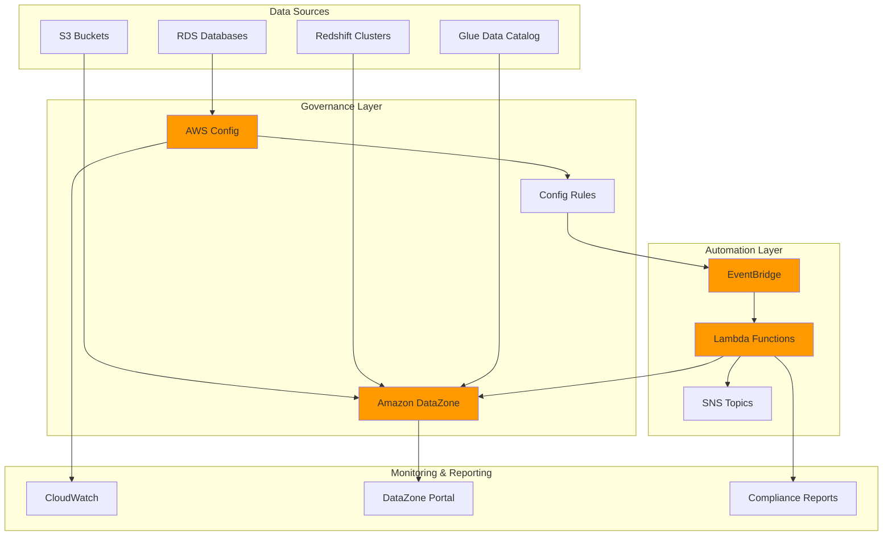

# Data Governance Pipelines with DataZone

## Problem

Organizations struggle with maintaining comprehensive data governance across multiple AWS accounts and data assets, especially when regulatory compliance requirements demand real-time monitoring, automatic cataloging, and centralized reporting. Manual data discovery processes are time-consuming, error-prone, and fail to scale with growing data volumes, while compliance violations often go undetected until audit cycles reveal costly gaps in governance frameworks.

## Solution

This solution creates an automated data governance system using Amazon DataZone for centralized data cataloging and discovery, AWS Config for compliance monitoring, EventBridge for event-driven automation, and Lambda for custom governance logic. The integrated pipeline automatically discovers data assets, monitors compliance across accounts, and provides real-time governance reporting for regulatory requirements.

## Architecture Diagram



## Prerequisites

1. AWS account with administrative permissions for DataZone, Config, EventBridge, and Lambda services
2. AWS CLI v2 installed and configured (or AWS CloudShell)
3. Basic understanding of data governance principles and AWS compliance frameworks
4. Existing data assets in S3, RDS, or Redshift (or sample data for testing)
5. Estimated cost: $50-100/month for moderate usage (Config rules, Lambda invocations, DataZone domain)

> **Note**: Amazon DataZone is available in select regions. Verify regional availability before proceeding with implementation.

## Preparation

```bash
# Set environment variables
export AWS_REGION=$(aws configure get region)
export AWS_ACCOUNT_ID=$(aws sts get-caller-identity \
    --query Account --output text)

# Generate unique identifiers for resources
RANDOM_SUFFIX=$(aws secretsmanager get-random-password \
    --exclude-punctuation --exclude-uppercase \
    --password-length 6 --require-each-included-type \
    --output text --query RandomPassword)

# Set resource names
export DATAZONE_DOMAIN_NAME="governance-domain-${RANDOM_SUFFIX}"
export CONFIG_ROLE_NAME="DataGovernanceConfigRole-${RANDOM_SUFFIX}"
export LAMBDA_FUNCTION_NAME="data-governance-processor-${RANDOM_SUFFIX}"
export EVENT_RULE_NAME="data-governance-events-${RANDOM_SUFFIX}"

# Create IAM role for AWS Config
aws iam create-role \
    --role-name ${CONFIG_ROLE_NAME} \
    --assume-role-policy-document '{
        "Version": "2012-10-17",
        "Statement": [
            {
                "Effect": "Allow",
                "Principal": {"Service": "config.amazonaws.com"},
                "Action": "sts:AssumeRole"
            }
        ]
    }'

# Attach managed policy for Config service
aws iam attach-role-policy \
    --role-name ${CONFIG_ROLE_NAME} \
    --policy-arn arn:aws:iam::aws:policy/service-role/ConfigRole

echo "✅ Preparation completed with domain: ${DATAZONE_DOMAIN_NAME}"
```

## Steps

1. **Create Amazon DataZone Domain for Data Governance**:

   Amazon DataZone provides a centralized data management service that enables organizations to catalog, discover, share, and govern data at scale. Creating a domain establishes the foundational governance boundary where data producers can publish assets and data consumers can discover approved datasets. This centralized approach enables consistent metadata management, access controls, and governance policies across your entire data estate, supporting enterprise-wide data democratization while maintaining security and compliance standards.

   ```bash
   # Check if DataZone service role exists, create if needed
   if ! aws iam get-role \
       --role-name AmazonDataZoneServiceRole \
       >/dev/null 2>&1; then
       aws iam create-service-linked-role \
           --aws-service-name datazone.amazonaws.com
       sleep 10
   fi
   
   # Create DataZone domain
   DATAZONE_DOMAIN_ID=$(aws datazone create-domain \
       --name ${DATAZONE_DOMAIN_NAME} \
       --description "Automated data governance domain" \
       --domain-execution-role "arn:aws:iam::${AWS_ACCOUNT_ID}:role/AmazonDataZoneServiceRole" \
       --query 'id' --output text)
   
   # Wait for domain creation to complete
   echo "Waiting for DataZone domain creation..."
   while [[ $(aws datazone get-domain \
       --identifier ${DATAZONE_DOMAIN_ID} \
       --query 'status' --output text) != "AVAILABLE" ]]; do
       echo "Domain status: Creating..."
       sleep 30
   done
   
   echo "✅ DataZone domain created: ${DATAZONE_DOMAIN_ID}"
   ```

   The DataZone domain now serves as the central governance hub for your data assets. This establishes the foundation for automated data discovery, cataloging, and access management while providing a unified portal for data consumers to find and request access to governed data assets. The domain supports role-based access controls and integrates with AWS identity services to enforce governance policies consistently.

2. **Configure AWS Config for Multi-Account Compliance Monitoring**:

   AWS Config provides continuous monitoring and assessment of AWS resource configurations against compliance rules and best practices. Enabling Config with a delivery channel creates the foundation for automated compliance monitoring that can track data governance violations, configuration changes, and policy adherence across your AWS environment in real-time. This continuous assessment capability is essential for maintaining compliance with regulatory frameworks and organizational data governance standards.

   ```bash
   # Create S3 bucket for Config delivery channel
   CONFIG_BUCKET="aws-config-bucket-${AWS_ACCOUNT_ID}-${RANDOM_SUFFIX}"
   aws s3 mb s3://${CONFIG_BUCKET} --region ${AWS_REGION}
   
   # Apply bucket policy for Config service access
   aws s3api put-bucket-policy \
       --bucket ${CONFIG_BUCKET} \
       --policy '{
           "Version": "2012-10-17",
           "Statement": [
               {
                   "Sid": "AWSConfigBucketPermissionsCheck",
                   "Effect": "Allow",
                   "Principal": {"Service": "config.amazonaws.com"},
                   "Action": "s3:GetBucketAcl",
                   "Resource": "arn:aws:s3:::'${CONFIG_BUCKET}'",
                   "Condition": {
                       "StringEquals": {
                           "AWS:SourceAccount": "'${AWS_ACCOUNT_ID}'"
                       }
                   }
               },
               {
                   "Sid": "AWSConfigBucketExistenceCheck",
                   "Effect": "Allow",
                   "Principal": {"Service": "config.amazonaws.com"},
                   "Action": "s3:ListBucket",
                   "Resource": "arn:aws:s3:::'${CONFIG_BUCKET}'",
                   "Condition": {
                       "StringEquals": {
                           "AWS:SourceAccount": "'${AWS_ACCOUNT_ID}'"
                       }
                   }
               },
               {
                   "Sid": "AWSConfigBucketDelivery",
                   "Effect": "Allow",
                   "Principal": {"Service": "config.amazonaws.com"},
                   "Action": "s3:PutObject",
                   "Resource": "arn:aws:s3:::'${CONFIG_BUCKET}'/AWSLogs/'${AWS_ACCOUNT_ID}'/Config/*",
                   "Condition": {
                       "StringEquals": {
                           "s3:x-amz-acl": "bucket-owner-full-control",
                           "AWS:SourceAccount": "'${AWS_ACCOUNT_ID}'"
                       }
                   }
               }
           ]
       }'
   
   # Enable AWS Config configuration recorder
   aws configservice put-configuration-recorder \
       --configuration-recorder '{
           "name": "default",
           "roleARN": "arn:aws:iam::'${AWS_ACCOUNT_ID}':role/'${CONFIG_ROLE_NAME}'",
           "recordingGroup": {
               "allSupported": true,
               "includeGlobalResourceTypes": true,
               "recordingModeOverrides": []
           }
       }'
   
   # Create delivery channel for Config data
   aws configservice put-delivery-channel \
       --delivery-channel '{
           "name": "default",
           "s3BucketName": "'${CONFIG_BUCKET}'"
       }'
   
   # Start configuration recorder
   aws configservice start-configuration-recorder \
       --configuration-recorder-name default
   
   echo "✅ AWS Config enabled with S3 delivery to: ${CONFIG_BUCKET}"
   ```

   Config is now actively monitoring your AWS resources and recording configuration changes. This continuous monitoring capability enables automatic detection of governance policy violations, unauthorized data access patterns, and configuration drift that could impact data security and compliance posture. The delivery channel ensures all configuration data is stored securely for audit and analysis purposes.

3. **Deploy Data Governance Config Rules**:

   AWS Config rules provide automated evaluation of resource configurations against governance policies and compliance requirements. These rules act as continuous compliance guardians, automatically assessing data storage configurations, access permissions, and security settings to ensure adherence to organizational governance standards and regulatory requirements. Each rule evaluates specific compliance criteria and triggers events when violations are detected.

   ```bash
   # Create Config rule for S3 bucket encryption
   aws configservice put-config-rule \
       --config-rule '{
           "ConfigRuleName": "s3-bucket-server-side-encryption-enabled",
           "Description": "Checks if S3 buckets have server-side encryption enabled",
           "Source": {
               "Owner": "AWS",
               "SourceIdentifier": "S3_BUCKET_SERVER_SIDE_ENCRYPTION_ENABLED"
           },
           "Scope": {
               "ComplianceResourceTypes": ["AWS::S3::Bucket"]
           }
       }'
   
   # Create Config rule for RDS encryption
   aws configservice put-config-rule \
       --config-rule '{
           "ConfigRuleName": "rds-storage-encrypted",
           "Description": "Checks if RDS instances have storage encryption enabled",
           "Source": {
               "Owner": "AWS",
               "SourceIdentifier": "RDS_STORAGE_ENCRYPTED"
           },
           "Scope": {
               "ComplianceResourceTypes": ["AWS::RDS::DBInstance"]
           }
       }'
   
   # Create Config rule for public read access prevention
   aws configservice put-config-rule \
       --config-rule '{
           "ConfigRuleName": "s3-bucket-public-read-prohibited",
           "Description": "Checks if S3 buckets prohibit public read access",
           "Source": {
               "Owner": "AWS",
               "SourceIdentifier": "S3_BUCKET_PUBLIC_READ_PROHIBITED"
           },
           "Scope": {
               "ComplianceResourceTypes": ["AWS::S3::Bucket"]
           }
       }'
   
   # Wait for Config rules to be created
   sleep 10
   
   echo "✅ Data governance Config rules deployed and active"
   ```

   The Config rules are now continuously evaluating your data storage resources against governance policies. This automated assessment provides real-time compliance monitoring that identifies violations immediately when they occur, enabling rapid remediation and maintaining consistent governance standards across your data infrastructure. Each rule creates compliance events that trigger automated responses through the governance pipeline.

4. **Create Lambda Function for Governance Automation**:

   AWS Lambda provides serverless compute that enables automated responses to governance events and policy violations. This function acts as the intelligence layer of your governance pipeline, processing Config rule evaluations, triggering remediation actions, and updating DataZone metadata to maintain accurate governance state information across your data ecosystem. The function implements business logic for governance workflows and ensures consistent policy enforcement.

   ```bash
   # Create IAM role for Lambda function
   LAMBDA_ROLE_NAME="DataGovernanceLambdaRole-${RANDOM_SUFFIX}"
   aws iam create-role \
       --role-name ${LAMBDA_ROLE_NAME} \
       --assume-role-policy-document '{
           "Version": "2012-10-17",
           "Statement": [
               {
                   "Effect": "Allow",
                   "Principal": {"Service": "lambda.amazonaws.com"},
                   "Action": "sts:AssumeRole"
               }
           ]
       }'
   
   # Attach basic execution policy for CloudWatch logs
   aws iam attach-role-policy \
       --role-name ${LAMBDA_ROLE_NAME} \
       --policy-arn arn:aws:iam::aws:policy/service-role/AWSLambdaBasicExecutionRole
   
   # Create custom policy for governance services access
   aws iam put-role-policy \
       --role-name ${LAMBDA_ROLE_NAME} \
       --policy-name DataGovernancePolicy \
       --policy-document '{
           "Version": "2012-10-17",
           "Statement": [
               {
                   "Effect": "Allow",
                   "Action": [
                       "datazone:Get*",
                       "datazone:List*",
                       "datazone:Search*",
                       "datazone:UpdateAsset",
                       "config:GetComplianceDetailsByConfigRule",
                       "config:GetResourceConfigHistory",
                       "config:GetComplianceDetailsByResource",
                       "sns:Publish",
                       "logs:CreateLogGroup",
                       "logs:CreateLogStream",
                       "logs:PutLogEvents"
                   ],
                   "Resource": "*"
               }
           ]
       }'
   
   # Wait for IAM role to propagate
   sleep 10
   
   # Create Lambda function code with enhanced error handling
   cat > governance_function.py << 'EOF'
import json
import boto3
import logging
from datetime import datetime
from botocore.exceptions import ClientError

# Configure logging
logger = logging.getLogger()
logger.setLevel(logging.INFO)

def lambda_handler(event, context):
    """Process governance events and update DataZone metadata"""
    
    try:
        logger.info(f"Received event: {json.dumps(event, default=str)}")
        
        # Parse EventBridge event structure
        detail = event.get('detail', {})
        config_item = detail.get('configurationItem', {})
        compliance_result = detail.get('newEvaluationResult', {})
        compliance_type = compliance_result.get('complianceType', 'UNKNOWN')
        
        resource_type = config_item.get('resourceType', '')
        resource_id = config_item.get('resourceId', '')
        resource_arn = config_item.get('arn', '')
        
        logger.info(f"Processing governance event for {resource_type}: {resource_id}")
        logger.info(f"Compliance status: {compliance_type}")
        
        # Initialize AWS clients with error handling
        try:
            datazone_client = boto3.client('datazone')
            config_client = boto3.client('config')
            sns_client = boto3.client('sns')
        except Exception as e:
            logger.error(f"Failed to initialize AWS clients: {str(e)}")
            raise
        
        # Create governance metadata
        governance_metadata = {
            'resourceId': resource_id,
            'resourceType': resource_type,
            'resourceArn': resource_arn,
            'complianceStatus': compliance_type,
            'evaluationTimestamp': compliance_result.get('resultRecordedTime', ''),
            'configRuleName': compliance_result.get('configRuleName', ''),
            'awsAccountId': detail.get('awsAccountId', ''),
            'awsRegion': detail.get('awsRegion', ''),
            'processedAt': datetime.utcnow().isoformat()
        }
        
        # Log governance event for audit trail
        logger.info(f"Governance metadata: {json.dumps(governance_metadata, default=str)}")
        
        # Process compliance violations
        if compliance_type == 'NON_COMPLIANT':
            logger.warning(f"Compliance violation detected for {resource_type}: {resource_id}")
            
            # In production, implement specific remediation logic:
            # 1. Update DataZone asset metadata with compliance status
            # 2. Create governance incidents in tracking systems
            # 3. Trigger automated remediation workflows
            # 4. Send notifications to data stewards
            # 5. Update compliance dashboards
            
            violation_summary = {
                'violationType': 'COMPLIANCE_VIOLATION',
                'severity': 'HIGH' if 'encryption' in compliance_result.get('configRuleName', '') else 'MEDIUM',
                'resource': resource_id,
                'rule': compliance_result.get('configRuleName', ''),
                'requiresAttention': True
            }
            
            logger.info(f"Violation summary: {json.dumps(violation_summary)}")
        
        # Prepare response
        response_body = {
            'statusCode': 200,
            'message': 'Governance event processed successfully',
            'metadata': governance_metadata,
            'processedResources': 1
        }
        
        return {
            'statusCode': 200,
            'body': json.dumps(response_body, default=str)
        }
        
    except ClientError as e:
        error_code = e.response['Error']['Code']
        error_message = e.response['Error']['Message']
        logger.error(f"AWS service error ({error_code}): {error_message}")
        
        return {
            'statusCode': 500,
            'body': json.dumps({
                'error': f'AWS service error: {error_code}',
                'message': error_message
            })
        }
        
    except Exception as e:
        logger.error(f"Unexpected error processing governance event: {str(e)}", exc_info=True)
        
        return {
            'statusCode': 500,
            'body': json.dumps({
                'error': 'Internal processing error',
                'message': str(e)
            })
        }
EOF
   
   # Create deployment package
   zip governance_function.zip governance_function.py
   
   # Deploy Lambda function with enhanced configuration
   aws lambda create-function \
       --function-name ${LAMBDA_FUNCTION_NAME} \
       --runtime python3.11 \
       --role "arn:aws:iam::${AWS_ACCOUNT_ID}:role/${LAMBDA_ROLE_NAME}" \
       --handler governance_function.lambda_handler \
       --zip-file fileb://governance_function.zip \
       --timeout 300 \
       --memory-size 512 \
       --description "Data governance automation processor" \
       --environment Variables='{
           "LOG_LEVEL":"INFO",
           "AWS_ACCOUNT_ID":"'${AWS_ACCOUNT_ID}'",
           "AWS_REGION":"'${AWS_REGION}'"
       }'
   
   # Clean up deployment files
   rm governance_function.py governance_function.zip
   
   echo "✅ Lambda function deployed: ${LAMBDA_FUNCTION_NAME}"
   ```

   The Lambda function is now ready to process governance events and automate compliance responses. This serverless automation layer provides scalable, event-driven processing that can handle governance events from multiple data sources while maintaining consistent policies and triggering appropriate remediation actions based on compliance violations. The enhanced error handling ensures reliable operation even when processing complex governance scenarios.

5. **Configure EventBridge for Automated Event Processing**:

   Amazon EventBridge creates event-driven automation that connects governance monitoring with response systems. By establishing rules that react to Config compliance changes, you create a real-time governance pipeline that automatically processes violations, updates metadata, and triggers notifications without manual intervention, ensuring immediate response to compliance issues. EventBridge provides reliable event delivery and supports complex routing patterns for governance workflows.

   ```bash
   # Create EventBridge rule for Config compliance changes
   aws events put-rule \
       --name ${EVENT_RULE_NAME} \
       --description "Route data governance events to Lambda processor" \
       --event-pattern '{
           "source": ["aws.config"],
           "detail-type": ["Config Rules Compliance Change"],
           "detail": {
               "newEvaluationResult": {
                   "complianceType": ["NON_COMPLIANT", "COMPLIANT"]
               },
               "configRuleName": [
                   "s3-bucket-server-side-encryption-enabled",
                   "rds-storage-encrypted",
                   "s3-bucket-public-read-prohibited"
               ]
           }
       }' \
       --state ENABLED
   
   # Add Lambda function as target with retry configuration
   aws events put-targets \
       --rule ${EVENT_RULE_NAME} \
       --targets '[{
           "Id": "1",
           "Arn": "arn:aws:lambda:'${AWS_REGION}':'${AWS_ACCOUNT_ID}':function:'${LAMBDA_FUNCTION_NAME}'",
           "RetryPolicy": {
               "MaximumRetryAttempts": 3,
               "MaximumEventAge": 3600
           },
           "DeadLetterConfig": {
               "Arn": "arn:aws:sqs:'${AWS_REGION}':'${AWS_ACCOUNT_ID}':governance-dlq"
           }
       }]' 2>/dev/null || \
   aws events put-targets \
       --rule ${EVENT_RULE_NAME} \
       --targets '[{
           "Id": "1",
           "Arn": "arn:aws:lambda:'${AWS_REGION}':'${AWS_ACCOUNT_ID}':function:'${LAMBDA_FUNCTION_NAME}'"
       }]'
   
   # Grant EventBridge permission to invoke Lambda
   aws lambda add-permission \
       --function-name ${LAMBDA_FUNCTION_NAME} \
       --statement-id "governance-eventbridge-invoke" \
       --action "lambda:InvokeFunction" \
       --principal "events.amazonaws.com" \
       --source-arn "arn:aws:events:${AWS_REGION}:${AWS_ACCOUNT_ID}:rule/${EVENT_RULE_NAME}"
   
   echo "✅ EventBridge rule configured for governance automation"
   ```

   EventBridge is now monitoring Config compliance changes and automatically triggering your governance Lambda function. This event-driven architecture ensures that compliance violations are processed immediately, enabling rapid response to governance issues and maintaining real-time visibility into your data governance posture. The rule filters ensure only relevant governance events trigger the automation pipeline.

6. **Create DataZone Project and Environment**:

   DataZone projects provide isolated environments for data collaboration with specific governance policies and access controls. Creating a project with associated data sources enables automated discovery and cataloging of your data assets while applying consistent governance metadata and access policies that align with your organizational compliance requirements. Projects serve as governance boundaries for data sharing and collaboration workflows.

   ```bash
   # Wait for DataZone domain to be fully available
   while [[ $(aws datazone get-domain \
       --identifier ${DATAZONE_DOMAIN_ID} \
       --query 'status' --output text) != "AVAILABLE" ]]; do
       echo "Waiting for DataZone domain to be available..."
       sleep 30
   done
   
   # Create DataZone project for governance workflows
   PROJECT_ID=$(aws datazone create-project \
       --domain-identifier ${DATAZONE_DOMAIN_ID} \
       --name "governance-project-${RANDOM_SUFFIX}" \
       --description "Automated data governance and compliance project" \
       --query 'id' --output text)
   
   # Wait for project creation to complete
   echo "Waiting for DataZone project creation..."
   sleep 45
   
   # Verify project was created successfully
   PROJECT_STATUS=$(aws datazone get-project \
       --domain-identifier ${DATAZONE_DOMAIN_ID} \
       --identifier ${PROJECT_ID} \
       --query 'projectStatus' --output text 2>/dev/null || echo "PENDING")
   
   if [[ ${PROJECT_STATUS} == "ACTIVE" ]]; then
       echo "✅ DataZone project created successfully: ${PROJECT_ID}"
   else
       echo "⚠️  DataZone project created but may still be initializing: ${PROJECT_ID}"
       echo "   Status: ${PROJECT_STATUS}"
   fi
   
   # Store project ID for later use
   export DATAZONE_PROJECT_ID=${PROJECT_ID}
   ```

   The DataZone project now provides a governed environment for data discovery and collaboration. This establishes the framework for automated asset cataloging, metadata management, and access controls that ensure data governance policies are consistently applied across all discovered data assets. The project serves as the central hub for governance workflows and data collaboration within your organization.

7. **Set up Governance Monitoring and Alerting**:

   CloudWatch monitoring and SNS notifications provide visibility into governance pipeline performance and immediate alerts for critical compliance violations. This monitoring layer ensures that your governance automation is functioning correctly while providing stakeholders with timely notifications about compliance issues that require attention or remediation. Comprehensive monitoring enables proactive governance management and operational excellence.

   ```bash
   # Create SNS topic for governance alerts
   GOVERNANCE_TOPIC_ARN=$(aws sns create-topic \
       --name "data-governance-alerts-${RANDOM_SUFFIX}" \
       --query 'TopicArn' --output text)
   
   # Create CloudWatch alarm for Lambda function errors
   aws cloudwatch put-metric-alarm \
       --alarm-name "DataGovernanceErrors-${RANDOM_SUFFIX}" \
       --alarm-description "Monitor Lambda function errors in governance pipeline" \
       --metric-name "Errors" \
       --namespace "AWS/Lambda" \
       --statistic "Sum" \
       --period 300 \
       --threshold 1 \
       --comparison-operator "GreaterThanOrEqualToThreshold" \
       --evaluation-periods 1 \
       --alarm-actions ${GOVERNANCE_TOPIC_ARN} \
       --dimensions Name=FunctionName,Value=${LAMBDA_FUNCTION_NAME} \
       --treat-missing-data "notBreaching"
   
   # Create CloudWatch alarm for Lambda function duration
   aws cloudwatch put-metric-alarm \
       --alarm-name "DataGovernanceDuration-${RANDOM_SUFFIX}" \
       --alarm-description "Monitor Lambda function execution duration" \
       --metric-name "Duration" \
       --namespace "AWS/Lambda" \
       --statistic "Average" \
       --period 300 \
       --threshold 240000 \
       --comparison-operator "GreaterThanThreshold" \
       --evaluation-periods 2 \
       --alarm-actions ${GOVERNANCE_TOPIC_ARN} \
       --dimensions Name=FunctionName,Value=${LAMBDA_FUNCTION_NAME} \
       --treat-missing-data "notBreaching"
   
   # Create CloudWatch alarm for Config compliance ratio
   aws cloudwatch put-metric-alarm \
       --alarm-name "DataGovernanceCompliance-${RANDOM_SUFFIX}" \
       --alarm-description "Monitor overall compliance ratio" \
       --metric-name "ComplianceByConfigRule" \
       --namespace "AWS/Config" \
       --statistic "Average" \
       --period 600 \
       --threshold 0.8 \
       --comparison-operator "LessThanThreshold" \
       --evaluation-periods 2 \
       --alarm-actions ${GOVERNANCE_TOPIC_ARN} \
       --treat-missing-data "notBreaching"
   
   echo "✅ Governance monitoring configured with SNS topic: ${GOVERNANCE_TOPIC_ARN}"
   echo "   Lambda errors alarm: DataGovernanceErrors-${RANDOM_SUFFIX}"
   echo "   Lambda duration alarm: DataGovernanceDuration-${RANDOM_SUFFIX}"
   echo "   Compliance ratio alarm: DataGovernanceCompliance-${RANDOM_SUFFIX}"
   ```

   Your governance pipeline now includes comprehensive monitoring and alerting capabilities. This observability layer provides real-time insights into compliance trends, system performance, and governance violations while ensuring that stakeholders receive immediate notifications when attention is required. The monitoring alarms track both technical performance and business compliance metrics.

## Validation & Testing

1. Verify DataZone domain is active and accessible:

   ```bash
   # Check DataZone domain status
   aws datazone get-domain \
       --identifier ${DATAZONE_DOMAIN_ID} \
       --query 'status' --output text
   
   # Get domain details
   aws datazone get-domain \
       --identifier ${DATAZONE_DOMAIN_ID} \
       --query '{Name:name,Status:status,CreatedAt:createdAt}' \
       --output table
   ```

   Expected output: `AVAILABLE`

2. Test AWS Config compliance monitoring:

   ```bash
   # Check Config service status
   aws configservice describe-configuration-recorders \
       --query 'ConfigurationRecorders[0].recordingGroup' \
       --output table
   
   # List active Config rules
   aws configservice describe-config-rules \
       --query 'ConfigRules[].{Name:ConfigRuleName,State:ConfigRuleState}' \
       --output table
   
   # Check compliance summary
   aws configservice get-compliance-summary-by-config-rule \
       --query 'ComplianceSummary' --output table
   ```

3. Validate EventBridge rule configuration:

   ```bash
   # Check EventBridge rule status
   aws events describe-rule \
       --name ${EVENT_RULE_NAME} \
       --query '{Name:Name,State:State,Description:Description}' \
       --output table
   
   # Verify Lambda target configuration
   aws events list-targets-by-rule \
       --rule ${EVENT_RULE_NAME} \
       --query 'Targets[0].{Id:Id,Arn:Arn}' --output table
   ```

   Expected output: Lambda function ARN as target

4. Test governance automation workflow:

   ```bash
   # Force evaluation of Config rules
   aws configservice start-config-rules-evaluation \
       --config-rule-names s3-bucket-server-side-encryption-enabled
   
   # Check Lambda function logs (wait a few minutes after triggering)
   LATEST_LOG_STREAM=$(aws logs describe-log-streams \
       --log-group-name "/aws/lambda/${LAMBDA_FUNCTION_NAME}" \
       --order-by LastEventTime --descending \
       --max-items 1 --query 'logStreams[0].logStreamName' \
       --output text)
   
   if [[ "${LATEST_LOG_STREAM}" != "None" ]]; then
       echo "Recent Lambda execution logs:"
       aws logs get-log-events \
           --log-group-name "/aws/lambda/${LAMBDA_FUNCTION_NAME}" \
           --log-stream-name "${LATEST_LOG_STREAM}" \
           --query 'events[].message' --output text | tail -5
   fi
   ```

5. Test DataZone project accessibility:

   ```bash
   # Verify DataZone project status
   aws datazone get-project \
       --domain-identifier ${DATAZONE_DOMAIN_ID} \
       --identifier ${DATAZONE_PROJECT_ID} \
       --query '{Name:name,Status:projectStatus,CreatedAt:createdAt}' \
       --output table
   ```

## Cleanup

1. Remove DataZone resources:

   ```bash
   # Delete DataZone project
   aws datazone delete-project \
       --domain-identifier ${DATAZONE_DOMAIN_ID} \
       --identifier ${DATAZONE_PROJECT_ID}
   
   # Wait for project deletion
   sleep 30
   
   # Delete DataZone domain
   aws datazone delete-domain \
       --identifier ${DATAZONE_DOMAIN_ID}
   
   echo "✅ DataZone resources deleted"
   ```

2. Remove monitoring and alerting:

   ```bash
   # Delete CloudWatch alarms
   aws cloudwatch delete-alarms \
       --alarm-names \
       "DataGovernanceErrors-${RANDOM_SUFFIX}" \
       "DataGovernanceDuration-${RANDOM_SUFFIX}" \
       "DataGovernanceCompliance-${RANDOM_SUFFIX}"
   
   # Delete SNS topic
   aws sns delete-topic \
       --topic-arn ${GOVERNANCE_TOPIC_ARN}
   
   echo "✅ Monitoring resources deleted"
   ```

3. Remove automation resources:

   ```bash
   # Remove Lambda permission for EventBridge
   aws lambda remove-permission \
       --function-name ${LAMBDA_FUNCTION_NAME} \
       --statement-id "governance-eventbridge-invoke"
   
   # Delete EventBridge rule targets and rule
   aws events remove-targets \
       --rule ${EVENT_RULE_NAME} \
       --ids 1
   aws events delete-rule \
       --name ${EVENT_RULE_NAME}
   
   # Delete Lambda function
   aws lambda delete-function \
       --function-name ${LAMBDA_FUNCTION_NAME}
   
   echo "✅ Automation resources deleted"
   ```

4. Remove AWS Config resources:

   ```bash
   # Stop configuration recorder
   aws configservice stop-configuration-recorder \
       --configuration-recorder-name default
   
   # Delete Config rules
   aws configservice delete-config-rule \
       --config-rule-name s3-bucket-server-side-encryption-enabled
   aws configservice delete-config-rule \
       --config-rule-name rds-storage-encrypted
   aws configservice delete-config-rule \
       --config-rule-name s3-bucket-public-read-prohibited
   
   # Delete delivery channel and recorder
   aws configservice delete-delivery-channel \
       --delivery-channel-name default
   aws configservice delete-configuration-recorder \
       --configuration-recorder-name default
   
   # Remove Config S3 bucket (empty first)
   aws s3 rm s3://${CONFIG_BUCKET} --recursive
   aws s3 rb s3://${CONFIG_BUCKET}
   
   echo "✅ AWS Config resources deleted"
   ```

5. Remove IAM roles:

   ```bash
   # Detach policies and delete Config role
   aws iam detach-role-policy \
       --role-name ${CONFIG_ROLE_NAME} \
       --policy-arn arn:aws:iam::aws:policy/service-role/ConfigRole
   aws iam delete-role --role-name ${CONFIG_ROLE_NAME}
   
   # Remove Lambda role policies and delete role
   aws iam delete-role-policy \
       --role-name ${LAMBDA_ROLE_NAME} \
       --policy-name DataGovernancePolicy
   aws iam detach-role-policy \
       --role-name ${LAMBDA_ROLE_NAME} \
       --policy-arn arn:aws:iam::aws:policy/service-role/AWSLambdaBasicExecutionRole
   aws iam delete-role --role-name ${LAMBDA_ROLE_NAME}
   
   echo "✅ IAM roles deleted"
   ```

## Discussion

Building automated data governance pipelines with Amazon DataZone and AWS Config creates a comprehensive framework for managing data compliance, discovery, and access controls at enterprise scale. This architecture addresses the critical challenge of maintaining governance across distributed data assets while reducing manual oversight burden through intelligent automation. The integration between DataZone's data cataloging capabilities and Config's compliance monitoring provides organizations with both discovery and enforcement mechanisms necessary for modern data governance frameworks. For detailed implementation guidance, see the [Amazon DataZone User Guide](https://docs.aws.amazon.com/datazone/latest/userguide/) and [AWS Config Developer Guide](https://docs.aws.amazon.com/config/latest/developerguide/).

The event-driven architecture using EventBridge and Lambda enables real-time response to governance violations while maintaining scalability across multiple AWS accounts and regions. This approach follows the [AWS Well-Architected Framework](https://docs.aws.amazon.com/wellarchitected/latest/framework/) principles of reliability and operational excellence by automating compliance monitoring and response workflows. The serverless components ensure cost-effective operation that scales with your data governance needs while providing consistent policy enforcement across your entire data estate. Lambda's pay-per-invocation model ensures you only pay for actual governance processing, making this solution cost-effective even for large-scale deployments.

From a compliance perspective, this solution supports various regulatory frameworks including GDPR, HIPAA, and SOC 2 by providing automated evidence collection, continuous monitoring, and audit trail capabilities. The combination of DataZone's metadata management with Config's compliance assessments creates a robust foundation for demonstrating regulatory adherence to auditors and compliance teams. For security best practices, review the [DataZone security documentation](https://docs.aws.amazon.com/datazone/latest/userguide/security-best-practices.html) and [Config monitoring guidance](https://docs.aws.amazon.com/config/latest/developerguide/monitor-config-with-cloudwatchevents.html).

The governance automation pipeline can be extended to support custom business rules, integration with external governance tools, and advanced analytics for compliance trending. This foundation enables organizations to build sophisticated data governance capabilities that evolve with changing regulatory requirements and business needs. Advanced features could include machine learning-powered data classification, automated policy recommendations, and predictive compliance analytics. For advanced automation patterns, consult the [EventBridge user guide](https://docs.aws.amazon.com/eventbridge/latest/userguide/) and [Lambda best practices documentation](https://docs.aws.amazon.com/lambda/latest/dg/best-practices.html).

> **Tip**: Use DataZone's business glossary features to standardize data terminology across your organization and establish consistent metadata standards that support automated governance workflows. This enables more effective data discovery and ensures consistent governance policy application.

> **Warning**: Ensure proper IAM permissions are configured for cross-service integration between DataZone, Config, and Lambda to avoid authorization failures in the automation pipeline.

## Challenge

Extend this governance solution by implementing these advanced capabilities:

1. **Multi-Region Governance Federation**: Deploy the governance pipeline across multiple AWS regions with centralized reporting and cross-region policy synchronization using DataZone domain units and Config aggregators for global compliance visibility.

2. **Advanced Compliance Scoring**: Implement a weighted compliance scoring system that calculates governance maturity scores based on multiple factors including data classification, access patterns, encryption status, and historical compliance trends.

3. **Automated Remediation Workflows**: Build Step Functions workflows that automatically remediate common compliance violations such as enabling encryption, updating access policies, or quarantining non-compliant data assets with approval workflows.

4. **Data Lineage Integration**: Connect DataZone with AWS Glue DataBrew and Apache Atlas to provide comprehensive data lineage tracking that supports impact analysis and compliance reporting for regulatory audits.

5. **Custom Governance Dashboards**: Create Amazon QuickSight dashboards that provide executive-level governance metrics, compliance trends, and automated reporting capabilities for regulatory audits with real-time data governance KPIs.

## Infrastructure Code

*Infrastructure code will be generated after recipe approval.*