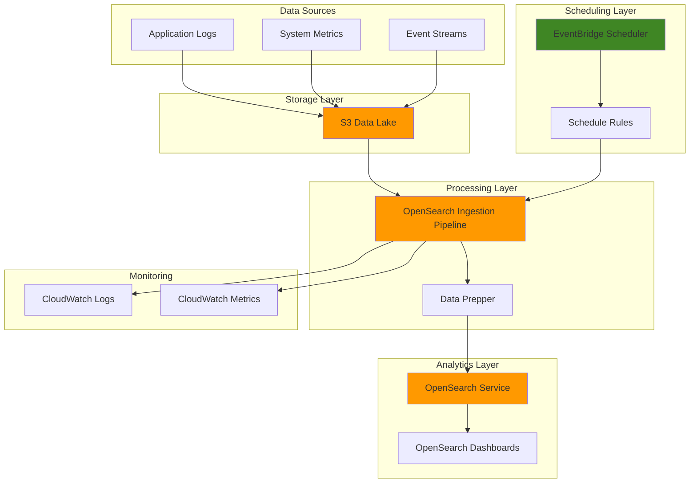

# OpenSearch Data Ingestion Pipelines

## Problem

Organizations struggle with manual data ingestion processes that result in delayed analytics insights, inconsistent data processing schedules, and operational overhead. Business-critical decisions are delayed when data from multiple sources like application logs, metrics, and event streams aren't automatically processed and indexed for real-time analysis. Traditional batch processing approaches can't meet the demands of modern applications that require immediate visibility into system performance and user behavior.

## Solution

This solution creates automated data ingestion pipelines using Amazon OpenSearch Ingestion for real-time data processing and EventBridge Scheduler for orchestrating pipeline operations. The architecture combines S3 as a data lake for raw data storage with OpenSearch Ingestion's serverless data processing capabilities, enabling automatic data transformation and indexing. EventBridge Scheduler provides precise timing control for pipeline operations, ensuring data is processed efficiently during optimal time windows while maintaining cost effectiveness through automated start/stop scheduling.

## Architecture Diagram



## Prerequisites

1. AWS account with appropriate permissions for OpenSearch, EventBridge, S3, and IAM services
2. AWS CLI v2 installed and configured (or AWS CloudShell)
3. Basic understanding of data ingestion concepts and YAML configuration
4. Familiarity with OpenSearch and data analytics workflows
5. Estimated cost: $50-100/month for test environment (varies by data volume and processing time)

> **Note**: OpenSearch Ingestion is available in select AWS regions. Verify service availability in your target region before proceeding.

## Preparation

```bash
# Set environment variables
export AWS_REGION=$(aws configure get region)
export AWS_ACCOUNT_ID=$(aws sts get-caller-identity \
    --query Account --output text)

# Generate unique identifiers for resources
RANDOM_SUFFIX=$(aws secretsmanager get-random-password \
    --exclude-punctuation --exclude-uppercase \
    --password-length 6 --require-each-included-type \
    --output text --query RandomPassword)

# Set resource names
export BUCKET_NAME="data-ingestion-${RANDOM_SUFFIX}"
export OPENSEARCH_DOMAIN="analytics-domain-${RANDOM_SUFFIX}"
export PIPELINE_NAME="data-pipeline-${RANDOM_SUFFIX}"
export SCHEDULE_GROUP_NAME="ingestion-schedules-${RANDOM_SUFFIX}"
export PIPELINE_ROLE_NAME="OpenSearchIngestionRole-${RANDOM_SUFFIX}"

# Create S3 bucket for data storage
aws s3 mb s3://${BUCKET_NAME} --region ${AWS_REGION}

aws s3api put-bucket-versioning \
    --bucket ${BUCKET_NAME} \
    --versioning-configuration Status=Enabled

aws s3api put-bucket-encryption \
    --bucket ${BUCKET_NAME} \
    --server-side-encryption-configuration \
    'Rules=[{ApplyServerSideEncryptionByDefault:{SSEAlgorithm:AES256}}]'

echo "✅ AWS environment configured with S3 bucket: ${BUCKET_NAME}"
```

## Steps

1. **Create OpenSearch Service Domain**:

   Amazon OpenSearch Service provides a managed search and analytics engine that serves as the destination for our ingested data. This domain will store and index processed data, enabling real-time search capabilities and analytics dashboards. The domain configuration includes security settings and appropriate instance sizing for analytics workloads.

   ```bash
   # Create OpenSearch domain configuration
   cat > domain-config.json << EOF
   {
     "DomainName": "${OPENSEARCH_DOMAIN}",
     "EngineVersion": "OpenSearch_2.3",
     "ClusterConfig": {
       "InstanceType": "t3.small.search",
       "InstanceCount": 1,
       "DedicatedMasterEnabled": false
     },
     "EBSOptions": {
       "EBSEnabled": true,
       "VolumeType": "gp3",
       "VolumeSize": 20
     },
     "AccessPolicies": "{\"Version\":\"2012-10-17\",\"Statement\":[{\"Effect\":\"Allow\",\"Principal\":{\"AWS\":\"arn:aws:iam::${AWS_ACCOUNT_ID}:root\"},\"Action\":\"es:*\",\"Resource\":\"arn:aws:es:${AWS_REGION}:${AWS_ACCOUNT_ID}:domain/${OPENSEARCH_DOMAIN}/*\"}]}",
     "DomainEndpointOptions": {
       "EnforceHTTPS": true
     },
     "EncryptionAtRestOptions": {
       "Enabled": true
     },
     "NodeToNodeEncryptionOptions": {
       "Enabled": true
     }
   }
   EOF
   
   # Create the OpenSearch domain
   aws opensearch create-domain \
       --cli-input-json file://domain-config.json
   
   echo "✅ OpenSearch domain creation initiated"
   ```

   The OpenSearch domain is now being created with enterprise-grade security features including encryption at rest and in transit. This provides the foundation for our analytics platform with built-in search capabilities and dashboard visualization tools.

2. **Create IAM Role for OpenSearch Ingestion**:

   OpenSearch Ingestion requires a dedicated IAM role to access source data in S3 and write processed data to the OpenSearch domain. This role implements the principle of least privilege by granting only the necessary permissions for pipeline operations, ensuring secure access to resources while maintaining operational efficiency.

   ```bash
   # Create trust policy for OpenSearch Ingestion
   cat > trust-policy.json << EOF
   {
     "Version": "2012-10-17",
     "Statement": [
       {
         "Effect": "Allow",
         "Principal": {
           "Service": "osis-pipelines.amazonaws.com"
         },
         "Action": "sts:AssumeRole"
       }
     ]
   }
   EOF
   
   # Create permission policy for the role
   cat > permissions-policy.json << EOF
   {
     "Version": "2012-10-17",
     "Statement": [
       {
         "Effect": "Allow",
         "Action": [
           "s3:GetObject",
           "s3:ListBucket"
         ],
         "Resource": [
           "arn:aws:s3:::${BUCKET_NAME}",
           "arn:aws:s3:::${BUCKET_NAME}/*"
         ]
       },
       {
         "Effect": "Allow",
         "Action": [
           "es:ESHttpPost",
           "es:ESHttpPut"
         ],
         "Resource": "arn:aws:es:${AWS_REGION}:${AWS_ACCOUNT_ID}:domain/${OPENSEARCH_DOMAIN}/*"
       }
     ]
   }
   EOF
   
   # Create the IAM role
   aws iam create-role \
       --role-name ${PIPELINE_ROLE_NAME} \
       --assume-role-policy-document file://trust-policy.json
   
   # Attach the permissions policy
   aws iam put-role-policy \
       --role-name ${PIPELINE_ROLE_NAME} \
       --policy-name OpenSearchIngestionPolicy \
       --policy-document file://permissions-policy.json
   
   export PIPELINE_ROLE_ARN="arn:aws:iam::${AWS_ACCOUNT_ID}:role/${PIPELINE_ROLE_NAME}"
   
   echo "✅ IAM role created: ${PIPELINE_ROLE_ARN}"
   ```

   The IAM role is configured with precise permissions for accessing S3 data sources and writing to the OpenSearch domain. This security configuration ensures that the ingestion pipeline operates within defined boundaries while maintaining the necessary access for data processing operations.

3. **Wait for OpenSearch Domain to be Ready**:

   OpenSearch domain creation typically takes 10-15 minutes to complete. The domain must be in an active state before we can configure the ingestion pipeline to ensure proper connectivity and access permissions. This waiting period allows all domain resources to be fully provisioned and ready for data ingestion.

   ```bash
   # Wait for OpenSearch domain to be ready
   echo "⏳ Waiting for OpenSearch domain to be ready..."
   aws opensearch wait domain-available \
       --domain-name ${OPENSEARCH_DOMAIN}
   
   # Get domain endpoint
   export OPENSEARCH_ENDPOINT=$(aws opensearch describe-domain \
       --domain-name ${OPENSEARCH_DOMAIN} \
       --query 'DomainStatus.Endpoint' --output text)
   
   echo "✅ OpenSearch domain is ready at: https://${OPENSEARCH_ENDPOINT}"
   ```

   The OpenSearch domain is now active and ready to receive data. The domain endpoint provides the connection point for our ingestion pipeline and will be used in the pipeline configuration to establish the data flow destination.

4. **Create OpenSearch Ingestion Pipeline Configuration**:

   The ingestion pipeline uses Data Prepper to transform and route data from S3 to OpenSearch. This configuration defines the source, processing steps, and destination for our data flow. The pipeline supports various data formats and includes built-in error handling and monitoring capabilities for reliable data processing.

   ```bash
   # Create Data Prepper pipeline configuration
   cat > pipeline-config.yaml << EOF
   data-ingestion-pipeline:
     source:
       s3:
         notification_type: "sqs"
         codec:
           newline: null
         compression: "none"
         bucket: "${BUCKET_NAME}"
         object_key:
           include_keys:
             - "logs/**"
             - "metrics/**"
             - "events/**"
     processor:
       - date:
           from_time_received: true
           destination: "@timestamp"
       - mutate:
           rename_keys:
             message: "raw_message"
       - grok:
           match:
             raw_message: ['%{TIMESTAMP_ISO8601:timestamp} %{LOGLEVEL:level} %{GREEDYDATA:message}']
     sink:
       - opensearch:
           hosts: ["https://${OPENSEARCH_ENDPOINT}"]
           index: "application-logs-%{yyyy.MM.dd}"
           aws:
             region: "${AWS_REGION}"
             sts_role_arn: "${PIPELINE_ROLE_ARN}"
             serverless: false
   EOF
   
   echo "✅ Pipeline configuration created"
   ```

   The pipeline configuration defines a complete data processing workflow from S3 source to OpenSearch destination. It includes data transformation steps for timestamp parsing, log level extraction, and field mapping to ensure consistent data structure in the target index.

5. **Create OpenSearch Ingestion Pipeline**:

   Amazon OpenSearch Ingestion provides a fully managed, serverless data collector that processes data according to the pipeline configuration. This service automatically handles scaling, monitoring, and error handling for data ingestion workloads, eliminating the need for manual infrastructure management while ensuring reliable data processing.

   ```bash
   # Create the OpenSearch Ingestion pipeline
   aws osis create-pipeline \
       --pipeline-name ${PIPELINE_NAME} \
       --min-units 1 \
       --max-units 4 \
       --pipeline-configuration-body file://pipeline-config.yaml \
       --tags "Environment=Development,Project=DataIngestion"
   
   # Wait for pipeline to be ready
   echo "⏳ Waiting for pipeline to be ready..."
   aws osis wait pipeline-available \
       --pipeline-name ${PIPELINE_NAME}
   
   echo "✅ OpenSearch Ingestion pipeline created and ready"
   ```

   The ingestion pipeline is now active and ready to process data from S3. The serverless architecture automatically scales based on data volume and processing requirements, providing cost-effective data ingestion with built-in reliability and monitoring capabilities.

6. **Create EventBridge Scheduler Schedule Group**:

   EventBridge Scheduler provides centralized management of scheduled tasks with advanced features like flexible time windows, retry policies, and fine-grained scheduling control. Creating a schedule group organizes related schedules and provides a logical container for managing pipeline automation tasks.

   ```bash
   # Create EventBridge Scheduler schedule group
   aws scheduler create-schedule-group \
       --name ${SCHEDULE_GROUP_NAME} \
       --tags "Environment=Development,Service=DataIngestion"
   
   echo "✅ Schedule group created: ${SCHEDULE_GROUP_NAME}"
   ```

   The schedule group provides organized management of our pipeline automation schedules. This logical grouping enables easier monitoring, maintenance, and governance of scheduled pipeline operations while supporting future expansion of automation tasks.

7. **Create IAM Role for EventBridge Scheduler**:

   EventBridge Scheduler requires specific IAM permissions to start and stop OpenSearch Ingestion pipelines. This role enables the scheduler to execute pipeline operations securely while maintaining least privilege access principles. The role includes permissions for pipeline state management and monitoring operations.

   ```bash
   # Create trust policy for EventBridge Scheduler
   cat > scheduler-trust-policy.json << EOF
   {
     "Version": "2012-10-17",
     "Statement": [
       {
         "Effect": "Allow",
         "Principal": {
           "Service": "scheduler.amazonaws.com"
         },
         "Action": "sts:AssumeRole"
       }
     ]
   }
   EOF
   
   # Create permissions policy for pipeline operations
   cat > scheduler-permissions-policy.json << EOF
   {
     "Version": "2012-10-17",
     "Statement": [
       {
         "Effect": "Allow",
         "Action": [
           "osis:StartPipeline",
           "osis:StopPipeline",
           "osis:GetPipeline"
         ],
         "Resource": "arn:aws:osis:${AWS_REGION}:${AWS_ACCOUNT_ID}:pipeline/${PIPELINE_NAME}"
       }
     ]
   }
   EOF
   
   # Create scheduler role
   aws iam create-role \
       --role-name EventBridgeSchedulerRole-${RANDOM_SUFFIX} \
       --assume-role-policy-document file://scheduler-trust-policy.json
   
   # Attach permissions policy
   aws iam put-role-policy \
       --role-name EventBridgeSchedulerRole-${RANDOM_SUFFIX} \
       --policy-name SchedulerPipelinePolicy \
       --policy-document file://scheduler-permissions-policy.json
   
   export SCHEDULER_ROLE_ARN="arn:aws:iam::${AWS_ACCOUNT_ID}:role/EventBridgeSchedulerRole-${RANDOM_SUFFIX}"
   
   echo "✅ EventBridge Scheduler role created: ${SCHEDULER_ROLE_ARN}"
   ```

   The scheduler role provides secure access for automated pipeline management operations. This configuration ensures that scheduled tasks can control pipeline state while maintaining security boundaries and audit trails for all automation activities.

8. **Create Automated Pipeline Start Schedule**:

   EventBridge Scheduler enables precise timing control for pipeline operations, allowing data processing to occur during optimal time windows. This schedule automatically starts the pipeline during business hours to ensure fresh data is available for analytics and reporting activities while managing operational costs through automated control.

   ```bash
   # Create schedule to start pipeline daily at 8 AM UTC
   aws scheduler create-schedule \
       --name "start-ingestion-pipeline" \
       --group-name ${SCHEDULE_GROUP_NAME} \
       --schedule-expression "cron(0 8 * * ? *)" \
       --target '{
         "Arn": "arn:aws:osis:'${AWS_REGION}':'${AWS_ACCOUNT_ID}':pipeline/'${PIPELINE_NAME}'",
         "RoleArn": "'${SCHEDULER_ROLE_ARN}'",
         "Input": "{\"action\": \"start\"}",
         "RetryPolicy": {
           "MaximumRetryAttempts": 3,
           "MaximumEventAge": 3600
         }
       }' \
       --flexible-time-window '{"Mode": "FLEXIBLE", "MaximumWindowInMinutes": 15}' \
       --description "Daily start of data ingestion pipeline"
   
   echo "✅ Pipeline start schedule created (daily at 8 AM UTC)"
   ```

   The automated start schedule ensures consistent data processing timing while providing flexibility through configurable time windows. This approach optimizes resource utilization and ensures data freshness for business operations and analytics dashboards.

9. **Create Automated Pipeline Stop Schedule**:

   Cost optimization is achieved through automated pipeline shutdown during non-business hours. This schedule stops the pipeline when data processing is not required, reducing operational costs while maintaining data availability during peak usage periods. The flexible time window ensures graceful shutdown without interrupting active processing tasks.

   ```bash
   # Create schedule to stop pipeline daily at 6 PM UTC
   aws scheduler create-schedule \
       --name "stop-ingestion-pipeline" \
       --group-name ${SCHEDULE_GROUP_NAME} \
       --schedule-expression "cron(0 18 * * ? *)" \
       --target '{
         "Arn": "arn:aws:osis:'${AWS_REGION}':'${AWS_ACCOUNT_ID}':pipeline/'${PIPELINE_NAME}'",
         "RoleArn": "'${SCHEDULER_ROLE_ARN}'",
         "Input": "{\"action\": \"stop\"}",
         "RetryPolicy": {
           "MaximumRetryAttempts": 3,
           "MaximumEventAge": 3600
         }
       }' \
       --flexible-time-window '{"Mode": "FLEXIBLE", "MaximumWindowInMinutes": 15}' \
       --description "Daily stop of data ingestion pipeline"
   
   echo "✅ Pipeline stop schedule created (daily at 6 PM UTC)"
   ```

   The automated stop schedule provides cost-effective pipeline management by shutting down resources during low-demand periods. This scheduling approach balances operational efficiency with cost optimization while maintaining reliable data processing capabilities during business hours.

10. **Upload Sample Data to S3**:

    Testing the ingestion pipeline requires sample data that demonstrates the complete data flow from S3 source to OpenSearch destination. This sample data includes structured log entries with timestamps, log levels, and messages that showcase the pipeline's parsing and transformation capabilities for real-world data scenarios.

    ```bash
    # Create sample log data
    cat > sample-logs.log << EOF
    2023-07-12T08:30:00Z INFO Application started successfully
    2023-07-12T08:30:15Z DEBUG Database connection established
    2023-07-12T08:30:30Z WARN High memory usage detected: 85%
    2023-07-12T08:30:45Z ERROR Failed to process user request: timeout
    2023-07-12T08:31:00Z INFO Request processed successfully
    EOF
    
    # Upload sample data to S3
    aws s3 cp sample-logs.log s3://${BUCKET_NAME}/logs/2023/07/12/
    
    # Create sample metrics data
    cat > sample-metrics.json << EOF
    {"timestamp": "2023-07-12T08:30:00Z", "metric": "cpu_usage", "value": 45.2, "unit": "percent"}
    {"timestamp": "2023-07-12T08:30:30Z", "metric": "memory_usage", "value": 67.8, "unit": "percent"}
    {"timestamp": "2023-07-12T08:31:00Z", "metric": "disk_usage", "value": 23.4, "unit": "percent"}
    EOF
    
    # Upload metrics data to S3
    aws s3 cp sample-metrics.json s3://${BUCKET_NAME}/metrics/2023/07/12/
    
    echo "✅ Sample data uploaded to S3"
    ```

    The sample data demonstrates various data types and formats that the pipeline can process. This includes structured log entries and JSON metrics that showcase the pipeline's ability to handle different data sources and transform them into a unified format for analytics and monitoring purposes.

## Validation & Testing

1. **Verify OpenSearch Ingestion Pipeline Status**:

   ```bash
   # Check pipeline status
   aws osis get-pipeline --pipeline-name ${PIPELINE_NAME} \
       --query 'Pipeline.Status' --output text
   
   # List pipeline details
   aws osis get-pipeline --pipeline-name ${PIPELINE_NAME} \
       --query 'Pipeline.[PipelineName,Status,MinUnits,MaxUnits,LastUpdatedAt]' \
       --output table
   ```

   Expected output: Status should be "ACTIVE" and pipeline should show creation timestamp.

2. **Test EventBridge Scheduler Operations**:

   ```bash
   # List created schedules
   aws scheduler list-schedules \
       --group-name ${SCHEDULE_GROUP_NAME} \
       --query 'Schedules[].Name' --output table
   
   # Get schedule details
   aws scheduler get-schedule \
       --name "start-ingestion-pipeline" \
       --group-name ${SCHEDULE_GROUP_NAME} \
       --query '[Name,State,ScheduleExpression]' --output table
   ```

   Expected output: Both start and stop schedules should be listed with "ENABLED" state.

3. **Verify Data Processing**:

   ```bash
   # Check if data was processed (may take a few minutes)
   curl -X GET "https://${OPENSEARCH_ENDPOINT}/_cat/indices?v" \
       -H "Content-Type: application/json"
   
   # Query processed data
   curl -X GET "https://${OPENSEARCH_ENDPOINT}/application-logs-*/_search" \
       -H "Content-Type: application/json" \
       -d '{"query": {"match_all": {}}, "size": 10}'
   ```

   Expected output: Indices should be created and sample data should be searchable.

4. **Test Manual Pipeline Control**:

   ```bash
   # Manually stop pipeline
   aws osis stop-pipeline --pipeline-name ${PIPELINE_NAME}
   
   # Wait for pipeline to stop
   echo "⏳ Waiting for pipeline to stop..."
   sleep 30
   
   # Check pipeline status
   aws osis get-pipeline --pipeline-name ${PIPELINE_NAME} \
       --query 'Pipeline.Status' --output text
   
   # Manually start pipeline
   aws osis start-pipeline --pipeline-name ${PIPELINE_NAME}
   
   echo "✅ Manual pipeline control verified"
   ```

## Cleanup

1. **Delete EventBridge Scheduler Schedules**:

   ```bash
   # Delete pipeline schedules
   aws scheduler delete-schedule \
       --name "start-ingestion-pipeline" \
       --group-name ${SCHEDULE_GROUP_NAME}
   
   aws scheduler delete-schedule \
       --name "stop-ingestion-pipeline" \
       --group-name ${SCHEDULE_GROUP_NAME}
   
   # Delete schedule group
   aws scheduler delete-schedule-group \
       --name ${SCHEDULE_GROUP_NAME}
   
   echo "✅ EventBridge Scheduler resources deleted"
   ```

2. **Delete OpenSearch Ingestion Pipeline**:

   ```bash
   # Stop and delete pipeline
   aws osis stop-pipeline --pipeline-name ${PIPELINE_NAME}
   
   # Wait for pipeline to stop
   echo "⏳ Waiting for pipeline to stop..."
   sleep 30
   
   aws osis delete-pipeline --pipeline-name ${PIPELINE_NAME}
   
   echo "✅ OpenSearch Ingestion pipeline deleted"
   ```

3. **Delete OpenSearch Domain**:

   ```bash
   # Delete OpenSearch domain
   aws opensearch delete-domain --domain-name ${OPENSEARCH_DOMAIN}
   
   echo "✅ OpenSearch domain deletion initiated"
   ```

4. **Delete S3 Bucket and IAM Resources**:

   ```bash
   # Empty and delete S3 bucket
   aws s3 rm s3://${BUCKET_NAME} --recursive
   aws s3 rb s3://${BUCKET_NAME}
   
   # Delete IAM roles and policies
   aws iam delete-role-policy \
       --role-name ${PIPELINE_ROLE_NAME} \
       --policy-name OpenSearchIngestionPolicy
   
   aws iam delete-role --role-name ${PIPELINE_ROLE_NAME}
   
   aws iam delete-role-policy \
       --role-name EventBridgeSchedulerRole-${RANDOM_SUFFIX} \
       --policy-name SchedulerPipelinePolicy
   
   aws iam delete-role --role-name EventBridgeSchedulerRole-${RANDOM_SUFFIX}
   
   # Remove local files
   rm -f domain-config.json trust-policy.json permissions-policy.json
   rm -f pipeline-config.yaml scheduler-trust-policy.json scheduler-permissions-policy.json
   rm -f sample-logs.log sample-metrics.json
   
   echo "✅ All resources cleaned up"
   ```

## Discussion

This solution demonstrates a modern approach to automated data ingestion that combines the power of serverless data processing with intelligent scheduling capabilities. Amazon OpenSearch Ingestion provides a fully managed alternative to traditional ETL tools, eliminating the need for infrastructure management while delivering enterprise-grade data processing capabilities. The service's built-in Data Prepper engine handles complex data transformations, format conversions, and error handling automatically, significantly reducing development and operational overhead.

The integration with EventBridge Scheduler represents a significant advancement in workload automation, offering more precise control and reliability compared to traditional cron-based scheduling. The service's flexible time windows, automatic retry mechanisms, and centralized management capabilities make it ideal for production data processing workflows. This approach ensures that data ingestion operations occur during optimal time windows while maintaining cost efficiency through automated resource management.

The architectural pattern demonstrated here aligns with AWS Well-Architected Framework principles by implementing operational excellence through automation, reliability through managed services, and cost optimization through scheduled resource management. The solution provides a foundation for building sophisticated data analytics platforms that can scale with organizational needs while maintaining security and operational best practices. Organizations can extend this pattern to support multiple data sources, complex transformation logic, and advanced analytics use cases.

Security considerations are paramount in this implementation, with IAM roles configured using least privilege principles and all data encrypted both at rest and in transit. The OpenSearch domain includes comprehensive security features including access policies, encryption, and HTTPS enforcement. This security-first approach ensures that sensitive data is protected throughout the ingestion and processing pipeline while maintaining compliance with enterprise security requirements.

> **Tip**: Monitor pipeline performance using CloudWatch metrics and set up alerts for processing failures to ensure reliable data ingestion operations.

For detailed implementation guidance, refer to the [Amazon OpenSearch Ingestion User Guide](https://docs.aws.amazon.com/opensearch-service/latest/developerguide/ingestion.html), [EventBridge Scheduler User Guide](https://docs.aws.amazon.com/scheduler/latest/UserGuide/), [AWS Well-Architected Framework](https://docs.aws.amazon.com/wellarchitected/latest/framework/welcome.html), and [Amazon S3 Best Practices](https://docs.aws.amazon.com/AmazonS3/latest/userguide/Welcome.html).

## Challenge

Extend this solution by implementing these enhancements:

1. **Multi-Region Data Replication**: Configure cross-region replication for the OpenSearch domain and implement disaster recovery procedures with automated failover capabilities using Route 53 health checks.

2. **Advanced Data Transformation**: Implement custom Data Prepper plugins for complex data enrichment, including IP geolocation, user agent parsing, and external API lookups for enhanced analytics capabilities.

3. **Real-time Alerting Integration**: Add Amazon SNS notifications triggered by specific log patterns or metric thresholds, integrated with OpenSearch alerting features for proactive monitoring.

4. **Cost-Optimized Scaling**: Implement intelligent pipeline scaling based on data volume patterns using CloudWatch metrics and Lambda functions to automatically adjust pipeline capacity during peak processing periods.

5. **Data Governance and Compliance**: Add data masking, retention policies, and audit logging capabilities with AWS CloudTrail integration for comprehensive data governance and regulatory compliance.

## Infrastructure Code

*Infrastructure code will be generated after recipe approval.*