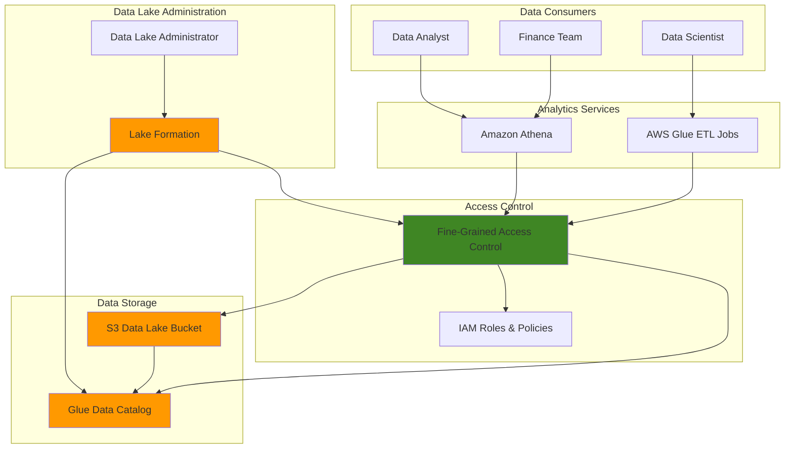

# Data Lake Fine-Grained Access Control

## Problem

Enterprise data lakes contain sensitive information that requires granular access controls at the table, column, and row level. Traditional IAM policies are insufficient for implementing fine-grained data access patterns that vary by user role, department, and data sensitivity levels.

## Solution

AWS Lake Formation provides centralized security management with fine-grained access controls, enabling organizations to implement table-level, column-level, and row-level security policies while maintaining a unified data catalog and simplified permission management.

## Architecture Diagram



## Prerequisites

1. AWS account with administrative access to Lake Formation, IAM, S3, and Glue services
2. AWS CLI v2 installed and configured (or AWS CloudShell)
3. Basic understanding of data lake concepts and AWS IAM permissions
4. Knowledge of SQL query syntax for testing access controls
5. Estimated cost: $10-20 for testing resources (primarily S3 storage and Glue catalog usage)

> **Note**: Lake Formation requires specific IAM permissions to manage data lake resources. Ensure your user has `AWSLakeFormationDataAdmin` permissions or equivalent. See [AWS Lake Formation permissions](https://docs.aws.amazon.com/lake-formation/latest/dg/security-iam-permissions.html) for complete details.

## Preparation

```bash
# Set environment variables
export AWS_REGION=$(aws configure get region)
export AWS_ACCOUNT_ID=$(aws sts get-caller-identity \
    --query Account --output text)

# Generate unique identifiers for resources
RANDOM_SUFFIX=$(aws secretsmanager get-random-password \
    --exclude-punctuation --exclude-uppercase \
    --password-length 6 --require-each-included-type \
    --output text --query RandomPassword)

export DATA_LAKE_BUCKET="data-lake-fgac-${RANDOM_SUFFIX}"
export DATABASE_NAME="sample_database"
export TABLE_NAME="customer_data"

# Create S3 bucket for data lake
aws s3 mb s3://${DATA_LAKE_BUCKET} --region ${AWS_REGION}

# Create sample CSV data for testing
cat > sample_data.csv << 'EOF'
customer_id,name,email,department,salary,ssn
1,John Doe,john@example.com,Engineering,75000,123-45-6789
2,Jane Smith,jane@example.com,Marketing,65000,987-65-4321
3,Bob Johnson,bob@example.com,Finance,80000,456-78-9012
4,Alice Brown,alice@example.com,Engineering,70000,321-54-9876
5,Charlie Wilson,charlie@example.com,HR,60000,654-32-1098
EOF

# Upload sample data to S3
aws s3 cp sample_data.csv s3://${DATA_LAKE_BUCKET}/customer_data/

echo "✅ Environment prepared with bucket: ${DATA_LAKE_BUCKET}"
```

## Steps

1. **Enable Lake Formation and Configure Data Lake Administrator**:

   Lake Formation requires an initial setup to designate data lake administrators who can manage permissions and configure access controls. The data lake administrator role is crucial for implementing fine-grained access controls and differs from standard IAM administration by focusing specifically on data governance and access management.

   ```bash
   # Get current caller identity to use as data lake administrator
   CURRENT_USER_ARN=$(aws sts get-caller-identity --query Arn --output text)
   
   # Add current user as data lake administrator
   aws lakeformation put-data-lake-settings \
       --data-lake-settings "DataLakeAdmins=[{DataLakePrincipalIdentifier=${CURRENT_USER_ARN}}]"
   
   echo "✅ Lake Formation configured with data lake administrator: ${CURRENT_USER_ARN}"
   ```

   The data lake administrator now has the authority to grant and revoke permissions on all Lake Formation resources. This centralized approach simplifies permission management compared to traditional IAM-only approaches.

2. **Register S3 Location with Lake Formation**:

   Lake Formation needs explicit registration of S3 locations before it can manage access controls. This registration establishes Lake Formation's authority over the S3 location and enables fine-grained access controls that go beyond standard S3 bucket policies.

   ```bash
   # Register S3 location with Lake Formation
   aws lakeformation register-resource \
       --resource-arn "arn:aws:s3:::${DATA_LAKE_BUCKET}" \
       --use-service-linked-role
   
   echo "✅ S3 location registered with Lake Formation"
   ```

   Lake Formation now has the authority to control access to data in this S3 location, enabling table-level, column-level, and row-level security policies.

3. **Create Glue Database and Catalog Table**:

   The AWS Glue Data Catalog serves as the central metadata repository for your data lake. Lake Formation integrates with the Glue Data Catalog to enforce permissions on cataloged data, providing a unified view of data governance across your entire data lake.

   ```bash
   # Create Glue database
   aws glue create-database \
       --database-input "Name=${DATABASE_NAME},Description=Sample database for fine-grained access control"
   
   # Create Glue table pointing to S3 data
   aws glue create-table \
       --database-name ${DATABASE_NAME} \
       --table-input '{
           "Name": "'${TABLE_NAME}'",
           "StorageDescriptor": {
               "Columns": [
                   {"Name": "customer_id", "Type": "bigint"},
                   {"Name": "name", "Type": "string"},
                   {"Name": "email", "Type": "string"},
                   {"Name": "department", "Type": "string"},
                   {"Name": "salary", "Type": "bigint"},
                   {"Name": "ssn", "Type": "string"}
               ],
               "Location": "s3://'${DATA_LAKE_BUCKET}'/customer_data/",
               "InputFormat": "org.apache.hadoop.mapred.TextInputFormat",
               "OutputFormat": "org.apache.hadoop.hive.ql.io.HiveIgnoreKeyTextOutputFormat",
               "SerdeInfo": {
                   "SerializationLibrary": "org.apache.hadoop.hive.serde2.lazy.LazySimpleSerDe",
                   "Parameters": {
                       "field.delim": ",",
                       "skip.header.line.count": "1"
                   }
               }
           }
       }'
   
   echo "✅ Glue database and table created successfully"
   ```

   The Glue Data Catalog now contains metadata about your data structure, enabling Lake Formation to apply fine-grained permissions based on this schema information.

4. **Create IAM Roles for Different User Types**:

   Fine-grained access control requires different IAM roles representing various user personas. Each role will receive different Lake Formation permissions to demonstrate column-level and row-level access controls.

   ```bash
   # Create trust policy for roles
   cat > trust-policy.json << 'EOF'
{
    "Version": "2012-10-17",
    "Statement": [
        {
            "Effect": "Allow",
            "Principal": {
                "Service": "glue.amazonaws.com"
            },
            "Action": "sts:AssumeRole"
        },
        {
            "Effect": "Allow",
            "Principal": {
                "AWS": "arn:aws:iam::'${AWS_ACCOUNT_ID}':root"
            },
            "Action": "sts:AssumeRole"
        }
    ]
}
EOF

   # Create data analyst role (full access)
   aws iam create-role \
       --role-name DataAnalystRole \
       --assume-role-policy-document file://trust-policy.json
   
   # Create finance team role (limited access)
   aws iam create-role \
       --role-name FinanceTeamRole \
       --assume-role-policy-document file://trust-policy.json
   
   # Create HR role (restricted access)
   aws iam create-role \
       --role-name HRRole \
       --assume-role-policy-document file://trust-policy.json
   
   echo "✅ IAM roles created for different user types"
   ```

   These roles represent different organizational functions, each requiring different levels of data access based on business requirements and security policies.

5. **Grant Lake Formation Permissions with Column-Level Access**:

   Lake Formation's fine-grained access control allows you to grant specific permissions at the column level. This capability enables data governance teams to implement the principle of least privilege, ensuring users only access data necessary for their job functions.

   ```bash
   # Grant full table access to data analyst
   aws lakeformation grant-permissions \
       --principal "DataLakePrincipalIdentifier=arn:aws:iam::${AWS_ACCOUNT_ID}:role/DataAnalystRole" \
       --permissions "SELECT" \
       --resource '{
           "Table": {
               "DatabaseName": "'${DATABASE_NAME}'",
               "Name": "'${TABLE_NAME}'"
           }
       }'
   
   # Grant limited column access to finance team (no SSN)
   aws lakeformation grant-permissions \
       --principal "DataLakePrincipalIdentifier=arn:aws:iam::${AWS_ACCOUNT_ID}:role/FinanceTeamRole" \
       --permissions "SELECT" \
       --resource '{
           "TableWithColumns": {
               "DatabaseName": "'${DATABASE_NAME}'",
               "Name": "'${TABLE_NAME}'",
               "ColumnNames": ["customer_id", "name", "department", "salary"]
           }
       }'
   
   # Grant very limited access to HR (only name and department)
   aws lakeformation grant-permissions \
       --principal "DataLakePrincipalIdentifier=arn:aws:iam::${AWS_ACCOUNT_ID}:role/HRRole" \
       --permissions "SELECT" \
       --resource '{
           "TableWithColumns": {
               "DatabaseName": "'${DATABASE_NAME}'",
               "Name": "'${TABLE_NAME}'",
               "ColumnNames": ["customer_id", "name", "department"]
           }
       }'
   
   echo "✅ Fine-grained permissions granted to different roles"
   ```

   These permissions demonstrate how Lake Formation enables column-level access control, allowing different roles to see different subsets of data within the same table.

> **Warning**: Fine-grained access controls only work when the default Lake Formation settings are properly configured. Ensure that "Use only IAM access control" is disabled in your Lake Formation settings to enable these permissions.

6. **Disable Default IAM Access Control**:

   By default, Lake Formation allows IAM policies to override Lake Formation permissions for backward compatibility. To enable true fine-grained access control, you must disable this default behavior.

   ```bash
   # Disable default IAM access control for new tables
   aws lakeformation put-data-lake-settings \
       --data-lake-settings '{
           "DataLakeAdmins": [
               {"DataLakePrincipalIdentifier": "'${CURRENT_USER_ARN}'"}
           ],
           "CreateDatabaseDefaultPermissions": [],
           "CreateTableDefaultPermissions": []
       }'
   
   echo "✅ Default IAM access control disabled"
   ```

   This configuration ensures that Lake Formation permissions take precedence over IAM policies, enabling true fine-grained access control.

7. **Create Data Filters for Row-Level Security**:

   Lake Formation supports row-level security through data filters, allowing you to restrict access to specific rows based on filter expressions. This capability is essential for implementing data privacy and compliance requirements.

   ```bash
   # Create data filter for finance team (only Engineering department)
   aws lakeformation create-data-cells-filter \
       --table-data '{
           "TableCatalogId": "'${AWS_ACCOUNT_ID}'",
           "DatabaseName": "'${DATABASE_NAME}'",
           "TableName": "'${TABLE_NAME}'",
           "Name": "engineering-only-filter",
           "RowFilter": {
               "FilterExpression": "department = \"Engineering\""
           },
           "ColumnNames": ["customer_id", "name", "department", "salary"]
       }'
   
   echo "✅ Row-level security filter created"
   ```

   This data filter ensures that the finance team can only access records where the department equals "Engineering", demonstrating row-level access control capabilities.

8. **Test Access Controls with Different Roles**:

   Testing is crucial to validate that your fine-grained access controls work as expected. This step verifies that each role can only access the data they're authorized to see.

   ```bash
   # Test will be performed in the validation section
   echo "✅ Access control testing prepared"
   ```

> **Tip**: Use AWS CloudTrail to monitor Lake Formation permission changes and access patterns. This provides an audit trail for compliance and helps identify potential security issues. See [AWS CloudTrail documentation](https://docs.aws.amazon.com/awscloudtrail/latest/userguide/cloudtrail-user-guide.html) for setup instructions.

## Validation & Testing

1. **Verify Lake Formation Configuration**:

   ```bash
   # Check Lake Formation settings
   aws lakeformation describe-resource \
       --resource-arn "arn:aws:s3:::${DATA_LAKE_BUCKET}"
   
   # List granted permissions
   aws lakeformation list-permissions \
       --principal "DataLakePrincipalIdentifier=arn:aws:iam::${AWS_ACCOUNT_ID}:role/DataAnalystRole"
   ```

   Expected output: Should show registered S3 location and granted permissions for each role.

2. **Test Column-Level Access Control**:

   ```bash
   # Test data analyst access (should see all columns)
   aws sts assume-role \
       --role-arn "arn:aws:iam::${AWS_ACCOUNT_ID}:role/DataAnalystRole" \
       --role-session-name "test-session" > analyst-creds.json
   
   # Extract credentials
   export AWS_ACCESS_KEY_ID=$(cat analyst-creds.json | jq -r '.Credentials.AccessKeyId')
   export AWS_SECRET_ACCESS_KEY=$(cat analyst-creds.json | jq -r '.Credentials.SecretAccessKey')
   export AWS_SESSION_TOKEN=$(cat analyst-creds.json | jq -r '.Credentials.SessionToken')
   
   # Test query with Athena (analyst should see all columns)
   aws athena start-query-execution \
       --query-string "SELECT * FROM ${DATABASE_NAME}.${TABLE_NAME} LIMIT 5" \
       --result-configuration "OutputLocation=s3://${DATA_LAKE_BUCKET}/query-results/"
   ```

3. **Test Row-Level Security**:

   ```bash
   # Reset credentials to original user
   unset AWS_ACCESS_KEY_ID AWS_SECRET_ACCESS_KEY AWS_SESSION_TOKEN
   
   # Test finance team access (should only see Engineering department)
   aws sts assume-role \
       --role-arn "arn:aws:iam::${AWS_ACCOUNT_ID}:role/FinanceTeamRole" \
       --role-session-name "finance-session" > finance-creds.json
   
   # Query should only return Engineering department records
   echo "Finance team should only see Engineering department data"
   ```

## Cleanup

1. **Remove Lake Formation Permissions**:

   ```bash
   # Revoke permissions from all roles
   aws lakeformation revoke-permissions \
       --principal "DataLakePrincipalIdentifier=arn:aws:iam::${AWS_ACCOUNT_ID}:role/DataAnalystRole" \
       --permissions "SELECT" \
       --resource '{
           "Table": {
               "DatabaseName": "'${DATABASE_NAME}'",
               "Name": "'${TABLE_NAME}'"
           }
       }'
   
   echo "✅ Lake Formation permissions revoked"
   ```

2. **Delete Data Filters**:

   ```bash
   # Delete row-level security filter
   aws lakeformation delete-data-cells-filter \
       --table-catalog-id ${AWS_ACCOUNT_ID} \
       --database-name ${DATABASE_NAME} \
       --table-name ${TABLE_NAME} \
       --name "engineering-only-filter"
   
   echo "✅ Data filters deleted"
   ```

3. **Remove Glue Resources**:

   ```bash
   # Delete Glue table
   aws glue delete-table \
       --database-name ${DATABASE_NAME} \
       --name ${TABLE_NAME}
   
   # Delete Glue database
   aws glue delete-database --name ${DATABASE_NAME}
   
   echo "✅ Glue resources deleted"
   ```

4. **Delete IAM Roles**:

   ```bash
   # Delete IAM roles
   aws iam delete-role --role-name DataAnalystRole
   aws iam delete-role --role-name FinanceTeamRole
   aws iam delete-role --role-name HRRole
   
   echo "✅ IAM roles deleted"
   ```

5. **Deregister S3 Location and Delete Bucket**:

   ```bash
   # Deregister S3 location from Lake Formation
   aws lakeformation deregister-resource \
       --resource-arn "arn:aws:s3:::${DATA_LAKE_BUCKET}"
   
   # Delete S3 bucket and contents
   aws s3 rm s3://${DATA_LAKE_BUCKET} --recursive
   aws s3 rb s3://${DATA_LAKE_BUCKET}
   
   # Clean up local files
   rm -f sample_data.csv trust-policy.json analyst-creds.json finance-creds.json
   
   echo "✅ All resources cleaned up"
   ```

## Discussion

AWS Lake Formation represents a significant advancement in data lake security by providing fine-grained access control capabilities that go beyond traditional IAM policies. The service addresses the fundamental challenge of implementing column-level and row-level security in distributed data architectures, enabling organizations to maintain strict data governance while supporting diverse analytical workloads.

The architecture demonstrated in this recipe showcases Lake Formation's hybrid access model, where both IAM policies and Lake Formation permissions work together to provide comprehensive security. This approach allows organizations to gradually migrate from IAM-only security models to more sophisticated fine-grained controls without disrupting existing workflows. The centralized permission management through Lake Formation significantly reduces the complexity of managing access controls across multiple data sources and analytical services.

Lake Formation's integration with the AWS Glue Data Catalog provides a unified metadata management layer that supports both data discovery and access control. This integration enables data stewards to implement consistent security policies across the entire data lake, regardless of the underlying storage location or analytical service used to access the data. The service's support for cross-account sharing further enables organizations to implement data marketplace capabilities while maintaining strict security boundaries.

The row-level security and column-level access controls demonstrated in this recipe are particularly valuable for organizations operating in regulated industries where data privacy and compliance requirements demand granular control over sensitive information. These capabilities enable implementation of privacy-preserving analytics patterns and support regulatory frameworks such as GDPR, HIPAA, and SOX.

## Challenge

Extend this Lake Formation implementation with these advanced capabilities:

1. **Implement Cross-Account Data Sharing**: Configure Lake Formation to securely share specific tables with external AWS accounts using Resource Access Manager (RAM) while maintaining fine-grained access controls.

2. **Add Cell-Level Security**: Implement data cell filters that combine both row-level and column-level restrictions to create cell-level access controls for highly sensitive data fields.

3. **Integrate with Amazon EMR**: Configure EMR clusters to use Lake Formation permissions for Spark and Hive workloads, enabling fine-grained access control for big data processing jobs.

4. **Implement Audit and Compliance Reporting**: Set up CloudTrail integration with Lake Formation to generate detailed audit reports showing data access patterns and permission changes for compliance purposes.

5. **Create Dynamic Row-Level Security**: Implement context-aware row-level filters that change based on user attributes or session context, enabling more sophisticated access control patterns.

## Infrastructure Code

*Infrastructure code will be generated after recipe approval.*