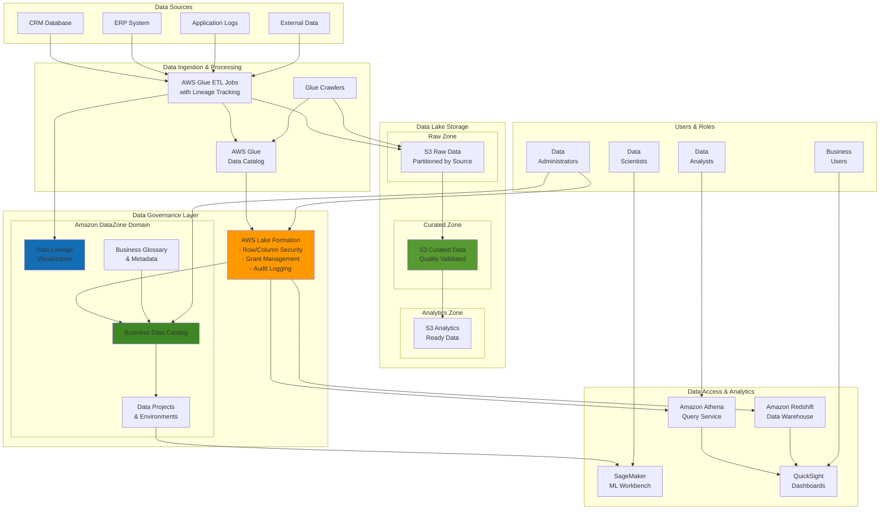

# Data Lake Governance with Lake Formation

## Problem

Large enterprises with multiple business units struggle to implement comprehensive data governance across their data lakes. Data teams face challenges with inconsistent data access policies, lack of data lineage visibility, and difficulty discovering trusted data assets. Compliance teams require detailed audit trails for data access and transformations, while data scientists need self-service access to governed datasets. Without proper governance frameworks, organizations experience data silos, compliance violations, unauthorized data access, and reduced confidence in data-driven decisions across departments.

## Solution

This recipe implements an enterprise-grade data lake governance platform using AWS Lake Formation for fine-grained access control and Amazon DataZone for data discovery and cataloging. The solution establishes centralized data governance with row-level and column-level security, automated data lineage tracking, and self-service data discovery capabilities. By integrating with AWS Glue for ETL operations, the platform provides end-to-end data governance from ingestion to consumption, ensuring compliance while enabling data democratization across business units.

## Architecture Diagram



## Prerequisites

1. AWS account with administrative permissions for Lake Formation, DataZone, Glue, and S3
2. AWS CLI v2 installed and configured (or AWS CloudShell)
3. Understanding of data governance principles and compliance requirements
4. Familiarity with SQL and data modeling concepts
5. Knowledge of IAM roles, policies, and AWS security best practices
6. Estimated cost: $200-400 for a 5-hour workshop (includes Glue jobs, DataZone domain, storage, and compute resources)

> **Note**: This recipe involves complex IAM permissions and cross-service integrations. Ensure you have appropriate permissions before proceeding.

## Preparation

```bash
# Set environment variables for consistent resource naming
export AWS_REGION=$(aws configure get region)
export AWS_ACCOUNT_ID=$(aws sts get-caller-identity \
    --query Account --output text)
export DOMAIN_NAME="enterprise-data-governance"

# Generate unique suffix for global resources
export RANDOM_SUFFIX=$(aws secretsmanager get-random-password \
    --exclude-punctuation --exclude-uppercase \
    --password-length 6 --require-each-included-type \
    --output text --query RandomPassword)

# Set derived variables
export DATA_LAKE_BUCKET="enterprise-datalake-${RANDOM_SUFFIX}"
export RAW_DATA_PREFIX="raw-data"
export CURATED_DATA_PREFIX="curated-data"
export ANALYTICS_DATA_PREFIX="analytics-data"
export GLUE_DATABASE="enterprise_data_catalog"

# Verify AWS CLI configuration
aws sts get-caller-identity
echo "Region: ${AWS_REGION}"
echo "Data Lake Bucket: ${DATA_LAKE_BUCKET}"

echo "✅ Environment prepared for data lake governance setup"
```

## Steps

1. **Configure Lake Formation Settings and Create Data Lake**:

   AWS Lake Formation serves as the central hub for data lake governance, providing sophisticated access controls that go beyond traditional IAM permissions. By configuring Lake Formation as the primary data catalog, you establish a governance layer that can enforce fine-grained permissions at the table, column, and row level. This step is crucial because it transitions your data lake from basic S3 bucket permissions to enterprise-grade governance that supports compliance requirements and regulatory frameworks.

   ```bash
   # Enable Lake Formation as the primary data catalog
   aws lakeformation put-data-lake-settings \
       --data-lake-settings '{
         "CreateDatabaseDefaultPermissions": [],
         "CreateTableDefaultPermissions": [],
         "Parameters": {
           "CROSS_ACCOUNT_VERSION": "3"
         },
         "TrustedResourceOwners": ["'${AWS_ACCOUNT_ID}'"],
         "AllowExternalDataFiltering": true,
         "ExternalDataFilteringAllowList": ["'${AWS_ACCOUNT_ID}'"],
         "AuthorizedSessionTagValueList": []
       }'
   
   # Create S3 bucket for data lake with proper configuration
   aws s3 mb s3://${DATA_LAKE_BUCKET} --region ${AWS_REGION}
   
   # Configure bucket for Lake Formation integration
   aws s3api put-bucket-versioning \
       --bucket ${DATA_LAKE_BUCKET} \
       --versioning-configuration Status=Enabled
   
   aws s3api put-bucket-encryption \
       --bucket ${DATA_LAKE_BUCKET} \
       --server-side-encryption-configuration '{
         "Rules": [{
           "ApplyServerSideEncryptionByDefault": {
             "SSEAlgorithm": "AES256"
           }
         }]
       }'
   
   # Create folder structure for data lake zones
   aws s3api put-object --bucket ${DATA_LAKE_BUCKET} \
       --key ${RAW_DATA_PREFIX}/
   aws s3api put-object --bucket ${DATA_LAKE_BUCKET} \
       --key ${CURATED_DATA_PREFIX}/
   aws s3api put-object --bucket ${DATA_LAKE_BUCKET} \
       --key ${ANALYTICS_DATA_PREFIX}/
   
   # Register data lake location with Lake Formation
   aws lakeformation register-resource \
       --resource-arn arn:aws:s3:::${DATA_LAKE_BUCKET} \
       --use-service-linked-role
   
   echo "✅ Lake Formation configured and data lake created"
   ```

   Lake Formation is now configured as your data catalog authority, and your S3 bucket is registered as a governed data lake location. This foundational step enables all subsequent governance features including fine-grained access control, audit logging, and cross-account data sharing. The tiered folder structure (raw, curated, analytics) supports data maturity levels and progressive data quality improvement workflows.

   > **Note**: Lake Formation permissions override S3 bucket policies for registered locations. Learn more about [Lake Formation access control methods](https://docs.aws.amazon.com/lake-formation/latest/dg/access-control-fine-grained.html) in the official documentation.

2. **Create IAM Roles for Data Lake Access**:

   Identity and Access Management (IAM) roles form the foundation of secure data access in Lake Formation. Unlike traditional IAM policies that grant broad permissions, Lake Formation requires specific roles that can be granted granular permissions to individual tables, columns, and filtered data sets. The service role enables Lake Formation to manage data on your behalf, while analyst roles represent different user personas with varying access needs. This role-based approach supports the principle of least privilege and enables scalable governance across large organizations.

   ```bash
   # Create Lake Formation service role
   cat > lf-service-role-trust-policy.json << EOF
   {
     "Version": "2012-10-17",
     "Statement": [
       {
         "Effect": "Allow",
         "Principal": {
           "Service": [
             "lakeformation.amazonaws.com",
             "glue.amazonaws.com"
           ]
         },
         "Action": "sts:AssumeRole"
       }
     ]
   }
   EOF
   
   aws iam create-role \
       --role-name LakeFormationServiceRole \
       --assume-role-policy-document file://lf-service-role-trust-policy.json
   
   # Create and attach comprehensive policy for Lake Formation
   cat > lf-service-role-policy.json << EOF
   {
     "Version": "2012-10-17",
     "Statement": [
       {
         "Effect": "Allow",
         "Action": [
           "s3:GetObject",
           "s3:GetObjectVersion",
           "s3:PutObject",
           "s3:DeleteObject",
           "s3:ListBucket",
           "s3:ListBucketMultipartUploads",
           "s3:ListMultipartUploadParts",
           "s3:AbortMultipartUpload"
         ],
         "Resource": [
           "arn:aws:s3:::${DATA_LAKE_BUCKET}",
           "arn:aws:s3:::${DATA_LAKE_BUCKET}/*"
         ]
       },
       {
         "Effect": "Allow",
         "Action": [
           "glue:GetDatabase",
           "glue:GetDatabases",
           "glue:CreateDatabase",
           "glue:GetTable",
           "glue:GetTables",
           "glue:CreateTable",
           "glue:UpdateTable",
           "glue:DeleteTable",
           "glue:GetPartition",
           "glue:GetPartitions",
           "glue:CreatePartition",
           "glue:UpdatePartition",
           "glue:DeletePartition",
           "glue:BatchCreatePartition",
           "glue:BatchDeletePartition",
           "glue:BatchUpdatePartition"
         ],
         "Resource": "*"
       },
       {
         "Effect": "Allow",
         "Action": [
           "lakeformation:GetDataAccess",
           "lakeformation:GrantPermissions",
           "lakeformation:RevokePermissions",
           "lakeformation:BatchGrantPermissions",
           "lakeformation:BatchRevokePermissions",
           "lakeformation:ListPermissions"
         ],
         "Resource": "*"
       }
     ]
   }
   EOF
   
   aws iam put-role-policy \
       --role-name LakeFormationServiceRole \
       --policy-name LakeFormationServicePolicy \
       --policy-document file://lf-service-role-policy.json
   
   # Create data analyst role
   cat > data-analyst-trust-policy.json << EOF
   {
     "Version": "2012-10-17",
     "Statement": [
       {
         "Effect": "Allow",
         "Principal": {
           "AWS": "arn:aws:iam::${AWS_ACCOUNT_ID}:root"
         },
         "Action": "sts:AssumeRole"
       }
     ]
   }
   EOF
   
   aws iam create-role \
       --role-name DataAnalystRole \
       --assume-role-policy-document file://data-analyst-trust-policy.json
   
   aws iam attach-role-policy \
       --role-name DataAnalystRole \
       --policy-arn arn:aws:iam::aws:policy/AmazonAthenaFullAccess
   
   echo "✅ IAM roles created for Lake Formation"
   ```

   The IAM roles are now established with appropriate trust relationships and permissions. The LakeFormationServiceRole enables cross-service operations between Lake Formation, Glue, and S3, while the DataAnalystRole represents a restricted user persona that will receive fine-grained data access permissions. These roles form the foundation for implementing least-privilege access patterns and role-based data governance across your organization.

3. **Set up AWS Glue Data Catalog and Create Sample Database**:

   The AWS Glue Data Catalog serves as the central metadata repository that powers Lake Formation's governance capabilities. By creating structured table definitions with comprehensive metadata, you enable Lake Formation to understand your data schema and apply governance policies effectively. The catalog also supports data discovery by providing business users with searchable metadata, column descriptions, and data classification information. This step establishes the metadata foundation that enables both technical operations (like ETL jobs) and business operations (like data discovery and lineage tracking).

   ```bash
   # Create Glue database for enterprise data
   aws glue create-database \
       --database-input '{
         "Name": "'${GLUE_DATABASE}'",
         "Description": "Enterprise data catalog for governed data lake",
         "LocationUri": "s3://'${DATA_LAKE_BUCKET}'/'${CURATED_DATA_PREFIX}'/",
         "Parameters": {
           "classification": "curated",
           "environment": "production"
         }
       }'
   
   # Create sample customer data table schema
   aws glue create-table \
       --database-name ${GLUE_DATABASE} \
       --table-input '{
         "Name": "customer_data",
         "Description": "Customer information with PII protection",
         "StorageDescriptor": {
           "Columns": [
             {"Name": "customer_id", "Type": "bigint", "Comment": "Unique customer identifier"},
             {"Name": "first_name", "Type": "string", "Comment": "Customer first name - PII"},
             {"Name": "last_name", "Type": "string", "Comment": "Customer last name - PII"},
             {"Name": "email", "Type": "string", "Comment": "Customer email - PII"},
             {"Name": "phone", "Type": "string", "Comment": "Customer phone - PII"},
             {"Name": "registration_date", "Type": "date", "Comment": "Account registration date"},
             {"Name": "customer_segment", "Type": "string", "Comment": "Business customer segment"},
             {"Name": "lifetime_value", "Type": "double", "Comment": "Customer lifetime value"},
             {"Name": "region", "Type": "string", "Comment": "Customer geographic region"}
           ],
           "Location": "s3://'${DATA_LAKE_BUCKET}'/'${CURATED_DATA_PREFIX}'/customer_data/",
           "InputFormat": "org.apache.hadoop.mapred.TextInputFormat",
           "OutputFormat": "org.apache.hadoop.hive.ql.io.HiveIgnoreKeyTextOutputFormat",
           "SerdeInfo": {
             "SerializationLibrary": "org.apache.hadoop.hive.serde2.lazy.LazySimpleSerDe",
             "Parameters": {
               "field.delim": ",",
               "skip.header.line.count": "1"
             }
           }
         },
         "PartitionKeys": [
           {"Name": "year", "Type": "string"},
           {"Name": "month", "Type": "string"}
         ],
         "Parameters": {
           "classification": "csv",
           "delimiter": ",",
           "has_encrypted_data": "false",
           "data_classification": "confidential"
         }
       }'
   
   # Create transaction data table
   aws glue create-table \
       --database-name ${GLUE_DATABASE} \
       --table-input '{
         "Name": "transaction_data",
         "Description": "Customer transaction records",
         "StorageDescriptor": {
           "Columns": [
             {"Name": "transaction_id", "Type": "string", "Comment": "Unique transaction identifier"},
             {"Name": "customer_id", "Type": "bigint", "Comment": "Associated customer ID"},
             {"Name": "transaction_date", "Type": "timestamp", "Comment": "Transaction timestamp"},
             {"Name": "amount", "Type": "double", "Comment": "Transaction amount"},
             {"Name": "currency", "Type": "string", "Comment": "Transaction currency"},
             {"Name": "merchant_category", "Type": "string", "Comment": "Merchant category code"},
             {"Name": "payment_method", "Type": "string", "Comment": "Payment method used"},
             {"Name": "status", "Type": "string", "Comment": "Transaction status"}
           ],
           "Location": "s3://'${DATA_LAKE_BUCKET}'/'${CURATED_DATA_PREFIX}'/transaction_data/",
           "InputFormat": "org.apache.hadoop.hive.ql.io.parquet.MapredParquetInputFormat",
           "OutputFormat": "org.apache.hadoop.hive.ql.io.parquet.MapredParquetOutputFormat",
           "SerdeInfo": {
             "SerializationLibrary": "org.apache.hadoop.hive.ql.io.parquet.serde.ParquetHiveSerDe"
           }
         },
         "PartitionKeys": [
           {"Name": "year", "Type": "string"},
           {"Name": "month", "Type": "string"},
           {"Name": "day", "Type": "string"}
         ],
         "Parameters": {
           "classification": "parquet",
           "data_classification": "internal"
         }
       }'
   
   echo "✅ Glue Data Catalog and sample tables created"
   ```

   The Glue Data Catalog now contains structured metadata for your enterprise data assets. The customer_data table includes PII classification in its metadata, which Lake Formation will use to enforce column-level security policies. The transaction_data table demonstrates how different data types (Parquet vs CSV) and classification levels (confidential vs internal) can be managed within the same governance framework. This metadata foundation enables sophisticated data discovery, lineage tracking, and automated policy enforcement.

4. **Configure Lake Formation Permissions and Security**:

   Lake Formation's fine-grained access control represents a paradigm shift from traditional file-based permissions to modern data governance. Data cell filters enable column-level and row-level security that can dynamically filter data based on user context, business rules, and compliance requirements. This approach allows you to share datasets with different stakeholders while automatically protecting sensitive information like PII. The permission model supports complex enterprise scenarios including cross-account sharing, temporary access grants, and audit-compliant data access patterns.

   ```bash
   # Grant Lake Formation admin permissions to current user
   CURRENT_USER_ARN=$(aws sts get-caller-identity --query Arn --output text)
   
   aws lakeformation grant-permissions \
       --principal DataLakePrincipalIdentifier=${CURRENT_USER_ARN} \
       --resource '{
         "Database": {
           "Name": "'${GLUE_DATABASE}'"
         }
       }' \
       --permissions "ALL" \
       --permissions-with-grant-option "ALL"
   
   # Create fine-grained permissions for customer data (column-level security)
   aws lakeformation grant-permissions \
       --principal DataLakePrincipalIdentifier=arn:aws:iam::${AWS_ACCOUNT_ID}:role/DataAnalystRole \
       --resource '{
         "Table": {
           "DatabaseName": "'${GLUE_DATABASE}'",
           "Name": "customer_data"
         }
       }' \
       --permissions "SELECT" \
       --permissions-with-grant-option "SELECT"
   
   # Create data filter for PII protection (exclude sensitive columns)
   aws lakeformation create-data-cells-filter \
       --table-data '{
         "TableCatalogId": "'${AWS_ACCOUNT_ID}'",
         "DatabaseName": "'${GLUE_DATABASE}'",
         "TableName": "customer_data",
         "Name": "customer_data_pii_filter",
         "RowFilter": {
           "FilterExpression": "customer_segment IN ('premium', 'standard')"
         },
         "ColumnNames": ["customer_id", "registration_date", "customer_segment", "lifetime_value", "region"],
         "ColumnWildcard": null
       }'
   
   # Grant permissions through the data filter (excludes PII columns)
   aws lakeformation grant-permissions \
       --principal DataLakePrincipalIdentifier=arn:aws:iam::${AWS_ACCOUNT_ID}:role/DataAnalystRole \
       --resource '{
         "DataCellsFilter": {
           "TableCatalogId": "'${AWS_ACCOUNT_ID}'",
           "DatabaseName": "'${GLUE_DATABASE}'",
           "TableName": "customer_data",
           "Name": "customer_data_pii_filter"
         }
       }' \
       --permissions "SELECT"
   
   # Grant full access to transaction data
   aws lakeformation grant-permissions \
       --principal DataLakePrincipalIdentifier=arn:aws:iam::${AWS_ACCOUNT_ID}:role/DataAnalystRole \
       --resource '{
         "Table": {
           "DatabaseName": "'${GLUE_DATABASE}'",
           "Name": "transaction_data"
         }
       }' \
       --permissions "SELECT"
   
   echo "✅ Lake Formation permissions and security policies configured"
   ```

   Fine-grained permissions are now active, creating a sophisticated security layer that automatically filters data based on user roles and business context. The data cell filter ensures that analysts can access customer analytics data without seeing PII columns, demonstrating how Lake Formation enables privacy-preserving analytics. This permission model scales across thousands of users and tables while maintaining consistent security policies and comprehensive audit trails.

5. **Create Amazon DataZone Domain and Configure Governance**:

   Amazon DataZone bridges the gap between technical data management and business data consumption by providing a business-friendly interface for data discovery and collaboration. The domain represents your organization's data governance boundary, while the business glossary establishes standardized terminology that ensures consistent understanding across teams. DataZone projects enable secure collaboration spaces where business users can discover, request access to, and work with governed data assets. This business-centric approach to data governance accelerates data-driven decision making while maintaining compliance and security standards.

   ```bash
   # Create DataZone domain for data governance
   DOMAIN_ID=$(aws datazone create-domain \
       --name ${DOMAIN_NAME} \
       --description "Enterprise data governance domain with Lake Formation integration" \
       --domain-execution-role arn:aws:iam::${AWS_ACCOUNT_ID}:role/LakeFormationServiceRole \
       --query 'id' --output text)
   
   echo "DataZone Domain ID: ${DOMAIN_ID}"
   
   # Poll domain status until created (DataZone doesn't have wait command yet)
   echo "Waiting for DataZone domain creation..."
   while true; do
     STATUS=$(aws datazone get-domain --identifier ${DOMAIN_ID} \
         --query 'status' --output text 2>/dev/null || echo "CREATING")
     if [ "$STATUS" = "AVAILABLE" ]; then
       echo "Domain is available"
       break
     elif [ "$STATUS" = "FAILED" ]; then
       echo "Domain creation failed"
       exit 1
     fi
     echo "Domain status: $STATUS - waiting..."
     sleep 30
   done
   
   # Create business glossary terms
   GLOSSARY_ID=$(aws datazone create-glossary \
       --domain-identifier ${DOMAIN_ID} \
       --name "Enterprise Business Glossary" \
       --description "Standardized business terms and definitions" \
       --status ENABLED \
       --query 'id' --output text)
   
   # Create sample business glossary terms
   aws datazone create-glossary-term \
       --domain-identifier ${DOMAIN_ID} \
       --glossary-identifier ${GLOSSARY_ID} \
       --name "Customer Lifetime Value" \
       --short-description "The predicted revenue that a customer will generate during their relationship with the company" \
       --long-description "Customer Lifetime Value (CLV) is calculated using historical transaction data, customer behavior patterns, and predictive analytics to estimate the total economic value a customer represents over their entire relationship with the organization."
   
   aws datazone create-glossary-term \
       --domain-identifier ${DOMAIN_ID} \
       --glossary-identifier ${GLOSSARY_ID} \
       --name "Customer Segment" \
       --short-description "Business classification of customers based on value, behavior, and characteristics" \
       --long-description "Customer segments include Premium (high-value customers), Standard (regular customers), and Basic (low-engagement customers). Segmentation drives personalized marketing and service strategies."
   
   # Create data project for analytics team
   PROJECT_ID=$(aws datazone create-project \
       --domain-identifier ${DOMAIN_ID} \
       --name "Customer Analytics Project" \
       --description "Analytics project for customer behavior and transaction analysis" \
       --query 'id' --output text)
   
   echo "DataZone Project ID: ${PROJECT_ID}"
   
   echo "✅ Amazon DataZone domain and governance structure created"
   ```

   The DataZone domain provides a comprehensive data governance platform that business users can navigate intuitively. The business glossary creates shared understanding of data concepts across your organization, while the analytics project provides a collaborative workspace for data exploration. This infrastructure enables self-service data discovery while maintaining the governance controls established in Lake Formation, creating a balanced approach to data democratization and data protection.

   > **Tip**: DataZone business glossaries improve data literacy across organizations by providing consistent definitions. Explore [creating business glossaries](https://docs.aws.amazon.com/datazone/latest/userguide/create-maintain-business-glossary.html) to establish organization-wide data terminology standards.

6. **Create ETL Job with Data Lineage Tracking**:

   AWS Glue ETL jobs with integrated lineage tracking provide transparency into data transformations while maintaining governance controls throughout the data pipeline. Lineage information enables impact analysis, debugging, and compliance reporting by showing how data flows from source systems through transformations to final analytics datasets. The job configurations enable comprehensive observability through CloudWatch metrics, Spark UI access, and detailed job logs. This approach ensures that governance extends beyond static data storage to include active data processing workflows.

   ```bash
   # Create Glue job script with lineage tracking
   cat > customer_data_etl.py << 'EOF'
   import sys
   from awsglue.transforms import *
   from awsglue.utils import getResolvedOptions
   from pyspark.context import SparkContext
   from awsglue.context import GlueContext
   from awsglue.job import Job
   from awsglue.dynamicframe import DynamicFrame
   from pyspark.sql import functions as F
   from pyspark.sql.types import *
   import datetime
   
   # Initialize Glue context
   args = getResolvedOptions(sys.argv, ['JOB_NAME', 'DATA_LAKE_BUCKET'])
   sc = SparkContext()
   glueContext = GlueContext(sc)
   spark = glueContext.spark_session
   job = Job(glueContext)
   job.init(args['JOB_NAME'], args)
   
   # Enable lineage tracking
   spark.conf.set("spark.sql.catalog.glue_catalog", "org.apache.iceberg.spark.SparkCatalog")
   spark.conf.set("spark.sql.catalog.glue_catalog.warehouse", f"s3://{args['DATA_LAKE_BUCKET']}/analytics-data/")
   
   # Read raw customer data
   raw_customer_df = spark.read.option("header", "true").csv(f"s3://{args['DATA_LAKE_BUCKET']}/raw-data/customer_data/")
   
   # Data quality transformations
   curated_customer_df = raw_customer_df \
       .filter(F.col("customer_id").isNotNull()) \
       .filter(F.col("email").contains("@")) \
       .withColumn("registration_year", F.year(F.col("registration_date"))) \
       .withColumn("registration_month", F.month(F.col("registration_date"))) \
       .withColumn("data_quality_score", F.lit(95.0)) \
       .withColumn("processed_timestamp", F.current_timestamp())
   
   # Add data lineage metadata
   curated_customer_df = curated_customer_df.withColumn("source_system", F.lit("CRM"))
   curated_customer_df = curated_customer_df.withColumn("etl_job_id", F.lit(args['JOB_NAME']))
   curated_customer_df = curated_customer_df.withColumn("data_classification", F.lit("confidential"))
   
   # Write to curated zone with partitioning
   curated_customer_df.write \
       .partitionBy("registration_year", "registration_month") \
       .mode("overwrite") \
       .parquet(f"s3://{args['DATA_LAKE_BUCKET']}/curated-data/customer_data/")
   
   # Create aggregated analytics data
   analytics_df = curated_customer_df \
       .groupBy("customer_segment", "region", "registration_year") \
       .agg(
           F.count("customer_id").alias("customer_count"),
           F.avg("lifetime_value").alias("avg_lifetime_value"),
           F.sum("lifetime_value").alias("total_lifetime_value")
       )
   
   # Write analytics data
   analytics_df.write \
       .mode("overwrite") \
       .parquet(f"s3://{args['DATA_LAKE_BUCKET']}/analytics-data/customer_analytics/")
   
   job.commit()
   EOF
   
   # Upload script to S3
   aws s3 cp customer_data_etl.py s3://${DATA_LAKE_BUCKET}/scripts/
   
   # Create Glue job with modern worker type configuration
   aws glue create-job \
       --name "CustomerDataETLWithLineage" \
       --role arn:aws:iam::${AWS_ACCOUNT_ID}:role/LakeFormationServiceRole \
       --command '{
         "Name": "glueetl",
         "ScriptLocation": "s3://'${DATA_LAKE_BUCKET}'/scripts/customer_data_etl.py",
         "PythonVersion": "3"
       }' \
       --default-arguments '{
         "--job-language": "python",
         "--job-bookmark-option": "job-bookmark-enable",
         "--enable-metrics": "true",
         "--enable-continuous-cloudwatch-log": "true",
         "--enable-spark-ui": "true",
         "--spark-event-logs-path": "s3://'${DATA_LAKE_BUCKET}'/spark-logs/",
         "--enable-glue-datacatalog": "true",
         "--DATA_LAKE_BUCKET": "'${DATA_LAKE_BUCKET}'"
       }' \
       --max-retries 1 \
       --timeout 60 \
       --worker-type G.1X \
       --number-of-workers 2 \
       --glue-version "4.0"
   
   echo "✅ ETL job with data lineage tracking created"
   ```

   The ETL job establishes an automated data processing pipeline that maintains governance context throughout data transformations. Lineage metadata captures the relationship between source and processed data, enabling data stewards to understand data flows and assess the impact of changes. The job's integration with Lake Formation ensures that transformed data inherits appropriate security classifications and access controls, maintaining governance integrity across the entire data lifecycle.

7. **Generate Sample Data and Run ETL Pipeline**:

   Sample data generation demonstrates the end-to-end data pipeline while providing realistic test scenarios for governance validation. The customer data includes various data types, PII elements, and business classifications that showcase Lake Formation's sophisticated filtering capabilities. Transaction data represents high-volume operational data that requires different governance approaches than customer master data. Running the ETL pipeline validates that governance controls remain effective during data processing and transformation workflows.

   ```bash
   # Create sample customer data
   cat > sample_customer_data.csv << EOF
   customer_id,first_name,last_name,email,phone,registration_date,customer_segment,lifetime_value,region
   1001,John,Smith,john.smith@email.com,555-0101,2023-01-15,premium,15000.50,us-east
   1002,Sarah,Johnson,sarah.johnson@email.com,555-0102,2023-02-20,standard,8500.25,us-west
   1003,Michael,Brown,michael.brown@email.com,555-0103,2023-03-10,premium,22000.75,eu-west
   1004,Emily,Davis,emily.davis@email.com,555-0104,2023-04-05,standard,6200.30,us-east
   1005,David,Wilson,david.wilson@email.com,555-0105,2023-05-12,basic,2100.80,us-central
   1006,Lisa,Anderson,lisa.anderson@email.com,555-0106,2023-06-08,premium,18500.90,eu-central
   1007,Robert,Taylor,robert.taylor@email.com,555-0107,2023-07-22,standard,7800.40,asia-pacific
   1008,Jennifer,Thomas,jennifer.thomas@email.com,555-0108,2023-08-15,premium,19200.60,us-west
   1009,William,Jackson,william.jackson@email.com,555-0109,2023-09-03,standard,5900.20,eu-west
   1010,Amanda,White,amanda.white@email.com,555-0110,2023-10-18,basic,1800.15,us-east
   EOF
   
   # Upload sample data to raw zone
   aws s3 cp sample_customer_data.csv \
       s3://${DATA_LAKE_BUCKET}/${RAW_DATA_PREFIX}/customer_data/
   
   # Create sample transaction data
   cat > sample_transaction_data.csv << EOF
   transaction_id,customer_id,transaction_date,amount,currency,merchant_category,payment_method,status
   txn_001,1001,2023-11-01 10:30:00,250.00,USD,retail,credit_card,completed
   txn_002,1002,2023-11-01 14:15:00,89.99,USD,online,debit_card,completed
   txn_003,1003,2023-11-02 09:45:00,1200.50,EUR,travel,credit_card,completed
   txn_004,1004,2023-11-02 16:20:00,45.75,USD,grocery,cash,completed
   txn_005,1005,2023-11-03 11:10:00,15.99,USD,subscription,credit_card,pending
   EOF
   
   aws s3 cp sample_transaction_data.csv \
       s3://${DATA_LAKE_BUCKET}/${RAW_DATA_PREFIX}/transaction_data/
   
   # Run the ETL job
   JOB_RUN_ID=$(aws glue start-job-run \
       --job-name CustomerDataETLWithLineage \
       --query 'JobRunId' --output text)
   
   echo "ETL Job Run ID: ${JOB_RUN_ID}"
   
   # Wait for job completion (this may take several minutes)
   echo "Waiting for ETL job to complete..."
   aws glue wait job-run-complete \
       --job-name CustomerDataETLWithLineage \
       --run-id ${JOB_RUN_ID}
   
   echo "✅ Sample data generated and ETL pipeline executed"
   ```

   The data pipeline has successfully processed sample data through all governance layers, demonstrating that security controls, lineage tracking, and data quality measures work effectively in an automated environment. The processed data in the curated and analytics zones maintains its governance context while being optimized for different consumption patterns. This validates that your governance framework supports both batch processing workflows and real-time data access requirements.

8. **Configure Data Quality Monitoring and Alerts**:

   Data quality monitoring ensures that governance policies remain effective as data volumes and complexity increase. CloudWatch integration provides comprehensive observability into data pipeline health, while SNS notifications enable proactive response to data quality issues. Data quality rules establish automated validation that can prevent poor-quality data from reaching downstream consumers. This monitoring infrastructure ensures that your governance framework maintains effectiveness at enterprise scale while providing the observability needed for continuous improvement.

   ```bash
   # Create CloudWatch log group for data quality monitoring
   aws logs create-log-group \
       --log-group-name /aws/datazone/data-quality \
       --retention-in-days 30
   
   # Create SNS topic for data quality alerts
   ALERT_TOPIC_ARN=$(aws sns create-topic \
       --name DataQualityAlerts \
       --query 'TopicArn' --output text)
   
   # Subscribe email to SNS topic (replace with your email)
   # aws sns subscribe \
   #     --topic-arn ${ALERT_TOPIC_ARN} \
   #     --protocol email \
   #     --notification-endpoint your-email@example.com
   
   # Create CloudWatch alarm for failed ETL jobs
   aws cloudwatch put-metric-alarm \
       --alarm-name "DataLakeETLFailures" \
       --alarm-description "Alert when ETL jobs fail" \
       --metric-name "glue.driver.aggregate.numCompletedTasks" \
       --namespace "Glue" \
       --statistic Sum \
       --period 300 \
       --threshold 0 \
       --comparison-operator LessThanThreshold \
       --evaluation-periods 2 \
       --alarm-actions ${ALERT_TOPIC_ARN} \
       --dimensions Name=JobName,Value=CustomerDataETLWithLineage
   
   # Create data quality rule using Glue DataBrew (if available)
   cat > data_quality_rules.json << EOF
   {
     "Rules": [
       {
         "Name": "EmailValidation",
         "CheckExpression": "email LIKE '%@%.%'",
         "SubstitutionMap": {},
         "Threshold": {
           "Value": 95.0,
           "Type": "GREATER_THAN_OR_EQUAL"
         }
       },
       {
         "Name": "CustomerIdNotNull",
         "CheckExpression": "customer_id IS NOT NULL",
         "Threshold": {
           "Value": 100.0,
           "Type": "EQUAL"
         }
       }
     ]
   }
   EOF
   
   echo "✅ Data quality monitoring and alerts configured"
   ```

   Comprehensive monitoring infrastructure now protects your data lake governance by detecting anomalies, pipeline failures, and data quality issues in real-time. The alerting system enables rapid response to governance violations or technical issues, while the quality rules provide automated validation that maintains data standards. This monitoring foundation supports continuous governance improvement and ensures that your data lake maintains high quality standards as it scales.

## Validation & Testing

1. **Verify Lake Formation Configuration**:

   ```bash
   # Check Lake Formation settings
   aws lakeformation describe-resource \
       --resource-arn arn:aws:s3:::${DATA_LAKE_BUCKET}
   
   # List Lake Formation permissions
   aws lakeformation list-permissions \
       --resource '{
         "Database": {
           "Name": "'${GLUE_DATABASE}'"
         }
       }'
   
   # Verify data filters
   aws lakeformation list-data-cells-filter \
       --table '{
         "CatalogId": "'${AWS_ACCOUNT_ID}'",
         "DatabaseName": "'${GLUE_DATABASE}'",
         "Name": "customer_data"
       }'
   ```

   Expected output: Should show registered S3 location, granted permissions, and configured data cell filters.

2. **Test Data Access with Different Roles**:

   ```bash
   # Test query access using Athena (as current user)
   QUERY_ID=$(aws athena start-query-execution \
       --query-string "SELECT customer_segment, COUNT(*) as customer_count FROM ${GLUE_DATABASE}.customer_data GROUP BY customer_segment" \
       --result-configuration "OutputLocation=s3://${DATA_LAKE_BUCKET}/athena-results/" \
       --work-group "primary" \
       --query 'QueryExecutionId' --output text)
   
   # Wait for query completion
   aws athena wait query-execution-completed \
       --query-execution-id ${QUERY_ID}
   
   # Get query results
   aws athena get-query-results \
       --query-execution-id ${QUERY_ID}
   
   # Test access to PII columns (should be restricted)
   RESTRICTED_QUERY_ID=$(aws athena start-query-execution \
       --query-string "SELECT first_name, last_name FROM ${GLUE_DATABASE}.customer_data LIMIT 5" \
       --result-configuration "OutputLocation=s3://${DATA_LAKE_BUCKET}/athena-results/" \
       --work-group "primary" \
       --query 'QueryExecutionId' --output text)
   
   echo "Restricted Query ID: ${RESTRICTED_QUERY_ID}"
   ```

3. **Verify DataZone Domain and Lineage**:

   ```bash
   # Check DataZone domain status
   aws datazone get-domain --identifier ${DOMAIN_ID}
   
   # List projects in the domain
   aws datazone list-projects --domain-identifier ${DOMAIN_ID}
   
   # Check business glossary terms
   aws datazone list-glossary-terms \
       --domain-identifier ${DOMAIN_ID} \
       --glossary-identifier ${GLOSSARY_ID}
   
   # Verify data assets in the catalog
   aws datazone search-types \
       --domain-identifier ${DOMAIN_ID} \
       --managed
   ```

4. **Validate ETL Job and Data Lineage**:

   ```bash
   # Check ETL job status and logs
   aws glue get-job-run \
       --job-name CustomerDataETLWithLineage \
       --run-id ${JOB_RUN_ID}
   
   # Verify processed data in curated zone
   aws s3 ls s3://${DATA_LAKE_BUCKET}/${CURATED_DATA_PREFIX}/customer_data/ --recursive
   
   # Check analytics data
   aws s3 ls s3://${DATA_LAKE_BUCKET}/${ANALYTICS_DATA_PREFIX}/customer_analytics/ --recursive
   
   # View Glue Data Catalog for lineage information
   aws glue get-table \
       --database-name ${GLUE_DATABASE} \
       --name customer_data
   ```

## Cleanup

1. **Remove DataZone Resources**:

   ```bash
   # Delete DataZone project
   aws datazone delete-project \
       --domain-identifier ${DOMAIN_ID} \
       --identifier ${PROJECT_ID}
   
   # Delete glossary terms
   TERM_IDS=$(aws datazone list-glossary-terms \
       --domain-identifier ${DOMAIN_ID} \
       --glossary-identifier ${GLOSSARY_ID} \
       --query 'items[].id' --output text)
   
   for TERM_ID in $TERM_IDS; do
     aws datazone delete-glossary-term \
       --domain-identifier ${DOMAIN_ID} \
       --identifier ${TERM_ID}
   done
   
   # Delete glossary
   aws datazone delete-glossary \
       --domain-identifier ${DOMAIN_ID} \
       --identifier ${GLOSSARY_ID}
   
   # Delete DataZone domain
   aws datazone delete-domain --identifier ${DOMAIN_ID}
   
   echo "✅ DataZone resources removed"
   ```

2. **Clean up Lake Formation and Glue Resources**:

   ```bash
   # Revoke Lake Formation permissions
   aws lakeformation revoke-permissions \
       --principal DataLakePrincipalIdentifier=arn:aws:iam::${AWS_ACCOUNT_ID}:role/DataAnalystRole \
       --resource '{
         "Table": {
           "DatabaseName": "'${GLUE_DATABASE}'",
           "Name": "customer_data"
         }
       }' \
       --permissions "SELECT"
   
   # Delete data cells filter
   aws lakeformation delete-data-cells-filter \
       --table-data '{
         "TableCatalogId": "'${AWS_ACCOUNT_ID}'",
         "DatabaseName": "'${GLUE_DATABASE}'",
         "TableName": "customer_data",
         "Name": "customer_data_pii_filter"
       }'
   
   # Deregister S3 location from Lake Formation
   aws lakeformation deregister-resource \
       --resource-arn arn:aws:s3:::${DATA_LAKE_BUCKET}
   
   # Delete Glue job
   aws glue delete-job --job-name CustomerDataETLWithLineage
   
   # Delete Glue tables
   aws glue delete-table \
       --database-name ${GLUE_DATABASE} \
       --name customer_data
   aws glue delete-table \
       --database-name ${GLUE_DATABASE} \
       --name transaction_data
   
   # Delete Glue database
   aws glue delete-database --name ${GLUE_DATABASE}
   
   echo "✅ Lake Formation and Glue resources cleaned up"
   ```

3. **Remove Storage and IAM Resources**:

   ```bash
   # Empty and delete S3 bucket
   aws s3 rm s3://${DATA_LAKE_BUCKET} --recursive
   aws s3 rb s3://${DATA_LAKE_BUCKET}
   
   # Delete CloudWatch alarms and log groups
   aws cloudwatch delete-alarms --alarm-names "DataLakeETLFailures"
   aws logs delete-log-group --log-group-name /aws/datazone/data-quality
   
   # Delete SNS topic
   aws sns delete-topic --topic-arn ${ALERT_TOPIC_ARN}
   
   # Clean up IAM roles and policies
   aws iam delete-role-policy \
       --role-name LakeFormationServiceRole \
       --policy-name LakeFormationServicePolicy
   aws iam delete-role --role-name LakeFormationServiceRole
   aws iam delete-role --role-name DataAnalystRole
   
   # Clean up local files
   rm -f lf-service-role-trust-policy.json lf-service-role-policy.json
   rm -f data-analyst-trust-policy.json customer_data_etl.py
   rm -f sample_customer_data.csv sample_transaction_data.csv
   rm -f data_quality_rules.json
   
   echo "✅ All resources cleaned up successfully"
   ```

## Discussion

This comprehensive data lake governance implementation demonstrates how AWS Lake Formation and Amazon DataZone work together to create an enterprise-grade data governance platform. The solution addresses critical governance challenges including data security, compliance, lineage tracking, and self-service data discovery.

Lake Formation provides the foundation for fine-grained access control with its sophisticated permission model. The column-level and row-level security features ensure that sensitive PII data remains protected while enabling analytics teams to access the data they need. The integration with AWS Glue Data Catalog creates a unified metadata layer that serves as the single source of truth for data definitions and schemas.

Amazon DataZone extends this foundation by providing business-friendly data discovery capabilities and comprehensive lineage tracking. The business glossary feature helps bridge the gap between technical and business teams by providing standardized definitions for data assets. The automatic lineage capture from Glue ETL jobs provides transparency into data transformations and helps with impact analysis when changes are made to upstream systems.

The architecture supports multiple data zones (raw, curated, analytics) that represent different stages of data maturity and quality. This tiered approach enables progressive data refinement while maintaining clear boundaries for access control and data quality standards. The integration with monitoring and alerting ensures that data quality issues are detected and addressed promptly. Following AWS Well-Architected Framework principles, this solution provides operational excellence through automated monitoring, security through fine-grained access controls, reliability through data quality validation, performance efficiency through optimized data formats, and cost optimization through lifecycle management policies.

> **Warning**: This solution involves complex IAM permissions and cross-service integrations. Test thoroughly in non-production environments before implementing in production systems. Review the [AWS Lake Formation security best practices](https://docs.aws.amazon.com/lake-formation/latest/dg/security-best-practices.html) before deploying to production.

## Challenge

Enhance this data governance platform with these advanced enterprise features:

1. **Implement Automated Data Classification** - Add AWS Macie integration for automatic PII detection and classification with dynamic policy updates based on discovered sensitive data patterns.

2. **Build Cross-Account Data Sharing** - Extend the governance model to support secure data sharing across multiple AWS accounts with centralized policy management and audit trails.

3. **Add Advanced Data Quality Monitoring** - Implement comprehensive data quality rules using AWS Glue DataBrew with automated remediation workflows and quality score tracking over time.

4. **Create Data Marketplace** - Build a self-service data marketplace using DataZone where business teams can request access to datasets with automated approval workflows based on data classification levels.

5. **Implement Real-time Compliance Monitoring** - Add real-time compliance monitoring using AWS Config rules for data governance policies with automated alerts for policy violations and drift detection.

## Infrastructure Code

*Infrastructure code will be generated after recipe approval.*