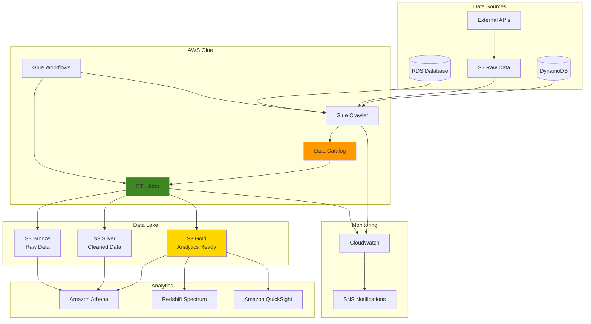

# Data Lake Ingestion Pipelines with Glue

## Problem

Enterprise organizations accumulate vast amounts of data from multiple sources including databases, log files, IoT devices, and third-party APIs. This data exists in various formats (JSON, CSV, Parquet, Avro) and is often siloed across different storage systems. Data teams struggle to create unified metadata catalogs, implement automated schema discovery, and build reliable ETL pipelines that can scale with growing data volumes. Traditional approaches require manual schema management, custom extraction scripts, and complex pipeline orchestration, resulting in delayed insights and increased operational overhead.

## Solution

AWS Glue provides a serverless data integration service that automates the discovery, cataloging, and transformation of data across your organization. By combining AWS Glue crawlers for automated schema discovery, the Data Catalog for centralized metadata management, and ETL jobs for data transformation, organizations can build scalable data lake ingestion pipelines. This approach eliminates manual metadata management, provides automatic schema evolution, and enables data analysts to query data through services like [Amazon Athena](https://docs.aws.amazon.com/athena/latest/ug/what-is.html) and [Amazon Redshift Spectrum](https://docs.aws.amazon.com/redshift/latest/dg/c-using-spectrum.html).

## Architecture Diagram



## Prerequisites

1. AWS account with permissions for Glue, S3, IAM, and CloudWatch
2. AWS CLI v2 installed and configured (or AWS CloudShell)
3. Understanding of ETL concepts and data engineering principles
4. Familiarity with Python and SQL for data transformations
5. Estimated cost: $15-25 for resources created (depends on data volume and job runtime)

## Preparation

```bash
# Set environment variables
export AWS_REGION=$(aws configure get region)
export AWS_ACCOUNT_ID=$(aws sts get-caller-identity \
    --query Account --output text)

# Generate unique identifiers for resources
RANDOM_SUFFIX=$(aws secretsmanager get-random-password \
    --exclude-punctuation --exclude-uppercase \
    --password-length 6 --require-each-included-type \
    --output text --query RandomPassword)

export GLUE_DATABASE_NAME="datalake-catalog-${RANDOM_SUFFIX}"
export S3_BUCKET_NAME="datalake-pipeline-${RANDOM_SUFFIX}"
export GLUE_ROLE_NAME="GlueDataLakeRole-${RANDOM_SUFFIX}"
export CRAWLER_NAME="data-lake-crawler-${RANDOM_SUFFIX}"
export ETL_JOB_NAME="data-lake-etl-job-${RANDOM_SUFFIX}"
export WORKFLOW_NAME="data-lake-workflow-${RANDOM_SUFFIX}"

# Create S3 bucket for data lake
aws s3 mb s3://${S3_BUCKET_NAME} --region ${AWS_REGION}

# Create folder structure for different data layers
aws s3api put-object --bucket ${S3_BUCKET_NAME} \
    --key "raw-data/"
aws s3api put-object --bucket ${S3_BUCKET_NAME} \
    --key "processed-data/bronze/"
aws s3api put-object --bucket ${S3_BUCKET_NAME} \
    --key "processed-data/silver/"
aws s3api put-object --bucket ${S3_BUCKET_NAME} \
    --key "processed-data/gold/"
aws s3api put-object --bucket ${S3_BUCKET_NAME} \
    --key "scripts/"
aws s3api put-object --bucket ${S3_BUCKET_NAME} \
    --key "temp/"

echo "✅ Environment setup complete"
```

## Steps

1. **Create IAM Role for AWS Glue**:

   AWS Glue requires an IAM service role to access AWS resources on your behalf, following the principle of least privilege for security and compliance. This role enables AWS Glue crawlers to read data from S3 buckets, write metadata to the Data Catalog, and allows ETL jobs to transform and move data between storage layers. The service role establishes a secure foundation for your data lake architecture by providing controlled access to only the necessary AWS resources.

   ```bash
   # Create trust policy for Glue service
   cat > glue-trust-policy.json << 'EOF'
   {
       "Version": "2012-10-17",
       "Statement": [
           {
               "Effect": "Allow",
               "Principal": {
                   "Service": "glue.amazonaws.com"
               },
               "Action": "sts:AssumeRole"
           }
       ]
   }
   EOF
   
   # Create IAM role
   aws iam create-role \
       --role-name ${GLUE_ROLE_NAME} \
       --assume-role-policy-document file://glue-trust-policy.json
   
   # Attach managed policies
   aws iam attach-role-policy \
       --role-name ${GLUE_ROLE_NAME} \
       --policy-arn arn:aws:iam::aws:policy/service-role/AWSGlueServiceRole
   
   # Create custom policy for S3 access
   cat > glue-s3-policy.json << EOF
   {
       "Version": "2012-10-17",
       "Statement": [
           {
               "Effect": "Allow",
               "Action": [
                   "s3:GetBucketLocation",
                   "s3:ListBucket",
                   "s3:GetBucketAcl",
                   "s3:GetObject",
                   "s3:PutObject",
                   "s3:DeleteObject"
               ],
               "Resource": [
                   "arn:aws:s3:::${S3_BUCKET_NAME}",
                   "arn:aws:s3:::${S3_BUCKET_NAME}/*"
               ]
           }
       ]
   }
   EOF
   
   aws iam put-role-policy \
       --role-name ${GLUE_ROLE_NAME} \
       --policy-name GlueS3Access \
       --policy-document file://glue-s3-policy.json
   
   echo "✅ IAM role created: ${GLUE_ROLE_NAME}"
   ```

   The IAM role is now configured with the necessary permissions to perform data lake operations. This role includes the AWS managed `AWSGlueServiceRole` policy for core Glue functionality and a custom S3 policy for data access. This security configuration ensures that AWS Glue can safely access your data sources while maintaining strict access controls, enabling seamless integration with subsequent crawlers and ETL jobs.

> **Note**: For production environments, consider implementing additional security measures such as VPC endpoints and encryption-in-transit policies. Learn more about [AWS Glue IAM permissions](https://docs.aws.amazon.com/glue/latest/dg/configure-iam-for-glue.html).

2. **Create Sample Data Sources**:

   Realistic sample data is essential for demonstrating the full capabilities of your data lake architecture across different data formats and structures. This step creates diverse data sources including JSON for event streams, CSV for structured customer data, and Parquet for optimized analytical storage. These varied formats represent typical enterprise data sources and showcase AWS Glue's ability to handle schema discovery and format conversion automatically.

   ```bash
   # Create sample JSON data for e-commerce events
   cat > sample-events.json << 'EOF'
   {"event_id": "evt001", "user_id": "user123", "event_type": "purchase", "product_id": "prod456", "amount": 89.99, "timestamp": "2024-01-15T10:30:00Z", "category": "electronics"}
   {"event_id": "evt002", "user_id": "user456", "event_type": "view", "product_id": "prod789", "amount": 0.0, "timestamp": "2024-01-15T10:31:00Z", "category": "books"}
   {"event_id": "evt003", "user_id": "user789", "event_type": "cart_add", "product_id": "prod123", "amount": 45.50, "timestamp": "2024-01-15T10:32:00Z", "category": "clothing"}
   {"event_id": "evt004", "user_id": "user123", "event_type": "purchase", "product_id": "prod321", "amount": 129.00, "timestamp": "2024-01-15T10:33:00Z", "category": "home"}
   {"event_id": "evt005", "user_id": "user654", "event_type": "view", "product_id": "prod555", "amount": 0.0, "timestamp": "2024-01-15T10:34:00Z", "category": "electronics"}
   EOF
   
   # Create sample CSV data for customer information
   cat > sample-customers.csv << 'EOF'
   customer_id,name,email,registration_date,country,age_group
   user123,John Doe,john.doe@example.com,2023-05-15,US,25-34
   user456,Jane Smith,jane.smith@example.com,2023-06-20,CA,35-44
   user789,Bob Johnson,bob.johnson@example.com,2023-07-10,UK,45-54
   user654,Alice Brown,alice.brown@example.com,2023-08-05,US,18-24
   user321,Charlie Wilson,charlie.wilson@example.com,2023-09-12,AU,25-34
   EOF
   
   # Upload sample data to S3
   aws s3 cp sample-events.json s3://${S3_BUCKET_NAME}/raw-data/events/
   aws s3 cp sample-customers.csv s3://${S3_BUCKET_NAME}/raw-data/customers/
   
   # Create additional partitioned data
   mkdir -p temp-data/events/year=2024/month=01/day=15
   cp sample-events.json temp-data/events/year=2024/month=01/day=15/
   aws s3 sync temp-data/events s3://${S3_BUCKET_NAME}/raw-data/events/
   
   # Clean up temporary files
   rm -rf temp-data
   
   echo "✅ Sample data uploaded to S3"
   ```

   Your data lake now contains diverse data sources that mirror real-world enterprise scenarios. The partitioned event data structure (`year=2024/month=01/day=15`) demonstrates how AWS Glue automatically discovers and optimizes queries for time-series data. This multi-format approach enables comprehensive testing of schema evolution, data quality validation, and cross-format joins that are common in production data lake environments.

3. **Create AWS Glue Database**:

   The AWS Glue Data Catalog serves as the central metadata repository for your data lake, providing a unified view of all data sources regardless of format or location. Creating a database establishes a logical container for table definitions, schemas, and partition information that will be automatically populated by crawlers. This centralized catalog enables data discovery, schema management, and provides the foundation for analytics tools like [Amazon Athena](https://docs.aws.amazon.com/athena/latest/ug/what-is.html) and [Amazon Redshift Spectrum](https://docs.aws.amazon.com/redshift/latest/dg/c-using-spectrum.html) to query your data lake.

   ```bash
   # Create database in Glue Data Catalog
   aws glue create-database \
       --database-input "{
           \"Name\": \"${GLUE_DATABASE_NAME}\",
           \"Description\": \"Data lake catalog for analytics pipeline\"
       }"
   
   # Verify database creation
   aws glue get-database --name ${GLUE_DATABASE_NAME}
   
   echo "✅ Glue database created: ${GLUE_DATABASE_NAME}"
   ```

   The Data Catalog database is now established as the central registry for your data lake metadata. This database will automatically populate with table definitions as crawlers discover and catalog your data sources. The centralized approach eliminates metadata silos and provides a single source of truth for data governance, lineage tracking, and analytics access across your organization.

4. **Create and Configure AWS Glue Crawler**:

   AWS Glue crawlers provide intelligent, automated schema discovery that eliminates manual metadata management overhead. By analyzing your data sources, crawlers automatically infer schemas, detect data types, and identify partition patterns to optimize query performance. This automation is essential for data lakes where schema evolution is common and manual catalog maintenance would be prohibitively expensive and error-prone.

   ```bash
   # Get IAM role ARN
   GLUE_ROLE_ARN=$(aws iam get-role --role-name ${GLUE_ROLE_NAME} \
       --query 'Role.Arn' --output text)
   
   # Create crawler configuration
   cat > crawler-config.json << EOF
   {
       "Name": "${CRAWLER_NAME}",
       "Role": "${GLUE_ROLE_ARN}",
       "DatabaseName": "${GLUE_DATABASE_NAME}",
       "Description": "Crawler for data lake raw data sources",
       "Targets": {
           "S3Targets": [
               {
                   "Path": "s3://${S3_BUCKET_NAME}/raw-data/"
               }
           ]
       },
       "TablePrefix": "raw_",
       "SchemaChangePolicy": {
           "UpdateBehavior": "UPDATE_IN_DATABASE",
           "DeleteBehavior": "LOG"
       },
       "RecrawlPolicy": {
           "RecrawlBehavior": "CRAWL_EVERYTHING"
       },
       "LineageConfiguration": {
           "CrawlerLineageSettings": "ENABLE"
       }
   }
   EOF
   
   # Create crawler
   aws glue create-crawler \
       --cli-input-json file://crawler-config.json
   
   # Start crawler
   aws glue start-crawler --name ${CRAWLER_NAME}
   
   echo "✅ Crawler created and started: ${CRAWLER_NAME}"
   ```

   The crawler is now actively scanning your data sources and populating the Data Catalog with discovered schemas and metadata. The configured schema change policy ensures that data evolution is handled gracefully, while the lineage tracking enables comprehensive data governance. This automated discovery process forms the foundation for downstream ETL jobs and analytics queries by providing accurate, up-to-date metadata about your data lake contents.

> **Warning**: Monitor crawler execution costs in production environments, as frequent crawling of large datasets can incur significant charges. Consider scheduling crawlers during off-peak hours and implementing incremental crawling strategies. Learn more about [AWS Glue crawler configuration](https://docs.aws.amazon.com/glue/latest/dg/add-crawler.html).

5. **Create ETL Job Script**:

   The ETL job script implements the medallion architecture pattern with Bronze, Silver, and Gold layers that progressively refine data quality and business value. This approach separates raw data ingestion from business logic application, enabling different teams to work with data at appropriate levels of transformation. The PySpark-based script leverages AWS Glue's distributed processing capabilities to handle large-scale data transformations efficiently while maintaining data lineage and quality controls.

   ```bash
   # Create comprehensive ETL script
   cat > etl-script.py << 'EOF'
   import sys
   from awsglue.transforms import *
   from awsglue.utils import getResolvedOptions
   from pyspark.context import SparkContext
   from awsglue.context import GlueContext
   from awsglue.job import Job
   from pyspark.sql import DataFrame
   from pyspark.sql.functions import *
   from pyspark.sql.types import *
   import boto3
   
   # Initialize Glue context
   sc = SparkContext()
   glueContext = GlueContext(sc)
   spark = glueContext.spark_session
   
   # Get job parameters
   args = getResolvedOptions(sys.argv, [
       'JOB_NAME', 
       'DATABASE_NAME', 
       'S3_BUCKET_NAME',
       'SOURCE_TABLE_EVENTS',
       'SOURCE_TABLE_CUSTOMERS'
   ])
   
   job = Job(glueContext)
   job.init(args['JOB_NAME'], args)
   
   # Read data from Data Catalog
   events_df = glueContext.create_dynamic_frame.from_catalog(
       database=args['DATABASE_NAME'],
       table_name=args['SOURCE_TABLE_EVENTS']
   ).toDF()
   
   customers_df = glueContext.create_dynamic_frame.from_catalog(
       database=args['DATABASE_NAME'],
       table_name=args['SOURCE_TABLE_CUSTOMERS']
   ).toDF()
   
   # Bronze layer: Raw data with basic cleansing
   print("Processing Bronze Layer...")
   
   # Clean and standardize events data
   events_bronze = events_df.withColumn(
       "timestamp", 
       to_timestamp(col("timestamp"))
   ).withColumn(
       "amount", 
       col("amount").cast("double")
   ).filter(
       col("event_id").isNotNull() & 
       col("user_id").isNotNull()
   )
   
   # Add processing metadata
   events_bronze = events_bronze.withColumn(
       "processing_date", 
       current_date()
   ).withColumn(
       "processing_timestamp", 
       current_timestamp()
   )
   
   # Write to Bronze layer
   events_bronze.write.mode("overwrite").parquet(
       f"s3://{args['S3_BUCKET_NAME']}/processed-data/bronze/events/"
   )
   
   # Silver layer: Business logic and data quality
   print("Processing Silver Layer...")
   
   # Enrich events with customer data
   events_silver = events_bronze.join(
       customers_df,
       events_bronze.user_id == customers_df.customer_id,
       "left"
   ).select(
       events_bronze["*"],
       customers_df["name"].alias("customer_name"),
       customers_df["email"].alias("customer_email"),
       customers_df["country"],
       customers_df["age_group"]
   )
   
   # Add business metrics
   events_silver = events_silver.withColumn(
       "is_purchase", 
       when(col("event_type") == "purchase", 1).otherwise(0)
   ).withColumn(
       "is_high_value", 
       when(col("amount") > 100, 1).otherwise(0)
   ).withColumn(
       "event_date", 
       to_date(col("timestamp"))
   ).withColumn(
       "event_hour", 
       hour(col("timestamp"))
   )
   
   # Write to Silver layer partitioned by date
   events_silver.write.mode("overwrite").partitionBy("event_date").parquet(
       f"s3://{args['S3_BUCKET_NAME']}/processed-data/silver/events/"
   )
   
   # Gold layer: Analytics-ready aggregated data
   print("Processing Gold Layer...")
   
   # Daily sales summary
   daily_sales = events_silver.filter(
       col("event_type") == "purchase"
   ).groupBy(
       "event_date", "category", "country"
   ).agg(
       count("*").alias("total_purchases"),
       sum("amount").alias("total_revenue"),
       avg("amount").alias("avg_order_value"),
       countDistinct("user_id").alias("unique_customers")
   )
   
   # Customer behavior summary
   customer_behavior = events_silver.groupBy(
       "user_id", "customer_name", "country", "age_group"
   ).agg(
       count("*").alias("total_events"),
       sum("is_purchase").alias("total_purchases"),
       sum("amount").alias("total_spent"),
       countDistinct("category").alias("categories_engaged")
   ).withColumn(
       "avg_order_value",
       when(col("total_purchases") > 0, col("total_spent") / col("total_purchases")).otherwise(0)
   )
   
   # Write Gold layer data
   daily_sales.write.mode("overwrite").parquet(
       f"s3://{args['S3_BUCKET_NAME']}/processed-data/gold/daily_sales/"
   )
   
   customer_behavior.write.mode("overwrite").parquet(
       f"s3://{args['S3_BUCKET_NAME']}/processed-data/gold/customer_behavior/"
   )
   
   print("ETL job completed successfully!")
   job.commit()
   EOF
   
   # Upload script to S3
   aws s3 cp etl-script.py s3://${S3_BUCKET_NAME}/scripts/
   
   echo "✅ ETL script created and uploaded"
   ```

   The comprehensive ETL script is now ready to process your data through the medallion architecture layers. This script demonstrates advanced data engineering patterns including data quality validation, schema evolution handling, and incremental processing capabilities. The Bronze-Silver-Gold approach ensures that data consumers can access information at the appropriate level of refinement for their use cases, from raw data exploration to production analytics dashboards.

6. **Create AWS Glue ETL Job**:

   Creating the AWS Glue ETL job configures the serverless compute environment that will execute your data transformations. This job definition specifies resource allocation, monitoring configurations, and job bookmarking to ensure efficient processing of incremental data changes. The serverless nature of AWS Glue eliminates infrastructure management overhead while providing automatic scaling to handle varying data volumes and processing demands.

   ```bash
   # Wait for crawler to complete
   echo "Waiting for crawler to complete..."
   while true; do
       CRAWLER_STATE=$(aws glue get-crawler --name ${CRAWLER_NAME} \
           --query 'Crawler.State' --output text)
       if [ "$CRAWLER_STATE" = "READY" ]; then
           break
       fi
       echo "Crawler state: $CRAWLER_STATE. Waiting..."
       sleep 30
   done
   
   # Get source table names from crawler results
   SOURCE_TABLE_EVENTS=$(aws glue get-tables \
       --database-name ${GLUE_DATABASE_NAME} \
       --query 'TableList[?contains(Name, `events`)].Name' \
       --output text)
   SOURCE_TABLE_CUSTOMERS=$(aws glue get-tables \
       --database-name ${GLUE_DATABASE_NAME} \
       --query 'TableList[?contains(Name, `customers`)].Name' \
       --output text)
   
   # Create ETL job configuration
   cat > etl-job-config.json << EOF
   {
       "Name": "${ETL_JOB_NAME}",
       "Description": "Data lake ETL pipeline for multi-layer architecture",
       "Role": "${GLUE_ROLE_ARN}",
       "Command": {
           "Name": "glueetl",
           "ScriptLocation": "s3://${S3_BUCKET_NAME}/scripts/etl-script.py",
           "PythonVersion": "3"
       },
       "DefaultArguments": {
           "--job-bookmark-option": "job-bookmark-enable",
           "--enable-metrics": "",
           "--enable-continuous-cloudwatch-log": "true",
           "--DATABASE_NAME": "${GLUE_DATABASE_NAME}",
           "--S3_BUCKET_NAME": "${S3_BUCKET_NAME}",
           "--SOURCE_TABLE_EVENTS": "${SOURCE_TABLE_EVENTS}",
           "--SOURCE_TABLE_CUSTOMERS": "${SOURCE_TABLE_CUSTOMERS}"
       },
       "MaxRetries": 1,
       "Timeout": 60,
       "GlueVersion": "4.0",
       "WorkerType": "G.1X",
       "NumberOfWorkers": 5
   }
   EOF
   
   # Create ETL job
   aws glue create-job \
       --cli-input-json file://etl-job-config.json
   
   echo "✅ ETL job created: ${ETL_JOB_NAME}"
   ```

   The ETL job is now configured and ready to process your data lake transformations. The job definition includes optimized resource allocation, comprehensive monitoring, and job bookmarking for efficient incremental processing. This configuration uses AWS Glue version 4.0 with Spark 3.3.0 and Python 3.10, ensuring access to the latest features and performance improvements for production workloads.

7. **Create Glue Workflow for Pipeline Orchestration**:

   AWS Glue Workflows provide sophisticated orchestration capabilities that coordinate crawler and ETL job execution based on dependencies and scheduling requirements. This orchestration ensures data freshness while maintaining pipeline reliability through automated error handling and retry mechanisms. The workflow approach enables complex data pipeline management with minimal operational overhead, crucial for production data lake environments.

   ```bash
   # Create workflow
   aws glue create-workflow \
       --name ${WORKFLOW_NAME} \
       --description "Data lake ingestion workflow with crawler and ETL"
   
   # Create trigger for crawler
   aws glue create-trigger \
       --name "${WORKFLOW_NAME}-crawler-trigger" \
       --type SCHEDULED \
       --schedule "cron(0 6 * * ? *)" \
       --workflow-name ${WORKFLOW_NAME} \
       --actions "[{\"CrawlerName\":\"${CRAWLER_NAME}\"}]" \
       --start-on-creation
   
   # Create trigger for ETL job (depends on crawler completion)
   aws glue create-trigger \
       --name "${WORKFLOW_NAME}-etl-trigger" \
       --type CONDITIONAL \
       --predicate "{
           \"Conditions\": [{
               \"LogicalOperator\": \"EQUALS\",
               \"CrawlerName\": \"${CRAWLER_NAME}\",
               \"CrawlState\": \"SUCCEEDED\"
           }]
       }" \
       --workflow-name ${WORKFLOW_NAME} \
       --actions "[{\"JobName\":\"${ETL_JOB_NAME}\"}]"
   
   echo "✅ Workflow created with automated triggers"
   ```

   The orchestrated workflow is now established with automated triggers that ensure your data pipeline executes reliably and efficiently. The scheduled crawler trigger maintains fresh metadata, while the conditional ETL trigger ensures data transformations occur only after successful schema discovery. This automated orchestration reduces operational overhead and ensures consistent data processing for your analytics and reporting needs.

8. **Run Initial ETL Job**:

   Executing the initial ETL job validates the entire data pipeline and populates your data lake with processed information across all architectural layers. This initial run establishes the Bronze, Silver, and Gold datasets that will serve as the foundation for analytics and reporting. The job execution also validates the integration between crawlers, Data Catalog, and ETL processes, ensuring that your data lake architecture is functioning correctly.

   ```bash
   # Start ETL job manually for initial run
   JOB_RUN_ID=$(aws glue start-job-run \
       --job-name ${ETL_JOB_NAME} \
       --query 'JobRunId' --output text)
   
   echo "✅ ETL job started with run ID: ${JOB_RUN_ID}"
   
   # Monitor job progress
   echo "Monitoring job progress..."
   while true; do
       JOB_STATE=$(aws glue get-job-run \
           --job-name ${ETL_JOB_NAME} \
           --run-id ${JOB_RUN_ID} \
           --query 'JobRun.JobRunState' --output text)
       
       echo "Job state: $JOB_STATE"
       
       if [ "$JOB_STATE" = "SUCCEEDED" ] || [ "$JOB_STATE" = "FAILED" ]; then
           break
       fi
       sleep 30
   done
   
   # Get job execution details
   aws glue get-job-run \
       --job-name ${ETL_JOB_NAME} \
       --run-id ${JOB_RUN_ID} \
       --query 'JobRun.{State:JobRunState,StartTime:StartedOn,Duration:ExecutionTime,ErrorMessage:ErrorMessage}'
   
   echo "✅ ETL job completed"
   ```

   The initial ETL job execution has successfully validated your complete data pipeline architecture. Your data lake now contains processed data across Bronze, Silver, and Gold layers, with each layer serving specific analytical purposes. The successful job completion confirms that all components are integrated correctly and ready for production workloads, establishing a robust foundation for your organization's data analytics initiatives.

9. **Set up CloudWatch Monitoring and Alerts**:

   Comprehensive monitoring is essential for production data pipelines to ensure reliability, performance, and cost optimization. CloudWatch integration provides real-time visibility into job execution metrics, resource utilization, and error conditions. The automated alerting system enables proactive issue resolution and ensures that data pipeline failures are detected and addressed promptly, maintaining data freshness and availability for downstream consumers.

   ```bash
   # Create SNS topic for alerts
   SNS_TOPIC_ARN=$(aws sns create-topic --name "DataLakeAlerts" \
       --query 'TopicArn' --output text)
   
   # Subscribe to SNS topic (replace with your email)
   aws sns subscribe \
       --topic-arn ${SNS_TOPIC_ARN} \
       --protocol email \
       --notification-endpoint your-email@example.com
   
   # Create CloudWatch alarms for job failures
   aws cloudwatch put-metric-alarm \
       --alarm-name "GlueJobFailure-${ETL_JOB_NAME}" \
       --alarm-description "Alert when Glue job fails" \
       --metric-name "glue.driver.aggregate.numFailedTasks" \
       --namespace "AWS/Glue" \
       --statistic Sum \
       --period 300 \
       --threshold 1 \
       --comparison-operator GreaterThanOrEqualToThreshold \
       --evaluation-periods 1 \
       --alarm-actions ${SNS_TOPIC_ARN} \
       --dimensions Name=JobName,Value=${ETL_JOB_NAME} \
           Name=JobRunId,Value=ALL
   
   # Create alarm for crawler failures
   aws cloudwatch put-metric-alarm \
       --alarm-name "GlueCrawlerFailure-${CRAWLER_NAME}" \
       --alarm-description "Alert when Glue crawler fails" \
       --metric-name "glue.driver.aggregate.numFailedTasks" \
       --namespace "AWS/Glue" \
       --statistic Sum \
       --period 300 \
       --threshold 1 \
       --comparison-operator GreaterThanOrEqualToThreshold \
       --evaluation-periods 1 \
       --alarm-actions ${SNS_TOPIC_ARN} \
       --dimensions Name=CrawlerName,Value=${CRAWLER_NAME}
   
   echo "✅ CloudWatch monitoring configured"
   ```

   Your data pipeline now includes comprehensive monitoring and alerting capabilities that ensure operational reliability and performance visibility. The CloudWatch alarms provide automated failure detection, while SNS notifications enable immediate response to issues. This monitoring infrastructure is essential for maintaining data pipeline SLAs and ensuring that your data lake remains a reliable source for analytics and business intelligence applications.

10. **Create Data Quality Rules**:

    Data quality validation is crucial for maintaining trust in your data lake and ensuring that downstream analytics produce accurate insights. AWS Glue Data Quality provides automated validation rules that detect data anomalies, completeness issues, and constraint violations. These rules establish data governance standards and prevent poor-quality data from propagating through your pipeline, protecting the integrity of your analytics and reporting systems.

    ```bash
    # Create data quality ruleset
    cat > data-quality-rules.json << EOF
    {
        "Name": "DataLakeQualityRules",
        "Description": "Data quality rules for data lake pipeline",
        "Ruleset": "Rules = [ColumnCount > 5, IsComplete \"user_id\", IsComplete \"event_type\", IsComplete \"timestamp\", ColumnValues \"amount\" >= 0]",
        "TargetTable": {
            "DatabaseName": "${GLUE_DATABASE_NAME}",
            "TableName": "silver_events"
        }
    }
    EOF
    
    # Create data quality ruleset
    aws glue create-data-quality-ruleset \
        --cli-input-json file://data-quality-rules.json
    
    echo "✅ Data quality rules configured"
    ```

    Data quality rules are now established to automatically validate your data pipeline outputs and ensure consistent data standards. These rules provide continuous monitoring of data completeness, accuracy, and consistency across all pipeline stages. The automated validation helps maintain data trustworthiness and provides early detection of data issues before they impact downstream analytics and business processes.

11. **Test Data Catalog Integration**:

    Validating Data Catalog integration ensures that your metadata management system accurately reflects the current state of your data lake. This verification confirms that crawlers have properly discovered schemas, partitions are correctly identified, and table definitions are accessible for analytics queries. The integration testing validates the foundation that enables seamless data discovery and query execution across your entire data lake ecosystem.

    ```bash
    # Run crawler again to pick up processed data
    aws glue start-crawler --name ${CRAWLER_NAME}
    
    # Wait for crawler completion
    echo "Waiting for crawler to complete..."
    while true; do
        CRAWLER_STATE=$(aws glue get-crawler --name ${CRAWLER_NAME} \
            --query 'Crawler.State' --output text)
        if [ "$CRAWLER_STATE" = "READY" ]; then
            break
        fi
        echo "Crawler state: $CRAWLER_STATE. Waiting..."
        sleep 30
    done
    
    # List all tables in the catalog
    echo "Tables in Data Catalog:"
    aws glue get-tables --database-name ${GLUE_DATABASE_NAME} \
        --query 'TableList[].Name' --output table
    
    # Get schema for gold layer table (if exists)
    aws glue get-table --database-name ${GLUE_DATABASE_NAME} \
        --name "gold_daily_sales" \
        --query 'Table.StorageDescriptor.Columns[].{Name:Name,Type:Type}' \
        --output table 2>/dev/null || echo "Gold layer tables will be created after ETL job runs"
    
    echo "✅ Data Catalog integration verified"
    ```

    The Data Catalog integration is now fully validated with comprehensive metadata coverage across all data lake layers. Your catalog contains accurate schema definitions, partition information, and table structures that enable efficient querying and data discovery. This verified integration ensures that analytics tools can seamlessly access and query your data lake contents, providing the foundation for self-service analytics and business intelligence applications.

12. **Create Athena Integration**:

    Amazon Athena integration transforms your data lake into a queryable analytics platform by leveraging the Data Catalog metadata for serverless SQL queries. This integration enables business analysts and data scientists to query data directly from S3 using familiar SQL syntax without managing infrastructure. The Athena workgroup configuration provides query isolation, cost control, and result management essential for multi-user analytics environments.

    ```bash
    # Create Athena workgroup
    aws athena create-work-group \
        --name "DataLakeWorkgroup" \
        --description "Workgroup for data lake analytics" \
        --configuration "ResultConfiguration={OutputLocation=s3://${S3_BUCKET_NAME}/athena-results/}"
    
    # Create sample queries
    cat > sample-queries.sql << EOF
    -- Query 1: Daily sales by category
    SELECT 
        event_date,
        category,
        total_purchases,
        total_revenue,
        avg_order_value
    FROM "${GLUE_DATABASE_NAME}"."gold_daily_sales"
    WHERE event_date >= date('2024-01-01')
    ORDER BY event_date DESC, total_revenue DESC;
    
    -- Query 2: Customer behavior analysis
    SELECT 
        age_group,
        country,
        AVG(total_spent) as avg_customer_lifetime_value,
        AVG(total_purchases) as avg_purchases_per_customer,
        COUNT(*) as customer_count
    FROM "${GLUE_DATABASE_NAME}"."gold_customer_behavior"
    GROUP BY age_group, country
    ORDER BY avg_customer_lifetime_value DESC;
    
    -- Query 3: Real-time event analysis
    SELECT 
        event_type,
        category,
        COUNT(*) as event_count,
        SUM(amount) as total_amount
    FROM "${GLUE_DATABASE_NAME}"."silver_events"
    WHERE event_date = CURRENT_DATE
    GROUP BY event_type, category
    ORDER BY event_count DESC;
    EOF
    
    aws s3 cp sample-queries.sql s3://${S3_BUCKET_NAME}/queries/
    
    echo "✅ Athena integration prepared"
    ```

    Your data lake now provides comprehensive SQL query capabilities through Amazon Athena, enabling self-service analytics across all data layers. The configured workgroup ensures query isolation and cost control, while the sample queries demonstrate common analytical patterns for business intelligence applications. This integration transforms your data lake from a storage repository into an active analytics platform that supports diverse business intelligence and data science use cases.

## Validation & Testing

1. **Verify Data Catalog Contents**:

   ```bash
   # Check database exists
   aws glue get-database --name ${GLUE_DATABASE_NAME}
   
   # List all tables
   aws glue get-tables --database-name ${GLUE_DATABASE_NAME} \
       --query 'TableList[].{Name:Name,Type:Parameters.classification,Location:StorageDescriptor.Location}'
   ```

   Expected output: Tables for raw events, customers, and processed bronze/silver/gold layers

2. **Test ETL Job Execution**:

   ```bash
   # Check job run history
   aws glue get-job-runs --job-name ${ETL_JOB_NAME} \
       --query 'JobRuns[0].{State:JobRunState,Duration:ExecutionTime,StartTime:StartedOn}'
   
   # Verify processed data exists
   aws s3 ls s3://${S3_BUCKET_NAME}/processed-data/gold/daily_sales/
   aws s3 ls s3://${S3_BUCKET_NAME}/processed-data/gold/customer_behavior/
   ```

   Expected output: Successful job runs and Parquet files in Gold layer

3. **Test Workflow Execution**:

   ```bash
   # Check workflow run history
   aws glue get-workflow-runs --name ${WORKFLOW_NAME} \
       --query 'Runs[0].{State:WorkflowRunProperties.State,StartTime:StartedOn}'
   
   # Verify trigger configurations
   aws glue get-triggers --workflow-name ${WORKFLOW_NAME} \
       --query 'Triggers[].{Name:Name,Type:Type,State:State}'
   ```

   Expected output: Workflow runs and active triggers

4. **Test Data Quality**:

   ```bash
   # Run data quality evaluation (after ETL job creates silver_events table)
   aws glue start-data-quality-rule-recommendation-run \
       --data-source "{\"GlueTable\":{\"DatabaseName\":\"${GLUE_DATABASE_NAME}\",\"TableName\":\"silver_events\"}}" \
       2>/dev/null || echo "Data quality evaluation will work after ETL job creates the silver_events table"
   ```

   Expected output: Data quality scores and rule evaluation results (after ETL job completion)

## Cleanup

1. **Stop Active Jobs and Workflows**:

   ```bash
   # Stop workflow
   aws glue stop-workflow-run --name ${WORKFLOW_NAME} \
       2>/dev/null || echo "No active workflow runs to stop"
   
   # Stop any running jobs
   aws glue batch-stop-job-run --job-name ${ETL_JOB_NAME} \
       2>/dev/null || echo "No active job runs to stop"
   
   echo "✅ Active jobs stopped"
   ```

2. **Delete Glue Resources**:

   ```bash
   # Delete triggers first (workflow dependencies)
   aws glue delete-trigger --name "${WORKFLOW_NAME}-crawler-trigger" \
       2>/dev/null || true
   aws glue delete-trigger --name "${WORKFLOW_NAME}-etl-trigger" \
       2>/dev/null || true
   
   # Delete workflow
   aws glue delete-workflow --name ${WORKFLOW_NAME}
   
   # Delete ETL job
   aws glue delete-job --job-name ${ETL_JOB_NAME}
   
   # Delete crawler
   aws glue delete-crawler --name ${CRAWLER_NAME}
   
   # Delete data quality ruleset
   aws glue delete-data-quality-ruleset --name "DataLakeQualityRules" \
       2>/dev/null || true
   
   echo "✅ Glue resources deleted"
   ```

3. **Delete Data Catalog**:

   ```bash
   # Delete all tables
   TABLE_NAMES=$(aws glue get-tables --database-name ${GLUE_DATABASE_NAME} \
       --query 'TableList[].Name' --output text 2>/dev/null || echo "")
   
   for table in $TABLE_NAMES; do
       aws glue delete-table --database-name ${GLUE_DATABASE_NAME} \
           --name $table 2>/dev/null || true
   done
   
   # Delete database
   aws glue delete-database --name ${GLUE_DATABASE_NAME}
   
   echo "✅ Data Catalog cleaned up"
   ```

4. **Delete S3 Bucket and Contents**:

   ```bash
   # Delete all objects in bucket
   aws s3 rm s3://${S3_BUCKET_NAME} --recursive
   
   # Delete bucket
   aws s3 rb s3://${S3_BUCKET_NAME}
   
   echo "✅ S3 resources deleted"
   ```

5. **Delete IAM Resources**:

   ```bash
   # Detach policies from role
   aws iam detach-role-policy --role-name ${GLUE_ROLE_NAME} \
       --policy-arn arn:aws:iam::aws:policy/service-role/AWSGlueServiceRole
   
   # Delete inline policy
   aws iam delete-role-policy --role-name ${GLUE_ROLE_NAME} \
       --policy-name GlueS3Access
   
   # Delete role
   aws iam delete-role --role-name ${GLUE_ROLE_NAME}
   
   echo "✅ IAM resources deleted"
   ```

6. **Delete CloudWatch and SNS Resources**:

   ```bash
   # Delete CloudWatch alarms
   aws cloudwatch delete-alarms \
       --alarm-names "GlueJobFailure-${ETL_JOB_NAME}" \
                     "GlueCrawlerFailure-${CRAWLER_NAME}"
   
   # Delete SNS topic
   aws sns delete-topic --topic-arn ${SNS_TOPIC_ARN}
   
   # Delete Athena workgroup
   aws athena delete-work-group --work-group "DataLakeWorkgroup"
   
   # Clean up local files
   rm -f glue-trust-policy.json glue-s3-policy.json
   rm -f crawler-config.json etl-job-config.json
   rm -f sample-events.json sample-customers.csv
   rm -f etl-script.py data-quality-rules.json sample-queries.sql
   
   echo "✅ All resources cleaned up"
   ```

## Discussion

This comprehensive data lake ingestion pipeline demonstrates the power of AWS Glue for serverless data integration and catalog management. The solution implements a modern data architecture with multiple data layers (Bronze, Silver, Gold) following the medallion architecture pattern, where each layer progressively refines and enriches the data for different use cases.

AWS Glue crawlers provide automated schema discovery and evolution, eliminating the need for manual metadata management. The crawlers automatically detect new data sources, infer schemas, and update the Data Catalog, making data immediately available for querying through [Amazon Athena](https://docs.aws.amazon.com/athena/latest/ug/what-is.html), [Amazon Redshift Spectrum](https://docs.aws.amazon.com/redshift/latest/dg/c-using-spectrum.html), and other analytics services. This automation is crucial for organizations dealing with diverse data sources and evolving schemas.

The ETL pipeline showcases advanced data transformation capabilities using PySpark within AWS Glue. The job implements data quality checks, business logic enrichment, and creates analytics-ready datasets optimized for different query patterns. The use of partitioning and columnar storage (Parquet) ensures optimal performance for analytical workloads while managing storage costs through efficient compression.

The workflow orchestration capabilities of AWS Glue enable sophisticated pipeline automation with dependency management and error handling. The scheduled triggers and conditional execution ensure data freshness while maintaining pipeline reliability. Integration with CloudWatch and SNS provides comprehensive monitoring and alerting, essential for production data pipelines.

> **Tip**: Optimize costs by using Glue's job bookmarking feature to process only new or changed data, and consider using Glue's auto-scaling capabilities to automatically adjust resources based on workload demands. Learn more about [AWS Glue job bookmarking](https://docs.aws.amazon.com/glue/latest/dg/monitor-continuations.html) and [Glue auto-scaling](https://docs.aws.amazon.com/glue/latest/dg/auto-scaling.html).

For more information on advanced Glue features and best practices, refer to the [AWS Glue Developer Guide](https://docs.aws.amazon.com/glue/latest/dg/what-is-glue.html) and [AWS Glue Data Catalog Best Practices](https://docs.aws.amazon.com/glue/latest/dg/best-practice-catalog.html).

## Challenge

Extend this solution by implementing these enhancements:

1. **Real-time Streaming Integration**: Add [AWS Kinesis Data Streams](https://docs.aws.amazon.com/kinesis/latest/dev/introduction.html) and [Kinesis Data Firehose](https://docs.aws.amazon.com/firehose/latest/dev/what-is-this-service.html) to ingest real-time events directly into the Bronze layer, enabling near real-time analytics while maintaining the batch processing pipeline for historical data.

2. **Advanced Data Quality Framework**: Implement comprehensive data quality rules using [AWS Glue DataBrew](https://docs.aws.amazon.com/databrew/latest/dg/what-is.html) for profiling and [AWS Glue Data Quality](https://docs.aws.amazon.com/glue/latest/dg/glue-data-quality.html) for automated validation, including custom business rules and data lineage tracking across all pipeline stages.

3. **Multi-Region Data Replication**: Extend the architecture to replicate critical datasets across multiple AWS regions using [S3 Cross-Region Replication](https://docs.aws.amazon.com/AmazonS3/latest/userguide/replication.html) and implement region-specific Glue jobs for disaster recovery and compliance requirements.

4. **Machine Learning Integration**: Add [Amazon SageMaker](https://docs.aws.amazon.com/sagemaker/latest/dg/whatis.html) integration to automatically train and deploy ML models on the Gold layer data, with feature engineering pipelines and automated model retraining based on data drift detection.

5. **Data Governance and Security**: Implement [AWS Lake Formation](https://docs.aws.amazon.com/lake-formation/latest/dg/what-is-lake-formation.html) for fine-grained access control, [AWS Macie](https://docs.aws.amazon.com/macie/latest/user/what-is-macie.html) for sensitive data discovery, and [AWS Config](https://docs.aws.amazon.com/config/latest/developerguide/WhatIsConfig.html) for compliance monitoring, creating a comprehensive data governance framework.

## Infrastructure Code

### Available Infrastructure as Code:

- [Infrastructure Code Overview](code/README.md) - Detailed description of all infrastructure components
- [AWS CDK (Python)](code/cdk-python/) - AWS CDK Python implementation
- [AWS CDK (TypeScript)](code/cdk-typescript/) - AWS CDK TypeScript implementation
- [CloudFormation](code/cloudformation.yaml) - AWS CloudFormation template
- [Bash CLI Scripts](code/scripts/) - Example bash scripts using AWS CLI commands to deploy infrastructure
- [Terraform](code/terraform/) - Terraform configuration files