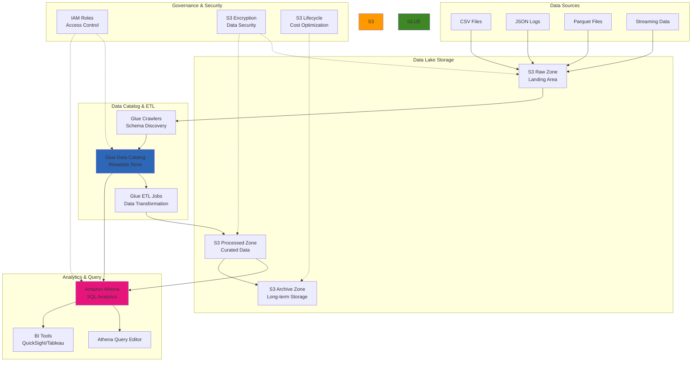

# Building Data Lake Architectures with S3, Glue, and Athena

## Problem

Organizations struggle to build cost-effective data analytics platforms that can handle diverse data sources, varying data formats, and growing data volumes without the complexity and expense of traditional data warehouses. Existing solutions often require significant upfront infrastructure investment, complex ETL processes, and specialized database administration skills. Companies need a scalable, serverless approach to store, catalog, transform, and analyze large volumes of structured and semi-structured data while maintaining cost efficiency and operational simplicity.

## Solution

Implement a serverless data lake architecture using Amazon S3 for scalable storage, AWS Glue for automated data cataloging and ETL processing, and Amazon Athena for SQL-based analytics. This solution provides automatic schema discovery, cost-effective storage with intelligent tiering, serverless query processing, and seamless integration with business intelligence tools. The architecture supports multiple data formats, enables self-service analytics, and scales automatically based on demand while following data lake best practices for partitioning and optimization.

## Architecture Diagram



## Prerequisites

1. AWS account with permissions for S3, Glue, Athena, and IAM services
2. AWS CLI v2 installed and configured with appropriate credentials
3. Basic understanding of SQL and data analytics concepts
4. Sample datasets for testing (CSV, JSON, or Parquet files)
5. Knowledge of data partitioning and optimization strategies
6. Estimated cost: $20-50/month for moderate data volumes and query frequency

> **Note**: Athena charges $5 per TB of data scanned. Use partitioning, compression, and columnar formats to minimize costs and improve query performance. Learn more about [Athena performance optimization](https://docs.aws.amazon.com/athena/latest/ug/performance-tuning-data-optimization-techniques.html) and [partitioning strategies](https://docs.aws.amazon.com/athena/latest/ug/partitions.html).

> **Warning**: Always implement proper data governance and access controls in your data lake. Unrestricted access to sensitive data can lead to compliance violations and security breaches. Follow [S3 security best practices](https://docs.aws.amazon.com/AmazonS3/latest/userguide/security-best-practices.html) for comprehensive protection.

## Preparation

```bash
# Set environment variables
export AWS_REGION=$(aws configure get region)
export AWS_ACCOUNT_ID=$(aws sts get-caller-identity \
    --query Account --output text)

# Generate unique identifiers for resources
RANDOM_SUFFIX=$(aws secretsmanager get-random-password \
    --exclude-punctuation --exclude-uppercase \
    --password-length 6 --require-each-included-type \
    --output text --query RandomPassword)

export DATA_LAKE_BUCKET="data-lake-${RANDOM_SUFFIX}"
export GLUE_DATABASE_NAME="datalake_db_${RANDOM_SUFFIX}"
export GLUE_ROLE_NAME="GlueServiceRole-${RANDOM_SUFFIX}"
export ATHENA_RESULTS_BUCKET="athena-results-${RANDOM_SUFFIX}"

echo "✅ Environment prepared"
echo "Data Lake Bucket: ${DATA_LAKE_BUCKET}"
echo "Glue Database: ${GLUE_DATABASE_NAME}"
echo "Athena Results: ${ATHENA_RESULTS_BUCKET}"
```

## Steps

1. **Create S3 buckets for data lake storage**:

   Amazon S3 provides the foundation for your data lake with 99.999999999% (11 9's) durability and multiple storage classes for cost optimization. The zone-based architecture separates raw data from processed data, enabling better governance, security, and lifecycle management while maintaining data lineage and audit capabilities.

   ```bash
   # Create main data lake bucket with versioning
   aws s3 mb s3://${DATA_LAKE_BUCKET} --region ${AWS_REGION}
   
   # Enable versioning for data protection
   aws s3api put-bucket-versioning \
       --bucket ${DATA_LAKE_BUCKET} \
       --versioning-configuration Status=Enabled
   
   # Enable server-side encryption
   aws s3api put-bucket-encryption \
       --bucket ${DATA_LAKE_BUCKET} \
       --server-side-encryption-configuration '{
           "Rules": [
               {
                   "ApplyServerSideEncryptionByDefault": {
                       "SSEAlgorithm": "AES256"
                   }
               }
           ]
       }'
   
   # Create Athena query results bucket
   aws s3 mb s3://${ATHENA_RESULTS_BUCKET} --region ${AWS_REGION}
   
   # Enable encryption for Athena results bucket
   aws s3api put-bucket-encryption \
       --bucket ${ATHENA_RESULTS_BUCKET} \
       --server-side-encryption-configuration '{
           "Rules": [
               {
                   "ApplyServerSideEncryptionByDefault": {
                       "SSEAlgorithm": "AES256"
                   }
               }
           ]
       }'
   
   # Create folder structure for data lake zones
   aws s3api put-object \
       --bucket ${DATA_LAKE_BUCKET} \
       --key raw-zone/
   
   aws s3api put-object \
       --bucket ${DATA_LAKE_BUCKET} \
       --key processed-zone/
   
   aws s3api put-object \
       --bucket ${DATA_LAKE_BUCKET} \
       --key archive-zone/
   
   echo "✅ Created S3 buckets and folder structure"
   ```

2. **Set up S3 lifecycle policies for cost optimization**:

   S3 lifecycle policies automatically transition data between storage classes based on age and access patterns. This three-tier approach (Standard → Infrequent Access → Glacier → Deep Archive) can reduce storage costs by up to 80% for typical data lake workloads where older data is accessed less frequently.

   ```bash
   # Create lifecycle policy for intelligent tiering
   cat > lifecycle-policy.json << EOF
   {
       "Rules": [
           {
               "ID": "DataLakeLifecycleRule",
               "Status": "Enabled",
               "Filter": {
                   "Prefix": "raw-zone/"
               },
               "Transitions": [
                   {
                       "Days": 30,
                       "StorageClass": "STANDARD_IA"
                   },
                   {
                       "Days": 90,
                       "StorageClass": "GLACIER"
                   },
                   {
                       "Days": 365,
                       "StorageClass": "DEEP_ARCHIVE"
                   }
               ]
           },
           {
               "ID": "ProcessedDataLifecycle",
               "Status": "Enabled",
               "Filter": {
                   "Prefix": "processed-zone/"
               },
               "Transitions": [
                   {
                       "Days": 90,
                       "StorageClass": "STANDARD_IA"
                   },
                   {
                       "Days": 180,
                       "StorageClass": "GLACIER"
                   }
               ]
           }
       ]
   }
   EOF
   
   # Apply lifecycle policy
   aws s3api put-bucket-lifecycle-configuration \
       --bucket ${DATA_LAKE_BUCKET} \
       --lifecycle-configuration file://lifecycle-policy.json
   
   echo "✅ Applied S3 lifecycle policies for cost optimization"
   ```

3. **Create IAM role for AWS Glue services**:

   AWS Glue requires specific IAM permissions to crawl data sources, write to the data catalog, and execute ETL jobs. The role combines AWS managed policies with custom permissions tailored to your S3 bucket structure, following least-privilege security principles.

   ```bash
   # Create trust policy for Glue service
   cat > glue-trust-policy.json << EOF
   {
       "Version": "2012-10-17",
       "Statement": [
           {
               "Effect": "Allow",
               "Principal": {
                   "Service": "glue.amazonaws.com"
               },
               "Action": "sts:AssumeRole"
           }
       ]
   }
   EOF
   
   # Create IAM role for Glue
   aws iam create-role \
       --role-name ${GLUE_ROLE_NAME} \
       --assume-role-policy-document file://glue-trust-policy.json
   
   # Attach AWS managed policy for Glue service
   aws iam attach-role-policy \
       --role-name ${GLUE_ROLE_NAME} \
       --policy-arn arn:aws:iam::aws:policy/service-role/AWSGlueServiceRole
   
   # Create custom policy for S3 access
   cat > glue-s3-policy.json << EOF
   {
       "Version": "2012-10-17",
       "Statement": [
           {
               "Effect": "Allow",
               "Action": [
                   "s3:GetObject",
                   "s3:PutObject",
                   "s3:DeleteObject",
                   "s3:ListBucket"
               ],
               "Resource": [
                   "arn:aws:s3:::${DATA_LAKE_BUCKET}",
                   "arn:aws:s3:::${DATA_LAKE_BUCKET}/*"
               ]
           }
       ]
   }
   EOF
   
   # Create and attach custom S3 policy
   aws iam create-policy \
       --policy-name "${GLUE_ROLE_NAME}-S3Policy" \
       --policy-document file://glue-s3-policy.json
   
   S3_POLICY_ARN=$(aws iam list-policies \
       --query "Policies[?PolicyName=='${GLUE_ROLE_NAME}-S3Policy'].Arn" \
       --output text)
   
   aws iam attach-role-policy \
       --role-name ${GLUE_ROLE_NAME} \
       --policy-arn ${S3_POLICY_ARN}
   
   # Get Glue role ARN
   GLUE_ROLE_ARN=$(aws iam get-role \
       --role-name ${GLUE_ROLE_NAME} \
       --query 'Role.Arn' --output text)
   
   echo "✅ Created IAM role for AWS Glue: ${GLUE_ROLE_ARN}"
   ```

4. **Upload sample data and create Glue database**:

   AWS Glue Data Catalog serves as the central metadata repository for your data lake, providing a unified view of all data assets across different storage locations and formats. The catalog enables automatic schema discovery, data lineage tracking, and seamless integration with analytics tools. Creating sample data with proper partitioning structure demonstrates data lake best practices and optimization strategies.

   ```bash
   # Create sample CSV data
   cat > sample-sales-data.csv << 'EOF'
   order_id,customer_id,product_name,category,quantity,price,order_date,region
   1001,C001,Laptop,Electronics,1,999.99,2024-01-15,North
   1002,C002,Coffee Maker,Appliances,2,79.99,2024-01-15,South
   1003,C003,Book Set,Books,3,45.50,2024-01-16,East
   1004,C001,Wireless Mouse,Electronics,1,29.99,2024-01-16,North
   1005,C004,Desk Chair,Furniture,1,199.99,2024-01-17,West
   1006,C005,Smartphone,Electronics,1,699.99,2024-01-17,South
   1007,C002,Blender,Appliances,1,89.99,2024-01-18,South
   1008,C006,Novel,Books,5,12.99,2024-01-18,East
   1009,C003,Monitor,Electronics,2,299.99,2024-01-19,East
   1010,C007,Coffee Table,Furniture,1,149.99,2024-01-19,West
   EOF
   
   # Create sample JSON data
   cat > sample-web-logs.json << 'EOF'
   {"timestamp":"2024-01-15T10:30:00Z","user_id":"U001","page":"/home","action":"view","duration":45,"ip":"192.168.1.100"}
   {"timestamp":"2024-01-15T10:31:00Z","user_id":"U002","page":"/products","action":"view","duration":120,"ip":"192.168.1.101"}
   {"timestamp":"2024-01-15T10:32:00Z","user_id":"U001","page":"/cart","action":"add_item","duration":30,"ip":"192.168.1.100"}
   {"timestamp":"2024-01-15T10:33:00Z","user_id":"U003","page":"/checkout","action":"purchase","duration":180,"ip":"192.168.1.102"}
   {"timestamp":"2024-01-15T10:34:00Z","user_id":"U002","page":"/profile","action":"update","duration":90,"ip":"192.168.1.101"}
   EOF
   
   # Upload sample data to S3 raw zone with partitioning
   aws s3 cp sample-sales-data.csv \
       s3://${DATA_LAKE_BUCKET}/raw-zone/sales-data/year=2024/month=01/
   
   aws s3 cp sample-web-logs.json \
       s3://${DATA_LAKE_BUCKET}/raw-zone/web-logs/year=2024/month=01/
   
   # Create Glue database
   aws glue create-database \
       --database-input "{\"Name\":\"${GLUE_DATABASE_NAME}\",\"Description\":\"Data lake database for analytics\"}"
   
   echo "✅ Uploaded sample data and created Glue database"
   ```

   This step establishes the foundation for metadata management in your data lake. The Glue database acts as a logical container for table definitions, while the partitioned data structure enables efficient querying and cost optimization in subsequent analytics workloads.

5. **Create and run Glue crawlers for schema discovery**:

   AWS Glue crawlers automatically discover and catalog your data, eliminating the manual effort of schema definition and maintenance. They analyze data formats, infer schemas, and create table definitions in the Glue Data Catalog, supporting both structured and semi-structured data sources. This automation reduces operational overhead and ensures consistent metadata across your data lake.

   ```bash
   # Create crawler for sales data
   aws glue create-crawler \
       --name "sales-data-crawler-${RANDOM_SUFFIX}" \
       --role ${GLUE_ROLE_ARN} \
       --database-name ${GLUE_DATABASE_NAME} \
       --targets '{
           "S3Targets": [
               {
                   "Path": "s3://'${DATA_LAKE_BUCKET}'/raw-zone/sales-data/"
               }
           ]
       }' \
       --description "Crawler for sales data in CSV format"
   
   # Create crawler for web logs
   aws glue create-crawler \
       --name "web-logs-crawler-${RANDOM_SUFFIX}" \
       --role ${GLUE_ROLE_ARN} \
       --database-name ${GLUE_DATABASE_NAME} \
       --targets '{
           "S3Targets": [
               {
                   "Path": "s3://'${DATA_LAKE_BUCKET}'/raw-zone/web-logs/"
               }
           ]
       }' \
       --description "Crawler for web logs in JSON format"
   
   # Start crawlers
   aws glue start-crawler --name "sales-data-crawler-${RANDOM_SUFFIX}"
   aws glue start-crawler --name "web-logs-crawler-${RANDOM_SUFFIX}"
   
   echo "✅ Created and started Glue crawlers"
   echo "Waiting for crawlers to complete..."
   
   # Wait for crawlers to complete
   aws glue wait crawler-ready --name "sales-data-crawler-${RANDOM_SUFFIX}"
   aws glue wait crawler-ready --name "web-logs-crawler-${RANDOM_SUFFIX}"
   
   # Check crawler status
   aws glue get-crawler --name "sales-data-crawler-${RANDOM_SUFFIX}" \
       --query 'Crawler.State' --output text
   
   aws glue get-crawler --name "web-logs-crawler-${RANDOM_SUFFIX}" \
       --query 'Crawler.State' --output text
   ```

   The crawlers have now analyzed your data and populated the Glue Data Catalog with table definitions. This metadata enables Athena to query your data using standard SQL, while the automatic partition discovery optimizes query performance and costs.

6. **Create Glue ETL job for data transformation**:

   AWS Glue ETL jobs enable serverless data transformation at scale, converting raw data into optimized formats for analytics. The job leverages Apache Spark for distributed processing and can handle complex transformations including data cleansing, format conversion, and enrichment. Converting to Parquet format with proper partitioning significantly improves query performance and reduces costs.

   ```bash
   # Create ETL script for data transformation
   cat > glue-etl-script.py << 'EOF'
   import sys
   from awsglue.transforms import *
   from awsglue.utils import getResolvedOptions
   from pyspark.context import SparkContext
   from awsglue.context import GlueContext
   from awsglue.job import Job
   from awsglue.dynamicframe import DynamicFrame
   from pyspark.sql import functions as F
   
   args = getResolvedOptions(sys.argv, ['JOB_NAME', 'DATABASE_NAME', 'TABLE_NAME', 'OUTPUT_PATH'])
   
   sc = SparkContext()
   glueContext = GlueContext(sc)
   spark = glueContext.spark_session
   job = Job(glueContext)
   job.init(args['JOB_NAME'], args)
   
   # Read data from Glue catalog
   datasource = glueContext.create_dynamic_frame.from_catalog(
       database = args['DATABASE_NAME'],
       table_name = args['TABLE_NAME']
   )
   
   # Convert to Spark DataFrame for transformations
   df = datasource.toDF()
   
   # Add processing timestamp
   df_processed = df.withColumn("processed_timestamp", F.current_timestamp())
   
   # Convert back to DynamicFrame
   processed_dynamic_frame = DynamicFrame.fromDF(df_processed, glueContext, "processed_data")
   
   # Write to S3 in Parquet format with partitioning
   glueContext.write_dynamic_frame.from_options(
       frame = processed_dynamic_frame,
       connection_type = "s3",
       connection_options = {
           "path": args['OUTPUT_PATH'],
           "partitionKeys": ["year", "month"]
       },
       format = "parquet"
   )
   
   job.commit()
   EOF
   
   # Upload ETL script to S3
   aws s3 cp glue-etl-script.py s3://${DATA_LAKE_BUCKET}/scripts/
   
   # Create Glue ETL job
   aws glue create-job \
       --name "sales-data-etl-${RANDOM_SUFFIX}" \
       --role ${GLUE_ROLE_ARN} \
       --command '{
           "Name": "glueetl",
           "ScriptLocation": "s3://'${DATA_LAKE_BUCKET}'/scripts/glue-etl-script.py",
           "PythonVersion": "3"
       }' \
       --default-arguments '{
           "--DATABASE_NAME": "'${GLUE_DATABASE_NAME}'",
           "--TABLE_NAME": "sales_data",
           "--OUTPUT_PATH": "s3://'${DATA_LAKE_BUCKET}'/processed-zone/sales-data-processed/",
           "--enable-metrics": "",
           "--enable-continuous-cloudwatch-log": "true"
       }' \
       --max-capacity 2 \
       --timeout 60
   
   echo "✅ Created Glue ETL job for data transformation"
   ```

   The ETL job is now configured to transform your raw data into optimized Parquet format with proper partitioning. This transformation pipeline can be triggered on-demand or scheduled to run automatically, enabling continuous data processing and optimization for your analytics workloads.

7. **Set up Amazon Athena for SQL analytics**:

   Athena workgroups provide query isolation, cost controls, and result management. The configuration below enables CloudWatch metrics for monitoring query performance and costs, which is essential for data lake governance and optimization.

   ```bash
   # Create Athena workgroup with query result location
   aws athena create-work-group \
       --name "DataLakeWorkgroup-${RANDOM_SUFFIX}" \
       --configuration '{
           "ResultConfiguration": {
               "OutputLocation": "s3://'${ATHENA_RESULTS_BUCKET}'/query-results/"
           },
           "EnforceWorkGroupConfiguration": true,
           "PublishCloudWatchMetricsEnabled": true
       }' \
       --description "Workgroup for data lake analytics"
   
   # Wait for tables to be available from crawler
   echo "Waiting for Glue crawlers to complete table creation..."
   sleep 30
   
   # Create a sample Athena query
   cat > sample-queries.sql << 'EOF'
   -- Query 1: Sales summary by region
   SELECT 
       region,
       COUNT(*) as total_orders,
       SUM(quantity * price) as total_revenue,
       AVG(price) as avg_price
   FROM sales_data
   GROUP BY region
   ORDER BY total_revenue DESC;
   
   -- Query 2: Top products by revenue
   SELECT 
       product_name,
       category,
       SUM(quantity * price) as revenue,
       COUNT(*) as order_count
   FROM sales_data
   GROUP BY product_name, category
   ORDER BY revenue DESC
   LIMIT 10;
   
   -- Query 3: Daily sales trend
   SELECT 
       order_date,
       COUNT(*) as orders,
       SUM(quantity * price) as daily_revenue
   FROM sales_data
   GROUP BY order_date
   ORDER BY order_date;
   EOF
   
   echo "✅ Set up Athena workgroup and sample queries"
   ```

## Validation & Testing

1. **Verify Glue Data Catalog tables**:

   ```bash
   # List tables in Glue database
   aws glue get-tables --database-name ${GLUE_DATABASE_NAME} \
       --query 'TableList[*].[Name,StorageDescriptor.Location]' \
       --output table
   
   # Get detailed table schema
   aws glue get-table \
       --database-name ${GLUE_DATABASE_NAME} \
       --name sales_data \
       --query 'Table.StorageDescriptor.Columns[*].[Name,Type]' \
       --output table
   ```

2. **Test Athena queries**:

   ```bash
   # Execute sample query in Athena
   QUERY_ID=$(aws athena start-query-execution \
       --query-string "SELECT region, COUNT(*) as order_count FROM ${GLUE_DATABASE_NAME}.sales_data GROUP BY region;" \
       --work-group "DataLakeWorkgroup-${RANDOM_SUFFIX}" \
       --query 'QueryExecutionId' --output text)
   
   echo "Query execution ID: ${QUERY_ID}"
   
   # Wait for query completion
   sleep 10
   
   # Check query status
   aws athena get-query-execution \
       --query-execution-id ${QUERY_ID} \
       --query 'QueryExecution.[Status.State,Statistics.DataScannedInBytes,Statistics.EngineExecutionTimeInMillis]' \
       --output table
   
   # Get query results
   aws athena get-query-results \
       --query-execution-id ${QUERY_ID} \
       --query 'ResultSet.Rows[*].Data[*].VarCharValue' \
       --output table
   ```

3. **Validate data partitioning and optimization**:

   ```bash
   # Check S3 folder structure for partitioning
   aws s3 ls s3://${DATA_LAKE_BUCKET}/raw-zone/sales-data/ --recursive
   
   # Verify lifecycle policy application
   aws s3api get-bucket-lifecycle-configuration \
       --bucket ${DATA_LAKE_BUCKET} \
       --query 'Rules[*].[ID,Status,Filter.Prefix]' \
       --output table
   
   # Check data catalog statistics
   aws glue get-table \
       --database-name ${GLUE_DATABASE_NAME} \
       --name sales_data \
       --query 'Table.Parameters' \
       --output json
   ```

## Cleanup

1. **Delete Athena workgroup and queries**:

   ```bash
   # Delete Athena workgroup
   aws athena delete-work-group \
       --work-group "DataLakeWorkgroup-${RANDOM_SUFFIX}" \
       --recursive-delete-option
   
   echo "✅ Deleted Athena workgroup"
   ```

2. **Remove Glue resources**:

   ```bash
   # Delete Glue crawlers
   aws glue delete-crawler --name "sales-data-crawler-${RANDOM_SUFFIX}"
   aws glue delete-crawler --name "web-logs-crawler-${RANDOM_SUFFIX}"
   
   # Delete Glue ETL job
   aws glue delete-job --job-name "sales-data-etl-${RANDOM_SUFFIX}"
   
   # Delete Glue database and tables
   aws glue delete-database --name ${GLUE_DATABASE_NAME}
   
   echo "✅ Deleted Glue resources"
   ```

3. **Clean up S3 buckets**:

   ```bash
   # Delete all objects in buckets
   aws s3 rm s3://${DATA_LAKE_BUCKET} --recursive
   aws s3 rm s3://${ATHENA_RESULTS_BUCKET} --recursive
   
   # Delete buckets
   aws s3 rb s3://${DATA_LAKE_BUCKET}
   aws s3 rb s3://${ATHENA_RESULTS_BUCKET}
   
   echo "✅ Deleted S3 buckets"
   ```

4. **Remove IAM roles and policies**:

   ```bash
   # Detach policies from Glue role
   aws iam detach-role-policy \
       --role-name ${GLUE_ROLE_NAME} \
       --policy-arn arn:aws:iam::aws:policy/service-role/AWSGlueServiceRole
   
   aws iam detach-role-policy \
       --role-name ${GLUE_ROLE_NAME} \
       --policy-arn ${S3_POLICY_ARN}
   
   # Delete custom policy and role
   aws iam delete-policy --policy-arn ${S3_POLICY_ARN}
   aws iam delete-role --role-name ${GLUE_ROLE_NAME}
   
   # Clean up local files
   rm -f lifecycle-policy.json glue-trust-policy.json glue-s3-policy.json
   rm -f sample-sales-data.csv sample-web-logs.json glue-etl-script.py
   rm -f sample-queries.sql
   
   echo "✅ Cleaned up all resources"
   ```

## Discussion

Building a data lake architecture with S3, Glue, and Athena provides organizations with a cost-effective, scalable solution for modern analytics workloads. This serverless approach eliminates the need for infrastructure management while providing enterprise-grade capabilities for data storage, cataloging, transformation, and analysis, following the [AWS Well-Architected Framework](https://docs.aws.amazon.com/wellarchitected/latest/framework/welcome.html) principles.

The key advantages include automatic schema discovery through Glue crawlers, which reduces manual effort in maintaining data catalogs, and the pay-per-query model of Athena, which makes analytics cost-effective for varying workloads. The solution supports multiple data formats and enables self-service analytics for business users through familiar SQL interfaces. AWS Glue's serverless ETL capabilities provide automatic scaling and cost optimization without requiring cluster management.

Cost optimization strategies such as data partitioning, compression, and intelligent storage tiering can significantly reduce both storage and query costs by up to 90%. Partitioning by commonly filtered columns like date or region can improve query performance by orders of magnitude while reducing the amount of data scanned. Using columnar formats like Parquet further enhances compression ratios and query performance, as documented in [Athena performance best practices](https://docs.aws.amazon.com/athena/latest/ug/performance-tuning-data-optimization-techniques.html).

The architecture scales automatically with data growth and query demand, making it suitable for everything from small departmental analytics to enterprise-wide data platforms. Integration with [AWS Lake Formation](https://docs.aws.amazon.com/lake-formation/latest/dg/what-is-lake-formation.html) can add fine-grained access controls and data governance capabilities for regulated industries, while [AWS Glue DataBrew](https://docs.aws.amazon.com/databrew/latest/dg/what-is.html) provides visual data preparation for business analysts.

> **Tip**: Always use partitioning for large datasets and consider converting data to Parquet format in your ETL processes to minimize Athena query costs and improve performance. See [Athena partitioning best practices](https://docs.aws.amazon.com/athena/latest/ug/partitions.html) and [Glue Data Catalog best practices](https://docs.aws.amazon.com/glue/latest/dg/best-practice-catalog.html) for optimization strategies.

## Challenge

Extend this solution by implementing these enhancements:

1. **Advanced ETL Workflows**: Create complex data transformation pipelines using AWS Glue workflows with multiple jobs, triggers, and error handling for production-grade data processing
2. **Real-time Analytics**: Integrate Amazon Kinesis Data Firehose to stream real-time data into the data lake and use Kinesis Analytics for real-time processing
3. **Data Quality and Governance**: Implement AWS Lake Formation for fine-grained access control and AWS Glue DataBrew for data quality profiling and cleansing
4. **Machine Learning Integration**: Connect the data lake to Amazon SageMaker for machine learning model training and inference using the curated datasets
5. **Advanced Optimization**: Implement table optimization techniques like compaction, Z-ordering, and automated partition management using AWS Glue and Lambda functions

## Infrastructure Code

### Available Infrastructure as Code:

- [Infrastructure Code Overview](code/README.md) - Detailed description of all infrastructure components
- [AWS CDK (Python)](code/cdk-python/) - AWS CDK Python implementation
- [AWS CDK (TypeScript)](code/cdk-typescript/) - AWS CDK TypeScript implementation
- [CloudFormation](code/cloudformation.yaml) - AWS CloudFormation template
- [Bash CLI Scripts](code/scripts/) - Example bash scripts using AWS CLI commands to deploy infrastructure
- [Terraform](code/terraform/) - Terraform configuration files