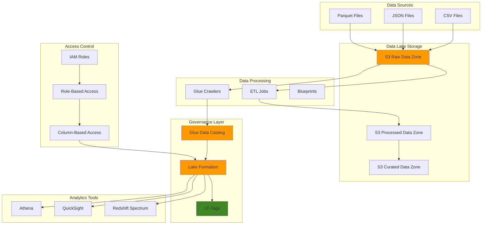

# Data Lake Architectures with Lake Formation


## Problem

Organizations accumulate vast amounts of data across multiple sources and formats, creating data silos that make it difficult to derive insights. Traditional data warehouses struggle with the variety and volume of modern data, while basic S3 data lakes lack governance, security, and fine-grained access controls needed for enterprise compliance. Without proper data cataloging and governance, teams can't discover data assets, enforce data quality standards, or implement column-level and row-level security policies required for regulated industries.

## Solution

This solution builds a secure, governed data lake using Amazon S3 for scalable storage and AWS Lake Formation for centralized governance. Lake Formation provides fine-grained access controls, data cataloging through AWS Glue, and unified permissions management. The architecture enables secure data sharing across teams while maintaining compliance through encryption, audit logging, and tag-based access controls.

## Architecture Diagram



## Prerequisites

1. AWS account with administrative permissions for Lake Formation, S3, Glue, and IAM
2. AWS CLI v2 installed and configured (or AWS CloudShell)
3. Understanding of data lake concepts and AWS analytics services
4. Knowledge of SQL and data governance principles
5. Familiarity with JSON and IAM policies
6. Estimated cost: $20-50 for 3-4 hours of resource usage (S3, Glue crawlers, Athena queries)

> **Note**: Lake Formation permissions override IAM S3 permissions when enabled. Ensure you understand the [Lake Formation permission model](https://docs.aws.amazon.com/lake-formation/latest/dg/lf-permissions-overview.html) before implementing in production.

## Preparation

```bash
# Set environment variables
export AWS_REGION=$(aws configure get region)
export AWS_ACCOUNT_ID=$(aws sts get-caller-identity \
    --query Account --output text)

# Generate unique identifiers for resources
RANDOM_SUFFIX=$(aws secretsmanager get-random-password \
    --exclude-punctuation --exclude-uppercase \
    --password-length 6 --require-each-included-type \
    --output text --query RandomPassword)

export DATALAKE_NAME="datalake-${RANDOM_SUFFIX}"
export RAW_BUCKET="${DATALAKE_NAME}-raw"
export PROCESSED_BUCKET="${DATALAKE_NAME}-processed"
export CURATED_BUCKET="${DATALAKE_NAME}-curated"
export DATABASE_NAME="sales_${RANDOM_SUFFIX}"
export LF_ADMIN_USER="lake-formation-admin"
export DATA_ANALYST_USER="data-analyst"
export DATA_ENGINEER_USER="data-engineer"

# Create foundational S3 buckets for data lake zones
aws s3 mb s3://${RAW_BUCKET}
aws s3 mb s3://${PROCESSED_BUCKET}
aws s3 mb s3://${CURATED_BUCKET}

# Enable versioning and encryption
aws s3api put-bucket-versioning \
    --bucket ${RAW_BUCKET} \
    --versioning-configuration Status=Enabled

aws s3api put-bucket-encryption \
    --bucket ${RAW_BUCKET} \
    --server-side-encryption-configuration '{
        "Rules": [{
            "ApplyServerSideEncryptionByDefault": {
                "SSEAlgorithm": "AES256"
            }
        }]
    }'

# Apply similar settings to other buckets
for bucket in ${PROCESSED_BUCKET} ${CURATED_BUCKET}; do
    aws s3api put-bucket-versioning \
        --bucket $bucket \
        --versioning-configuration Status=Enabled
    aws s3api put-bucket-encryption \
        --bucket $bucket \
        --server-side-encryption-configuration '{
            "Rules": [{
                "ApplyServerSideEncryptionByDefault": {
                    "SSEAlgorithm": "AES256"
                }
            }]
        }'
done

echo "✅ Created encrypted S3 buckets: ${RAW_BUCKET}, ${PROCESSED_BUCKET}, ${CURATED_BUCKET}"
```

## Steps

1. **Create Lake Formation Service Role and Data Lake Administrator**:

   Lake Formation requires dedicated service roles to access and manage data lake resources on your behalf. The service role enables Lake Formation to perform operations like registering S3 locations, managing permissions, and coordinating with other AWS services. Establishing a data lake administrator provides centralized governance control, allowing designated users to configure permissions, create LF-Tags, and manage the overall data lake security posture.

   ```bash
   # Create Lake Formation service role
   aws iam create-role \
       --role-name LakeFormationServiceRole \
       --assume-role-policy-document '{
           "Version": "2012-10-17",
           "Statement": [{
               "Effect": "Allow",
               "Principal": {
                   "Service": "lakeformation.amazonaws.com"
               },
               "Action": "sts:AssumeRole"
           }]
       }'
   
   # Attach the service role policy
   aws iam attach-role-policy \
       --role-name LakeFormationServiceRole \
       --policy-arn arn:aws:iam::aws:policy/service-role/LakeFormationServiceRole
   
   # Create Lake Formation admin user
   aws iam create-user --user-name ${LF_ADMIN_USER}
   
   # Attach Lake Formation admin permissions
   aws iam attach-user-policy \
       --user-name ${LF_ADMIN_USER} \
       --policy-arn arn:aws:iam::aws:policy/LakeFormationDataAdmin
   
   echo "✅ Created Lake Formation service role and admin user"
   ```

   The Lake Formation service role is now established and ready to manage your data lake resources. This foundational security infrastructure enables Lake Formation to interact with S3, Glue, and other AWS services while maintaining proper access boundaries. The designated administrator can now configure data lake settings and begin implementing governance policies.

2. **Configure Lake Formation Data Lake Settings**:

   Lake Formation's data lake settings control the fundamental governance behavior of your data lake. By configuring these settings, you establish the security model that determines how permissions are managed and enforced. This step removes default permissions that typically grant broad access to principals, implementing a zero-trust security model where access must be explicitly granted through Lake Formation's permission system. Learn more about [Lake Formation permissions](https://docs.aws.amazon.com/lake-formation/latest/dg/lf-permissions-overview.html).

   ```bash
   # Create data lake settings configuration
   cat > lf-settings.json << EOF
   {
       "DataLakeAdmins": [{
           "DataLakePrincipalIdentifier": "arn:aws:iam::${AWS_ACCOUNT_ID}:user/${LF_ADMIN_USER}"
       }],
       "CreateDatabaseDefaultPermissions": [],
       "CreateTableDefaultPermissions": [],
       "TrustedResourceOwners": ["${AWS_ACCOUNT_ID}"],
       "AllowExternalDataFiltering": true,
       "ExternalDataFilteringAllowList": [{
           "DataLakePrincipalIdentifier": "${AWS_ACCOUNT_ID}"
       }]
   }
   EOF
   
   # Apply Lake Formation settings
   aws lakeformation put-data-lake-settings \
       --data-lake-settings file://lf-settings.json
   
   echo "✅ Configured Lake Formation data lake settings"
   ```

   Your data lake now operates under strict governance controls with centralized permission management. The zero-trust security model ensures that all data access must be explicitly granted through Lake Formation permissions rather than relying on IAM policies alone. This configuration provides the foundation for implementing fine-grained access controls and compliance requirements.

3. **Register S3 Buckets with Lake Formation**:

   Registering S3 buckets with Lake Formation transfers permission management from IAM to Lake Formation's centralized governance system. This step is crucial for implementing fine-grained access controls, as unregistered S3 buckets continue to rely on IAM policies for access control. Once registered, Lake Formation can enforce column-level, row-level, and tag-based permissions on the data stored in these buckets. This enables enterprise-grade data governance while maintaining the scalability and durability of S3 storage.

   ```bash
   # Register raw data bucket
   aws lakeformation register-resource \
       --resource-arn arn:aws:s3:::${RAW_BUCKET} \
       --use-service-linked-role
   
   # Register processed data bucket
   aws lakeformation register-resource \
       --resource-arn arn:aws:s3:::${PROCESSED_BUCKET} \
       --use-service-linked-role
   
   # Register curated data bucket
   aws lakeformation register-resource \
       --resource-arn arn:aws:s3:::${CURATED_BUCKET} \
       --use-service-linked-role
   
   echo "✅ Registered S3 buckets with Lake Formation"
   ```

   Your S3 buckets are now under Lake Formation's governance control, enabling advanced security features like data cell filters and tag-based access control. The service-linked role ensures that Lake Formation can manage permissions and access patterns for data stored in these buckets. This registration is essential for implementing the fine-grained access controls that will be configured in subsequent steps.

4. **Create LF-Tags for Governance**:

   LF-Tags provide a scalable mechanism for implementing attribute-based access control (ABAC) in your data lake. Unlike traditional role-based access control, LF-Tags allow you to grant permissions based on resource attributes rather than managing permissions for individual resources. This approach dramatically reduces administrative overhead as your data lake grows, enabling you to define access policies that automatically apply to new resources based on their tags. The tags created here establish categories for department ownership, data classification levels, processing zones, and access privileges.

   ```bash
   # Create department tag
   aws lakeformation create-lf-tag \
       --tag-key "Department" \
       --tag-values "Sales" "Marketing" "Finance" "Engineering"
   
   # Create classification tag
   aws lakeformation create-lf-tag \
       --tag-key "Classification" \
       --tag-values "Public" "Internal" "Confidential" "Restricted"
   
   # Create data zone tag
   aws lakeformation create-lf-tag \
       --tag-key "DataZone" \
       --tag-values "Raw" "Processed" "Curated"
   
   # Create access level tag
   aws lakeformation create-lf-tag \
       --tag-key "AccessLevel" \
       --tag-values "ReadOnly" "ReadWrite" "Admin"
   
   echo "✅ Created LF-Tags for data governance"
   ```

   The LF-Tags framework is now established, providing the foundation for scalable, attribute-based access control. These tags will be applied to databases, tables, and columns to automatically enforce access policies based on resource attributes. This governance structure supports compliance requirements while reducing the complexity of managing permissions as your data lake expands across multiple teams and use cases.

5. **Create Sample Data and Upload to S3**:

   Sample data provides the foundation for testing and validating your data lake's governance controls. This step creates realistic business data that demonstrates common data lake scenarios including customer information, sales transactions, and structured data relationships. The data is deliberately designed to include personally identifiable information (PII) and sensitive business data that will be used to test column-level and row-level security features in later steps.

   ```bash
   # Create sample sales data
   cat > sales_data.csv << EOF
   customer_id,product_id,order_date,quantity,price,region,sales_rep
   1001,P001,2024-01-15,2,29.99,North,John Smith
   1002,P002,2024-01-16,1,49.99,South,Jane Doe
   1003,P001,2024-01-17,3,29.99,East,Bob Johnson
   1004,P003,2024-01-18,1,99.99,West,Alice Brown
   1005,P002,2024-01-19,2,49.99,North,John Smith
   1006,P001,2024-01-20,1,29.99,South,Jane Doe
   1007,P003,2024-01-21,2,99.99,East,Bob Johnson
   1008,P002,2024-01-22,1,49.99,West,Alice Brown
   EOF
   
   # Create customer data
   cat > customer_data.csv << EOF
   customer_id,first_name,last_name,email,phone,registration_date
   1001,Michael,Johnson,mjohnson@example.com,555-0101,2023-12-01
   1002,Sarah,Davis,sdavis@example.com,555-0102,2023-12-02
   1003,Robert,Wilson,rwilson@example.com,555-0103,2023-12-03
   1004,Jennifer,Brown,jbrown@example.com,555-0104,2023-12-04
   1005,William,Jones,wjones@example.com,555-0105,2023-12-05
   1006,Lisa,Garcia,lgarcia@example.com,555-0106,2023-12-06
   1007,David,Miller,dmiller@example.com,555-0107,2023-12-07
   1008,Susan,Anderson,sanderson@example.com,555-0108,2023-12-08
   EOF
   
   # Upload data to raw bucket
   aws s3 cp sales_data.csv s3://${RAW_BUCKET}/sales/
   aws s3 cp customer_data.csv s3://${RAW_BUCKET}/customers/
   
   echo "✅ Created and uploaded sample data to raw bucket"
   ```

   Your data lake now contains sample business data organized by functional areas (sales and customers) within the raw data zone. This structured approach to data organization supports the data lake's three-tier architecture and provides realistic test data for implementing and validating governance controls. The data includes various sensitivity levels that will demonstrate Lake Formation's ability to protect sensitive information while enabling analytics.

6. **Create and Configure Glue Database**:

   The AWS Glue Data Catalog serves as the central metadata repository for your data lake, providing a unified view of all datasets and their schemas. Creating a Glue database establishes the logical container for organizing related tables and applying governance policies. By applying LF-Tags to the database, you establish inherited permissions that automatically apply to all tables created within it. This approach ensures consistent governance policies across related datasets and simplifies permission management. Learn more about [Glue Data Catalog](https://docs.aws.amazon.com/glue/latest/dg/catalog-and-crawler.html).

   ```bash
   # Create Glue database
   aws glue create-database \
       --database-input '{
           "Name": "'${DATABASE_NAME}'",
           "Description": "Sales data lake database for analytics"
       }'
   
   # Tag the database with LF-Tags
   aws lakeformation add-lf-tags-to-resource \
       --resource '{
           "Database": {
               "Name": "'${DATABASE_NAME}'"
           }
       }' \
       --lf-tags '[
           {
               "TagKey": "Department",
               "TagValues": ["Sales"]
           },
           {
               "TagKey": "Classification",
               "TagValues": ["Internal"]
           },
           {
               "TagKey": "DataZone",
               "TagValues": ["Raw"]
           }
       ]'
   
   echo "✅ Created Glue database and applied LF-Tags"
   ```

   The Glue database is now established as the central metadata repository for your sales data lake. The applied LF-Tags ensure that all tables created within this database inherit the appropriate governance policies for department ownership, data classification, and access controls. This centralized approach to metadata management enables consistent data discovery and governance across your entire data lake ecosystem.

7. **Create and Run Glue Crawlers**:

   AWS Glue crawlers automate the discovery and cataloging of data stored in your data lake. They analyze data formats, infer schemas, and create table definitions in the Glue Data Catalog, eliminating the need for manual schema management. Crawlers are essential for maintaining an accurate view of your data's structure as it evolves over time. The dedicated IAM role ensures that crawlers have the necessary permissions to access S3 data while maintaining security boundaries. Learn more about [populating the Glue Data Catalog](https://docs.aws.amazon.com/glue/latest/dg/populate-catalog-methods.html).

   ```bash
   # Create IAM role for Glue crawler
   aws iam create-role \
       --role-name GlueCrawlerRole \
       --assume-role-policy-document '{
           "Version": "2012-10-17",
           "Statement": [{
               "Effect": "Allow",
               "Principal": {
                   "Service": "glue.amazonaws.com"
               },
               "Action": "sts:AssumeRole"
           }]
       }'
   
   # Attach policies to Glue crawler role
   aws iam attach-role-policy \
       --role-name GlueCrawlerRole \
       --policy-arn arn:aws:iam::aws:policy/service-role/AWSGlueServiceRole
   
   # Create custom policy for S3 access
   cat > glue-s3-policy.json << EOF
   {
       "Version": "2012-10-17",
       "Statement": [{
           "Effect": "Allow",
           "Action": [
               "s3:GetObject",
               "s3:PutObject",
               "s3:DeleteObject",
               "s3:ListBucket"
           ],
           "Resource": [
               "arn:aws:s3:::${RAW_BUCKET}",
               "arn:aws:s3:::${RAW_BUCKET}/*"
           ]
       }]
   }
   EOF
   
   aws iam create-policy \
       --policy-name GlueS3AccessPolicy \
       --policy-document file://glue-s3-policy.json
   
   aws iam attach-role-policy \
       --role-name GlueCrawlerRole \
       --policy-arn arn:aws:iam::${AWS_ACCOUNT_ID}:policy/GlueS3AccessPolicy
   
   # Create crawler for sales data
   aws glue create-crawler \
       --name "sales-crawler" \
       --role "arn:aws:iam::${AWS_ACCOUNT_ID}:role/GlueCrawlerRole" \
       --database-name "${DATABASE_NAME}" \
       --targets '{
           "S3Targets": [{
               "Path": "s3://'${RAW_BUCKET}'/sales/"
           }]
       }' \
       --table-prefix "sales_"
   
   # Create crawler for customer data
   aws glue create-crawler \
       --name "customer-crawler" \
       --role "arn:aws:iam::${AWS_ACCOUNT_ID}:role/GlueCrawlerRole" \
       --database-name "${DATABASE_NAME}" \
       --targets '{
           "S3Targets": [{
               "Path": "s3://'${RAW_BUCKET}'/customers/"
           }]
       }' \
       --table-prefix "customer_"
   
   # Run crawlers
   aws glue start-crawler --name "sales-crawler"
   aws glue start-crawler --name "customer-crawler"
   
   echo "✅ Created and started Glue crawlers"
   ```

   The Glue crawlers are now analyzing your data and populating the Data Catalog with table definitions and schema information. This automated discovery process creates the metadata foundation needed for Lake Formation's governance controls and enables analytics tools to understand your data structure. The crawlers will run periodically to detect schema changes and new data, maintaining an accurate catalog as your data lake evolves.

8. **Create IAM Users and Roles for Different Access Levels**:

   Role-based access control forms the foundation of your data lake's security model. By creating distinct roles for different user types (analysts, engineers, administrators), you implement the principle of least privilege while enabling appropriate access to data and tools. Data analysts typically need read-only access to curated data for reporting and analytics, while data engineers require broader permissions for data processing and pipeline management. This role separation ensures that users have the minimum permissions necessary to perform their job functions, reducing security risks and supporting compliance requirements. Follow [IAM security best practices](https://docs.aws.amazon.com/IAM/latest/UserGuide/best-practices.html) when implementing these roles.

   ```bash
   # Create data analyst user
   aws iam create-user --user-name ${DATA_ANALYST_USER}
   
   # Create data engineer user  
   aws iam create-user --user-name ${DATA_ENGINEER_USER}
   
   # Create role for data analysts
   aws iam create-role \
       --role-name DataAnalystRole \
       --assume-role-policy-document '{
           "Version": "2012-10-17",
           "Statement": [{
               "Effect": "Allow",
               "Principal": {
                   "AWS": "arn:aws:iam::'${AWS_ACCOUNT_ID}':user/'${DATA_ANALYST_USER}'"
               },
               "Action": "sts:AssumeRole"
           }]
       }'
   
   # Create role for data engineers
   aws iam create-role \
       --role-name DataEngineerRole \
       --assume-role-policy-document '{
           "Version": "2012-10-17",
           "Statement": [{
               "Effect": "Allow",
               "Principal": {
                   "AWS": "arn:aws:iam::'${AWS_ACCOUNT_ID}':user/'${DATA_ENGINEER_USER}'"
               },
               "Action": "sts:AssumeRole"
           }]
       }'
   
   # Attach basic policies
   aws iam attach-role-policy \
       --role-name DataAnalystRole \
       --policy-arn arn:aws:iam::aws:policy/AmazonAthenaFullAccess
   
   aws iam attach-role-policy \
       --role-name DataEngineerRole \
       --policy-arn arn:aws:iam::aws:policy/AWSGlueConsoleFullAccess
   
   echo "✅ Created IAM roles for different access levels"
   ```

   The role-based access control framework is now established with distinct roles for different user types. These roles will be enhanced with Lake Formation permissions in subsequent steps, combining IAM's identity management with Lake Formation's fine-grained data access controls. This layered security approach ensures that users can only access data appropriate to their job functions while maintaining the flexibility to adapt permissions as organizational needs evolve.

   > **Note**: Follow the [principle of least privilege](https://docs.aws.amazon.com/IAM/latest/UserGuide/best-practices.html#grant-least-privilege) when configuring IAM permissions for production environments.

9. **Configure Fine-Grained Access Control with Lake Formation**:

   Lake Formation's fine-grained access control enables table-level and column-level permissions that go beyond traditional IAM capabilities. This step implements the actual security policies that determine what data each role can access. By granting specific permissions like SELECT, DESCRIBE, CREATE_TABLE, and DROP, you create a granular security model that matches real-world business requirements. The permissions align with the principle of least privilege, ensuring data analysts can query data for insights while data engineers can manage the underlying data structures.

   ```bash
   # Wait for crawlers to complete
   echo "⏳ Waiting for crawlers to complete..."
   sleep 60
   
   # Grant database permissions to data analyst (read-only)
   aws lakeformation grant-permissions \
       --principal '{
           "DataLakePrincipalIdentifier": "arn:aws:iam::'${AWS_ACCOUNT_ID}':role/DataAnalystRole"
       }' \
       --resource '{
           "Database": {
               "Name": "'${DATABASE_NAME}'"
           }
       }' \
       --permissions "DESCRIBE"
   
   # Grant table permissions to data analyst (read-only)
   aws lakeformation grant-permissions \
       --principal '{
           "DataLakePrincipalIdentifier": "arn:aws:iam::'${AWS_ACCOUNT_ID}':role/DataAnalystRole"
       }' \
       --resource '{
           "Table": {
               "DatabaseName": "'${DATABASE_NAME}'",
               "Name": "sales_sales_data"
           }
       }' \
       --permissions "SELECT" "DESCRIBE"
   
   # Grant broader permissions to data engineer
   aws lakeformation grant-permissions \
       --principal '{
           "DataLakePrincipalIdentifier": "arn:aws:iam::'${AWS_ACCOUNT_ID}':role/DataEngineerRole"
       }' \
       --resource '{
           "Database": {
               "Name": "'${DATABASE_NAME}'"
           }
       }' \
       --permissions "CREATE_TABLE" "ALTER" "DROP" "DESCRIBE"
   
   echo "✅ Configured fine-grained access control"
   ```

   Fine-grained access control is now active, enabling role-based data access at the table and column level. The configured permissions ensure that data analysts can query business data for reporting and analytics while data engineers have the broader permissions needed for data pipeline management. This granular control provides the foundation for implementing advanced security features like data cell filters and tag-based permissions in subsequent steps.

10. **Create Data Cell Filters for Column-Level Security**:

    Data cell filters provide the highest level of granular access control in Lake Formation, enabling both column-level and row-level security within tables. These filters are essential for compliance with regulations like GDPR, HIPAA, and PCI-DSS that require protection of personally identifiable information (PII). The filters automatically apply at query time, ensuring that sensitive data is masked or filtered based on the requesting user's permissions. This approach maintains data utility for analytics while protecting sensitive information, enabling organizations to meet regulatory requirements without sacrificing business insights.

    ```bash
    # Create data cell filter to restrict access to customer PII
    cat > customer-filter.json << EOF
    {
        "TableData": {
            "DatabaseName": "${DATABASE_NAME}",
            "TableName": "customer_customer_data",
            "Name": "customer_pii_filter",
            "ColumnWildcard": {
                "ExcludedColumnNames": ["email", "phone"]
            },
            "RowFilter": {
                "AllRowsWildcard": {}
            }
        }
    }
    EOF
    
    # Apply the data cell filter
    aws lakeformation create-data-cells-filter \
        --cli-input-json file://customer-filter.json
    
    # Create filter for sales data based on region
    cat > sales-region-filter.json << EOF
    {
        "TableData": {
            "DatabaseName": "${DATABASE_NAME}",
            "TableName": "sales_sales_data",
            "Name": "sales_region_filter",
            "ColumnNames": ["customer_id", "product_id", "order_date", "quantity", "price", "region"],
            "RowFilter": {
                "FilterExpression": "region IN ('North', 'South')"
            }
        }
    }
    EOF
    
    # Apply the sales region filter
    aws lakeformation create-data-cells-filter \
        --cli-input-json file://sales-region-filter.json
    
    echo "✅ Created data cell filters for column and row-level security"
    ```

    Data cell filters are now protecting sensitive information at the query level, automatically applying column and row restrictions based on user permissions. These filters ensure that PII data like email addresses and phone numbers remain protected while still enabling analytics on non-sensitive data. The row-level filters demonstrate geographical access restrictions, supporting compliance requirements for data residency and regional access controls.

11. **Set Up Tag-Based Access Control**:

    Tag-based access control (TBAC) represents the most scalable approach to managing permissions in large data lakes. Instead of granting permissions to individual resources, TBAC allows you to grant permissions based on resource tags, automatically applying access policies to new resources that match tag criteria. This approach dramatically reduces administrative overhead as your data lake grows, while ensuring consistent security policies across all resources. TBAC is particularly valuable for organizations with complex data governance requirements and multiple teams accessing shared datasets.

    ```bash
    # Create tag-based permission for department access
    aws lakeformation grant-permissions \
        --principal '{
            "DataLakePrincipalIdentifier": "arn:aws:iam::'${AWS_ACCOUNT_ID}':role/DataAnalystRole"
        }' \
        --resource '{
            "LFTag": {
                "TagKey": "Department",
                "TagValues": ["Sales"]
            }
        }' \
        --permissions "DESCRIBE"
    
    # Grant permissions based on classification level
    aws lakeformation grant-permissions \
        --principal '{
            "DataLakePrincipalIdentifier": "arn:aws:iam::'${AWS_ACCOUNT_ID}':role/DataAnalystRole"
        }' \
        --resource '{
            "LFTag": {
                "TagKey": "Classification",
                "TagValues": ["Internal"]
            }
        }' \
        --permissions "SELECT" "DESCRIBE"
    
    echo "✅ Configured tag-based access control"
    ```

    Tag-based access control is now active, providing scalable permission management that automatically applies to new resources based on their tags. This approach reduces administrative overhead while ensuring consistent security policies across your data lake. As new datasets are added with appropriate tags, users will automatically receive the correct permissions without manual intervention, supporting the dynamic nature of modern data lake environments.

12. **Enable Audit Logging and CloudTrail Integration**:

    Comprehensive audit logging is essential for regulatory compliance and security monitoring in enterprise data lakes. CloudTrail provides detailed logs of all Lake Formation API calls, including permission grants, data access attempts, and administrative actions. This creates an immutable audit trail that supports compliance requirements for regulations like SOX, GDPR, and HIPAA. The integration with CloudWatch Logs enables real-time monitoring and alerting on suspicious activities, helping organizations detect and respond to security incidents promptly.

    ```bash
    # Create CloudTrail for Lake Formation auditing
    aws cloudtrail create-trail \
        --name lake-formation-audit-trail \
        --s3-bucket-name ${RAW_BUCKET} \
        --s3-key-prefix "audit-logs/" \
        --include-global-service-events \
        --is-multi-region-trail \
        --enable-log-file-validation
    
    # Start logging
    aws cloudtrail start-logging \
        --name lake-formation-audit-trail
    
    # Create CloudWatch log group for Lake Formation
    aws logs create-log-group \
        --log-group-name /aws/lakeformation/audit
    
    echo "✅ Enabled audit logging and CloudTrail integration"
    ```

    Comprehensive audit logging is now active, providing complete visibility into all data lake activities. CloudTrail captures every API call and permission change, creating an immutable audit trail that supports compliance requirements and security monitoring. The CloudWatch Logs integration enables real-time monitoring and alerting, helping organizations maintain security posture and respond quickly to potential incidents.

## Validation & Testing

1. **Verify Lake Formation Settings**:

   ```bash
   # Check Lake Formation settings
   aws lakeformation get-data-lake-settings \
       --catalog-id ${AWS_ACCOUNT_ID}
   ```

   Expected output should show your configured data lake administrators and settings.

2. **Validate S3 Bucket Registration**:

   ```bash
   # List registered resources
   aws lakeformation list-resources \
       --filter-condition-list '[{
           "Field": "RESOURCE_ARN",
           "ComparisonOperator": "CONTAINS",
           "StringValueList": ["'${RAW_BUCKET}'"]
       }]'
   ```

   Expected output should show your S3 buckets are registered with Lake Formation.

3. **Test LF-Tags Configuration**:

   ```bash
   # List all LF-Tags
   aws lakeformation list-lf-tags \
       --catalog-id ${AWS_ACCOUNT_ID}
   ```

   Expected output should show the Department, Classification, DataZone, and AccessLevel tags.

4. **Verify Glue Catalog Tables**:

   ```bash
   # List tables in the database
   aws glue get-tables \
       --database-name ${DATABASE_NAME}
   ```

   Expected output should show the sales_sales_data and customer_customer_data tables.

5. **Test Permissions with Athena Query**:

   ```bash
   # Create Athena query to test permissions
   QUERY_ID=$(aws athena start-query-execution \
       --query-string "SELECT COUNT(*) FROM ${DATABASE_NAME}.sales_sales_data" \
       --result-configuration OutputLocation=s3://${RAW_BUCKET}/athena-results/ \
       --work-group primary \
       --query QueryExecutionId --output text)
   
   # Wait for query to complete
   sleep 10
   
   # Check query results
   aws athena get-query-results \
       --query-execution-id ${QUERY_ID}
   ```

   Expected output should show the count of records in the sales table.

## Cleanup

1. **Delete Data Cell Filters**:

   ```bash
   # Delete customer PII filter
   aws lakeformation delete-data-cells-filter \
       --table-catalog-id ${AWS_ACCOUNT_ID} \
       --database-name ${DATABASE_NAME} \
       --table-name "customer_customer_data" \
       --name "customer_pii_filter"
   
   # Delete sales region filter
   aws lakeformation delete-data-cells-filter \
       --table-catalog-id ${AWS_ACCOUNT_ID} \
       --database-name ${DATABASE_NAME} \
       --table-name "sales_sales_data" \
       --name "sales_region_filter"
   
   echo "✅ Deleted data cell filters"
   ```

2. **Revoke Lake Formation Permissions**:

   ```bash
   # Revoke permissions from data analyst role
   aws lakeformation revoke-permissions \
       --principal '{
           "DataLakePrincipalIdentifier": "arn:aws:iam::'${AWS_ACCOUNT_ID}':role/DataAnalystRole"
       }' \
       --resource '{
           "Database": {
               "Name": "'${DATABASE_NAME}'"
           }
       }' \
       --permissions "DESCRIBE"
   
   # Revoke permissions from data engineer role
   aws lakeformation revoke-permissions \
       --principal '{
           "DataLakePrincipalIdentifier": "arn:aws:iam::'${AWS_ACCOUNT_ID}':role/DataEngineerRole"
       }' \
       --resource '{
           "Database": {
               "Name": "'${DATABASE_NAME}'"
           }
       }' \
       --permissions "CREATE_TABLE" "ALTER" "DROP" "DESCRIBE"
   
   echo "✅ Revoked Lake Formation permissions"
   ```

3. **Delete Glue Resources**:

   ```bash
   # Delete crawlers
   aws glue delete-crawler --name "sales-crawler"
   aws glue delete-crawler --name "customer-crawler"
   
   # Delete database
   aws glue delete-database --name ${DATABASE_NAME}
   
   echo "✅ Deleted Glue resources"
   ```

4. **Deregister S3 Buckets from Lake Formation**:

   ```bash
   # Deregister S3 buckets
   aws lakeformation deregister-resource \
       --resource-arn arn:aws:s3:::${RAW_BUCKET}
   
   aws lakeformation deregister-resource \
       --resource-arn arn:aws:s3:::${PROCESSED_BUCKET}
   
   aws lakeformation deregister-resource \
       --resource-arn arn:aws:s3:::${CURATED_BUCKET}
   
   echo "✅ Deregistered S3 buckets from Lake Formation"
   ```

5. **Delete LF-Tags**:

   ```bash
   # Delete all LF-Tags
   aws lakeformation delete-lf-tag --tag-key "Department"
   aws lakeformation delete-lf-tag --tag-key "Classification"
   aws lakeformation delete-lf-tag --tag-key "DataZone"
   aws lakeformation delete-lf-tag --tag-key "AccessLevel"
   
   echo "✅ Deleted LF-Tags"
   ```

6. **Delete IAM Resources**:

   ```bash
   # Detach and delete policies
   aws iam detach-role-policy \
       --role-name GlueCrawlerRole \
       --policy-arn arn:aws:iam::aws:policy/service-role/AWSGlueServiceRole
   
   aws iam detach-role-policy \
       --role-name GlueCrawlerRole \
       --policy-arn arn:aws:iam::${AWS_ACCOUNT_ID}:policy/GlueS3AccessPolicy
   
   aws iam delete-policy \
       --policy-arn arn:aws:iam::${AWS_ACCOUNT_ID}:policy/GlueS3AccessPolicy
   
   # Delete IAM roles
   aws iam delete-role --role-name LakeFormationServiceRole
   aws iam delete-role --role-name GlueCrawlerRole
   aws iam delete-role --role-name DataAnalystRole
   aws iam delete-role --role-name DataEngineerRole
   
   # Delete IAM users
   aws iam detach-user-policy \
       --user-name ${LF_ADMIN_USER} \
       --policy-arn arn:aws:iam::aws:policy/LakeFormationDataAdmin
   
   aws iam delete-user --user-name ${LF_ADMIN_USER}
   aws iam delete-user --user-name ${DATA_ANALYST_USER}
   aws iam delete-user --user-name ${DATA_ENGINEER_USER}
   
   echo "✅ Deleted IAM resources"
   ```

7. **Delete CloudTrail and CloudWatch Resources**:

   ```bash
   # Stop and delete CloudTrail
   aws cloudtrail stop-logging \
       --name lake-formation-audit-trail
   
   aws cloudtrail delete-trail \
       --name lake-formation-audit-trail
   
   # Delete CloudWatch log group
   aws logs delete-log-group \
       --log-group-name /aws/lakeformation/audit
   
   echo "✅ Deleted CloudTrail and CloudWatch resources"
   ```

8. **Delete S3 Buckets**:

   ```bash
   # Empty and delete S3 buckets
   aws s3 rm s3://${RAW_BUCKET} --recursive
   aws s3 rm s3://${PROCESSED_BUCKET} --recursive
   aws s3 rm s3://${CURATED_BUCKET} --recursive
   
   aws s3 rb s3://${RAW_BUCKET}
   aws s3 rb s3://${PROCESSED_BUCKET}
   aws s3 rb s3://${CURATED_BUCKET}
   
   # Clean up local files
   rm -f sales_data.csv customer_data.csv
   rm -f lf-settings.json glue-s3-policy.json
   rm -f customer-filter.json sales-region-filter.json
   
   echo "✅ Deleted S3 buckets and cleaned up local files"
   ```

## Discussion

This comprehensive data lake architecture demonstrates how AWS Lake Formation transforms basic S3 storage into a governed, secure data lake platform. The solution addresses key enterprise requirements including data discovery, cataloging, fine-grained access control, and regulatory compliance.

**Lake Formation's Permission Model**: Lake Formation uses a hybrid permission model where it can either work alongside IAM permissions or completely override them. When a resource is registered with Lake Formation, it's crucial to understand that LF permissions take precedence over IAM S3 permissions. This centralized approach simplifies governance but requires careful planning during migration from IAM-only setups.

**Data Zone Architecture**: The three-tier storage approach (Raw, Processed, Curated) reflects modern data lake best practices. Raw data maintains source fidelity, processed data is cleaned and standardized, and curated data is business-ready and optimized for analytics. This separation enables different governance policies and access controls for each zone, supporting both data engineering workflows and business analytics requirements.

**Tag-Based Access Control (TBAC)**: LF-Tags provide a scalable alternative to traditional resource-based permissions. Instead of managing permissions on individual databases and tables, you can assign tags to resources and grant permissions based on tag values. This approach scales efficiently as your data lake grows and simplifies permission management across hundreds or thousands of datasets.

> **Tip**: Use LF-Tags consistently across your organization to create a unified data governance framework. Consider implementing a comprehensive [tagging strategy](https://docs.aws.amazon.com/whitepapers/latest/tagging-best-practices/tagging-best-practices.html) that includes data classification, department ownership, and compliance requirements.

The data cell filters demonstrated here provide both column-level and row-level security, enabling compliance with regulations like GDPR, HIPAA, and PCI-DSS. These filters operate at the query level, automatically applying restrictions based on the requesting principal's permissions, ensuring that sensitive data remains protected without impacting query performance significantly.

## Challenge

Extend this data lake architecture by implementing these advanced capabilities:

1. **Implement Cross-Account Data Sharing**: Set up Lake Formation's cross-account sharing to allow secure data access between multiple AWS accounts, including creating data shares and managing permissions across organizational boundaries.

2. **Build Automated Data Quality Pipelines**: Create AWS Glue DataBrew jobs that automatically profile data quality, detect anomalies, and create data quality scorecards for each dataset in your data lake.

3. **Implement Real-Time Data Ingestion**: Add Amazon Kinesis Data Streams and Kinesis Data Firehose to enable real-time data ingestion into your data lake, with automatic cataloging and governance through Lake Formation.

4. **Create ML-Ready Data Pipelines**: Build AWS Glue ETL jobs that prepare data for machine learning workloads, including feature engineering, data normalization, and automatic feature store population using Amazon SageMaker Feature Store.

5. **Implement Data Lineage and Impact Analysis**: Deploy AWS Glue DataBrew and AWS Glue Studio to create comprehensive data lineage tracking, enabling impact analysis when schema changes occur and supporting regulatory compliance reporting.

## Infrastructure Code

*Infrastructure code will be generated after recipe approval.*