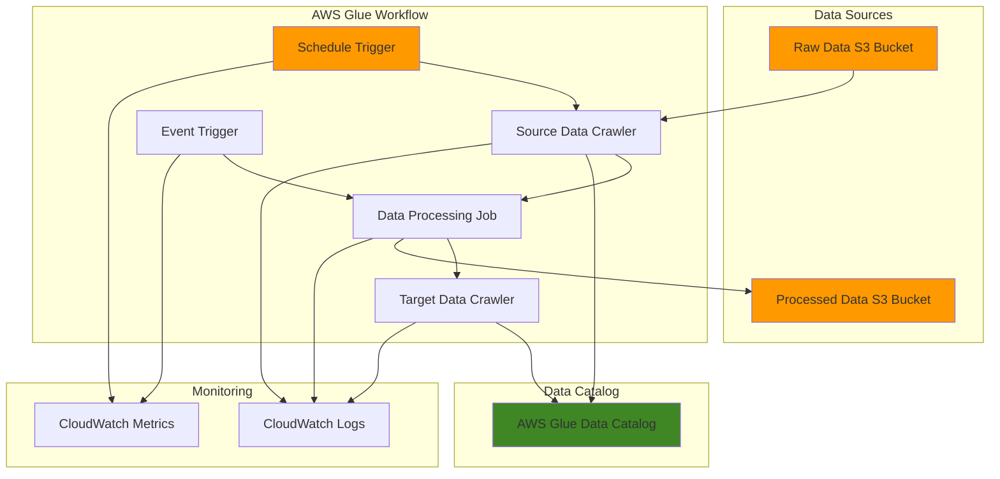

# Data Pipeline Orchestration with Glue Workflows

## Problem

Organizations struggle with managing complex data pipelines that involve multiple interdependent ETL jobs, data crawlers, and transformation processes. Manual coordination of these components leads to operational overhead, increased failure rates, and difficulty tracking pipeline execution states across distributed data processing workflows.

## Solution

AWS Glue Workflows provide a serverless orchestration framework that coordinates multiple jobs, crawlers, and triggers into cohesive data pipelines. By leveraging workflow triggers and visual dependency management, organizations can automate complex ETL operations while maintaining visibility into pipeline execution states and implementing robust error handling mechanisms.

## Architecture Diagram



## Prerequisites

1. AWS account with appropriate permissions for Glue, S3, IAM, and CloudWatch
2. AWS CLI v2 installed and configured (or AWS CloudShell)
3. Basic understanding of ETL concepts and data pipeline architecture
4. Familiarity with AWS Glue jobs and crawlers (recommended)
5. Estimated cost: $10-15 for running crawlers, jobs, and storage during testing

> **Note**: This recipe focuses on workflow orchestration concepts. For comprehensive AWS Glue fundamentals, review the [AWS Glue Developer Guide](https://docs.aws.amazon.com/glue/latest/dg/what-is-glue.html).

## Preparation

```bash
# Set environment variables
export AWS_REGION=$(aws configure get region)
export AWS_ACCOUNT_ID=$(aws sts get-caller-identity \
    --query Account --output text)

# Generate unique identifiers for resources
RANDOM_SUFFIX=$(aws secretsmanager get-random-password \
    --exclude-punctuation --exclude-uppercase \
    --password-length 6 --require-each-included-type \
    --output text --query RandomPassword)

export WORKFLOW_NAME="data-pipeline-workflow-${RANDOM_SUFFIX}"
export S3_BUCKET_RAW="raw-data-${RANDOM_SUFFIX}"
export S3_BUCKET_PROCESSED="processed-data-${RANDOM_SUFFIX}"
export GLUE_ROLE_NAME="GlueWorkflowRole-${RANDOM_SUFFIX}"

# Create S3 buckets for data storage
aws s3 mb s3://${S3_BUCKET_RAW} --region ${AWS_REGION}
aws s3 mb s3://${S3_BUCKET_PROCESSED} --region ${AWS_REGION}

# Create sample data for testing
cat > sample-data.csv << 'EOF'
customer_id,name,email,purchase_amount,purchase_date
1,John Doe,john@example.com,150.00,2024-01-15
2,Jane Smith,jane@example.com,200.00,2024-01-16
3,Bob Johnson,bob@example.com,75.00,2024-01-17
4,Alice Brown,alice@example.com,300.00,2024-01-18
5,Charlie Wilson,charlie@example.com,125.00,2024-01-19
EOF

# Upload sample data to S3
aws s3 cp sample-data.csv s3://${S3_BUCKET_RAW}/input/
rm sample-data.csv

echo "✅ Environment prepared successfully"
```

## Steps

1. **Create IAM Role for Glue Workflow Operations**:

   AWS Glue Workflows require IAM roles with specific permissions to access S3, execute jobs, and manage crawlers. This role enables the serverless execution model where AWS Glue assumes the role to perform operations on your behalf, ensuring secure and controlled access to your data resources following the principle of least privilege.

   ```bash
   # Create trust policy for Glue service
   cat > glue-trust-policy.json << 'EOF'
   {
       "Version": "2012-10-17",
       "Statement": [
           {
               "Effect": "Allow",
               "Principal": {
                   "Service": "glue.amazonaws.com"
               },
               "Action": "sts:AssumeRole"
           }
       ]
   }
   EOF

   # Create the IAM role
   aws iam create-role \
       --role-name ${GLUE_ROLE_NAME} \
       --assume-role-policy-document file://glue-trust-policy.json
   
   # Attach the AWS managed policy for Glue service
   aws iam attach-role-policy \
       --role-name ${GLUE_ROLE_NAME} \
       --policy-arn arn:aws:iam::aws:policy/service-role/AWSGlueServiceRole
   
   # Create and attach custom policy for S3 access
   cat > s3-access-policy.json << EOF
   {
       "Version": "2012-10-17",
       "Statement": [
           {
               "Effect": "Allow",
               "Action": [
                   "s3:GetObject",
                   "s3:PutObject",
                   "s3:DeleteObject",
                   "s3:ListBucket"
               ],
               "Resource": [
                   "arn:aws:s3:::${S3_BUCKET_RAW}",
                   "arn:aws:s3:::${S3_BUCKET_RAW}/*",
                   "arn:aws:s3:::${S3_BUCKET_PROCESSED}",
                   "arn:aws:s3:::${S3_BUCKET_PROCESSED}/*"
               ]
           }
       ]
   }
   EOF

   aws iam put-role-policy \
       --role-name ${GLUE_ROLE_NAME} \
       --policy-name S3AccessPolicy \
       --policy-document file://s3-access-policy.json
   
   # Wait for role propagation
   sleep 30
   
   # Store the role ARN for later use
   export GLUE_ROLE_ARN=$(aws iam get-role \
       --role-name ${GLUE_ROLE_NAME} \
       --query Role.Arn --output text)
   
   echo "✅ IAM role created: ${GLUE_ROLE_ARN}"
   ```

   The IAM role is now configured with appropriate permissions for Glue operations. This security foundation enables workflows to access S3 data sources and execute ETL operations while maintaining AWS security best practices.

2. **Create Data Catalog Database**:

   AWS Glue Data Catalog serves as the central metadata repository for your data assets. Creating a dedicated database organizes table definitions and schema information, enabling crawlers and jobs to discover and reference data structures consistently across your workflow.

   ```bash
   # Create Glue database for catalog metadata
   aws glue create-database \
       --database-input Name=workflow_database_${RANDOM_SUFFIX},Description="Database for workflow data catalog"
   
   export DATABASE_NAME="workflow_database_${RANDOM_SUFFIX}"
   
   echo "✅ Glue database created: ${DATABASE_NAME}"
   ```

   The database is established as the metadata container for your workflow. This enables automatic schema discovery and provides a centralized location for managing table definitions across your data pipeline.

3. **Create Source Data Crawler**:

   Crawlers automatically discover schema and create table definitions in the Data Catalog. This crawler will scan the raw data S3 bucket and infer the schema structure, making the data accessible to subsequent ETL jobs without manual schema definition.

   ```bash
   # Create crawler for source data discovery
   aws glue create-crawler \
       --name source-crawler-${RANDOM_SUFFIX} \
       --role ${GLUE_ROLE_ARN} \
       --database-name ${DATABASE_NAME} \
       --targets S3Targets=[{Path=s3://${S3_BUCKET_RAW}/input/}] \
       --description "Crawler to discover source data schema"
   
   export SOURCE_CRAWLER_NAME="source-crawler-${RANDOM_SUFFIX}"
   
   echo "✅ Source crawler created: ${SOURCE_CRAWLER_NAME}"
   ```

   The crawler is configured to scan your raw data location and automatically populate the Data Catalog with discovered schemas. This automation eliminates manual schema management and ensures your catalog stays synchronized with data structure changes.

4. **Create ETL Job for Data Processing**:

   Glue jobs execute the actual data transformation logic within workflows. This job will read from the cataloged source data, perform basic transformations, and write results to the processed data bucket, demonstrating the core ETL functionality within a workflow context.

   ```bash
   # Create ETL job script
   cat > etl-script.py << 'EOF'
   import sys
   from awsglue.transforms import *
   from awsglue.utils import getResolvedOptions
   from pyspark.context import SparkContext
   from awsglue.context import GlueContext
   from awsglue.job import Job
   
   args = getResolvedOptions(sys.argv, ['JOB_NAME', 'DATABASE_NAME', 'OUTPUT_BUCKET'])
   
   sc = SparkContext()
   glueContext = GlueContext(sc)
   spark = glueContext.spark_session
   job = Job(glueContext)
   job.init(args['JOB_NAME'], args)
   
   # Read data from the catalog
   datasource0 = glueContext.create_dynamic_frame.from_catalog(
       database=args['DATABASE_NAME'],
       table_name="input"
   )
   
   # Apply transformations
   mapped_data = ApplyMapping.apply(
       frame=datasource0,
       mappings=[
           ("customer_id", "string", "customer_id", "int"),
           ("name", "string", "customer_name", "string"),
           ("email", "string", "email", "string"),
           ("purchase_amount", "string", "purchase_amount", "double"),
           ("purchase_date", "string", "purchase_date", "string")
       ]
   )
   
   # Write to S3
   glueContext.write_dynamic_frame.from_options(
       frame=mapped_data,
       connection_type="s3",
       connection_options={"path": f"s3://{args['OUTPUT_BUCKET']}/output/"},
       format="parquet"
   )
   
   job.commit()
   EOF
   
   # Upload script to S3
   aws s3 cp etl-script.py s3://${S3_BUCKET_PROCESSED}/scripts/
   
   # Create Glue job
   aws glue create-job \
       --name data-processing-job-${RANDOM_SUFFIX} \
       --role ${GLUE_ROLE_ARN} \
       --command Name=glueetl,ScriptLocation=s3://${S3_BUCKET_PROCESSED}/scripts/etl-script.py,PythonVersion=3 \
       --default-arguments '{"--DATABASE_NAME":"'${DATABASE_NAME}'","--OUTPUT_BUCKET":"'${S3_BUCKET_PROCESSED}'"}' \
       --glue-version 4.0 \
       --max-retries 1 \
       --timeout 60 \
       --description "ETL job for data processing in workflow"
   
   export ETL_JOB_NAME="data-processing-job-${RANDOM_SUFFIX}"
   
   echo "✅ ETL job created: ${ETL_JOB_NAME}"
   ```

   The ETL job is configured with transformation logic and integrated with the Data Catalog. This serverless execution model allows the job to scale automatically and provides built-in monitoring capabilities through CloudWatch integration.

5. **Create Target Data Crawler**:

   This crawler discovers the schema of processed data, updating the Data Catalog with the transformed data structure. Running after ETL jobs ensures the catalog reflects the current state of processed data, enabling downstream analytics and reporting tools to access the updated schema.

   ```bash
   # Create crawler for processed data
   aws glue create-crawler \
       --name target-crawler-${RANDOM_SUFFIX} \
       --role ${GLUE_ROLE_ARN} \
       --database-name ${DATABASE_NAME} \
       --targets S3Targets=[{Path=s3://${S3_BUCKET_PROCESSED}/output/}] \
       --description "Crawler to discover processed data schema"
   
   export TARGET_CRAWLER_NAME="target-crawler-${RANDOM_SUFFIX}"
   
   echo "✅ Target crawler created: ${TARGET_CRAWLER_NAME}"
   ```

   The target crawler maintains catalog synchronization with your processed data. This ensures that any schema changes introduced by ETL transformations are properly reflected in the metadata, supporting data governance and downstream system integration.

6. **Create AWS Glue Workflow**:

   Glue Workflows orchestrate the execution of jobs, crawlers, and triggers as a cohesive unit. Creating the workflow establishes the container for managing state, dependencies, and execution coordination across your data pipeline components.

   ```bash
   # Create the workflow
   aws glue create-workflow \
       --name ${WORKFLOW_NAME} \
       --description "Data pipeline workflow orchestrating crawlers and ETL jobs" \
       --max-concurrent-runs 1 \
       --default-run-properties '{"environment":"production","pipeline_version":"1.0"}'
   
   echo "✅ Workflow created: ${WORKFLOW_NAME}"
   ```

   The workflow provides centralized orchestration and state management for your data pipeline. The default run properties enable sharing configuration across workflow components, while concurrency limits ensure controlled resource utilization.

7. **Create Schedule Trigger for Workflow Start**:

   Schedule triggers automate workflow execution based on time-based conditions. This trigger initiates the workflow on a daily schedule, providing predictable processing windows and ensuring consistent data pipeline execution without manual intervention.

   ```bash
   # Create schedule trigger to start the workflow
   aws glue create-trigger \
       --name schedule-trigger-${RANDOM_SUFFIX} \
       --workflow-name ${WORKFLOW_NAME} \
       --type SCHEDULED \
       --schedule "cron(0 2 * * ? *)" \
       --description "Daily trigger at 2 AM UTC" \
       --start-on-creation \
       --actions Type=CRAWLER,CrawlerName=${SOURCE_CRAWLER_NAME}
   
   export SCHEDULE_TRIGGER_NAME="schedule-trigger-${RANDOM_SUFFIX}"
   
   echo "✅ Schedule trigger created: ${SCHEDULE_TRIGGER_NAME}"
   ```

   The schedule trigger establishes automated workflow execution at 2 AM UTC daily. This timing ensures data processing occurs during low-activity periods while providing predictable completion times for downstream systems.

8. **Create Event Trigger for Job Dependency**:

   Event triggers create dependencies between workflow components based on completion states. This trigger starts the ETL job only after the source crawler completes successfully, ensuring proper sequencing and data availability for processing operations.

   ```bash
   # Create event trigger for job dependency
   aws glue create-trigger \
       --name crawler-success-trigger-${RANDOM_SUFFIX} \
       --workflow-name ${WORKFLOW_NAME} \
       --type CONDITIONAL \
       --predicate Logical=AND,Conditions=[{LogicalOperator=EQUALS,CrawlerName=${SOURCE_CRAWLER_NAME},CrawlState=SUCCEEDED}] \
       --description "Trigger ETL job after successful crawler completion" \
       --start-on-creation \
       --actions Type=JOB,JobName=${ETL_JOB_NAME}
   
   export CRAWLER_SUCCESS_TRIGGER_NAME="crawler-success-trigger-${RANDOM_SUFFIX}"
   
   echo "✅ Event trigger created: ${CRAWLER_SUCCESS_TRIGGER_NAME}"
   ```

   The event trigger implements conditional logic that coordinates component execution based on success states. This dependency management ensures data consistency and prevents downstream processing from executing with incomplete or failed input data.

9. **Create Final Event Trigger for Target Crawler**:

   This trigger completes the workflow by starting the target crawler after ETL job completion. This ensures the Data Catalog reflects the processed data schema, maintaining metadata consistency and enabling immediate access to transformed data for analytics workloads.

   ```bash
   # Create final event trigger for target crawler
   aws glue create-trigger \
       --name job-success-trigger-${RANDOM_SUFFIX} \
       --workflow-name ${WORKFLOW_NAME} \
       --type CONDITIONAL \
       --predicate Logical=AND,Conditions=[{LogicalOperator=EQUALS,JobName=${ETL_JOB_NAME},State=SUCCEEDED}] \
       --description "Trigger target crawler after successful job completion" \
       --start-on-creation \
       --actions Type=CRAWLER,CrawlerName=${TARGET_CRAWLER_NAME}
   
   export JOB_SUCCESS_TRIGGER_NAME="job-success-trigger-${RANDOM_SUFFIX}"
   
   echo "✅ Final event trigger created: ${JOB_SUCCESS_TRIGGER_NAME}"
   ```

   The final trigger ensures complete workflow execution by updating the Data Catalog with processed data schemas. This maintains end-to-end data lineage and enables immediate downstream access to transformed datasets.

10. **Start Workflow Execution**:

    Manual workflow execution enables testing and validation of the complete pipeline. Starting the workflow triggers the entire sequence of operations, allowing you to observe the orchestration behavior and validate that all components execute in the proper sequence.

    ```bash
    # Start workflow execution for testing
    aws glue start-workflow-run \
        --name ${WORKFLOW_NAME}
    
    # Wait for the workflow run to be created
    sleep 5
    
    # Get workflow run ID for monitoring
    export WORKFLOW_RUN_ID=$(aws glue get-workflow-runs \
        --name ${WORKFLOW_NAME} \
        --max-results 1 \
        --query 'Runs[0].WorkflowRunId' --output text)
    
    echo "✅ Workflow started with run ID: ${WORKFLOW_RUN_ID}"
    ```

    The workflow execution provides immediate feedback on orchestration behavior and component interactions. This testing capability enables validation of dependency logic and troubleshooting of any configuration issues before production deployment.

> **Warning**: Workflow execution can take 10-15 minutes to complete all components. Monitor progress using the AWS Glue console or CloudWatch logs to track individual component execution states.

## Validation & Testing

1. **Monitor Workflow Execution Status**:

   ```bash
   # Check workflow run status
   aws glue get-workflow-run \
       --name ${WORKFLOW_NAME} \
       --run-id ${WORKFLOW_RUN_ID} \
       --query 'Run.{Status:Status,StartedOn:StartedOn,CompletedOn:CompletedOn}'
   
   # List all workflow runs
   aws glue get-workflow-runs \
       --name ${WORKFLOW_NAME} \
       --query 'Runs[*].{RunId:WorkflowRunId,Status:Status,StartedOn:StartedOn}'
   ```

   Expected output: Status should show `RUNNING` during execution and `COMPLETED` when finished.

2. **Verify Data Catalog Updates**:

   ```bash
   # Check tables created by crawlers
   aws glue get-tables \
       --database-name ${DATABASE_NAME} \
       --query 'TableList[*].{Name:Name,Location:StorageDescriptor.Location}'
   
   # Verify schema discovery
   aws glue get-table \
       --database-name ${DATABASE_NAME} \
       --name input \
       --query 'Table.StorageDescriptor.Columns[*].{Name:Name,Type:Type}'
   ```

   Expected output: Should show `input` and `output` tables with correct column schemas.

3. **Validate Processed Data**:

   ```bash
   # Check processed data in S3
   aws s3 ls s3://${S3_BUCKET_PROCESSED}/output/ --recursive
   
   # Download and inspect sample processed data
   mkdir -p processed-data
   aws s3 cp s3://${S3_BUCKET_PROCESSED}/output/ \
       ./processed-data/ --recursive --exclude "*" --include "*.parquet"
   ```

   Expected output: Parquet files should be present in the output directory.

4. **Review Workflow Execution Graph**:

   ```bash
   # Get workflow graph information
   aws glue get-workflow \
       --name ${WORKFLOW_NAME} \
       --query 'Workflow.Graph.{Nodes:Nodes,Edges:Edges}'
   ```

   Expected output: Should show the complete workflow graph with all components and their connections.

> **Tip**: Use the AWS Glue console to visualize workflow execution in real-time. The graphical interface provides detailed status information and execution timelines for each component.

## Cleanup

1. **Stop and Delete Workflow**:

   ```bash
   # Stop any running workflow
   aws glue stop-workflow-run \
       --name ${WORKFLOW_NAME} \
       --run-id ${WORKFLOW_RUN_ID} 2>/dev/null || true
   
   # Delete workflow triggers
   aws glue delete-trigger --name ${SCHEDULE_TRIGGER_NAME}
   aws glue delete-trigger --name ${CRAWLER_SUCCESS_TRIGGER_NAME}
   aws glue delete-trigger --name ${JOB_SUCCESS_TRIGGER_NAME}
   
   # Delete workflow
   aws glue delete-workflow --name ${WORKFLOW_NAME}
   
   echo "✅ Workflow and triggers deleted"
   ```

2. **Remove Glue Jobs and Crawlers**:

   ```bash
   # Delete Glue job
   aws glue delete-job --job-name ${ETL_JOB_NAME}
   
   # Delete crawlers
   aws glue delete-crawler --name ${SOURCE_CRAWLER_NAME}
   aws glue delete-crawler --name ${TARGET_CRAWLER_NAME}
   
   echo "✅ Jobs and crawlers deleted"
   ```

3. **Clean Up Data Catalog**:

   ```bash
   # Delete tables from catalog
   aws glue delete-table --database-name ${DATABASE_NAME} --name input 2>/dev/null || true
   aws glue delete-table --database-name ${DATABASE_NAME} --name output 2>/dev/null || true
   
   # Delete database
   aws glue delete-database --name ${DATABASE_NAME}
   
   echo "✅ Data catalog cleaned"
   ```

4. **Remove IAM Role and S3 Resources**:

   ```bash
   # Delete IAM role policies and role
   aws iam delete-role-policy --role-name ${GLUE_ROLE_NAME} --policy-name S3AccessPolicy
   aws iam detach-role-policy --role-name ${GLUE_ROLE_NAME} --policy-arn arn:aws:iam::aws:policy/service-role/AWSGlueServiceRole
   aws iam delete-role --role-name ${GLUE_ROLE_NAME}
   
   # Delete S3 buckets and contents
   aws s3 rb s3://${S3_BUCKET_RAW} --force
   aws s3 rb s3://${S3_BUCKET_PROCESSED} --force
   
   # Clean up local files
   rm -f glue-trust-policy.json s3-access-policy.json etl-script.py
   rm -rf processed-data/
   
   echo "✅ All resources cleaned up"
   ```

## Discussion

AWS Glue Workflows provide a powerful orchestration framework that transforms complex ETL operations into manageable, automated data pipelines. The workflow model addresses the fundamental challenge of coordinating multiple interdependent data processing components while maintaining visibility into execution states and providing robust error handling capabilities. This serverless approach follows AWS Well-Architected Framework principles by eliminating infrastructure management overhead while delivering automatic scaling and cost optimization.

The architecture demonstrated in this recipe showcases the three core workflow components working in harmony. Crawlers automatically discover and catalog data schemas, eliminating manual metadata management while ensuring catalog consistency. ETL jobs execute transformation logic using serverless Spark clusters, providing automatic scaling and cost optimization. Triggers create sophisticated dependency chains that coordinate execution based on success states, schedules, or external events, enabling complex orchestration patterns without custom coordination logic.

From an operational perspective, workflows excel at providing centralized monitoring and state management across distributed data processing activities. The visual workflow representation in the AWS Glue console enables teams to understand pipeline dependencies quickly, while CloudWatch integration provides detailed execution logs and performance metrics. This combination of visual orchestration and comprehensive monitoring significantly reduces operational complexity compared to managing individual components separately.

The serverless nature of Glue Workflows delivers substantial cost and operational benefits for organizations building modern data platforms. Unlike traditional ETL tools that require dedicated infrastructure, workflows automatically scale processing resources based on data volume and complexity. This pay-per-use model eliminates capacity planning concerns while providing the flexibility to handle variable workloads efficiently. Additionally, the integration with AWS services like S3, Data Catalog, and CloudWatch creates a cohesive ecosystem that reduces integration complexity and accelerates time-to-value for data initiatives.

> **Note**: For production deployments, consider implementing additional monitoring with CloudWatch alarms and SNS notifications to track workflow execution states. The [AWS Glue monitoring documentation](https://docs.aws.amazon.com/glue/latest/dg/monitor-glue.html) provides comprehensive guidance on operational best practices.

## Challenge

Extend this solution by implementing these enhancements:

1. **Add EventBridge Integration**: Configure workflows to start based on S3 object creation events using EventBridge triggers, enabling real-time data processing capabilities for streaming data scenarios.

2. **Implement Data Quality Checks**: Create additional Glue jobs within the workflow that validate data quality metrics and implement conditional logic to handle quality failures with retry mechanisms.

3. **Build Multi-Environment Workflow**: Extend the workflow to support development, staging, and production environments with parameter-driven configuration management using AWS Systems Manager Parameter Store.

4. **Add Advanced Error Handling**: Implement retry logic, dead letter queues, and SNS notifications for workflow failures using AWS Step Functions integration for complex error handling patterns.

5. **Create Workflow Templates**: Develop CloudFormation or CDK templates that parameterize the workflow creation process for repeatable deployments across multiple data pipelines and teams.

## Infrastructure Code

### Available Infrastructure as Code:

- [Infrastructure Code Overview](code/README.md) - Detailed description of all infrastructure components
- [AWS CDK (Python)](code/cdk-python/) - AWS CDK Python implementation
- [AWS CDK (TypeScript)](code/cdk-typescript/) - AWS CDK TypeScript implementation
- [CloudFormation](code/cloudformation.yaml) - AWS CloudFormation template
- [Bash CLI Scripts](code/scripts/) - Example bash scripts using AWS CLI commands to deploy infrastructure
- [Terraform](code/terraform/) - Terraform configuration files