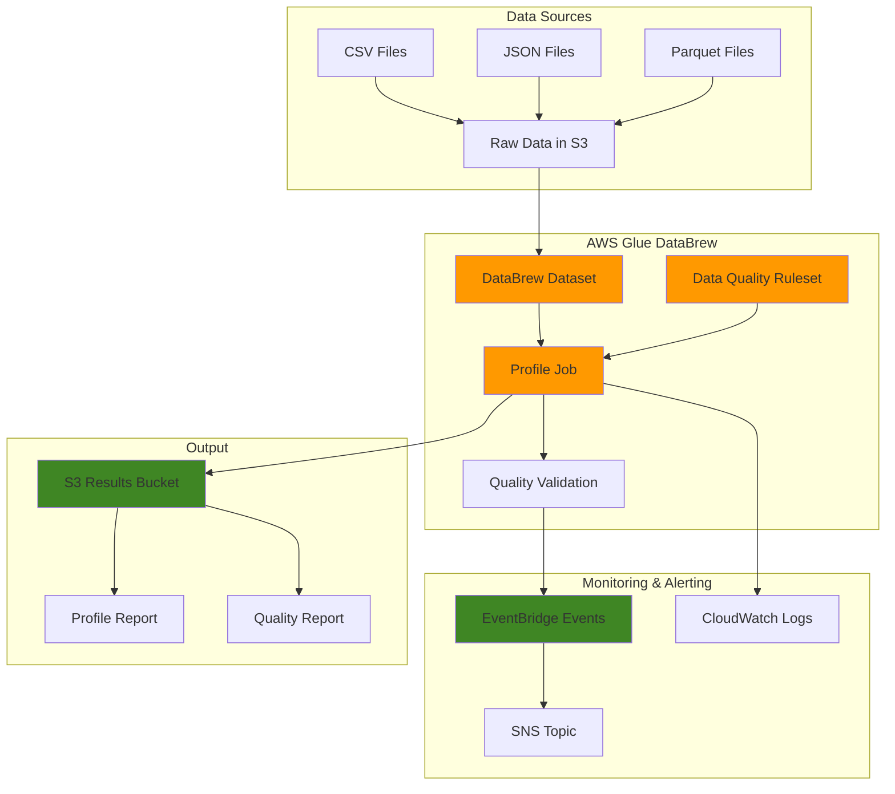

# Data Quality Monitoring with DataBrew

## Problem

Organizations struggle with inconsistent data quality across their analytics pipelines, leading to unreliable insights and downstream system failures. Manual data validation processes are time-consuming, error-prone, and don't scale with growing data volumes. Without automated data quality monitoring, businesses risk making critical decisions based on incomplete or corrupted data.

## Solution

AWS Glue DataBrew provides a visual, serverless data preparation service that enables automated data quality monitoring through profile jobs and validation rules. This solution establishes continuous monitoring of data quality metrics, automated alerting for quality issues, and comprehensive reporting that helps teams maintain data integrity across their analytics workflows.

## Architecture Diagram



## Prerequisites

1. AWS account with appropriate permissions for Glue DataBrew, S3, CloudWatch, and EventBridge
2. AWS CLI v2 installed and configured (or AWS CloudShell)
3. Basic understanding of data quality concepts and AWS services
4. Sample dataset in S3 (CSV, JSON, or Parquet format)
5. Estimated cost: $10-20 for profile jobs and storage during this tutorial

> **Note**: Profile jobs consume compute resources based on data volume. Large datasets may require significant processing time and costs.

## Preparation

```bash
# Set environment variables
export AWS_REGION=$(aws configure get region)
export AWS_ACCOUNT_ID=$(aws sts get-caller-identity \
    --query Account --output text)

# Generate unique identifiers for resources
RANDOM_SUFFIX=$(aws secretsmanager get-random-password \
    --exclude-punctuation --exclude-uppercase \
    --password-length 6 --require-each-included-type \
    --output text --query RandomPassword)

export DATABREW_ROLE_NAME="DataBrewServiceRole-${RANDOM_SUFFIX}"
export DATASET_NAME="customer-data-${RANDOM_SUFFIX}"
export PROFILE_JOB_NAME="customer-profile-job-${RANDOM_SUFFIX}"
export RULESET_NAME="customer-quality-rules-${RANDOM_SUFFIX}"
export S3_BUCKET_NAME="databrew-results-${RANDOM_SUFFIX}"
export SNS_TOPIC_NAME="data-quality-alerts-${RANDOM_SUFFIX}"

# Create S3 bucket for results
aws s3 mb s3://${S3_BUCKET_NAME} --region ${AWS_REGION}

# Create sample customer data file with quality issues
cat > customer_data.csv << 'EOF'
customer_id,name,email,age,registration_date,account_balance
1,John Smith,john.smith@example.com,25,2023-01-15,1500.00
2,Jane Doe,jane.doe@example.com,32,2023-02-20,2300.50
3,Bob Johnson,,28,2023-03-10,750.25
4,Alice Brown,alice.brown@example.com,45,2023-04-05,3200.75
5,Charlie Wilson,charlie.wilson@example.com,-5,2023-05-12,1800.00
6,Diana Lee,diana.lee@example.com,67,invalid-date,2500.00
7,Frank Miller,frank.miller@example.com,33,2023-07-18,
8,Grace Taylor,grace.taylor@example.com,29,2023-08-25,1200.50
9,Henry Davis,henry.davis@example.com,41,2023-09-30,1750.25
10,Ivy Chen,ivy.chen@example.com,38,2023-10-15,2100.00
EOF

# Upload sample data to S3
aws s3 cp customer_data.csv s3://${S3_BUCKET_NAME}/raw-data/

echo "✅ Environment prepared successfully"
```

## Steps

1. **Create IAM Role for DataBrew**:

   AWS Glue DataBrew requires specific IAM permissions to access S3 data and write results. The service role enables DataBrew to read source data, write profile results, and publish CloudWatch events following the principle of least privilege security model.

   ```bash
   # Create trust policy for DataBrew service
   cat > databrew-trust-policy.json << 'EOF'
   {
       "Version": "2012-10-17",
       "Statement": [
           {
               "Effect": "Allow",
               "Principal": {
                   "Service": "databrew.amazonaws.com"
               },
               "Action": "sts:AssumeRole"
           }
       ]
   }
   EOF
   
   # Create the IAM role  
   aws iam create-role \
       --role-name ${DATABREW_ROLE_NAME} \
       --assume-role-policy-document file://databrew-trust-policy.json
   
   # Attach the AWS managed policy for DataBrew
   aws iam attach-role-policy \
       --role-name ${DATABREW_ROLE_NAME} \
       --policy-arn arn:aws:iam::aws:policy/service-role/AWSGlueDataBrewServiceRole
   
   # Create and attach custom policy for S3 access
   cat > databrew-s3-policy.json << EOF
   {
       "Version": "2012-10-17",
       "Statement": [
           {
               "Effect": "Allow",
               "Action": [
                   "s3:GetObject",
                   "s3:PutObject",
                   "s3:DeleteObject"
               ],
               "Resource": "arn:aws:s3:::${S3_BUCKET_NAME}/*"
           },
           {
               "Effect": "Allow",
               "Action": "s3:ListBucket",
               "Resource": "arn:aws:s3:::${S3_BUCKET_NAME}"
           }
       ]
   }
   EOF
   
   aws iam put-role-policy \
       --role-name ${DATABREW_ROLE_NAME} \
       --policy-name S3Access \
       --policy-document file://databrew-s3-policy.json
   
   export DATABREW_ROLE_ARN="arn:aws:iam::${AWS_ACCOUNT_ID}:role/${DATABREW_ROLE_NAME}"
   
   echo "✅ IAM role created: ${DATABREW_ROLE_ARN}"
   ```

   The IAM role is now configured with necessary permissions following AWS security best practices. This foundation ensures DataBrew can operate while maintaining proper access controls for your data.

2. **Create DataBrew Dataset**:

   A DataBrew dataset represents the connection to your data source and defines the schema for data profiling. This logical representation enables DataBrew to understand your data structure and perform comprehensive analysis across different file formats.

   ```bash
   # Create DataBrew dataset pointing to our sample data
   aws databrew create-dataset \
       --name ${DATASET_NAME} \
       --format CSV \
       --format-options '{"Csv": {"Delimiter": ","}}' \
       --input '{
           "S3InputDefinition": {
               "Bucket": "'${S3_BUCKET_NAME}'",
               "Key": "raw-data/"
           }
       }'
   
   echo "✅ Dataset created: ${DATASET_NAME}"
   ```

   The dataset now serves as the entry point for data profiling operations. DataBrew automatically detects schema changes and data patterns, providing the foundation for comprehensive quality monitoring.

3. **Create Data Quality Ruleset**:

   Data quality rules define objective criteria that your data must meet to be considered valid. These rules enable automated validation of completeness, format, range, and business logic requirements that protect downstream analytics workflows.

   ```bash
   # Create comprehensive data quality ruleset
   aws databrew create-ruleset \
       --name ${RULESET_NAME} \
       --target-arn "arn:aws:databrew:${AWS_REGION}:${AWS_ACCOUNT_ID}:dataset/${DATASET_NAME}" \
       --rules '[
           {
               "Name": "customer_id_not_null",
               "CheckExpression": "COLUMN_COMPLETENESS(customer_id) > 0.95",
               "SubstitutionMap": {},
               "Disabled": false
           },
           {
               "Name": "email_format_valid",
               "CheckExpression": "COLUMN_DATA_TYPE(email) = STRING AND COLUMN_MATCHES_REGEX(email, \"^[a-zA-Z0-9._%+-]+@[a-zA-Z0-9.-]+\\.[a-zA-Z]{2,}$\") > 0.8",
               "SubstitutionMap": {},
               "Disabled": false
           },
           {
               "Name": "age_range_valid", 
               "CheckExpression": "COLUMN_MIN(age) >= 0 AND COLUMN_MAX(age) <= 120",
               "SubstitutionMap": {},
               "Disabled": false
           },
           {
               "Name": "balance_positive",
               "CheckExpression": "COLUMN_MIN(account_balance) >= 0",
               "SubstitutionMap": {},
               "Disabled": false
           },
           {
               "Name": "registration_date_valid",
               "CheckExpression": "COLUMN_DATA_TYPE(registration_date) = DATE",
               "SubstitutionMap": {},
               "Disabled": false
           }
       ]'
   
   echo "✅ Data quality ruleset created: ${RULESET_NAME}"
   ```

   The ruleset now defines comprehensive quality standards including completeness checks, format validation, range verification, and data type validation. These automated quality gates prevent poor-quality data from impacting downstream systems.

4. **Create SNS Topic for Alerting**:

   Amazon SNS provides the notification infrastructure for automated alerting when data quality issues are detected. This real-time alerting capability enables immediate response to quality problems before they impact business operations.

   ```bash
   # Create SNS topic for data quality alerts
   aws sns create-topic --name ${SNS_TOPIC_NAME}
   
   export SNS_TOPIC_ARN=$(aws sns get-topic-attributes \
       --topic-arn "arn:aws:sns:${AWS_REGION}:${AWS_ACCOUNT_ID}:${SNS_TOPIC_NAME}" \
       --query 'Attributes.TopicArn' --output text)
   
   # Subscribe to the topic (replace with your email)
   aws sns subscribe \
       --topic-arn ${SNS_TOPIC_ARN} \
       --protocol email \
       --notification-endpoint your-email@example.com
   
   echo "✅ SNS topic created: ${SNS_TOPIC_ARN}"
   echo "Please confirm your email subscription to receive alerts"
   ```

   The SNS topic is now configured to deliver real-time notifications about data quality validation results. This proactive alerting system ensures rapid response to quality issues and maintains high data standards.

5. **Create Profile Job with Data Quality Validation**:

   Profile jobs perform comprehensive data analysis while simultaneously validating against your defined quality rules. These jobs provide statistical insights into data characteristics and enforce quality standards through automated rule validation.

   ```bash
   # Create profile job with data quality validation
   aws databrew create-profile-job \
       --name ${PROFILE_JOB_NAME} \
       --dataset-name ${DATASET_NAME} \
       --role-arn ${DATABREW_ROLE_ARN} \
       --output-location '{
           "Bucket": "'${S3_BUCKET_NAME}'",
           "Key": "profile-results/"
       }' \
       --configuration '{
           "DatasetStatisticsConfiguration": {
               "IncludedStatistics": ["ALL"]
           },
           "ProfileColumns": [
               {
                   "Name": "*",
                   "StatisticsConfiguration": {
                       "IncludedStatistics": ["ALL"]
                   }
               }
           ]
       }' \
       --validation-configurations '[
           {
               "RulesetArn": "arn:aws:databrew:'${AWS_REGION}':'${AWS_ACCOUNT_ID}':ruleset/'${RULESET_NAME}'",
               "ValidationMode": "CHECK_ALL"
           }
       ]'
   
   echo "✅ Profile job created: ${PROFILE_JOB_NAME}"
   ```

   The profile job is now configured to perform comprehensive data analysis and quality validation. This serverless approach provides detailed statistics about your data while enforcing quality standards automatically.

6. **Set Up EventBridge Rule for Automation**:

   Amazon EventBridge captures DataBrew job completion events and triggers automated responses. This event-driven architecture ensures that quality validation results are immediately processed and appropriate notifications are sent when issues occur.

   ```bash
   # Create EventBridge rule for DataBrew validation events
   aws events put-rule \
       --name "DataBrewQualityValidation" \
       --description "Trigger actions on DataBrew validation results" \
       --event-pattern '{
           "source": ["aws.databrew"],
           "detail-type": ["DataBrew Ruleset Validation Result"],
           "detail": {
               "validationState": ["FAILED"]
           }
       }'
   
   # Add SNS topic as target for failed validations
   aws events put-targets \
       --rule "DataBrewQualityValidation" \
       --targets '[{
           "Id": "1",
           "Arn": "'${SNS_TOPIC_ARN}'",
           "InputTransformer": {
               "InputPathsMap": {
                   "dataset": "$.detail.datasetName",
                   "ruleset": "$.detail.rulesetName", 
                   "state": "$.detail.validationState",
                   "report": "$.detail.validationReportLocation"
               },
               "InputTemplate": "Data quality validation FAILED for dataset: <dataset>, ruleset: <ruleset>. Status: <state>. Report: <report>"
           }
       }]'
   
   echo "✅ EventBridge rule configured for data quality monitoring"
   ```

   EventBridge is now monitoring DataBrew validation events and will automatically send alerts when quality rules fail. This creates a responsive monitoring system that enables proactive data quality management.

> **Tip**: EventBridge delivers DataBrew events on a best-effort basis. For critical data quality workflows, consider implementing additional monitoring using CloudWatch metrics and alarms.

7. **Execute Profile Job**:

   Running the profile job performs comprehensive data analysis and quality validation. This process generates detailed reports that provide insights into data distribution, statistical characteristics, and rule validation results.

   ```bash
   # Start the profile job
   aws databrew start-job-run --name ${PROFILE_JOB_NAME}
   
   # Get the job run ID for monitoring
   export JOB_RUN_ID=$(aws databrew list-job-runs \
       --name ${PROFILE_JOB_NAME} \
       --query 'JobRuns[0].RunId' --output text)
   
   echo "✅ Profile job started with ID: ${JOB_RUN_ID}"
   echo "Job is running... This may take several minutes"
   
   # Monitor job status with timeout
   timeout_counter=0
   while [ $timeout_counter -lt 20 ]; do
       JOB_STATUS=$(aws databrew describe-job-run \
           --name ${PROFILE_JOB_NAME} \
           --run-id ${JOB_RUN_ID} \
           --query 'State' --output text)
       
       echo "Job status: ${JOB_STATUS}"
       
       if [ "${JOB_STATUS}" = "SUCCEEDED" ] || [ "${JOB_STATUS}" = "FAILED" ]; then
           break
       fi
       
       sleep 30
       timeout_counter=$((timeout_counter + 1))
   done
   
   echo "✅ Profile job completed with status: ${JOB_STATUS}"
   ```

   The profile job has analyzed your data and generated comprehensive quality reports. These reports provide detailed insights into data characteristics, distributions, and validation results that inform data quality decisions.

## Validation & Testing

1. **Verify Profile Job Results**:

   ```bash
   # List profile job results in S3
   aws s3 ls s3://${S3_BUCKET_NAME}/profile-results/ --recursive
   
   # Download and examine profile results
   mkdir -p ./results
   aws s3 cp s3://${S3_BUCKET_NAME}/profile-results/ ./results/ \
       --recursive --exclude "*" --include "*.json"
   
   echo "✅ Profile results downloaded to ./results/"
   echo "Check the JSON files for detailed data profiling information"
   ```

   Expected output: JSON files containing detailed statistical analysis of your dataset

2. **Check Data Quality Validation Results**:

   ```bash
   # List validation reports
   VALIDATION_FILES=$(aws s3 ls s3://${S3_BUCKET_NAME}/profile-results/ \
       --recursive | grep "dq-validation-report" | head -1)
   
   if [ ! -z "$VALIDATION_FILES" ]; then
       VALIDATION_KEY=$(echo "$VALIDATION_FILES" | awk '{print $4}')
       aws s3 cp s3://${S3_BUCKET_NAME}/${VALIDATION_KEY} \
           ./validation-report.json
       echo "✅ Validation report downloaded: ./validation-report.json"
   else
       echo "No validation report found - check job status"
   fi
   ```

3. **Test EventBridge Integration**:

   ```bash
   # Check if EventBridge rule exists and is active
   aws events list-rules --name-prefix "DataBrewQualityValidation" \
       --query 'Rules[].{Name:Name,State:State}' --output table
   
   # List rule targets to verify SNS integration
   aws events list-targets-by-rule \
       --rule "DataBrewQualityValidation" \
       --query 'Targets[].{Id:Id,Arn:Arn}' --output table
   
   echo "✅ EventBridge rule is active and configured"
   ```

## Cleanup

1. **Delete DataBrew Resources**:

   ```bash
   # Delete profile job
   aws databrew delete-job --name ${PROFILE_JOB_NAME}
   
   # Delete ruleset
   aws databrew delete-ruleset --name ${RULESET_NAME}
   
   # Delete dataset
   aws databrew delete-dataset --name ${DATASET_NAME}
   
   echo "✅ DataBrew resources deleted"
   ```

2. **Remove EventBridge Rule**:

   ```bash
   # Remove targets from EventBridge rule
   aws events remove-targets \
       --rule "DataBrewQualityValidation" \
       --ids "1"
   
   # Delete EventBridge rule
   aws events delete-rule --name "DataBrewQualityValidation"
   
   echo "✅ EventBridge rule deleted"
   ```

3. **Clean Up Supporting Resources**:

   ```bash
   # Delete SNS topic
   aws sns delete-topic --topic-arn ${SNS_TOPIC_ARN}
   
   # Delete IAM role and policies
   aws iam detach-role-policy \
       --role-name ${DATABREW_ROLE_NAME} \
       --policy-arn arn:aws:iam::aws:policy/service-role/AWSGlueDataBrewServiceRole
   
   aws iam delete-role-policy \
       --role-name ${DATABREW_ROLE_NAME} \
       --policy-name S3Access
   
   aws iam delete-role --role-name ${DATABREW_ROLE_NAME}
   
   # Delete S3 bucket and contents
   aws s3 rm s3://${S3_BUCKET_NAME} --recursive
   aws s3 rb s3://${S3_BUCKET_NAME}
   
   # Clean up local files
   rm -f customer_data.csv databrew-trust-policy.json \
       databrew-s3-policy.json validation-report.json
   rm -rf ./results/
   
   echo "✅ All resources cleaned up"
   ```

## Discussion

AWS Glue DataBrew provides a powerful serverless platform for implementing comprehensive data quality monitoring without requiring extensive coding or infrastructure management. The visual interface makes data profiling accessible to business users while the API enables programmatic integration into automated workflows following AWS Well-Architected Framework principles of operational excellence and performance efficiency.

The profile job functionality generates detailed statistical analysis including distribution patterns, data types, uniqueness, and completeness metrics. This information is crucial for understanding data characteristics and identifying potential quality issues before they impact downstream systems. The ability to define custom data quality rules enables organizations to codify their specific quality requirements and automate validation processes across their data lifecycle.

EventBridge integration creates a reactive monitoring system that can trigger immediate responses to quality issues. This event-driven architecture enables sophisticated workflows such as halting data pipelines when quality thresholds are breached, sending targeted alerts to responsible teams, or automatically initiating data remediation processes. The combination of profiling and real-time alerting provides both historical insights and immediate responsiveness to quality problems.

> **Warning**: Monitor your DataBrew usage carefully as profile jobs consume compute resources based on data volume. Large datasets may require significant processing time and costs. Consider implementing sampling strategies for initial profiling and full validation for production datasets.

The integration with CloudWatch provides comprehensive monitoring of job execution, performance metrics, and operational insights as outlined in the [AWS Glue DataBrew monitoring documentation](https://docs.aws.amazon.com/databrew/latest/dg/monitoring.html). This observability enables teams to optimize their data quality processes and ensure reliable operation of monitoring workflows. For organizations with complex data landscapes, DataBrew's ability to handle multiple data formats and sources makes it an ideal foundation for enterprise-wide data quality initiatives.

## Challenge

Extend this solution by implementing these enhancements:

1. **Advanced Rule Development**: Create custom data quality rules using SQL expressions to validate business-specific logic such as referential integrity, cross-column validation, and temporal consistency checks using DataBrew's advanced rule engine.

2. **Multi-Dataset Monitoring**: Implement a centralized monitoring solution that profiles multiple datasets simultaneously and provides consolidated quality dashboards using Amazon QuickSight for executive reporting and trend analysis.

3. **Automated Remediation**: Build Lambda functions that automatically correct common data quality issues when validation fails, such as standardizing date formats, filling missing values, or flagging suspect records for manual review.

4. **Historical Trending**: Develop a time-series analysis system that tracks data quality metrics over time using DynamoDB, identifies degradation patterns, and provides predictive alerts for potential quality issues.

5. **Integration with Data Catalog**: Connect DataBrew profiling results with AWS Glue Data Catalog to maintain metadata about data quality scores, lineage information, and automated schema evolution tracking across your data ecosystem.

## Infrastructure Code

### Available Infrastructure as Code:

- [Infrastructure Code Overview](code/README.md) - Detailed description of all infrastructure components
- [AWS CDK (Python)](code/cdk-python/) - AWS CDK Python implementation
- [AWS CDK (TypeScript)](code/cdk-typescript/) - AWS CDK TypeScript implementation
- [CloudFormation](code/cloudformation.yaml) - AWS CloudFormation template
- [Bash CLI Scripts](code/scripts/) - Example bash scripts using AWS CLI commands to deploy infrastructure
- [Terraform](code/terraform/) - Terraform configuration files