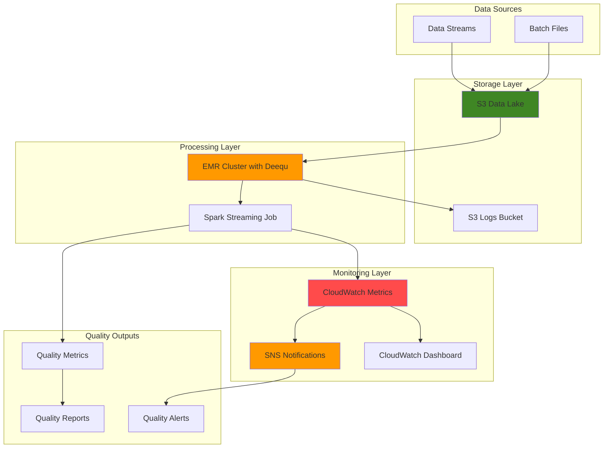

# Monitoring Data Quality with Deequ on EMR

## Problem

Data engineers at large enterprises face critical challenges ensuring data quality in real-time streaming pipelines where millions of records flow through systems daily. Traditional batch-based data quality checks create significant lag between data ingestion and quality validation, leading to downstream analytics being built on poor quality data, resulting in incorrect business decisions and regulatory compliance issues. Without continuous monitoring, data quality issues like schema drift, null values, and data distribution anomalies can propagate through entire data ecosystems before detection.

## Solution

Implement a comprehensive real-time data quality monitoring system using Amazon Deequ on EMR that continuously validates data quality metrics, detects anomalies, and provides automated alerting. This solution leverages Apache Spark's distributed processing capabilities with Deequ's statistical analysis engine to perform real-time quality checks on streaming data, automatically flagging quality issues and sending notifications to data teams for immediate remediation.

## Architecture Diagram



## Prerequisites

1. AWS account with permissions for EMR, S3, CloudWatch, SNS, and IAM
2. AWS CLI v2 installed and configured (or AWS CloudShell)
3. Knowledge of Apache Spark, Scala, and data quality concepts
4. Understanding of EMR cluster management and Spark applications
5. Estimated cost: $20-30/hour for EMR cluster (m5.xlarge instances)

> **Note**: This recipe uses EMR 7.9.0 which includes Spark 3.5.5 and supports Deequ 2.0.11-spark-3.5 compatibility.

## Preparation

```bash
# Set environment variables
export AWS_REGION=$(aws configure get region)
export AWS_ACCOUNT_ID=$(aws sts get-caller-identity \
    --query Account --output text)

# Generate unique identifiers for resources
RANDOM_SUFFIX=$(aws secretsmanager get-random-password \
    --exclude-punctuation --exclude-uppercase \
    --password-length 6 --require-each-included-type \
    --output text --query RandomPassword)

export CLUSTER_NAME="deequ-quality-monitor-${RANDOM_SUFFIX}"
export S3_BUCKET_NAME="deequ-data-quality-${RANDOM_SUFFIX}"
export SNS_TOPIC_NAME="data-quality-alerts-${RANDOM_SUFFIX}"

# Create S3 bucket for data and logs
aws s3 mb s3://${S3_BUCKET_NAME} --region ${AWS_REGION}

# Enable S3 bucket versioning and encryption
aws s3api put-bucket-versioning \
    --bucket ${S3_BUCKET_NAME} \
    --versioning-configuration Status=Enabled

aws s3api put-bucket-encryption \
    --bucket ${S3_BUCKET_NAME} \
    --server-side-encryption-configuration \
    'Rules=[{ApplyServerSideEncryptionByDefault:{SSEAlgorithm:AES256}}]'

# Create directory structure
aws s3api put-object --bucket ${S3_BUCKET_NAME} --key raw-data/
aws s3api put-object --bucket ${S3_BUCKET_NAME} --key quality-reports/
aws s3api put-object --bucket ${S3_BUCKET_NAME} --key logs/
aws s3api put-object --bucket ${S3_BUCKET_NAME} --key scripts/

# Create SNS topic for alerts
aws sns create-topic --name ${SNS_TOPIC_NAME}
export SNS_TOPIC_ARN=$(aws sns get-topic-attributes \
    --topic-arn arn:aws:sns:${AWS_REGION}:${AWS_ACCOUNT_ID}:${SNS_TOPIC_NAME} \
    --query Attributes.TopicArn --output text)

# Subscribe your email to SNS topic
echo "Enter your email for data quality alerts:"
read EMAIL_ADDRESS
aws sns subscribe --topic-arn ${SNS_TOPIC_ARN} \
    --protocol email --notification-endpoint ${EMAIL_ADDRESS}

echo "✅ AWS environment configured with S3 bucket: ${S3_BUCKET_NAME}"
```

## Steps

1. **Create EMR Service Role and Instance Profile**:

   EMR requires specific IAM roles to manage cluster resources and provide EC2 instances with necessary permissions. The service role allows EMR to provision and manage cluster resources on your behalf, while the instance profile enables EMR nodes to access AWS services like S3 for data processing. This security foundation follows AWS best practices by implementing least-privilege access patterns that are essential for production data processing environments.

   ```bash
   # Create EMR service role
   aws iam create-role --role-name EMR_DefaultRole \
       --assume-role-policy-document '{
           "Version": "2012-10-17",
           "Statement": [
               {
                   "Effect": "Allow",
                   "Principal": {
                       "Service": "elasticmapreduce.amazonaws.com"
                   },
                   "Action": "sts:AssumeRole"
               }
           ]
       }'
   
   # Attach EMR service policy
   aws iam attach-role-policy --role-name EMR_DefaultRole \
       --policy-arn arn:aws:iam::aws:policy/service-role/AmazonElasticMapReduceRole
   
   # Create EC2 instance profile for EMR
   aws iam create-role --role-name EMR_EC2_DefaultRole \
       --assume-role-policy-document '{
           "Version": "2012-10-17",
           "Statement": [
               {
                   "Effect": "Allow",
                   "Principal": {
                       "Service": "ec2.amazonaws.com"
                   },
                   "Action": "sts:AssumeRole"
               }
           ]
       }'
   
   # Attach EC2 instance profile policy
   aws iam attach-role-policy --role-name EMR_EC2_DefaultRole \
       --policy-arn arn:aws:iam::aws:policy/service-role/AmazonElasticMapReduceforEC2Role
   
   # Create instance profile
   aws iam create-instance-profile \
       --instance-profile-name EMR_EC2_DefaultRole
   aws iam add-role-to-instance-profile \
       --instance-profile-name EMR_EC2_DefaultRole \
       --role-name EMR_EC2_DefaultRole
   
   echo "✅ Created EMR roles and instance profile"
   ```

   These IAM roles establish the security foundation for EMR operations following AWS Well-Architected Framework principles. The service role enables EMR to launch and manage EC2 instances, while the instance profile allows Spark applications to access S3 data and publish CloudWatch metrics. This separation of concerns ensures secure, auditable access to AWS resources throughout the data quality monitoring workflow.

2. **Create Deequ Bootstrap Script**:

   EMR bootstrap actions execute custom scripts during cluster initialization, allowing us to install Deequ and required dependencies before Spark applications run. This approach ensures consistent software configuration across all cluster nodes and eliminates the need for manual package installation. The bootstrap script downloads the latest Deequ JAR file compatible with Spark 3.5 directly to Spark's classpath, making data quality analysis capabilities immediately available to all Spark applications.

   ```bash
   # Create bootstrap script for Deequ installation
   cat > /tmp/install-deequ.sh << 'EOF'
   #!/bin/bash
   
   # Download and install latest Deequ JAR for Spark 3.5
   sudo mkdir -p /usr/lib/spark/jars
   sudo wget -O /usr/lib/spark/jars/deequ-2.0.11-spark-3.5.jar \
       https://repo1.maven.org/maven2/com/amazon/deequ/deequ/2.0.11-spark-3.5/deequ-2.0.11-spark-3.5.jar
   
   # Install required Python packages
   sudo pip3 install boto3 pyarrow pandas numpy pydeequ
   
   # Create directories for custom scripts
   sudo mkdir -p /opt/deequ-scripts
   sudo chmod 755 /opt/deequ-scripts
   
   # Set permissions for Spark jars directory
   sudo chmod 755 /usr/lib/spark/jars
   
   echo "Deequ installation completed successfully"
   EOF
   
   # Upload bootstrap script to S3
   aws s3 cp /tmp/install-deequ.sh s3://${S3_BUCKET_NAME}/scripts/
   
   echo "✅ Created and uploaded Deequ bootstrap script"
   ```

   The bootstrap script is now stored in S3 and ready for EMR cluster initialization. This script ensures that Deequ's data quality analysis capabilities are available on all cluster nodes, enabling distributed execution of quality checks across large datasets. The automated installation process reduces setup complexity and ensures consistent environments across different clusters, supporting reproducible data quality monitoring workflows.

3. **Create Sample Data for Testing**:

   Realistic test data is crucial for validating data quality monitoring systems. This step generates customer data with intentionally introduced quality issues that mirror real-world scenarios: missing values, invalid formats, constraint violations, and duplicate records. By creating data with known quality problems, we can verify that Deequ correctly identifies these issues and triggers appropriate alerts, ensuring our monitoring system works as expected in production scenarios.

   ```bash
   # Create sample customer data with quality issues
   cat > /tmp/sample-data.py << 'EOF'
   import pandas as pd
   import numpy as np
   import random
   from datetime import datetime, timedelta
   
   # Generate sample customer data with intentional quality issues
   np.random.seed(42)
   num_records = 10000
   
   # Create base dataset
   data = {
       'customer_id': range(1, num_records + 1),
       'email': [f'user{i}@example.com' for i in range(1, num_records + 1)],
       'age': np.random.randint(18, 80, num_records),
       'income': np.random.normal(50000, 20000, num_records),
       'region': np.random.choice(['US', 'EU', 'APAC'], num_records),
       'signup_date': [datetime.now() - timedelta(days=random.randint(1, 365)) 
                      for _ in range(num_records)]
   }
   
   # Introduce quality issues
   # 1. Missing values in income (5% missing)
   missing_indices = np.random.choice(num_records, size=int(num_records * 0.05), replace=False)
   for idx in missing_indices:
       data['income'][idx] = None
   
   # 2. Invalid email formats (2% invalid)
   invalid_email_indices = np.random.choice(num_records, size=int(num_records * 0.02), replace=False)
   for idx in invalid_email_indices:
       data['email'][idx] = f'invalid-email-{idx}'
   
   # 3. Negative ages (1% negative)
   negative_age_indices = np.random.choice(num_records, size=int(num_records * 0.01), replace=False)
   for idx in negative_age_indices:
       data['age'][idx] = -abs(data['age'][idx])
   
   # 4. Duplicate customer IDs (3% duplicates)
   duplicate_indices = np.random.choice(num_records, size=int(num_records * 0.03), replace=False)
   for idx in duplicate_indices:
       data['customer_id'][idx] = data['customer_id'][idx - 1]
   
   # Convert to DataFrame and save
   df = pd.DataFrame(data)
   df.to_csv('/tmp/sample_customer_data.csv', index=False)
   print(f"Generated {len(df)} customer records with quality issues")
   EOF
   
   # Generate the sample data
   python3 /tmp/sample-data.py
   
   # Upload sample data to S3
   aws s3 cp /tmp/sample_customer_data.csv \
       s3://${S3_BUCKET_NAME}/raw-data/
   
   echo "✅ Created and uploaded sample data with quality issues"
   ```

   The sample dataset now contains realistic quality issues that will test our monitoring system's detection capabilities. This data includes approximately 5% missing income values, 2% invalid email formats, 1% negative ages, and 3% duplicate customer IDs - patterns commonly found in real enterprise datasets. This controlled test environment allows us to validate our quality rules and alerting mechanisms before deploying to production data sources.

4. **Create Data Quality Monitoring Spark Application**:

   The core Spark application implements comprehensive data quality monitoring using Deequ's verification and analysis capabilities. This application defines business-specific quality constraints, executes distributed quality checks across the dataset, and integrates with AWS services for monitoring and alerting. The modular design separates constraint definition, metric calculation, and alerting logic, making the system maintainable and extensible for different data sources and quality requirements.

   ```bash
   # Create comprehensive Deequ quality monitoring application
   cat > /tmp/deequ-quality-monitor.py << 'EOF'
   import sys
   from pyspark.sql import SparkSession
   from pyspark.sql.functions import col, current_timestamp, lit
   import boto3
   import json
   from datetime import datetime
   
   # Initialize Spark session with Deequ
   spark = SparkSession.builder \
       .appName("DeeQuDataQualityMonitor") \
       .config("spark.jars.packages", "com.amazon.deequ:deequ:2.0.11-spark-3.5") \
       .getOrCreate()
   
   # Import Deequ classes
   from pydeequ.analyzers import *
   from pydeequ.checks import *
   from pydeequ.verification import *
   from pydeequ.suggestions import *
   
   def publish_metrics_to_cloudwatch(metrics, bucket_name):
       """Publish data quality metrics to CloudWatch"""
       cloudwatch = boto3.client('cloudwatch')
       
       for metric_name, metric_value in metrics.items():
           try:
               cloudwatch.put_metric_data(
                   Namespace='DataQuality/Deequ',
                   MetricData=[
                       {
                           'MetricName': metric_name,
                           'Value': float(metric_value),
                           'Unit': 'Count',
                           'Dimensions': [
                               {
                                   'Name': 'DataSource',
                                   'Value': bucket_name
                               }
                           ]
                       }
                   ]
               )
               print(f"Published metric: {metric_name} = {metric_value}")
           except Exception as e:
               print(f"Error publishing metric {metric_name}: {str(e)}")
   
   def send_alert_if_needed(verification_result, sns_topic_arn):
       """Send SNS alert if data quality issues are found"""
       failed_checks = []
       
       for check_result in verification_result.checkResults:
           if check_result.status != CheckStatus.Success:
               failed_checks.append({
                   'check': str(check_result.check),
                   'status': str(check_result.status),
                   'constraint': str(check_result.constraint)
               })
       
       if failed_checks:
           sns = boto3.client('sns')
           message = {
               'timestamp': datetime.now().isoformat(),
               'alert_type': 'DATA_QUALITY_FAILURE',
               'failed_checks': failed_checks,
               'total_failed_checks': len(failed_checks)
           }
           
           sns.publish(
               TopicArn=sns_topic_arn,
               Message=json.dumps(message, indent=2),
               Subject='Data Quality Alert - Issues Detected'
           )
           print(f"Alert sent: {len(failed_checks)} quality issues detected")
   
   def main():
       # Get parameters
       if len(sys.argv) != 4:
           print("Usage: deequ-quality-monitor.py <s3_bucket> <data_path> <sns_topic_arn>")
           sys.exit(1)
       
       s3_bucket = sys.argv[1]
       data_path = sys.argv[2]
       sns_topic_arn = sys.argv[3]
       
       # Read data with enhanced error handling
       try:
           df = spark.read.option("header", "true").option("inferSchema", "true").csv(data_path)
           record_count = df.count()
           print(f"Processing {record_count} records from {data_path}")
       except Exception as e:
           print(f"Error reading data: {str(e)}")
           sys.exit(1)
       
       # Define data quality checks
       verification_result = VerificationSuite(spark) \
           .onData(df) \
           .addCheck(
               Check(spark, CheckLevel.Error, "Customer Data Quality Checks")
               .hasSize(lambda x: x > 0)  # Non-empty dataset
               .isComplete("customer_id")  # No null customer IDs
               .isUnique("customer_id")   # Unique customer IDs
               .isComplete("email")       # No null emails
               .containsEmail("email")    # Valid email format
               .isNonNegative("age")      # Age must be non-negative
               .isContainedIn("region", ["US", "EU", "APAC"])  # Valid regions
               .hasCompleteness("income", lambda x: x > 0.9)  # At least 90% income data
           ) \
           .run()
       
       # Run analysis for detailed metrics
       analysis_result = AnalysisRunner(spark) \
           .onData(df) \
           .addAnalyzer(Size()) \
           .addAnalyzer(Completeness("customer_id")) \
           .addAnalyzer(Completeness("email")) \
           .addAnalyzer(Completeness("income")) \
           .addAnalyzer(Uniqueness("customer_id")) \
           .addAnalyzer(Mean("age")) \
           .addAnalyzer(StandardDeviation("age")) \
           .addAnalyzer(CountDistinct("region")) \
           .run()
       
       # Extract metrics with error handling
       metrics = {}
       try:
           for analyzer_name, analyzer_result in analysis_result.analyzerContext.metricMap.items():
               if analyzer_result.value.isSuccess():
                   metric_name = str(analyzer_name).replace(":", "_").replace("(", "_").replace(")", "_")
                   metrics[metric_name] = analyzer_result.value.get()
       except Exception as e:
           print(f"Error extracting metrics: {str(e)}")
       
       # Publish metrics to CloudWatch
       if metrics:
           publish_metrics_to_cloudwatch(metrics, s3_bucket)
       
       # Send alerts if needed
       send_alert_if_needed(verification_result, sns_topic_arn)
       
       # Save detailed results
       timestamp = datetime.now().strftime("%Y%m%d_%H%M%S")
       
       try:
           # Save verification results
           verification_df = VerificationResult.checkResultsAsDataFrame(spark, verification_result)
           verification_df.write.mode("overwrite").json(f"s3://{s3_bucket}/quality-reports/verification_{timestamp}")
           
           # Save analysis results
           analysis_df = AnalysisResult.successMetricsAsDataFrame(spark, analysis_result)
           analysis_df.write.mode("overwrite").json(f"s3://{s3_bucket}/quality-reports/analysis_{timestamp}")
           
           print("✅ Data quality monitoring completed successfully")
           print(f"Metrics published to CloudWatch namespace: DataQuality/Deequ")
           print(f"Reports saved to: s3://{s3_bucket}/quality-reports/")
           
           # Print summary
           print("\n=== VERIFICATION RESULTS ===")
           verification_df.show(truncate=False)
           
           print("\n=== ANALYSIS RESULTS ===")
           analysis_df.show(truncate=False)
           
       except Exception as e:
           print(f"Error saving results: {str(e)}")
   
   if __name__ == "__main__":
       main()
   EOF
   
   # Upload the monitoring application to S3
   aws s3 cp /tmp/deequ-quality-monitor.py \
       s3://${S3_BUCKET_NAME}/scripts/
   
   echo "✅ Created and uploaded Deequ quality monitoring application"
   ```

   The monitoring application is now ready for execution on EMR. This comprehensive solution combines Deequ's statistical analysis capabilities with AWS integration for CloudWatch metrics and SNS alerting. The application includes enhanced error handling, comprehensive logging, and robust metric publishing, creating an enterprise-ready data quality monitoring pipeline that processes data at scale while maintaining reliability and observability.

5. **Launch EMR Cluster with Deequ**:

   EMR provides managed Apache Spark infrastructure that automatically handles cluster provisioning, software installation, and scaling operations. The cluster configuration includes optimized Spark settings for data quality workloads, including adaptive query execution and Kryo serialization for improved performance. The three-node cluster architecture provides distributed processing capabilities while maintaining cost efficiency for data quality monitoring workloads.

   ```bash
   # Create EMR cluster with Deequ bootstrap action
   aws emr create-cluster \
       --name "${CLUSTER_NAME}" \
       --release-label emr-7.9.0 \
       --applications Name=Spark \
       --instance-type m5.xlarge \
       --instance-count 3 \
       --service-role EMR_DefaultRole \
       --ec2-attributes InstanceProfile=EMR_EC2_DefaultRole \
       --bootstrap-actions Path=s3://${S3_BUCKET_NAME}/scripts/install-deequ.sh \
       --log-uri s3://${S3_BUCKET_NAME}/logs/ \
       --enable-debugging \
       --configurations '[
           {
               "Classification": "spark-defaults",
               "Properties": {
                   "spark.sql.adaptive.enabled": "true",
                   "spark.sql.adaptive.coalescePartitions.enabled": "true",
                   "spark.serializer": "org.apache.spark.serializer.KryoSerializer",
                   "spark.sql.adaptive.skewJoin.enabled": "true"
               }
           }
       ]'
   
   # Get cluster ID
   export CLUSTER_ID=$(aws emr list-clusters \
       --cluster-states STARTING BOOTSTRAPPING RUNNING \
       --query "Clusters[?Name=='${CLUSTER_NAME}'].Id" \
       --output text)
   
   echo "✅ EMR cluster created with ID: ${CLUSTER_ID}"
   echo "Waiting for cluster to be ready..."
   
   # Wait for cluster to be ready
   aws emr wait cluster-running --cluster-id ${CLUSTER_ID}
   
   echo "✅ EMR cluster is now running and ready"
   ```

   The EMR cluster is now operational with the latest EMR 7.9.0 release, featuring Spark 3.5.5 and Deequ 2.0.11 installed and configured for data quality monitoring. The cluster's distributed Spark environment enables processing of large datasets while the bootstrap action has prepared all nodes with the necessary data quality analysis capabilities. This managed infrastructure eliminates operational overhead while providing the scalability and performance optimization needed for enterprise data quality monitoring.

6. **Submit Data Quality Monitoring Job**:

   Submitting the Spark application to EMR initiates distributed data quality analysis across the cluster. The application runs in cluster mode, distributing computation across multiple nodes for scalable processing of large datasets. This execution model enables quality monitoring of datasets that would be impractical to process on single machines, while Deequ's statistical analysis provides comprehensive insights into data quality patterns and anomalies.

   ```bash
   # Submit the data quality monitoring application
   aws emr add-steps --cluster-id ${CLUSTER_ID} \
       --steps '[
           {
               "Name": "DeeQuDataQualityMonitoring",
               "ActionOnFailure": "CONTINUE",
               "HadoopJarStep": {
                   "Jar": "command-runner.jar",
                   "Args": [
                       "spark-submit",
                       "--deploy-mode", "cluster",
                       "--master", "yarn",
                       "--conf", "spark.sql.adaptive.enabled=true",
                       "--conf", "spark.dynamicAllocation.enabled=true",
                       "s3://'${S3_BUCKET_NAME}'/scripts/deequ-quality-monitor.py",
                       "'${S3_BUCKET_NAME}'",
                       "s3://'${S3_BUCKET_NAME}'/raw-data/sample_customer_data.csv",
                       "'${SNS_TOPIC_ARN}'"
                   ]
               }
           }
       ]'
   
   # Get the step ID
   export STEP_ID=$(aws emr list-steps --cluster-id ${CLUSTER_ID} \
       --query "Steps[0].Id" --output text)
   
   echo "✅ Data quality monitoring job submitted with Step ID: ${STEP_ID}"
   echo "Monitoring job execution..."
   
   # Wait for step completion
   aws emr wait step-complete --cluster-id ${CLUSTER_ID} \
       --step-id ${STEP_ID}
   
   # Check step status
   STEP_STATUS=$(aws emr describe-step --cluster-id ${CLUSTER_ID} \
       --step-id ${STEP_ID} --query "Step.Status.State" --output text)
   
   echo "✅ Data quality monitoring job completed with status: ${STEP_STATUS}"
   ```

   The data quality analysis has finished, generating comprehensive metrics and validation results. The application has processed the sample dataset using Spark's distributed computing capabilities, executed all defined quality constraints, published metrics to CloudWatch, and saved detailed reports to S3. Any quality issues identified in the data have triggered SNS notifications, demonstrating the complete monitoring and alerting workflow powered by EMR's managed Spark infrastructure.

7. **Create CloudWatch Dashboard**:

   CloudWatch dashboards provide centralized visualization of data quality metrics, enabling data teams to monitor trends and identify issues across multiple datasets and time periods. The dashboard configuration displays key quality indicators including completeness, uniqueness, and statistical metrics, creating a comprehensive view of data health. This visual monitoring capability supports proactive data governance by making quality trends immediately visible to stakeholders.

   ```bash
   # Create CloudWatch dashboard for data quality metrics
   cat > /tmp/dashboard-config.json << EOF
   {
       "widgets": [
           {
               "type": "metric",
               "x": 0,
               "y": 0,
               "width": 12,
               "height": 6,
               "properties": {
                   "metrics": [
                       [ "DataQuality/Deequ", "Size", "DataSource", "${S3_BUCKET_NAME}" ],
                       [ ".", "Completeness_customer_id_", ".", "." ],
                       [ ".", "Completeness_email_", ".", "." ],
                       [ ".", "Completeness_income_", ".", "." ]
                   ],
                   "period": 300,
                   "stat": "Average",
                   "region": "${AWS_REGION}",
                   "title": "Data Quality Completeness Metrics",
                   "yAxis": {
                       "left": {
                           "min": 0,
                           "max": 1
                       }
                   }
               }
           },
           {
               "type": "metric",
               "x": 12,
               "y": 0,
               "width": 12,
               "height": 6,
               "properties": {
                   "metrics": [
                       [ "DataQuality/Deequ", "Uniqueness_customer_id_", "DataSource", "${S3_BUCKET_NAME}" ],
                       [ ".", "Mean_age_", ".", "." ],
                       [ ".", "StandardDeviation_age_", ".", "." ]
                   ],
                   "period": 300,
                   "stat": "Average",
                   "region": "${AWS_REGION}",
                   "title": "Data Distribution Metrics"
               }
           }
       ]
   }
   EOF
   
   # Create the dashboard
   aws cloudwatch put-dashboard \
       --dashboard-name "DeeQuDataQualityMonitoring" \
       --dashboard-body file:///tmp/dashboard-config.json
   
   echo "✅ CloudWatch dashboard created: DeeQuDataQualityMonitoring"
   ```

   The dashboard is now available in the CloudWatch console, providing real-time visualization of data quality metrics with enhanced charting options. Teams can monitor completeness ratios, uniqueness scores, and statistical distributions to understand data quality trends over time. This centralized monitoring capability enables proactive identification of quality degradation and supports data governance decision-making through comprehensive visual analytics.

8. **Set Up Automated Quality Monitoring**:

   Automated monitoring enables continuous data quality validation without manual intervention, essential for production data pipelines that process data continuously. The automation script can be triggered by various events such as new data arrivals, scheduled intervals, or quality threshold breaches. This automation framework supports scalable quality monitoring across multiple data sources and enables rapid response to quality issues.

   ```bash
   # Create script for automated monitoring
   cat > /tmp/automated-monitoring.py << 'EOF'
   import boto3
   import json
   import time
   
   def submit_monitoring_job(cluster_id, s3_bucket, data_path, sns_topic_arn):
       """Submit data quality monitoring job to EMR"""
       emr = boto3.client('emr')
       
       step_config = {
           "Name": f"AutomatedDataQualityMonitoring_{int(time.time())}",
           "ActionOnFailure": "CONTINUE",
           "HadoopJarStep": {
               "Jar": "command-runner.jar",
               "Args": [
                   "spark-submit",
                   "--deploy-mode", "cluster",
                   "--master", "yarn",
                   "--conf", "spark.sql.adaptive.enabled=true",
                   "--conf", "spark.dynamicAllocation.enabled=true",
                   f"s3://{s3_bucket}/scripts/deequ-quality-monitor.py",
                   s3_bucket,
                   data_path,
                   sns_topic_arn
               ]
           }
       }
       
       try:
           response = emr.add_steps(
               ClusterId=cluster_id,
               Steps=[step_config]
           )
           return response['StepIds'][0]
       except Exception as e:
           print(f"Error submitting monitoring job: {str(e)}")
           raise
   
   def lambda_handler(event, context):
       """Lambda function to trigger automated monitoring"""
       try:
           cluster_id = event['cluster_id']
           s3_bucket = event['s3_bucket']
           data_path = event['data_path']
           sns_topic_arn = event['sns_topic_arn']
           
           step_id = submit_monitoring_job(cluster_id, s3_bucket, data_path, sns_topic_arn)
           
           return {
               'statusCode': 200,
               'body': json.dumps({
                   'message': 'Data quality monitoring job submitted successfully',
                   'step_id': step_id,
                   'timestamp': time.time()
               })
           }
       except Exception as e:
           return {
               'statusCode': 500,
               'body': json.dumps({
                   'error': str(e)
               })
           }
   EOF
   
   # Upload automated monitoring script
   aws s3 cp /tmp/automated-monitoring.py \
       s3://${S3_BUCKET_NAME}/scripts/
   
   echo "✅ Created automated monitoring script"
   ```

   The automation script establishes the foundation for continuous quality monitoring in production environments. This Lambda-compatible function includes enhanced error handling and can be integrated with event-driven architectures to automatically trigger quality checks when new data arrives, ensuring consistent validation across all data processing workflows. The automated approach reduces operational overhead while maintaining comprehensive quality monitoring coverage and reliability.

## Validation & Testing

1. **Verify CloudWatch Metrics**:

   ```bash
   # Check if metrics are published to CloudWatch
   aws cloudwatch list-metrics \
       --namespace "DataQuality/Deequ" \
       --dimensions Name=DataSource,Value=${S3_BUCKET_NAME}
   
   echo "Expected output: List of data quality metrics including Size, Completeness, Uniqueness"
   ```

2. **Check Data Quality Reports**:

   ```bash
   # List quality reports generated
   aws s3 ls s3://${S3_BUCKET_NAME}/quality-reports/ --recursive
   
   # Download and examine a verification report
   LATEST_VERIFICATION=$(aws s3 ls s3://${S3_BUCKET_NAME}/quality-reports/ \
       | grep verification | sort | tail -1 | awk '{print $4}')
   
   if [ ! -z "$LATEST_VERIFICATION" ]; then
       aws s3 cp s3://${S3_BUCKET_NAME}/quality-reports/${LATEST_VERIFICATION} \
           /tmp/verification_report/ --recursive
       echo "✅ Downloaded verification report to /tmp/verification_report/"
   fi
   ```

3. **Test Alert System**:

   ```bash
   # Create data with severe quality issues to trigger alerts
   cat > /tmp/bad-data.csv << 'EOF'
   customer_id,email,age,income,region
   1,invalid-email,-25,,INVALID
   1,another-invalid,-30,,INVALID
   2,bad-email,-35,,INVALID
   EOF
   
   # Upload bad data
   aws s3 cp /tmp/bad-data.csv \
       s3://${S3_BUCKET_NAME}/raw-data/bad-data.csv
   
   # Submit monitoring job for bad data
   aws emr add-steps --cluster-id ${CLUSTER_ID} \
       --steps '[
           {
               "Name": "TestDataQualityAlerts",
               "ActionOnFailure": "CONTINUE",
               "HadoopJarStep": {
                   "Jar": "command-runner.jar",
                   "Args": [
                       "spark-submit",
                       "--deploy-mode", "cluster",
                       "--master", "yarn",
                       "s3://'${S3_BUCKET_NAME}'/scripts/deequ-quality-monitor.py",
                       "'${S3_BUCKET_NAME}'",
                       "s3://'${S3_BUCKET_NAME}'/raw-data/bad-data.csv",
                       "'${SNS_TOPIC_ARN}'"
                   ]
               }
           }
       ]'
   
   echo "✅ Submitted test job with bad data - check your email for alerts"
   ```

4. **Verify Dashboard Functionality**:

   ```bash
   # Get dashboard URL
   echo "CloudWatch Dashboard URL:"
   echo "https://${AWS_REGION}.console.aws.amazon.com/cloudwatch/home?region=${AWS_REGION}#dashboards:name=DeeQuDataQualityMonitoring"
   
   # Check recent metrics
   aws cloudwatch get-metric-statistics \
       --namespace "DataQuality/Deequ" \
       --metric-name "Size" \
       --dimensions Name=DataSource,Value=${S3_BUCKET_NAME} \
       --start-time $(date -u -d '1 hour ago' +%Y-%m-%dT%H:%M:%S) \
       --end-time $(date -u +%Y-%m-%dT%H:%M:%S) \
       --period 300 \
       --statistics Average
   ```

## Cleanup

1. **Terminate EMR Cluster**:

   ```bash
   # Terminate the EMR cluster
   aws emr terminate-clusters --cluster-ids ${CLUSTER_ID}
   
   # Wait for cluster termination
   aws emr wait cluster-terminated --cluster-id ${CLUSTER_ID}
   
   echo "✅ EMR cluster terminated"
   ```

2. **Delete CloudWatch Dashboard**:

   ```bash
   # Delete the dashboard
   aws cloudwatch delete-dashboards \
       --dashboard-names "DeeQuDataQualityMonitoring"
   
   echo "✅ CloudWatch dashboard deleted"
   ```

3. **Remove S3 Resources**:

   ```bash
   # Delete all objects in S3 bucket
   aws s3 rm s3://${S3_BUCKET_NAME} --recursive
   
   # Delete the bucket
   aws s3 rb s3://${S3_BUCKET_NAME}
   
   echo "✅ S3 bucket and contents deleted"
   ```

4. **Delete SNS Topic**:

   ```bash
   # Delete SNS topic
   aws sns delete-topic --topic-arn ${SNS_TOPIC_ARN}
   
   echo "✅ SNS topic deleted"
   ```

5. **Remove IAM Roles**:

   ```bash
   # Remove instance profile
   aws iam remove-role-from-instance-profile \
       --instance-profile-name EMR_EC2_DefaultRole \
       --role-name EMR_EC2_DefaultRole
   aws iam delete-instance-profile \
       --instance-profile-name EMR_EC2_DefaultRole
   
   # Detach and delete roles
   aws iam detach-role-policy --role-name EMR_DefaultRole \
       --policy-arn arn:aws:iam::aws:policy/service-role/AmazonElasticMapReduceRole
   aws iam delete-role --role-name EMR_DefaultRole
   
   aws iam detach-role-policy --role-name EMR_EC2_DefaultRole \
       --policy-arn arn:aws:iam::aws:policy/service-role/AmazonElasticMapReduceforEC2Role
   aws iam delete-role --role-name EMR_EC2_DefaultRole
   
   echo "✅ IAM roles and policies cleaned up"
   ```

## Discussion

This comprehensive data quality monitoring solution using Amazon Deequ on EMR provides enterprise-grade capabilities for ensuring data integrity in large-scale data processing environments. Deequ leverages Apache Spark's distributed computing power to perform sophisticated statistical analysis and constraint verification on datasets of any size, making it ideal for big data scenarios where traditional data quality tools would struggle. The solution demonstrates how AWS-managed services can eliminate operational complexity while providing the scalability needed for enterprise-scale data quality monitoring.

The architecture follows AWS Well-Architected Framework principles across all five pillars. For operational excellence, the solution uses EMR's managed infrastructure to eliminate cluster management overhead while providing comprehensive monitoring through CloudWatch dashboards. Security is implemented through IAM least-privilege principles, S3 encryption at rest, and secure inter-service communication. Reliability is achieved through EMR's multi-AZ deployment capabilities and automated failure recovery. Performance efficiency is optimized through Spark's adaptive query execution and dynamic resource allocation. Cost optimization is supported through EMR's pay-per-use pricing model and automated cluster termination capabilities.

The real-time monitoring capabilities are particularly valuable for organizations implementing data mesh architectures or maintaining strict data governance requirements. By implementing automated quality checks that run continuously, data teams can identify and address issues before they propagate to downstream systems, reducing the risk of incorrect analytics and business decisions. The solution also provides detailed reporting and metrics that help organizations understand their data quality trends over time and make informed decisions about data governance policies, supporting compliance with regulations like GDPR and CCPA.

> **Tip**: Consider implementing different quality rules for different data sources and establishing quality score thresholds that automatically trigger data quarantine processes when exceeded. The [AWS Well-Architected Data Analytics Lens](https://docs.aws.amazon.com/wellarchitected/latest/analytics-lens/welcome.html) provides additional guidance on building robust data quality systems.

## Challenge

Extend this solution by implementing these enhancements:

1. **Multi-Dataset Quality Comparison**: Implement cross-dataset quality checks that compare quality metrics between different data sources and time periods to identify degradation patterns using [Amazon Athena](https://docs.aws.amazon.com/athena/latest/ug/what-is.html) for historical analysis.

2. **Machine Learning-Based Anomaly Detection**: Integrate [Amazon SageMaker](https://docs.aws.amazon.com/sagemaker/latest/dg/whatis.html) to build predictive models that can identify subtle data quality issues based on historical patterns and statistical anomalies.

3. **Real-time Streaming Quality Monitoring**: Adapt the solution to work with [Amazon Kinesis Data Streams](https://docs.aws.amazon.com/kinesis/latest/dev/introduction.html) for continuous quality monitoring of real-time data feeds with millisecond latency.

4. **Automated Data Remediation**: Build intelligent remediation workflows using [AWS Step Functions](https://docs.aws.amazon.com/step-functions/latest/dg/welcome.html) that automatically fix common data quality issues like format standardization, duplicate removal, and missing value imputation.

5. **Quality-Based Data Routing**: Implement dynamic data routing using [Amazon EventBridge](https://docs.aws.amazon.com/eventbridge/latest/userguide/eb-what-is.html) that automatically directs high-quality data to production systems while quarantining problematic data for manual review or reprocessing.

## Infrastructure Code

*Infrastructure code will be generated after recipe approval.*