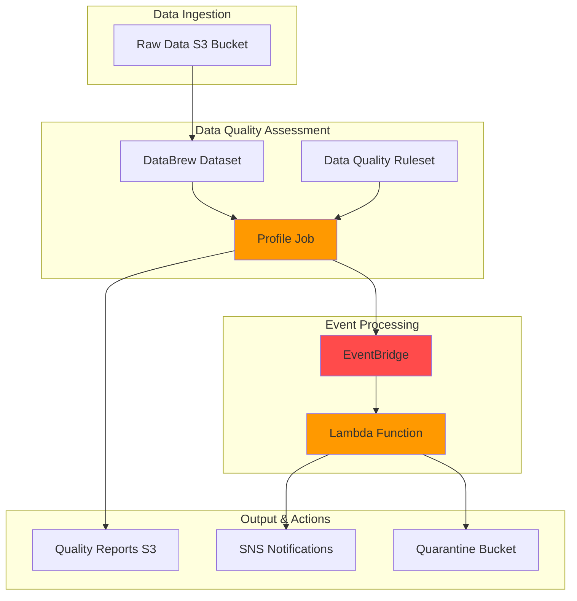

# Data Quality Pipelines with DataBrew

## Problem

Organizations frequently struggle with inconsistent data quality in their analytics pipelines, where poor-quality data leads to unreliable business insights and increased manual intervention costs. Data teams often discover quality issues only after downstream processes have failed, resulting in delayed decision-making, decreased trust in analytics systems, and significant operational overhead from reactive data remediation efforts.

## Solution

Create an automated data quality pipeline using AWS Glue DataBrew for visual data profiling and validation combined with Amazon EventBridge for event-driven workflow automation. This solution automatically detects quality issues through predefined rules, triggers remediation workflows when thresholds are breached, and provides real-time notifications to data teams while maintaining comprehensive audit trails.

## Architecture Diagram



## Prerequisites

1. AWS account with administrative permissions for DataBrew, EventBridge, S3, Lambda, and IAM
2. AWS CLI v2 installed and configured (or AWS CloudShell)
3. Basic understanding of data quality concepts and JSON syntax
4. Sample dataset uploaded to S3 for testing (CSV or JSON format)
5. Estimated cost: $10-15 for DataBrew jobs, Lambda executions, and S3 storage during testing

> **Note**: DataBrew charges based on the number of nodes and time used for profile jobs. Each node processes approximately 20 GB of data per hour. For detailed pricing information, see the [AWS Glue DataBrew pricing documentation](https://aws.amazon.com/glue/pricing/).

## Preparation

```bash
# Set environment variables
export AWS_REGION=$(aws configure get region)
export AWS_ACCOUNT_ID=$(aws sts get-caller-identity \
    --query Account --output text)

# Generate unique identifiers for resources
RANDOM_SUFFIX=$(aws secretsmanager get-random-password \
    --exclude-punctuation --exclude-uppercase \
    --password-length 6 --require-each-included-type \
    --output text --query RandomPassword)

export BUCKET_NAME="data-quality-pipeline-${RANDOM_SUFFIX}"
export DATASET_NAME="customer-data-${RANDOM_SUFFIX}"
export RULESET_NAME="customer-quality-rules-${RANDOM_SUFFIX}"
export PROFILE_JOB_NAME="quality-assessment-job-${RANDOM_SUFFIX}"

# Create S3 buckets for data and results
aws s3 mb s3://${BUCKET_NAME} --region ${AWS_REGION}

# Create sample CSV data file with known quality issues
cat > customer-data.csv << 'EOF'
customer_id,name,email,age,registration_date,purchase_amount
1,John Doe,john.doe@email.com,35,2024-01-15,299.99
2,Jane Smith,jane.smith@email.com,28,2024-02-20,159.50
3,Bob Johnson,,42,2024-01-30,899.00
4,Alice Brown,alice.brown@email.com,-5,2024-03-10,49.99
5,Charlie Wilson,invalid-email,30,2024-02-15,
6,Diana Davis,diana.davis@email.com,25,2024-01-05,199.75
EOF

# Upload sample data to S3
aws s3 cp customer-data.csv s3://${BUCKET_NAME}/raw-data/customer-data.csv

echo "✅ S3 bucket and sample data created successfully"
```

## Steps

1. **Create IAM Role for DataBrew Operations**:

   AWS Glue DataBrew requires specific IAM permissions to access S3 data sources and write profile results. This service role enables DataBrew to read input datasets, execute data profiling operations, and store quality assessment results in designated S3 locations while maintaining security best practices through least privilege access controls. The service role acts as a bridge between DataBrew and your data sources, ensuring secure access without exposing sensitive credentials.

   ```bash
   # Create trust policy for DataBrew service
   cat > databrew-trust-policy.json << 'EOF'
   {
     "Version": "2012-10-17",
     "Statement": [
       {
         "Effect": "Allow",
         "Principal": {
           "Service": "databrew.amazonaws.com"
         },
         "Action": "sts:AssumeRole"
       }
     ]
   }
   EOF
   
   # Create the DataBrew service role
   DATABREW_ROLE_ARN=$(aws iam create-role \
       --role-name DataBrewServiceRole-${RANDOM_SUFFIX} \
       --assume-role-policy-document file://databrew-trust-policy.json \
       --query 'Role.Arn' --output text)
   
   # Attach the managed policy for DataBrew
   aws iam attach-role-policy \
       --role-name DataBrewServiceRole-${RANDOM_SUFFIX} \
       --policy-arn arn:aws:iam::aws:policy/service-role/AWSGlueDataBrewServiceRole
   
   echo "✅ DataBrew IAM role created: ${DATABREW_ROLE_ARN}"
   ```

   The IAM role is now configured with appropriate permissions for DataBrew operations. This establishes the foundation for secure data access and processing capabilities required for subsequent profile job executions while ensuring compliance with security best practices.

2. **Create DataBrew Dataset**:

   DataBrew datasets define the connection to your data sources and specify how DataBrew should interpret the data structure. Creating a dataset establishes the data schema and connection parameters that enable DataBrew to perform profiling operations while handling various data formats including CSV, JSON, and Parquet files stored in S3. This abstraction layer allows DataBrew to understand the structure and semantics of your data, enabling intelligent profiling and quality assessment operations.

   ```bash
   # Create DataBrew dataset pointing to S3 data
   aws databrew create-dataset \
       --name ${DATASET_NAME} \
       --format CSV \
       --format-options '{
         "Csv": {
           "Delimiter": ",",
           "HeaderRow": true
         }
       }' \
       --input '{
         "S3InputDefinition": {
           "Bucket": "'${BUCKET_NAME}'",
           "Key": "raw-data/customer-data.csv"
         }
       }' \
       --tags Environment=Development,Purpose=DataQuality
   
   echo "✅ DataBrew dataset created: ${DATASET_NAME}"
   ```

   The dataset is now registered with DataBrew and ready for profiling operations. This configuration enables DataBrew to understand the data structure and apply appropriate profiling techniques for each column type, enabling comprehensive data quality analysis that adapts to your specific data characteristics.

3. **Create Data Quality Ruleset**:

   Data quality rulesets define specific validation criteria that datasets must meet to be considered acceptable for downstream processing. These rules encompass completeness checks, format validations, range constraints, and business logic requirements that automatically evaluate data against established quality standards. DataBrew's rule engine supports complex expressions and statistical thresholds that enable sophisticated quality assessment beyond simple null checks.

   ```bash
   # Get the dataset ARN for ruleset creation
   DATASET_ARN=$(aws databrew describe-dataset \
       --name ${DATASET_NAME} \
       --query 'ResourceArn' --output text)
   
   # Create comprehensive data quality ruleset
   aws databrew create-ruleset \
       --name ${RULESET_NAME} \
       --target-arn ${DATASET_ARN} \
       --rules '[
         {
           "Name": "EmailFormatValidation",
           "CheckExpression": ":col1 matches \"^[a-zA-Z0-9._%+-]+@[a-zA-Z0-9.-]+\\.[a-zA-Z]{2,}$\"",
           "SubstitutionMap": {
             ":col1": "`email`"
           },
           "Threshold": {
             "Value": 90.0,
             "Type": "GREATER_THAN_OR_EQUAL",
             "Unit": "PERCENTAGE"
           }
         },
         {
           "Name": "AgeRangeValidation",
           "CheckExpression": ":col1 between :val1 and :val2",
           "SubstitutionMap": {
             ":col1": "`age`",
             ":val1": "0",
             ":val2": "120"
           },
           "Threshold": {
             "Value": 95.0,
             "Type": "GREATER_THAN_OR_EQUAL",
             "Unit": "PERCENTAGE"
           }
         },
         {
           "Name": "PurchaseAmountNotNull",
           "CheckExpression": ":col1 is not null",
           "SubstitutionMap": {
             ":col1": "`purchase_amount`"
           },
           "Threshold": {
             "Value": 90.0,
             "Type": "GREATER_THAN_OR_EQUAL",
             "Unit": "PERCENTAGE"
           }
         }
       ]' \
       --tags Environment=Development,Purpose=DataQuality
   
   echo "✅ Data quality ruleset created: ${RULESET_NAME}"
   ```

   The ruleset now contains comprehensive validation rules covering email format validation, age range constraints, and purchase amount completeness. These rules will automatically evaluate data quality during profile job execution and trigger events when thresholds are not met, providing proactive quality monitoring capabilities.

4. **Create Lambda Function for Event Processing**:

   AWS Lambda provides serverless compute capabilities for processing DataBrew validation events and implementing automated remediation workflows. This function will receive EventBridge notifications when data quality rules fail and execute appropriate response actions including alerting stakeholders and initiating data quarantine processes. The serverless architecture ensures cost-effective event processing that scales automatically with validation workloads while eliminating infrastructure management overhead.

   ```bash
   # Create Lambda function code for event processing
   cat > lambda-function.py << 'EOF'
   import json
   import boto3
   import os
   from datetime import datetime
   
   def lambda_handler(event, context):
       print(f"Received event: {json.dumps(event, default=str)}")
       
       # Extract DataBrew validation result details
       detail = event.get('detail', {})
       validation_state = detail.get('validationState')
       dataset_name = detail.get('datasetName')
       job_name = detail.get('jobName')
       ruleset_name = detail.get('rulesetName')
       
       if validation_state == 'FAILED':
           # Initialize AWS clients
           sns = boto3.client('sns')
           s3 = boto3.client('s3')
           
           # Send notification
           message = f"""
           Data Quality Alert - Validation Failed
           
           Dataset: {dataset_name}
           Job: {job_name}
           Ruleset: {ruleset_name}
           Timestamp: {datetime.now().isoformat()}
           
           Action Required: Review data quality report and investigate source data issues.
           """
           
           # Publish to SNS (if topic ARN is provided)
           topic_arn = os.environ.get('SNS_TOPIC_ARN')
           if topic_arn:
               sns.publish(
                   TopicArn=topic_arn,
                   Subject='Data Quality Validation Failed',
                   Message=message
               )
           
           print(f"Data quality validation failed for dataset: {dataset_name}")
           
       return {
           'statusCode': 200,
           'body': json.dumps(f'Processed validation result: {validation_state}')
       }
   EOF
   
   # Create deployment package
   zip lambda-function.zip lambda-function.py
   
   # Create Lambda execution role
   cat > lambda-trust-policy.json << 'EOF'
   {
     "Version": "2012-10-17",
     "Statement": [
       {
         "Effect": "Allow",
         "Principal": {
           "Service": "lambda.amazonaws.com"
         },
         "Action": "sts:AssumeRole"
       }
     ]
   }
   EOF
   
   LAMBDA_ROLE_ARN=$(aws iam create-role \
       --role-name DataQualityLambdaRole-${RANDOM_SUFFIX} \
       --assume-role-policy-document file://lambda-trust-policy.json \
       --query 'Role.Arn' --output text)
   
   # Attach basic Lambda execution policy
   aws iam attach-role-policy \
       --role-name DataQualityLambdaRole-${RANDOM_SUFFIX} \
       --policy-arn arn:aws:iam::aws:policy/service-role/AWSLambdaBasicExecutionRole
   
   # Create additional policy for SNS and S3 access
   cat > lambda-permissions-policy.json << 'EOF'
   {
     "Version": "2012-10-17",
     "Statement": [
       {
         "Effect": "Allow",
         "Action": [
           "sns:Publish",
           "s3:GetObject",
           "s3:PutObject"
         ],
         "Resource": "*"
       }
     ]
   }
   EOF
   
   aws iam put-role-policy \
       --role-name DataQualityLambdaRole-${RANDOM_SUFFIX} \
       --policy-name DataQualityPermissions \
       --policy-document file://lambda-permissions-policy.json
   
   # Wait for role propagation
   sleep 10
   
   # Create Lambda function
   LAMBDA_FUNCTION_ARN=$(aws lambda create-function \
       --function-name DataQualityProcessor-${RANDOM_SUFFIX} \
       --runtime python3.9 \
       --role ${LAMBDA_ROLE_ARN} \
       --handler lambda-function.lambda_handler \
       --zip-file fileb://lambda-function.zip \
       --timeout 60 \
       --query 'FunctionArn' --output text)
   
   echo "✅ Lambda function created: ${LAMBDA_FUNCTION_ARN}"
   ```

   The Lambda function is now deployed and configured with appropriate permissions for processing DataBrew events. This serverless component provides the automation logic for responding to data quality failures and implementing remediation workflows, enabling immediate response to quality issues without manual intervention.

5. **Create EventBridge Rule for DataBrew Events**:

   Amazon EventBridge enables event-driven automation by creating rules that match specific DataBrew validation events and route them to appropriate targets. This integration automatically triggers response workflows when data quality thresholds are breached, ensuring immediate attention to quality issues without manual monitoring requirements. EventBridge's powerful filtering capabilities allow precise targeting of specific validation failures while supporting multiple response actions through various target types.

   ```bash
   # Create EventBridge rule for DataBrew validation results
   aws events put-rule \
       --name DataBrewValidationRule-${RANDOM_SUFFIX} \
       --description "Route DataBrew validation events to Lambda" \
       --event-pattern '{
         "source": ["aws.databrew"],
         "detail-type": ["DataBrew Ruleset Validation Result"],
         "detail": {
           "validationState": ["FAILED"]
         }
       }' \
       --state ENABLED
   
   # Add Lambda function as target for the rule
   aws events put-targets \
       --rule DataBrewValidationRule-${RANDOM_SUFFIX} \
       --targets "Id"="1","Arn"="${LAMBDA_FUNCTION_ARN}"
   
   # Grant EventBridge permission to invoke Lambda
   aws lambda add-permission \
       --function-name DataQualityProcessor-${RANDOM_SUFFIX} \
       --statement-id databrew-eventbridge-permission \
       --action lambda:InvokeFunction \
       --principal events.amazonaws.com \
       --source-arn arn:aws:events:${AWS_REGION}:${AWS_ACCOUNT_ID}:rule/DataBrewValidationRule-${RANDOM_SUFFIX}
   
   echo "✅ EventBridge rule created and configured with Lambda target"
   ```

   The EventBridge rule is now active and monitoring for DataBrew validation failures. When quality rules fail, events will automatically trigger the Lambda function for immediate processing and response actions, establishing a reactive quality management system that operates without manual oversight.

6. **Create DataBrew Profile Job with Quality Validation**:

   Profile jobs execute the actual data quality assessment by running statistical analysis and validation rules against your dataset. This comprehensive profiling operation evaluates data completeness, uniqueness, validity, and consistency while generating detailed quality reports that provide actionable insights for data governance and improvement initiatives. The profile job configuration determines the scope and depth of analysis performed, enabling customization based on specific quality requirements and performance considerations.

   ```bash
   # Create profile job with data quality validation
   aws databrew create-profile-job \
       --name ${PROFILE_JOB_NAME} \
       --dataset-name ${DATASET_NAME} \
       --role-arn ${DATABREW_ROLE_ARN} \
       --output-location '{
         "Bucket": "'${BUCKET_NAME}'",
         "Key": "quality-reports/"
       }' \
       --validation-configurations '[
         {
           "RulesetArn": "arn:aws:databrew:'${AWS_REGION}':'${AWS_ACCOUNT_ID}':ruleset/'${RULESET_NAME}'",
           "ValidationMode": "CHECK_ALL"
         }
       ]' \
       --configuration '{
         "DatasetStatisticsConfiguration": {
           "IncludedStatistics": [
             "COMPLETENESS",
             "VALIDITY",
             "UNIQUENESS",
             "CORRELATION"
           ]
         }
       }' \
       --max-capacity 5 \
       --timeout 120 \
       --tags Environment=Development,Purpose=DataQuality
   
   echo "✅ DataBrew profile job created: ${PROFILE_JOB_NAME}"
   ```

   The profile job is now configured to execute comprehensive data quality assessment with automatic validation against predefined rules. This job will generate detailed statistics and trigger EventBridge events when validation thresholds are not met, providing both analytical insights and operational alerts for effective data quality management.

7. **Execute Profile Job and Monitor Results**:

   Running the profile job initiates the actual data quality assessment process, executing statistical analysis and rule validation against your dataset. This operation provides immediate feedback on data quality status and automatically triggers event-driven workflows when issues are detected, enabling proactive data quality management. The monitoring process ensures visibility into job execution progress while capturing results for subsequent analysis and remediation actions.

   ```bash
   # Start the profile job execution
   JOB_RUN_ID=$(aws databrew start-job-run \
       --name ${PROFILE_JOB_NAME} \
       --query 'RunId' --output text)
   
   echo "Profile job started with Run ID: ${JOB_RUN_ID}"
   echo "Monitoring job progress..."
   
   # Monitor job status
   while true; do
       JOB_STATUS=$(aws databrew describe-job-run \
           --name ${PROFILE_JOB_NAME} \
           --run-id ${JOB_RUN_ID} \
           --query 'State' --output text)
       
       echo "Job status: ${JOB_STATUS}"
       
       if [[ "${JOB_STATUS}" == "SUCCEEDED" ]]; then
           echo "✅ Profile job completed successfully"
           break
       elif [[ "${JOB_STATUS}" == "FAILED" ]]; then
           echo "❌ Profile job failed"
           break
       fi
       
       sleep 30
   done
   
   # List generated reports
   echo "Quality reports generated:"
   aws s3 ls s3://${BUCKET_NAME}/quality-reports/ --recursive
   ```

   The profile job execution provides comprehensive data quality assessment results with automatic event generation for failed validations. This establishes the foundation for continuous data quality monitoring and automated remediation workflows that operate seamlessly with your existing data processing pipelines.

## Validation & Testing

1. **Verify DataBrew Job Execution and Results**:

   ```bash
   # Check job run details and validation results
   aws databrew describe-job-run \
       --name ${PROFILE_JOB_NAME} \
       --run-id ${JOB_RUN_ID}
   ```

   Expected output: Job state should be "SUCCEEDED" with validation configuration details and output location information.

2. **Examine Generated Quality Reports**:

   ```bash
   # Download and examine the data profile report
   aws s3 sync s3://${BUCKET_NAME}/quality-reports/ ./reports/
   
   # List report files
   ls -la ./reports/
   ```

   Expected output: Profile reports in JSON format containing data statistics, column analysis, and validation results.

3. **Test EventBridge Integration**:

   ```bash
   # Check Lambda function logs for event processing
   aws logs describe-log-groups \
       --log-group-name-prefix "/aws/lambda/DataQualityProcessor"
   
   # Retrieve recent log events
   LOG_GROUP_NAME="/aws/lambda/DataQualityProcessor-${RANDOM_SUFFIX}"
   aws logs filter-log-events \
       --log-group-name ${LOG_GROUP_NAME} \
       --start-time $(date -d '10 minutes ago' +%s)000
   ```

   Expected output: Log entries showing DataBrew event processing and any validation failures detected.

4. **Verify Event Processing with Failed Data**:

   ```bash
   # Create dataset with intentional quality issues
   cat > bad-customer-data.csv << 'EOF'
   customer_id,name,email,age,registration_date,purchase_amount
   1,John Doe,not-an-email,200,2024-01-15,299.99
   2,Jane Smith,,25,2024-02-20,
   3,Bob Johnson,bob@test,30,2024-01-30,
   EOF
   
   # Upload bad data and trigger new job run
   aws s3 cp bad-customer-data.csv s3://${BUCKET_NAME}/raw-data/bad-customer-data.csv
   
   # Update dataset to point to bad data
   aws databrew update-dataset \
       --name ${DATASET_NAME} \
       --input '{
         "S3InputDefinition": {
           "Bucket": "'${BUCKET_NAME}'",
           "Key": "raw-data/bad-customer-data.csv"
         }
       }'
   
   # Run profile job again to test failure scenarios
   TEST_RUN_ID=$(aws databrew start-job-run \
       --name ${PROFILE_JOB_NAME} \
       --query 'RunId' --output text)
   
   echo "Test job started: ${TEST_RUN_ID}"
   echo "This should trigger validation failures and EventBridge events"
   ```

## Cleanup

1. **Stop and Delete DataBrew Resources**:

   ```bash
   # Delete profile job
   aws databrew delete-job \
       --name ${PROFILE_JOB_NAME}
   
   # Delete ruleset
   aws databrew delete-ruleset \
       --name ${RULESET_NAME}
   
   # Delete dataset
   aws databrew delete-dataset \
       --name ${DATASET_NAME}
   
   echo "✅ DataBrew resources deleted"
   ```

2. **Remove EventBridge and Lambda Resources**:

   ```bash
   # Remove EventBridge rule targets
   aws events remove-targets \
       --rule DataBrewValidationRule-${RANDOM_SUFFIX} \
       --ids "1"
   
   # Delete EventBridge rule
   aws events delete-rule \
       --name DataBrewValidationRule-${RANDOM_SUFFIX}
   
   # Delete Lambda function
   aws lambda delete-function \
       --function-name DataQualityProcessor-${RANDOM_SUFFIX}
   
   echo "✅ EventBridge and Lambda resources deleted"
   ```

3. **Clean Up IAM Roles and S3 Resources**:

   ```bash
   # Detach and delete IAM policies and roles
   aws iam detach-role-policy \
       --role-name DataBrewServiceRole-${RANDOM_SUFFIX} \
       --policy-arn arn:aws:iam::aws:policy/service-role/AWSGlueDataBrewServiceRole
   
   aws iam delete-role \
       --role-name DataBrewServiceRole-${RANDOM_SUFFIX}
   
   aws iam delete-role-policy \
       --role-name DataQualityLambdaRole-${RANDOM_SUFFIX} \
       --policy-name DataQualityPermissions
   
   aws iam detach-role-policy \
       --role-name DataQualityLambdaRole-${RANDOM_SUFFIX} \
       --policy-arn arn:aws:iam::aws:policy/service-role/AWSLambdaBasicExecutionRole
   
   aws iam delete-role \
       --role-name DataQualityLambdaRole-${RANDOM_SUFFIX}
   
   # Empty and delete S3 bucket
   aws s3 rm s3://${BUCKET_NAME} --recursive
   aws s3 rb s3://${BUCKET_NAME}
   
   # Clean up local files
   rm -f customer-data.csv bad-customer-data.csv lambda-function.zip
   rm -f databrew-trust-policy.json lambda-trust-policy.json
   rm -f lambda-permissions-policy.json lambda-function.py
   rm -rf reports/
   
   echo "✅ All resources cleaned up successfully"
   ```

## Discussion

This automated data quality pipeline demonstrates the power of combining AWS Glue DataBrew's visual data profiling capabilities with Amazon EventBridge's event-driven automation features. DataBrew provides comprehensive data quality assessment through statistical analysis, pattern recognition, and rule-based validation without requiring complex coding or ETL development. The service automatically generates detailed quality reports including completeness metrics, validity checks, uniqueness analysis, and correlation matrices that provide actionable insights for data governance initiatives. For comprehensive guidance on DataBrew's profiling capabilities, see the [AWS Glue DataBrew Developer Guide](https://docs.aws.amazon.com/databrew/latest/dg/what-is.html) and [data quality validation documentation](https://docs.aws.amazon.com/databrew/latest/dg/profile.data-quality-rules.html).

The integration with Amazon EventBridge enables real-time response to data quality issues through automated event routing and processing. When DataBrew validates data against predefined rules and detects threshold violations, it automatically publishes events to EventBridge containing detailed validation results and failure information. This event-driven architecture eliminates the need for polling-based monitoring and ensures immediate response to quality issues. The [EventBridge integration patterns](https://docs.aws.amazon.com/eventbridge/latest/userguide/eb-service-event.html) provide multiple routing options including Lambda functions, SQS queues, and SNS topics for implementing diverse remediation workflows based on organizational requirements.

From an operational perspective, this architecture provides significant advantages for data teams managing large-scale analytics environments. The automated validation reduces manual quality checks while providing consistent, repeatable assessment criteria across all datasets. Lambda-based event processing enables custom remediation logic including data quarantine, stakeholder notification, and workflow orchestration without infrastructure management overhead. The solution supports complex quality rules including cross-column validations, business logic constraints, and statistical anomaly detection that adapt to evolving data quality requirements. For implementation best practices, review the [AWS Well-Architected Analytics Lens](https://docs.aws.amazon.com/wellarchitected/latest/analytics-lens/analytics-lens.html) and [DataBrew security documentation](https://docs.aws.amazon.com/databrew/latest/dg/security.html).

Security considerations include implementing least privilege IAM policies, encrypting data at rest and in transit, and monitoring access patterns through [AWS CloudTrail](https://docs.aws.amazon.com/awscloudtrail/latest/userguide/cloudtrail-user-guide.html). Cost optimization strategies involve configuring appropriate DataBrew job capacity settings, implementing data lifecycle policies for quality reports, and using [AWS Cost Explorer](https://docs.aws.amazon.com/cost-management/latest/userguide/ce-what-is.html) to monitor expenses across the quality pipeline components.

> **Tip**: Use DataBrew's column-level profiling configurations to focus quality assessment on critical business fields and reduce processing costs while maintaining comprehensive coverage of data quality requirements.

> **Warning**: Ensure proper IAM permissions are configured for DataBrew service roles to access S3 buckets and publish validation results. Insufficient permissions may cause profile jobs to fail silently.

## Challenge

Extend this solution by implementing these advanced capabilities:

1. **Multi-Dataset Quality Orchestration**: Create Step Functions workflows that coordinate quality assessment across multiple related datasets with dependency management and conditional processing based on upstream quality results.

2. **Machine Learning Anomaly Detection**: Integrate Amazon SageMaker to detect statistical anomalies and data drift patterns that complement rule-based validation with intelligent quality assessment capabilities.

3. **Real-Time Quality Monitoring**: Implement Kinesis Data Analytics for streaming data quality assessment that validates incoming data in real-time before it reaches your data lake storage layer.

4. **Advanced Remediation Workflows**: Build comprehensive data quality remediation including automated data cleansing rules, source system feedback mechanisms, and quality score tracking across time periods.

5. **Quality Metrics Dashboard**: Create CloudWatch custom metrics and QuickSight dashboards that visualize data quality trends, rule performance, and remediation effectiveness across your entire data ecosystem.

## Infrastructure Code

*Infrastructure code will be generated after recipe approval.*