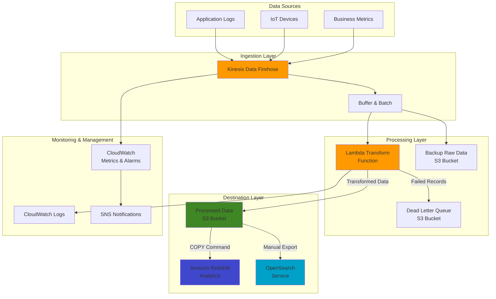

# Transforming Data with Kinesis Data Firehose

## Problem

Your organization collects large volumes of streaming data from various sources, including application logs, IoT devices, and real-time transaction systems. This data needs to be processed, transformed, and delivered to multiple destinations for analytics in near real-time. Traditional batch processing pipelines introduce unacceptable latency, manual ETL processes struggle with scale and velocity, and building custom streaming solutions requires significant engineering effort. You need a reliable, scalable solution that can handle variable data loads, perform transformations during ingestion, and ensure deliverability to multiple analytics destinations while maintaining low operational overhead.

## Solution

Implement a fully managed real-time data processing pipeline using Amazon Kinesis Data Firehose that automatically ingests, transforms, and delivers streaming data to multiple destinations. This solution uses Lambda functions to perform in-flight transformations on the raw data, enabling filtering, enrichment, format conversion, and aggregation before delivery. The pipeline supports multiple destinations including Amazon S3 for long-term storage, Amazon Redshift for analytical queries, and Amazon OpenSearch Service for real-time search and visualization. The entire solution is serverless, automatically scales to match your data throughput, processes records in near real-time (within 60 seconds), and provides comprehensive monitoring and error handling through CloudWatch and dead-letter queues.

## Architecture Diagram



## Prerequisites

1. AWS account with appropriate permissions to create and manage Kinesis Data Firehose, Lambda, S3, IAM, and CloudWatch resources
2. AWS CLI v2 installed and configured with administrator or appropriate permissions
3. Basic understanding of data streaming concepts and JSON data formats
4. Knowledge of Lambda functions and Node.js programming
5. Estimated cost: Kinesis Data Firehose ($0.035 per GB of data ingested), Lambda (minimal for transformations), S3 (storage costs based on volume), CloudWatch (minimal for standard monitoring)

> **Note**: This recipe focuses on transforming JSON log data. The concepts can be applied to other data formats like CSV or Parquet with modifications to the transformation code.

## Preparation

Set up environment variables and create foundational resources:

```bash
# Set environment variables
export AWS_REGION=$(aws configure get region)
export AWS_ACCOUNT_ID=$(aws sts get-caller-identity \
    --query Account --output text)

# Generate unique identifiers for resources
RANDOM_SUFFIX=$(aws secretsmanager get-random-password \
    --exclude-punctuation --exclude-uppercase \
    --password-length 6 --require-each-included-type \
    --output text --query RandomPassword)

export DELIVERY_STREAM_NAME="log-processing-stream-${RANDOM_SUFFIX}"
export RAW_BUCKET="firehose-raw-data-${RANDOM_SUFFIX}"
export PROCESSED_BUCKET="firehose-processed-data-${RANDOM_SUFFIX}"
export ERROR_BUCKET="firehose-error-data-${RANDOM_SUFFIX}"
export LAMBDA_FUNCTION="firehose-transform-${RANDOM_SUFFIX}"

# Create S3 buckets for Firehose destinations
echo "Creating S3 buckets..."

# Create raw data backup bucket
aws s3api create-bucket \
    --bucket ${RAW_BUCKET} \
    --region ${AWS_REGION} \
    $(if [ "${AWS_REGION}" != "us-east-1" ]; then 
        echo "--create-bucket-configuration LocationConstraint=${AWS_REGION}"; 
    fi)

# Create processed data destination bucket
aws s3api create-bucket \
    --bucket ${PROCESSED_BUCKET} \
    --region ${AWS_REGION} \
    $(if [ "${AWS_REGION}" != "us-east-1" ]; then 
        echo "--create-bucket-configuration LocationConstraint=${AWS_REGION}"; 
    fi)

# Create error/failed data bucket (DLQ)
aws s3api create-bucket \
    --bucket ${ERROR_BUCKET} \
    --region ${AWS_REGION} \
    $(if [ "${AWS_REGION}" != "us-east-1" ]; then 
        echo "--create-bucket-configuration LocationConstraint=${AWS_REGION}"; 
    fi)

# Enable bucket encryption for all buckets
for BUCKET in ${RAW_BUCKET} ${PROCESSED_BUCKET} ${ERROR_BUCKET}; do
    aws s3api put-bucket-encryption \
        --bucket ${BUCKET} \
        --server-side-encryption-configuration '{
            "Rules": [
                {
                    "ApplyServerSideEncryptionByDefault": {
                        "SSEAlgorithm": "AES256"
                    }
                }
            ]
        }'
done

echo "✅ S3 buckets created successfully"
```

## Steps

1. **Create a Lambda function for data transformation**:

   Lambda functions serve as the core transformation engine in our Firehose pipeline, enabling real-time processing of streaming data without managing servers. This serverless approach automatically scales to match your data volume, processing records in batches to optimize performance and cost. The Lambda function will filter out unwanted records, enrich data with metadata, and redact sensitive information before delivery to S3.

   ```bash
   # Create IAM role for Lambda
   # This role allows Lambda to process Firehose data and write to S3
   echo "Creating Lambda IAM role..."
   
   cat > lambda-trust-policy.json << EOF
   {
     "Version": "2012-10-17",
     "Statement": [
       {
         "Effect": "Allow",
         "Principal": {
           "Service": "lambda.amazonaws.com"
         },
         "Action": "sts:AssumeRole"
       }
     ]
   }
   EOF
   
   # Create role
   LAMBDA_ROLE_NAME="firehose-lambda-transform-role-${RANDOM_SUFFIX}"
   LAMBDA_ROLE_ARN=$(aws iam create-role \
       --role-name ${LAMBDA_ROLE_NAME} \
       --assume-role-policy-document file://lambda-trust-policy.json \
       --query "Role.Arn" --output text)
   
   # Create policy for Lambda execution with least privilege permissions
   cat > lambda-policy.json << EOF
   {
     "Version": "2012-10-17",
     "Statement": [
       {
         "Effect": "Allow",
         "Action": [
           "logs:CreateLogGroup",
           "logs:CreateLogStream",
           "logs:PutLogEvents"
         ],
         "Resource": "arn:aws:logs:*:*:*"
       },
       {
         "Effect": "Allow",
         "Action": [
           "firehose:DescribeDeliveryStream",
           "firehose:ListDeliveryStreams",
           "firehose:ListTagsForDeliveryStream"
         ],
         "Resource": "*"
       },
       {
         "Effect": "Allow",
         "Action": [
           "s3:AbortMultipartUpload",
           "s3:GetBucketLocation",
           "s3:GetObject",
           "s3:ListBucket",
           "s3:ListBucketMultipartUploads",
           "s3:PutObject"
         ],
         "Resource": [
           "arn:aws:s3:::${ERROR_BUCKET}",
           "arn:aws:s3:::${ERROR_BUCKET}/*",
           "arn:aws:s3:::${PROCESSED_BUCKET}",
           "arn:aws:s3:::${PROCESSED_BUCKET}/*"
         ]
       }
     ]
   }
   EOF
   
   # Attach policy to role
   aws iam put-role-policy \
       --role-name ${LAMBDA_ROLE_NAME} \
       --policy-name firehose-transform-policy \
       --policy-document file://lambda-policy.json
   
   # Wait a moment for IAM role to propagate
   echo "Waiting for IAM role propagation..."
   sleep 10
   
   # Create Lambda function code for data transformation
   echo "Creating Lambda function code..."
   
   mkdir -p lambda_transform
   cat > lambda_transform/index.js << 'EOF'
   /**
    * Kinesis Firehose Data Transformation Lambda
    * - Processes incoming log records
    * - Filters out records that don't match criteria
    * - Transforms and enriches valid records
    * - Returns both processed records and failed records
    */
   
   // Configuration options
   const config = {
       // Minimum log level to process (logs below this level will be filtered out)
       // Values: DEBUG, INFO, WARN, ERROR
       minLogLevel: 'INFO',
       
       // Whether to include timestamp in transformed data
       addProcessingTimestamp: true,
       
       // Fields to remove from logs for privacy/compliance (PII, etc.)
       fieldsToRedact: ['password', 'creditCard', 'ssn']
   };
   
   /**
    * Event structure expected in records:
    * {
    *   "timestamp": "2023-04-10T12:34:56Z",
    *   "level": "INFO|DEBUG|WARN|ERROR",
    *   "service": "service-name",
    *   "message": "Log message",
    *   // Additional fields...
    * }
    */
   exports.handler = async (event, context) => {
       console.log('Received event:', JSON.stringify(event, null, 2));
       
       const output = {
           records: []
       };
       
       // Process each record in the batch
       for (const record of event.records) {
           console.log('Processing record:', record.recordId);
           
           try {
               // Decode and parse the record data
               const buffer = Buffer.from(record.data, 'base64');
               const decodedData = buffer.toString('utf8');
               
               // Try to parse as JSON, fail gracefully if not valid JSON
               let parsedData;
               try {
                   parsedData = JSON.parse(decodedData);
               } catch (e) {
                   console.error('Invalid JSON in record:', decodedData);
                   
                   // Mark record as processing failed
                   output.records.push({
                       recordId: record.recordId,
                       result: 'ProcessingFailed',
                       data: record.data
                   });
                   continue;
               }
               
               // Apply filtering logic - skip records with log level below minimum
               if (parsedData.level && 
                   ['DEBUG', 'INFO', 'WARN', 'ERROR'].indexOf(parsedData.level) < 
                   ['DEBUG', 'INFO', 'WARN', 'ERROR'].indexOf(config.minLogLevel)) {
                   
                   console.log(`Filtering out record with level ${parsedData.level}`);
                   
                   // Mark record as dropped
                   output.records.push({
                       recordId: record.recordId,
                       result: 'Dropped', 
                       data: record.data
                   });
                   continue;
               }
               
               // Apply transformations
               
               // Add processing metadata
               if (config.addProcessingTimestamp) {
                   parsedData.processedAt = new Date().toISOString();
               }
               
               // Add AWS request ID for traceability
               parsedData.lambdaRequestId = context.awsRequestId;
               
               // Redact any sensitive fields
               for (const field of config.fieldsToRedact) {
                   if (parsedData[field]) {
                       parsedData[field] = '********';
                   }
               }
               
               // Convert transformed data back to string and encode as base64
               const transformedData = JSON.stringify(parsedData) + '\n';
               const encodedData = Buffer.from(transformedData).toString('base64');
               
               // Add transformed record to output
               output.records.push({
                   recordId: record.recordId,
                   result: 'Ok',
                   data: encodedData
               });
               
           } catch (error) {
               console.error('Error processing record:', error);
               
               // Mark record as processing failed
               output.records.push({
                   recordId: record.recordId,
                   result: 'ProcessingFailed',
                   data: record.data
               });
           }
       }
       
       console.log('Processing complete, returning', output.records.length, 'records');
       return output;
   };
   EOF
   
   # Package Lambda function
   cd lambda_transform
   zip -r ../lambda_transform.zip .
   cd ..
   
   # Create Lambda function with appropriate timeout and memory settings
   echo "Creating Lambda function..."
   
   LAMBDA_ARN=$(aws lambda create-function \
       --function-name ${LAMBDA_FUNCTION} \
       --runtime nodejs20.x \
       --handler index.handler \
       --role ${LAMBDA_ROLE_ARN} \
       --zip-file fileb://lambda_transform.zip \
       --description "Transform function for Kinesis Data Firehose" \
       --timeout 60 \
       --memory-size 256 \
       --query 'FunctionArn' --output text)
   
   echo "✅ Lambda function created: ${LAMBDA_FUNCTION}"
   ```

   The Lambda function is now deployed with the latest supported Node.js 20.x runtime and ready to process Firehose data. It has appropriate timeout (60 seconds) and memory (256 MB) settings for typical log processing workloads. The function includes comprehensive error handling and logging to track processing status and identify issues with malformed data.

   > **Note**: The Lambda function processes data in batches for optimal performance. Buffer configuration parameters in Firehose control batch size and frequency. Learn more about [Firehose data transformation](https://docs.aws.amazon.com/kinesis/latest/dev/lambda-preprocessing.html).

2. **Create an IAM role for Kinesis Data Firehose**:

   IAM roles provide secure, temporary credentials that allow Firehose to access other AWS services without storing permanent access keys. This role follows the principle of least privilege, granting only the minimum permissions required for Firehose to invoke your Lambda function, write to S3 buckets, and create CloudWatch logs. Proper IAM configuration is critical for both security and functionality of your data pipeline.

   ```bash
   # Create Firehose IAM role
   # This role allows Firehose to read from Kinesis, invoke Lambda, and write to S3
   echo "Creating Firehose IAM role..."
   
   cat > firehose-trust-policy.json << EOF
   {
     "Version": "2012-10-17",
     "Statement": [
       {
         "Effect": "Allow",
         "Principal": {
           "Service": "firehose.amazonaws.com"
         },
         "Action": "sts:AssumeRole"
       }
     ]
   }
   EOF
   
   # Create IAM role for Firehose
   FIREHOSE_ROLE_NAME="kinesis-firehose-role-${RANDOM_SUFFIX}"
   FIREHOSE_ROLE_ARN=$(aws iam create-role \
       --role-name ${FIREHOSE_ROLE_NAME} \
       --assume-role-policy-document file://firehose-trust-policy.json \
       --query "Role.Arn" --output text)
   
   # Create policy document for Firehose permissions
   cat > firehose-policy.json << EOF
   {
     "Version": "2012-10-17",
     "Statement": [
       {
         "Effect": "Allow",
         "Action": [
           "s3:AbortMultipartUpload",
           "s3:GetBucketLocation",
           "s3:GetObject",
           "s3:ListBucket",
           "s3:ListBucketMultipartUploads",
           "s3:PutObject"
         ],
         "Resource": [
           "arn:aws:s3:::${RAW_BUCKET}",
           "arn:aws:s3:::${RAW_BUCKET}/*",
           "arn:aws:s3:::${PROCESSED_BUCKET}",
           "arn:aws:s3:::${PROCESSED_BUCKET}/*",
           "arn:aws:s3:::${ERROR_BUCKET}",
           "arn:aws:s3:::${ERROR_BUCKET}/*"
         ]
       },
       {
         "Effect": "Allow",
         "Action": [
           "lambda:InvokeFunction",
           "lambda:GetFunctionConfiguration"
         ],
         "Resource": "${LAMBDA_ARN}:$LATEST"
       },
       {
         "Effect": "Allow",
         "Action": [
           "logs:PutLogEvents",
           "logs:CreateLogGroup",
           "logs:CreateLogStream"
         ],
         "Resource": "arn:aws:logs:*:*:*"
       },
       {
         "Effect": "Allow",
         "Action": [
           "kinesis:DescribeStream",
           "kinesis:GetShardIterator",
           "kinesis:GetRecords",
           "kinesis:ListShards"
         ],
         "Resource": "arn:aws:kinesis:*:*:stream/*"
       }
     ]
   }
   EOF
   
   # Attach policy to role
   aws iam put-role-policy \
       --role-name ${FIREHOSE_ROLE_NAME} \
       --policy-name firehose-delivery-policy \
       --policy-document file://firehose-policy.json
   
   # Wait a moment for IAM role propagation
   echo "Waiting for IAM role propagation..."
   sleep 10
   
   echo "✅ Firehose IAM role created: ${FIREHOSE_ROLE_NAME}"
   ```

   The IAM role is now configured with the necessary permissions for Firehose operations. This role enables secure cross-service communication and ensures that only authorized operations can be performed. The role will be assumed by the Firehose service when processing data and interacting with your Lambda function and S3 buckets.

3. **Create the Kinesis Data Firehose delivery stream**:

   The delivery stream is the central orchestrator of your data pipeline, coordinating data ingestion, transformation, and delivery. Kinesis Data Firehose provides fully managed, scalable streaming data delivery that can handle fluctuating data volumes automatically. The stream configuration includes buffering settings that balance latency against cost efficiency, compression to reduce storage costs, and error handling to ensure data reliability.

   ```bash
   # Create Firehose delivery stream with S3 destination and Lambda transformation
   # Buffer configuration balances latency vs cost efficiency
   echo "Creating Kinesis Data Firehose delivery stream..."
   
   aws firehose create-delivery-stream \
       --delivery-stream-name ${DELIVERY_STREAM_NAME} \
       --delivery-stream-type DirectPut \
       --extended-s3-destination-configuration '{
           "RoleARN": "'${FIREHOSE_ROLE_ARN}'",
           "BucketARN": "arn:aws:s3:::'${PROCESSED_BUCKET}'",
           "Prefix": "logs/year=!{timestamp:yyyy}/month=!{timestamp:MM}/day=!{timestamp:dd}/",
           "ErrorOutputPrefix": "errors/year=!{timestamp:yyyy}/month=!{timestamp:MM}/day=!{timestamp:dd}/!{firehose:error-output-type}/",
           "BufferingHints": {
               "SizeInMBs": 5,
               "IntervalInSeconds": 60
           },
           "CompressionFormat": "GZIP",
           "S3BackupMode": "Enabled",
           "S3BackupConfiguration": {
               "RoleARN": "'${FIREHOSE_ROLE_ARN}'",
               "BucketARN": "arn:aws:s3:::'${RAW_BUCKET}'",
               "Prefix": "raw/year=!{timestamp:yyyy}/month=!{timestamp:MM}/day=!{timestamp:dd}/",
               "BufferingHints": {
                   "SizeInMBs": 5,
                   "IntervalInSeconds": 60
               },
               "CompressionFormat": "GZIP"
           },
           "ProcessingConfiguration": {
               "Enabled": true,
               "Processors": [
                   {
                       "Type": "Lambda",
                       "Parameters": [
                           {
                               "ParameterName": "LambdaArn",
                               "ParameterValue": "'${LAMBDA_ARN}':$LATEST"
                           },
                           {
                               "ParameterName": "BufferSizeInMBs",
                               "ParameterValue": "3"
                           },
                           {
                               "ParameterName": "BufferIntervalInSeconds",
                               "ParameterValue": "60"
                           }
                       ]
                   }
               ]
           },
           "CloudWatchLoggingOptions": {
               "Enabled": true,
               "LogGroupName": "/aws/kinesisfirehose/'${DELIVERY_STREAM_NAME}'",
               "LogStreamName": "S3Delivery"
           }
       }'
   
   # Wait for delivery stream to become active
   echo "Waiting for delivery stream to become active..."
   
   aws firehose wait delivery-stream-active \
       --delivery-stream-name ${DELIVERY_STREAM_NAME}
   
   echo "✅ Kinesis Data Firehose delivery stream created: ${DELIVERY_STREAM_NAME}"
   ```

   The delivery stream is now active and ready to receive data. It's configured with intelligent partitioning using timestamp-based prefixes, which optimizes query performance in analytics tools like Amazon Athena. The stream includes both transformation processing through your Lambda function and backup of raw data, ensuring you never lose original records even if transformations fail.

   > **Tip**: Buffer size and interval settings significantly impact cost and latency. Smaller values reduce latency but increase the number of S3 objects created. Monitor your workload patterns and adjust accordingly. Read about [buffer hints optimization](https://docs.aws.amazon.com/firehose/latest/dev/basic-deliver.html#s3-buffer-hints).

4. **Create monitoring and alerting for the pipeline**:

   Proactive monitoring is essential for production data pipelines to detect issues before they impact business operations. CloudWatch provides comprehensive metrics for Firehose streams, including delivery success rates, data freshness, and transformation errors. Setting up alarms ensures you're notified immediately when the pipeline experiences issues, enabling rapid response to minimize data loss or processing delays.

   ```bash
   # Create CloudWatch alarm for monitoring Firehose delivery failures
   # This provides proactive monitoring of the data pipeline
   echo "Creating CloudWatch alarm for delivery failures..."
   
   # Create SNS topic for alarm notifications
   SNS_TOPIC_NAME="firehose-alarms-${RANDOM_SUFFIX}"
   SNS_TOPIC_ARN=$(aws sns create-topic \
       --name ${SNS_TOPIC_NAME} \
       --query 'TopicArn' --output text)
   
   # Optional: Subscribe an email to the SNS topic
   read -p "Enter email address for alarm notifications (leave empty to skip): " EMAIL_ADDRESS
   
   if [[ ! -z "$EMAIL_ADDRESS" ]]; then
       aws sns subscribe \
           --topic-arn ${SNS_TOPIC_ARN} \
           --protocol email \
           --notification-endpoint ${EMAIL_ADDRESS}
       
       echo "✅ Subscription created. Check your email to confirm."
   fi
   
   # Create alarm for delivery failures
   aws cloudwatch put-metric-alarm \
       --alarm-name "FirehoseDeliveryFailure-${DELIVERY_STREAM_NAME}" \
       --metric-name "DeliveryToS3.DataFreshness" \
       --namespace "AWS/Firehose" \
       --statistic Maximum \
       --period 300 \
       --evaluation-periods 1 \
       --threshold 900 \
       --comparison-operator GreaterThanThreshold \
       --dimensions Name=DeliveryStreamName,Value=${DELIVERY_STREAM_NAME} \
       --alarm-actions ${SNS_TOPIC_ARN} \
       --ok-actions ${SNS_TOPIC_ARN} \
       --alarm-description "Alarm when Firehose records are not delivered to S3 within 15 minutes"
   
   echo "✅ CloudWatch alarm created"
   ```

   The monitoring infrastructure is now in place to track pipeline health and performance. The alarm monitors data freshness, triggering notifications if records aren't delivered within 15 minutes. This early warning system enables rapid response to delivery issues, helping maintain SLA commitments and data availability for downstream analytics systems.

   > **Warning**: Set up proper monitoring for production workloads. Data freshness alarms help detect delivery issues early. Consider additional alarms for transformation errors and throughput anomalies. Review [Firehose monitoring best practices](https://docs.aws.amazon.com/firehose/latest/dev/monitoring.html).

## Validation & Testing

1. Send test data to the Firehose delivery stream:

   ```bash
   # Create test data generator
   cat > test_data.json << 'EOF'
   {"timestamp": "2025-07-23T10:30:00Z", "level": "INFO", "service": "user-service", "message": "User login successful", "userId": "user123"}
   {"timestamp": "2025-07-23T10:30:01Z", "level": "ERROR", "service": "payment-service", "message": "Payment failed", "userId": "user456", "creditCard": "4111111111111111"}
   {"timestamp": "2025-07-23T10:30:02Z", "level": "DEBUG", "service": "db-service", "message": "Query executed", "duration": "45ms"}
   {"timestamp": "2025-07-23T10:30:03Z", "level": "WARN", "service": "cache-service", "message": "Cache miss detected", "key": "user_profile_789"}
   EOF
   
   # Send test records to Firehose
   echo "Sending test data to Firehose..."
   
   while IFS= read -r line; do
       aws firehose put-record \
           --delivery-stream-name ${DELIVERY_STREAM_NAME} \
           --record Data="$(echo "$line" | base64)"
   done < test_data.json
   
   echo "✅ Test data sent to Firehose"
   ```

   Expected output: You should see successful record deliveries with record IDs.

2. Verify that data is being processed and delivered to S3:

   ```bash
   # Wait for data to be processed and delivered
   echo "Waiting for data to be processed and delivered (3 minutes)..."
   sleep 180
   
   # Check processed data in S3
   echo "Checking processed data in S3..."
   aws s3 ls s3://${PROCESSED_BUCKET}/logs/ --recursive --human-readable
   
   # Check raw backup data in S3
   echo "Checking raw backup data in S3..."
   aws s3 ls s3://${RAW_BUCKET}/raw/ --recursive --human-readable
   ```

   Expected output: You should see GZIP files in both the processed and raw buckets with timestamps that match your test run.

3. Download and inspect transformed data:

   ```bash
   # Find the first processed file
   PROCESSED_FILE=$(aws s3 ls s3://${PROCESSED_BUCKET}/logs/ --recursive | head -n 1 | awk '{print $4}')
   
   # Download and examine the file (it's gzipped)
   if [ -n "$PROCESSED_FILE" ]; then
       echo "Downloading sample processed file..."
       aws s3 cp s3://${PROCESSED_BUCKET}/${PROCESSED_FILE} ./processed_sample.gz
       
       echo "Decompressing and displaying sample data..."
       gunzip -c processed_sample.gz | head -n 5
   else
       echo "No processed files found yet. Wait longer and try again."
   fi
   ```

   Expected output: You should see JSON log records with transformation applied, including the added `processedAt` field and `lambdaRequestId`.

## Cleanup

1. Delete the Kinesis Data Firehose delivery stream:

   ```bash
   # Delete delivery stream
   echo "Deleting Firehose delivery stream..."
   aws firehose delete-delivery-stream \
       --delivery-stream-name ${DELIVERY_STREAM_NAME}
   
   # Wait for delivery stream to be deleted
   echo "Waiting for delivery stream to be deleted..."
   sleep 30
   
   echo "✅ Firehose delivery stream deleted"
   ```

2. Delete the Lambda function and IAM roles:

   ```bash
   # Delete Lambda function
   echo "Deleting Lambda function..."
   aws lambda delete-function \
       --function-name ${LAMBDA_FUNCTION}
   
   # Delete Lambda IAM role and policy
   aws iam delete-role-policy \
       --role-name ${LAMBDA_ROLE_NAME} \
       --policy-name firehose-transform-policy
   
   aws iam delete-role \
       --role-name ${LAMBDA_ROLE_NAME}
   
   # Delete Firehose IAM role and policy
   aws iam delete-role-policy \
       --role-name ${FIREHOSE_ROLE_NAME} \
       --policy-name firehose-delivery-policy
   
   aws iam delete-role \
       --role-name ${FIREHOSE_ROLE_NAME}
   
   echo "✅ Lambda function and IAM roles deleted"
   ```

3. Delete CloudWatch and SNS resources:

   ```bash
   # Delete CloudWatch alarm
   aws cloudwatch delete-alarms \
       --alarm-names "FirehoseDeliveryFailure-${DELIVERY_STREAM_NAME}"
   
   # Delete SNS topic
   aws sns delete-topic \
       --topic-arn ${SNS_TOPIC_ARN}
   
   echo "✅ CloudWatch and SNS resources deleted"
   ```

4. Delete S3 buckets and their contents:

   ```bash
   # Delete S3 buckets and contents
   echo "Deleting S3 buckets and contents..."
   
   for BUCKET in ${RAW_BUCKET} ${PROCESSED_BUCKET} ${ERROR_BUCKET}; do
       # Empty the bucket first
       aws s3 rm s3://${BUCKET} --recursive
       
       # Delete the bucket
       aws s3api delete-bucket \
           --bucket ${BUCKET}
   done
   
   echo "✅ S3 buckets deleted"
   ```

5. Clean up local files:

   ```bash
   # Delete local files
   rm -f lambda-trust-policy.json lambda-policy.json firehose-trust-policy.json
   rm -f firehose-policy.json test_data.json processed_sample.gz
   rm -rf lambda_transform lambda_transform.zip
   
   echo "✅ Local files cleaned up"
   ```

## Discussion

Amazon Kinesis Data Firehose represents a pivotal component in modern real-time data processing architectures that aligns with the AWS Well-Architected Framework principles. As a fully managed service, it eliminates the operational overhead of building and maintaining complex data ingestion pipelines, allowing organizations to focus on extracting value from their data rather than managing infrastructure. The service provides operational excellence through automation, security through encryption and IAM integration, reliability through fault tolerance, performance efficiency through auto-scaling, and cost optimization through serverless pricing.

The transformation capability through Lambda functions enables powerful in-flight processing of data. This pattern allows for data cleaning, filtering, format conversion, enrichment, and aggregation before delivery, which significantly reduces downstream processing requirements. By performing these transformations during ingestion rather than after storage, you ensure that downstream analytical systems receive clean, properly formatted data, improving query performance and reducing storage costs. The [Lambda blueprint for Firehose transformations](https://docs.aws.amazon.com/firehose/latest/dev/data-transformation.html) provides a solid foundation that can be customized to meet specific business needs.

Error handling is a critical aspect of any data processing pipeline, and Firehose addresses this through backup options and dead-letter queues. Raw data is preserved before transformation, allowing for reprocessing if errors occur, while failed records can be routed to a separate error bucket for analysis and debugging. This approach ensures no data loss while maintaining the quality of the delivered dataset. CloudWatch integration provides comprehensive monitoring and alerting capabilities through [Firehose monitoring metrics](https://docs.aws.amazon.com/firehose/latest/dev/monitoring.html), enabling proactive management of the pipeline and rapid response to issues.

> **Tip**: When implementing Firehose transformations with Lambda, carefully tune the buffer size and interval parameters to find the optimal balance between latency and efficiency. Smaller buffers reduce latency but increase Lambda invocations, while larger buffers improve throughput at the cost of freshness.

One important consideration when working with Kinesis Data Firehose is cost optimization following AWS Well-Architected practices. While the service itself is cost-effective, the volume of data processed can significantly impact overall expenses. Implementing proper data filtering early in the pipeline can substantially reduce costs by eliminating unnecessary data before it incurs storage and processing charges. Additionally, compressing data (as demonstrated in this recipe with GZIP) reduces storage costs and improves query performance in downstream systems.

## Challenge

Extend this solution by implementing the following enhancements:

1. Add a dynamic partitioning feature to the Lambda transformation that routes records to different S3 prefixes based on log level or service name, optimizing query performance for analytics workloads.

2. Implement a serverless data quality monitoring solution using AWS Glue DataBrew or Amazon Athena that periodically analyzes the processed data and detects anomalies or schema drift.

3. Create a real-time analytics dashboard using Amazon OpenSearch and Kibana that visualizes log patterns, error rates, and key performance indicators from the processed log data.

4. Add a parallel processing layer that uses Amazon SQS as a buffer for error records, with a separate Lambda function that attempts to remediate and reprocess failed records automatically.

5. Implement cross-region replication of the processed data to a second AWS region for disaster recovery purposes, ensuring data availability even during regional outages.

## Infrastructure Code

### Available Infrastructure as Code:

- [Infrastructure Code Overview](code/README.md) - Detailed description of all infrastructure components
- [AWS CDK (Python)](code/cdk-python/) - AWS CDK Python implementation
- [AWS CDK (TypeScript)](code/cdk-typescript/) - AWS CDK TypeScript implementation
- [CloudFormation](code/cloudformation.yaml) - AWS CloudFormation template
- [Bash CLI Scripts](code/scripts/) - Example bash scripts using AWS CLI commands to deploy infrastructure
- [Terraform](code/terraform/) - Terraform configuration files