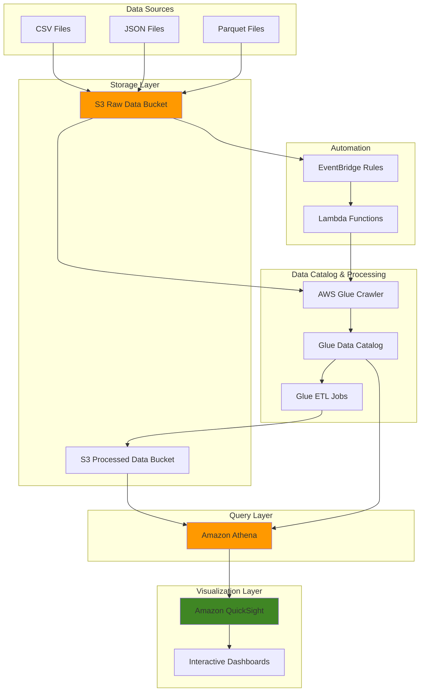

# Data Visualization Pipelines with QuickSight

## Problem

Business analysts and executives need interactive dashboards to visualize large datasets stored in S3, but traditional BI tools struggle with the scale and variety of data lake architectures. Manual data preparation processes create bottlenecks, while static reports fail to provide the real-time insights needed for data-driven decision making. Organizations need automated pipelines that can transform raw S3 data into compelling visualizations without requiring extensive technical expertise.

## Solution

Build an automated data visualization pipeline using S3 for data storage, AWS Glue for data cataloging and ETL, Athena for serverless querying, and QuickSight for interactive dashboards. This serverless architecture automatically processes new data files, maintains data catalogs, and refreshes visualizations, enabling business users to create and share insights without managing infrastructure.

## Architecture Diagram



## Prerequisites

1. AWS account with permissions for S3, Glue, Athena, QuickSight, Lambda, and EventBridge
2. AWS CLI v2 installed and configured (or AWS CloudShell)
3. QuickSight account activated (Standard or Enterprise edition)
4. Basic understanding of SQL and data visualization concepts
5. Sample datasets for testing (CSV, JSON, or Parquet files)
6. Estimated cost: $50-100/month for moderate usage (10GB data, 100 queries/day)

> **Note**: QuickSight pricing varies by edition and user count. Standard edition starts at $9/user/month.

## Preparation

```bash
# Set environment variables
export AWS_REGION=$(aws configure get region)
export AWS_ACCOUNT_ID=$(aws sts get-caller-identity \
    --query Account --output text)

# Generate unique identifiers
RANDOM_SUFFIX=$(aws secretsmanager get-random-password \
    --exclude-punctuation --exclude-uppercase \
    --password-length 6 --require-each-included-type \
    --output text --query RandomPassword)

export PROJECT_NAME="data-viz-pipeline-${RANDOM_SUFFIX}"
export RAW_BUCKET="${PROJECT_NAME}-raw-data"
export PROCESSED_BUCKET="${PROJECT_NAME}-processed-data"
export ATHENA_RESULTS_BUCKET="${PROJECT_NAME}-athena-results"

# Create S3 buckets
aws s3 mb s3://${RAW_BUCKET}
aws s3 mb s3://${PROCESSED_BUCKET}
aws s3 mb s3://${ATHENA_RESULTS_BUCKET}

# Enable versioning on buckets
aws s3api put-bucket-versioning \
    --bucket ${RAW_BUCKET} \
    --versioning-configuration Status=Enabled

aws s3api put-bucket-versioning \
    --bucket ${PROCESSED_BUCKET} \
    --versioning-configuration Status=Enabled

echo "✅ Created S3 buckets for data pipeline"
```

## Steps

1. **Create sample datasets and upload to S3**:

   This step creates realistic business data that simulates what you might encounter in a typical e-commerce analytics scenario. We're generating sales transactions, customer information, and product details that will be used throughout the pipeline to demonstrate real-world data visualization capabilities.

   ```bash
   # Create sample sales data
   mkdir -p sample-data
   cat > sample-data/sales_2024_q1.csv << 'EOF'
   order_id,customer_id,product_category,product_name,quantity,unit_price,order_date,region,sales_rep
   1001,C001,Electronics,Laptop,1,1200.00,2024-01-15,North,John Smith
   1002,C002,Clothing,T-Shirt,3,25.00,2024-01-16,South,Jane Doe
   1003,C003,Electronics,Smartphone,2,800.00,2024-01-17,East,Bob Johnson
   1004,C001,Books,Programming Guide,1,45.00,2024-01-18,North,John Smith
   1005,C004,Electronics,Tablet,1,500.00,2024-01-19,West,Alice Brown
   1006,C005,Clothing,Jeans,2,60.00,2024-01-20,South,Jane Doe
   1007,C002,Electronics,Headphones,1,150.00,2024-01-21,South,Jane Doe
   1008,C006,Books,Data Science Book,2,35.00,2024-01-22,East,Bob Johnson
   1009,C003,Clothing,Jacket,1,120.00,2024-01-23,East,Bob Johnson
   1010,C007,Electronics,Monitor,1,300.00,2024-01-24,West,Alice Brown
   EOF
   
   # Create customer data
   cat > sample-data/customers.csv << 'EOF'
   customer_id,customer_name,email,registration_date,customer_tier,city,state
   C001,Michael Johnson,mjohnson@email.com,2023-06-15,Gold,New York,NY
   C002,Sarah Williams,swilliams@email.com,2023-08-22,Silver,Atlanta,GA
   C003,David Brown,dbrown@email.com,2023-09-10,Gold,Boston,MA
   C004,Lisa Davis,ldavis@email.com,2023-11-05,Bronze,Los Angeles,CA
   C005,Robert Wilson,rwilson@email.com,2023-12-01,Silver,Miami,FL
   C006,Jennifer Garcia,jgarcia@email.com,2024-01-10,Bronze,Chicago,IL
   C007,Christopher Lee,clee@email.com,2024-01-15,Gold,Seattle,WA
   EOF
   
   # Create product catalog
   cat > sample-data/products.json << 'EOF'
   [
     {"product_id": "P001", "product_name": "Laptop", "category": "Electronics", "cost": 800.00, "margin": 0.50},
     {"product_id": "P002", "product_name": "T-Shirt", "category": "Clothing", "cost": 10.00, "margin": 1.50},
     {"product_id": "P003", "product_name": "Smartphone", "category": "Electronics", "cost": 500.00, "margin": 0.60},
     {"product_id": "P004", "product_name": "Programming Guide", "category": "Books", "cost": 20.00, "margin": 1.25},
     {"product_id": "P005", "product_name": "Tablet", "category": "Electronics", "cost": 300.00, "margin": 0.67},
     {"product_id": "P006", "product_name": "Jeans", "category": "Clothing", "cost": 25, "margin": 1.40},
     {"product_id": "P007", "product_name": "Headphones", "category": "Electronics", "cost": 75.00, "margin": 1.00},
     {"product_id": "P008", "product_name": "Data Science Book", "category": "Books", "cost": 15.00, "margin": 1.33},
     {"product_id": "P009", "product_name": "Jacket", "category": "Clothing", "cost": 60.00, "margin": 1},
     {"product_id": "P010", "product_name": "Monitor", "category": "Electronics", "cost":200.00, "margin": 0.50}
   ]
   EOF
   
   # Upload sample data to S3
   aws s3 cp sample-data/ s3://${RAW_BUCKET}/sales-data/ --recursive
   
   echo "✅ Created and uploaded sample datasets"
   ```

   > **Note**: The sample data includes multiple file formats (CSV and JSON) to demonstrate how Glue can handle heterogeneous data sources. Learn more about [using crawlers to populate the Data Catalog](https://docs.aws.amazon.com/glue/latest/dg/add-crawler.html).

2. **Create IAM roles for Glue and Lambda**:

   This step establishes the security foundation for your pipeline by creating IAM roles with least-privilege access. The Glue service role needs permissions to read from your raw data bucket, write to your processed data bucket, and access the Glue Data Catalog for schema management.

   ```bash
   # Create Glue service role
   cat > glue-trust-policy.json << 'EOF'
   {
       "Version": "2012-10-17",
       "Statement": [
           {
               "Effect": "Allow",
               "Principal": {
                   "Service": "glue.amazonaws.com"
               },
               "Action": "sts:AssumeRole"
           }
       ]
   }
   EOF
   
   aws iam create-role \
       --role-name GlueDataVizRole-${RANDOM_SUFFIX} \
       --assume-role-policy-document file://glue-trust-policy.json
   
   # Attach managed policies to Glue role
   aws iam attach-role-policy \
       --role-name GlueDataVizRole-${RANDOM_SUFFIX} \
       --policy-arn arn:aws:iam::aws:policy/service-role/AWSGlueServiceRole
   
   # Create custom policy for S3 access
   cat > glue-s3-policy.json << EOF
   {
       "Version": "2012-10-17",
       "Statement": [
           {
               "Effect": "Allow",
               "Action": [
                   "s3:GetObject",
                   "s3:PutObject",
                   "s3:DeleteObject",
                   "s3:ListBucket"
               ],
               "Resource": [
                   "arn:aws:s3:::${RAW_BUCKET}",
                   "arn:aws:s3:::${RAW_BUCKET}/*",
                   "arn:aws:s3:::${PROCESSED_BUCKET}",
                   "arn:aws:s3:::${PROCESSED_BUCKET}/*"
               ]
           }
       ]
   }
   EOF
   
   aws iam put-role-policy \
       --role-name GlueDataVizRole-${RANDOM_SUFFIX} \
       --policy-name S3AccessPolicy \
       --policy-document file://glue-s3-policy.json
   
   export GLUE_ROLE_ARN="arn:aws:iam::${AWS_ACCOUNT_ID}:role/GlueDataVizRole-${RANDOM_SUFFIX}"
   
   echo "✅ Created IAM roles for Glue"
   ```

3. **Create Glue database and crawler**:

   The Glue Data Catalog acts as a centralized metadata repository for your data lake. The crawler automatically discovers the schema of your data files and creates table definitions that can be queried by Athena and accessed by QuickSight.

   ```bash
   # Create Glue database
   aws glue create-database \
       --database-input Name=${PROJECT_NAME}-database,Description="Database for data visualization pipeline"
   
   # Create Glue crawler for raw data
   aws glue create-crawler \
       --name ${PROJECT_NAME}-raw-crawler \
       --role ${GLUE_ROLE_ARN} \
       --database-name ${PROJECT_NAME}-database \
       --targets S3Targets="[{Path=s3://${RAW_BUCKET}/sales-data/}]" \
       --description "Crawler for raw sales data"
   
   # Run the crawler to discover schema
   aws glue start-crawler --name ${PROJECT_NAME}-raw-crawler
   
   # Wait for crawler to complete
   echo "Waiting for crawler to complete..."
   while true; do
       CRAWLER_STATE=$(aws glue get-crawler \
           --name ${PROJECT_NAME}-raw-crawler \
           --query 'Crawler.State' --output text)
       
       if [ "$CRAWLER_STATE" = "READY" ]; then
           echo "✅ Crawler completed successfully"
           break
       elif [ "$CRAWLER_STATE" = "STOPPING" ] || [ "$CRAWLER_STATE" = "RUNNING" ]; then
           echo "Crawler state: $CRAWLER_STATE, waiting..."
           sleep 30
       else
           echo "Unexpected crawler state: $CRAWLER_STATE"
           break
       fi
   done
   ```

4. **Create Glue ETL job for data transformation**:

   This ETL job performs several critical transformations: it joins sales data with customer information to create enriched datasets, converts data types for proper analysis, calculates derived metrics like total amounts, and creates pre-aggregated tables optimized for dashboard queries. This approach significantly improves query performance in QuickSight by reducing the amount of data that needs to be processed at query time.

   ```bash
   # Create ETL script for data transformation
   mkdir -p glue-scripts
   cat > glue-scripts/sales-etl.py << 'EOF'
   import sys
   from awsglue.transforms import *
   from awsglue.utils import getResolvedOptions
   from pyspark.context import SparkContext
   from awsglue.context import GlueContext
   from awsglue.job import Job
   from pyspark.sql import functions as F
   from pyspark.sql.types import *
   
   args = getResolvedOptions(sys.argv, ['JOB_NAME', 'SOURCE_DATABASE', 'TARGET_BUCKET'])
   
   sc = SparkContext()
   glueContext = GlueContext(sc)
   spark = glueContext.spark_session
   job = Job(glueContext)
   job.init(args['JOB_NAME'], args)
   
   # Read sales data
   sales_df = glueContext.create_dynamic_frame.from_catalog(
       database=args['SOURCE_DATABASE'],
       table_name="sales_2024_q1_csv"
   ).toDF()
   
   # Read customer data
   customers_df = glueContext.create_dynamic_frame.from_catalog(
       database=args['SOURCE_DATABASE'],
       table_name="customers_csv"
   ).toDF()
   
   # Data transformations
   # Convert data types
   sales_df = sales_df.withColumn("quantity", F.col("quantity").cast(IntegerType())) \
                     .withColumn("unit_price", F.col("unit_price").cast(DoubleType())) \
                     .withColumn("order_date", F.to_date(F.col("order_date"), "yyyy-MM-dd"))
   
   # Calculate total amount
   sales_df = sales_df.withColumn("total_amount", F.col("quantity") * F.col("unit_price"))
   
   # Add derived columns
   sales_df = sales_df.withColumn("order_month", F.month(F.col("order_date"))) \
                     .withColumn("order_year", F.year(F.col("order_date"))) \
                     .withColumn("order_quarter", F.quarter(F.col("order_date")))
   
   # Join with customer data
   enriched_sales = sales_df.join(customers_df, "customer_id", "left")
   
   # Create aggregated views
   # Monthly sales summary
   monthly_sales = enriched_sales.groupBy("order_year", "order_month", "region") \
       .agg(
           F.sum("total_amount").alias("total_revenue"),
           F.count("order_id").alias("total_orders"),
           F.avg("total_amount").alias("avg_order_value"),
           F.countDistinct("customer_id").alias("unique_customers")
       )
   
   # Product category performance
   category_performance = enriched_sales.groupBy("product_category", "region") \
       .agg(
           F.sum("total_amount").alias("category_revenue"),
           F.sum("quantity").alias("total_quantity"),
           F.count("order_id").alias("total_orders")
       )
   
   # Customer tier analysis
   customer_analysis = enriched_sales.groupBy("customer_tier", "region") \
       .agg(
           F.sum("total_amount").alias("tier_revenue"),
           F.count("order_id").alias("tier_orders"),
           F.countDistinct("customer_id").alias("tier_customers")
       )
   
   # Write processed data to S3 in Parquet format
   target_bucket = args['TARGET_BUCKET']
   
   # Write enriched sales data
   enriched_sales.write.mode("overwrite").parquet(f"s3://{target_bucket}/enriched-sales/")
   
   # Write aggregated views
   monthly_sales.write.mode("overwrite").parquet(f"s3://{target_bucket}/monthly-sales/")
   category_performance.write.mode("overwrite").parquet(f"s3://{target_bucket}/category-performance/")
   customer_analysis.write.mode("overwrite").parquet(f"s3://{target_bucket}/customer-analysis/")
   
   job.commit()
   EOF
   
   # Upload ETL script to S3
   aws s3 cp glue-scripts/sales-etl.py s3://${PROCESSED_BUCKET}/scripts/
   
   # Create Glue ETL job
   aws glue create-job \
       --name ${PROJECT_NAME}-etl-job \
       --role ${GLUE_ROLE_ARN} \
       --command Name=glueetl,ScriptLocation=s3://${PROCESSED_BUCKET}/scripts/sales-etl.py,PythonVersion=3 \
       --default-arguments '{
           "--SOURCE_DATABASE":"'${PROJECT_NAME}'-database",
           "--TARGET_BUCKET":"'${PROCESSED_BUCKET}'",
           "--enable-metrics":"",
           "--enable-continuous-cloudwatch-log":"true"
       }' \
       --max-retries 1 \
       --timeout 60 \
       --glue-version "4.0"
   
   echo "✅ Created Glue ETL job"
   ```

5. **Run ETL job and create crawler for processed data**:

   This step executes the ETL transformation we configured in the previous step, converting raw data into optimized analytics tables. The job processes the source data through Spark transformations, performs data type conversions, creates derived metrics, and outputs structured Parquet files. Running a second crawler on the processed data ensures that Athena can query the transformed datasets with proper schema definitions.

   ```bash
   # Start the ETL job
   aws glue start-job-run --job-name ${PROJECT_NAME}-etl-job
   
   # Wait for job to complete
   echo "Waiting for ETL job to complete..."
   sleep 60
   
   # Check job status
   JOB_RUN_ID=$(aws glue get-job-runs \
       --job-name ${PROJECT_NAME}-etl-job \
       --query 'JobRuns[0].Id' --output text)
   
   while true; do
       JOB_STATE=$(aws glue get-job-run \
           --job-name ${PROJECT_NAME}-etl-job \
           --run-id ${JOB_RUN_ID} \
           --query 'JobRun.JobRunState' --output text)
       
       if [ "$JOB_STATE" = "SUCCEEDED" ]; then
           echo "✅ ETL job completed successfully"
           break
       elif [ "$JOB_STATE" = "RUNNING" ]; then
           echo "ETL job still running, waiting..."
           sleep 30
       else
           echo "ETL job state: $JOB_STATE"
           break
       fi
   done
   
   # Create crawler for processed data
   aws glue create-crawler \
       --name ${PROJECT_NAME}-processed-crawler \
       --role ${GLUE_ROLE_ARN} \
       --database-name ${PROJECT_NAME}-database \
       --targets S3Targets="[{Path=s3://${PROCESSED_BUCKET}/}]" \
       --description "Crawler for processed data"
   
   # Run processed data crawler
   aws glue start-crawler --name ${PROJECT_NAME}-processed-crawler
   
   echo "✅ Started crawler for processed data"
   ```

   The processed data is now available in optimized Parquet format with proper schema definitions in the Glue Data Catalog. These transformed datasets include enriched sales data with customer information, monthly aggregations, category performance metrics, and customer tier analysis. This multi-layered approach provides both detailed transaction data and pre-aggregated summaries for efficient dashboard queries.

6. **Set up Athena workgroup and query results location**:

   Athena workgroups help manage query execution, control costs, and organize queries by team or project. By creating dedicated workgroups, you can set query result locations, enforce data usage controls, and track query costs more effectively. Learn more about [using workgroups to control query access and costs](https://docs.aws.amazon.com/athena/latest/ug/workgroups-manage-queries-control-costs.html).

   ```bash
   # Create Athena workgroup
   aws athena create-work-group \
       --name ${PROJECT_NAME}-workgroup \
       --description "Workgroup for data visualization pipeline" \
       --configuration ResultConfiguration="{OutputLocation=s3://${ATHENA_RESULTS_BUCKET}/}"
   
   # Create sample queries for testing
   mkdir -p athena-queries
   cat > athena-queries/monthly_revenue.sql << EOF
   SELECT 
       order_year,
       order_month,
       region,
       total_revenue,
       total_orders,
       avg_order_value,
       unique_customers
   FROM "${PROJECT_NAME}-database"."monthly_sales"
   ORDER BY order_year, order_month, region;
   EOF
   
   cat > athena-queries/top_categories.sql << EOF
   SELECT 
       product_category,
       region,
       category_revenue,
       total_quantity,
       total_orders,
       ROUND(category_revenue / total_orders, 2) as avg_order_value
   FROM "${PROJECT_NAME}-database"."category_performance"
   ORDER BY category_revenue DESC;
   EOF
   
   echo "✅ Created Athena workgroup and sample queries"
   ```

7. **Configure QuickSight data source and create dataset**:

   QuickSight serves as the business intelligence layer that connects to your processed data through Athena. This step configures the data source connection and prepares the foundation for creating interactive dashboards. QuickSight can import data directly into its SPICE engine for faster query performance or query data in-place through Athena for real-time analysis. The Athena integration enables QuickSight to leverage the serverless query capabilities while maintaining cost efficiency.

   ```bash
   # Get QuickSight user ARN (requires QuickSight to be set up)
   echo "Setting up QuickSight data source..."
   
   # Note: QuickSight setup requires manual steps in the console
   # The following commands show the programmatic approach
   
   # Create Athena data source in QuickSight
   cat > quicksight-datasource.json << EOF
   {
       "DataSourceId": "${PROJECT_NAME}-athena-source",
       "Name": "Sales Analytics Data Source",
       "Type": "ATHENA",
       "DataSourceParameters": {
           "AthenaParameters": {
               "WorkGroup": "${PROJECT_NAME}-workgroup"
           }
       },
       "Permissions": [
           {
               "Principal": "arn:aws:quicksight:${AWS_REGION}:${AWS_ACCOUNT_ID}:user/default/admin",
               "Actions": [
                   "quicksight:DescribeDataSource",
                   "quicksight:DescribeDataSourcePermissions",
                   "quicksight:PassDataSource",
                   "quicksight:UpdateDataSource",
                   "quicksight:DeleteDataSource",
                   "quicksight:UpdateDataSourcePermissions"
               ]
           }
       ]
   }
   EOF
   
   echo "✅ Prepared QuickSight configuration files"
   echo "📝 Manual step required: Create QuickSight data source using the AWS Console"
   ```

   The QuickSight configuration files are now prepared for creating the data source connection. While this step requires manual completion through the AWS Console, the configuration establishes the foundation for creating interactive dashboards, reports, and analyses. Once connected, business users can build visualizations using drag-and-drop interfaces, apply filters, and share insights across the organization through QuickSight's collaboration features.

8. **Create automation Lambda function for pipeline triggers**:

   This automation layer ensures your pipeline stays current with new data uploads. When new files are added to S3, the Lambda function automatically triggers the crawler to update table schemas and then runs the ETL job to process the new data, maintaining data freshness without manual intervention.

   ```bash
   # Create Lambda function for automation
   mkdir -p lambda-automation
   cat > lambda-automation/index.js << 'EOF'
   const AWS = require('aws-sdk');
   const glue = new AWS.Glue();
   
   const PROJECT_NAME = process.env.PROJECT_NAME;
   
   exports.handler = async (event) => {
       console.log('Received event:', JSON.stringify(event, null, 2));
       
       try {
           // Check if new data was uploaded to raw bucket
           for (const record of event.Records) {
               if (record.eventSource === 'aws:s3' && record.eventName.startsWith('ObjectCreated')) {
                   const bucketName = record.s3.bucket.name;
                   const objectKey = record.s3.object.key;
                   
                   console.log(`New file uploaded: ${objectKey} in bucket ${bucketName}`);
                   
                   // Trigger crawler to update schema
                   await triggerCrawler(`${PROJECT_NAME}-raw-crawler`);
                   
                   // Wait a bit then trigger ETL job
                   setTimeout(async () => {
                       await triggerETLJob(`${PROJECT_NAME}-etl-job`);
                   }, 60000); // Wait 1 minute for crawler to complete
               }
           }
           
           return {
               statusCode: 200,
               body: JSON.stringify('Pipeline triggered successfully')
           };
           
       } catch (error) {
           console.error('Error:', error);
           throw error;
       }
   };
   
   async function triggerCrawler(crawlerName) {
       try {
           const params = { Name: crawlerName };
           await glue.startCrawler(params).promise();
           console.log(`Started crawler: ${crawlerName}`);
       } catch (error) {
           if (error.code === 'CrawlerRunningException') {
               console.log(`Crawler ${crawlerName} is already running`);
           } else {
               throw error;
           }
       }
   }
   
   async function triggerETLJob(jobName) {
       try {
           const params = { JobName: jobName };
           const result = await glue.startJobRun(params).promise();
           console.log(`Started ETL job: ${jobName}, Run ID: ${result.JobRunId}`);
       } catch (error) {
           console.error(`Error starting ETL job ${jobName}:`, error);
           throw error;
       }
   }
   EOF
   
   # Create Lambda deployment package
   cd lambda-automation
   npm init -y
   npm install aws-sdk
   zip -r ../automation-function.zip .
   cd ..
   
   # Create Lambda function
   aws lambda create-function \
       --function-name ${PROJECT_NAME}-automation \
       --runtime nodejs18.x \
       --role arn:aws:iam::${AWS_ACCOUNT_ID}:role/GlueDataVizRole-${RANDOM_SUFFIX} \
       --handler index.handler \
       --zip-file fileb://automation-function.zip \
       --timeout 300 \
       --environment Variables="{PROJECT_NAME=${PROJECT_NAME}}"
   
   # Add S3 trigger permission
   aws lambda add-permission \
       --function-name ${PROJECT_NAME}-automation \
       --principal s3.amazonaws.com \
       --action lambda:InvokeFunction \
       --statement-id s3-trigger-permission \
       --source-arn arn:aws:s3:::${RAW_BUCKET}
   
   # Configure S3 event notification
   cat > s3-notification.json << EOF
   {
       "LambdaConfigurations": [
           {
               "Id": "DataUploadTrigger",
               "LambdaFunctionArn": "arn:aws:lambda:${AWS_REGION}:${AWS_ACCOUNT_ID}:function:${PROJECT_NAME}-automation",
               "Events": ["s3:ObjectCreated:*"],
               "Filter": {
                   "Key": {
                       "FilterRules": [
                           {
                               "Name": "prefix",
                               "Value": "sales-data/"
                           }
                       ]
                   }
               }
           }
       ]
   }
   EOF
   
   aws s3api put-bucket-notification-configuration \
       --bucket ${RAW_BUCKET} \
       --notification-configuration file://s3-notification.json
   
   echo "✅ Created automation Lambda function with S3 triggers"
   ```

## Validation & Testing

1. **Verify Glue catalog tables were created**:

   ```bash
   # List tables in Glue database
   aws glue get-tables \
       --database-name ${PROJECT_NAME}-database \
       --query 'TableList[].Name'
   ```

   Expected output: List of table names including sales data and processed tables

2. **Test Athena queries**:

   ```bash
   # Execute sample query in Athena
   QUERY_ID=$(aws athena start-query-execution \
       --query-string "SELECT COUNT(*) as total_records FROM \"${PROJECT_NAME}-database\".\"enriched_sales\"" \
       --work-group ${PROJECT_NAME}-workgroup \
       --query 'QueryExecutionId' --output text)
   
   # Wait for query to complete
   sleep 10
   
   # Get query results
   aws athena get-query-results \
       --query-execution-id ${QUERY_ID} \
       --query 'ResultSet.Rows[1].Data[0].VarCharValue'
   ```

3. **Test automation by uploading new data**:

   ```bash
   # Create additional test data
   cat > sample-data/sales_2024_q2.csv << 'EOF'
   order_id,customer_id,product_category,product_name,quantity,unit_price,order_date,region,sales_rep
   2001,C001,Electronics,Laptop,2,1200.00,2024-04-15,North,John Smith
   2002,C008,Clothing,Dress,1,85.00,2024-04-16,South,Jane Doe
   2003,C009,Electronics,Camera,1,6500,2024-04-17,East,Bob Johnson
   EOF
   
   # Upload new data to trigger automation
   aws s3 cp sample-data/sales_2024_q2.csv s3://${RAW_BUCKET}/sales-data/
   
   echo "✅ Uploaded new data to test automation"
   ```

4. **Verify processed data in S3**:

   ```bash
   # List processed data files
   aws s3 ls s3://${PROCESSED_BUCKET}/ --recursive
   ```

   Expected output: Parquet files in various folders (enriched-sales, monthly-sales, etc.)

## Cleanup

1. **Delete QuickSight resources**:

   ```bash
   # Note: QuickSight resources need to be deleted through the console
   echo "📝 Manual step: Delete QuickSight dashboards and data sources through the console"
   ```

2. **Delete Glue resources**:

   ```bash
   # Delete Glue job
   aws glue delete-job --job-name ${PROJECT_NAME}-etl-job
   
   # Delete crawlers
   aws glue delete-crawler --name ${PROJECT_NAME}-raw-crawler
   aws glue delete-crawler --name ${PROJECT_NAME}-processed-crawler
   
   # Delete database (this will also delete tables)
   aws glue delete-database --name ${PROJECT_NAME}-database
   
   echo "✅ Deleted Glue resources"
   ```

3. **Delete Lambda and Athena resources**:

   ```bash
   # Delete Lambda function
   aws lambda delete-function --function-name ${PROJECT_NAME}-automation
   
   # Delete Athena workgroup
   aws athena delete-work-group \
       --work-group ${PROJECT_NAME}-workgroup \
       --recursive-delete-option
   
   echo "✅ Deleted Lambda and Athena resources"
   ```

4. **Delete S3 buckets and IAM roles**:

   ```bash
   # Empty and delete S3 buckets
   aws s3 rm s3://${RAW_BUCKET} --recursive
   aws s3 rb s3://${RAW_BUCKET}
   
   aws s3rm s3://${PROCESSED_BUCKET} --recursive
   aws s3 rb s3://${PROCESSED_BUCKET}
   
   aws s3 rm s3://${ATHENA_RESULTS_BUCKET} --recursive
   aws s3 rb s3://${ATHENA_RESULTS_BUCKET}
   
   # Delete IAM role and policies
   aws iam delete-role-policy \
       --role-name GlueDataVizRole-${RANDOM_SUFFIX} \
       --policy-name S3AccessPolicy
   
   aws iam detach-role-policy \
       --role-name GlueDataVizRole-${RANDOM_SUFFIX} \
       --policy-arn arn:aws:iam::aws:policy/service-role/AWSGlueServiceRole
   
   aws iam delete-role --role-name GlueDataVizRole-${RANDOM_SUFFIX}
   
   # Clean up local files
   rm -rf sample-data glue-scripts lambda-automation athena-queries *.json *.zip
   
   echo "✅ Cleanup completed"
   ```

## Discussion

This data visualization pipeline demonstrates how to build a comprehensive, serverless analytics solution that automatically transforms raw data into interactive business insights. The architecture leverages AWS's managed services to eliminate infrastructure management while providing enterprise-scale data processing capabilities.

The solution addresses several key challenges in modern data analytics. First, it handles schema evolution through Glue crawlers that automatically detect changes in data structure and update the data catalog accordingly. Second, it provides automated data transformation through Glue ETL jobs that can process various data formats and create optimized datasets for analysis. Third, it enables self-service analytics through QuickSight's intuitive interface, allowing business users to create visualizations without technical expertise.

The ETL pipeline design follows best practices for data lake architectures by separating raw and processed data, using columnar storage formats like Parquet for better query performance, and creating multiple aggregated views optimized for different analytical use cases. The automation layer ensures that new data is automatically processed and made available for analysis, reducing manual intervention and ensuring data freshness.

QuickSight's integration with Athena provides a powerful combination for ad-hoc analysis and scheduled reporting. The serverless query engine scales automatically based on demand, while QuickSight's SPICE (Super-fast, Parallel, In-memory Calculation Engine) can cache frequently accessed data for improved dashboard performance. This architecture supports both real-time operational dashboards and historical trend analysis.

> **Tip**: Use QuickSight's ML Insights feature to automatically detect anomalies and trends in your data, providing additional analytical value without manual configuration. Learn more about [making data-driven decisions with ML in QuickSight](https://docs.aws.amazon.com/quicksight/latest/user/making-data-driven-decisions-with-ml-in-quicksight.html).

## Challenge

Extend this solution by implementing these enhancements:

1. **Add real-time streaming data** by integrating Kinesis Data Streams and Kinesis Data Firehose to continuously ingest and process live data updates, enabling near real-time dashboard updates.

2. **Implement data quality monitoring** using AWS Deequ integrated with Glue ETL jobs to automatically validate data quality, detect anomalies, and send alerts when data quality thresholds are breached.

3. **Create advanced ML analytics** by integrating SageMaker to build predictive models on historical data, then use QuickSight's forecasting capabilities to display predictions alongside historical trends.

4. **Build multi-tenant dashboards** by implementing row-level security in QuickSight based on user attributes, allowing different business units to see only their relevant data while sharing the same underlying datasets.

5. **Add cost optimization** by implementing S3 Intelligent-Tiering for automatic data lifecycle management and using Athena's partition projection to reduce query costs on large time-series datasets.

## Infrastructure Code

*Infrastructure code will be generated after recipe approval.*