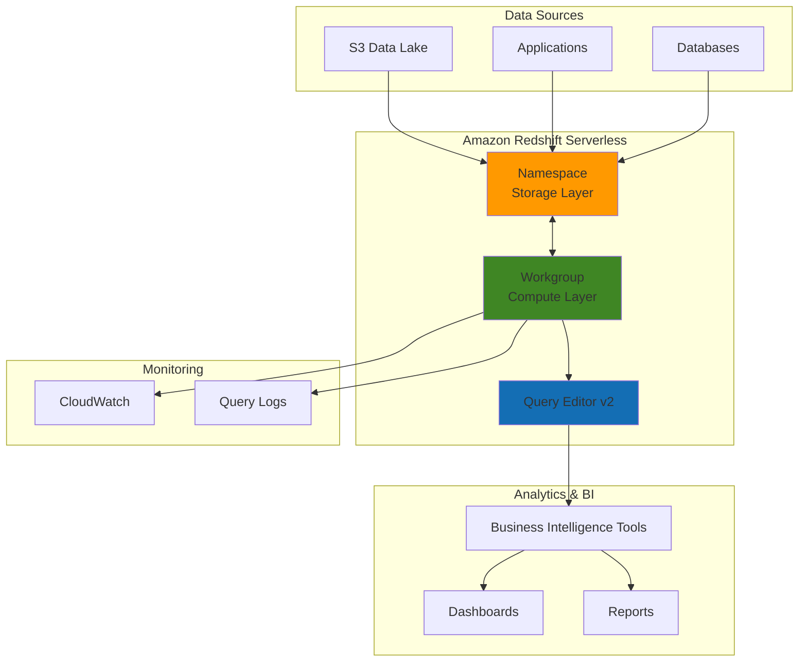

# Data Warehousing Solutions with Redshift

## Problem

Organizations struggle with analyzing large volumes of structured data stored across multiple systems, facing challenges with slow query performance, expensive hardware maintenance, and complex scaling requirements. Traditional on-premises data warehouses require significant upfront infrastructure investment and ongoing operational overhead, making it difficult to derive timely business insights from growing datasets.

## Solution

Amazon Redshift Serverless provides a fully managed, petabyte-scale data warehouse solution that automatically scales compute capacity based on workload demands. This serverless approach eliminates infrastructure management overhead while delivering fast query performance through columnar storage and massively parallel processing (MPP) architecture, enabling organizations to focus on data analytics rather than hardware provisioning.

## Architecture Diagram



## Prerequisites

1. AWS account with permissions to create Redshift, S3, and IAM resources
2. AWS CLI v2 installed and configured (or AWS CloudShell)
3. Basic understanding of SQL and data warehousing concepts
4. Familiarity with columnar databases and analytics workloads
5. Estimated cost: $0.50-$2.00 per hour for compute resources (only when active)

> **Note**: Amazon Redshift Serverless charges only for compute resources when actively processing queries. Unlike provisioned clusters, there are no charges during idle periods. See [Amazon Redshift pricing](https://aws.amazon.com/redshift/pricing/) for detailed cost information.

## Preparation

```bash
# Set environment variables
export AWS_REGION=$(aws configure get region)
export AWS_ACCOUNT_ID=$(aws sts get-caller-identity \
    --query Account --output text)

# Generate unique identifiers for resources
RANDOM_SUFFIX=$(aws secretsmanager get-random-password \
    --exclude-punctuation --exclude-uppercase \
    --password-length 6 --require-each-included-type \
    --output text --query RandomPassword)

export NAMESPACE_NAME="data-warehouse-ns-${RANDOM_SUFFIX}"
export WORKGROUP_NAME="data-warehouse-wg-${RANDOM_SUFFIX}"
export S3_BUCKET_NAME="redshift-data-${RANDOM_SUFFIX}"
export IAM_ROLE_NAME="RedshiftServerlessRole-${RANDOM_SUFFIX}"

# Create S3 bucket for sample data
aws s3 mb s3://${S3_BUCKET_NAME} --region ${AWS_REGION}

echo "✅ Environment prepared with bucket: ${S3_BUCKET_NAME}"
```

## Steps

1. **Create IAM Role for Redshift Serverless**:

   Amazon Redshift Serverless requires an IAM role with specific permissions to access S3 data and perform administrative tasks. This role enables the serverless compute resources to securely load data from S3 buckets and interact with other AWS services without exposing long-term credentials.

   ```bash
   # Create trust policy for Redshift service
   cat > redshift-trust-policy.json << EOF
   {
     "Version": "2012-10-17",
     "Statement": [
       {
         "Effect": "Allow",
         "Principal": {
           "Service": "redshift.amazonaws.com"
         },
         "Action": "sts:AssumeRole"
       }
     ]
   }
   EOF
   
   # Create IAM role
   aws iam create-role \
       --role-name ${IAM_ROLE_NAME} \
       --assume-role-policy-document file://redshift-trust-policy.json
   
   # Attach managed policy for S3 access
   aws iam attach-role-policy \
       --role-name ${IAM_ROLE_NAME} \
       --policy-arn arn:aws:iam::aws:policy/AmazonS3ReadOnlyAccess
   
   export IAM_ROLE_ARN="arn:aws:iam::${AWS_ACCOUNT_ID}:role/${IAM_ROLE_NAME}"
   
   echo "✅ IAM role created: ${IAM_ROLE_ARN}"
   ```

   The IAM role is now configured with the necessary permissions to enable Redshift Serverless to access S3 data securely. This follows the principle of least privilege by granting only the minimum permissions required for data loading operations.

2. **Create Redshift Serverless Namespace**:

   A namespace in Amazon Redshift Serverless represents the storage layer that groups together database objects, schemas, users, and security configurations. This logical container provides isolation for your data warehouse resources and enables fine-grained access control.

   ```bash
   # Create namespace for data warehouse
   aws redshift-serverless create-namespace \
       --namespace-name ${NAMESPACE_NAME} \
       --admin-username awsuser \
       --admin-user-password TempPassword123! \
       --default-iam-role-arn ${IAM_ROLE_ARN} \
       --db-name sampledb
   
   echo "✅ Namespace created: ${NAMESPACE_NAME}"
   ```

   The namespace establishes the foundational storage layer with a default database and admin user. This separation of storage and compute allows for independent scaling and management of resources based on specific workload requirements.

3. **Create Redshift Serverless Workgroup**:

   A workgroup represents the compute layer that provides the processing power for running queries against your data. Amazon Redshift Serverless automatically scales the compute capacity measured in Redshift Processing Units (RPUs) based on query complexity and concurrency.

   ```bash
   # Create workgroup for compute resources
   aws redshift-serverless create-workgroup \
       --workgroup-name ${WORKGROUP_NAME} \
       --namespace-name ${NAMESPACE_NAME} \
       --base-capacity 128 \
       --publicly-accessible
   
   echo "✅ Workgroup created: ${WORKGROUP_NAME}"
   ```

   The workgroup is now provisioned with a base capacity of 128 RPUs, which provides sufficient compute power for moderate analytical workloads. The serverless architecture will automatically scale this capacity up or down based on actual query demands.

4. **Wait for Resources to Become Available**:

   Amazon Redshift Serverless resources require several minutes to initialize and become fully operational. During this time, the service provisions the underlying infrastructure and establishes network connectivity.

   ```bash
   # Wait for namespace to become available
   echo "Waiting for namespace to become available..."
   aws redshift-serverless wait namespace-available \
       --namespace-name ${NAMESPACE_NAME}
   
   # Wait for workgroup to become available
   echo "Waiting for workgroup to become available..."
   aws redshift-serverless wait workgroup-available \
       --workgroup-name ${WORKGROUP_NAME}
   
   echo "✅ All resources are now available and ready for use"
   ```

5. **Upload Sample Data to S3**:

   Sample data enables testing and validation of your data warehouse functionality. We'll create representative datasets that demonstrate common analytical patterns including sales transactions, customer information, and product catalogs.

   ```bash
   # Create sample sales data
   cat > sales_data.csv << EOF
   order_id,customer_id,product_id,quantity,price,order_date
   1001,501,2001,2,29.99,2024-01-15
   1002,502,2002,1,49.99,2024-01-15
   1003,503,2001,3,29.99,2024-01-16
   1004,501,2003,1,79.99,2024-01-16
   1005,504,2002,2,49.99,2024-01-17
   EOF
   
   # Create sample customer data
   cat > customer_data.csv << EOF
   customer_id,first_name,last_name,email,city,state
   501,John,Doe,john.doe@email.com,Seattle,WA
   502,Jane,Smith,jane.smith@email.com,Portland,OR
   503,Mike,Johnson,mike.johnson@email.com,San Francisco,CA
   504,Sarah,Wilson,sarah.wilson@email.com,Los Angeles,CA
   EOF
   
   # Upload data files to S3
   aws s3 cp sales_data.csv s3://${S3_BUCKET_NAME}/data/
   aws s3 cp customer_data.csv s3://${S3_BUCKET_NAME}/data/
   
   echo "✅ Sample data uploaded to S3 bucket"
   ```

   The sample datasets are now stored in S3 and ready for loading into your Redshift data warehouse. These CSV files represent common business entities and will demonstrate the ETL process for structured data ingestion.

6. **Connect to Redshift and Create Tables**:

   Table creation in Amazon Redshift requires careful consideration of distribution keys, sort keys, and compression encoding to optimize query performance. The columnar storage format excels at analytical queries that aggregate data across many rows.

   ```bash
   # Get workgroup endpoint
   export WORKGROUP_ENDPOINT=$(aws redshift-serverless get-workgroup \
       --workgroup-name ${WORKGROUP_NAME} \
       --query 'workgroup.endpoint.address' \
       --output text)
   
   # Create SQL script for table creation
   cat > create_tables.sql << EOF
   CREATE TABLE sales (
       order_id INTEGER,
       customer_id INTEGER,
       product_id INTEGER,
       quantity INTEGER,
       price DECIMAL(10,2),
       order_date DATE
   );
   
   CREATE TABLE customers (
       customer_id INTEGER,
       first_name VARCHAR(50),
       last_name VARCHAR(50),
       email VARCHAR(100),
       city VARCHAR(50),
       state VARCHAR(2)
   );
   EOF
   
   echo "✅ Tables schema prepared for data warehouse"
   ```

   The table schemas are optimized for analytical queries with appropriate data types and constraints. This foundation enables efficient data loading and supports complex analytical operations across large datasets.

> **Tip**: For production workloads, consider using distribution keys and sort keys to optimize query performance. Distribution keys determine how data is distributed across compute nodes, while sort keys improve query performance by physically ordering data. See [Amazon Redshift table design best practices](https://docs.aws.amazon.com/redshift/latest/dg/c_designing_tables_best_practices.html) for detailed guidance.

7. **Load Data Using COPY Command**:

   The COPY command leverages Amazon Redshift's massively parallel processing (MPP) architecture to load data efficiently from S3. This approach is significantly faster than INSERT statements and is the recommended method for loading large datasets into Redshift.

   ```bash
   # Create data loading script
   cat > load_data.sql << EOF
   COPY sales FROM 's3://${S3_BUCKET_NAME}/data/sales_data.csv'
   IAM_ROLE '${IAM_ROLE_ARN}'
   CSV
   IGNOREHEADER 1;
   
   COPY customers FROM 's3://${S3_BUCKET_NAME}/data/customer_data.csv'
   IAM_ROLE '${IAM_ROLE_ARN}'
   CSV
   IGNOREHEADER 1;
   EOF
   
   echo "✅ Data loading commands prepared"
   echo "📋 Execute the SQL scripts using Query Editor v2 in the AWS Console"
   echo "   - Navigate to Amazon Redshift console"
   echo "   - Select Query Editor v2"
   echo "   - Connect to workgroup: ${WORKGROUP_NAME}"
   echo "   - Run create_tables.sql followed by load_data.sql"
   ```

   The COPY commands are configured to use IAM role authentication and handle CSV format with headers. This secure approach eliminates the need for hardcoded credentials while providing efficient parallel data loading across multiple compute nodes.

8. **Create Sample Analytical Queries**:

   Analytical queries demonstrate the power of Amazon Redshift for business intelligence and reporting. These queries showcase common analytical patterns including aggregations, joins, and time-based analysis that drive business insights.

   ```bash
   # Create analytical queries
   cat > analytical_queries.sql << EOF
   -- Sales summary by customer
   SELECT 
       c.first_name,
       c.last_name,
       c.city,
       COUNT(s.order_id) as total_orders,
       SUM(s.quantity * s.price) as total_revenue
   FROM sales s
   JOIN customers c ON s.customer_id = c.customer_id
   GROUP BY c.customer_id, c.first_name, c.last_name, c.city
   ORDER BY total_revenue DESC;
   
   -- Daily sales trend
   SELECT 
       order_date,
       COUNT(order_id) as daily_orders,
       SUM(quantity * price) as daily_revenue
   FROM sales
   GROUP BY order_date
   ORDER BY order_date;
   
   -- Product performance analysis
   SELECT 
       product_id,
       SUM(quantity) as total_quantity_sold,
       SUM(quantity * price) as total_revenue,
       AVG(price) as average_price
   FROM sales
   GROUP BY product_id
   ORDER BY total_revenue DESC;
   EOF
   
   echo "✅ Analytical queries prepared for business intelligence"
   ```

   These queries demonstrate how Amazon Redshift excels at complex analytical operations, utilizing its columnar storage and parallel processing capabilities to deliver fast results across large datasets.

## Validation & Testing

1. **Verify Redshift Serverless Resources**:

   ```bash
   # Check namespace status
   aws redshift-serverless get-namespace \
       --namespace-name ${NAMESPACE_NAME} \
       --query 'namespace.status' \
       --output text
   
   # Check workgroup status
   aws redshift-serverless get-workgroup \
       --workgroup-name ${WORKGROUP_NAME} \
       --query 'workgroup.status' \
       --output text
   ```

   Expected output: Both commands should return "AVAILABLE"

2. **Test Data Loading and Query Performance**:

   ```bash
   # Verify S3 data files exist
   aws s3 ls s3://${S3_BUCKET_NAME}/data/
   
   # Check workgroup endpoint connectivity
   echo "Workgroup endpoint: ${WORKGROUP_ENDPOINT}"
   echo "Database: sampledb"
   echo "Username: awsuser"
   ```

   Expected output: S3 files should be listed, and endpoint details should be displayed

3. **Validate Query Execution**:

   Use the AWS Console Query Editor v2 to execute the prepared SQL scripts and verify:
   - Tables are created successfully
   - Data is loaded without errors
   - Analytical queries return expected results
   - Query performance meets requirements

> **Warning**: Ensure your workgroup is configured with appropriate network access controls. For production environments, consider using private subnets and VPC endpoints to secure data access. See [Amazon Redshift security best practices](https://docs.aws.amazon.com/redshift/latest/mgmt/security-best-practices.html) for comprehensive security guidance.

## Cleanup

1. **Delete Redshift Serverless Resources**:

   ```bash
   # Delete workgroup
   aws redshift-serverless delete-workgroup \
       --workgroup-name ${WORKGROUP_NAME}
   
   echo "✅ Workgroup deletion initiated"
   ```

2. **Delete Namespace**:

   ```bash
   # Delete namespace
   aws redshift-serverless delete-namespace \
       --namespace-name ${NAMESPACE_NAME}
   
   echo "✅ Namespace deletion initiated"
   ```

3. **Remove IAM Role and S3 Resources**:

   ```bash
   # Detach policy from role
   aws iam detach-role-policy \
       --role-name ${IAM_ROLE_NAME} \
       --policy-arn arn:aws:iam::aws:policy/AmazonS3ReadOnlyAccess
   
   # Delete IAM role
   aws iam delete-role --role-name ${IAM_ROLE_NAME}
   
   # Delete S3 bucket and contents
   aws s3 rb s3://${S3_BUCKET_NAME} --force
   
   echo "✅ All resources cleaned up successfully"
   ```

4. **Remove Local Files**:

   ```bash
   # Clean up local files
   rm -f redshift-trust-policy.json create_tables.sql load_data.sql analytical_queries.sql
   rm -f sales_data.csv customer_data.csv
   
   echo "✅ Local files cleaned up"
   ```

## Discussion

Amazon Redshift Serverless revolutionizes data warehousing by eliminating the traditional constraints of cluster management and capacity planning. The serverless architecture automatically scales compute resources based on actual workload demands, charging only for resources consumed during query execution. This pay-per-use model makes advanced analytics accessible to organizations of all sizes without requiring significant upfront infrastructure investments.

The separation of storage (namespace) and compute (workgroup) enables independent scaling and optimization of each layer. Namespaces provide persistent storage for databases, schemas, and user configurations, while workgroups deliver elastic compute capacity that can scale from minimal workloads to thousands of concurrent queries. This architecture supports both predictable batch processing and unpredictable ad-hoc analytical workloads without performance degradation.

Amazon Redshift's columnar storage format and massively parallel processing (MPP) architecture deliver exceptional performance for analytical queries. The COPY command leverages this parallel architecture to load data efficiently from S3, DynamoDB, or other data sources. Query performance is further enhanced through automatic query optimization, result caching, and intelligent workload management that prioritizes critical business queries.

Security and compliance are built into the Redshift Serverless architecture through integration with AWS Identity and Access Management (IAM), encryption at rest and in transit, and VPC networking controls. The service supports fine-grained access control, audit logging, and compliance certifications required for enterprise data warehousing environments. For additional security guidance, refer to the [Amazon Redshift security documentation](https://docs.aws.amazon.com/redshift/latest/mgmt/security-overview.html).

## Challenge

Extend this data warehousing solution by implementing these enhancements:

1. **Implement Data Lake Integration**: Connect your Redshift data warehouse to a broader data lake architecture using Amazon Redshift Spectrum to query data directly from S3 without loading it into tables.

2. **Add Real-time Data Streaming**: Integrate Amazon Kinesis Data Streams or Amazon MSK to enable real-time data ingestion and processing for near real-time analytics capabilities.

3. **Build Automated ETL Pipelines**: Create AWS Glue jobs or Step Functions workflows to automate data extraction, transformation, and loading processes from multiple source systems.

4. **Implement Advanced Security**: Configure VPC endpoints, implement column-level security, and set up comprehensive audit logging using AWS CloudTrail and Amazon Redshift audit logs.

5. **Create Business Intelligence Dashboards**: Connect Amazon QuickSight or other BI tools to create interactive dashboards and reports that provide self-service analytics capabilities for business users.

## Infrastructure Code

*Infrastructure code will be generated after recipe approval.*