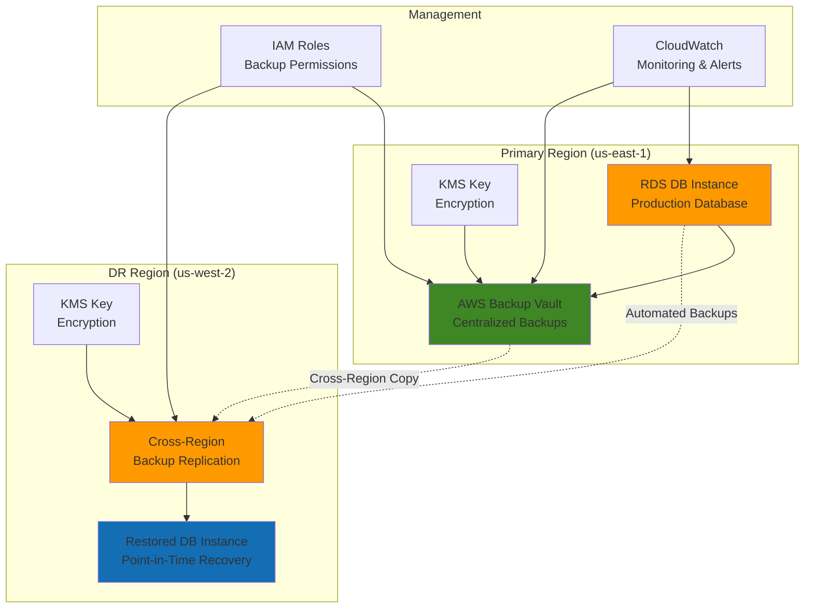

# Database Backup and Recovery with RDS

## Problem

Enterprise databases contain mission-critical data that must be protected from hardware failures, human errors, and disaster scenarios. Without proper backup and recovery strategies, organizations face potential data loss, extended downtime, and compliance violations. Traditional backup approaches often lack granular recovery options, cross-region protection, and automated management capabilities, leaving businesses vulnerable to significant financial and operational impact during data loss incidents.

## Solution

This recipe implements a comprehensive backup and recovery strategy using Amazon RDS automated backups, cross-region replication, and point-in-time recovery capabilities. The solution combines AWS Backup for centralized management with RDS native backup features to ensure data protection, regulatory compliance, and rapid recovery options across multiple failure scenarios.

## Architecture Diagram



## Prerequisites

1. AWS account with appropriate permissions for RDS, AWS Backup, and KMS services
2. AWS CLI v2 installed and configured (or AWS CloudShell)
3. Basic understanding of relational databases and backup concepts
4. Familiarity with AWS IAM roles and policies
5. Estimated cost: $50-100/month for test resources (production costs vary significantly)

> **Note**: This recipe uses MySQL RDS instance for demonstration, but concepts apply to all supported RDS engines.

## Preparation

```bash
# Set environment variables
export AWS_REGION=$(aws configure get region)
export AWS_ACCOUNT_ID=$(aws sts get-caller-identity \
    --query Account --output text)

# Generate unique identifiers for resources
RANDOM_SUFFIX=$(aws secretsmanager get-random-password \
    --exclude-punctuation --exclude-uppercase \
    --password-length 6 --require-each-included-type \
    --output text --query RandomPassword)

export DB_INSTANCE_ID="production-db-${RANDOM_SUFFIX}"
export BACKUP_VAULT_NAME="rds-backup-vault-${RANDOM_SUFFIX}"
export BACKUP_ROLE_NAME="rds-backup-role-${RANDOM_SUFFIX}"
export KMS_KEY_ALIAS="alias/rds-backup-key-${RANDOM_SUFFIX}"
export DR_REGION="us-west-2"

# Create VPC and security group for RDS (if needed)
export VPC_ID=$(aws ec2 describe-vpcs \
    --filters "Name=isDefault,Values=true" \
    --query 'Vpcs[0].VpcId' --output text)

export SUBNET_GROUP_NAME="default"

echo "Using VPC: $VPC_ID"
echo "Database Instance ID: $DB_INSTANCE_ID"
echo "Backup Vault: $BACKUP_VAULT_NAME"
```

## Steps

1. **Create KMS encryption key for backup encryption**:

   Data encryption at rest is a fundamental security requirement for enterprise databases and their backups. AWS KMS provides [centralized key management](https://docs.aws.amazon.com/whitepapers/latest/kms-best-practices/data-at-rest-encryption-with-amazon-rds.html) with hardware security module (HSM) backing, ensuring that your database snapshots and backups are encrypted using industry-standard AES-256 encryption. This step establishes the encryption foundation that protects your data throughout the entire backup lifecycle.

   ```bash
   # Create KMS key for backup encryption
   KMS_KEY_ID=$(aws kms create-key \
       --description "RDS backup encryption key" \
       --key-usage ENCRYPT_DECRYPT \
       --key-spec SYMMETRIC_DEFAULT \
       --query 'KeyMetadata.KeyId' --output text)
   
   # Create alias for the key
   aws kms create-alias \
       --alias-name "$KMS_KEY_ALIAS" \
       --target-key-id "$KMS_KEY_ID"
   
   echo "✅ Created KMS key: $KMS_KEY_ID with alias: $KMS_KEY_ALIAS"
   ```

   The KMS key is now created and aliased for easy reference. This customer-managed key provides you with full control over access permissions, key rotation, and usage policies, ensuring your backup encryption meets compliance requirements while maintaining operational flexibility for disaster recovery scenarios.

2. **Create IAM role for AWS Backup service**:

   AWS Backup requires [IAM service roles](https://docs.aws.amazon.com/aws-backup/latest/devguide/iam-service-roles.html) to perform backup and restore operations on your behalf. This delegation model ensures that backup operations execute with precisely the permissions needed, without requiring your applications or users to have direct access to backup resources. The service role implements the principle of least privilege, granting only the minimum permissions necessary for backup and restore operations.

   ```bash
   # Create trust policy for AWS Backup service
   cat > backup-trust-policy.json << 'EOF'
   {
       "Version": "2012-10-17",
       "Statement": [
           {
               "Effect": "Allow",
               "Principal": {
                   "Service": "backup.amazonaws.com"
               },
               "Action": "sts:AssumeRole"
           }
       ]
   }
   EOF
   
   # Create IAM role for backup operations
   aws iam create-role \
       --role-name "$BACKUP_ROLE_NAME" \
       --assume-role-policy-document file://backup-trust-policy.json
   
   # Attach AWS managed backup policy
   aws iam attach-role-policy \
       --role-name "$BACKUP_ROLE_NAME" \
       --policy-arn "arn:aws:iam::aws:policy/service-role/AWSBackupServiceRolePolicyForBackup"
   
   # Attach restore policy
   aws iam attach-role-policy \
       --role-name "$BACKUP_ROLE_NAME" \
       --policy-arn "arn:aws:iam::aws:policy/service-role/AWSBackupServiceRolePolicyForRestores"
   
   export BACKUP_ROLE_ARN="arn:aws:iam::${AWS_ACCOUNT_ID}:role/${BACKUP_ROLE_NAME}"
   
   echo "✅ Created IAM role: $BACKUP_ROLE_NAME"
   ```

   The IAM role is now configured with the necessary permissions to perform backup and restore operations. This security foundation enables AWS Backup to access your RDS instances, create snapshots, and manage cross-region replication while maintaining strict access controls and audit trails for compliance purposes.

   > **Note**: Follow the [principle of least privilege](https://docs.aws.amazon.com/IAM/latest/UserGuide/best-practices.html#grant-least-privilege) when configuring IAM permissions for production environments.

3. **Create RDS database instance with automated backups enabled**:

   Amazon RDS provides [automated backup capabilities](https://docs.aws.amazon.com/AmazonRDS/latest/UserGuide/USER_WorkingWithAutomatedBackups.html) that create point-in-time snapshots and transaction log backups, enabling recovery to any second within the retention period. This creates a comprehensive backup strategy that protects against both catastrophic failures and human errors. The automated backup window is strategically scheduled during low-traffic periods to minimize performance impact on production workloads.

   ```bash
   # Create RDS instance with backup configuration
   aws rds create-db-instance \
       --db-instance-identifier "$DB_INSTANCE_ID" \
       --db-instance-class db.t3.micro \
       --engine mysql \
       --master-username admin \
       --master-user-password "TempPassword123!" \
       --allocated-storage 20 \
       --storage-type gp2 \
       --backup-retention-period 7 \
       --preferred-backup-window "03:00-04:00" \
       --preferred-maintenance-window "sun:04:00-sun:05:00" \
       --storage-encrypted \
       --kms-key-id "$KMS_KEY_ID" \
       --copy-tags-to-snapshot \
       --delete-automated-backups
   
   # Wait for the database to become available
   echo "⏳ Waiting for RDS instance to become available..."
   aws rds wait db-instance-available \
       --db-instance-identifier "$DB_INSTANCE_ID"
   
   echo "✅ RDS instance created: $DB_INSTANCE_ID"
   ```

   The RDS instance is now operational with automated backups enabled. The 7-day retention period provides week-long recovery capabilities, while encryption at rest using your KMS key ensures data protection. The backup and maintenance windows are scheduled during low-traffic periods to minimize operational impact while maintaining data protection requirements.

4. **Create AWS Backup vault with encryption**:

   AWS Backup vaults provide centralized storage for backup recovery points across multiple AWS services. Vaults serve as logical containers that organize backups, enforce encryption policies, and enable cross-region replication for disaster recovery. By encrypting the vault with your KMS key, you ensure that all backup data remains protected at rest with your organization's encryption policies and access controls.

   ```bash
   # Create backup vault
   aws backup create-backup-vault \
       --backup-vault-name "$BACKUP_VAULT_NAME" \
       --encryption-key-arn "arn:aws:kms:${AWS_REGION}:${AWS_ACCOUNT_ID}:key/${KMS_KEY_ID}"
   
   echo "✅ Created backup vault: $BACKUP_VAULT_NAME"
   ```

   The backup vault is now ready to store encrypted recovery points. This centralized approach enables consistent backup policies, unified monitoring, and simplified disaster recovery management across your entire database infrastructure, while maintaining the highest levels of security and compliance.

5. **Configure backup plan for automated RDS backups**:

   Backup plans define the schedule, retention, and lifecycle policies for your automated backups. This multi-tiered approach implements both daily and weekly backup schedules with intelligent storage lifecycle management, automatically transitioning older backups to cold storage for cost optimization. The configuration includes cross-region copy actions that establish disaster recovery capabilities while maintaining compliance with data retention requirements.

   ```bash
   # Create backup plan configuration
   cat > backup-plan.json << EOF
   {
       "BackupPlanName": "rds-backup-plan-${RANDOM_SUFFIX}",
       "Rules": [
           {
               "RuleName": "DailyBackups",
               "TargetBackupVaultName": "${BACKUP_VAULT_NAME}",
               "ScheduleExpression": "cron(0 5 ? * * *)",
               "StartWindowMinutes": 60,
               "CompletionWindowMinutes": 120,
               "Lifecycle": {
                   "DeleteAfterDays": 30,
                   "MoveToColdStorageAfterDays": 7
               },
               "RecoveryPointTags": {
                   "Environment": "Production",
                   "BackupType": "Automated"
               },
               "CopyActions": [
                   {
                       "DestinationBackupVaultArn": "arn:aws:backup:${DR_REGION}:${AWS_ACCOUNT_ID}:backup-vault:${BACKUP_VAULT_NAME}-dr",
                       "Lifecycle": {
                           "DeleteAfterDays": 30
                       }
                   }
               ]
           },
           {
               "RuleName": "WeeklyBackups",
               "TargetBackupVaultName": "${BACKUP_VAULT_NAME}",
               "ScheduleExpression": "cron(0 3 ? * SUN *)",
               "StartWindowMinutes": 60,
               "CompletionWindowMinutes": 180,
               "Lifecycle": {
                   "DeleteAfterDays": 90,
                   "MoveToColdStorageAfterDays": 14
               },
               "RecoveryPointTags": {
                   "Environment": "Production",
                   "BackupType": "Weekly"
               }
           }
       ]
   }
   EOF
   
   # Create backup plan
   BACKUP_PLAN_ID=$(aws backup create-backup-plan \
       --backup-plan file://backup-plan.json \
       --query 'BackupPlanId' --output text)
   
   echo "✅ Created backup plan: $BACKUP_PLAN_ID"
   ```

   The backup plan is now configured with automated daily and weekly schedules that optimize both recovery capabilities and storage costs. Daily backups provide granular recovery options for recent changes, while weekly backups offer longer-term retention for compliance requirements. The intelligent lifecycle management reduces storage costs by automatically transitioning older backups to cold storage.

6. **Create DR region backup vault and enable cross-region replication**:

   Cross-region backup replication is essential for disaster recovery, protecting your data against regional failures and ensuring business continuity. By replicating backups to a geographically separated region, you establish a robust disaster recovery capability that meets enterprise requirements for data protection and compliance. The [cross-region automated backup replication](https://docs.aws.amazon.com/AmazonRDS/latest/UserGuide/AutomatedBackups.Replicating.Enable.html) feature provides seamless data protection across AWS regions.

   ```bash
   # Create KMS key in DR region
   DR_KMS_KEY_ID=$(aws kms create-key \
       --region "$DR_REGION" \
       --description "RDS backup encryption key - DR region" \
       --key-usage ENCRYPT_DECRYPT \
       --key-spec SYMMETRIC_DEFAULT \
       --query 'KeyMetadata.KeyId' --output text)
   
   # Create backup vault in DR region
   aws backup create-backup-vault \
       --region "$DR_REGION" \
       --backup-vault-name "${BACKUP_VAULT_NAME}-dr" \
       --encryption-key-arn "arn:aws:kms:${DR_REGION}:${AWS_ACCOUNT_ID}:key/${DR_KMS_KEY_ID}"
   
   # Enable cross-region automated backup replication
   aws rds start-db-instance-automated-backups-replication \
       --region "$DR_REGION" \
       --source-db-instance-arn "arn:aws:rds:${AWS_REGION}:${AWS_ACCOUNT_ID}:db:${DB_INSTANCE_ID}" \
       --backup-retention-period 14 \
       --kms-key-id "$DR_KMS_KEY_ID"
   
   echo "✅ Created DR backup vault and enabled cross-region replication"
   ```

   Cross-region replication is now active, creating encrypted backup copies in your disaster recovery region. This geographic separation ensures that your data remains protected even during regional outages, enabling rapid recovery operations from the DR region. The extended 14-day retention period in the DR region provides additional recovery flexibility during extended incident response scenarios.

7. **Create backup selection to assign RDS to backup plan**:

   Backup selections define which AWS resources are included in your backup plan using tag-based filtering. This approach enables dynamic, scalable backup management where resources are automatically included or excluded based on their tags, supporting infrastructure as code practices and automated resource lifecycle management. The tag-based selection ensures consistent backup coverage as your environment scales.

   ```bash
   # Create backup selection configuration
   cat > backup-selection.json << EOF
   {
       "SelectionName": "rds-backup-selection-${RANDOM_SUFFIX}",
       "IamRoleArn": "${BACKUP_ROLE_ARN}",
       "Resources": [
           "arn:aws:rds:${AWS_REGION}:${AWS_ACCOUNT_ID}:db:${DB_INSTANCE_ID}"
       ],
       "Conditions": {
           "StringEquals": {
               "aws:ResourceTag/Environment": ["Production"]
           }
       }
   }
   EOF
   
   # Add resource tag to RDS instance
   aws rds add-tags-to-resource \
       --resource-name "arn:aws:rds:${AWS_REGION}:${AWS_ACCOUNT_ID}:db:${DB_INSTANCE_ID}" \
       --tags Key=Environment,Value=Production
   
   # Create backup selection
   aws backup create-backup-selection \
       --backup-plan-id "$BACKUP_PLAN_ID" \
       --backup-selection file://backup-selection.json
   
   echo "✅ Created backup selection for RDS instance"
   ```

   The backup selection is now configured and linked to your backup plan. The RDS instance will automatically be included in scheduled backups based on the "Production" tag, enabling consistent backup coverage across your production database infrastructure. This tag-based approach simplifies backup management and ensures that new production databases are automatically protected.

8. **Create manual backup for immediate protection**:

   Manual backups provide immediate protection before automated schedules take effect, and serve as critical recovery points before major database changes or maintenance activities. Creating both an RDS snapshot and an AWS Backup job ensures comprehensive protection through multiple recovery methods. Manual backups are particularly valuable for change management processes and serve as known-good restore points during system upgrades or configuration changes.

   ```bash
   # Create manual RDS snapshot
   MANUAL_SNAPSHOT_ID="${DB_INSTANCE_ID}-manual-snapshot-$(date +%Y%m%d-%H%M%S)"
   
   aws rds create-db-snapshot \
       --db-instance-identifier "$DB_INSTANCE_ID" \
       --db-snapshot-identifier "$MANUAL_SNAPSHOT_ID"
   
   # Start on-demand backup job through AWS Backup
   aws backup start-backup-job \
       --backup-vault-name "$BACKUP_VAULT_NAME" \
       --resource-arn "arn:aws:rds:${AWS_REGION}:${AWS_ACCOUNT_ID}:db:${DB_INSTANCE_ID}" \
       --iam-role-arn "$BACKUP_ROLE_ARN" \
       --recovery-point-tags Environment=Production,BackupType=OnDemand
   
   echo "✅ Created manual backup: $MANUAL_SNAPSHOT_ID"
   ```

   The manual backup is now available for immediate recovery needs. This on-demand backup provides a baseline recovery point that complements your automated backup schedule, ensuring you have a known-good state to restore from during incident response or maintenance activities. The backup is encrypted and stored in your backup vault with appropriate tagging for easy identification.

9. **Set up monitoring and alerting for backup operations**:

   Proactive monitoring of backup operations is essential for maintaining data protection SLAs and ensuring rapid incident response. CloudWatch alarms provide real-time notifications when backup failures occur, enabling immediate investigation and remediation. This monitoring approach ensures that backup failures are detected and addressed quickly, maintaining the integrity of your disaster recovery capabilities and compliance requirements.

   ```bash
   # Create SNS topic for backup notifications
   SNS_TOPIC_ARN=$(aws sns create-topic \
       --name "rds-backup-notifications-${RANDOM_SUFFIX}" \
       --query 'TopicArn' --output text)
   
   # Create CloudWatch alarm for failed backup jobs
   aws cloudwatch put-metric-alarm \
       --alarm-name "RDS-Backup-Failures-${RANDOM_SUFFIX}" \
       --alarm-description "Alert on RDS backup failures" \
       --metric-name "NumberOfBackupJobsFailed" \
       --namespace "AWS/Backup" \
       --statistic Sum \
       --period 300 \
       --threshold 1 \
       --comparison-operator GreaterThanOrEqualToThreshold \
       --evaluation-periods 1 \
       --alarm-actions "$SNS_TOPIC_ARN"
   
   echo "✅ Created monitoring and alerts"
   ```

   Monitoring and alerting are now configured to detect backup failures immediately. The CloudWatch alarm monitors the AWS Backup service metrics and triggers notifications through SNS when failures occur. This proactive approach ensures that backup issues are identified and resolved quickly, maintaining the reliability of your data protection strategy and meeting operational SLAs.

10. **Configure backup vault access policy for cross-account access (optional)**:

    Cross-account backup vault access policies enable secure sharing of backup resources across organizational boundaries, supporting multi-account disaster recovery scenarios and centralized backup management. This capability is particularly valuable for enterprise environments with separate AWS accounts for production, staging, and disaster recovery, allowing controlled access to backup resources while maintaining security boundaries and compliance requirements.

    ```bash
    # Create backup vault access policy for cross-account sharing
    cat > vault-access-policy.json << EOF
    {
        "Version": "2012-10-17",
        "Statement": [
            {
                "Sid": "AllowCrossAccountAccess",
                "Effect": "Allow",
                "Principal": {
                    "AWS": "arn:aws:iam::${AWS_ACCOUNT_ID}:root"
                },
                "Action": [
                    "backup:DescribeBackupVault",
                    "backup:DescribeRecoveryPoint",
                    "backup:ListRecoveryPointsByBackupVault"
                ],
                "Resource": "*"
            }
        ]
    }
    EOF
    
    # Apply access policy to backup vault
    aws backup put-backup-vault-access-policy \
        --backup-vault-name "$BACKUP_VAULT_NAME" \
        --policy file://vault-access-policy.json
    
    echo "✅ Configured backup vault access policy"
    ```

    The backup vault access policy is now configured to support cross-account access scenarios. This enables secure sharing of backup resources across organizational boundaries while maintaining proper access controls and audit trails. The policy can be customized to grant specific permissions to different AWS accounts based on your organization's disaster recovery and compliance requirements.

## Validation & Testing

1. **Verify RDS instance backup configuration**:

   ```bash
   # Check RDS instance backup settings
   aws rds describe-db-instances \
       --db-instance-identifier "$DB_INSTANCE_ID" \
       --query 'DBInstances[0].[BackupRetentionPeriod,PreferredBackupWindow,StorageEncrypted]' \
       --output table
   ```

   Expected output: Shows 7-day retention, backup window, and encryption enabled.

2. **Test point-in-time recovery capability**:

   ```bash
   # Get the latest restorable time
   LATEST_RESTORE_TIME=$(aws rds describe-db-instances \
       --db-instance-identifier "$DB_INSTANCE_ID" \
       --query 'DBInstances[0].LatestRestorableTime' \
       --output text)
   
   echo "Latest restorable time: $LATEST_RESTORE_TIME"
   
   # Perform point-in-time restore test
   RESTORE_DB_ID="${DB_INSTANCE_ID}-pitr-test"
   
   aws rds restore-db-instance-to-point-in-time \
       --source-db-instance-identifier "$DB_INSTANCE_ID" \
       --target-db-instance-identifier "$RESTORE_DB_ID" \
       --restore-time "$LATEST_RESTORE_TIME" \
       --db-instance-class db.t3.micro
   
   echo "✅ Point-in-time recovery test initiated"
   ```

3. **Verify cross-region backup replication**:

   ```bash
   # Check cross-region automated backups
   aws rds describe-db-instance-automated-backups \
       --region "$DR_REGION" \
       --query 'DBInstanceAutomatedBackups[?DBInstanceIdentifier==`'$DB_INSTANCE_ID'`].[Status,Region]' \
       --output table
   ```

   Expected output: Shows "available" status and DR region.

4. **Test backup vault and recovery points**:

   ```bash
   # List recovery points in backup vault
   aws backup list-recovery-points-by-backup-vault \
       --backup-vault-name "$BACKUP_VAULT_NAME" \
       --query 'RecoveryPoints[*].[RecoveryPointArn,Status,CreationDate]' \
       --output table
   ```

5. **Validate backup encryption**:

   ```bash
   # Verify backup encryption settings
   aws backup describe-backup-vault \
       --backup-vault-name "$BACKUP_VAULT_NAME" \
       --query '[BackupVaultName,EncryptionKeyArn,NumberOfRecoveryPoints]' \
       --output table
   ```

## Cleanup

1. **Delete test restored database instance**:

   ```bash
   # Delete the point-in-time recovery test instance
   aws rds delete-db-instance \
       --db-instance-identifier "$RESTORE_DB_ID" \
       --skip-final-snapshot \
       --delete-automated-backups 2>/dev/null || echo "Instance may not exist"
   
   echo "✅ Deleted test restore instance"
   ```

2. **Stop cross-region backup replication**:

   ```bash
   # Stop automated backup replication
   aws rds stop-db-instance-automated-backups-replication \
       --region "$DR_REGION" \
       --source-db-instance-arn "arn:aws:rds:${AWS_REGION}:${AWS_ACCOUNT_ID}:db:${DB_INSTANCE_ID}"
   
   echo "✅ Stopped cross-region backup replication"
   ```

3. **Delete backup selections and plans**:

   ```bash
   # Delete backup selection (get selection ID first)
   SELECTION_ID=$(aws backup list-backup-selections \
       --backup-plan-id "$BACKUP_PLAN_ID" \
       --query 'BackupSelectionsList[0].SelectionId' \
       --output text)
   
   aws backup delete-backup-selection \
       --backup-plan-id "$BACKUP_PLAN_ID" \
       --selection-id "$SELECTION_ID"
   
   # Delete backup plan
   aws backup delete-backup-plan \
       --backup-plan-id "$BACKUP_PLAN_ID"
   
   echo "✅ Deleted backup selections and plans"
   ```

4. **Delete backup vaults and recovery points**:

   ```bash
   # Delete recovery points from primary vault
   aws backup list-recovery-points-by-backup-vault \
       --backup-vault-name "$BACKUP_VAULT_NAME" \
       --query 'RecoveryPoints[*].RecoveryPointArn' \
       --output text | \
   while read arn; do
       if [ ! -z "$arn" ]; then
           aws backup delete-recovery-point \
               --backup-vault-name "$BACKUP_VAULT_NAME" \
               --recovery-point-arn "$arn" 2>/dev/null || true
       fi
   done
   
   # Delete backup vaults
   aws backup delete-backup-vault \
       --backup-vault-name "$BACKUP_VAULT_NAME"
   
   aws backup delete-backup-vault \
       --region "$DR_REGION" \
       --backup-vault-name "${BACKUP_VAULT_NAME}-dr"
   
   echo "✅ Deleted backup vaults"
   ```

5. **Delete RDS instance and snapshots**:

   ```bash
   # Delete manual snapshot
   aws rds delete-db-snapshot \
       --db-snapshot-identifier "$MANUAL_SNAPSHOT_ID"
   
   # Delete RDS instance
   aws rds delete-db-instance \
       --db-instance-identifier "$DB_INSTANCE_ID" \
       --skip-final-snapshot \
       --delete-automated-backups
   
   echo "✅ Deleted RDS instance and snapshots"
   ```

6. **Remove IAM role and policies**:

   ```bash
   # Detach policies from role
   aws iam detach-role-policy \
       --role-name "$BACKUP_ROLE_NAME" \
       --policy-arn "arn:aws:iam::aws:policy/service-role/AWSBackupServiceRolePolicyForBackup"
   
   aws iam detach-role-policy \
       --role-name "$BACKUP_ROLE_NAME" \
       --policy-arn "arn:aws:iam::aws:policy/service-role/AWSBackupServiceRolePolicyForRestores"
   
   # Delete IAM role
   aws iam delete-role \
       --role-name "$BACKUP_ROLE_NAME"
   
   echo "✅ Deleted IAM role and policies"
   ```

7. **Delete KMS keys and CloudWatch resources**:

   ```bash
   # Schedule KMS key deletion
   aws kms schedule-key-deletion \
       --key-id "$KMS_KEY_ID" \
       --pending-window-in-days 7
   
   aws kms schedule-key-deletion \
       --region "$DR_REGION" \
       --key-id "$DR_KMS_KEY_ID" \
       --pending-window-in-days 7
   
   # Delete CloudWatch alarm
   aws cloudwatch delete-alarms \
       --alarm-names "RDS-Backup-Failures-${RANDOM_SUFFIX}"
   
   # Delete SNS topic
   aws sns delete-topic --topic-arn "$SNS_TOPIC_ARN"
   
   # Clean up temporary files
   rm -f backup-plan.json backup-selection.json \
         vault-access-policy.json backup-trust-policy.json
   
   echo "✅ Cleaned up KMS keys, monitoring, and temporary files"
   ```

## Discussion

This comprehensive backup and recovery strategy addresses multiple layers of data protection for enterprise databases. The combination of RDS automated backups with AWS Backup provides both granular point-in-time recovery and centralized management capabilities. Cross-region replication ensures business continuity during regional outages, while encryption at rest and in transit maintains data security throughout the backup lifecycle.

The solution implements a multi-tiered retention strategy with daily and weekly backup schedules, automatically moving older backups to cold storage for cost optimization. Point-in-time recovery capabilities enable restoration to any second within the retention period, providing precise recovery options for human error scenarios. The backup vault access policies facilitate secure cross-account sharing for disaster recovery scenarios in multi-account environments.

Key architectural decisions include using separate KMS keys for each region to maintain encryption boundary isolation, implementing lifecycle policies to automatically manage backup retention costs, and establishing comprehensive monitoring to ensure backup operation success. The solution follows [AWS Well-Architected principles](https://docs.aws.amazon.com/whitepapers/latest/disaster-recovery-workloads-on-aws/disaster-recovery-options-in-the-cloud.html) for reliability, security, and cost optimization while providing enterprise-grade data protection capabilities.

For production deployments, consider implementing backup testing automation, extended retention policies for compliance requirements, and integration with corporate incident response procedures. Regular disaster recovery exercises should validate the complete recovery process end-to-end, following [AWS backup and recovery best practices](https://docs.aws.amazon.com/prescriptive-guidance/latest/backup-recovery/rds.html).

> **Tip**: Use AWS Backup's backup plan templates to quickly implement industry-standard backup schedules for different compliance requirements like SOC, PCI-DSS, or HIPAA.

## Challenge

Extend this backup and recovery solution by implementing these enhancements:

1. **Automated backup testing**: Create Lambda functions that periodically restore backups to test instances and validate data integrity automatically
2. **Cross-account disaster recovery**: Implement backup sharing with a separate AWS account for enhanced disaster recovery isolation
3. **Compliance reporting**: Build automated reports using AWS Config and CloudTrail to demonstrate backup compliance for audit requirements
4. **Multi-engine support**: Extend the solution to support PostgreSQL, Oracle, and SQL Server with engine-specific backup optimizations
5. **Cost optimization automation**: Implement intelligent backup lifecycle management based on data access patterns and business criticality

## Infrastructure Code

*Infrastructure code will be generated after recipe approval.*