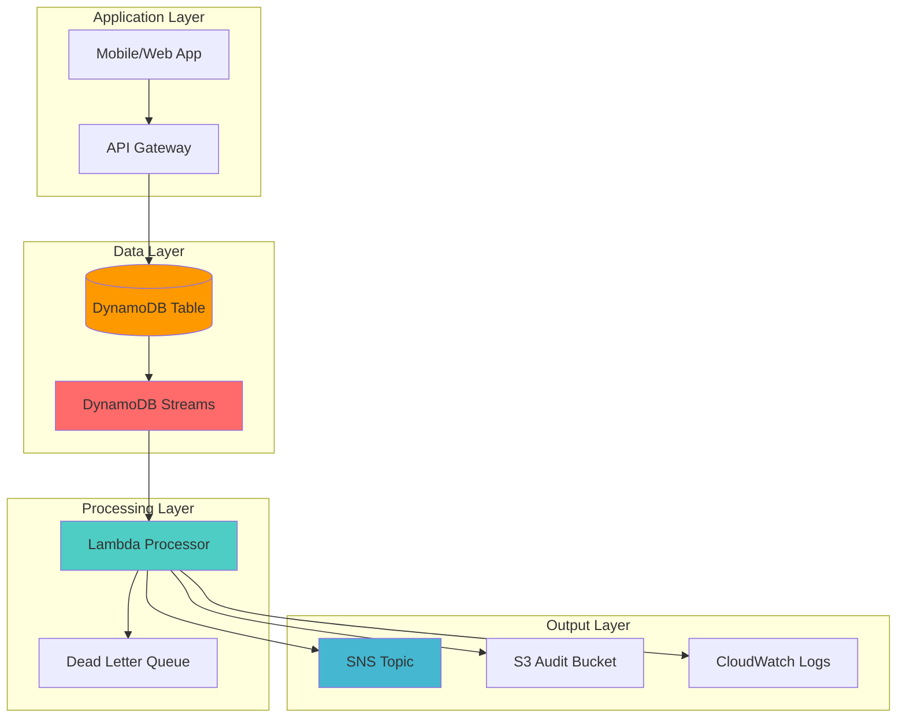

# Capturing Database Changes with DynamoDB Streams

## Problem

Modern applications require real-time data processing capabilities to deliver immediate insights and notifications when database records change. Traditional polling-based approaches introduce latency and consume unnecessary resources, while businesses need to react instantly to data modifications for fraud detection, inventory management, and user experience optimization. Without proper change stream processing, organizations miss critical business events and cannot maintain data consistency across distributed systems.

## Solution

Build a real-time database change stream processing system using Amazon DynamoDB Streams and AWS Lambda. DynamoDB Streams captures item-level modifications in near real-time, while Lambda functions process these changes automatically, enabling event-driven architectures that respond immediately to data changes. This solution provides scalable, serverless change data capture with built-in retry mechanisms and dead letter queue support.

## Architecture Diagram



## Prerequisites

1. AWS account with appropriate permissions for DynamoDB, Lambda, IAM, SNS, and S3
2. AWS CLI v2 installed and configured (or AWS CloudShell)
3. Understanding of event-driven architecture and stream processing concepts
4. Basic knowledge of JSON and serverless computing patterns
5. Estimated cost: $5-15 per month for moderate usage (DynamoDB, Lambda, SNS, S3)

> **Note**: DynamoDB Streams are included at no additional charge, but Lambda invocations and other services incur standard pricing. See the [AWS DynamoDB Streams documentation](https://docs.aws.amazon.com/amazondynamodb/latest/developerguide/Streams.html) for detailed information about stream configuration options.

## Preparation

```bash
# Set environment variables
export AWS_REGION=$(aws configure get region)
export AWS_ACCOUNT_ID=$(aws sts get-caller-identity \
    --query Account --output text)

# Generate unique identifiers for resources
RANDOM_SUFFIX=$(aws secretsmanager get-random-password \
    --exclude-punctuation --exclude-uppercase \
    --password-length 6 --require-each-included-type \
    --output text --query RandomPassword)

export TABLE_NAME="UserActivities-${RANDOM_SUFFIX}"
export FUNCTION_NAME="stream-processor-${RANDOM_SUFFIX}"
export ROLE_NAME="dynamodb-stream-role-${RANDOM_SUFFIX}"
export SNS_TOPIC_NAME="activity-notifications-${RANDOM_SUFFIX}"
export S3_BUCKET_NAME="activity-audit-${RANDOM_SUFFIX}"

# Create S3 bucket for audit logs
aws s3 mb s3://${S3_BUCKET_NAME} \
    --region ${AWS_REGION}

# Create SNS topic for notifications
SNS_TOPIC_ARN=$(aws sns create-topic \
    --name ${SNS_TOPIC_NAME} \
    --query TopicArn --output text)

echo "✅ Preparation complete. S3 bucket: ${S3_BUCKET_NAME}, SNS Topic: ${SNS_TOPIC_ARN}"
```

## Steps

1. **Create DynamoDB Table with Streams Enabled**:

   DynamoDB Streams capture data modification events in DynamoDB tables in near real-time. When enabled, the stream records appear within seconds of the actual data modification. This foundational component provides the event source for our real-time processing architecture, enabling applications to respond immediately to data changes without polling.

   ```bash
   # Create table with NEW_AND_OLD_IMAGES stream view
   aws dynamodb create-table \
       --table-name ${TABLE_NAME} \
       --attribute-definitions \
           AttributeName=UserId,AttributeType=S \
           AttributeName=ActivityId,AttributeType=S \
       --key-schema \
           AttributeName=UserId,KeyType=HASH \
           AttributeName=ActivityId,KeyType=RANGE \
       --provisioned-throughput \
           ReadCapacityUnits=5,WriteCapacityUnits=5 \
       --stream-specification \
           StreamEnabled=true,StreamViewType=NEW_AND_OLD_IMAGES \
       --tags Key=Environment,Value=Production \
            Key=Project,Value=StreamProcessing
   
   # Wait for table to be active
   aws dynamodb wait table-exists --table-name ${TABLE_NAME}
   
   # Get stream ARN
   STREAM_ARN=$(aws dynamodb describe-table \
       --table-name ${TABLE_NAME} \
       --query Table.LatestStreamArn --output text)
   
   echo "✅ DynamoDB table created with stream: ${STREAM_ARN}"
   ```

   The table is now configured with DynamoDB Streams using the NEW_AND_OLD_IMAGES view type, which captures both the before and after images of modified items. This comprehensive data capture enables detailed audit trails and sophisticated change processing logic in downstream applications.

2. **Create IAM Role for Lambda Stream Processing**:

   IAM roles enable secure, temporary credential delegation following the principle of least privilege. For DynamoDB Streams processing, Lambda requires specific permissions to read from streams, write to CloudWatch Logs, and access the downstream services. This security foundation ensures our processing function operates with only the necessary permissions.

   ```bash
   # Create trust policy for Lambda
   cat > lambda-trust-policy.json << 'EOF'
   {
       "Version": "2012-10-17",
       "Statement": [
           {
               "Effect": "Allow",
               "Principal": {
                   "Service": "lambda.amazonaws.com"
               },
               "Action": "sts:AssumeRole"
           }
       ]
   }
   EOF
   
   # Create IAM role
   aws iam create-role \
       --role-name ${ROLE_NAME} \
       --assume-role-policy-document file://lambda-trust-policy.json
   
   # Attach AWS managed policy for DynamoDB stream execution
   aws iam attach-role-policy \
       --role-name ${ROLE_NAME} \
       --policy-arn arn:aws:iam::aws:policy/service-role/AWSLambdaDynamoDBExecutionRole
   
   echo "✅ IAM role created: ${ROLE_NAME}"
   ```

   The IAM role is now established with the AWS managed policy for DynamoDB stream execution, which provides the foundational permissions for Lambda to process stream records. This role serves as the security context for our stream processing function.

3. **Create Custom IAM Policy for Additional Permissions**:

   Beyond the basic DynamoDB stream permissions, our processing function requires access to SNS for notifications and S3 for audit logging. Custom IAM policies allow fine-grained permission control, ensuring the function can only perform specific actions on designated resources, maintaining security best practices while enabling necessary functionality.

   ```bash
   # Create custom policy for SNS and S3 access
   cat > custom-policy.json << EOF
   {
       "Version": "2012-10-17",
       "Statement": [
           {
               "Effect": "Allow",
               "Action": [
                   "sns:Publish"
               ],
               "Resource": "${SNS_TOPIC_ARN}"
           },
           {
               "Effect": "Allow",
               "Action": [
                   "s3:PutObject",
                   "s3:PutObjectAcl"
               ],
               "Resource": "arn:aws:s3:::${S3_BUCKET_NAME}/*"
           }
       ]
   }
   EOF
   
   # Create and attach custom policy
   aws iam create-policy \
       --policy-name ${ROLE_NAME}-custom-policy \
       --policy-document file://custom-policy.json
   
   aws iam attach-role-policy \
       --role-name ${ROLE_NAME} \
       --policy-arn arn:aws:iam::${AWS_ACCOUNT_ID}:policy/${ROLE_NAME}-custom-policy
   
   echo "✅ Custom policy attached to role"
   ```

   The custom policy is now attached, providing precise permissions for SNS publishing and S3 object storage. This granular approach ensures the Lambda function operates with exactly the permissions required for its notification and audit logging responsibilities.

4. **Create Lambda Function for Stream Processing**:

   The Lambda function serves as the core processing engine for our stream events. This serverless compute service automatically scales based on the volume of stream records, processing each change event and triggering appropriate business logic. The function handles DynamoDB's native data types, implements error handling, and orchestrates notifications and audit logging.

   ```bash
   # Create Lambda function code
   cat > stream-processor.py << 'EOF'
   import json
   import boto3
   import logging
   from datetime import datetime
   from decimal import Decimal
   
   # Configure logging
   logger = logging.getLogger()
   logger.setLevel(logging.INFO)
   
   # Initialize AWS clients
   sns = boto3.client('sns')
   s3 = boto3.client('s3')
   
   # Environment variables
   import os
   SNS_TOPIC_ARN = os.environ['SNS_TOPIC_ARN']
   S3_BUCKET_NAME = os.environ['S3_BUCKET_NAME']
   
   def decimal_default(obj):
       if isinstance(obj, Decimal):
           return float(obj)
       raise TypeError
   
   def lambda_handler(event, context):
       logger.info(f"Processing {len(event['Records'])} stream records")
       
       for record in event['Records']:
           try:
               # Process each stream record
               process_stream_record(record)
           except Exception as e:
               logger.error(f"Error processing record: {str(e)}")
               raise e
       
       return {
           'statusCode': 200,
           'body': json.dumps(f'Successfully processed {len(event["Records"])} records')
       }
   
   def process_stream_record(record):
       event_name = record['eventName']
       user_id = record['dynamodb']['Keys']['UserId']['S']
       activity_id = record['dynamodb']['Keys']['ActivityId']['S']
       
       logger.info(f"Processing {event_name} event for user {user_id}, activity {activity_id}")
       
       # Create audit record
       audit_record = {
           'timestamp': datetime.utcnow().isoformat(),
           'eventName': event_name,
           'userId': user_id,
           'activityId': activity_id,
           'awsRegion': record['awsRegion'],
           'eventSource': record['eventSource']
       }
       
       # Add old and new images if available
       if 'OldImage' in record['dynamodb']:
           audit_record['oldImage'] = record['dynamodb']['OldImage']
       if 'NewImage' in record['dynamodb']:
           audit_record['newImage'] = record['dynamodb']['NewImage']
       
       # Store audit record in S3
       store_audit_record(audit_record)
       
       # Send notification based on event type
       if event_name == 'INSERT':
           send_notification(f"New activity created for user {user_id}", audit_record)
       elif event_name == 'MODIFY':
           send_notification(f"Activity updated for user {user_id}", audit_record)
       elif event_name == 'REMOVE':
           send_notification(f"Activity deleted for user {user_id}", audit_record)
   
   def store_audit_record(audit_record):
       try:
           # Generate S3 key with timestamp and user ID
           timestamp = datetime.utcnow().strftime('%Y/%m/%d/%H')
           s3_key = f"audit-logs/{timestamp}/{audit_record['userId']}-{audit_record['activityId']}.json"
           
           # Store in S3
           s3.put_object(
               Bucket=S3_BUCKET_NAME,
               Key=s3_key,
               Body=json.dumps(audit_record, default=decimal_default),
               ContentType='application/json'
           )
           
           logger.info(f"Audit record stored: s3://{S3_BUCKET_NAME}/{s3_key}")
       except Exception as e:
           logger.error(f"Failed to store audit record: {str(e)}")
           raise e
   
   def send_notification(message, audit_record):
       try:
           # Send SNS notification
           sns.publish(
               TopicArn=SNS_TOPIC_ARN,
               Message=json.dumps({
                   'message': message,
                   'details': audit_record
               }, default=decimal_default),
               Subject=f"DynamoDB Activity: {audit_record['eventName']}"
           )
           
           logger.info(f"Notification sent: {message}")
       except Exception as e:
           logger.error(f"Failed to send notification: {str(e)}")
           raise e
   EOF
   
   # Create deployment package
   zip lambda-function.zip stream-processor.py
   
   echo "✅ Lambda function code created and packaged"
   ```

   The Lambda function code is now packaged and ready for deployment. This processing logic implements comprehensive error handling, logging, and multi-service integration patterns that form the backbone of our real-time data processing pipeline.

5. **Deploy Lambda Function**:

   Lambda deployment establishes the serverless compute environment that will process our stream records. The function configuration includes memory allocation, timeout settings, and environment variables that control its behavior. Lambda's automatic scaling ensures the function can handle varying stream throughput without manual intervention.

   > **Warning**: IAM role propagation can take several seconds. The sleep command ensures the role is available before function creation to prevent deployment failures.

   ```bash
   # Wait for IAM role to be available
   sleep 10
   
   # Get role ARN
   ROLE_ARN=$(aws iam get-role \
       --role-name ${ROLE_NAME} \
       --query Role.Arn --output text)
   
   # Create Lambda function
   aws lambda create-function \
       --function-name ${FUNCTION_NAME} \
       --runtime python3.9 \
       --role ${ROLE_ARN} \
       --handler stream-processor.lambda_handler \
       --zip-file fileb://lambda-function.zip \
       --environment Variables="{ \
           SNS_TOPIC_ARN=${SNS_TOPIC_ARN}, \
           S3_BUCKET_NAME=${S3_BUCKET_NAME} \
       }" \
       --timeout 60 \
       --memory-size 256 \
       --description "Processes DynamoDB stream records"
   
   # Wait for function to be active
   aws lambda wait function-active --function-name ${FUNCTION_NAME}
   
   echo "✅ Lambda function deployed: ${FUNCTION_NAME}"
   ```

   The Lambda function is now deployed and active, ready to process DynamoDB stream events. The function's configuration includes optimized memory and timeout settings for stream processing workloads, ensuring efficient resource utilization and cost control.

6. **Create DynamoDB Stream Event Source Mapping**:

   Event source mapping connects the DynamoDB stream to the Lambda function, establishing the trigger mechanism for real-time processing. This configuration defines how Lambda polls the stream, batches records, and handles failures. The mapping enables parallel processing across stream shards while maintaining ordering guarantees within each shard.

   ```bash
   # Create event source mapping
   aws lambda create-event-source-mapping \
       --event-source-arn ${STREAM_ARN} \
       --function-name ${FUNCTION_NAME} \
       --starting-position LATEST \
       --batch-size 10 \
       --maximum-batching-window-in-seconds 5 \
       --maximum-record-age-in-seconds 3600 \
       --bisect-batch-on-function-error \
       --maximum-retry-attempts 3 \
       --parallelization-factor 2
   
   # Get event source mapping UUID
   MAPPING_UUID=$(aws lambda list-event-source-mappings \
       --function-name ${FUNCTION_NAME} \
       --query EventSourceMappings[0].UUID --output text)
   
   echo "✅ Event source mapping created: ${MAPPING_UUID}"
   ```

   The event source mapping is now active and will automatically invoke the Lambda function as new records appear in the DynamoDB stream. The configuration includes advanced error handling features like bisect-batch-on-function-error, which isolates problematic records while allowing successful records to continue processing.

7. **Create Dead Letter Queue for Failed Processing**:

   Dead letter queues provide a safety net for stream processing failures, capturing records that exceed retry limits for manual investigation and reprocessing. This reliability pattern ensures no data is lost due to processing errors and enables systematic troubleshooting of problematic records.

   ```bash
   # Create SQS dead letter queue
   DLQ_URL=$(aws sqs create-queue \
       --queue-name ${FUNCTION_NAME}-dlq \
       --attributes MessageRetentionPeriod=1209600 \
       --query QueueUrl --output text)
   
   # Get DLQ ARN
   DLQ_ARN=$(aws sqs get-queue-attributes \
       --queue-url ${DLQ_URL} \
       --attribute-names QueueArn \
       --query Attributes.QueueArn --output text)
   
   # Update Lambda function with DLQ configuration
   aws lambda update-function-configuration \
       --function-name ${FUNCTION_NAME} \
       --dead-letter-config TargetArn=${DLQ_ARN}
   
   echo "✅ Dead letter queue configured: ${DLQ_ARN}"
   ```

   The dead letter queue is now configured with a 14-day message retention period, providing ample time to investigate and resolve processing failures. This configuration ensures failed stream records are preserved for analysis and potential reprocessing.

8. **Configure CloudWatch Monitoring**:

   CloudWatch monitoring provides visibility into stream processing performance and reliability. Alarms enable proactive notification of processing failures and dead letter queue accumulation, allowing operations teams to respond quickly to issues. This observability layer is critical for maintaining reliable real-time data processing.

   ```bash
   # Create CloudWatch alarm for Lambda errors
   aws cloudwatch put-metric-alarm \
       --alarm-name "${FUNCTION_NAME}-errors" \
       --alarm-description "Lambda function errors" \
       --metric-name Errors \
       --namespace AWS/Lambda \
       --statistic Sum \
       --period 300 \
       --threshold 1 \
       --comparison-operator GreaterThanOrEqualToThreshold \
       --evaluation-periods 1 \
       --alarm-actions ${SNS_TOPIC_ARN} \
       --dimensions Name=FunctionName,Value=${FUNCTION_NAME}
   
   # Create alarm for DLQ message count
   aws cloudwatch put-metric-alarm \
       --alarm-name "${FUNCTION_NAME}-dlq-messages" \
       --alarm-description "Dead letter queue messages" \
       --metric-name ApproximateNumberOfVisibleMessages \
       --namespace AWS/SQS \
       --statistic Average \
       --period 300 \
       --threshold 1 \
       --comparison-operator GreaterThanOrEqualToThreshold \
       --evaluation-periods 1 \
       --alarm-actions ${SNS_TOPIC_ARN} \
       --dimensions Name=QueueName,Value=${FUNCTION_NAME}-dlq
   
   echo "✅ CloudWatch alarms configured"
   ```

   CloudWatch alarms are now monitoring both Lambda function errors and dead letter queue message accumulation. These alarms provide early warning of processing issues and help maintain the reliability of the real-time stream processing pipeline.

9. **Set up SNS Email Subscription**:

   SNS subscriptions enable immediate notification delivery to multiple endpoints, supporting various communication channels including email, SMS, and application endpoints. This notification infrastructure ensures stakeholders receive timely alerts about data changes and system events, enabling rapid response to critical business events.

   ```bash
   # Subscribe to SNS topic with email (replace with your email)
   read -p "Enter your email address for notifications: " EMAIL_ADDRESS
   
   aws sns subscribe \
       --topic-arn ${SNS_TOPIC_ARN} \
       --protocol email \
       --notification-endpoint ${EMAIL_ADDRESS}
   
   echo "✅ SNS subscription created. Check your email to confirm subscription."
   ```

   The SNS subscription is now configured and awaiting email confirmation. Once confirmed, this subscription will deliver real-time notifications about database changes and system alerts, completing the notification component of our event-driven architecture.

10. **Create Sample Data and Test Stream Processing**:

    Testing validates the end-to-end stream processing pipeline by generating actual DynamoDB change events. These operations simulate real application workloads and verify that the stream processing function correctly handles INSERT, MODIFY, and REMOVE events, triggering appropriate notifications and audit logging.

    ```bash
    # Insert test data to trigger stream processing
    aws dynamodb put-item \
        --table-name ${TABLE_NAME} \
        --item '{
            "UserId": {"S": "user123"},
            "ActivityId": {"S": "activity001"},
            "ActivityType": {"S": "LOGIN"},
            "Timestamp": {"N": "'$(date +%s)'"},
            "IPAddress": {"S": "192.168.1.100"},
            "UserAgent": {"S": "Mozilla/5.0"}
        }'
    
    # Update the item to trigger MODIFY event
    aws dynamodb update-item \
        --table-name ${TABLE_NAME} \
        --key '{
            "UserId": {"S": "user123"},
            "ActivityId": {"S": "activity001"}
        }' \
        --update-expression "SET ActivityType = :type, #ts = :ts" \
        --expression-attribute-names '{"#ts": "Timestamp"}' \
        --expression-attribute-values '{
            ":type": {"S": "LOGOUT"},
            ":ts": {"N": "'$(date +%s)'"}
        }'
    
    # Insert another item
    aws dynamodb put-item \
        --table-name ${TABLE_NAME} \
        --item '{
            "UserId": {"S": "user456"},
            "ActivityId": {"S": "activity002"},
            "ActivityType": {"S": "PURCHASE"},
            "Timestamp": {"N": "'$(date +%s)'"},
            "Amount": {"N": "99.99"},
            "Currency": {"S": "USD"}
        }'
    
    echo "✅ Sample data inserted. Stream processing should trigger automatically."
    ```

    The test data operations have been completed, generating multiple stream events that will trigger Lambda function invocations. These events will demonstrate the complete processing pipeline: stream capture, Lambda processing, S3 audit logging, and SNS notifications.

## Validation & Testing

1. **Verify Lambda Function Execution**:

   ```bash
   # Check Lambda function logs
   aws logs describe-log-groups \
       --log-group-name-prefix /aws/lambda/${FUNCTION_NAME}
   
   # Get recent log events
   aws logs filter-log-events \
       --log-group-name /aws/lambda/${FUNCTION_NAME} \
       --start-time $(date -d '5 minutes ago' +%s)000 \
       --filter-pattern 'Processing'
   ```

   Expected output: Log entries showing successful processing of stream records

2. **Verify S3 Audit Records**:

   ```bash
   # List audit records in S3
   aws s3 ls s3://${S3_BUCKET_NAME}/audit-logs/ --recursive
   
   # Download and examine an audit record
   AUDIT_KEY=$(aws s3api list-objects-v2 \
       --bucket ${S3_BUCKET_NAME} \
       --prefix audit-logs/ \
       --query Contents[0].Key --output text)
   
   if [ "${AUDIT_KEY}" != "None" ]; then
       aws s3 cp s3://${S3_BUCKET_NAME}/${AUDIT_KEY} - | jq .
   fi
   ```

3. **Test Stream Processing Metrics**:

   ```bash
   # Check DynamoDB stream metrics
   aws cloudwatch get-metric-statistics \
       --namespace AWS/DynamoDB \
       --metric-name UserReads \
       --dimensions Name=StreamLabel,Value=$(echo ${STREAM_ARN} | cut -d'/' -f4) \
       --start-time $(date -d '1 hour ago' --iso-8601) \
       --end-time $(date --iso-8601) \
       --period 300 \
       --statistics Sum
   
   # Check Lambda invocation metrics
   aws cloudwatch get-metric-statistics \
       --namespace AWS/Lambda \
       --metric-name Invocations \
       --dimensions Name=FunctionName,Value=${FUNCTION_NAME} \
       --start-time $(date -d '1 hour ago' --iso-8601) \
       --end-time $(date --iso-8601) \
       --period 300 \
       --statistics Sum
   ```

4. **Test Error Handling**:

   ```bash
   # Temporarily break the Lambda function to test error handling
   aws lambda update-function-configuration \
       --function-name ${FUNCTION_NAME} \
       --environment Variables="{ \
           SNS_TOPIC_ARN=invalid-arn, \
           S3_BUCKET_NAME=${S3_BUCKET_NAME} \
       }"
   
   # Insert data to trigger error
   aws dynamodb put-item \
       --table-name ${TABLE_NAME} \
       --item '{
           "UserId": {"S": "testuser"},
           "ActivityId": {"S": "error-test"},
           "ActivityType": {"S": "ERROR_TEST"},
           "Timestamp": {"N": "'$(date +%s)'"}
       }'
   
   # Check for errors and DLQ messages
   sleep 30
   aws sqs receive-message --queue-url ${DLQ_URL}
   
   # Restore function configuration
   aws lambda update-function-configuration \
       --function-name ${FUNCTION_NAME} \
       --environment Variables="{ \
           SNS_TOPIC_ARN=${SNS_TOPIC_ARN}, \
           S3_BUCKET_NAME=${S3_BUCKET_NAME} \
       }"
   ```

## Cleanup

1. **Remove Event Source Mapping**:

   ```bash
   # Delete event source mapping
   aws lambda delete-event-source-mapping \
       --uuid ${MAPPING_UUID}
   
   echo "✅ Event source mapping deleted"
   ```

2. **Delete Lambda Function**:

   ```bash
   # Delete Lambda function
   aws lambda delete-function \
       --function-name ${FUNCTION_NAME}
   
   echo "✅ Lambda function deleted"
   ```

3. **Delete CloudWatch Alarms**:

   ```bash
   # Delete CloudWatch alarms
   aws cloudwatch delete-alarms \
       --alarm-names "${FUNCTION_NAME}-errors" \
                    "${FUNCTION_NAME}-dlq-messages"
   
   echo "✅ CloudWatch alarms deleted"
   ```

4. **Delete DynamoDB Table**:

   ```bash
   # Delete DynamoDB table (this also removes the stream)
   aws dynamodb delete-table \
       --table-name ${TABLE_NAME}
   
   echo "✅ DynamoDB table deleted"
   ```

5. **Delete IAM Resources**:

   ```bash
   # Detach policies from role
   aws iam detach-role-policy \
       --role-name ${ROLE_NAME} \
       --policy-arn arn:aws:iam::aws:policy/service-role/AWSLambdaDynamoDBExecutionRole
   
   aws iam detach-role-policy \
       --role-name ${ROLE_NAME} \
       --policy-arn arn:aws:iam::${AWS_ACCOUNT_ID}:policy/${ROLE_NAME}-custom-policy
   
   # Delete custom policy
   aws iam delete-policy \
       --policy-arn arn:aws:iam::${AWS_ACCOUNT_ID}:policy/${ROLE_NAME}-custom-policy
   
   # Delete IAM role
   aws iam delete-role --role-name ${ROLE_NAME}
   
   echo "✅ IAM resources deleted"
   ```

6. **Delete SNS and SQS Resources**:

   ```bash
   # Delete SNS topic
   aws sns delete-topic --topic-arn ${SNS_TOPIC_ARN}
   
   # Delete SQS dead letter queue
   aws sqs delete-queue --queue-url ${DLQ_URL}
   
   echo "✅ SNS and SQS resources deleted"
   ```

7. **Delete S3 Bucket**:

   ```bash
   # Empty and delete S3 bucket
   aws s3 rm s3://${S3_BUCKET_NAME} --recursive
   aws s3 rb s3://${S3_BUCKET_NAME}
   
   echo "✅ S3 bucket deleted"
   ```

8. **Clean up local files**:

   ```bash
   # Remove local files
   rm -f lambda-trust-policy.json custom-policy.json \
         stream-processor.py lambda-function.zip
   
   echo "✅ Local files cleaned up"
   ```

## Discussion

This implementation demonstrates a comprehensive real-time database change stream processing system that addresses several critical architectural patterns. DynamoDB Streams provide exactly-once delivery guarantees and maintain ordering within each shard, making them ideal for event-driven architectures that require consistency and reliability.

The solution leverages AWS Lambda's event source mapping feature, which automatically polls the DynamoDB stream and invokes the Lambda function with batches of records. This approach provides several advantages over traditional polling mechanisms: it scales automatically based on stream throughput, handles failures with built-in retry logic, and supports parallel processing across multiple shards. The bisect-batch-on-function-error configuration ensures that when processing fails, Lambda can isolate problematic records and continue processing others.

The architectural pattern implemented here supports various use cases including real-time analytics, data synchronization, and audit logging. The S3 storage component provides durable audit trails for compliance requirements, while SNS notifications enable immediate alerting for critical events. The dead letter queue ensures that failed processing attempts are captured for manual review and reprocessing.

> **Best Practice**: Always implement proper error handling and monitoring in stream processing applications. DynamoDB Streams have a 24-hour retention period, so failed records must be processed within this timeframe to avoid data loss.

From a cost optimization perspective, this solution is highly efficient because DynamoDB Streams incur no additional charges beyond standard DynamoDB usage, and Lambda functions only run when triggered by stream events. The pay-per-use model scales naturally with application load, making it suitable for both low-volume and high-throughput scenarios.

> **Tip**: Monitor Lambda concurrent execution metrics to optimize batch size and parallelization factor settings. Fine-tuning these parameters can significantly improve processing throughput and reduce overall costs.

## Challenge

Extend this solution by implementing these enhancements:

1. **Multi-Region Stream Processing**: Configure DynamoDB Global Tables with streams in multiple regions and implement cross-region processing coordination to handle global data consistency scenarios.

2. **Advanced Event Filtering**: Add conditional processing logic to the Lambda function that filters events based on specific criteria, such as processing only high-value transactions or changes to specific attributes.

3. **Stream Analytics Integration**: Connect the stream processing pipeline to Amazon Kinesis Data Analytics to perform real-time aggregations and pattern detection on the change events.

4. **Batch Processing Integration**: Implement a secondary processing path that batches stream records for more efficient downstream processing using AWS Step Functions or AWS Batch.

5. **Event Replay Capability**: Build a mechanism to replay events from the S3 audit logs by creating a new stream processing pipeline that can reprocess historical data for testing or recovery scenarios.

## Infrastructure Code

*Infrastructure code will be generated after recipe approval.*