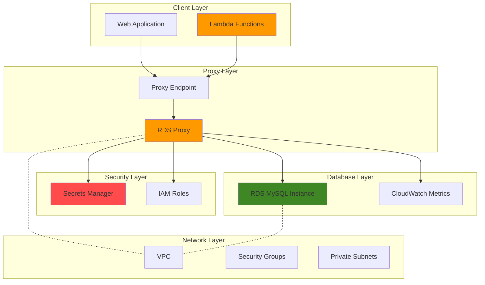

# Database Connection Pooling with RDS Proxy

## Problem

Modern serverless applications face connection exhaustion issues when multiple Lambda functions attempt to connect directly to RDS databases. Each Lambda invocation creates new database connections, quickly overwhelming the database's connection limit and causing failures during traffic spikes. Traditional connection pooling solutions don't work well with serverless architectures due to their ephemeral nature.

## Solution

Amazon RDS Proxy provides a fully managed database proxy that implements connection pooling, connection multiplexing, and improved application availability. It maintains a pool of established connections to your RDS database and efficiently shares them across multiple application connections, reducing database load and improving application scalability.

## Architecture Diagram



## Prerequisites

1. AWS account with appropriate permissions for RDS, RDS Proxy, Lambda, and Secrets Manager
2. AWS CLI v2 installed and configured (or AWS CloudShell)
3. Basic understanding of VPC networking, security groups, and IAM roles
4. Familiarity with database connection concepts and serverless architecture
5. Estimated cost: $25-50/month for RDS instance, $0.015/hour for RDS Proxy, minimal Lambda costs

> **Note**: RDS Proxy is only available in specific regions and requires your database to be in a VPC. Check the [RDS Proxy setup guide](https://docs.aws.amazon.com/AmazonRDS/latest/UserGuide/rds-proxy-setup.html) to ensure your target region supports RDS Proxy before proceeding.

## Preparation

```bash
# Set environment variables
export AWS_REGION=$(aws configure get region)
export AWS_ACCOUNT_ID=$(aws sts get-caller-identity \
    --query Account --output text)

# Generate unique identifiers for resources
RANDOM_SUFFIX=$(aws secretsmanager get-random-password \
    --exclude-punctuation --exclude-uppercase \
    --password-length 6 --require-each-included-type \
    --output text --query RandomPassword)

export DB_NAME="testdb"
export DB_USER="admin"
export DB_PASSWORD="MySecurePassword123!"
export DB_INSTANCE_ID="rds-proxy-demo-${RANDOM_SUFFIX}"
export PROXY_NAME="rds-proxy-demo-${RANDOM_SUFFIX}"
export SECRET_NAME="rds-proxy-secret-${RANDOM_SUFFIX}"
export LAMBDA_FUNCTION_NAME="rds-proxy-test-${RANDOM_SUFFIX}"

# Create VPC and networking resources
export VPC_ID=$(aws ec2 create-vpc \
    --cidr-block 10.0.0.0/16 \
    --query 'Vpc.VpcId' --output text)

aws ec2 create-tags \
    --resources $VPC_ID \
    --tags Key=Name,Value="rds-proxy-vpc-${RANDOM_SUFFIX}"

# Create subnet in first availability zone
export SUBNET_ID_1=$(aws ec2 create-subnet \
    --vpc-id $VPC_ID \
    --cidr-block 10.0.1.0/24 \
    --availability-zone ${AWS_REGION}a \
    --query 'Subnet.SubnetId' --output text)

# Create subnet in second availability zone
export SUBNET_ID_2=$(aws ec2 create-subnet \
    --vpc-id $VPC_ID \
    --cidr-block 10.0.2.0/24 \
    --availability-zone ${AWS_REGION}b \
    --query 'Subnet.SubnetId' --output text)

# Create DB subnet group
aws rds create-db-subnet-group \
    --db-subnet-group-name "rds-proxy-subnet-group-${RANDOM_SUFFIX}" \
    --db-subnet-group-description "Subnet group for RDS Proxy demo" \
    --subnet-ids $SUBNET_ID_1 $SUBNET_ID_2

echo "✅ VPC and networking resources created"
```

## Steps

1. **Create Security Groups for Database Access**:

   Security groups act as virtual firewalls that control inbound and outbound traffic to AWS resources. In this architecture, we need separate security groups for the RDS instance and RDS Proxy to implement proper network segmentation and follow the principle of least privilege. The [security group configuration](https://docs.aws.amazon.com/AmazonRDS/latest/UserGuide/Overview.RDSSecurityGroups.html) ensures that only authorized traffic flows between your application layer, proxy, and database.

   ```bash
   # Create security group for RDS instance
   export DB_SECURITY_GROUP_ID=$(aws ec2 create-security-group \
       --group-name "rds-proxy-db-sg-${RANDOM_SUFFIX}" \
       --description "Security group for RDS instance" \
       --vpc-id $VPC_ID \
       --query 'GroupId' --output text)
   
   # Create security group for RDS Proxy
   export PROXY_SECURITY_GROUP_ID=$(aws ec2 create-security-group \
       --group-name "rds-proxy-sg-${RANDOM_SUFFIX}" \
       --description "Security group for RDS Proxy" \
       --vpc-id $VPC_ID \
       --query 'GroupId' --output text)
   
   # Allow RDS Proxy to connect to RDS instance
   aws ec2 authorize-security-group-ingress \
       --group-id $DB_SECURITY_GROUP_ID \
       --protocol tcp \
       --port 3306 \
       --source-group $PROXY_SECURITY_GROUP_ID
   
   # Allow Lambda/applications to connect to RDS Proxy
   aws ec2 authorize-security-group-ingress \
       --group-id $PROXY_SECURITY_GROUP_ID \
       --protocol tcp \
       --port 3306 \
       --cidr 10.0.0.0/16
   
   echo "✅ Security groups created and configured"
   ```

   The security groups are now configured to allow controlled database access. The RDS instance will only accept connections from the RDS Proxy, while the proxy accepts connections from your VPC's CIDR range. This layered security approach prevents direct database access and ensures all connections flow through the proxy's connection pooling mechanism.

2. **Create RDS MySQL Instance**:

   Amazon RDS provides a managed relational database service that handles routine database tasks like backups, patching, and monitoring. For this implementation, we're creating a MySQL instance with encryption enabled and positioned in private subnets to ensure security. The [RDS instance configuration](https://docs.aws.amazon.com/AmazonRDS/latest/UserGuide/CHAP_CommonTasks.Connect.html) includes automated backups and Multi-AZ deployment options for high availability.

   ```bash
   # Create RDS MySQL instance
   aws rds create-db-instance \
       --db-instance-identifier $DB_INSTANCE_ID \
       --db-instance-class db.t3.micro \
       --engine mysql \
       --master-username $DB_USER \
       --master-user-password $DB_PASSWORD \
       --allocated-storage 20 \
       --vpc-security-group-ids $DB_SECURITY_GROUP_ID \
       --db-subnet-group-name "rds-proxy-subnet-group-${RANDOM_SUFFIX}" \
       --backup-retention-period 7 \
       --storage-encrypted \
       --no-publicly-accessible
   
   echo "⏳ Creating RDS instance (this will take 10-15 minutes)..."
   
   # Wait for the RDS instance to be available
   aws rds wait db-instance-available \
       --db-instance-identifier $DB_INSTANCE_ID
   
   # Get RDS instance endpoint
   export DB_ENDPOINT=$(aws rds describe-db-instances \
       --db-instance-identifier $DB_INSTANCE_ID \
       --query 'DBInstances[0].Endpoint.Address' --output text)
   
   echo "✅ RDS instance created: $DB_ENDPOINT"
   ```

   The RDS instance is now operational and ready to accept connections from the RDS Proxy. The instance is configured with encryption at rest, automated backups, and positioned in a private subnet for enhanced security. This foundation provides the persistent storage layer that RDS Proxy will manage connections to.

3. **Store Database Credentials in Secrets Manager**:

   AWS Secrets Manager provides centralized credential management with automatic rotation capabilities, eliminating the need to hardcode database passwords in your application code. RDS Proxy integrates natively with Secrets Manager to [retrieve database credentials](https://docs.aws.amazon.com/secretsmanager/latest/userguide/retrieving-secrets.html) securely, enabling credential rotation without application downtime.

   ```bash
   # Create secret with database credentials
   aws secretsmanager create-secret \
       --name $SECRET_NAME \
       --description "Database credentials for RDS Proxy demo" \
       --secret-string "{\"username\":\"$DB_USER\",\"password\":\"$DB_PASSWORD\"}"
   
   # Get secret ARN
   export SECRET_ARN=$(aws secretsmanager describe-secret \
       --secret-id $SECRET_NAME \
       --query 'ARN' --output text)
   
   echo "✅ Database credentials stored in Secrets Manager"
   ```

   The database credentials are now securely stored and can be accessed by RDS Proxy without exposing sensitive information in your application configuration. This centralized approach enables [automatic credential rotation](https://docs.aws.amazon.com/secretsmanager/latest/userguide/rotating-secrets.html) and provides audit trails for credential access.

4. **Create IAM Role for RDS Proxy**:

   IAM roles enable secure, temporary credential delegation without hardcoding access keys. This role grants RDS Proxy the minimum permissions required to retrieve database credentials from Secrets Manager, following the [principle of least privilege](https://docs.aws.amazon.com/IAM/latest/UserGuide/best-practices.html). The trust policy ensures only the RDS service can assume this role.

   ```bash
   # Create trust policy for RDS Proxy
   cat > /tmp/rds-proxy-trust-policy.json << EOF
   {
       "Version": "2012-10-17",
       "Statement": [
           {
               "Effect": "Allow",
               "Principal": {
                   "Service": "rds.amazonaws.com"
               },
               "Action": "sts:AssumeRole"
           }
       ]
   }
   EOF
   
   # Create the IAM role
   aws iam create-role \
       --role-name "RDSProxyRole-${RANDOM_SUFFIX}" \
       --assume-role-policy-document file:///tmp/rds-proxy-trust-policy.json
   
   # Create policy for accessing Secrets Manager
   cat > /tmp/rds-proxy-policy.json << EOF
   {
       "Version": "2012-10-17",
       "Statement": [
           {
               "Effect": "Allow",
               "Action": [
                   "secretsmanager:GetSecretValue",
                   "secretsmanager:DescribeSecret"
               ],
               "Resource": "$SECRET_ARN"
           }
       ]
   }
   EOF
   
   # Create and attach the policy
   aws iam create-policy \
       --policy-name "RDSProxySecretsPolicy-${RANDOM_SUFFIX}" \
       --policy-document file:///tmp/rds-proxy-policy.json
   
   aws iam attach-role-policy \
       --role-name "RDSProxyRole-${RANDOM_SUFFIX}" \
       --policy-arn "arn:aws:iam::${AWS_ACCOUNT_ID}:policy/RDSProxySecretsPolicy-${RANDOM_SUFFIX}"
   
   # Get role ARN
   export PROXY_ROLE_ARN=$(aws iam get-role \
       --role-name "RDSProxyRole-${RANDOM_SUFFIX}" \
       --query 'Role.Arn' --output text)
   
   echo "✅ IAM role created for RDS Proxy"
   ```

   The IAM role is now configured with precise permissions to access only the specific secret containing your database credentials. This security configuration ensures RDS Proxy can authenticate to your database while maintaining strict access controls and audit capabilities.

   > **Note**: Follow the [principle of least privilege](https://docs.aws.amazon.com/IAM/latest/UserGuide/best-practices.html#grant-least-privilege) when configuring IAM permissions for production environments.

5. **Create RDS Proxy**:

   Amazon RDS Proxy is a fully managed database proxy that implements [connection pooling and multiplexing](https://docs.aws.amazon.com/AmazonRDS/latest/UserGuide/rds-proxy.html) to improve application scalability and availability. The proxy maintains a pool of established connections to your database and efficiently shares them across multiple application requests, reducing connection overhead and improving performance during traffic spikes.

   ```bash
   # Create RDS Proxy
   aws rds create-db-proxy \
       --db-proxy-name $PROXY_NAME \
       --engine-family MYSQL \
       --auth "AuthScheme=SECRETS,SecretArn=$SECRET_ARN,Description=Database authentication for RDS Proxy" \
       --role-arn $PROXY_ROLE_ARN \
       --vpc-subnet-ids $SUBNET_ID_1 $SUBNET_ID_2 \
       --vpc-security-group-ids $PROXY_SECURITY_GROUP_ID \
       --idle-client-timeout 1800 \
       --max-connections-percent 100 \
       --max-idle-connections-percent 50
   
   echo "⏳ Creating RDS Proxy (this will take 3-5 minutes)..."
   
   # Wait for proxy to be available
   aws rds wait db-proxy-available --db-proxy-name $PROXY_NAME
   
   # Get proxy endpoint
   export PROXY_ENDPOINT=$(aws rds describe-db-proxies \
       --db-proxy-name $PROXY_NAME \
       --query 'DBProxies[0].Endpoint' --output text)
   
   echo "✅ RDS Proxy created: $PROXY_ENDPOINT"
   ```

   The RDS Proxy is now operational and ready to accept application connections. It's configured with connection pooling parameters that allow up to 100% of the database's connection capacity with 50% idle connections maintained in the pool. This configuration optimizes resource utilization while ensuring rapid response to new connection requests.

6. **Register Database Target with RDS Proxy**:

   Target registration connects your RDS instance to the proxy, enabling the proxy to manage connections to your database. The proxy monitors target health and automatically handles failover scenarios when multiple database instances are configured. This step establishes the connection path that applications will use to access your database.

   ```bash
   # Register the RDS instance as a target
   aws rds register-db-proxy-targets \
       --db-proxy-name $PROXY_NAME \
       --db-instance-identifiers $DB_INSTANCE_ID
   
   # Wait for target to be available
   echo "⏳ Registering database target with proxy..."
   sleep 30
   
   # Verify target registration
   aws rds describe-db-proxy-targets \
       --db-proxy-name $PROXY_NAME \
       --query 'Targets[0].{Status:TargetHealth.State,Type:Type,Id:RdsResourceId}'
   
   echo "✅ Database target registered with RDS Proxy"
   ```

   The RDS instance is now registered as a target with the proxy, completing the connection path from applications to your database. The proxy will monitor the target's health and route connections efficiently through its connection pool.

7. **Create Lambda Function for Testing**:

   AWS Lambda provides serverless compute that demonstrates the connection pooling benefits of RDS Proxy. Traditional Lambda functions create new database connections for each invocation, which can quickly exhaust connection limits. By [connecting through RDS Proxy](https://docs.aws.amazon.com/lambda/latest/dg/configuration-vpc.html), Lambda functions share pooled connections, dramatically improving scalability and reducing connection overhead.

   ```bash
   # Create Lambda execution role
   cat > /tmp/lambda-trust-policy.json << EOF
   {
       "Version": "2012-10-17",
       "Statement": [
           {
               "Effect": "Allow",
               "Principal": {
                   "Service": "lambda.amazonaws.com"
               },
               "Action": "sts:AssumeRole"
           }
       ]
   }
   EOF
   
   aws iam create-role \
       --role-name "LambdaRDSProxyRole-${RANDOM_SUFFIX}" \
       --assume-role-policy-document file:///tmp/lambda-trust-policy.json
   
   # Attach basic Lambda execution policy
   aws iam attach-role-policy \
       --role-name "LambdaRDSProxyRole-${RANDOM_SUFFIX}" \
       --policy-arn "arn:aws:iam::aws:policy/service-role/AWSLambdaVPCAccessExecutionRole"
   
   # Get Lambda role ARN
   export LAMBDA_ROLE_ARN=$(aws iam get-role \
       --role-name "LambdaRDSProxyRole-${RANDOM_SUFFIX}" \
       --query 'Role.Arn' --output text)
   
   # Create Lambda function code
   cat > /tmp/lambda_function.py << EOF
   import json
   import pymysql
   import os
   
   def lambda_handler(event, context):
       try:
           # Connect to database through RDS Proxy
           connection = pymysql.connect(
               host=os.environ['PROXY_ENDPOINT'],
               user=os.environ['DB_USER'],
               password=os.environ['DB_PASSWORD'],
               database=os.environ['DB_NAME'],
               port=3306,
               cursorclass=pymysql.cursors.DictCursor
           )
           
           with connection.cursor() as cursor:
               # Execute a simple query
               cursor.execute("SELECT 1 as connection_test, CONNECTION_ID() as connection_id")
               result = cursor.fetchone()
               
           connection.close()
           
           return {
               'statusCode': 200,
               'body': json.dumps({
                   'message': 'Successfully connected through RDS Proxy',
                   'result': result
               })
           }
       except Exception as e:
           return {
               'statusCode': 500,
               'body': json.dumps({
                   'error': str(e)
               })
           }
   EOF
   
   # Create deployment package
   cd /tmp
   zip lambda_function.zip lambda_function.py
   
   # Create Lambda function with updated Python runtime
   aws lambda create-function \
       --function-name $LAMBDA_FUNCTION_NAME \
       --runtime python3.12 \
       --role $LAMBDA_ROLE_ARN \
       --handler lambda_function.lambda_handler \
       --zip-file fileb://lambda_function.zip \
       --timeout 30 \
       --environment Variables="{PROXY_ENDPOINT=$PROXY_ENDPOINT,DB_USER=$DB_USER,DB_PASSWORD=$DB_PASSWORD,DB_NAME=$DB_NAME}" \
       --vpc-config SubnetIds=$SUBNET_ID_1,$SUBNET_ID_2,SecurityGroupIds=$PROXY_SECURITY_GROUP_ID
   
   echo "✅ Lambda function created for testing"
   ```

   The Lambda function is now configured to connect to your database through RDS Proxy instead of directly. This configuration enables multiple Lambda invocations to share database connections efficiently, reducing connection setup time and improving overall application performance.

8. **Configure Connection Pooling Settings**:

   Fine-tuning connection pooling parameters optimizes resource utilization and application performance. The [connection pool configuration](https://docs.aws.amazon.com/AmazonRDS/latest/UserGuide/rds-proxy-connections.html) balances the trade-off between connection availability and resource consumption. Shorter idle timeouts work well for event-driven applications, while longer timeouts benefit applications with consistent traffic patterns.

   ```bash
   # Modify proxy configuration for optimal connection pooling
   aws rds modify-db-proxy \
       --db-proxy-name $PROXY_NAME \
       --idle-client-timeout 900 \
       --max-connections-percent 75 \
       --max-idle-connections-percent 25
   
   # Wait for modification to complete
   echo "⏳ Updating proxy configuration..."
   sleep 30
   
   # Enable enhanced monitoring
   aws rds modify-db-proxy \
       --db-proxy-name $PROXY_NAME \
       --debug-logging
   
   echo "✅ Connection pooling settings optimized"
   ```

   The connection pooling settings are now optimized for your application's usage patterns. The proxy will maintain 25% idle connections and limit total connections to 75% of the database capacity, providing an optimal balance between performance and resource utilization. Debug logging is enabled to help monitor connection usage patterns.

## Validation & Testing

1. **Test Direct Database Connection Through Proxy**:

   ```bash
   # Test connection using MySQL client (if available)
   # mysql -h $PROXY_ENDPOINT -u $DB_USER -p$DB_PASSWORD \
   #     -e "SELECT 'Connected through RDS Proxy' as message, CONNECTION_ID() as connection_id;"
   
   # Alternative: Test using Lambda function
   aws lambda invoke \
       --function-name $LAMBDA_FUNCTION_NAME \
       --payload '{}' \
       /tmp/lambda_response.json
   
   echo "Lambda response:"
   cat /tmp/lambda_response.json
   ```

   Expected output: Should show successful connection with connection ID.

2. **Test Connection Pooling Behavior**:

   ```bash
   # Invoke Lambda function multiple times to test connection reuse
   for i in {1..5}; do
       echo "Invocation $i:"
       aws lambda invoke \
           --function-name $LAMBDA_FUNCTION_NAME \
           --payload '{}' \
           /tmp/lambda_response_$i.json
       cat /tmp/lambda_response_$i.json
       echo ""
   done
   ```

3. **Monitor RDS Proxy Metrics**:

   ```bash
   # Check RDS Proxy CloudWatch metrics
   aws cloudwatch get-metric-statistics \
       --namespace AWS/RDS \
       --metric-name DatabaseConnections \
       --dimensions Name=ProxyName,Value=$PROXY_NAME \
       --statistics Average \
       --start-time $(date -u -d '1 hour ago' +%Y-%m-%dT%H:%M:%S) \
       --end-time $(date -u +%Y-%m-%dT%H:%M:%S) \
       --period 300
   
   # Check connection pool usage
   aws rds describe-db-proxy-targets \
       --db-proxy-name $PROXY_NAME \
       --query 'Targets[0].TargetHealth'
   ```

## Cleanup

1. **Remove Lambda function and IAM role**:

   ```bash
   # Delete Lambda function
   aws lambda delete-function \
       --function-name $LAMBDA_FUNCTION_NAME
   
   # Detach policies and delete Lambda role
   aws iam detach-role-policy \
       --role-name "LambdaRDSProxyRole-${RANDOM_SUFFIX}" \
       --policy-arn "arn:aws:iam::aws:policy/service-role/AWSLambdaVPCAccessExecutionRole"
   
   aws iam delete-role \
       --role-name "LambdaRDSProxyRole-${RANDOM_SUFFIX}"
   
   echo "✅ Lambda function and role deleted"
   ```

2. **Remove RDS Proxy**:

   ```bash
   # Delete RDS Proxy
   aws rds delete-db-proxy \
       --db-proxy-name $PROXY_NAME
   
   echo "⏳ Deleting RDS Proxy..."
   sleep 60
   
   echo "✅ RDS Proxy deleted"
   ```

3. **Remove RDS instance**:

   ```bash
   # Delete RDS instance
   aws rds delete-db-instance \
       --db-instance-identifier $DB_INSTANCE_ID \
       --skip-final-snapshot
   
   echo "⏳ Deleting RDS instance (this will take 5-10 minutes)..."
   
   # Wait for deletion to complete
   aws rds wait db-instance-deleted \
       --db-instance-identifier $DB_INSTANCE_ID
   
   echo "✅ RDS instance deleted"
   ```

4. **Remove IAM resources and secrets**:

   ```bash
   # Delete IAM policy and role
   aws iam detach-role-policy \
       --role-name "RDSProxyRole-${RANDOM_SUFFIX}" \
       --policy-arn "arn:aws:iam::${AWS_ACCOUNT_ID}:policy/RDSProxySecretsPolicy-${RANDOM_SUFFIX}"
   
   aws iam delete-policy \
       --policy-arn "arn:aws:iam::${AWS_ACCOUNT_ID}:policy/RDSProxySecretsPolicy-${RANDOM_SUFFIX}"
   
   aws iam delete-role \
       --role-name "RDSProxyRole-${RANDOM_SUFFIX}"
   
   # Delete secret
   aws secretsmanager delete-secret \
       --secret-id $SECRET_NAME \
       --force-delete-without-recovery
   
   echo "✅ IAM resources and secrets deleted"
   ```

5. **Remove networking resources**:

   ```bash
   # Delete DB subnet group
   aws rds delete-db-subnet-group \
       --db-subnet-group-name "rds-proxy-subnet-group-${RANDOM_SUFFIX}"
   
   # Delete security groups
   aws ec2 delete-security-group \
       --group-id $PROXY_SECURITY_GROUP_ID
   
   aws ec2 delete-security-group \
       --group-id $DB_SECURITY_GROUP_ID
   
   # Delete subnets
   aws ec2 delete-subnet --subnet-id $SUBNET_ID_1
   aws ec2 delete-subnet --subnet-id $SUBNET_ID_2
   
   # Delete VPC
   aws ec2 delete-vpc --vpc-id $VPC_ID
   
   # Clean up temporary files
   rm -f /tmp/rds-proxy-*.json /tmp/lambda_function.* /tmp/lambda_response*.json
   
   echo "✅ All networking resources deleted"
   ```

## Discussion

RDS Proxy addresses a fundamental challenge in serverless and container-based applications: efficient database connection management. Traditional applications maintain long-lived connections to databases, but serverless functions create new connections for each invocation, leading to connection exhaustion and performance degradation. This problem becomes particularly acute in high-traffic applications where hundreds or thousands of Lambda functions might attempt simultaneous database connections.

The proxy acts as an intermediary that maintains a pool of established connections to your database. When applications request database connections, RDS Proxy efficiently multiplexes these requests across its connection pool, significantly reducing the overhead of establishing new connections. This approach is particularly beneficial for applications with unpredictable traffic patterns or those that scale rapidly, as the proxy can handle connection spikes without overwhelming the underlying database.

RDS Proxy also enhances security by integrating with AWS Secrets Manager for credential management and supporting IAM authentication. Instead of hardcoding database credentials in your application code, the proxy retrieves credentials from Secrets Manager, enabling automatic credential rotation and centralized credential management. The proxy can also enforce connection limits and provide detailed CloudWatch metrics for monitoring connection usage patterns, helping you optimize your database resource utilization.

Performance benefits extend beyond connection pooling. RDS Proxy reduces database CPU utilization by handling connection management overhead, allows for more predictable performance during traffic spikes, and provides automatic failover capabilities when used with Multi-AZ deployments. The proxy can also help reduce costs by enabling more efficient use of database instance resources, as connection pooling reduces the memory and CPU overhead associated with managing large numbers of individual connections. For more detailed guidance on optimizing these configurations, see the [AWS Well-Architected Framework](https://docs.aws.amazon.com/wellarchitected/latest/framework/welcome.html) and [RDS Proxy best practices documentation](https://docs.aws.amazon.com/AmazonRDS/latest/UserGuide/rds-proxy-planning.html).

> **Tip**: Configure idle connection timeout based on your application's usage patterns. Shorter timeouts (5-10 minutes) work well for event-driven applications, while longer timeouts (30 minutes) are better for applications with consistent traffic patterns. See the [connection considerations documentation](https://docs.aws.amazon.com/AmazonRDS/latest/UserGuide/rds-proxy-connections.html) for detailed guidance on tuning these parameters.

## Challenge

Extend this solution by implementing these enhancements:

1. **Multi-User Authentication**: Configure multiple database users with different privilege levels and implement role-based access through the proxy using additional Secrets Manager secrets and IAM authentication.

2. **Read Replica Integration**: Add read replicas to your RDS instance and configure RDS Proxy to distribute read traffic across multiple database endpoints for improved performance and availability.

3. **Advanced Monitoring**: Implement custom CloudWatch alarms for proxy metrics like connection pool utilization, query latency, and connection errors to proactively identify performance issues and bottlenecks.

4. **Blue-Green Deployment Support**: Configure RDS Proxy to support blue-green database deployments by dynamically switching between database targets without application code changes or downtime.

5. **Cross-Region Disaster Recovery**: Implement a disaster recovery strategy using RDS Proxy with cross-region read replicas and automated failover mechanisms for business continuity.

## Infrastructure Code

*Infrastructure code will be generated after recipe approval.*