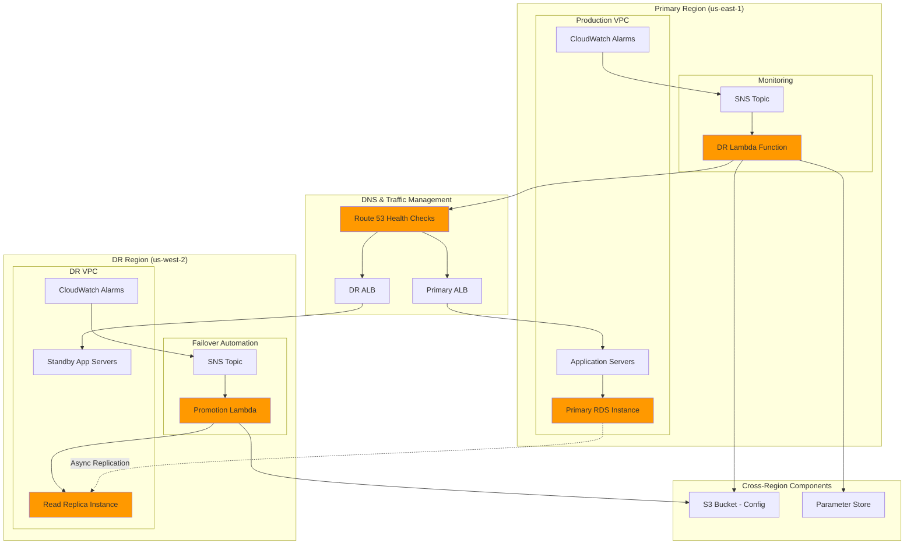

# Database Disaster Recovery with Read Replicas

## Problem

Enterprise applications require database high availability and disaster recovery capabilities to ensure business continuity during regional outages, natural disasters, or infrastructure failures. Traditional backup-based recovery methods can result in hours of downtime and significant data loss, impacting customer experience and revenue. Organizations need automated disaster recovery solutions that can maintain near-zero RPO (Recovery Point Objective) and minimal RTO (Recovery Time Objective) while providing cost-effective cross-region protection for their critical database workloads.

## Solution

Implement a comprehensive disaster recovery architecture using Amazon RDS cross-region read replicas with automated failover mechanisms. This solution leverages asynchronous replication to maintain synchronized database copies across multiple AWS regions, combined with monitoring and alerting systems to detect primary database failures and execute automated promotion of read replicas to standalone instances. The architecture includes automated DNS failover, application configuration updates, and comprehensive testing procedures to ensure reliable disaster recovery operations.

## Architecture Diagram



## Prerequisites

1. AWS account with appropriate permissions for RDS, Lambda, CloudWatch, SNS, Route 53, and EventBridge
2. AWS CLI v2 installed and configured (or AWS CloudShell)
3. Two AWS regions configured for primary and disaster recovery operations
4. VPC with private subnets in both regions for RDS deployment
5. IAM execution role for Lambda functions with appropriate permissions
6. Understanding of RDS backup and recovery concepts
7. Estimated cost: $200-400/month for RDS instances, storage, and cross-region data transfer

> **Note**: Cross-region data transfer charges apply for read replica synchronization and can be significant for high-volume databases.

> **Warning**: Read replicas have asynchronous replication which can result in data loss during primary database failures. Consider Amazon Aurora Global Database for synchronous cross-region replication if zero data loss is required.

> **Tip**: Regularly test your disaster recovery procedures with planned failover exercises to ensure RTO and RPO targets are met. Automate these tests to validate your disaster recovery automation.

## Preparation

```bash
# Set environment variables for both regions
export PRIMARY_REGION="us-east-1"
export DR_REGION="us-west-2"
export AWS_ACCOUNT_ID=$(aws sts get-caller-identity \
    --query Account --output text)

# Generate unique identifiers for resources
RANDOM_SUFFIX=$(aws secretsmanager get-random-password \
    --exclude-punctuation --exclude-uppercase \
    --password-length 6 --require-each-included-type \
    --output text --query RandomPassword)

# Set resource names
export DB_INSTANCE_ID="primary-db-${RANDOM_SUFFIX}"
export DB_REPLICA_ID="dr-replica-${RANDOM_SUFFIX}"
export DB_SUBNET_GROUP="dr-subnet-group-${RANDOM_SUFFIX}"
export SNS_TOPIC_PRIMARY="dr-primary-alerts-${RANDOM_SUFFIX}"
export SNS_TOPIC_DR="dr-failover-alerts-${RANDOM_SUFFIX}"
export LAMBDA_FUNCTION_PRIMARY="dr-coordinator-${RANDOM_SUFFIX}"
export LAMBDA_FUNCTION_DR="replica-promoter-${RANDOM_SUFFIX}"

# Create S3 bucket for configuration and logs
aws s3 mb s3://dr-config-bucket-${RANDOM_SUFFIX} \
    --region ${PRIMARY_REGION}

# Enable versioning on the S3 bucket
aws s3api put-bucket-versioning \
    --bucket dr-config-bucket-${RANDOM_SUFFIX} \
    --versioning-configuration Status=Enabled

# Create IAM role for Lambda execution (if not exists)
aws iam create-role \
    --role-name lambda-execution-role \
    --assume-role-policy-document '{
        "Version": "2012-10-17",
        "Statement": [
            {
                "Effect": "Allow",
                "Principal": {"Service": "lambda.amazonaws.com"},
                "Action": "sts:AssumeRole"
            }
        ]
    }' 2>/dev/null || echo "Role already exists"

# Attach necessary policies to Lambda execution role
aws iam attach-role-policy \
    --role-name lambda-execution-role \
    --policy-arn arn:aws:iam::aws:policy/service-role/AWSLambdaBasicExecutionRole

aws iam attach-role-policy \
    --role-name lambda-execution-role \
    --policy-arn arn:aws:iam::aws:policy/AmazonRDSFullAccess

aws iam attach-role-policy \
    --role-name lambda-execution-role \
    --policy-arn arn:aws:iam::aws:policy/AmazonSNSFullAccess

aws iam attach-role-policy \
    --role-name lambda-execution-role \
    --policy-arn arn:aws:iam::aws:policy/AmazonSSMFullAccess

# Create RDS monitoring role (if not exists)
aws iam create-role \
    --role-name rds-monitoring-role \
    --assume-role-policy-document '{
        "Version": "2012-10-17",
        "Statement": [
            {
                "Effect": "Allow",
                "Principal": {"Service": "monitoring.rds.amazonaws.com"},
                "Action": "sts:AssumeRole"
            }
        ]
    }' 2>/dev/null || echo "Role already exists"

aws iam attach-role-policy \
    --role-name rds-monitoring-role \
    --policy-arn arn:aws:iam::aws:policy/service-role/AmazonRDSEnhancedMonitoringRole

echo "✅ Environment variables, S3 bucket, and IAM roles configured"
```

## Steps

1. **Create Primary Database Instance**:

   Amazon RDS provides managed relational database services with built-in high availability, automated backups, and point-in-time recovery capabilities. Creating a primary database instance establishes the foundation for our disaster recovery architecture. RDS automatically handles database maintenance, security patching, and infrastructure scaling, allowing you to focus on application development while ensuring enterprise-grade reliability.

   The primary database serves as the authoritative source of truth for your application data. By enabling features like Performance Insights, encryption at rest, and enhanced monitoring, we establish comprehensive observability and security controls that are essential for production workloads. These configurations ensure your database meets compliance requirements while providing the performance metrics needed for disaster recovery decision-making.

   ```bash
   # Generate a secure password for the database
   DB_PASSWORD=$(aws secretsmanager get-random-password \
       --exclude-characters '"@/\' \
       --password-length 16 \
       --require-each-included-type \
       --output text --query RandomPassword)

   # Create primary RDS instance in primary region
   aws rds create-db-instance \
       --region ${PRIMARY_REGION} \
       --db-instance-identifier ${DB_INSTANCE_ID} \
       --db-instance-class db.t3.micro \
       --engine mysql \
       --master-username admin \
       --master-user-password "${DB_PASSWORD}" \
       --allocated-storage 20 \
       --backup-retention-period 7 \
       --storage-encrypted \
       --monitoring-interval 60 \
       --monitoring-role-arn arn:aws:iam::${AWS_ACCOUNT_ID}:role/rds-monitoring-role \
       --enable-performance-insights \
       --deletion-protection \
       --tags Key=Purpose,Value=DisasterRecovery \
              Key=Environment,Value=Production
   
   # Wait for DB instance to be available
   aws rds wait db-instance-available \
       --region ${PRIMARY_REGION} \
       --db-instance-identifier ${DB_INSTANCE_ID}
   
   echo "✅ Primary database instance created and available"
   ```

   The primary database instance is now operational with essential disaster recovery features enabled. The 7-day backup retention period ensures point-in-time recovery capabilities, while deletion protection prevents accidental data loss. This foundational step establishes the source database that will replicate to our disaster recovery region, providing the baseline for our cross-region disaster recovery architecture.

2. **Create Cross-Region Read Replica**:

   Cross-region read replicas provide asynchronous replication of your primary database to a different AWS region, creating a geographically distributed copy of your data. This replication mechanism is crucial for disaster recovery as it maintains a nearly real-time copy of your database in a separate region, protecting against regional failures, natural disasters, or widespread infrastructure issues.

   Amazon RDS uses native replication capabilities of the database engine to maintain synchronization between the primary instance and read replicas. For MySQL, this leverages binary log replication, ensuring transactional consistency while minimizing performance impact on the primary database. The cross-region aspect provides geographic isolation, meeting compliance requirements for data residency and business continuity planning.

   For more information about RDS read replicas, see the [Amazon RDS User Guide](https://docs.aws.amazon.com/AmazonRDS/latest/UserGuide/USER_ReadRepl.html).

   ```bash
   # Create cross-region read replica
   aws rds create-db-instance-read-replica \
       --region ${DR_REGION} \
       --db-instance-identifier ${DB_REPLICA_ID} \
       --source-db-instance-identifier arn:aws:rds:${PRIMARY_REGION}:${AWS_ACCOUNT_ID}:db:${DB_INSTANCE_ID} \
       --db-instance-class db.t3.micro \
       --publicly-accessible false \
       --auto-minor-version-upgrade true \
       --monitoring-interval 60 \
       --monitoring-role-arn arn:aws:iam::${AWS_ACCOUNT_ID}:role/rds-monitoring-role \
       --enable-performance-insights \
       --tags Key=Purpose,Value=DisasterRecovery \
              Key=Environment,Value=Production \
              Key=Role,Value=ReadReplica
   
   # Wait for read replica to be available
   aws rds wait db-instance-available \
       --region ${DR_REGION} \
       --db-instance-identifier ${DB_REPLICA_ID}
   
   echo "✅ Cross-region read replica created and available"
   ```

   The cross-region read replica is now actively replicating data from the primary database. This replica serves as both a read-only resource for disaster recovery testing and the target for promotion during an actual disaster scenario. The asynchronous replication ensures minimal impact on primary database performance while maintaining data consistency across regions, providing the foundation for automated failover procedures.

3. **Create SNS Topics for Alerting**:

   Amazon SNS (Simple Notification Service) provides a fully managed pub/sub messaging service that enables reliable delivery of notifications during disaster recovery events. Creating dedicated SNS topics for primary and disaster recovery regions establishes the communication backbone for automated failover coordination and stakeholder notification.

   SNS topics act as central communication hubs that can deliver notifications to multiple endpoints simultaneously, including email, SMS, Lambda functions, and other AWS services. This multi-endpoint delivery ensures that both automated systems and human operators receive timely notifications about database health changes, failover events, and recovery status updates. The regional separation of topics ensures notification delivery even if one region becomes unavailable.

   ```bash
   # Create SNS topic in primary region
   PRIMARY_SNS_ARN=$(aws sns create-topic \
       --region ${PRIMARY_REGION} \
       --name ${SNS_TOPIC_PRIMARY} \
       --query TopicArn --output text)
   
   # Create SNS topic in DR region
   DR_SNS_ARN=$(aws sns create-topic \
       --region ${DR_REGION} \
       --name ${SNS_TOPIC_DR} \
       --query TopicArn --output text)
   
   # Subscribe email to SNS topics (replace with your email)
   aws sns subscribe \
       --region ${PRIMARY_REGION} \
       --topic-arn ${PRIMARY_SNS_ARN} \
       --protocol email \
       --notification-endpoint admin@example.com
   
   aws sns subscribe \
       --region ${DR_REGION} \
       --topic-arn ${DR_SNS_ARN} \
       --protocol email \
       --notification-endpoint admin@example.com
   
   echo "✅ SNS topics created for disaster recovery alerts"
   ```

   SNS topics are now configured to deliver notifications across both regions, creating a resilient communication infrastructure for disaster recovery operations. The email subscriptions provide immediate human notification, while the topics themselves serve as integration points for automated systems like Lambda functions and CloudWatch alarms. This messaging foundation enables coordinated response to database failures and recovery events.

4. **Create CloudWatch Alarms for Database Monitoring**:

   Amazon CloudWatch provides comprehensive monitoring and alerting capabilities for AWS resources, enabling proactive detection of database health issues that could trigger disaster recovery procedures. CloudWatch alarms continuously monitor specific metrics and automatically trigger actions when thresholds are breached, forming the automated detection layer of our disaster recovery system.

   The database connection monitoring alarm detects when the primary database becomes unavailable, while the replica lag alarm ensures our disaster recovery target maintains acceptable synchronization levels. These alarms provide both early warning of potential issues and automated triggers for disaster recovery automation, enabling rapid response to database failures without manual intervention.

   For detailed information about CloudWatch monitoring for RDS, see the [Amazon RDS CloudWatch monitoring guide](https://docs.aws.amazon.com/AmazonRDS/latest/UserGuide/monitoring-cloudwatch.html).

   ```bash
   # Create CloudWatch alarm for primary database availability
   aws cloudwatch put-metric-alarm \
       --region ${PRIMARY_REGION} \
       --alarm-name "${DB_INSTANCE_ID}-database-connection-failure" \
       --alarm-description "Alarm when database connection fails" \
       --metric-name DatabaseConnections \
       --namespace AWS/RDS \
       --statistic Average \
       --period 60 \
       --threshold 0 \
       --comparison-operator LessThanThreshold \
       --evaluation-periods 3 \
       --alarm-actions ${PRIMARY_SNS_ARN} \
       --dimensions Name=DBInstanceIdentifier,Value=${DB_INSTANCE_ID} \
       --treat-missing-data breaching
   
   # Create CloudWatch alarm for replica lag
   aws cloudwatch put-metric-alarm \
       --region ${DR_REGION} \
       --alarm-name "${DB_REPLICA_ID}-replica-lag-high" \
       --alarm-description "Alarm when replica lag exceeds threshold" \
       --metric-name ReplicaLag \
       --namespace AWS/RDS \
       --statistic Average \
       --period 300 \
       --threshold 300 \
       --comparison-operator GreaterThanThreshold \
       --evaluation-periods 2 \
       --alarm-actions ${DR_SNS_ARN} \
       --dimensions Name=DBInstanceIdentifier,Value=${DB_REPLICA_ID}
   
   echo "✅ CloudWatch alarms created for database monitoring"
   ```

   CloudWatch alarms are now actively monitoring critical database metrics across both regions. The primary database connection alarm provides immediate detection of availability issues, while the replica lag alarm ensures our disaster recovery target maintains acceptable synchronization. These alarms form the trigger mechanism for automated disaster recovery, enabling rapid response to database failures through SNS topic notifications.

5. **Create Lambda Function for Disaster Recovery Coordination**:

   AWS Lambda provides serverless compute capabilities that enable automated disaster recovery coordination without managing infrastructure. The disaster recovery coordinator function serves as the central orchestrator for failover procedures, processing CloudWatch alarm notifications and executing the complex sequence of steps required to promote a read replica to a standalone database instance.

   This Lambda function embodies the business logic for disaster recovery decision-making, including validation of replica readiness, initiation of promotion procedures, and coordination with other AWS services. By implementing disaster recovery logic in Lambda, we achieve cost-effective automation that scales automatically and executes only when needed, reducing operational overhead while ensuring rapid response to database failures.

   The function integrates with multiple AWS services including RDS for database operations, SNS for notification delivery, and Systems Manager Parameter Store for configuration management. This serverless architecture provides the flexibility and reliability needed for critical disaster recovery operations while maintaining operational simplicity.

   ```bash
   # Create Lambda function code for DR coordination
   cat > /tmp/dr-coordinator.py << 'EOF'
import json
import boto3
import os
from datetime import datetime

def lambda_handler(event, context):
    """
    Disaster Recovery Coordinator Lambda Function
    Handles primary database failure detection and initiates failover
    """
    
    # Initialize AWS clients
    rds = boto3.client('rds', region_name=os.environ['DR_REGION'])
    sns = boto3.client('sns', region_name=os.environ['DR_REGION'])
    route53 = boto3.client('route53')
    ssm = boto3.client('ssm', region_name=os.environ['DR_REGION'])
    
    try:
        # Parse CloudWatch alarm from SNS message
        sns_message = json.loads(event['Records'][0]['Sns']['Message'])
        alarm_name = sns_message['AlarmName']
        
        print(f"Processing alarm: {alarm_name}")
        
        # Check if this is a database connection failure
        if 'database-connection-failure' in alarm_name:
            # Initiate disaster recovery procedure
            replica_id = os.environ['DB_REPLICA_ID']
            
            # Check replica status before promotion
            replica_status = rds.describe_db_instances(
                DBInstanceIdentifier=replica_id
            )['DBInstances'][0]['DBInstanceStatus']
            
            if replica_status == 'available':
                print(f"Promoting read replica {replica_id} to standalone instance")
                
                # Promote read replica
                rds.promote_read_replica(
                    DBInstanceIdentifier=replica_id
                )
                
                # Update parameter store with failover status
                ssm.put_parameter(
                    Name='/disaster-recovery/failover-status',
                    Value=json.dumps({
                        'status': 'in-progress',
                        'timestamp': datetime.utcnow().isoformat(),
                        'replica_id': replica_id
                    }),
                    Type='String',
                    Overwrite=True
                )
                
                # Send success notification
                sns.publish(
                    TopicArn=os.environ['DR_SNS_ARN'],
                    Subject='Disaster Recovery Initiated',
                    Message=f'Read replica {replica_id} promotion started. Monitor for completion.'
                )
                
                return {
                    'statusCode': 200,
                    'body': json.dumps(f'DR procedure initiated for {replica_id}')
                }
            else:
                print(f"Replica {replica_id} is not available for promotion: {replica_status}")
                return {
                    'statusCode': 400,
                    'body': json.dumps(f'Replica not ready for promotion: {replica_status}')
                }
        
    except Exception as e:
        print(f"Error in DR coordinator: {str(e)}")
        sns.publish(
            TopicArn=os.environ['DR_SNS_ARN'],
            Subject='Disaster Recovery Error',
            Message=f'Error in DR coordinator: {str(e)}'
        )
        return {
            'statusCode': 500,
            'body': json.dumps(f'Error: {str(e)}')
        }
EOF
   
   # Create Lambda deployment package
   cd /tmp
   zip -r dr-coordinator.zip dr-coordinator.py
   
   # Create Lambda function
   aws lambda create-function \
       --region ${PRIMARY_REGION} \
       --function-name ${LAMBDA_FUNCTION_PRIMARY} \
       --runtime python3.12 \
       --role arn:aws:iam::${AWS_ACCOUNT_ID}:role/lambda-execution-role \
       --handler dr-coordinator.lambda_handler \
       --zip-file fileb://dr-coordinator.zip \
       --environment Variables='{
           "DR_REGION":"'${DR_REGION}'",
           "DB_REPLICA_ID":"'${DB_REPLICA_ID}'",
           "DR_SNS_ARN":"'${DR_SNS_ARN}'"
       }' \
       --timeout 60 \
       --tags Purpose=DisasterRecovery,Environment=Production
   
   echo "✅ DR coordinator Lambda function created"
   ```

   The disaster recovery coordinator Lambda function is now deployed and ready to process CloudWatch alarm notifications. This function serves as the intelligent automation layer that evaluates database health, validates replica readiness, and initiates promotion procedures when primary database failures are detected. The function's integration with SNS topics ensures coordinated communication throughout the disaster recovery process, enabling both automated systems and human operators to respond appropriately to database failures.

6. **Create Lambda Function for Replica Promotion**:

   The replica promotion Lambda function handles the completion phase of disaster recovery operations, executing post-promotion tasks that ensure smooth transition to the disaster recovery environment. This function responds to RDS events generated during replica promotion, coordinating the final steps required to complete the failover process and restore application connectivity.

   Post-promotion tasks include updating DNS records, modifying application configurations, and sending completion notifications to stakeholders. This automation ensures that promoted replicas are properly integrated into the application architecture, minimizing downtime and reducing the manual effort required during disaster recovery scenarios. The function's event-driven architecture ensures timely execution of these critical post-promotion tasks.

   ```bash
   # Create Lambda function code for replica promotion
   cat > /tmp/replica-promoter.py << 'EOF'
import json
import boto3
import os
from datetime import datetime

def lambda_handler(event, context):
    """
    Replica Promoter Lambda Function
    Handles post-promotion tasks and DNS updates
    """
    
    # Initialize AWS clients
    rds = boto3.client('rds', region_name=os.environ['DR_REGION'])
    route53 = boto3.client('route53')
    ssm = boto3.client('ssm', region_name=os.environ['DR_REGION'])
    sns = boto3.client('sns', region_name=os.environ['DR_REGION'])
    
    try:
        # Check if this is a promotion completion event
        if 'source' in event and event['source'] == 'aws.rds':
            detail = event['detail']
            
            if detail.get('eventName') == 'PromoteReadReplica' and 'responseElements' in detail:
                db_instance_id = detail['responseElements']['dBInstanceIdentifier']
                
                print(f"Processing promotion completion for {db_instance_id}")
                
                # Wait for instance to be available
                waiter = rds.get_waiter('db_instance_available')
                waiter.wait(
                    DBInstanceIdentifier=db_instance_id,
                    WaiterConfig={'Delay': 30, 'MaxAttempts': 20}
                )
                
                # Get promoted instance details
                instance = rds.describe_db_instances(
                    DBInstanceIdentifier=db_instance_id
                )['DBInstances'][0]
                
                new_endpoint = instance['Endpoint']['Address']
                
                # Update Route 53 health check and failover
                # (This would be customized based on your DNS setup)
                
                # Update parameter store
                ssm.put_parameter(
                    Name='/disaster-recovery/failover-status',
                    Value=json.dumps({
                        'status': 'completed',
                        'timestamp': datetime.utcnow().isoformat(),
                        'new_endpoint': new_endpoint,
                        'db_instance_id': db_instance_id
                    }),
                    Type='String',
                    Overwrite=True
                )
                
                # Send completion notification
                sns.publish(
                    TopicArn=os.environ['DR_SNS_ARN'],
                    Subject='Disaster Recovery Completed',
                    Message=f'''
Disaster recovery promotion completed successfully.

New Database Endpoint: {new_endpoint}
Instance ID: {db_instance_id}
Completion Time: {datetime.utcnow().isoformat()}

Please update application configurations to use the new endpoint.
                    '''
                )
                
                return {
                    'statusCode': 200,
                    'body': json.dumps('Promotion completion processed successfully')
                }
        
    except Exception as e:
        print(f"Error in replica promoter: {str(e)}")
        sns.publish(
            TopicArn=os.environ['DR_SNS_ARN'],
            Subject='Disaster Recovery Error',
            Message=f'Error in replica promoter: {str(e)}'
        )
        return {
            'statusCode': 500,
            'body': json.dumps(f'Error: {str(e)}')
        }
EOF
   
   # Create Lambda deployment package
   cd /tmp
   zip -r replica-promoter.zip replica-promoter.py
   
   # Create Lambda function
   aws lambda create-function \
       --region ${DR_REGION} \
       --function-name ${LAMBDA_FUNCTION_DR} \
       --runtime python3.12 \
       --role arn:aws:iam::${AWS_ACCOUNT_ID}:role/lambda-execution-role \
       --handler replica-promoter.lambda_handler \
       --zip-file fileb://replica-promoter.zip \
       --environment Variables='{
           "DR_REGION":"'${DR_REGION}'",
           "DR_SNS_ARN":"'${DR_SNS_ARN}'"
       }' \
       --timeout 300 \
       --tags Purpose=DisasterRecovery,Environment=Production
   
   echo "✅ Replica promoter Lambda function created"
   ```

   The replica promotion Lambda function is now configured to handle RDS events and execute post-promotion tasks. This function completes the automation cycle by ensuring that promoted replicas are properly integrated into the application environment, handling configuration updates and stakeholder notifications. The function's longer timeout accommodates the time required for database promotion and subsequent configuration tasks.

7. **Configure EventBridge Rules for Automation**:

   Amazon EventBridge provides a serverless event bus service that enables event-driven automation by capturing and routing AWS service events to target functions. Configuring EventBridge rules for RDS promotion events establishes the trigger mechanism that activates our post-promotion Lambda function when read replica promotion operations complete.

   EventBridge rules use event patterns to filter specific RDS events, ensuring that our automation responds only to relevant database promotion activities. This event-driven approach eliminates the need for polling mechanisms and provides near-real-time activation of post-promotion tasks. The rule configuration enables automatic execution of critical post-promotion tasks without manual intervention, ensuring consistent disaster recovery procedures.

   ```bash
   # Create EventBridge rule for RDS events in DR region
   aws events put-rule \
       --region ${DR_REGION} \
       --name "rds-promotion-events" \
       --event-pattern '{
           "source": ["aws.rds"],
           "detail-type": ["AWS API Call via CloudTrail"],
           "detail": {
               "eventSource": ["rds.amazonaws.com"],
               "eventName": ["PromoteReadReplica"]
           }
       }' \
       --state ENABLED \
       --description "Capture RDS promotion events for DR automation"
   
   # Add Lambda target to EventBridge rule
   aws events put-targets \
       --region ${DR_REGION} \
       --rule "rds-promotion-events" \
       --targets "Id"="1","Arn"="arn:aws:lambda:${DR_REGION}:${AWS_ACCOUNT_ID}:function:${LAMBDA_FUNCTION_DR}"
   
   # Grant EventBridge permission to invoke Lambda
   aws lambda add-permission \
       --region ${DR_REGION} \
       --function-name ${LAMBDA_FUNCTION_DR} \
       --statement-id eventbridge-invoke \
       --action lambda:InvokeFunction \
       --principal events.amazonaws.com \
       --source-arn arn:aws:events:${DR_REGION}:${AWS_ACCOUNT_ID}:rule/rds-promotion-events
   
   echo "✅ EventBridge automation configured"
   ```

   EventBridge automation is now active and monitoring RDS events for replica promotion activities. The rule configuration ensures that our post-promotion Lambda function automatically executes when promotion operations complete, providing seamless integration between database failover and application configuration updates. This event-driven automation eliminates delays in post-promotion tasks and ensures consistent disaster recovery procedures.

8. **Create Route 53 Health Checks and Failover**:

   Amazon Route 53 provides DNS services with integrated health checking capabilities that enable intelligent traffic routing based on resource health status. Creating health checks for our primary and disaster recovery databases establishes DNS-level failover capabilities that can automatically redirect application traffic during disaster recovery scenarios.

   Route 53 health checks monitor CloudWatch alarms rather than directly accessing database endpoints, providing a scalable and secure approach to health monitoring. This integration enables DNS-based failover that responds to the same database health conditions that trigger our automated disaster recovery procedures. The health check configuration supports both preventive traffic routing and reactive failover scenarios, providing comprehensive DNS-level disaster recovery capabilities.

   ```bash
   # Create Route 53 health check for primary database
   PRIMARY_HEALTH_CHECK_ID=$(aws route53 create-health-check \
       --caller-reference "primary-db-health-$(date +%s)" \
       --health-check-config '{
           "Type": "CLOUDWATCH_METRIC",
           "AlarmRegion": "'${PRIMARY_REGION}'",
           "AlarmName": "'${DB_INSTANCE_ID}'-database-connection-failure",
           "InsufficientDataHealthStatus": "Failure"
       }' \
       --query 'HealthCheck.Id' --output text)
   
   # Create Route 53 health check for DR database
   DR_HEALTH_CHECK_ID=$(aws route53 create-health-check \
       --caller-reference "dr-db-health-$(date +%s)" \
       --health-check-config '{
           "Type": "CLOUDWATCH_METRIC",
           "AlarmRegion": "'${DR_REGION}'",
           "AlarmName": "'${DB_REPLICA_ID}'-replica-lag-high",
           "InsufficientDataHealthStatus": "Success"
       }' \
       --query 'HealthCheck.Id' --output text)
   
   # Store health check IDs for later use
   echo "Primary Health Check ID: ${PRIMARY_HEALTH_CHECK_ID}"
   echo "DR Health Check ID: ${DR_HEALTH_CHECK_ID}"
   
   echo "✅ Route 53 health checks created"
   ```

   Route 53 health checks are now monitoring database health through CloudWatch alarm integration. These health checks provide DNS-level awareness of database availability and can be integrated with weighted routing policies or failover records to automatically redirect traffic during disaster recovery events. The health check configuration creates the foundation for comprehensive DNS-based disaster recovery that operates independently of application-level failover mechanisms.

9. **Configure SNS Subscription for Lambda Triggers**:

   Integrating SNS topics with Lambda functions creates the trigger mechanism that activates disaster recovery automation when CloudWatch alarms detect database failures. This subscription establishes the critical connection between monitoring systems and automated response procedures, ensuring that disaster recovery actions execute immediately when database health issues are detected.

   SNS-Lambda integration provides reliable message delivery with built-in retry mechanisms and dead letter queue support, ensuring that disaster recovery automation executes even under adverse conditions. The subscription configuration enables asynchronous processing of alarm notifications while maintaining the responsiveness required for effective disaster recovery operations.

   ```bash
   # Subscribe DR coordinator Lambda to primary SNS topic
   aws sns subscribe \
       --region ${PRIMARY_REGION} \
       --topic-arn ${PRIMARY_SNS_ARN} \
       --protocol lambda \
       --notification-endpoint arn:aws:lambda:${PRIMARY_REGION}:${AWS_ACCOUNT_ID}:function:${LAMBDA_FUNCTION_PRIMARY}
   
   # Grant SNS permission to invoke Lambda
   aws lambda add-permission \
       --region ${PRIMARY_REGION} \
       --function-name ${LAMBDA_FUNCTION_PRIMARY} \
       --statement-id sns-invoke \
       --action lambda:InvokeFunction \
       --principal sns.amazonaws.com \
       --source-arn ${PRIMARY_SNS_ARN}
   
   echo "✅ SNS Lambda integration configured"
   ```

   SNS-Lambda integration is now active, creating the trigger mechanism that activates disaster recovery automation when database failures are detected. This integration ensures that CloudWatch alarm notifications immediately trigger our disaster recovery coordinator function, enabling rapid response to database failures. The Lambda function permissions grant secure access to SNS message processing while maintaining the isolation required for disaster recovery operations.

10. **Create Disaster Recovery Runbook**:

    A disaster recovery runbook provides structured documentation of procedures, resource identifiers, and manual failover steps that enable consistent disaster recovery operations. This runbook serves as both a reference for automated systems and a manual guide for operators who need to execute disaster recovery procedures during complex failure scenarios.

    The runbook includes resource mappings, step-by-step procedures, and rollback instructions that ensure disaster recovery operations can be executed consistently regardless of who performs them. Storing the runbook in S3 provides highly available access to disaster recovery documentation while maintaining version control and audit trails for compliance requirements.

    ```bash
    # Create disaster recovery runbook
    cat > /tmp/dr-runbook.json << EOF
{
    "disaster_recovery_runbook": {
        "version": "1.0",
        "primary_region": "${PRIMARY_REGION}",
        "dr_region": "${DR_REGION}",
        "resources": {
            "primary_db": "${DB_INSTANCE_ID}",
            "replica_db": "${DB_REPLICA_ID}",
            "sns_primary": "${PRIMARY_SNS_ARN}",
            "sns_dr": "${DR_SNS_ARN}",
            "lambda_coordinator": "${LAMBDA_FUNCTION_PRIMARY}",
            "lambda_promoter": "${LAMBDA_FUNCTION_DR}"
        },
        "manual_failover_steps": [
            "1. Verify primary database is truly unavailable",
            "2. Check replica lag is minimal (< 5 minutes)",
            "3. Promote replica using: aws rds promote-read-replica --db-instance-identifier ${DB_REPLICA_ID} --region ${DR_REGION}",
            "4. Wait for promotion to complete",
            "5. Update application connection strings",
            "6. Verify application functionality",
            "7. Update DNS records if needed"
        ],
        "rollback_steps": [
            "1. Create new read replica from promoted instance",
            "2. Switch applications back to original region",
            "3. Verify data consistency",
            "4. Clean up temporary resources"
        ]
    }
}
EOF
    
    # Upload runbook to S3
    aws s3 cp /tmp/dr-runbook.json \
        s3://dr-config-bucket-${RANDOM_SUFFIX}/dr-runbook.json
    
    echo "✅ Disaster recovery runbook created and stored"
    ```

    The disaster recovery runbook is now stored in S3 and provides comprehensive documentation for both automated and manual disaster recovery procedures. This runbook serves as the authoritative reference for disaster recovery operations, ensuring that all stakeholders understand the resources, procedures, and responsibilities involved in database failover scenarios. The S3 storage provides highly available access to disaster recovery documentation across regions.

11. **Configure Database Parameter Groups for Optimal Replication**:

    Database parameter groups control MySQL engine configuration and can be optimized to improve replication performance and reduce replica lag. Creating custom parameter groups with replication-specific settings ensures that our disaster recovery architecture operates with optimal performance characteristics while maintaining data consistency across regions.

    Parameter group optimizations include adjusting transaction logging, binary log settings, and replication buffer configurations that specifically improve cross-region replication performance. These optimizations reduce replica lag while maintaining transactional consistency, ensuring that our disaster recovery target remains as current as possible with the primary database. For more details on MySQL replication optimization, see the [Amazon RDS MySQL documentation](https://docs.aws.amazon.com/AmazonRDS/latest/UserGuide/USER_MySQL.Replication.ReadReplicas.html).

    ```bash
    # Create custom parameter group for optimized replication
    aws rds create-db-parameter-group \
        --region ${PRIMARY_REGION} \
        --db-parameter-group-name "mysql-replication-optimized" \
        --db-parameter-group-family "mysql8.0" \
        --description "Optimized parameters for cross-region replication"
    
    # Configure parameters for better replication performance
    aws rds modify-db-parameter-group \
        --region ${PRIMARY_REGION} \
        --db-parameter-group-name "mysql-replication-optimized" \
        --parameters "ParameterName=innodb_flush_log_at_trx_commit,ParameterValue=2,ApplyMethod=immediate" \
                     "ParameterName=sync_binlog,ParameterValue=0,ApplyMethod=immediate" \
                     "ParameterName=binlog_format,ParameterValue=ROW,ApplyMethod=immediate"
    
    echo "✅ Database parameter groups configured for replication"
    ```

    Database parameter groups are now optimized for cross-region replication performance. These parameter configurations reduce replica lag by optimizing transaction logging and binary log settings, ensuring that our disaster recovery target maintains the closest possible synchronization with the primary database. The replication optimizations balance performance with data consistency, providing improved disaster recovery capabilities while maintaining transactional integrity.

12. **Set Up Comprehensive Monitoring and Alerting**:

    Comprehensive monitoring extends beyond basic connectivity checks to include performance metrics, resource utilization, and disaster recovery readiness indicators. This monitoring provides early warning of potential issues and enables proactive management of disaster recovery infrastructure before problems impact availability.

    CPU utilization monitoring ensures that both primary and disaster recovery databases maintain adequate performance margins, while custom metrics track disaster recovery readiness status. This comprehensive monitoring approach provides operators with full visibility into system health and disaster recovery capabilities, enabling proactive maintenance and optimization of the disaster recovery architecture. For comprehensive monitoring strategies, see the [CloudWatch Best Practices guide](https://docs.aws.amazon.com/AmazonCloudWatch/latest/monitoring/AlarmThatSendsEmail.html).

    ```bash
    # Create additional CloudWatch alarms for comprehensive monitoring
    aws cloudwatch put-metric-alarm \
        --region ${PRIMARY_REGION} \
        --alarm-name "${DB_INSTANCE_ID}-cpu-utilization-high" \
        --alarm-description "Alarm when CPU exceeds 80%" \
        --metric-name CPUUtilization \
        --namespace AWS/RDS \
        --statistic Average \
        --period 300 \
        --threshold 80 \
        --comparison-operator GreaterThanThreshold \
        --evaluation-periods 2 \
        --alarm-actions ${PRIMARY_SNS_ARN} \
        --dimensions Name=DBInstanceIdentifier,Value=${DB_INSTANCE_ID}
    
    aws cloudwatch put-metric-alarm \
        --region ${DR_REGION} \
        --alarm-name "${DB_REPLICA_ID}-cpu-utilization-high" \
        --alarm-description "Alarm when DR instance CPU exceeds 80%" \
        --metric-name CPUUtilization \
        --namespace AWS/RDS \
        --statistic Average \
        --period 300 \
        --threshold 80 \
        --comparison-operator GreaterThanThreshold \
        --evaluation-periods 2 \
        --alarm-actions ${DR_SNS_ARN} \
        --dimensions Name=DBInstanceIdentifier,Value=${DB_REPLICA_ID}
    
    # Create custom metric for DR readiness
    aws cloudwatch put-metric-data \
        --region ${DR_REGION} \
        --namespace "Custom/DisasterRecovery" \
        --metric-data MetricName=DRReadiness,Value=1,Unit=Count
    
    echo "✅ Comprehensive monitoring and alerting configured"
    ```

    Comprehensive monitoring and alerting are now active across both regions, providing complete visibility into database performance, resource utilization, and disaster recovery readiness. These monitoring capabilities enable proactive management of the disaster recovery infrastructure and provide early warning of potential issues before they impact availability. The custom metrics track disaster recovery readiness status, ensuring that operators have real-time visibility into the health of the entire disaster recovery system.

## Validation & Testing

1. **Verify Read Replica Synchronization**:

   ```bash
   # Check replica lag
   aws rds describe-db-instances \
       --region ${DR_REGION} \
       --db-instance-identifier ${DB_REPLICA_ID} \
       --query 'DBInstances[0].StatusInfos[?StatusType==`read replication`].{Status:Status,Message:Message}'
   
   # Monitor replica lag metrics
   aws cloudwatch get-metric-statistics \
       --region ${DR_REGION} \
       --namespace AWS/RDS \
       --metric-name ReplicaLag \
       --dimensions Name=DBInstanceIdentifier,Value=${DB_REPLICA_ID} \
       --start-time $(date -u -d '1 hour ago' +%Y-%m-%dT%H:%M:%S) \
       --end-time $(date -u +%Y-%m-%dT%H:%M:%S) \
       --period 300 \
       --statistics Average
   ```

   Expected output: Replica lag should be consistently under 60 seconds

2. **Test CloudWatch Alarms**:

   ```bash
   # Test alarm by setting it to ALARM state
   aws cloudwatch set-alarm-state \
       --region ${PRIMARY_REGION} \
       --alarm-name "${DB_INSTANCE_ID}-database-connection-failure" \
       --state-value ALARM \
       --state-reason "Testing disaster recovery automation"
   
   # Check alarm state
   aws cloudwatch describe-alarms \
       --region ${PRIMARY_REGION} \
       --alarm-names "${DB_INSTANCE_ID}-database-connection-failure" \
       --query 'MetricAlarms[0].{State:StateValue,Reason:StateReason}'
   ```

   Expected output: Alarm should be in ALARM state and trigger SNS notification

3. **Validate Lambda Functions**:

   ```bash
   # Test DR coordinator Lambda function
   aws lambda invoke \
       --region ${PRIMARY_REGION} \
       --function-name ${LAMBDA_FUNCTION_PRIMARY} \
       --payload '{"Records":[{"Sns":{"Message":"{\"AlarmName\":\"test-database-connection-failure\"}"}}]}' \
       --log-type Tail \
       /tmp/lambda-response.json
   
   # Check Lambda logs
   aws logs describe-log-groups \
       --region ${PRIMARY_REGION} \
       --log-group-name-prefix "/aws/lambda/${LAMBDA_FUNCTION_PRIMARY}"
   ```

   Expected output: Lambda should execute successfully and log disaster recovery actions

4. **Test Manual Failover Process**:

   ```bash
   # Simulate manual failover (DO NOT RUN IN PRODUCTION)
   echo "Manual failover simulation (for testing only):"
   echo "1. Check current replica status"
   aws rds describe-db-instances \
       --region ${DR_REGION} \
       --db-instance-identifier ${DB_REPLICA_ID} \
       --query 'DBInstances[0].{Status:DBInstanceStatus,ReplicationRole:StatusInfos[?StatusType==`read replication`].Status}'
   
   echo "2. To promote replica (DESTRUCTIVE - DO NOT RUN):"
   echo "aws rds promote-read-replica --region ${DR_REGION} --db-instance-identifier ${DB_REPLICA_ID}"
   
   echo "3. Monitor promotion progress:"
   echo "aws rds describe-db-instances --region ${DR_REGION} --db-instance-identifier ${DB_REPLICA_ID} --query 'DBInstances[0].DBInstanceStatus'"
   ```

   Expected output: Commands should be available for manual failover if needed

5. **Verify Monitoring and Alerting**:

   ```bash
   # Check SNS subscriptions
   aws sns list-subscriptions-by-topic \
       --region ${PRIMARY_REGION} \
       --topic-arn ${PRIMARY_SNS_ARN}
   
   aws sns list-subscriptions-by-topic \
       --region ${DR_REGION} \
       --topic-arn ${DR_SNS_ARN}
   
   # Verify health check status
   aws route53 get-health-check-status \
       --health-check-id ${PRIMARY_HEALTH_CHECK_ID}
   ```

   Expected output: All subscriptions should be confirmed and health checks should be active

## Cleanup

1. **Delete Read Replica**:

   ```bash
   # Delete read replica
   aws rds delete-db-instance \
       --region ${DR_REGION} \
       --db-instance-identifier ${DB_REPLICA_ID} \
       --skip-final-snapshot
   
   # Wait for deletion to complete
   aws rds wait db-instance-deleted \
       --region ${DR_REGION} \
       --db-instance-identifier ${DB_REPLICA_ID}
   
   echo "✅ Read replica deleted"
   ```

2. **Delete Primary Database**:

   ```bash
   # Remove deletion protection first
   aws rds modify-db-instance \
       --region ${PRIMARY_REGION} \
       --db-instance-identifier ${DB_INSTANCE_ID} \
       --no-deletion-protection
   
   # Delete primary database
   aws rds delete-db-instance \
       --region ${PRIMARY_REGION} \
       --db-instance-identifier ${DB_INSTANCE_ID} \
       --skip-final-snapshot
   
   echo "✅ Primary database deleted"
   ```

3. **Remove Lambda Functions**:

   ```bash
   # Delete Lambda functions
   aws lambda delete-function \
       --region ${PRIMARY_REGION} \
       --function-name ${LAMBDA_FUNCTION_PRIMARY}
   
   aws lambda delete-function \
       --region ${DR_REGION} \
       --function-name ${LAMBDA_FUNCTION_DR}
   
   echo "✅ Lambda functions deleted"
   ```

4. **Remove CloudWatch Alarms**:

   ```bash
   # Delete CloudWatch alarms
   aws cloudwatch delete-alarms \
       --region ${PRIMARY_REGION} \
       --alarm-names "${DB_INSTANCE_ID}-database-connection-failure" \
                     "${DB_INSTANCE_ID}-cpu-utilization-high"
   
   aws cloudwatch delete-alarms \
       --region ${DR_REGION} \
       --alarm-names "${DB_REPLICA_ID}-replica-lag-high" \
                     "${DB_REPLICA_ID}-cpu-utilization-high"
   
   echo "✅ CloudWatch alarms deleted"
   ```

5. **Remove Route 53 Health Checks**:

   ```bash
   # Delete Route 53 health checks
   aws route53 delete-health-check \
       --health-check-id ${PRIMARY_HEALTH_CHECK_ID}
   
   aws route53 delete-health-check \
       --health-check-id ${DR_HEALTH_CHECK_ID}
   
   echo "✅ Route 53 health checks deleted"
   ```

6. **Delete SNS Topics and EventBridge Rules**:

   ```bash
   # Delete SNS topics
   aws sns delete-topic \
       --region ${PRIMARY_REGION} \
       --topic-arn ${PRIMARY_SNS_ARN}
   
   aws sns delete-topic \
       --region ${DR_REGION} \
       --topic-arn ${DR_SNS_ARN}
   
   # Delete EventBridge rule
   aws events remove-targets \
       --region ${DR_REGION} \
       --rule "rds-promotion-events" \
       --ids "1"
   
   aws events delete-rule \
       --region ${DR_REGION} \
       --name "rds-promotion-events"
   
   echo "✅ SNS topics and EventBridge rules deleted"
   ```

7. **Clean Up S3 Bucket and Parameter Groups**:

   ```bash
   # Empty and delete S3 bucket
   aws s3 rm s3://dr-config-bucket-${RANDOM_SUFFIX} --recursive
   aws s3 rb s3://dr-config-bucket-${RANDOM_SUFFIX}
   
   # Delete parameter group
   aws rds delete-db-parameter-group \
       --region ${PRIMARY_REGION} \
       --db-parameter-group-name "mysql-replication-optimized"
   
   # Clean up local files
   rm -f /tmp/dr-coordinator.* /tmp/replica-promoter.* /tmp/dr-runbook.json /tmp/lambda-response.json
   
   echo "✅ All resources cleaned up"
   ```

## Discussion

This disaster recovery architecture provides a comprehensive solution for database high availability using Amazon RDS cross-region read replicas. The asynchronous replication mechanism ensures minimal performance impact on the primary database while maintaining data consistency across regions. The automated failover system reduces human intervention during disasters, significantly improving RTO from hours to minutes.

The architecture incorporates several key design patterns for robust disaster recovery. The use of CloudWatch alarms provides real-time monitoring of database health and replica lag, while SNS integration ensures immediate notification of issues. Lambda functions orchestrate the failover process, handling both primary database failure detection and replica promotion completion. The EventBridge integration captures RDS events for automated post-promotion tasks, ensuring smooth transition to the disaster recovery environment.

Route 53 health checks provide an additional layer of monitoring and can be integrated with DNS failover for application-level disaster recovery. The comprehensive monitoring setup includes CPU utilization, connection counts, and replica lag metrics, providing operators with full visibility into the disaster recovery system's health. Parameter Store integration maintains configuration state across the failover process, enabling applications to discover new database endpoints automatically.

The solution addresses several critical considerations for production disaster recovery implementations. Cross-region data transfer costs can be significant for high-volume databases, requiring careful cost analysis and potentially implementing data compression or selective replication strategies. The asynchronous nature of read replicas means some data loss is possible during failover, making it essential to monitor replica lag closely and implement application-level idempotency where possible.

This architecture follows AWS Well-Architected Framework principles for reliability and disaster recovery. For comprehensive guidance on disaster recovery strategies, see the [AWS Disaster Recovery Whitepaper](https://docs.aws.amazon.com/whitepapers/latest/disaster-recovery-workloads-on-aws/disaster-recovery-options-in-the-cloud.html).

> **Warning**: This disaster recovery solution requires careful testing and validation in non-production environments before deployment. Automated failover can be triggered by false alarms, potentially causing unnecessary disruption.

## Challenge

Extend this disaster recovery solution by implementing these enhancements:

1. **Multi-Region Active-Active Setup**: Implement bidirectional replication between regions using Aurora Global Database, allowing both regions to serve read and write traffic with automatic conflict resolution.

2. **Application-Aware Failover**: Develop application health checks that verify database connectivity and data consistency before completing the failover process, ensuring applications can successfully connect to the promoted replica.

3. **Automated Rollback Mechanism**: Create a system that can automatically rollback to the original primary database when it becomes available again, including data synchronization and conflict resolution strategies.

4. **Performance-Based Failover**: Implement monitoring that triggers failover based on performance degradation rather than complete failure, using metrics like query response time and transaction throughput.

5. **Cross-Account Disaster Recovery**: Extend the solution to work across AWS accounts for additional isolation, implementing cross-account IAM roles and resource sharing for disaster recovery scenarios.

## Infrastructure Code

### Available Infrastructure as Code:

- [Infrastructure Code Overview](code/README.md) - Detailed description of all infrastructure components
- [AWS CDK (Python)](code/cdk-python/) - AWS CDK Python implementation
- [AWS CDK (TypeScript)](code/cdk-typescript/) - AWS CDK TypeScript implementation
- [CloudFormation](code/cloudformation.yaml) - AWS CloudFormation template
- [Bash CLI Scripts](code/scripts/) - Example bash scripts using AWS CLI commands to deploy infrastructure
- [Terraform](code/terraform/) - Terraform configuration files