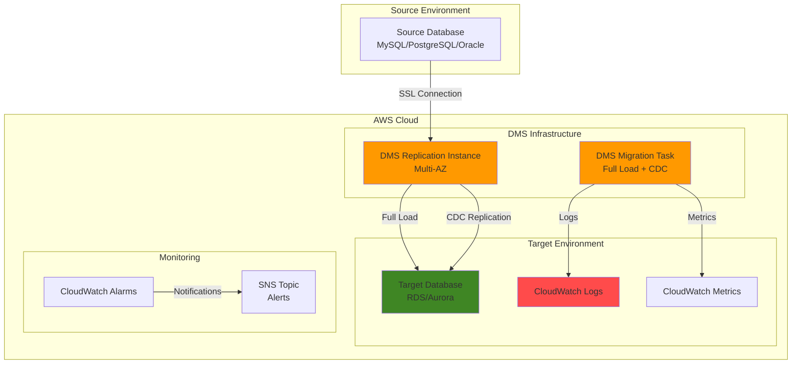

# Database Migration with AWS DMS

## Problem

Enterprise organizations often need to migrate databases from on-premises environments to AWS cloud, or between different database engines, while maintaining business continuity and minimizing downtime. Traditional migration approaches require extensive downtime, complex data export/import processes, and risk data inconsistency during the transition. These challenges become critical when dealing with large datasets, heterogeneous database platforms, or applications requiring near-zero downtime during migration.

## Solution

AWS Database Migration Service (DMS) provides a comprehensive solution for database migration with minimal downtime through continuous data replication. The service supports both homogeneous migrations (same database engine) and heterogeneous migrations (different database engines) with built-in schema conversion capabilities. DMS creates a replication instance that connects to source and target databases, performs initial full-load migration, and maintains ongoing replication for continuous data synchronization.

## Architecture Diagram



## Prerequisites

1. AWS account with DMS, RDS, VPC, and IAM permissions
2. AWS CLI v2 installed and configured (or AWS CloudShell)
3. Source database accessible from AWS (on-premises or EC2-based)
4. Target database endpoint (RDS instance or Aurora cluster)
5. Understanding of database administration and networking concepts
6. Estimated cost: $50-200/month for replication instance and storage

> **Note**: This recipe assumes you have an existing source database and target RDS instance. If you need to create these resources, refer to the [AWS RDS User Guide](https://docs.aws.amazon.com/AmazonRDS/latest/UserGuide/) for setup instructions.

## Preparation

```bash
# Set environment variables
export AWS_REGION=$(aws configure get region)
export AWS_ACCOUNT_ID=$(aws sts get-caller-identity \
    --query Account --output text)

# Generate unique identifiers for resources
RANDOM_SUFFIX=$(aws secretsmanager get-random-password \
    --exclude-punctuation --exclude-uppercase \
    --password-length 6 --require-each-included-type \
    --output text --query RandomPassword)

export DMS_REPLICATION_INSTANCE_ID="dms-replication-${RANDOM_SUFFIX}"
export DMS_SUBNET_GROUP_ID="dms-subnet-group-${RANDOM_SUFFIX}"
export DMS_SOURCE_ENDPOINT_ID="dms-source-${RANDOM_SUFFIX}"
export DMS_TARGET_ENDPOINT_ID="dms-target-${RANDOM_SUFFIX}"
export DMS_TASK_ID="dms-migration-task-${RANDOM_SUFFIX}"
export SNS_TOPIC_NAME="dms-migration-alerts-${RANDOM_SUFFIX}"

# Create SNS topic for notifications
aws sns create-topic \
    --name "$SNS_TOPIC_NAME" \
    --output text --query TopicArn > /tmp/sns_topic_arn.txt
export SNS_TOPIC_ARN=$(cat /tmp/sns_topic_arn.txt)

echo "✅ Environment variables configured"
echo "DMS Replication Instance ID: $DMS_REPLICATION_INSTANCE_ID"
echo "SNS Topic ARN: $SNS_TOPIC_ARN"
```

## Steps

1. **Create DMS Subnet Group**:

   DMS subnet groups define the network infrastructure where your replication instance will operate. These groups specify which subnets in your VPC the replication instance can use, ensuring secure network connectivity between source and target databases. The subnet group must include subnets from multiple Availability Zones to enable Multi-AZ deployments for high availability. This foundational network configuration is essential for establishing secure, isolated communication channels during migration operations.

   ```bash
   # Get VPC subnets (using default VPC for this example)
   VPC_ID=$(aws ec2 describe-vpcs \
       --filters "Name=is-default,Values=true" \
       --query 'Vpcs[0].VpcId' --output text)
   
   # Get subnet IDs from multiple AZs
   SUBNET_IDS=$(aws ec2 describe-subnets \
       --filters "Name=vpc-id,Values=$VPC_ID" \
       --query 'Subnets[*].SubnetId' --output text)
   
   # Create DMS subnet group
   aws dms create-replication-subnet-group \
       --replication-subnet-group-identifier "$DMS_SUBNET_GROUP_ID" \
       --replication-subnet-group-description \
       "DMS subnet group for database migration" \
       --subnet-ids $SUBNET_IDS
   
   echo "✅ DMS subnet group created: $DMS_SUBNET_GROUP_ID"
   ```

   The subnet group is now configured to support Multi-AZ deployments across your VPC's subnets. This provides the network foundation for your replication instance and ensures your migration traffic remains within your controlled network environment. Learn more about [DMS subnet groups](https://docs.aws.amazon.com/dms/latest/userguide/subnet-group.html).

2. **Create DMS Replication Instance**:

   The DMS replication instance serves as the compute engine that performs the actual data migration work. This managed EC2 instance runs the DMS software and handles all data transfer operations between your source and target databases. The instance size directly impacts migration performance - larger instances provide more CPU and memory for processing complex transformations and handling high-throughput workloads. Multi-AZ deployment ensures high availability by automatically failing over to a standby instance if the primary instance fails, though this doubles the cost.

   ```bash
   # Create Multi-AZ replication instance
   aws dms create-replication-instance \
       --replication-instance-identifier "$DMS_REPLICATION_INSTANCE_ID" \
       --replication-instance-class "dms.t3.medium" \
       --allocated-storage 100 \
       --replication-subnet-group-identifier "$DMS_SUBNET_GROUP_ID" \
       --multi-az \
       --publicly-accessible \
       --auto-minor-version-upgrade \
       --tags Key=Project,Value=DatabaseMigration \
       Key=Environment,Value=Production
   
   echo "✅ DMS replication instance creation initiated"
   
   # Wait for replication instance to be available
   echo "Waiting for replication instance to be available..."
   aws dms wait replication-instance-available \
       --replication-instance-arns \
       "arn:aws:dms:${AWS_REGION}:${AWS_ACCOUNT_ID}:rep:${DMS_REPLICATION_INSTANCE_ID}"
   
   echo "✅ DMS replication instance is available"
   ```

   The replication instance is now running and ready to handle migration tasks. This compute resource will orchestrate data movement between your databases while providing logging, monitoring, and error handling capabilities. The instance includes dedicated storage for temporary data buffering during migration operations. For more details, see [Working with DMS replication instances](https://docs.aws.amazon.com/dms/latest/userguide/CHAP_ReplicationInstance.html).

3. **Create Source Database Endpoint**:

   Database endpoints define the connection parameters for your source and target databases. The source endpoint contains all necessary information for DMS to establish a secure connection to your original database, including authentication credentials, network location, and SSL settings. DMS supports various database engines including MySQL, PostgreSQL, Oracle, SQL Server, and many others. SSL encryption is strongly recommended for production migrations to protect data in transit. The endpoint configuration must include a database user with sufficient privileges to read all tables and schemas that will be migrated.

   ```bash
   # Create source endpoint (MySQL example)
   # Replace with your actual source database connection details
   aws dms create-endpoint \
       --endpoint-identifier "$DMS_SOURCE_ENDPOINT_ID" \
       --endpoint-type source \
       --engine-name mysql \
       --server-name "your-source-db-server.example.com" \
       --port 3306 \
       --database-name "sourcedb" \
       --username "migration_user" \
       --password "your-secure-password" \
       --ssl-mode require \
       --tags Key=Project,Value=DatabaseMigration \
       Key=Type,Value=Source
   
   echo "✅ Source endpoint created: $DMS_SOURCE_ENDPOINT_ID"
   
   # Get source endpoint ARN
   SOURCE_ENDPOINT_ARN=$(aws dms describe-endpoints \
       --filters "Name=endpoint-id,Values=$DMS_SOURCE_ENDPOINT_ID" \
       --query 'Endpoints[0].EndpointArn' --output text)
   
   echo "Source endpoint ARN: $SOURCE_ENDPOINT_ARN"
   ```

   The source endpoint is now configured with secure connection parameters and ready for testing. This endpoint stores all connectivity information needed for DMS to access your source database throughout the migration process. The endpoint ARN serves as a unique identifier for referencing this database in migration tasks and connection tests.

4. **Create Target Database Endpoint**:

   The target endpoint defines the destination database where your migrated data will be stored. For AWS RDS instances, the endpoint configuration includes the RDS instance hostname, which follows the format `instance-name.region.rds.amazonaws.com`. The target database user must have comprehensive privileges including CREATE, DROP, ALTER, INSERT, UPDATE, and DELETE permissions to allow DMS to create tables, load data, and apply ongoing changes. Target endpoints support the same SSL security options as source endpoints to ensure end-to-end encryption.

   ```bash
   # Create target endpoint (RDS MySQL example)
   # Replace with your actual target RDS instance details
   aws dms create-endpoint \
       --endpoint-identifier "$DMS_TARGET_ENDPOINT_ID" \
       --endpoint-type target \
       --engine-name mysql \
       --server-name "your-rds-instance.${AWS_REGION}.rds.amazonaws.com" \
       --port 3306 \
       --database-name "targetdb" \
       --username "admin" \
       --password "your-rds-password" \
       --ssl-mode require \
       --tags Key=Project,Value=DatabaseMigration \
       Key=Type,Value=Target
   
   echo "✅ Target endpoint created: $DMS_TARGET_ENDPOINT_ID"
   
   # Get target endpoint ARN
   TARGET_ENDPOINT_ARN=$(aws dms describe-endpoints \
       --filters "Name=endpoint-id,Values=$DMS_TARGET_ENDPOINT_ID" \
       --query 'Endpoints[0].EndpointArn' --output text)
   
   echo "Target endpoint ARN: $TARGET_ENDPOINT_ARN"
   ```

   Both source and target endpoints are now configured with secure connection parameters. These endpoints establish the migration pathway from your source database to your target AWS RDS instance. The endpoints will be validated in the next step to ensure connectivity before proceeding with the migration task creation.

5. **Test Database Connections**:

   Connection testing is a critical validation step that verifies the replication instance can successfully communicate with both source and target databases. This process checks network connectivity, authentication credentials, and database permissions before proceeding with the actual migration. Connection testing helps identify and resolve potential issues early in the process, preventing migration failures that could occur hours into a long-running task. The test results provide detailed feedback about connection failures, enabling quick troubleshooting of network security groups, authentication problems, or database configuration issues.

   ```bash
   # Get replication instance ARN
   REPLICATION_INSTANCE_ARN=$(aws dms describe-replication-instances \
       --filters "Name=replication-instance-id,Values=$DMS_REPLICATION_INSTANCE_ID" \
       --query 'ReplicationInstances[0].ReplicationInstanceArn' --output text)
   
   # Test source endpoint connection
   aws dms test-connection \
       --replication-instance-arn "$REPLICATION_INSTANCE_ARN" \
       --endpoint-arn "$SOURCE_ENDPOINT_ARN"
   
   # Test target endpoint connection
   aws dms test-connection \
       --replication-instance-arn "$REPLICATION_INSTANCE_ARN" \
       --endpoint-arn "$TARGET_ENDPOINT_ARN"
   
   echo "✅ Database connection tests initiated"
   
   # Wait and check connection status
   sleep 30
   aws dms describe-connections \
       --filters "Name=replication-instance-arn,Values=$REPLICATION_INSTANCE_ARN"
   ```

   The connection tests validate that your replication instance can successfully reach both databases through your network configuration. Successful connections indicate that security groups, network ACLs, and database authentication are properly configured. Any connection failures must be resolved before proceeding to migration task creation.

6. **Create Table Mappings Configuration**:

   Table mappings define which database objects (tables, views, stored procedures) should be migrated and how they should be transformed during the migration process. The configuration uses selection rules to specify which objects to include or exclude from migration, and transformation rules to modify object names, data types, or column mappings. This powerful feature enables selective migration strategies where only specific schemas or tables are migrated, supporting phased migration approaches. The wildcard character (%) allows broad matching patterns, while specific names enable precise control over migration scope.

   ```bash
   # Create table mappings file for migration
   cat > /tmp/table-mappings.json << 'EOF'
   {
       "rules": [
           {
               "rule-type": "selection",
               "rule-id": "1",
               "rule-name": "include-all-tables",
               "object-locator": {
                   "schema-name": "%",
                   "table-name": "%"
               },
               "rule-action": "include",
               "filters": []
           },
           {
               "rule-type": "transformation",
               "rule-id": "2",
               "rule-name": "add-prefix",
               "rule-target": "table",
               "object-locator": {
                   "schema-name": "%",
                   "table-name": "%"
               },
               "rule-action": "add-prefix",
               "value": "migrated_"
           }
       ]
   }
   EOF
   
   echo "✅ Table mappings configuration created"
   ```

   The table mappings configuration is now ready to guide your migration process. This example includes all tables from all schemas and adds a "migrated_" prefix to table names in the target database. This approach enables safe migration testing without overwriting existing target data. For production migrations, you would typically remove the prefix transformation. Learn more about [table mappings](https://docs.aws.amazon.com/dms/latest/userguide/CHAP_Tasks.CustomizingTasks.TableMapping.html).

7. **Create Migration Task with Full Load and CDC**:

   The migration task is the core DMS component that orchestrates the actual data migration process. This task configuration combines full load migration (copying all existing data) with change data capture (CDC) to maintain real-time synchronization after the initial load completes. Full load migration transfers all existing data from source to target tables, while CDC captures and applies ongoing changes (inserts, updates, deletes) to keep databases synchronized during the migration window. This dual-phase approach minimizes downtime by allowing applications to continue running against the source database while changes are continuously replicated to the target.

   ```bash
   # Create migration task with comprehensive settings
   aws dms create-replication-task \
       --replication-task-identifier "$DMS_TASK_ID" \
       --source-endpoint-arn "$SOURCE_ENDPOINT_ARN" \
       --target-endpoint-arn "$TARGET_ENDPOINT_ARN" \
       --replication-instance-arn "$REPLICATION_INSTANCE_ARN" \
       --migration-type full-load-and-cdc \
       --table-mappings file:///tmp/table-mappings.json \
       --replication-task-settings '{
           "TargetMetadata": {
               "TargetSchema": "",
               "SupportLobs": true,
               "FullLobMode": false,
               "LobChunkSize": 0,
               "LimitedSizeLobMode": true,
               "LobMaxSize": 32,
               "InlineLobMaxSize": 0,
               "LoadMaxFileSize": 0,
               "ParallelLoadThreads": 0,
               "ParallelLoadBufferSize": 0,
               "BatchApplyEnabled": false,
               "TaskRecoveryTableEnabled": false,
               "ParallelApplyThreads": 0,
               "ParallelApplyBufferSize": 0,
               "ParallelApplyQueuesPerThread": 0
           },
           "FullLoadSettings": {
               "TargetTablePrepMode": "DROP_AND_CREATE",
               "CreatePkAfterFullLoad": false,
               "StopTaskCachedChangesApplied": false,
               "StopTaskCachedChangesNotApplied": false,
               "MaxFullLoadSubTasks": 8,
               "TransactionConsistencyTimeout": 600,
               "CommitRate": 10000
           },
           "Logging": {
               "EnableLogging": true,
               "LogComponents": [
                   {
                       "Id": "SOURCE_UNLOAD",
                       "Severity": "LOGGER_SEVERITY_DEFAULT"
                   },
                   {
                       "Id": "TARGET_LOAD",
                       "Severity": "LOGGER_SEVERITY_DEFAULT"
                   },
                   {
                       "Id": "SOURCE_CAPTURE",
                       "Severity": "LOGGER_SEVERITY_DEFAULT"
                   },
                   {
                       "Id": "TARGET_APPLY",
                       "Severity": "LOGGER_SEVERITY_DEFAULT"
                   }
               ]
           },
           "ControlTablesSettings": {
               "ControlSchema": "",
               "HistoryTimeslotInMinutes": 5,
               "HistoryTableEnabled": false,
               "SuspendedTablesTableEnabled": false,
               "StatusTableEnabled": false
           },
           "StreamBufferSettings": {
               "StreamBufferCount": 3,
               "StreamBufferSizeInMB": 8,
               "CtrlStreamBufferSizeInMB": 5
           },
           "ChangeProcessingDdlHandlingPolicy": {
               "HandleSourceTableDropped": true,
               "HandleSourceTableTruncated": true,
               "HandleSourceTableAltered": true
           },
           "ErrorBehavior": {
               "DataErrorPolicy": "LOG_ERROR",
               "DataTruncationErrorPolicy": "LOG_ERROR",
               "DataErrorEscalationPolicy": "SUSPEND_TABLE",
               "DataErrorEscalationCount": 0,
               "TableErrorPolicy": "SUSPEND_TABLE",
               "TableErrorEscalationPolicy": "STOP_TASK",
               "TableErrorEscalationCount": 0,
               "RecoverableErrorCount": -1,
               "RecoverableErrorInterval": 5,
               "RecoverableErrorThrottling": true,
               "RecoverableErrorThrottlingMax": 1800,
               "RecoverableErrorStopRetryAfterThrottlingMax": true,
               "ApplyErrorDeletePolicy": "IGNORE_RECORD",
               "ApplyErrorInsertPolicy": "LOG_ERROR",
               "ApplyErrorUpdatePolicy": "LOG_ERROR",
               "ApplyErrorEscalationPolicy": "LOG_ERROR",
               "ApplyErrorEscalationCount": 0,
               "ApplyErrorFailOnTruncationDdl": false,
               "FullLoadIgnoreConflicts": true,
               "FailOnTransactionConsistencyBreached": false,
               "FailOnNoTablesCaptured": true
           },
           "ChangeProcessingTuning": {
               "BatchApplyPreserveTransaction": true,
               "BatchApplyTimeoutMin": 1,
               "BatchApplyTimeoutMax": 30,
               "BatchApplyMemoryLimit": 500,
               "BatchSplitSize": 0,
               "MinTransactionSize": 1000,
               "CommitTimeout": 1,
               "MemoryLimitTotal": 1024,
               "MemoryKeepTime": 60,
               "StatementCacheSize": 50
           },
           "PostProcessingRules": null,
           "CharacterSetSettings": null,
           "LoopbackPreventionSettings": null,
           "BeforeImageSettings": null
       }' \
       --tags Key=Project,Value=DatabaseMigration \
       Key=Environment,Value=Production
   
   echo "✅ Migration task created: $DMS_TASK_ID"
   ```

   The migration task is now configured with comprehensive settings for data transfer, error handling, and performance optimization. The task will first perform a full load of all existing data, then switch to CDC mode to capture and apply ongoing changes. The extensive configuration options control aspects like parallel processing, memory usage, and error recovery, ensuring optimal performance for your specific migration scenario.

8. **Create Event Subscription for Monitoring**:

   Event subscriptions provide real-time notifications about critical migration events through Amazon SNS. These subscriptions monitor your migration tasks and automatically send alerts when important events occur, such as task failures, completions, or configuration changes. Event-driven monitoring enables proactive incident response and reduces the time to detect and resolve migration issues. The subscription can be configured to monitor specific event categories like failures, state changes, or configuration modifications, ensuring you receive only relevant notifications for your operational requirements.

   ```bash
   # Create DMS event subscription
   aws dms create-event-subscription \
       --subscription-name "dms-migration-events-${RANDOM_SUFFIX}" \
       --sns-topic-arn "$SNS_TOPIC_ARN" \
       --source-type replication-task \
       --event-categories "failure" "creation" "deletion" \
       --source-ids "$DMS_TASK_ID" \
       --enabled
   
   echo "✅ Event subscription created for monitoring"
   ```

   The event subscription now monitors your migration task and will send notifications to your SNS topic when critical events occur. This proactive monitoring enables immediate response to task failures or state changes, reducing downtime and improving migration reliability. You can extend this by adding email, SMS, or Lambda function subscriptions to the SNS topic for automated responses.

9. **Start Migration Task**:

   Starting the migration task initiates the actual data transfer process, beginning with the full load phase where all existing data is copied from source to target. During this phase, DMS reads all rows from source tables and writes them to corresponding target tables, creating the initial synchronized state. The task will then automatically transition to CDC mode to capture and apply ongoing changes. Task startup can take several minutes as DMS initializes connections, validates configurations, and prepares the migration environment. Progress monitoring during startup provides visibility into task state transitions and early indication of any configuration issues.

   ```bash
   # Get migration task ARN
   MIGRATION_TASK_ARN=$(aws dms describe-replication-tasks \
       --filters "Name=replication-task-id,Values=$DMS_TASK_ID" \
       --query 'ReplicationTasks[0].ReplicationTaskArn' --output text)
   
   # Start migration task
   aws dms start-replication-task \
       --replication-task-arn "$MIGRATION_TASK_ARN" \
       --start-replication-task-type start-replication
   
   echo "✅ Migration task started"
   echo "Task ARN: $MIGRATION_TASK_ARN"
   
   # Monitor task progress
   echo "Monitoring migration task progress..."
   aws dms describe-replication-tasks \
       --filters "Name=replication-task-id,Values=$DMS_TASK_ID" \
       --query 'ReplicationTasks[0].{Status:Status,Progress:ReplicationTaskStats}'
   ```

   The migration task is now actively transferring data from your source to target database. The task will progress through several states: starting, running (full load), and eventually running (CDC) for ongoing replication. Monitor the task status regularly to track progress and identify any issues that may require attention during the migration process.

10. **Enable Data Validation**:

    Data validation ensures migration accuracy by continuously comparing source and target data to identify discrepancies. Row-level validation performs detailed comparisons of individual records, detecting differences in data content, missing records, or extra records in either database. This validation process runs parallel to the migration task and provides detailed reports about data consistency issues. Validation is essential for mission-critical migrations where data accuracy is paramount, as it provides objective evidence that the migration completed successfully and all data was transferred correctly.

    ```bash
    # Modify task to enable data validation
    aws dms modify-replication-task \
        --replication-task-arn "$MIGRATION_TASK_ARN" \
        --replication-task-settings '{
            "ValidationSettings": {
                "EnableValidation": true,
                "ValidationMode": "ROW_LEVEL",
                "ThreadCount": 5,
                "PartitionSize": 10000,
                "FailureMaxCount": 10000,
                "RecordFailureDelayInMinutes": 5,
                "RecordSuspendDelayInMinutes": 30,
                "MaxKeyColumnSize": 8096,
                "TableFailureMaxCount": 1000,
                "ValidationOnly": false,
                "HandleCollationDiff": false,
                "RecordFailureDelayLimitInMinutes": 0,
                "SkipLobColumns": false,
                "ValidationPartialLobSize": 0,
                "ValidationQueryCdcDelaySeconds": 0
            }
        }'
    
    echo "✅ Data validation enabled for migration task"
    ```

    Data validation is now active and will continuously compare source and target data to ensure consistency. The validation process runs in parallel with your migration task and provides detailed statistics about data accuracy. Validation results are available through the DMS console and API, enabling you to verify migration success and identify any data discrepancies that require attention. Learn more about [DMS data validation](https://docs.aws.amazon.com/dms/latest/userguide/CHAP_Validating.html).

11. **Create CloudWatch Alarms for Monitoring**:

    CloudWatch alarms provide automated monitoring and alerting for critical migration metrics, enabling proactive response to performance issues or task failures. These alarms continuously monitor key DMS metrics like task status, replication latency, and resource utilization, triggering notifications when thresholds are breached. The alarm system is essential for maintaining migration reliability, as it can detect problems like network connectivity issues, resource exhaustion, or task failures that might otherwise go unnoticed for extended periods. Proper alarm configuration balances early warning capabilities with false positive prevention, ensuring operations teams receive actionable alerts without alarm fatigue.

    ```bash
    # Create CloudWatch alarm for task failures
    aws cloudwatch put-metric-alarm \
        --alarm-name "DMS-Task-Failure-${RANDOM_SUFFIX}" \
        --alarm-description "Alert when DMS task fails" \
        --metric-name "TaskState" \
        --namespace "AWS/DMS" \
        --statistic Maximum \
        --period 300 \
        --threshold 0 \
        --comparison-operator LessThanThreshold \
        --evaluation-periods 1 \
        --alarm-actions "$SNS_TOPIC_ARN" \
        --dimensions Name=ReplicationInstanceIdentifier,Value="$DMS_REPLICATION_INSTANCE_ID" \
        Name=ReplicationTaskIdentifier,Value="$DMS_TASK_ID"
    
    # Create alarm for high latency
    aws cloudwatch put-metric-alarm \
        --alarm-name "DMS-High-Latency-${RANDOM_SUFFIX}" \
        --alarm-description "Alert when DMS replication latency is high" \
        --metric-name "CDCLatencySource" \
        --namespace "AWS/DMS" \
        --statistic Average \
        --period 300 \
        --threshold 300 \
        --comparison-operator GreaterThanThreshold \
        --evaluation-periods 2 \
        --alarm-actions "$SNS_TOPIC_ARN" \
        --dimensions Name=ReplicationInstanceIdentifier,Value="$DMS_REPLICATION_INSTANCE_ID" \
        Name=ReplicationTaskIdentifier,Value="$DMS_TASK_ID"
    
    echo "✅ CloudWatch alarms configured for migration monitoring"
    ```

    > **Tip**: Configure CloudWatch alarms with appropriate thresholds to balance between early warning and false positive alerts. Monitor key metrics like CDCLatencySource, CDCLatencyTarget, and FreeableMemory to ensure optimal migration performance.

12. **Monitor Migration Progress and Performance**:

    Continuous monitoring provides visibility into migration progress, performance metrics, and potential issues throughout the migration process. The monitoring function combines task-level statistics with table-level details to provide comprehensive insight into migration health. Task-level monitoring tracks overall progress, error counts, and timing information, while table-level monitoring shows the status of individual tables, record counts, and validation states. This multi-level monitoring approach enables early detection of performance bottlenecks, data quality issues, or configuration problems that could impact migration success.

    ```bash
    # Function to monitor migration progress
    monitor_migration() {
        echo "=== Migration Task Status ==="
        aws dms describe-replication-tasks \
            --filters "Name=replication-task-id,Values=$DMS_TASK_ID" \
            --query 'ReplicationTasks[0].{
                Status:Status,
                Progress:ReplicationTaskStats.TablesLoaded,
                TotalTables:ReplicationTaskStats.TablesLoading,
                ErrorCount:ReplicationTaskStats.TablesErrored,
                LastUpdate:ReplicationTaskStats.FreshStartDate
            }'
        
        echo "=== Table Statistics ==="
        aws dms describe-table-statistics \
            --replication-task-arn "$MIGRATION_TASK_ARN" \
            --query 'TableStatistics[*].{
                Schema:SchemaName,
                Table:TableName,
                Status:TableState,
                Records:FullLoadRows,
                Inserts:Inserts,
                Updates:Updates,
                Deletes:Deletes,
                Validation:ValidationState
            }'
    }
    
    # Monitor migration (run this periodically)
    monitor_migration
    
    echo "✅ Migration monitoring dashboard created"
    ```

    The monitoring framework provides comprehensive visibility into your migration progress and performance. Run the monitoring function regularly to track progress, identify slow-performing tables, and verify that data validation is proceeding successfully. This information is crucial for making informed decisions about migration timing and troubleshooting any issues that arise during the process.

## Validation & Testing

1. **Verify Migration Task Status**:

   ```bash
   # Check overall task status
   aws dms describe-replication-tasks \
       --filters "Name=replication-task-id,Values=$DMS_TASK_ID" \
       --query 'ReplicationTasks[0].{
           Status:Status,
           LastFailureMessage:LastFailureMessage,
           StopReason:StopReason
       }'
   ```

   Expected output: Status should be "running" or "load-complete"

2. **Test Data Consistency**:

   ```bash
   # Check data validation results
   aws dms describe-table-statistics \
       --replication-task-arn "$MIGRATION_TASK_ARN" \
       --query 'TableStatistics[?ValidationState!=`null`].{
           Schema:SchemaName,
           Table:TableName,
           ValidationState:ValidationState,
           ValidationFailedRecords:ValidationFailedRecords,
           ValidationSuspendedRecords:ValidationSuspendedRecords
       }'
   ```

3. **Monitor Replication Metrics**:

   ```bash
   # Get CloudWatch metrics for the migration task
   aws cloudwatch get-metric-statistics \
       --namespace "AWS/DMS" \
       --metric-name "CDCLatencySource" \
       --dimensions Name=ReplicationInstanceIdentifier,Value="$DMS_REPLICATION_INSTANCE_ID" \
       Name=ReplicationTaskIdentifier,Value="$DMS_TASK_ID" \
       --start-time $(date -u -d '1 hour ago' +%Y-%m-%dT%H:%M:%S) \
       --end-time $(date -u +%Y-%m-%dT%H:%M:%S) \
       --period 300 \
       --statistics Average
   ```

4. **Test Database Connectivity Post-Migration**:

   ```bash
   # Test endpoint connections
   aws dms test-connection \
       --replication-instance-arn "$REPLICATION_INSTANCE_ARN" \
       --endpoint-arn "$TARGET_ENDPOINT_ARN"
   
   # Verify connection status
   aws dms describe-connections \
       --filters "Name=endpoint-arn,Values=$TARGET_ENDPOINT_ARN" \
       --query 'Connections[0].Status'
   ```

## Cleanup

1. **Stop Migration Task**:

   ```bash
   # Stop replication task
   aws dms stop-replication-task \
       --replication-task-arn "$MIGRATION_TASK_ARN"
   
   # Wait for task to stop
   echo "Waiting for migration task to stop..."
   sleep 30
   
   echo "✅ Migration task stopped"
   ```

2. **Delete Migration Task**:

   ```bash
   # Delete replication task
   aws dms delete-replication-task \
       --replication-task-arn "$MIGRATION_TASK_ARN"
   
   echo "✅ Migration task deleted"
   ```

3. **Delete Database Endpoints**:

   ```bash
   # Delete source endpoint
   aws dms delete-endpoint \
       --endpoint-arn "$SOURCE_ENDPOINT_ARN"
   
   # Delete target endpoint
   aws dms delete-endpoint \
       --endpoint-arn "$TARGET_ENDPOINT_ARN"
   
   echo "✅ Database endpoints deleted"
   ```

4. **Delete Replication Instance**:

   ```bash
   # Delete replication instance
   aws dms delete-replication-instance \
       --replication-instance-arn "$REPLICATION_INSTANCE_ARN"
   
   echo "✅ Replication instance deletion initiated"
   ```

5. **Delete Supporting Resources**:

   ```bash
   # Delete subnet group
   aws dms delete-replication-subnet-group \
       --replication-subnet-group-identifier "$DMS_SUBNET_GROUP_ID"
   
   # Delete event subscription
   aws dms delete-event-subscription \
       --subscription-name "dms-migration-events-${RANDOM_SUFFIX}"
   
   # Delete SNS topic
   aws sns delete-topic --topic-arn "$SNS_TOPIC_ARN"
   
   # Delete CloudWatch alarms
   aws cloudwatch delete-alarms \
       --alarm-names "DMS-Task-Failure-${RANDOM_SUFFIX}" \
       "DMS-High-Latency-${RANDOM_SUFFIX}"
   
   # Clean up local files
   rm -f /tmp/table-mappings.json /tmp/sns_topic_arn.txt
   
   echo "✅ All resources cleaned up"
   ```

## Discussion

AWS Database Migration Service provides enterprise-grade capabilities for migrating databases with minimal downtime through its sophisticated replication architecture. The service operates through a dedicated replication instance that maintains separate connections to source and target databases, enabling continuous data synchronization while the source database remains operational following [AWS Well-Architected Framework](https://docs.aws.amazon.com/wellarchitected/latest/framework/welcome.html) principles.

The migration process follows a two-phase approach: full load migration transfers existing data, followed by change data capture (CDC) that replicates ongoing transactions. This architecture ensures data consistency while minimizing business disruption. DMS supports both homogeneous migrations (same database engine) and heterogeneous migrations (different engines), with built-in schema conversion capabilities for complex transformations using AWS Schema Conversion Tool (SCT) when needed.

Critical design decisions include replication instance sizing, which directly impacts migration performance and cost. Multi-AZ deployment provides high availability but increases costs, while single-AZ deployment offers cost savings with acceptable risk for many use cases. The table mappings configuration allows fine-grained control over which data gets migrated, enabling selective migration strategies and data transformation during transit.

Data validation is essential for mission-critical migrations, providing automated verification that source and target data remain consistent. The service supports both row-level and column-level validation, with configurable failure thresholds and automated remediation capabilities. Performance monitoring through CloudWatch metrics enables proactive identification of bottlenecks and optimization opportunities, following [AWS monitoring best practices](https://docs.aws.amazon.com/AmazonCloudWatch/latest/monitoring/WhatIsCloudWatch.html).

> **Warning**: Database migration can impact source database performance during full load phases. Always test migration procedures in non-production environments and plan for adequate source database resources following [AWS DMS best practices](https://docs.aws.amazon.com/dms/latest/userguide/CHAP_BestPractices.html).

For more information on DMS implementation guidance, refer to the [AWS DMS User Guide](https://docs.aws.amazon.com/dms/latest/userguide/) and [AWS DMS Troubleshooting Guide](https://docs.aws.amazon.com/dms/latest/userguide/CHAP_Troubleshooting.html).

## Challenge

Extend this solution by implementing these advanced migration scenarios:

1. **Implement Schema Conversion with AWS SCT** - Set up AWS Schema Conversion Tool for heterogeneous migrations between different database engines (e.g., Oracle to PostgreSQL), including stored procedure conversion and data type mappings using the [AWS SCT User Guide](https://docs.aws.amazon.com/SchemaConversionTool/latest/userguide/).

2. **Configure Multi-Region Migration Strategy** - Design a migration architecture that spans multiple AWS regions with cross-region replication, including failover mechanisms and disaster recovery procedures using [AWS DMS cross-region capabilities](https://docs.aws.amazon.com/dms/latest/userguide/CHAP_ReplicationInstance.html).

3. **Build Automated Migration Validation Pipeline** - Create a comprehensive data validation framework using AWS Lambda and Step Functions that compares source and target data integrity, generates validation reports, and triggers automated remediation workflows.

4. **Implement Blue-Green Migration with Application Cutover** - Design a complete migration strategy that includes application endpoint switching, DNS failover, and rollback procedures using AWS Route 53 and Application Load Balancer for zero-downtime transitions.

5. **Create Advanced Monitoring and Alerting System** - Build a comprehensive monitoring solution using Amazon QuickSight dashboards, custom CloudWatch metrics, and automated alerting for migration KPIs including latency, throughput, and error rates with custom Lambda functions for enhanced analytics.

## Infrastructure Code

### Available Infrastructure as Code:

- [Infrastructure Code Overview](code/README.md) - Detailed description of all infrastructure components
- [AWS CDK (Python)](code/cdk-python/) - AWS CDK Python implementation
- [AWS CDK (TypeScript)](code/cdk-typescript/) - AWS CDK TypeScript implementation
- [CloudFormation](code/cloudformation.yaml) - AWS CloudFormation template
- [Bash CLI Scripts](code/scripts/) - Example bash scripts using AWS CLI commands to deploy infrastructure
- [Terraform](code/terraform/) - Terraform configuration files