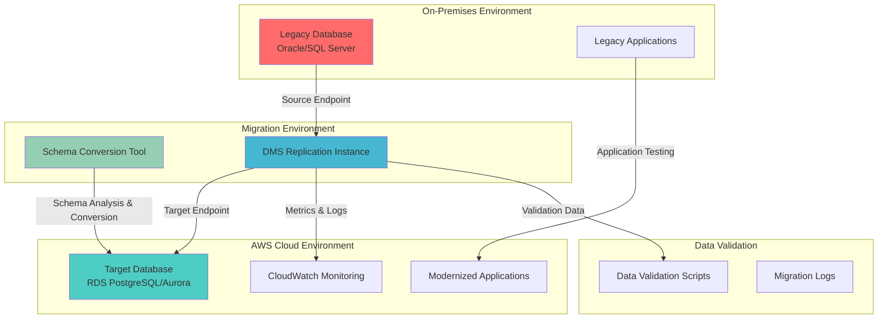

# Database Migration with Schema Conversion Tool


## Problem

Organizations running legacy database systems on-premises face significant challenges when modernizing their data infrastructure. These systems often use proprietary database engines with custom schemas, stored procedures, and complex data relationships that are difficult to migrate. Manual migration processes are time-consuming, error-prone, and require extensive downtime, impacting business operations and customer experience. Without proper migration strategies, businesses risk data loss, extended outages, and failed modernization initiatives.

## Solution

AWS Database Migration Service (DMS) combined with the Schema Conversion Tool (SCT) provides a comprehensive approach to migrating databases with minimal downtime. DMS handles the data replication process while SCT converts database schemas, stored procedures, and application code to be compatible with target database engines. This solution enables continuous data synchronization during migration, allowing businesses to validate data integrity before switching over to the new system.

## Architecture Diagram



## Prerequisites

1. AWS account with DMS, RDS, and EC2 permissions for replication instance creation
2. AWS CLI v2 installed and configured (or AWS CloudShell)
3. Source database with appropriate access credentials and network connectivity
4. Understanding of database schemas, stored procedures, and data migration concepts
5. AWS Schema Conversion Tool downloaded and installed locally
6. Estimated cost: $150-300 for replication instance and RDS database during migration period

> **Note**: Migration costs vary significantly based on replication instance size, migration duration, and target database configuration.

## Preparation

```bash
# Set environment variables
export AWS_REGION=$(aws configure get region)
export AWS_ACCOUNT_ID=$(aws sts get-caller-identity \
    --query Account --output text)

# Generate unique identifiers for resources
RANDOM_SUFFIX=$(aws secretsmanager get-random-password \
    --exclude-punctuation --exclude-uppercase \
    --password-length 6 --require-each-included-type \
    --output text --query RandomPassword)

export DMS_REPLICATION_INSTANCE_ID="dms-migration-${RANDOM_SUFFIX}"
export DMS_SUBNET_GROUP_ID="dms-subnet-group-${RANDOM_SUFFIX}"
export SOURCE_ENDPOINT_ID="source-endpoint-${RANDOM_SUFFIX}"
export TARGET_ENDPOINT_ID="target-endpoint-${RANDOM_SUFFIX}"
export MIGRATION_TASK_ID="migration-task-${RANDOM_SUFFIX}"

# Create VPC and networking components for DMS
export VPC_ID=$(aws ec2 create-vpc \
    --cidr-block 10.0.0.0/16 \
    --query 'Vpc.VpcId' --output text)

aws ec2 create-tags \
    --resources $VPC_ID \
    --tags Key=Name,Value=dms-migration-vpc

# Create subnets in different availability zones
export SUBNET_1_ID=$(aws ec2 create-subnet \
    --vpc-id $VPC_ID \
    --cidr-block 10.0.1.0/24 \
    --availability-zone ${AWS_REGION}a \
    --query 'Subnet.SubnetId' --output text)

export SUBNET_2_ID=$(aws ec2 create-subnet \
    --vpc-id $VPC_ID \
    --cidr-block 10.0.2.0/24 \
    --availability-zone ${AWS_REGION}b \
    --query 'Subnet.SubnetId' --output text)

# Create internet gateway and route table for connectivity
export IGW_ID=$(aws ec2 create-internet-gateway \
    --query 'InternetGateway.InternetGatewayId' --output text)

aws ec2 attach-internet-gateway \
    --internet-gateway-id $IGW_ID \
    --vpc-id $VPC_ID

echo "✅ VPC and networking components created successfully"
```

## Steps

1. **Create DMS Replication Subnet Group**:

   AWS DMS requires a subnet group to launch replication instances within your VPC infrastructure. A subnet group defines the network placement and availability zone distribution for your replication instance, ensuring high availability and proper network isolation. This foundational step establishes the network layer that enables secure communication between your source database, DMS replication instance, and target database.

   ```bash
   # Create subnet group for DMS replication instance
   aws dms create-replication-subnet-group \
       --replication-subnet-group-identifier $DMS_SUBNET_GROUP_ID \
       --replication-subnet-group-description "Subnet group for DMS migration" \
       --subnet-ids $SUBNET_1_ID $SUBNET_2_ID \
       --tags Key=Environment,Value=Migration \
              Key=Project,Value=DatabaseMigration
   
   echo "✅ DMS subnet group created: $DMS_SUBNET_GROUP_ID"
   ```

   The subnet group is now configured across multiple availability zones, providing the network foundation for your DMS replication instance. This multi-AZ configuration ensures high availability and fault tolerance for your migration infrastructure.

2. **Create DMS Replication Instance**:

   The DMS replication instance is the core compute resource that performs the actual data migration work. It reads from your source database, processes the data according to your migration rules, and writes to your target database. The instance size directly impacts migration performance - larger instances can handle more concurrent connections and process data faster, while smaller instances are more cost-effective for smaller migrations.

   ```bash
   # Create replication instance for data migration
   aws dms create-replication-instance \
       --replication-instance-identifier $DMS_REPLICATION_INSTANCE_ID \
       --replication-instance-class dms.t3.medium \
       --allocated-storage 100 \
       --replication-subnet-group-identifier $DMS_SUBNET_GROUP_ID \
       --publicly-accessible true \
       --multi-az false \
       --engine-version "3.5.2" \
       --tags Key=Environment,Value=Migration \
              Key=Project,Value=DatabaseMigration
   
   echo "✅ DMS replication instance creation initiated"
   
   # Wait for replication instance to be available
   aws dms wait replication-instance-available \
       --replication-instance-identifier $DMS_REPLICATION_INSTANCE_ID
   
   echo "✅ DMS replication instance is available"
   ```

   Your replication instance is now provisioned and ready to handle migration tasks. The t3.medium instance class provides 2 vCPUs and 4 GB of memory, suitable for moderate-sized migrations. For production environments, consider using larger instances or enabling Multi-AZ for enhanced availability.

3. **Create Target RDS Database**:

   The target database serves as the destination for your migrated data and represents the modernized database platform. PostgreSQL is chosen here for its advanced features, JSON support, and cost-effectiveness compared to commercial databases. RDS manages the underlying infrastructure, backups, and maintenance, allowing you to focus on your application modernization rather than database administration.

   ```bash
   # Create RDS subnet group
   aws rds create-db-subnet-group \
       --db-subnet-group-name rds-subnet-group-${RANDOM_SUFFIX} \
       --db-subnet-group-description "RDS subnet group for migration target" \
       --subnet-ids $SUBNET_1_ID $SUBNET_2_ID
   
   # Create target PostgreSQL database
   export TARGET_DB_INSTANCE_ID="target-db-${RANDOM_SUFFIX}"
   export TARGET_DB_PASSWORD=$(aws secretsmanager get-random-password \
       --exclude-characters '"@/\' \
       --password-length 16 \
       --output text --query RandomPassword)
   
   aws rds create-db-instance \
       --db-instance-identifier $TARGET_DB_INSTANCE_ID \
       --db-instance-class db.t3.medium \
       --engine postgres \
       --engine-version 14.9 \
       --master-username dbadmin \
       --master-user-password $TARGET_DB_PASSWORD \
       --allocated-storage 100 \
       --db-subnet-group-name rds-subnet-group-${RANDOM_SUFFIX} \
       --publicly-accessible true \
       --backup-retention-period 7 \
       --tags Key=Environment,Value=Migration \
              Key=Project,Value=DatabaseMigration
   
   echo "✅ Target RDS database creation initiated"
   
   # Wait for RDS instance to be available
   aws rds wait db-instance-available \
       --db-instance-identifier $TARGET_DB_INSTANCE_ID
   
   echo "✅ Target RDS database is available"
   ```

   Your target PostgreSQL database is now ready to receive migrated data. The 7-day backup retention period ensures data protection during the migration process, and the publicly accessible configuration allows DMS to connect from your replication instance.

   > **Warning**: In production environments, consider using private subnets and VPC endpoints for enhanced security rather than publicly accessible databases.

4. **Configure Source Database Endpoint**:

   DMS endpoints define the connection parameters for your source and target databases. The source endpoint establishes the connection to your existing database, enabling DMS to read data, capture changes, and understand the database structure. Proper endpoint configuration is crucial for successful migration - it includes not only connection details but also specific engine settings that optimize data extraction and change capture.

   ```bash
   # Create source database endpoint (example for Oracle)
   # Replace with your actual source database connection details
   export SOURCE_DB_HOST="your-source-database-host"
   export SOURCE_DB_PORT="1521"
   export SOURCE_DB_USERNAME="your-source-username"
   export SOURCE_DB_PASSWORD="your-source-password"
   export SOURCE_DB_NAME="your-source-database"
   
   aws dms create-endpoint \
       --endpoint-identifier $SOURCE_ENDPOINT_ID \
       --endpoint-type source \
       --engine-name oracle \
       --server-name $SOURCE_DB_HOST \
       --port $SOURCE_DB_PORT \
       --username $SOURCE_DB_USERNAME \
       --password $SOURCE_DB_PASSWORD \
       --database-name $SOURCE_DB_NAME \
       --tags Key=Environment,Value=Migration \
              Key=EndpointType,Value=Source
   
   echo "✅ Source database endpoint created"
   ```

   The source endpoint is now configured with the necessary credentials and connection information. DMS will use this endpoint to establish connections for both initial data loading and ongoing change data capture (CDC) operations.

5. **Configure Target Database Endpoint**:

   The target endpoint defines how DMS connects to your destination database to load data and apply ongoing changes. Unlike the source endpoint which primarily reads data, the target endpoint must handle write operations, transaction management, and constraint validation. PostgreSQL's advanced features like JSONB support and extensibility make it an excellent target for modernizing legacy database systems.

   ```bash
   # Get target database endpoint details
   export TARGET_DB_HOST=$(aws rds describe-db-instances \
       --db-instance-identifier $TARGET_DB_INSTANCE_ID \
       --query 'DBInstances[0].Endpoint.Address' --output text)
   
   # Create target database endpoint
   aws dms create-endpoint \
       --endpoint-identifier $TARGET_ENDPOINT_ID \
       --endpoint-type target \
       --engine-name postgres \
       --server-name $TARGET_DB_HOST \
       --port 5432 \
       --username dbadmin \
       --password $TARGET_DB_PASSWORD \
       --database-name postgres \
       --tags Key=Environment,Value=Migration \
              Key=EndpointType,Value=Target
   
   echo "✅ Target database endpoint created"
   ```

   Both source and target endpoints are now configured and ready for connectivity testing. These endpoints form the foundation for all data migration operations between your legacy system and the modernized PostgreSQL database.

6. **Test Database Connectivity**:

   Connection testing validates that your replication instance can successfully communicate with both source and target databases. This critical step identifies networking issues, authentication problems, or configuration errors before starting the actual migration. DMS performs comprehensive connectivity tests including network reachability, credential validation, and basic database operations to ensure your migration will proceed without connectivity failures.

   ```bash
   # Test source endpoint connectivity
   aws dms test-connection \
       --replication-instance-identifier $DMS_REPLICATION_INSTANCE_ID \
       --endpoint-identifier $SOURCE_ENDPOINT_ID
   
   # Test target endpoint connectivity
   aws dms test-connection \
       --replication-instance-identifier $DMS_REPLICATION_INSTANCE_ID \
       --endpoint-identifier $TARGET_ENDPOINT_ID
   
   echo "✅ Database connectivity tests initiated"
   
   # Wait for connection tests to complete
   sleep 30
   
   # Check connection test results
   aws dms describe-connections \
       --filter Name=endpoint-identifier,Values=$SOURCE_ENDPOINT_ID \
       --query 'Connections[0].Status' --output text
   
   aws dms describe-connections \
       --filter Name=endpoint-identifier,Values=$TARGET_ENDPOINT_ID \
       --query 'Connections[0].Status' --output text
   ```

   Successful connectivity tests confirm that your replication instance can access both databases and is ready to begin data migration operations. If tests fail, review network security groups, database permissions, and connection parameters before proceeding.

7. **Create Migration Task Configuration**:

   Migration task configuration defines what data to migrate and how to transform it during the process. Table mappings specify which schemas, tables, and columns to include or exclude from migration, while task settings control performance, logging, and error handling behavior. This configuration is crucial for ensuring that only relevant data is migrated and that the process handles errors gracefully. The JSON configuration format allows for precise control over the migration process.

   ```bash
   # Create table mappings configuration
   cat > table-mappings.json << EOF
   {
       "rules": [
           {
               "rule-type": "selection",
               "rule-id": "1",
               "rule-name": "1",
               "object-locator": {
                   "schema-name": "HR",
                   "table-name": "%"
               },
               "rule-action": "include",
               "filters": []
           },
           {
               "rule-type": "transformation",
               "rule-id": "2",
               "rule-name": "2",
               "rule-target": "schema",
               "object-locator": {
                   "schema-name": "HR"
               },
               "rule-action": "rename",
               "value": "hr_schema"
           }
       ]
   }
   EOF
   
   # Create migration task settings
   cat > task-settings.json << EOF
   {
       "TargetMetadata": {
           "TargetSchema": "",
           "SupportLobs": true,
           "FullLobMode": false,
           "LobChunkSize": 0,
           "LimitedSizeLobMode": true,
           "LobMaxSize": 32,
           "InlineLobMaxSize": 0,
           "LoadMaxFileSize": 0,
           "ParallelLoadThreads": 0,
           "ParallelLoadBufferSize": 0,
           "BatchApplyEnabled": false,
           "TaskRecoveryTableEnabled": false,
           "ParallelApplyThreads": 0,
           "ParallelApplyBufferSize": 0,
           "ParallelApplyQueuesPerThread": 0
       },
       "FullLoadSettings": {
           "TargetTablePrepMode": "DROP_AND_CREATE",
           "CreatePkAfterFullLoad": false,
           "StopTaskCachedChangesApplied": false,
           "StopTaskCachedChangesNotApplied": false,
           "MaxFullLoadSubTasks": 8,
           "TransactionConsistencyTimeout": 600,
           "CommitRate": 10000
       },
       "Logging": {
           "EnableLogging": true,
           "LogComponents": [
               {
                   "Id": "TRANSFORMATION",
                   "Severity": "LOGGER_SEVERITY_DEFAULT"
               },
               {
                   "Id": "SOURCE_UNLOAD",
                   "Severity": "LOGGER_SEVERITY_DEFAULT"
               },
               {
                   "Id": "TARGET_LOAD",
                   "Severity": "LOGGER_SEVERITY_DEFAULT"
               }
           ],
           "CloudWatchLogGroup": null,
           "CloudWatchLogStream": null
       },
       "ControlTablesSettings": {
           "historyTimeslotInMinutes": 5,
           "ControlSchema": "",
           "HistoryTimeslotInMinutes": 5,
           "HistoryTableEnabled": false,
           "SuspendedTablesTableEnabled": false,
           "StatusTableEnabled": false,
           "FullLoadExceptionTableEnabled": false
       },
       "StreamBufferSettings": {
           "StreamBufferCount": 3,
           "StreamBufferSizeInMB": 8,
           "CtrlStreamBufferSizeInMB": 5
       },
       "ErrorBehavior": {
           "DataErrorPolicy": "LOG_ERROR",
           "DataTruncationErrorPolicy": "LOG_ERROR",
           "DataErrorEscalationPolicy": "SUSPEND_TABLE",
           "DataErrorEscalationCount": 0,
           "TableErrorPolicy": "SUSPEND_TABLE",
           "TableErrorEscalationPolicy": "STOP_TASK",
           "TableErrorEscalationCount": 0,
           "RecoverableErrorCount": -1,
           "RecoverableErrorInterval": 5,
           "RecoverableErrorThrottling": true,
           "RecoverableErrorThrottlingMax": 1800,
           "RecoverableErrorStopRetryAfterThrottlingMax": false,
           "ApplyErrorDeletePolicy": "IGNORE_RECORD",
           "ApplyErrorInsertPolicy": "LOG_ERROR",
           "ApplyErrorUpdatePolicy": "LOG_ERROR",
           "ApplyErrorEscalationPolicy": "LOG_ERROR",
           "ApplyErrorEscalationCount": 0,
           "ApplyErrorFailOnTruncationDdl": false,
           "FullLoadIgnoreConflicts": true,
           "FailOnTransactionConsistencyBreached": false,
           "FailOnNoTablesCaptured": true
       },
       "ChangeProcessingDdlHandlingPolicy": {
           "HandleSourceTableDropped": true,
           "HandleSourceTableTruncated": true,
           "HandleSourceTableAltered": true
       },
       "ChangeProcessingTuning": {
           "BatchApplyPreserveTransaction": true,
           "BatchApplyTimeoutMin": 1,
           "BatchApplyTimeoutMax": 30,
           "BatchApplyMemoryLimit": 500,
           "BatchSplitSize": 0,
           "MinTransactionSize": 1000,
           "CommitTimeout": 1,
           "MemoryLimitTotal": 1024,
           "MemoryKeepTime": 60,
           "StatementCacheSize": 50
       },
       "PostProcessingRules": null,
       "CharacterSetSettings": null,
       "LoopbackPreventionSettings": null,
       "BeforeImageSettings": null,
       "FailTaskWhenCleanTaskResourceFailed": false
   }
   EOF
   
   echo "✅ Migration task configuration files created"
   ```

   The configuration files define comprehensive migration rules including table selection, data transformation, and error handling policies. These settings ensure that your migration handles various scenarios gracefully while maintaining data integrity and providing detailed logging for troubleshooting.

   > **Tip**: Review the DMS task settings documentation at https://docs.aws.amazon.com/dms/latest/userguide/CHAP_Tasks.CustomizingTasks.TaskSettings.html to understand all available configuration options and optimize settings for your specific migration requirements.

8. **Create and Start Full Load Migration Task**:

   The full load migration task performs the initial bulk data transfer from your source to target database. This process reads all existing data from selected tables and loads it into the target database, creating the foundation for your migrated system. Full load migration is optimized for throughput and typically uses multiple parallel threads to maximize data transfer speed while maintaining data consistency.

   ```bash
   # Create migration task for full load
   aws dms create-replication-task \
       --replication-task-identifier $MIGRATION_TASK_ID \
       --source-endpoint-identifier $SOURCE_ENDPOINT_ID \
       --target-endpoint-identifier $TARGET_ENDPOINT_ID \
       --replication-instance-identifier $DMS_REPLICATION_INSTANCE_ID \
       --migration-type full-load \
       --table-mappings file://table-mappings.json \
       --replication-task-settings file://task-settings.json \
       --tags Key=Environment,Value=Migration \
              Key=TaskType,Value=FullLoad
   
   echo "✅ Migration task created: $MIGRATION_TASK_ID"
   
   # Start the migration task
   aws dms start-replication-task \
       --replication-task-identifier $MIGRATION_TASK_ID \
       --start-replication-task-type start-replication
   
   echo "✅ Full load migration task started"
   ```

   The full load migration is now running and will transfer all existing data from your source database to the target PostgreSQL database. Monitor the task progress through the AWS console or CLI to track completion and identify any potential issues.

9. **Create Ongoing Replication Task**:

   Continuous Data Capture (CDC) enables near-zero downtime migrations by capturing and applying ongoing changes from your source database. This feature allows your source system to remain operational during migration while keeping the target database synchronized. CDC reads database transaction logs to identify changes (inserts, updates, deletes) and applies them to the target database in near real-time, ensuring data consistency throughout the migration process.

   ```bash
   # Create ongoing replication task for CDC
   export CDC_TASK_ID="cdc-task-${RANDOM_SUFFIX}"
   
   aws dms create-replication-task \
       --replication-task-identifier $CDC_TASK_ID \
       --source-endpoint-identifier $SOURCE_ENDPOINT_ID \
       --target-endpoint-identifier $TARGET_ENDPOINT_ID \
       --replication-instance-identifier $DMS_REPLICATION_INSTANCE_ID \
       --migration-type full-load-and-cdc \
       --table-mappings file://table-mappings.json \
       --replication-task-settings file://task-settings.json \
       --tags Key=Environment,Value=Migration \
              Key=TaskType,Value=CDC
   
   echo "✅ CDC replication task created: $CDC_TASK_ID"
   ```

   The CDC task is now configured to handle both full load and ongoing replication. This approach ensures that all existing data is migrated first, then any new changes are captured and applied continuously, maintaining synchronization between source and target databases.

10. **Set Up CloudWatch Monitoring**:

    Comprehensive monitoring is essential for successful database migrations, providing visibility into performance, progress, and potential issues. CloudWatch integration with DMS offers detailed metrics about replication instance performance, task throughput, and error rates. This monitoring capability enables proactive issue identification and helps optimize migration performance by tracking CPU utilization, memory usage, and network throughput.

    ```bash
    # Create CloudWatch log group for DMS
    aws logs create-log-group \
        --log-group-name /aws/dms/tasks
    
    # Create CloudWatch dashboard for monitoring
    cat > dashboard-config.json << EOF
    {
        "widgets": [
            {
                "type": "metric",
                "properties": {
                    "metrics": [
                        [ "AWS/DMS", "FreeableMemory", "ReplicationInstanceIdentifier", "$DMS_REPLICATION_INSTANCE_ID" ],
                        [ ".", "CPUUtilization", ".", "." ],
                        [ ".", "NetworkTransmitThroughput", ".", "." ],
                        [ ".", "NetworkReceiveThroughput", ".", "." ]
                    ],
                    "period": 300,
                    "stat": "Average",
                    "region": "$AWS_REGION",
                    "title": "DMS Replication Instance Metrics"
                }
            },
            {
                "type": "metric",
                "properties": {
                    "metrics": [
                        [ "AWS/DMS", "FullLoadThroughputBandwidthTarget", "ReplicationTaskIdentifier", "$MIGRATION_TASK_ID" ],
                        [ ".", "FullLoadThroughputRowsTarget", ".", "." ],
                        [ ".", "CDCThroughputBandwidthTarget", ".", "." ],
                        [ ".", "CDCThroughputRowsTarget", ".", "." ]
                    ],
                    "period": 300,
                    "stat": "Average",
                    "region": "$AWS_REGION",
                    "title": "Migration Task Throughput"
                }
            }
        ]
    }
    EOF
    
    aws cloudwatch put-dashboard \
        --dashboard-name "DMS-Migration-Dashboard" \
        --dashboard-body file://dashboard-config.json
    
    echo "✅ CloudWatch monitoring dashboard created"
    ```

    Your migration monitoring infrastructure is now in place, providing real-time visibility into replication performance and task progress. Use these metrics to identify bottlenecks, optimize performance, and ensure successful migration completion.

    > **Tip**: Configure CloudWatch alarms for key metrics like CPU utilization (>80%), memory usage (>85%), and task errors to receive proactive notifications about potential issues during migration.

11. **Create Data Validation Scripts**:

    Data validation ensures migration accuracy by comparing source and target database contents, verifying row counts, and checking data integrity. Automated validation scripts provide systematic verification of migration success, identifying any discrepancies between source and target databases. This validation step is crucial for building confidence in your migration and ensuring that business-critical data has been transferred accurately.

    ```bash
    # Create validation script for row counts
    cat > validate-migration.sh << 'EOF'
    #!/bin/bash
    
    # Source database validation (replace with your actual connection details)
    SOURCE_HOST="your-source-database-host"
    SOURCE_PORT="1521"
    SOURCE_DB="your-source-database"
    SOURCE_USER="your-source-username"
    
    # Target database validation
    TARGET_HOST=$(aws rds describe-db-instances \
        --db-instance-identifier $TARGET_DB_INSTANCE_ID \
        --query 'DBInstances[0].Endpoint.Address' --output text)
    TARGET_PORT="5432"
    TARGET_DB="postgres"
    TARGET_USER="dbadmin"
    
    echo "=== Data Validation Report ==="
    echo "Generated at: $(date)"
    echo "Source Database: $SOURCE_HOST:$SOURCE_PORT/$SOURCE_DB"
    echo "Target Database: $TARGET_HOST:$TARGET_PORT/$TARGET_DB"
    echo "================================"
    
    # Add your specific validation queries here
    echo "Validation scripts created. Update with your specific table names and queries."
    EOF
    
    chmod +x validate-migration.sh
    
    # Create monitoring script for migration progress
    cat > monitor-migration.sh << 'EOF'
    #!/bin/bash
    
    echo "=== Migration Progress Monitor ==="
    echo "Monitoring task: $MIGRATION_TASK_ID"
    echo "=================================="
    
    aws dms describe-replication-tasks \
        --replication-task-identifier $MIGRATION_TASK_ID \
        --query 'ReplicationTasks[0].[Status,ReplicationTaskStats]' \
        --output table
    
    echo "Task statistics:"
    aws dms describe-replication-tasks \
        --replication-task-identifier $MIGRATION_TASK_ID \
        --query 'ReplicationTasks[0].ReplicationTaskStats' \
        --output table
    EOF
    
    chmod +x monitor-migration.sh
    
    echo "✅ Data validation and monitoring scripts created"
    ```

    Your validation and monitoring scripts are now ready for use. These tools provide essential capabilities for verifying migration success and tracking progress throughout the migration lifecycle.

12. **Configure Schema Conversion Tool Integration**:

    The AWS Schema Conversion Tool (SCT) analyzes your source database schema and generates comprehensive conversion reports identifying objects that can be automatically converted, those requiring manual intervention, and potential compatibility issues. SCT is essential for heterogeneous migrations where source and target databases use different engines. The tool provides detailed analysis of stored procedures, functions, triggers, and custom data types, helping you understand the scope of manual conversion work required.

    ```bash
    # Create SCT project configuration template
    cat > sct-project-config.json << EOF
    {
        "ProjectName": "DatabaseMigration-${RANDOM_SUFFIX}",
        "SourceDatabase": {
            "Engine": "oracle",
            "Host": "your-source-database-host",
            "Port": "1521",
            "Database": "your-source-database",
            "Username": "your-source-username"
        },
        "TargetDatabase": {
            "Engine": "postgresql",
            "Host": "$TARGET_DB_HOST",
            "Port": "5432",
            "Database": "postgres",
            "Username": "dbadmin"
        },
        "ConversionSettings": {
            "CreateMissingPrimaryKeys": true,
            "ConvertStoredProcedures": true,
            "ConvertTriggers": true,
            "ConvertViews": true,
            "ConvertFunctions": true
        }
    }
    EOF
    
    # Create assessment report template
    cat > assessment-report-template.sql << 'EOF'
    -- Schema Conversion Assessment Report
    -- Generated for migration project: DatabaseMigration-${RANDOM_SUFFIX}
    -- Date: $(date)
    
    -- Use this template to document SCT assessment findings
    -- Update with actual schema analysis results
    
    -- 1. Objects that can be converted automatically
    -- 2. Objects requiring manual conversion
    -- 3. Objects that cannot be converted
    -- 4. Action items for manual fixes
    
    -- Add specific findings here after running SCT assessment
    EOF
    
    echo "✅ SCT project configuration templates created"
    echo "Next: Use AWS Schema Conversion Tool locally to:"
    echo "  1. Connect to source and target databases"
    echo "  2. Run assessment report"
    echo "  3. Convert and apply schema changes"
    echo "  4. Generate conversion scripts"
    ```

    The SCT configuration templates are now ready for use with the AWS Schema Conversion Tool. Download and install SCT locally, then use these configuration files to establish connections and begin schema analysis. The assessment report will provide crucial insights into conversion complexity and help you plan the schema migration strategy.

    > **Note**: Schema conversion should be completed before starting data migration to ensure target database structures are properly configured. Review the SCT documentation at https://docs.aws.amazon.com/SchemaConversionTool/latest/userguide/CHAP_Welcome.html for detailed guidance.

## Validation & Testing

1. **Verify DMS Replication Instance Status**:

   ```bash
   # Check replication instance status
   aws dms describe-replication-instances \
       --replication-instance-identifier $DMS_REPLICATION_INSTANCE_ID \
       --query 'ReplicationInstances[0].[ReplicationInstanceStatus,ReplicationInstanceClass,AllocatedStorage]' \
       --output table
   ```

   Expected output: Status should be "available"

2. **Monitor Migration Task Progress**:

   ```bash
   # Check migration task status and statistics
   aws dms describe-replication-tasks \
       --replication-task-identifier $MIGRATION_TASK_ID \
       --query 'ReplicationTasks[0].[Status,ReplicationTaskStats]' \
       --output table
   
   # Get detailed task statistics
   aws dms describe-replication-tasks \
       --replication-task-identifier $MIGRATION_TASK_ID \
       --query 'ReplicationTasks[0].ReplicationTaskStats' \
       --output json
   ```

3. **Validate Data Integrity**:

   ```bash
   # Run data validation script
   ./validate-migration.sh
   
   # Check for migration errors
   aws dms describe-table-statistics \
       --replication-task-identifier $MIGRATION_TASK_ID \
       --query 'TableStatistics[?ValidationState!=`ValidationSucceeded`]' \
       --output table
   ```

4. **Test Database Connectivity**:

   ```bash
   # Test target database connectivity
   aws rds describe-db-instances \
       --db-instance-identifier $TARGET_DB_INSTANCE_ID \
       --query 'DBInstances[0].[DBInstanceStatus,Endpoint.Address,Engine]' \
       --output table
   ```

5. **Monitor CloudWatch Metrics**:

   ```bash
   # Check replication instance metrics
   aws cloudwatch get-metric-statistics \
       --namespace AWS/DMS \
       --metric-name CPUUtilization \
       --dimensions Name=ReplicationInstanceIdentifier,Value=$DMS_REPLICATION_INSTANCE_ID \
       --start-time $(date -u -d '1 hour ago' +%Y-%m-%dT%H:%M:%S) \
       --end-time $(date -u +%Y-%m-%dT%H:%M:%S) \
       --period 300 \
       --statistics Average \
       --output table
   ```

## Cleanup

1. **Stop Migration Tasks**:

   ```bash
   # Stop ongoing replication task
   aws dms stop-replication-task \
       --replication-task-identifier $MIGRATION_TASK_ID
   
   aws dms stop-replication-task \
       --replication-task-identifier $CDC_TASK_ID
   
   echo "✅ Migration tasks stopped"
   ```

2. **Delete Migration Tasks**:

   ```bash
   # Wait for tasks to stop, then delete
   aws dms wait replication-task-stopped \
       --replication-task-identifier $MIGRATION_TASK_ID
   
   aws dms delete-replication-task \
       --replication-task-identifier $MIGRATION_TASK_ID
   
   aws dms delete-replication-task \
       --replication-task-identifier $CDC_TASK_ID
   
   echo "✅ Migration tasks deleted"
   ```

3. **Delete Database Endpoints**:

   ```bash
   # Delete source and target endpoints
   aws dms delete-endpoint \
       --endpoint-identifier $SOURCE_ENDPOINT_ID
   
   aws dms delete-endpoint \
       --endpoint-identifier $TARGET_ENDPOINT_ID
   
   echo "✅ Database endpoints deleted"
   ```

4. **Delete DMS Replication Instance**:

   ```bash
   # Delete replication instance
   aws dms delete-replication-instance \
       --replication-instance-identifier $DMS_REPLICATION_INSTANCE_ID
   
   echo "✅ DMS replication instance deleted"
   ```

5. **Delete RDS Database**:

   ```bash
   # Delete target RDS instance
   aws rds delete-db-instance \
       --db-instance-identifier $TARGET_DB_INSTANCE_ID \
       --skip-final-snapshot
   
   # Delete RDS subnet group
   aws rds delete-db-subnet-group \
       --db-subnet-group-name rds-subnet-group-${RANDOM_SUFFIX}
   
   echo "✅ RDS database and subnet group deleted"
   ```

6. **Delete DMS Subnet Group**:

   ```bash
   # Delete DMS subnet group
   aws dms delete-replication-subnet-group \
       --replication-subnet-group-identifier $DMS_SUBNET_GROUP_ID
   
   echo "✅ DMS subnet group deleted"
   ```

7. **Delete VPC and Networking Resources**:

   ```bash
   # Detach and delete internet gateway
   aws ec2 detach-internet-gateway \
       --internet-gateway-id $IGW_ID \
       --vpc-id $VPC_ID
   
   aws ec2 delete-internet-gateway \
       --internet-gateway-id $IGW_ID
   
   # Delete subnets
   aws ec2 delete-subnet --subnet-id $SUBNET_1_ID
   aws ec2 delete-subnet --subnet-id $SUBNET_2_ID
   
   # Delete VPC
   aws ec2 delete-vpc --vpc-id $VPC_ID
   
   echo "✅ VPC and networking resources deleted"
   ```

8. **Clean Up Local Files**:

   ```bash
   # Remove local configuration files
   rm -f table-mappings.json task-settings.json dashboard-config.json
   rm -f sct-project-config.json assessment-report-template.sql
   rm -f validate-migration.sh monitor-migration.sh
   
   # Clear environment variables
   unset DMS_REPLICATION_INSTANCE_ID DMS_SUBNET_GROUP_ID
   unset SOURCE_ENDPOINT_ID TARGET_ENDPOINT_ID MIGRATION_TASK_ID
   unset TARGET_DB_INSTANCE_ID TARGET_DB_PASSWORD CDC_TASK_ID
   
   echo "✅ Local files and environment variables cleaned up"
   ```

## Discussion

AWS Database Migration Service combined with the Schema Conversion Tool provides a comprehensive solution for complex database migrations. DMS handles the heavy lifting of data replication while maintaining data consistency and minimizing downtime. The service supports both homogeneous migrations (same database engine) and heterogeneous migrations (different database engines), making it versatile for various modernization scenarios. According to AWS best practices, DMS can achieve up to 99.9% uptime during migrations when properly configured with CDC (https://docs.aws.amazon.com/dms/latest/userguide/CHAP_BestPractices.html).

The key to successful database migration lies in proper planning and validation. The Schema Conversion Tool performs critical assessment work by analyzing source database schemas and identifying conversion challenges before migration begins. This proactive approach helps prevent costly migration failures and ensures application compatibility post-migration. The tool generates detailed reports highlighting manual conversion requirements and provides converted code for stored procedures, functions, and triggers. The SCT assessment process typically identifies 80-90% of schema objects that can be automatically converted, with the remainder requiring manual intervention (https://docs.aws.amazon.com/SchemaConversionTool/latest/userguide/CHAP_Welcome.html).

Continuous data capture (CDC) functionality enables near-zero downtime migrations by keeping source and target databases synchronized during the migration process. This approach allows businesses to validate data integrity, test applications, and perform cutover activities without extended outages. The combination of full load and CDC provides flexibility in migration timing and reduces business risk. CDC relies on database transaction logs to capture changes, which means proper log retention and backup strategies are crucial for successful ongoing replication (https://docs.aws.amazon.com/dms/latest/userguide/CHAP_Task.CDC.html).

Monitoring and validation are essential components of any migration strategy. CloudWatch integration provides real-time visibility into migration progress, performance metrics, and potential issues. Proper monitoring helps identify bottlenecks early and ensures optimal resource utilization throughout the migration process. Data validation scripts and automated testing help verify migration success and data integrity. The enhanced monitoring dashboard provides comprehensive insights into replication performance and helps optimize migration settings (https://docs.aws.amazon.com/dms/latest/userguide/enhanced-monitoring-dashboard.html).

> **Tip**: Always perform a complete dry-run migration in a test environment before executing production migrations to identify potential issues and validate your migration strategy.

## Challenge

Extend this solution by implementing these enhancements:

1. **Implement Multi-Master Replication**: Set up bidirectional replication between source and target databases to enable gradual application cutover and rollback capabilities.

2. **Add Automated Data Validation**: Create comprehensive data validation scripts that automatically compare row counts, checksums, and data samples between source and target databases.

3. **Integrate with AWS Secrets Manager**: Replace hardcoded database credentials with AWS Secrets Manager integration for enhanced security and credential rotation.

4. **Create Migration Pipeline**: Build a complete CI/CD pipeline using AWS CodePipeline that automates schema conversion, data migration, and validation processes.

5. **Implement Cross-Region Disaster Recovery**: Extend the migration to include cross-region replication for disaster recovery scenarios using DMS and RDS read replicas.

## Infrastructure Code

*Infrastructure code will be generated after recipe approval.*