# Database Migration Strategies with DMS

## Problem

Enterprise organizations face complex challenges when migrating databases to AWS, including legacy systems running on-premises with minimal downtime tolerance, heterogeneous database engines requiring schema conversion, and the need for continuous data replication during migration windows. Traditional migration approaches often result in extended downtime, data inconsistencies, and failed cutover attempts, causing significant business disruption and revenue loss.

## Solution

AWS Database Migration Service (DMS) provides a comprehensive solution for migrating databases with minimal downtime using replication instances, source and target endpoints, and migration tasks. The service supports both homogeneous migrations (same database engine) and heterogeneous migrations (different database engines), with continuous data capture (CDC) capabilities to maintain data consistency during the migration process.

## Architecture Diagram

```mermaid
graph TB
    subgraph "Source Environment"
        SRC_DB[Source Database<br/>MySQL/PostgreSQL/Oracle]
        SRC_NET[Source Network<br/>On-premises/VPC]
    end
    
    subgraph "AWS Migration Infrastructure"
        DMS_RI[DMS Replication Instance<br/>Multi-AZ Deployment]
        SRC_EP[Source Endpoint<br/>Connection Config]
        TGT_EP[Target Endpoint<br/>Connection Config]
        
        subgraph "Migration Tasks"
            FULL_LOAD[Full Load Task<br/>Initial Data Copy]
            CDC_TASK[CDC Task<br/>Ongoing Replication]
        end
    end
    
    subgraph "Target Environment"
        TGT_DB[Target Database<br/>RDS/Aurora]
        S3_BUCKET[S3 Bucket<br/>Migration Logs]
    end
    
    subgraph "Monitoring & Management"
        CW[CloudWatch<br/>Metrics & Logs]
        SNS[SNS Topics<br/>Notifications]
    end
    
    SRC_DB --> SRC_EP
    SRC_EP --> DMS_RI
    DMS_RI --> TGT_EP
    TGT_EP --> TGT_DB
    
    DMS_RI --> FULL_LOAD
    DMS_RI --> CDC_TASK
    
    DMS_RI --> S3_BUCKET
    DMS_RI --> CW
    CW --> SNS
    
    style DMS_RI fill:#FF9900
    style FULL_LOAD fill:#3F8624
    style CDC_TASK fill:#3F8624
    style TGT_DB fill:#232F3E
```



## Prerequisites

1. AWS account with appropriate permissions for DMS, RDS, VPC, and S3 services
2. AWS CLI v2 installed and configured (or AWS CloudShell)
3. Understanding of database concepts, networking, and migration patterns
4. Source database with appropriate permissions for DMS connectivity
5. Target database (RDS/Aurora) or S3 bucket for migration destination
6. Estimated cost: $50-200/month for replication instances and data transfer fees

> **Note**: DMS pricing depends on replication instance size and data transfer volumes. Use the [AWS Pricing Calculator](https://calculator.aws/) for accurate estimates based on your specific requirements.

## Preparation

```bash
# Set environment variables
export AWS_REGION=$(aws configure get region)
export AWS_ACCOUNT_ID=$(aws sts get-caller-identity \
    --query Account --output text)

# Generate unique identifiers for resources
RANDOM_SUFFIX=$(aws secretsmanager get-random-password \
    --exclude-punctuation --exclude-uppercase \
    --password-length 6 --require-each-included-type \
    --output text --query RandomPassword)

export DMS_REPLICATION_INSTANCE_ID="dms-replication-${RANDOM_SUFFIX}"
export DMS_SUBNET_GROUP_ID="dms-subnet-group-${RANDOM_SUFFIX}"
export SOURCE_ENDPOINT_ID="source-endpoint-${RANDOM_SUFFIX}"
export TARGET_ENDPOINT_ID="target-endpoint-${RANDOM_SUFFIX}"
export MIGRATION_TASK_ID="migration-task-${RANDOM_SUFFIX}"
export S3_BUCKET_NAME="dms-migration-logs-${RANDOM_SUFFIX}"

# Create S3 bucket for migration logs
aws s3 mb s3://${S3_BUCKET_NAME} --region ${AWS_REGION}

# Get default VPC information
export VPC_ID=$(aws ec2 describe-vpcs \
    --filters "Name=is-default,Values=true" \
    --query 'Vpcs[0].VpcId' --output text)

# Get subnet IDs for DMS subnet group
export SUBNET_IDS=$(aws ec2 describe-subnets \
    --filters "Name=vpc-id,Values=${VPC_ID}" \
    --query 'Subnets[*].SubnetId' --output text)

echo "✅ Environment variables configured successfully"
```

## Steps

1. **Create DMS Subnet Group**:

   A DMS subnet group defines the subnets where your replication instance will be deployed, ensuring proper network isolation and availability zone distribution. This foundational component enables the replication instance to communicate with both source and target databases while maintaining security boundaries. The subnet group must contain at least one subnet in each availability zone for Multi-AZ deployments, providing high availability and automatic failover capabilities according to AWS Well-Architected reliability principles.

   ```bash
   # Create DMS subnet group for replication instance
   aws dms create-replication-subnet-group \
       --replication-subnet-group-identifier ${DMS_SUBNET_GROUP_ID} \
       --replication-subnet-group-description "DMS subnet group for migration" \
       --subnet-ids ${SUBNET_IDS} \
       --tags Key=Name,Value=dms-migration-subnet-group \
              Key=Environment,Value=migration
   
   echo "✅ DMS subnet group created: ${DMS_SUBNET_GROUP_ID}"
   ```

   The subnet group is now established and ready to host the replication instance. This network foundation ensures secure, high-performance connectivity between DMS and your database endpoints while enabling Multi-AZ deployment for enhanced availability.

2. **Create DMS Replication Instance**:

   The replication instance is the core compute resource that performs the actual data migration work, including reading from source databases, applying transformations, and writing to target databases. This managed compute instance handles all the complex operations of data replication, change data capture (CDC), and data validation. The Multi-AZ configuration provides automatic failover and high availability, essential for production migrations that cannot tolerate service interruptions.

   ```bash
   # Create Multi-AZ DMS replication instance with latest engine version
   aws dms create-replication-instance \
       --replication-instance-identifier ${DMS_REPLICATION_INSTANCE_ID} \
       --replication-instance-class dms.t3.medium \
       --allocated-storage 100 \
       --multi-az \
       --engine-version 3.6.1 \
       --replication-subnet-group-identifier ${DMS_SUBNET_GROUP_ID} \
       --publicly-accessible \
       --tags Key=Name,Value=dms-migration-instance \
              Key=Environment,Value=migration
   
   echo "✅ DMS replication instance creation started"
   
   # Wait for replication instance to be available
   aws dms wait replication-instance-available \
       --replication-instance-identifier ${DMS_REPLICATION_INSTANCE_ID}
   
   echo "✅ DMS replication instance is available"
   ```

   The replication instance is now operational and ready to handle migration tasks. This managed service automatically handles patching, monitoring, and scaling, allowing you to focus on migration logic rather than infrastructure management. The instance provides the computational power needed for data transformation and the network connectivity required for accessing both source and target databases.

3. **Create Source Database Endpoint**:

   Source endpoints define the connection parameters and authentication details for accessing your source database system. These endpoints encapsulate all the necessary configuration for DMS to securely connect to and read data from your existing database infrastructure. The endpoint configuration includes not only basic connection details but also advanced settings for handling specific database engine requirements, SSL connectivity, and performance optimization.

   ```bash
   # Create source endpoint (MySQL example)
   # Replace placeholder values with your actual database connection details
   aws dms create-endpoint \
       --endpoint-identifier ${SOURCE_ENDPOINT_ID} \
       --endpoint-type source \
       --engine-name mysql \
       --server-name your-source-db-hostname \
       --port 3306 \
       --database-name your-source-database \
       --username your-source-username \
       --password your-source-password \
       --extra-connection-attributes "initstmt=SET foreign_key_checks=0" \
       --tags Key=Name,Value=source-mysql-endpoint \
              Key=Environment,Value=migration
   
   echo "✅ Source endpoint created: ${SOURCE_ENDPOINT_ID}"
   ```

   The source endpoint is now configured and ready for connection testing. This endpoint abstracts the complexities of database connectivity, allowing DMS to establish secure, optimized connections to your source database while handling authentication, SSL termination, and connection pooling automatically.

4. **Create Target Database Endpoint**:

   Target endpoints specify the destination database configuration where migrated data will be written. These endpoints handle the complex task of mapping source data structures to target database schemas, managing write operations, and ensuring data consistency during the migration process. The target endpoint configuration includes optimization settings for bulk loading, transaction handling, and conflict resolution strategies.

   ```bash
   # Create target endpoint (RDS MySQL example)
   # Replace placeholder values with your actual RDS connection details
   aws dms create-endpoint \
       --endpoint-identifier ${TARGET_ENDPOINT_ID} \
       --endpoint-type target \
       --engine-name mysql \
       --server-name your-target-rds-hostname \
       --port 3306 \
       --database-name your-target-database \
       --username your-target-username \
       --password your-target-password \
       --extra-connection-attributes "initstmt=SET foreign_key_checks=0" \
       --tags Key=Name,Value=target-rds-endpoint \
              Key=Environment,Value=migration
   
   echo "✅ Target endpoint created: ${TARGET_ENDPOINT_ID}"
   ```

   The target endpoint is now established and ready to receive migrated data. This endpoint manages the complex process of writing data to the target database while handling schema differences, data type conversions, and maintaining referential integrity throughout the migration process.

5. **Test Endpoint Connections**:

   Connection testing validates that the replication instance can successfully establish network connectivity and authenticate with both source and target databases. This critical validation step identifies potential connectivity issues, authentication problems, or network configuration errors before starting the actual migration process. Early detection of these issues prevents migration failures and reduces troubleshooting time during production cutover windows.

   ```bash
   # Test source endpoint connection
   aws dms test-connection \
       --replication-instance-arn $(aws dms describe-replication-instances \
           --replication-instance-identifier ${DMS_REPLICATION_INSTANCE_ID} \
           --query 'ReplicationInstances[0].ReplicationInstanceArn' \
           --output text) \
       --endpoint-arn $(aws dms describe-endpoints \
           --endpoint-identifier ${SOURCE_ENDPOINT_ID} \
           --query 'Endpoints[0].EndpointArn' --output text)
   
   # Test target endpoint connection
   aws dms test-connection \
       --replication-instance-arn $(aws dms describe-replication-instances \
           --replication-instance-identifier ${DMS_REPLICATION_INSTANCE_ID} \
           --query 'ReplicationInstances[0].ReplicationInstanceArn' \
           --output text) \
       --endpoint-arn $(aws dms describe-endpoints \
           --endpoint-identifier ${TARGET_ENDPOINT_ID} \
           --query 'Endpoints[0].EndpointArn' --output text)
   
   echo "✅ Endpoint connection tests initiated"
   ```

   Connection tests have been initiated and will validate the network path, authentication credentials, and database permissions. These tests ensure that the migration infrastructure can successfully communicate with both source and target databases, preventing costly migration failures due to connectivity issues.

6. **Create Table Mapping Configuration**:

   Table mapping rules define which database objects should be included in the migration and how they should be transformed during the process. These powerful configuration rules enable selective migration of specific schemas, tables, or columns while applying transformations such as table renaming, column filtering, or data type conversions. The mapping configuration supports complex migration scenarios including database consolidation, schema restructuring, and data filtering.

   ```bash
   # Create table mapping JSON file
   cat > table-mapping.json << 'EOF'
   {
     "rules": [
       {
         "rule-type": "selection",
         "rule-id": "1",
         "rule-name": "1",
         "object-locator": {
           "schema-name": "%",
           "table-name": "%"
         },
         "rule-action": "include",
         "filters": []
       },
       {
         "rule-type": "transformation",
         "rule-id": "2",
         "rule-name": "2",
         "rule-target": "schema",
         "object-locator": {
           "schema-name": "%"
         },
         "rule-action": "rename",
         "value": "migrated_${schema-name}"
       }
     ]
   }
   EOF
   
   echo "✅ Table mapping configuration created"
   ```

   The table mapping configuration is now defined and ready for use in migration tasks. This configuration provides granular control over which database objects are migrated and how they are transformed, enabling complex migration scenarios while maintaining data integrity and consistency throughout the process.

7. **Create Migration Task Settings**:

   Migration task settings define the detailed behavior and performance characteristics of the migration process. These comprehensive settings control everything from logging levels and error handling policies to performance optimization parameters and data validation rules. The settings configuration allows fine-tuning of the migration process to match specific business requirements, performance targets, and reliability constraints.

   ```bash
   # Create task settings JSON file
   cat > task-settings.json << EOF
   {
     "TargetMetadata": {
       "TargetSchema": "",
       "SupportLobs": true,
       "FullLobMode": false,
       "LobChunkSize": 0,
       "LimitedSizeLobMode": true,
       "LobMaxSize": 32,
       "InlineLobMaxSize": 0,
       "LoadMaxFileSize": 0,
       "ParallelLoadThreads": 0,
       "ParallelLoadBufferSize": 0,
       "BatchApplyEnabled": false,
       "TaskRecoveryTableEnabled": false,
       "ParallelApplyThreads": 0,
       "ParallelApplyBufferSize": 0,
       "ParallelApplyQueuesPerThread": 0
     },
     "FullLoadSettings": {
       "TargetTablePrepMode": "DROP_AND_CREATE",
       "CreatePkAfterFullLoad": false,
       "StopTaskCachedChangesApplied": false,
       "StopTaskCachedChangesNotApplied": false,
       "MaxFullLoadSubTasks": 8,
       "TransactionConsistencyTimeout": 600,
       "CommitRate": 10000
     },
     "Logging": {
       "EnableLogging": true,
       "LogComponents": [
         {
           "Id": "SOURCE_UNLOAD",
           "Severity": "LOGGER_SEVERITY_DEFAULT"
         },
         {
           "Id": "TARGET_LOAD",
           "Severity": "LOGGER_SEVERITY_DEFAULT"
         },
         {
           "Id": "SOURCE_CAPTURE",
           "Severity": "LOGGER_SEVERITY_DEFAULT"
         },
         {
           "Id": "TARGET_APPLY",
           "Severity": "LOGGER_SEVERITY_DEFAULT"
         }
       ],
       "CloudWatchLogGroup": "dms-tasks-${DMS_REPLICATION_INSTANCE_ID}",
       "CloudWatchLogStream": "dms-task-${MIGRATION_TASK_ID}"
     },
     "ControlTablesSettings": {
       "historyTimeslotInMinutes": 5,
       "ControlSchema": "",
       "HistoryTimeslotInMinutes": 5,
       "HistoryTableEnabled": false,
       "SuspendedTablesTableEnabled": false,
       "StatusTableEnabled": false,
       "FullLoadExceptionTableEnabled": false
     },
     "StreamBufferSettings": {
       "StreamBufferCount": 3,
       "StreamBufferSizeInMB": 8,
       "CtrlStreamBufferSizeInMB": 5
     },
     "ChangeProcessingDdlHandlingPolicy": {
       "HandleSourceTableDropped": true,
       "HandleSourceTableTruncated": true,
       "HandleSourceTableAltered": true
     },
     "ErrorBehavior": {
       "DataErrorPolicy": "LOG_ERROR",
       "DataTruncationErrorPolicy": "LOG_ERROR",
       "DataErrorEscalationPolicy": "SUSPEND_TABLE",
       "DataErrorEscalationCount": 0,
       "TableErrorPolicy": "SUSPEND_TABLE",
       "TableErrorEscalationPolicy": "STOP_TASK",
       "TableErrorEscalationCount": 0,
       "RecoverableErrorCount": -1,
       "RecoverableErrorInterval": 5,
       "RecoverableErrorThrottling": true,
       "RecoverableErrorThrottlingMax": 1800,
       "RecoverableErrorStopRetryAfterThrottlingMax": true,
       "ApplyErrorDeletePolicy": "IGNORE_RECORD",
       "ApplyErrorInsertPolicy": "LOG_ERROR",
       "ApplyErrorUpdatePolicy": "LOG_ERROR",
       "ApplyErrorEscalationPolicy": "LOG_ERROR",
       "ApplyErrorEscalationCount": 0,
       "ApplyErrorFailOnTruncationDdl": false,
       "FullLoadIgnoreConflicts": true,
       "FailOnTransactionConsistencyBreached": false,
       "FailOnNoTablesCaptured": true
     },
     "ChangeProcessingTuning": {
       "BatchApplyPreserveTransaction": true,
       "BatchApplyTimeoutMin": 1,
       "BatchApplyTimeoutMax": 30,
       "BatchApplyMemoryLimit": 500,
       "BatchSplitSize": 0,
       "MinTransactionSize": 1000,
       "CommitTimeout": 1,
       "MemoryLimitTotal": 1024,
       "MemoryKeepTime": 60,
       "StatementCacheSize": 50
     },
     "ValidationSettings": {
       "EnableValidation": true,
       "ValidationMode": "ROW_LEVEL",
       "ThreadCount": 5,
       "PartitionSize": 10000,
       "FailureMaxCount": 10000,
       "RecordFailureDelayLimitInMinutes": 0,
       "RecordSuspendDelayInMinutes": 30,
       "MaxKeyColumnSize": 8096,
       "TableFailureMaxCount": 1000,
       "ValidationOnly": false,
       "HandleCollationDiff": false,
       "RecordFailureDelayInMinutes": 5,
       "SkipLobColumns": false,
       "ValidationPartialLobSize": 0,
       "ValidationQueryCdcDelaySeconds": 0
     }
   }
   EOF
   
   echo "✅ Task settings configuration created"
   ```

   The comprehensive task settings configuration is now ready to optimize migration performance and reliability. These settings provide granular control over migration behavior, enabling fine-tuning for specific database engines, data types, and performance requirements while ensuring robust error handling and data validation throughout the migration process.

8. **Create Full Load Migration Task**:

   The migration task orchestrates the complete data migration process, combining initial full load operations with ongoing change data capture (CDC) replication. This task type ensures zero data loss by capturing all source database changes during the initial load phase and seamlessly transitioning to real-time replication mode. The full-load-and-cdc approach minimizes downtime while maintaining complete data consistency throughout the migration process.

   ```bash
   # Create full load migration task
   aws dms create-replication-task \
       --replication-task-identifier ${MIGRATION_TASK_ID} \
       --source-endpoint-arn $(aws dms describe-endpoints \
           --endpoint-identifier ${SOURCE_ENDPOINT_ID} \
           --query 'Endpoints[0].EndpointArn' --output text) \
       --target-endpoint-arn $(aws dms describe-endpoints \
           --endpoint-identifier ${TARGET_ENDPOINT_ID} \
           --query 'Endpoints[0].EndpointArn' --output text) \
       --replication-instance-arn $(aws dms describe-replication-instances \
           --replication-instance-identifier ${DMS_REPLICATION_INSTANCE_ID} \
           --query 'ReplicationInstances[0].ReplicationInstanceArn' \
           --output text) \
       --migration-type full-load-and-cdc \
       --table-mappings file://table-mapping.json \
       --replication-task-settings file://task-settings.json \
       --tags Key=Name,Value=dms-migration-task \
              Key=Environment,Value=migration
   
   echo "✅ Migration task created: ${MIGRATION_TASK_ID}"
   ```

   The migration task is now configured and ready to execute the complete data migration workflow. This task combines the efficiency of bulk data loading with the precision of change data capture, ensuring that your target database remains synchronized with the source throughout the migration process.

9. **Start Migration Task**:

   Starting the migration task initiates the comprehensive data migration process, beginning with the full load phase where all existing data is copied to the target database. The task then automatically transitions to CDC mode, capturing and replicating ongoing changes in real-time. This seamless transition ensures data consistency and minimizes the application downtime required for cutover to the target database.

   ```bash
   # Start the migration task
   aws dms start-replication-task \
       --replication-task-arn $(aws dms describe-replication-tasks \
           --replication-task-identifier ${MIGRATION_TASK_ID} \
           --query 'ReplicationTasks[0].ReplicationTaskArn' --output text) \
       --start-replication-task-type start-replication
   
   echo "✅ Migration task started"
   
   # Monitor task progress
   aws dms describe-replication-tasks \
       --replication-task-identifier ${MIGRATION_TASK_ID} \
       --query 'ReplicationTasks[0].{Status:Status,Progress:ReplicationTaskStats}'
   ```

   The migration task is now actively processing data, performing the full load of existing data while simultaneously capturing ongoing changes. This dual-mode operation ensures that your target database remains synchronized with the source, enabling seamless cutover with minimal downtime.

10. **Configure CloudWatch Monitoring**:

    CloudWatch monitoring provides comprehensive visibility into migration performance, error rates, and system health metrics. This monitoring infrastructure enables proactive identification of performance bottlenecks, network issues, or data inconsistencies before they impact the migration timeline. The monitoring configuration includes detailed logging for troubleshooting and automated alerting for critical events that require immediate attention.

    ```bash
    # Create CloudWatch log group
    aws logs create-log-group \
        --log-group-name "dms-tasks-${DMS_REPLICATION_INSTANCE_ID}" \
        --retention-in-days 30
    
    # Create SNS topic for alerts (optional)
    aws sns create-topic --name dms-alerts \
        --query 'TopicArn' --output text > dms-topic-arn.txt
    
    # Create CloudWatch alarm for task failures
    aws cloudwatch put-metric-alarm \
        --alarm-name "DMS-Task-Failure-${MIGRATION_TASK_ID}" \
        --alarm-description "Monitor DMS task failures" \
        --metric-name "ReplicationTaskState" \
        --namespace "AWS/DMS" \
        --statistic "Average" \
        --period 300 \
        --threshold 1 \
        --comparison-operator "GreaterThanOrEqualToThreshold" \
        --evaluation-periods 1 \
        --dimensions Name=ReplicationTaskIdentifier,Value=${MIGRATION_TASK_ID}
    
    echo "✅ CloudWatch monitoring configured"
    ```

    CloudWatch monitoring is now active and providing real-time visibility into migration performance and health. This monitoring infrastructure enables proactive management of the migration process, ensuring optimal performance and rapid response to any issues that may arise during the migration.

11. **Create CDC-Only Task for Ongoing Replication**:

    The CDC-only task provides ongoing replication capabilities for scenarios requiring continuous data synchronization between source and target databases. This task type is ideal for maintaining data consistency during extended migration phases, supporting hybrid cloud architectures, or enabling real-time data distribution across multiple database systems. The CDC task captures only incremental changes, providing high-performance replication with minimal impact on source database performance.

    ```bash
    # Create CDC-only task for ongoing replication
    export CDC_TASK_ID="cdc-task-${RANDOM_SUFFIX}"
    
    aws dms create-replication-task \
        --replication-task-identifier ${CDC_TASK_ID} \
        --source-endpoint-arn $(aws dms describe-endpoints \
            --endpoint-identifier ${SOURCE_ENDPOINT_ID} \
            --query 'Endpoints[0].EndpointArn' --output text) \
        --target-endpoint-arn $(aws dms describe-endpoints \
            --endpoint-identifier ${TARGET_ENDPOINT_ID} \
            --query 'Endpoints[0].EndpointArn' --output text) \
        --replication-instance-arn $(aws dms describe-replication-instances \
            --replication-instance-identifier ${DMS_REPLICATION_INSTANCE_ID} \
            --query 'ReplicationInstances[0].ReplicationInstanceArn' \
            --output text) \
        --migration-type cdc \
        --table-mappings file://table-mapping.json \
        --replication-task-settings file://task-settings.json \
        --tags Key=Name,Value=dms-cdc-task \
               Key=Environment,Value=migration
    
    echo "✅ CDC-only task created: ${CDC_TASK_ID}"
    ```

    The CDC-only task is now configured for ongoing replication scenarios. This task enables real-time data synchronization with minimal latency, supporting business continuity requirements and enabling gradual migration approaches where applications can be migrated incrementally while maintaining data consistency.

12. **Configure Data Validation**:

    Data validation ensures the integrity and consistency of migrated data by performing comprehensive row-level comparisons between source and target databases. This validation process runs in parallel with the migration, providing real-time feedback on data quality and identifying any discrepancies that may require attention. The validation configuration can be customized to handle specific data types, collation differences, and performance requirements.

    ```bash
    # Create validation task settings
    cat > validation-settings.json << 'EOF'
    {
      "ValidationSettings": {
        "EnableValidation": true,
        "ValidationMode": "ROW_LEVEL",
        "ThreadCount": 5,
        "PartitionSize": 10000,
        "FailureMaxCount": 10000,
        "RecordFailureDelayLimitInMinutes": 0,
        "RecordSuspendDelayInMinutes": 30,
        "MaxKeyColumnSize": 8096,
        "TableFailureMaxCount": 1000,
        "ValidationOnly": false,
        "HandleCollationDiff": false,
        "RecordFailureDelayInMinutes": 5,
        "SkipLobColumns": false,
        "ValidationPartialLobSize": 0,
        "ValidationQueryCdcDelaySeconds": 0
      }
    }
    EOF
    
    # Modify existing task to enable validation
    aws dms modify-replication-task \
        --replication-task-arn $(aws dms describe-replication-tasks \
            --replication-task-identifier ${MIGRATION_TASK_ID} \
            --query 'ReplicationTasks[0].ReplicationTaskArn' --output text) \
        --replication-task-settings file://validation-settings.json
    
    echo "✅ Data validation configured"
    ```

    Data validation is now active and continuously monitoring migration accuracy. This validation process provides confidence in migration quality by identifying and reporting any data inconsistencies, enabling proactive resolution of issues before they impact production systems.

> **Tip**: Configure CloudWatch alarms with appropriate thresholds to balance between early warning and false positive alerts. Review the [AWS DMS Monitoring documentation](https://docs.aws.amazon.com/dms/latest/userguide/CHAP_Monitoring.html) for optimal alerting strategies.

## Validation & Testing

1. **Monitor Migration Task Status**:

   ```bash
   # Check task status and statistics
   aws dms describe-replication-tasks \
       --replication-task-identifier ${MIGRATION_TASK_ID} \
       --query 'ReplicationTasks[0].{Status:Status,Progress:ReplicationTaskStats,LastFailureMessage:LastFailureMessage}'
   ```

   Expected output: Status should be "running" or "replication-task-completed"

2. **Validate Data Consistency**:

   ```bash
   # Check table statistics
   aws dms describe-table-statistics \
       --replication-task-arn $(aws dms describe-replication-tasks \
           --replication-task-identifier ${MIGRATION_TASK_ID} \
           --query 'ReplicationTasks[0].ReplicationTaskArn' --output text) \
       --query 'TableStatistics[*].{TableName:TableName,TableState:TableState,FullLoadRows:FullLoadRows,FullLoadCondtnlChkFailedRows:FullLoadCondtnlChkFailedRows}'
   ```

3. **Test CDC Replication**:

   ```bash
   # Insert test data into source database and verify replication
   # This would be done directly in your source database
   echo "Insert test records into source database and monitor CDC replication"
   
   # Check CDC latency
   aws dms describe-replication-tasks \
       --replication-task-identifier ${MIGRATION_TASK_ID} \
       --query 'ReplicationTasks[0].ReplicationTaskStats.{CDCLatency:CDCLatencyTarget}'
   ```

4. **Review CloudWatch Logs**:

   ```bash
   # Check CloudWatch logs for any errors
   aws logs describe-log-streams \
       --log-group-name "dms-tasks-${DMS_REPLICATION_INSTANCE_ID}" \
       --query 'logStreams[*].logStreamName'
   ```

## Cleanup

1. **Stop Migration Tasks**:

   ```bash
   # Stop the migration task
   aws dms stop-replication-task \
       --replication-task-arn $(aws dms describe-replication-tasks \
           --replication-task-identifier ${MIGRATION_TASK_ID} \
           --query 'ReplicationTasks[0].ReplicationTaskArn' --output text)
   
   # Stop CDC task if running
   aws dms stop-replication-task \
       --replication-task-arn $(aws dms describe-replication-tasks \
           --replication-task-identifier ${CDC_TASK_ID} \
           --query 'ReplicationTasks[0].ReplicationTaskArn' --output text)
   
   echo "✅ Migration tasks stopped"
   ```

2. **Delete Migration Tasks**:

   ```bash
   # Wait for tasks to stop before deletion
   aws dms wait replication-task-stopped \
       --replication-task-identifier ${MIGRATION_TASK_ID}
   
   aws dms wait replication-task-stopped \
       --replication-task-identifier ${CDC_TASK_ID}
   
   # Delete migration tasks
   aws dms delete-replication-task \
       --replication-task-arn $(aws dms describe-replication-tasks \
           --replication-task-identifier ${MIGRATION_TASK_ID} \
           --query 'ReplicationTasks[0].ReplicationTaskArn' --output text)
   
   aws dms delete-replication-task \
       --replication-task-arn $(aws dms describe-replication-tasks \
           --replication-task-identifier ${CDC_TASK_ID} \
           --query 'ReplicationTasks[0].ReplicationTaskArn' --output text)
   
   echo "✅ Migration tasks deleted"
   ```

3. **Delete Endpoints**:

   ```bash
   # Delete source and target endpoints
   aws dms delete-endpoint \
       --endpoint-arn $(aws dms describe-endpoints \
           --endpoint-identifier ${SOURCE_ENDPOINT_ID} \
           --query 'Endpoints[0].EndpointArn' --output text)
   
   aws dms delete-endpoint \
       --endpoint-arn $(aws dms describe-endpoints \
           --endpoint-identifier ${TARGET_ENDPOINT_ID} \
           --query 'Endpoints[0].EndpointArn' --output text)
   
   echo "✅ Endpoints deleted"
   ```

4. **Delete Replication Instance**:

   ```bash
   # Delete replication instance
   aws dms delete-replication-instance \
       --replication-instance-identifier ${DMS_REPLICATION_INSTANCE_ID}
   
   echo "✅ Replication instance deletion initiated"
   ```

5. **Remove Supporting Resources**:

   ```bash
   # Delete DMS subnet group
   aws dms delete-replication-subnet-group \
       --replication-subnet-group-identifier ${DMS_SUBNET_GROUP_ID}
   
   # Delete S3 bucket
   aws s3 rb s3://${S3_BUCKET_NAME} --force
   
   # Delete CloudWatch log group
   aws logs delete-log-group \
       --log-group-name "dms-tasks-${DMS_REPLICATION_INSTANCE_ID}"
   
   # Delete CloudWatch alarm
   aws cloudwatch delete-alarms \
       --alarm-names "DMS-Task-Failure-${MIGRATION_TASK_ID}"
   
   # Clean up local files
   rm -f table-mapping.json task-settings.json validation-settings.json
   rm -f dms-topic-arn.txt
   
   echo "✅ All resources cleaned up"
   ```

## Discussion

AWS Database Migration Service provides a robust platform for enterprise database migrations, supporting both homogeneous and heterogeneous migrations with minimal downtime requirements. The service's architecture separates concerns through dedicated components: [replication instances](https://docs.aws.amazon.com/dms/latest/userguide/CHAP_ReplicationInstance.html) handle the processing workload, endpoints manage connection configurations, and [migration tasks](https://docs.aws.amazon.com/dms/latest/userguide/CHAP_Tasks.html) define the replication behavior and data transformation rules.

The full-load-and-cdc migration type represents the most comprehensive approach, initially copying all existing data through a full load operation, then seamlessly transitioning to [change data capture (CDC)](https://docs.aws.amazon.com/dms/latest/userguide/CHAP_Task.CDC.html) mode to replicate ongoing transactions. This approach ensures data consistency while minimizing downtime windows, as the CDC component can capture changes that occur during the full load phase. For production migrations, the Multi-AZ deployment option provides high availability and automatic failover capabilities, essential for mission-critical database migrations according to the reliability pillar of the AWS Well-Architected Framework.

[Data validation](https://docs.aws.amazon.com/dms/latest/userguide/CHAP_Validating.html) capabilities within DMS perform row-level comparisons between source and target databases, identifying inconsistencies and providing detailed reports for troubleshooting. The validation process runs in parallel with the migration, enabling real-time monitoring of data integrity without impacting migration performance. Advanced features like table mapping rules allow for schema transformations during migration, supporting scenarios where database consolidation or restructuring is required alongside the migration process. The latest DMS version 3.6.1 includes enhanced data resync capabilities that automatically fix data inconsistencies identified through validation.

Performance optimization is critical for large-scale migrations, with DMS providing multiple tuning options including parallel processing, memory allocation, and batch sizing parameters. The service integrates with [CloudWatch monitoring](https://docs.aws.amazon.com/dms/latest/userguide/CHAP_Monitoring.html) to provide comprehensive visibility into migration performance, error rates, and system health metrics. This monitoring capability enables proactive identification of bottlenecks and optimization opportunities throughout the migration lifecycle, supporting both operational excellence and performance efficiency principles of the Well-Architected Framework.

> **Warning**: Always perform comprehensive testing in non-production environments before executing production migrations. Database migrations can impact application performance and data availability. Review [AWS DMS Best Practices](https://docs.aws.amazon.com/dms/latest/userguide/CHAP_BestPractices.html) for detailed guidance on migration planning and execution.

## Challenge

Extend this database migration solution by implementing these enhancements:

1. **Multi-Source Consolidation**: Configure multiple source endpoints to consolidate data from different database systems into a single target database, implementing custom transformation rules for schema normalization and data type conversions.

2. **Cross-Region Migration with Encryption**: Implement cross-region migration with encryption in transit and at rest, using AWS KMS for key management and VPC endpoints for secure connectivity while maintaining compliance requirements.

3. **Automated Cutover Orchestration**: Build a Step Functions workflow that orchestrates the complete cutover process, including application traffic redirection, DNS updates, and rollback procedures with automated health checks.

4. **Performance Optimization Pipeline**: Develop monitoring and optimization scripts that automatically adjust replication instance sizes based on migration throughput metrics and implement parallel processing for large table migrations using DMS task settings.

5. **Hybrid Cloud Migration with IAM Integration**: Design a hybrid migration strategy leveraging the new IAM database authentication features in DMS 3.6.1 for PostgreSQL and MySQL sources, maintaining on-premises database replicas while gradually migrating application workloads to AWS.

## Infrastructure Code

### Available Infrastructure as Code:

- [Infrastructure Code Overview](code/README.md) - Detailed description of all infrastructure components
- [AWS CDK (Python)](code/cdk-python/) - AWS CDK Python implementation
- [AWS CDK (TypeScript)](code/cdk-typescript/) - AWS CDK TypeScript implementation
- [CloudFormation](code/cloudformation.yaml) - AWS CloudFormation template
- [Bash CLI Scripts](code/scripts/) - Example bash scripts using AWS CLI commands to deploy infrastructure
- [Terraform](code/terraform/) - Terraform configuration files