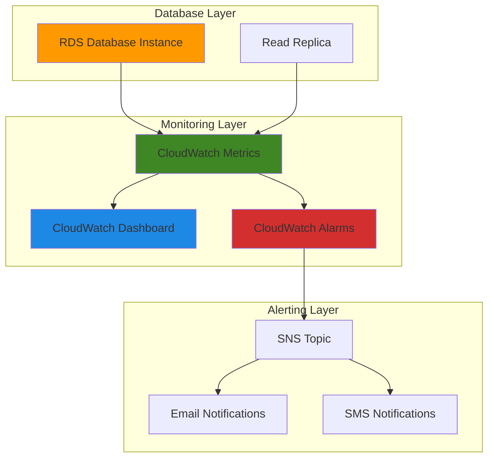

# Database Monitoring Dashboards with CloudWatch

## Problem

Database administrators and DevOps teams struggle with reactive monitoring approaches that only alert after performance issues have already impacted applications. Without comprehensive visibility into database metrics like CPU utilization, memory usage, connection counts, and query performance, teams cannot proactively identify bottlenecks or optimize database performance before users experience degradation.

## Solution

Build comprehensive CloudWatch dashboards that provide real-time visibility into RDS database performance metrics, combined with automated alerting for critical thresholds. This solution leverages CloudWatch's native integration with RDS to collect, visualize, and alert on key database performance indicators, enabling proactive database management and faster incident response.

## Architecture Diagram



## Prerequisites

1. AWS account with permissions to create RDS instances, CloudWatch dashboards, SNS topics, and IAM roles
2. AWS CLI v2 installed and configured (or AWS CloudShell)
3. Basic understanding of database performance metrics and monitoring concepts
4. Email address for receiving database alerts
5. Estimated cost: $15-30/month for small RDS instance and monitoring resources

> **Note**: This recipe uses MySQL on RDS, but the same principles apply to PostgreSQL, MariaDB, and other RDS engines. For complete metrics reference, see [Amazon RDS CloudWatch metrics](https://docs.aws.amazon.com/AmazonRDS/latest/UserGuide/rds-metrics.html).

## Preparation

```bash
# Set environment variables
export AWS_REGION=$(aws configure get region)
export AWS_ACCOUNT_ID=$(aws sts get-caller-identity \
    --query Account --output text)

# Generate unique identifiers for resources
RANDOM_SUFFIX=$(aws secretsmanager get-random-password \
    --exclude-punctuation --exclude-uppercase \
    --password-length 6 --require-each-included-type \
    --output text --query RandomPassword)

export DB_INSTANCE_ID="monitoring-demo-${RANDOM_SUFFIX}"
export SNS_TOPIC_NAME="database-alerts-${RANDOM_SUFFIX}"
export DASHBOARD_NAME="DatabaseMonitoring-${RANDOM_SUFFIX}"
export DB_PASSWORD="MySecurePassword123!"

# Set your email for notifications
export ALERT_EMAIL="your-email@example.com"

echo "Setup complete. DB Instance ID: ${DB_INSTANCE_ID}"
```

## Steps

1. **Create RDS Database Instance for Monitoring**:

   RDS provides managed relational databases with built-in CloudWatch integration, automatically publishing over 60 performance metrics without additional configuration. Creating a database instance establishes the foundation for comprehensive monitoring by enabling metric collection at the database engine level.

   ```bash
   # Create RDS MySQL instance with monitoring enabled
   aws rds create-db-instance \
       --db-instance-identifier ${DB_INSTANCE_ID} \
       --db-instance-class db.t3.micro \
       --engine mysql \
       --engine-version 8.0.40 \
       --allocated-storage 20 \
       --master-username admin \
       --master-user-password ${DB_PASSWORD} \
       --vpc-security-group-ids default \
       --monitoring-interval 60 \
       --enable-performance-insights \
       --performance-insights-retention-period 7 \
       --backup-retention-period 7 \
       --region ${AWS_REGION}
   
   echo "✅ RDS instance creation initiated: ${DB_INSTANCE_ID}"
   ```

   The database instance is now provisioning with enhanced monitoring enabled, which provides OS-level metrics every 60 seconds and activates Performance Insights for query-level visibility. This configuration establishes the comprehensive metrics foundation required for effective database monitoring.

2. **Wait for Database Instance to Become Available**:

   Database initialization involves multiple phases including storage allocation, engine configuration, and metric collection setup. Ensuring the instance reaches 'available' status before proceeding guarantees that all monitoring components are properly initialized and metrics are flowing to CloudWatch.

   ```bash
   # Wait for RDS instance to be available
   echo "Waiting for RDS instance to become available..."
   aws rds wait db-instance-available \
       --db-instance-identifier ${DB_INSTANCE_ID}
   
   # Get the database endpoint
   DB_ENDPOINT=$(aws rds describe-db-instances \
       --db-instance-identifier ${DB_INSTANCE_ID} \
       --query 'DBInstances[0].Endpoint.Address' \
       --output text)
   
   echo "✅ Database instance is available at: ${DB_ENDPOINT}"
   ```

   The database instance is now fully operational and actively publishing metrics to CloudWatch. This ensures that when we create dashboards and alarms, historical data will be available for accurate visualization and threshold configuration.

3. **Create SNS Topic for Database Alerts**:

   SNS provides reliable, scalable notification delivery that integrates seamlessly with CloudWatch alarms. Creating a dedicated topic for database alerts enables centralized management of notification preferences and allows multiple subscribers to receive alerts through different channels.

   ```bash
   # Create SNS topic for database alerts
   SNS_TOPIC_ARN=$(aws sns create-topic \
       --name ${SNS_TOPIC_NAME} \
       --query 'TopicArn' --output text)
   
   # Subscribe email address to the topic
   aws sns subscribe \
       --topic-arn ${SNS_TOPIC_ARN} \
       --protocol email \
       --notification-endpoint ${ALERT_EMAIL}
   
   echo "✅ SNS topic created: ${SNS_TOPIC_ARN}"
   echo "📧 Check your email to confirm subscription"
   ```

   The SNS topic is now configured to deliver database alerts to your email address. This notification infrastructure enables immediate awareness of database performance issues and facilitates rapid response to critical situations.

4. **Create CloudWatch Dashboard for Database Metrics**:

   CloudWatch dashboards provide centralized visualization of database performance metrics, enabling teams to monitor trends, identify patterns, and correlate events across multiple database instances. This comprehensive view is essential for proactive database management and performance optimization.

   ```bash
   # Create comprehensive database monitoring dashboard
   cat > dashboard-body.json << 'EOF'
   {
       "widgets": [
           {
               "type": "metric",
               "x": 0,
               "y": 0,
               "width": 12,
               "height": 6,
               "properties": {
                   "metrics": [
                       ["AWS/RDS", "CPUUtilization", "DBInstanceIdentifier", "INSTANCE_ID"],
                       ["AWS/RDS", "DatabaseConnections", "DBInstanceIdentifier", "INSTANCE_ID"],
                       ["AWS/RDS", "FreeableMemory", "DBInstanceIdentifier", "INSTANCE_ID"]
                   ],
                   "view": "timeSeries",
                   "stacked": false,
                   "region": "REGION",
                   "title": "Database Performance Overview",
                   "period": 300,
                   "stat": "Average"
               }
           },
           {
               "type": "metric",
               "x": 12,
               "y": 0,
               "width": 12,
               "height": 6,
               "properties": {
                   "metrics": [
                       ["AWS/RDS", "FreeStorageSpace", "DBInstanceIdentifier", "INSTANCE_ID"],
                       ["AWS/RDS", "ReadLatency", "DBInstanceIdentifier", "INSTANCE_ID"],
                       ["AWS/RDS", "WriteLatency", "DBInstanceIdentifier", "INSTANCE_ID"]
                   ],
                   "view": "timeSeries",
                   "stacked": false,
                   "region": "REGION",
                   "title": "Storage and Latency Metrics",
                   "period": 300,
                   "stat": "Average"
               }
           },
           {
               "type": "metric",
               "x": 0,
               "y": 6,
               "width": 24,
               "height": 6,
               "properties": {
                   "metrics": [
                       ["AWS/RDS", "ReadIOPS", "DBInstanceIdentifier", "INSTANCE_ID"],
                       ["AWS/RDS", "WriteIOPS", "DBInstanceIdentifier", "INSTANCE_ID"],
                       ["AWS/RDS", "ReadThroughput", "DBInstanceIdentifier", "INSTANCE_ID"],
                       ["AWS/RDS", "WriteThroughput", "DBInstanceIdentifier", "INSTANCE_ID"]
                   ],
                   "view": "timeSeries",
                   "stacked": false,
                   "region": "REGION",
                   "title": "I/O Performance Metrics",
                   "period": 300,
                   "stat": "Average"
               }
           }
       ]
   }
   EOF
   
   # Replace placeholders with actual values
   sed -i "s/INSTANCE_ID/${DB_INSTANCE_ID}/g" dashboard-body.json
   sed -i "s/REGION/${AWS_REGION}/g" dashboard-body.json
   
   # Create the dashboard
   aws cloudwatch put-dashboard \
       --dashboard-name ${DASHBOARD_NAME} \
       --dashboard-body file://dashboard-body.json
   
   echo "✅ CloudWatch dashboard created: ${DASHBOARD_NAME}"
   ```

   The comprehensive monitoring dashboard is now active and displaying real-time database performance metrics. This visualization enables teams to quickly identify performance trends, correlate metrics, and make data-driven decisions about database optimization and scaling.

5. **Create CloudWatch Alarms for Critical Metrics**:

   CloudWatch alarms provide automated monitoring of critical database thresholds, enabling proactive alerting before performance issues impact applications. These alarms continuously evaluate metrics against predefined thresholds and trigger notifications when conditions require immediate attention.

   ```bash
   # Create CPU utilization alarm
   aws cloudwatch put-metric-alarm \
       --alarm-name "${DB_INSTANCE_ID}-HighCPU" \
       --alarm-description "High CPU utilization on ${DB_INSTANCE_ID}" \
       --metric-name CPUUtilization \
       --namespace AWS/RDS \
       --statistic Average \
       --period 300 \
       --threshold 80 \
       --comparison-operator GreaterThanThreshold \
       --evaluation-periods 2 \
       --alarm-actions ${SNS_TOPIC_ARN} \
       --dimensions Name=DBInstanceIdentifier,Value=${DB_INSTANCE_ID}
   
   # Create database connection alarm
   aws cloudwatch put-metric-alarm \
       --alarm-name "${DB_INSTANCE_ID}-HighConnections" \
       --alarm-description "High database connections on ${DB_INSTANCE_ID}" \
       --metric-name DatabaseConnections \
       --namespace AWS/RDS \
       --statistic Average \
       --period 300 \
       --threshold 50 \
       --comparison-operator GreaterThanThreshold \
       --evaluation-periods 2 \
       --alarm-actions ${SNS_TOPIC_ARN} \
       --dimensions Name=DBInstanceIdentifier,Value=${DB_INSTANCE_ID}
   
   # Create free storage space alarm (2GB threshold)
   aws cloudwatch put-metric-alarm \
       --alarm-name "${DB_INSTANCE_ID}-LowStorage" \
       --alarm-description "Low free storage space on ${DB_INSTANCE_ID}" \
       --metric-name FreeStorageSpace \
       --namespace AWS/RDS \
       --statistic Average \
       --period 300 \
       --threshold 2147483648 \
       --comparison-operator LessThanThreshold \
       --evaluation-periods 1 \
       --alarm-actions ${SNS_TOPIC_ARN} \
       --dimensions Name=DBInstanceIdentifier,Value=${DB_INSTANCE_ID}
   
   echo "✅ CloudWatch alarms created for critical database metrics"
   ```

   Critical database alarms are now monitoring CPU utilization, connection counts, and storage space. These automated monitors provide early warning of potential performance issues, enabling proactive intervention before problems impact application availability.

6. **Configure Enhanced Monitoring for OS-Level Metrics**:

   Enhanced monitoring provides granular OS-level metrics including CPU, memory, file system, and network statistics at 1-second intervals. This detailed visibility enables identification of resource bottlenecks that standard CloudWatch metrics might miss.

   ```bash
   # Create IAM role for enhanced monitoring
   aws iam create-role \
       --role-name rds-monitoring-role-${RANDOM_SUFFIX} \
       --assume-role-policy-document '{
           "Version": "2012-10-17",
           "Statement": [
               {
                   "Effect": "Allow",
                   "Principal": {
                       "Service": "monitoring.rds.amazonaws.com"
                   },
                   "Action": "sts:AssumeRole"
               }
           ]
       }'
   
   # Attach the required policy
   aws iam attach-role-policy \
       --role-name rds-monitoring-role-${RANDOM_SUFFIX} \
       --policy-arn arn:aws:iam::aws:policy/service-role/AmazonRDSEnhancedMonitoringRole
   
   # Get the role ARN
   MONITORING_ROLE_ARN=$(aws iam get-role \
       --role-name rds-monitoring-role-${RANDOM_SUFFIX} \
       --query 'Role.Arn' --output text)
   
   # Modify the database instance to enable enhanced monitoring
   aws rds modify-db-instance \
       --db-instance-identifier ${DB_INSTANCE_ID} \
       --monitoring-interval 60 \
       --monitoring-role-arn ${MONITORING_ROLE_ARN} \
       --apply-immediately
   
   echo "✅ Enhanced monitoring configured with 60-second intervals"
   ```

   Enhanced monitoring is now active and providing detailed OS-level metrics to CloudWatch. This comprehensive monitoring enables identification of resource contention, I/O bottlenecks, and system-level performance issues that impact database performance.

> **Warning**: Enhanced monitoring incurs additional charges based on the monitoring interval. 60-second intervals cost approximately $2.50 per instance per month. Consider your monitoring requirements when selecting the interval.

## Validation & Testing

1. **Verify Dashboard Functionality**:

   ```bash
   # Check dashboard exists and is properly configured
   aws cloudwatch get-dashboard \
       --dashboard-name ${DASHBOARD_NAME} \
       --query 'DashboardName' --output text
   
   # List all alarms for the database instance
   aws cloudwatch describe-alarms \
       --alarm-name-prefix ${DB_INSTANCE_ID} \
       --query 'MetricAlarms[*].[AlarmName,StateValue]' \
       --output table
   ```

   Expected output: Dashboard name and alarm states showing "OK" or "INSUFFICIENT_DATA"

2. **Test Database Connection and Generate Metrics**:

   ```bash
   # Test database connectivity and generate activity
   echo "Testing database connection and generating metrics..."
   
   # Simple connectivity test using AWS CLI
   aws rds describe-db-instances \
       --db-instance-identifier ${DB_INSTANCE_ID} \
       --query 'DBInstances[0].DBInstanceStatus' \
       --output text
   
   # Check that metrics are being generated
   aws cloudwatch get-metric-statistics \
       --namespace AWS/RDS \
       --metric-name CPUUtilization \
       --dimensions Name=DBInstanceIdentifier,Value=${DB_INSTANCE_ID} \
       --start-time $(date -u -d '1 hour ago' +%Y-%m-%dT%H:%M:%S) \
       --end-time $(date -u +%Y-%m-%dT%H:%M:%S) \
       --period 300 \
       --statistics Average \
       --query 'Datapoints[*].[Timestamp,Average]' \
       --output table
   
   echo "✅ Database metrics are being collected successfully"
   ```

3. **Test Alarm Functionality**:

   ```bash
   # Temporarily lower alarm threshold to test notifications
   aws cloudwatch put-metric-alarm \
       --alarm-name "${DB_INSTANCE_ID}-HighCPU" \
       --alarm-description "Test alarm for ${DB_INSTANCE_ID}" \
       --metric-name CPUUtilization \
       --namespace AWS/RDS \
       --statistic Average \
       --period 300 \
       --threshold 1 \
       --comparison-operator GreaterThanThreshold \
       --evaluation-periods 1 \
       --alarm-actions ${SNS_TOPIC_ARN} \
       --dimensions Name=DBInstanceIdentifier,Value=${DB_INSTANCE_ID}
   
   echo "✅ Test alarm configured - should trigger notification"
   echo "Note: Reset threshold after testing"
   ```

## Cleanup

1. **Remove CloudWatch Alarms**:

   ```bash
   # Delete all alarms for the database instance
   aws cloudwatch delete-alarms \
       --alarm-names "${DB_INSTANCE_ID}-HighCPU" \
                     "${DB_INSTANCE_ID}-HighConnections" \
                     "${DB_INSTANCE_ID}-LowStorage"
   
   echo "✅ CloudWatch alarms deleted"
   ```

2. **Remove CloudWatch Dashboard**:

   ```bash
   # Delete the dashboard
   aws cloudwatch delete-dashboards \
       --dashboard-names ${DASHBOARD_NAME}
   
   echo "✅ CloudWatch dashboard deleted"
   ```

3. **Remove RDS Database Instance**:

   ```bash
   # Delete the database instance (skip final snapshot for demo)
   aws rds delete-db-instance \
       --db-instance-identifier ${DB_INSTANCE_ID} \
       --skip-final-snapshot
   
   echo "✅ RDS instance deletion initiated"
   ```

4. **Remove SNS Topic and IAM Role**:

   ```bash
   # Delete SNS topic
   aws sns delete-topic --topic-arn ${SNS_TOPIC_ARN}
   
   # Remove IAM role and policy
   aws iam detach-role-policy \
       --role-name rds-monitoring-role-${RANDOM_SUFFIX} \
       --policy-arn arn:aws:iam::aws:policy/service-role/AmazonRDSEnhancedMonitoringRole
   
   aws iam delete-role --role-name rds-monitoring-role-${RANDOM_SUFFIX}
   
   # Clean up local files
   rm -f dashboard-body.json
   
   echo "✅ All resources cleaned up"
   ```

## Discussion

CloudWatch provides comprehensive database monitoring capabilities that enable proactive management of RDS instances through automated metrics collection, visualization, and alerting. The integration between RDS and CloudWatch is native and requires no additional configuration, making it an ideal solution for database monitoring at scale.

The dashboard created in this recipe provides visibility into key performance indicators including CPU utilization, memory usage, connection counts, and I/O performance. These metrics enable database administrators to identify performance trends, capacity planning requirements, and optimization opportunities before they impact application performance.

Enhanced monitoring extends standard CloudWatch metrics by providing OS-level visibility at granular intervals. This additional layer of monitoring is particularly valuable for troubleshooting performance issues that may not be apparent from database-level metrics alone. The combination of database and OS metrics provides a complete picture of system health and performance.

CloudWatch alarms enable automated response to critical database conditions, reducing mean time to detection (MTTD) and enabling faster incident response. The SNS integration allows for flexible notification delivery through multiple channels, ensuring that the right teams receive alerts through their preferred communication methods. For more advanced monitoring patterns, consider implementing [CloudWatch Composite Alarms](https://docs.aws.amazon.com/AmazonCloudWatch/latest/monitoring/Create_Composite_Alarm.html) for complex alerting scenarios.

> **Tip**: Use CloudWatch Dashboard templates to standardize monitoring across multiple database instances. You can export dashboard configurations and apply them programmatically using infrastructure as code tools like CloudFormation or Terraform.

## Challenge

Extend this monitoring solution by implementing these enhancements:

1. **Implement Custom Metrics**: Create Lambda functions to collect application-specific database metrics like query execution times, connection pool utilization, and business logic performance indicators.

2. **Add Cross-Region Monitoring**: Set up CloudWatch cross-region dashboards to monitor database replicas and implement disaster recovery monitoring with automated failover alerts.

3. **Create Predictive Alerts**: Implement CloudWatch anomaly detection to identify unusual patterns in database performance and create predictive alerts based on historical trends.

4. **Build Automated Remediation**: Develop Step Functions workflows that automatically respond to database alerts by scaling compute resources, clearing connections, or performing other remediation actions.

5. **Implement Cost Optimization Monitoring**: Add CloudWatch metrics and alarms to track database costs, storage growth, and resource utilization to identify cost optimization opportunities.

## Infrastructure Code

### Available Infrastructure as Code:

- [Infrastructure Code Overview](code/README.md) - Detailed description of all infrastructure components
- [AWS CDK (Python)](code/cdk-python/) - AWS CDK Python implementation
- [AWS CDK (TypeScript)](code/cdk-typescript/) - AWS CDK TypeScript implementation
- [CloudFormation](code/cloudformation.yaml) - AWS CloudFormation template
- [Bash CLI Scripts](code/scripts/) - Example bash scripts using AWS CLI commands to deploy infrastructure
- [Terraform](code/terraform/) - Terraform configuration files