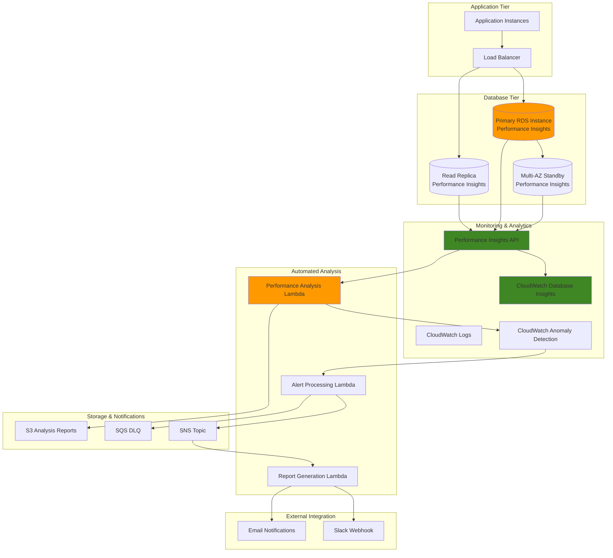

# Database Performance Monitoring with RDS Insights


## Problem

Enterprise database environments face complex performance challenges that require sophisticated monitoring and analysis capabilities. Database administrators struggle to correlate performance metrics across multiple dimensions simultaneously, identify performance regression patterns, and proactively detect anomalies before they impact production workloads. Traditional monitoring approaches provide fragmented views of database performance, making it difficult to perform root cause analysis on complex issues involving SQL performance, wait events, and resource utilization patterns across fleet-wide database deployments.

## Solution

This solution implements a sophisticated database performance monitoring system using RDS Performance Insights APIs, CloudWatch Database Insights, and automated analysis workflows. The architecture combines real-time performance data collection with advanced analytics, automated anomaly detection, and intelligent alert generation to provide comprehensive database performance visibility. This approach enables proactive performance management, automated root cause analysis, and data-driven optimization recommendations for complex database environments.

## Architecture Diagram



## Prerequisites

1. AWS account with RDS, CloudWatch, Lambda, and IAM administrative permissions
2. AWS CLI v2 installed and configured (or AWS CloudShell)
3. Advanced understanding of SQL performance tuning and database optimization
4. Knowledge of CloudWatch custom metrics and Lambda function development
5. Python 3.9+ for Lambda function development and API integration
6. Estimated cost: $0.02-$0.09 per vCPU per hour for Performance Insights, $0.20 per million Lambda requests, $0.02 per 1000 custom metrics

> **Note**: Performance Insights is transitioning to CloudWatch Database Insights by November 30, 2025. This recipe demonstrates current Performance Insights functionality while preparing for future migration. See the [CloudWatch Database Insights documentation](https://docs.aws.amazon.com/AmazonCloudWatch/latest/monitoring/Database-Insights.html) for transition guidance.

## Preparation

```bash
# Set environment variables
export AWS_REGION=$(aws configure get region)
export AWS_ACCOUNT_ID=$(aws sts get-caller-identity \
    --query Account --output text)

# Generate unique identifiers for resources
RANDOM_SUFFIX=$(aws secretsmanager get-random-password \
    --exclude-punctuation --exclude-uppercase \
    --password-length 6 --require-each-included-type \
    --output text --query RandomPassword)

export DB_INSTANCE_ID="performance-test-db-${RANDOM_SUFFIX}"
export DB_SUBNET_GROUP="perf-insights-subnet-group-${RANDOM_SUFFIX}"
export SNS_TOPIC_NAME="db-performance-alerts-${RANDOM_SUFFIX}"
export LAMBDA_FUNCTION_NAME="performance-analyzer-${RANDOM_SUFFIX}"
export S3_BUCKET_NAME="db-performance-reports-${RANDOM_SUFFIX}"

# Create S3 bucket for performance reports
aws s3 mb s3://${S3_BUCKET_NAME} --region ${AWS_REGION}
aws s3api put-bucket-versioning \
    --bucket ${S3_BUCKET_NAME} \
    --versioning-configuration Status=Enabled

echo "✅ Created S3 bucket: ${S3_BUCKET_NAME}"

# Create SNS topic for performance alerts
export SNS_TOPIC_ARN=$(aws sns create-topic \
    --name "${SNS_TOPIC_NAME}" \
    --query TopicArn --output text)

echo "✅ Created SNS topic: ${SNS_TOPIC_ARN}"

# Subscribe your email to receive alerts
read -p "Enter your email address for alerts: " EMAIL_ADDRESS
aws sns subscribe \
    --topic-arn "${SNS_TOPIC_ARN}" \
    --protocol email \
    --notification-endpoint "${EMAIL_ADDRESS}"

echo "✅ Please check your email and confirm the SNS subscription"
```

## Steps

1. **Create Enhanced Monitoring IAM Role**:

   Amazon RDS Enhanced Monitoring requires an IAM role with specific permissions to collect and publish detailed operating system metrics to CloudWatch. This role enables RDS to gather granular performance data including CPU, memory, file system, and disk I/O metrics at the database instance level. Enhanced monitoring complements Performance Insights by providing the underlying system metrics needed for comprehensive performance analysis.

   ```bash
   # Create IAM role for enhanced monitoring
   cat > trust-policy.json << EOF
   {
     "Version": "2012-10-17",
     "Statement": [
       {
         "Effect": "Allow",
         "Principal": {
           "Service": "monitoring.rds.amazonaws.com"
         },
         "Action": "sts:AssumeRole"
       }
     ]
   }
   EOF
   
   aws iam create-role \
       --role-name "rds-monitoring-role" \
       --assume-role-policy-document file://trust-policy.json
   
   # Attach the required policy
   aws iam attach-role-policy \
       --role-name "rds-monitoring-role" \
       --policy-arn "arn:aws:iam::aws:policy/service-role/AmazonRDSEnhancedMonitoringRole"
   
   rm trust-policy.json
   echo "✅ Enhanced monitoring role configured"
   ```

   The enhanced monitoring role is now configured with the necessary permissions to collect detailed OS-level metrics. This foundation enables comprehensive performance monitoring that combines database metrics with system-level insights, providing the complete picture needed for performance optimization.

2. **Create RDS Database with Advanced Performance Monitoring**:

   This step creates an RDS MySQL instance with Performance Insights enabled, enhanced monitoring configured, and CloudWatch logs integration activated. Performance Insights provides database load monitoring and query analysis capabilities, while enhanced monitoring captures detailed system metrics. The combination creates a comprehensive monitoring foundation that enables sophisticated performance analysis and troubleshooting.

   The database configuration includes Multi-AZ deployment preparation, security group isolation, and automated backup features. Performance Insights retention is set to 7 days for the free tier, though production environments typically require longer retention periods for trend analysis and historical performance comparisons.

   ```bash
   # Create DB subnet group if needed
   VPC_ID=$(aws ec2 describe-vpcs \
       --filters "Name=is-default,Values=true" \
       --query "Vpcs[0].VpcId" --output text)
   
   SUBNET_IDS=$(aws ec2 describe-subnets \
       --filters "Name=vpc-id,Values=${VPC_ID}" \
       --query "Subnets[*].SubnetId" --output text)
   
   aws rds create-db-subnet-group \
       --db-subnet-group-name "${DB_SUBNET_GROUP}" \
       --db-subnet-group-description "Subnet group for Performance Insights demo" \
       --subnet-ids ${SUBNET_IDS}
   
   # Create RDS instance with Performance Insights enabled
   aws rds create-db-instance \
       --db-instance-identifier "${DB_INSTANCE_ID}" \
       --db-instance-class "db.t3.small" \
       --engine "mysql" \
       --engine-version "8.0.35" \
       --master-username "admin" \
       --master-user-password "SecurePassword123!" \
       --allocated-storage 20 \
       --db-subnet-group-name "${DB_SUBNET_GROUP}" \
       --enable-performance-insights \
       --performance-insights-retention-period 7 \
       --monitoring-interval 60 \
       --monitoring-role-arn "arn:aws:iam::${AWS_ACCOUNT_ID}:role/rds-monitoring-role" \
       --no-publicly-accessible \
       --enable-cloudwatch-logs-exports "error" "general" "slow-query"
   
   echo "✅ RDS instance creation initiated with Performance Insights enabled"
   
   # Wait for instance to become available
   aws rds wait db-instance-available \
       --db-instance-identifier "${DB_INSTANCE_ID}"
   
   echo "✅ RDS instance is now available"
   ```

   The RDS instance is now operational with Performance Insights actively collecting database load metrics, wait events, and SQL statement statistics. The enhanced monitoring configuration provides detailed system-level metrics, while CloudWatch logs integration enables centralized log analysis. This comprehensive monitoring foundation supports both real-time performance analysis and historical trend identification.

3. **Deploy Performance Analysis Lambda Function**:

   This Lambda function serves as the intelligent analysis engine for Performance Insights data, implementing automated performance pattern recognition and anomaly detection. The function leverages the Performance Insights API to retrieve database load metrics, analyzes wait events and SQL performance patterns, and generates actionable insights for performance optimization.

   The function implements advanced analysis algorithms that correlate multiple performance dimensions simultaneously, identifying problematic queries and high-load events that traditional monitoring might miss. By storing analysis results in S3 and publishing custom metrics to CloudWatch, the function creates a comprehensive performance intelligence system that scales across multiple database instances.

   ```bash
   # Create Lambda function for performance analysis
   cat > performance_analyzer.py << 'EOF'
   import json
   import boto3
   import datetime
   import os
   from decimal import Decimal
   
   def lambda_handler(event, context):
       pi_client = boto3.client('pi')
       s3_client = boto3.client('s3')
       cloudwatch = boto3.client('cloudwatch')
       
       # Get Performance Insights resource ID from environment
       resource_id = os.environ.get('PI_RESOURCE_ID')
       bucket_name = os.environ.get('S3_BUCKET_NAME')
       
       # Define time range for analysis (last hour)
       end_time = datetime.datetime.utcnow()
       start_time = end_time - datetime.timedelta(hours=1)
       
       try:
           # Get database load metrics
           response = pi_client.get_resource_metrics(
               ServiceType='RDS',
               Identifier=resource_id,
               StartTime=start_time,
               EndTime=end_time,
               PeriodInSeconds=300,
               MetricQueries=[
                   {
                       'Metric': 'db.load.avg',
                       'GroupBy': {'Group': 'db.wait_event', 'Limit': 10}
                   },
                   {
                       'Metric': 'db.load.avg',
                       'GroupBy': {'Group': 'db.sql_tokenized', 'Limit': 10}
                   }
               ]
           )
           
           # Analyze performance patterns
           analysis_results = analyze_performance_data(response)
           
           # Store results in S3
           report_key = f"performance-reports/{datetime.datetime.utcnow().strftime('%Y/%m/%d/%H')}/analysis.json"
           s3_client.put_object(
               Bucket=bucket_name,
               Key=report_key,
               Body=json.dumps(analysis_results, default=str),
               ContentType='application/json'
           )
           
           # Send custom metrics to CloudWatch
           publish_custom_metrics(cloudwatch, analysis_results)
           
           return {
               'statusCode': 200,
               'body': json.dumps({
                   'message': 'Performance analysis completed',
                   'report_location': f's3://{bucket_name}/{report_key}'
               })
           }
           
       except Exception as e:
           print(f"Error in performance analysis: {str(e)}")
           return {
               'statusCode': 500,
               'body': json.dumps({'error': str(e)})
           }
   
   def analyze_performance_data(response):
       """Analyze Performance Insights data for anomalies and patterns"""
       analysis = {
           'timestamp': datetime.datetime.utcnow().isoformat(),
           'metrics_analyzed': len(response['MetricList']),
           'high_load_events': [],
           'problematic_queries': [],
           'recommendations': []
       }
       
       for metric in response['MetricList']:
           if 'Dimensions' in metric['Key']:
               # Analyze wait events
               if 'db.wait_event.name' in metric['Key']['Dimensions']:
                   wait_event = metric['Key']['Dimensions']['db.wait_event.name']
                   avg_load = sum(dp['Value'] for dp in metric['DataPoints']) / len(metric['DataPoints'])
                   
                   if avg_load > 1.0:  # High load threshold
                       analysis['high_load_events'].append({
                           'wait_event': wait_event,
                           'average_load': avg_load
                       })
               
               # Analyze SQL queries
               if 'db.sql_tokenized.statement' in metric['Key']['Dimensions']:
                   sql_statement = metric['Key']['Dimensions']['db.sql_tokenized.statement']
                   avg_load = sum(dp['Value'] for dp in metric['DataPoints']) / len(metric['DataPoints'])
                   
                   if avg_load > 0.5:  # Problematic query threshold
                       analysis['problematic_queries'].append({
                           'sql_statement': sql_statement[:200] + '...' if len(sql_statement) > 200 else sql_statement,
                           'average_load': avg_load
                       })
       
       # Generate recommendations
       if analysis['high_load_events']:
           analysis['recommendations'].append("Consider investigating high wait events and optimizing queries")
       
       if analysis['problematic_queries']:
           analysis['recommendations'].append("Review and optimize high-load SQL queries")
       
       return analysis
   
   def publish_custom_metrics(cloudwatch, analysis):
       """Publish custom metrics to CloudWatch"""
       try:
           cloudwatch.put_metric_data(
               Namespace='RDS/PerformanceInsights',
               MetricData=[
                   {
                       'MetricName': 'HighLoadEvents',
                       'Value': len(analysis['high_load_events']),
                       'Unit': 'Count',
                       'Timestamp': datetime.datetime.utcnow()
                   },
                   {
                       'MetricName': 'ProblematicQueries',
                       'Value': len(analysis['problematic_queries']),
                       'Unit': 'Count',
                       'Timestamp': datetime.datetime.utcnow()
                   }
               ]
           )
       except Exception as e:
           print(f"Error publishing custom metrics: {str(e)}")
   EOF
   
   # Create deployment package
   zip -r lambda_function.zip performance_analyzer.py
   
   # Create IAM role for Lambda function
   cat > lambda-trust-policy.json << EOF
   {
     "Version": "2012-10-17",
     "Statement": [
       {
         "Effect": "Allow",
         "Principal": {
           "Service": "lambda.amazonaws.com"
         },
         "Action": "sts:AssumeRole"
       }
     ]
   }
   EOF
   
   aws iam create-role \
       --role-name "performance-analyzer-role" \
       --assume-role-policy-document file://lambda-trust-policy.json
   
   # Attach necessary policies
   aws iam attach-role-policy \
       --role-name "performance-analyzer-role" \
       --policy-arn "arn:aws:iam::aws:policy/service-role/AWSLambdaBasicExecutionRole"
   
   # Create custom policy for Performance Insights access
   cat > pi-lambda-policy.json << EOF
   {
       "Version": "2012-10-17",
       "Statement": [
           {
               "Effect": "Allow",
               "Action": [
                   "pi:DescribeDimensionKeys",
                   "pi:GetResourceMetrics",
                   "pi:ListAvailableResourceDimensions",
                   "pi:ListAvailableResourceMetrics",
                   "s3:PutObject",
                   "s3:GetObject",
                   "cloudwatch:PutMetricData"
               ],
               "Resource": "*"
           }
       ]
   }
   EOF
   
   aws iam create-policy \
       --policy-name "PerformanceInsightsLambdaPolicy" \
       --policy-document file://pi-lambda-policy.json
   
   aws iam attach-role-policy \
       --role-name "performance-analyzer-role" \
       --policy-arn "arn:aws:iam::${AWS_ACCOUNT_ID}:policy/PerformanceInsightsLambdaPolicy"
   
   # Get Performance Insights resource ID
   PI_RESOURCE_ID=$(aws rds describe-db-instances \
       --db-instance-identifier "${DB_INSTANCE_ID}" \
       --query "DBInstances[0].DbiResourceId" \
       --output text)
   
   # Create Lambda function
   aws lambda create-function \
       --function-name "${LAMBDA_FUNCTION_NAME}" \
       --runtime python3.9 \
       --role "arn:aws:iam::${AWS_ACCOUNT_ID}:role/performance-analyzer-role" \
       --handler performance_analyzer.lambda_handler \
       --zip-file fileb://lambda_function.zip \
       --timeout 300 \
       --memory-size 512 \
       --environment "Variables={PI_RESOURCE_ID=${PI_RESOURCE_ID},S3_BUCKET_NAME=${S3_BUCKET_NAME}}"
   
   # Clean up temporary files
   rm lambda-trust-policy.json pi-lambda-policy.json
   
   echo "✅ Lambda function deployed successfully"
   ```

   The Performance Analysis Lambda function is now deployed with comprehensive IAM permissions for Performance Insights access, S3 storage, and CloudWatch metrics publishing. The function's intelligent analysis capabilities transform raw performance data into actionable insights, enabling proactive performance management and automated optimization recommendations.

4. **Create Advanced CloudWatch Alarms and Custom Metrics**:

   CloudWatch alarms provide the critical alerting infrastructure for proactive database performance management. These alarms monitor both standard RDS metrics and custom Performance Insights-derived metrics, enabling early detection of performance degradation before it impacts application users. The multi-layered alerting approach combines threshold-based monitoring with machine learning-powered anomaly detection.

   The alarm configuration includes database connection limits, CPU utilization thresholds, and custom metrics for high-load events and problematic queries. CloudWatch anomaly detection uses machine learning to establish baseline performance patterns and automatically detect deviations, reducing false positives while improving detection accuracy for subtle performance issues.

   ```bash
   # Create alarm for high database load
   aws cloudwatch put-metric-alarm \
       --alarm-name "RDS-HighDatabaseLoad-${DB_INSTANCE_ID}" \
       --alarm-description "High database load detected" \
       --metric-name "DatabaseConnections" \
       --namespace "AWS/RDS" \
       --statistic "Average" \
       --period 300 \
       --threshold 80 \
       --comparison-operator "GreaterThanThreshold" \
       --dimensions "Name=DBInstanceIdentifier,Value=${DB_INSTANCE_ID}" \
       --evaluation-periods 2 \
       --alarm-actions "${SNS_TOPIC_ARN}"
   
   # Create alarm for CPU utilization
   aws cloudwatch put-metric-alarm \
       --alarm-name "RDS-HighCPUUtilization-${DB_INSTANCE_ID}" \
       --alarm-description "High CPU utilization on RDS instance" \
       --metric-name "CPUUtilization" \
       --namespace "AWS/RDS" \
       --statistic "Average" \
       --period 300 \
       --threshold 75 \
       --comparison-operator "GreaterThanThreshold" \
       --dimensions "Name=DBInstanceIdentifier,Value=${DB_INSTANCE_ID}" \
       --evaluation-periods 2 \
       --alarm-actions "${SNS_TOPIC_ARN}"
   
   # Create alarm for custom Performance Insights metrics
   aws cloudwatch put-metric-alarm \
       --alarm-name "RDS-HighLoadEvents-${DB_INSTANCE_ID}" \
       --alarm-description "High number of database load events detected" \
       --metric-name "HighLoadEvents" \
       --namespace "RDS/PerformanceInsights" \
       --statistic "Sum" \
       --period 300 \
       --threshold 5 \
       --comparison-operator "GreaterThanThreshold" \
       --evaluation-periods 2 \
       --alarm-actions "${SNS_TOPIC_ARN}"
   
   # Create alarm for problematic queries
   aws cloudwatch put-metric-alarm \
       --alarm-name "RDS-ProblematicQueries-${DB_INSTANCE_ID}" \
       --alarm-description "High number of problematic SQL queries detected" \
       --metric-name "ProblematicQueries" \
       --namespace "RDS/PerformanceInsights" \
       --statistic "Sum" \
       --period 300 \
       --threshold 3 \
       --comparison-operator "GreaterThanThreshold" \
       --evaluation-periods 2 \
       --alarm-actions "${SNS_TOPIC_ARN}"
   
   # Create CloudWatch anomaly detection for database load
   aws cloudwatch put-anomaly-detector \
       --namespace "AWS/RDS" \
       --metric-name "DatabaseConnections" \
       --dimensions "Name=DBInstanceIdentifier,Value=${DB_INSTANCE_ID}" \
       --stat "Average"
   
   > **Tip**: Configure CloudWatch alarms with appropriate thresholds to balance between early warning and false positive alerts. See [CloudWatch Alarms documentation](https://docs.aws.amazon.com/AmazonCloudWatch/latest/monitoring/AlarmThatSendsEmail.html) for best practices on threshold selection and alarm configuration.
   ```

5. **Set up Automated Performance Analysis Trigger**:

   EventBridge (formerly CloudWatch Events) provides the scheduling infrastructure for automated performance analysis execution. By creating a scheduled rule that triggers every 15 minutes, the system ensures continuous performance monitoring without manual intervention. EventBridge's reliable event delivery mechanisms and built-in retry capabilities make it ideal for mission-critical monitoring workflows.

   The automation architecture enables the Performance Insights analysis system to operate continuously, building historical performance intelligence over time. The 15-minute interval balances timely detection of performance issues with cost optimization, though production environments may require more frequent analysis for critical database workloads.

   ```bash
   # Create EventBridge rule to trigger Lambda function every 15 minutes
   aws events put-rule \
       --name "PerformanceAnalysisTrigger-${DB_INSTANCE_ID}" \
       --schedule-expression "rate(15 minutes)" \
       --description "Trigger performance analysis Lambda function" \
       --state ENABLED
   
   # Add Lambda function as target for EventBridge rule
   aws events put-targets \
       --rule "PerformanceAnalysisTrigger-${DB_INSTANCE_ID}" \
       --targets "Id"="1","Arn"="arn:aws:lambda:${AWS_REGION}:${AWS_ACCOUNT_ID}:function:${LAMBDA_FUNCTION_NAME}"
   
   # Grant EventBridge permission to invoke Lambda function
   aws lambda add-permission \
       --function-name "${LAMBDA_FUNCTION_NAME}" \
       --statement-id "allow-eventbridge" \
       --action lambda:InvokeFunction \
       --principal events.amazonaws.com \
       --source-arn "arn:aws:events:${AWS_REGION}:${AWS_ACCOUNT_ID}:rule/PerformanceAnalysisTrigger-${DB_INSTANCE_ID}"
   
   echo "✅ Automated performance analysis trigger configured"
   ```

   The automated performance analysis trigger is now configured to execute the Lambda function every 15 minutes, ensuring continuous monitoring and analysis of database performance patterns. EventBridge provides reliable scheduling with built-in retry mechanisms, while the Lambda function's intelligent analysis generates ongoing performance insights that accumulate into a comprehensive performance intelligence system.

6. **Generate Database Load for Testing and Analysis**:

   This step creates a realistic database workload that generates various performance patterns visible in Performance Insights. The workload includes complex joins, suboptimal queries, and aggregation operations that create different wait events and load characteristics. Understanding these patterns is essential for validating the monitoring system's effectiveness and learning how different query types impact database performance.

   The test workload simulates common application scenarios including user management queries, session tracking, and analytics operations. By generating both optimized and problematic queries, the workload provides comprehensive test coverage for the Performance Insights analysis system, enabling validation of anomaly detection capabilities and performance optimization recommendations.

   ```bash
   # Get RDS endpoint
   DB_ENDPOINT=$(aws rds describe-db-instances \
       --db-instance-identifier "${DB_INSTANCE_ID}" \
       --query "DBInstances[0].Endpoint.Address" \
       --output text)
   
   # Create advanced load generation script
   cat > generate_load.sql << EOF
   CREATE DATABASE IF NOT EXISTS testdb;
   USE testdb;
   
   CREATE TABLE IF NOT EXISTS users (
       id INT AUTO_INCREMENT PRIMARY KEY,
       name VARCHAR(100),
       email VARCHAR(100),
       department VARCHAR(50),
       created_at TIMESTAMP DEFAULT CURRENT_TIMESTAMP,
       updated_at TIMESTAMP DEFAULT CURRENT_TIMESTAMP ON UPDATE CURRENT_TIMESTAMP,
       INDEX idx_department (department),
       INDEX idx_created_at (created_at)
   );
   
   CREATE TABLE IF NOT EXISTS user_sessions (
       session_id INT AUTO_INCREMENT PRIMARY KEY,
       user_id INT,
       session_start TIMESTAMP DEFAULT CURRENT_TIMESTAMP,
       session_end TIMESTAMP NULL,
       page_views INT DEFAULT 0,
       FOREIGN KEY (user_id) REFERENCES users(id)
   );
   
   -- Insert test data with various patterns
   INSERT INTO users (name, email, department) VALUES 
   ('John Doe', 'john@example.com', 'Engineering'),
   ('Jane Smith', 'jane@example.com', 'Marketing'),
   ('Bob Johnson', 'bob@example.com', 'Sales'),
   ('Alice Brown', 'alice@example.com', 'Engineering'),
   ('Charlie Davis', 'charlie@example.com', 'Marketing');
   
   -- Generate session data
   INSERT INTO user_sessions (user_id, page_views) 
   SELECT id, FLOOR(RAND() * 100) + 1 FROM users;
   
   -- Simulate various query patterns that will generate different wait events
   -- Complex join query (will show up in Performance Insights)
   SELECT u.name, u.department, COUNT(s.session_id) as session_count,
          AVG(s.page_views) as avg_page_views
   FROM users u 
   LEFT JOIN user_sessions s ON u.id = s.user_id 
   GROUP BY u.id, u.name, u.department
   ORDER BY session_count DESC;
   
   -- Query without proper indexing (will create high load)
   SELECT u1.name, u1.email, u2.name as colleague_name
   FROM users u1 
   CROSS JOIN users u2 
   WHERE u1.id != u2.id 
   AND u1.department = u2.department;
   
   -- Query with aggregation (will show in SQL analysis)
   SELECT department, COUNT(*) as user_count, 
          AVG(TIMESTAMPDIFF(DAY, created_at, NOW())) as avg_days_since_creation
   FROM users 
   GROUP BY department;
   EOF
   
   echo "✅ Advanced load generation script created"
   echo "Database endpoint: ${DB_ENDPOINT}"
   echo "To run the load test, use: mysql -h ${DB_ENDPOINT} -u admin -p < generate_load.sql"
   ```

   The database load generation script is now ready for testing the Performance Insights monitoring system. The script creates realistic performance patterns that will be captured by Performance Insights and analyzed by the Lambda function, providing comprehensive validation of the monitoring architecture's effectiveness.

7. **Configure Advanced Performance Dashboard**:

   The CloudWatch dashboard provides a centralized visualization platform for comprehensive database performance monitoring. This dashboard combines standard RDS metrics with custom Performance Insights analysis results, creating a unified view of database health that spans multiple performance dimensions. The dashboard design enables both real-time monitoring and historical trend analysis.

   The dashboard includes core performance metrics, I/O statistics, Performance Insights analysis results, and slow query log integration. This multi-faceted approach enables database administrators to quickly identify performance bottlenecks, correlate different performance indicators, and make data-driven optimization decisions based on comprehensive performance visibility.

   ```bash
   # Create comprehensive CloudWatch dashboard
   cat > dashboard-body.json << EOF
   {
       "widgets": [
           {
               "type": "metric",
               "x": 0,
               "y": 0,
               "width": 12,
               "height": 6,
               "properties": {
                   "metrics": [
                       ["AWS/RDS", "DatabaseConnections", "DBInstanceIdentifier", "${DB_INSTANCE_ID}"],
                       [".", "CPUUtilization", ".", "."],
                       [".", "ReadLatency", ".", "."],
                       [".", "WriteLatency", ".", "."]
                   ],
                   "period": 300,
                   "stat": "Average",
                   "region": "${AWS_REGION}",
                   "title": "RDS Core Performance Metrics",
                   "yAxis": {
                       "left": {
                           "min": 0
                       }
                   }
               }
           },
           {
               "type": "metric",
               "x": 12,
               "y": 0,
               "width": 12,
               "height": 6,
               "properties": {
                   "metrics": [
                       ["RDS/PerformanceInsights", "HighLoadEvents"],
                       [".", "ProblematicQueries"]
                   ],
                   "period": 300,
                   "stat": "Sum",
                   "region": "${AWS_REGION}",
                   "title": "Performance Insights Analysis Results"
               }
           },
           {
               "type": "metric",
               "x": 0,
               "y": 6,
               "width": 12,
               "height": 6,
               "properties": {
                   "metrics": [
                       ["AWS/RDS", "ReadIOPS", "DBInstanceIdentifier", "${DB_INSTANCE_ID}"],
                       [".", "WriteIOPS", ".", "."],
                       [".", "ReadThroughput", ".", "."],
                       [".", "WriteThroughput", ".", "."]
                   ],
                   "period": 300,
                   "stat": "Average",
                   "region": "${AWS_REGION}",
                   "title": "I/O Performance Metrics"
               }
           },
           {
               "type": "log",
               "x": 12,
               "y": 6,
               "width": 12,
               "height": 6,
               "properties": {
                   "query": "SOURCE '/aws/rds/instance/${DB_INSTANCE_ID}/slowquery'\n| fields @timestamp, @message\n| sort @timestamp desc\n| limit 20",
                   "region": "${AWS_REGION}",
                   "title": "Recent Slow Query Log Entries"
               }
           }
       ]
   }
   EOF
   
   aws cloudwatch put-dashboard \
       --dashboard-name "RDS-Performance-${DB_INSTANCE_ID}" \
       --dashboard-body file://dashboard-body.json
   
   rm dashboard-body.json
   echo "✅ Advanced CloudWatch dashboard created"
   ```

   The comprehensive CloudWatch dashboard is now operational, providing real-time visualization of database performance across multiple dimensions. The dashboard's integrated view of standard metrics, custom analysis results, and log data enables effective performance management and facilitates rapid identification of performance issues.

8. **Execute Advanced Performance Insights Analysis**:

   This final step demonstrates the full capabilities of the Performance Insights API for advanced database performance analysis. The API enables sophisticated queries that reveal database load patterns, top wait events, and problematic SQL statements with granular detail. Understanding these API capabilities is essential for building custom monitoring solutions and extending the automated analysis system.

   The analysis queries demonstrate how to extract actionable insights from Performance Insights data, including wait event correlation, SQL statement performance analysis, and dimension-based performance breakdowns. These capabilities enable sophisticated root cause analysis and performance optimization strategies that go beyond traditional monitoring approaches.

   ```bash
   # Get Performance Insights resource ID
   PI_RESOURCE_ID=$(aws rds describe-db-instances \
       --db-instance-identifier "${DB_INSTANCE_ID}" \
       --query "DBInstances[0].DbiResourceId" \
       --output text)
   
   # Query available metrics
   aws pi list-available-resource-metrics \
       --service-type RDS \
       --identifier "${PI_RESOURCE_ID}" \
       --metric-types "db" "os"
   
   # Get current performance data with advanced queries
   END_TIME=$(date -u +%s)
   START_TIME=$((END_TIME - 3600))
   
   # Query database load broken down by wait events
   aws pi get-resource-metrics \
       --service-type RDS \
       --identifier "${PI_RESOURCE_ID}" \
       --start-time "${START_TIME}" \
       --end-time "${END_TIME}" \
       --period-in-seconds 300 \
       --metric-queries '[
           {
               "Metric": "db.load.avg",
               "GroupBy": {"Group": "db.wait_event", "Limit": 7}
           }
       ]'
   
   # Query top SQL statements by load
   aws pi get-resource-metrics \
       --service-type RDS \
       --identifier "${PI_RESOURCE_ID}" \
       --start-time "${START_TIME}" \
       --end-time "${END_TIME}" \
       --period-in-seconds 300 \
       --metric-queries '[
           {
               "Metric": "db.load.avg",
               "GroupBy": {"Group": "db.sql_tokenized", "Limit": 10}
           }
       ]'
   
   # Get dimension keys for top wait events
   aws pi describe-dimension-keys \
       --service-type RDS \
       --identifier "${PI_RESOURCE_ID}" \
       --start-time "${START_TIME}" \
       --end-time "${END_TIME}" \
       --metric "db.load.avg" \
       --group-by "Group"="db.wait_event" \
       --additional-metrics "db.wait_event.type" \
       --max-results 10
   
   echo "✅ Advanced Performance Insights analysis completed"
   ```

## Validation & Testing

1. Verify Performance Insights is enabled and collecting data:

   ```bash
   # Check Performance Insights status
   aws rds describe-db-instances \
       --db-instance-identifier "${DB_INSTANCE_ID}" \
       --query "DBInstances[0].PerformanceInsightsEnabled"
   ```

   Expected output: `true`

2. Test Lambda function execution:

   ```bash
   # Manually invoke the performance analyzer Lambda function
   aws lambda invoke \
       --function-name "${LAMBDA_FUNCTION_NAME}" \
       --payload '{}' \
       lambda_response.json
   
   # Check the response
   cat lambda_response.json
   ```

3. Validate Performance Insights API functionality:

   ```bash
   # List available dimensions
   aws pi list-available-resource-dimensions \
       --service-type RDS \
       --identifier "${PI_RESOURCE_ID}" \
       --metrics "db.load"
   
   # Test advanced API queries
   aws pi get-resource-metrics \
       --service-type RDS \
       --identifier "${PI_RESOURCE_ID}" \
       --start-time $(date -u -d '1 hour ago' +%s) \
       --end-time $(date -u +%s) \
       --period-in-seconds 300 \
       --metric-queries '[{"Metric": "db.load.avg"}]'
   ```

4. Validate CloudWatch alarms and custom metrics:

   ```bash
   # Check alarm status
   aws cloudwatch describe-alarms \
       --alarm-names "RDS-HighDatabaseLoad-${DB_INSTANCE_ID}" \
                    "RDS-HighCPUUtilization-${DB_INSTANCE_ID}" \
                    "RDS-HighLoadEvents-${DB_INSTANCE_ID}" \
                    "RDS-ProblematicQueries-${DB_INSTANCE_ID}"
   
   # Verify custom metrics are being published
   aws cloudwatch list-metrics \
       --namespace "RDS/PerformanceInsights"
   ```

5. Test EventBridge automation:

   ```bash
   # Check EventBridge rule status
   aws events describe-rule \
       --name "PerformanceAnalysisTrigger-${DB_INSTANCE_ID}"
   
   # Verify rule targets
   aws events list-targets-by-rule \
       --rule "PerformanceAnalysisTrigger-${DB_INSTANCE_ID}"
   ```

6. Validate S3 report storage:

   ```bash
   # Check if analysis reports are being stored
   aws s3 ls s3://${S3_BUCKET_NAME}/performance-reports/ --recursive
   
   # Download and examine a recent report
   LATEST_REPORT=$(aws s3 ls s3://${S3_BUCKET_NAME}/performance-reports/ \
       --recursive --human-readable --summarize | \
       grep -E '\.json$' | tail -1 | awk '{print $5}')
   
   if [ ! -z "$LATEST_REPORT" ]; then
       aws s3 cp s3://${S3_BUCKET_NAME}/${LATEST_REPORT} latest_report.json
       echo "Latest analysis report:"
       cat latest_report.json | jq .
   fi
   ```

7. Access monitoring dashboards:

   ```bash
   echo "Performance Insights Dashboard URL:"
   echo "https://${AWS_REGION}.console.aws.amazon.com/rds/home?region=${AWS_REGION}#performance-insights-v20206:/resourceId/${PI_RESOURCE_ID}"
   
   echo "CloudWatch Dashboard URL:"
   echo "https://${AWS_REGION}.console.aws.amazon.com/cloudwatch/home?region=${AWS_REGION}#dashboards:name=RDS-Performance-${DB_INSTANCE_ID}"
   ```

## Cleanup

1. Remove EventBridge automation:

   ```bash
   # Delete EventBridge rule targets
   aws events remove-targets \
       --rule "PerformanceAnalysisTrigger-${DB_INSTANCE_ID}" \
       --ids "1"
   
   # Delete EventBridge rule
   aws events delete-rule \
       --name "PerformanceAnalysisTrigger-${DB_INSTANCE_ID}"
   
   echo "✅ Deleted EventBridge automation"
   ```

2. Remove Lambda function and related resources:

   ```bash
   # Delete Lambda function
   aws lambda delete-function \
       --function-name "${LAMBDA_FUNCTION_NAME}"
   
   # Delete Lambda IAM role and policies
   aws iam detach-role-policy \
       --role-name "performance-analyzer-role" \
       --policy-arn "arn:aws:iam::aws:policy/service-role/AWSLambdaBasicExecutionRole"
   
   aws iam detach-role-policy \
       --role-name "performance-analyzer-role" \
       --policy-arn "arn:aws:iam::${AWS_ACCOUNT_ID}:policy/PerformanceInsightsLambdaPolicy"
   
   aws iam delete-role --role-name "performance-analyzer-role"
   
   aws iam delete-policy \
       --policy-arn "arn:aws:iam::${AWS_ACCOUNT_ID}:policy/PerformanceInsightsLambdaPolicy"
   
   echo "✅ Deleted Lambda function and IAM resources"
   ```

3. Remove CloudWatch alarms and anomaly detection:

   ```bash
   # Delete CloudWatch alarms
   aws cloudwatch delete-alarms \
       --alarm-names "RDS-HighDatabaseLoad-${DB_INSTANCE_ID}" \
                    "RDS-HighCPUUtilization-${DB_INSTANCE_ID}" \
                    "RDS-HighLoadEvents-${DB_INSTANCE_ID}" \
                    "RDS-ProblematicQueries-${DB_INSTANCE_ID}"
   
   # Delete anomaly detection
   aws cloudwatch delete-anomaly-detector \
       --namespace "AWS/RDS" \
       --metric-name "DatabaseConnections" \
       --dimensions "Name=DBInstanceIdentifier,Value=${DB_INSTANCE_ID}" \
       --stat "Average"
   
   echo "✅ Deleted CloudWatch alarms and anomaly detection"
   ```

4. Delete CloudWatch dashboard:

   ```bash
   # Delete custom dashboard
   aws cloudwatch delete-dashboards \
       --dashboard-names "RDS-Performance-${DB_INSTANCE_ID}"
   
   echo "✅ Deleted CloudWatch dashboard"
   ```

5. Remove RDS instance:

   ```bash
   # Delete RDS instance
   aws rds delete-db-instance \
       --db-instance-identifier "${DB_INSTANCE_ID}" \
       --skip-final-snapshot \
       --delete-automated-backups
   
   echo "✅ RDS instance deletion initiated"
   
   # Wait for instance to be deleted
   aws rds wait db-instance-deleted \
       --db-instance-identifier "${DB_INSTANCE_ID}"
   
   echo "✅ RDS instance deleted"
   ```

6. Clean up supporting resources:

   ```bash
   # Delete SNS topic
   aws sns delete-topic --topic-arn "${SNS_TOPIC_ARN}"
   
   # Delete DB subnet group
   aws rds delete-db-subnet-group \
       --db-subnet-group-name "${DB_SUBNET_GROUP}"
   
   # Delete IAM role for enhanced monitoring
   aws iam detach-role-policy \
       --role-name "rds-monitoring-role" \
       --policy-arn "arn:aws:iam::aws:policy/service-role/AmazonRDSEnhancedMonitoringRole"
   
   aws iam delete-role --role-name "rds-monitoring-role"
   
   echo "✅ Deleted supporting IAM resources"
   ```

7. Remove S3 bucket and contents:

   ```bash
   # Delete all objects in S3 bucket
   aws s3 rm s3://${S3_BUCKET_NAME} --recursive
   
   # Delete S3 bucket
   aws s3 rb s3://${S3_BUCKET_NAME}
   
   echo "✅ Deleted S3 bucket and contents"
   ```

8. Clean up local files:

   ```bash
   # Clean up local files
   rm -f generate_load.sql
   rm -f lambda_function.zip
   rm -f performance_analyzer.py
   rm -f lambda_response.json
   rm -f latest_report.json
   
   echo "✅ All resources cleaned up successfully"
   ```

## Discussion

This advanced implementation of RDS Performance Insights demonstrates how to build a comprehensive, automated database performance monitoring system that goes beyond basic metrics collection. The solution integrates multiple AWS services to create an intelligent monitoring platform capable of real-time analysis, anomaly detection, and automated reporting. As detailed in the [RDS Performance Insights documentation](https://docs.aws.amazon.com/AmazonRDS/latest/UserGuide/USER_PerfInsights.html), Performance Insights provides database load monitoring that helps analyze and troubleshoot database performance issues.

The architecture leverages Performance Insights APIs to extract granular performance data, including database load metrics broken down by wait events, SQL statements, users, and hosts. This multi-dimensional analysis capability enables sophisticated root cause analysis that traditional monitoring approaches cannot provide. The Lambda-based analysis engine processes this data to identify performance patterns, detect anomalies, and generate actionable insights automatically, following [AWS Lambda monitoring best practices](https://docs.aws.amazon.com/lambda/latest/dg/best-practices.html).

Key advantages of this approach include the ability to correlate performance metrics across different dimensions simultaneously, historical trend analysis through S3-stored reports, and integration with CloudWatch for unified monitoring. The automated analysis identifies problematic queries and high-load events, providing teams with specific recommendations for optimization. The EventBridge-triggered automation ensures continuous monitoring without manual intervention, as described in the [EventBridge scheduled events documentation](https://docs.aws.amazon.com/eventbridge/latest/userguide/eb-run-lambda-schedule.html), while the custom metrics published to CloudWatch enable sophisticated alerting based on derived performance indicators.

The transition from Performance Insights to CloudWatch Database Insights presents both challenges and opportunities. While the core Performance Insights functionality will remain available through APIs, the enhanced capabilities of Database Insights' Advanced mode—including execution plans and on-demand analysis—provide significant value for complex database environments. Organizations should plan migration strategies that leverage these enhanced capabilities while maintaining existing monitoring workflows, as outlined in the [CloudWatch Database Insights documentation](https://docs.aws.amazon.com/AmazonRDS/latest/UserGuide/USER_DatabaseInsights.html).

> **Tip**: The Lambda function's analysis logic can be extended to include machine learning-based anomaly detection using Amazon SageMaker, enabling predictive performance monitoring and proactive optimization recommendations. See the [SageMaker documentation](https://docs.aws.amazon.com/sagemaker/latest/dg/whatis.html) for implementing ML-based anomaly detection.

> **Warning**: When implementing automated performance analysis at scale, consider Lambda function concurrency limits and CloudWatch API rate limits to prevent throttling. Configure appropriate retry mechanisms and error handling to ensure system reliability during high-load periods.

Performance optimization considerations include tuning the Lambda function's analysis thresholds based on your specific workload patterns, implementing batch processing for large-scale database fleets, and utilizing S3 lifecycle policies to manage long-term report retention costs. The modular architecture allows for easy extension with additional analysis capabilities, integration with third-party tools, and customization for specific database engines and workload types.

## Challenge

Extend this solution by implementing these advanced enhancements:

1. **Multi-Database Fleet Monitoring**: Create a centralized performance monitoring system that aggregates Performance Insights data from multiple RDS instances across different regions. Implement cross-regional analysis using S3 cross-region replication and Lambda functions to identify performance trends across your entire database fleet.

2. **Machine Learning-Based Anomaly Detection**: Integrate Amazon SageMaker to build custom anomaly detection models that learn from historical performance patterns. Implement predictive analytics to forecast potential performance issues before they impact production workloads.

3. **Automated Performance Optimization**: Develop intelligent automation that analyzes Performance Insights data and automatically applies database parameter optimizations, suggests index creation, or triggers scaling actions based on performance patterns. Include integration with AWS Systems Manager for automated parameter updates.

4. **Real-time Performance Correlation**: Combine Performance Insights with AWS X-Ray distributed tracing and Application Load Balancer metrics to create end-to-end performance correlation. Build a system that can trace slow database queries back to specific application requests and user sessions.

5. **Advanced Alerting and Incident Management**: Create sophisticated alerting workflows using AWS Step Functions that implement escalation policies, automatic remediation attempts, and integration with enterprise incident management systems. Include Slack/Teams integration for real-time notifications and ChatOps capabilities for database performance management.

## Infrastructure Code

*Infrastructure code will be generated after recipe approval.*