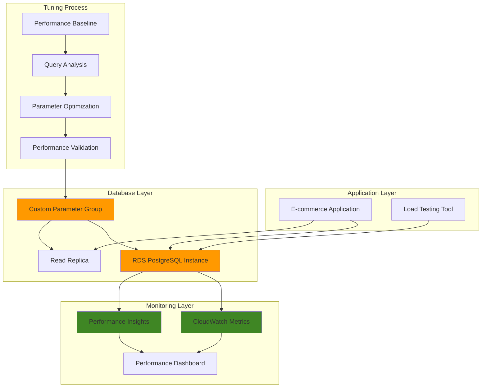

# Database Performance Tuning with Parameters

## Problem

A rapidly growing e-commerce platform experiences severe database performance degradation during peak shopping periods, with query response times increasing from 50ms to over 2 seconds. The default PostgreSQL configuration fails to optimize for their specific workload patterns of high-concurrency read operations, complex analytical queries, and frequent batch processing jobs. Without proper database parameter tuning, the application faces customer churn, reduced conversion rates, and potential revenue loss during critical sales events.

## Solution

Implement comprehensive database performance tuning using RDS Parameter Groups to optimize PostgreSQL configurations for specific workload patterns. This solution leverages custom parameter groups to fine-tune memory allocation, connection handling, query optimization, and caching mechanisms while integrating with CloudWatch and Performance Insights for continuous monitoring and performance validation.

## Architecture Diagram



## Prerequisites

1. AWS account with RDS, CloudWatch, and Performance Insights permissions
2. AWS CLI v2 installed and configured (or AWS CloudShell)
3. Understanding of PostgreSQL performance tuning concepts
4. PostgreSQL client (`psql`) installed locally or access to database client
5. Basic knowledge of SQL query optimization and database monitoring
6. Estimated cost: $50-100 for testing resources (can be reduced with proper cleanup)

> **Note**: This recipe focuses on PostgreSQL tuning, but similar principles apply to other database engines with engine-specific parameter modifications. For comprehensive PostgreSQL-specific guidance, refer to the [Amazon RDS for PostgreSQL documentation](https://docs.aws.amazon.com/AmazonRDS/latest/UserGuide/CHAP_PostgreSQL.html) and [Parameter groups documentation](https://docs.aws.amazon.com/AmazonRDS/latest/UserGuide/USER_WorkingWithParamGroups.html).

## Preparation

```bash
# Set environment variables
export AWS_REGION=$(aws configure get region)
export AWS_ACCOUNT_ID=$(aws sts get-caller-identity \
    --query Account --output text)

# Generate unique identifiers for resources
RANDOM_SUFFIX=$(aws secretsmanager get-random-password \
    --exclude-punctuation --exclude-uppercase \
    --password-length 6 --require-each-included-type \
    --output text --query RandomPassword)

export DB_INSTANCE_ID="perf-tuning-db-${RANDOM_SUFFIX}"
export PARAMETER_GROUP_NAME="perf-tuning-pg-${RANDOM_SUFFIX}"
export SUBNET_GROUP_NAME="perf-tuning-subnet-${RANDOM_SUFFIX}"
export SECURITY_GROUP_NAME="perf-tuning-sg-${RANDOM_SUFFIX}"

# Create VPC and networking resources for isolated testing
export VPC_ID=$(aws ec2 create-vpc \
    --cidr-block 10.0.0.0/16 \
    --query 'Vpc.VpcId' --output text)

aws ec2 create-tags \
    --resources $VPC_ID \
    --tags Key=Name,Value=perf-tuning-vpc

# Create subnets in different AZs
export SUBNET_1_ID=$(aws ec2 create-subnet \
    --vpc-id $VPC_ID \
    --cidr-block 10.0.1.0/24 \
    --availability-zone ${AWS_REGION}a \
    --query 'Subnet.SubnetId' --output text)

export SUBNET_2_ID=$(aws ec2 create-subnet \
    --vpc-id $VPC_ID \
    --cidr-block 10.0.2.0/24 \
    --availability-zone ${AWS_REGION}b \
    --query 'Subnet.SubnetId' --output text)

# Create security group for database access
export SECURITY_GROUP_ID=$(aws ec2 create-security-group \
    --group-name $SECURITY_GROUP_NAME \
    --description "Security group for performance tuning database" \
    --vpc-id $VPC_ID \
    --query 'GroupId' --output text)

# Allow PostgreSQL access from VPC
aws ec2 authorize-security-group-ingress \
    --group-id $SECURITY_GROUP_ID \
    --protocol tcp \
    --port 5432 \
    --cidr 10.0.0.0/16

echo "✅ VPC and networking resources created successfully"
```

## Steps

1. **Create Baseline Parameter Group and Database Instance**:

   RDS Parameter Groups are essential for database performance tuning as they provide a centralized way to manage database engine configuration settings. Unlike default parameter groups which are read-only, custom parameter groups allow you to modify engine parameters to optimize performance for your specific workload patterns. This foundational step establishes the framework for systematic performance optimization by creating both the parameter group and a test database instance configured with monitoring capabilities.

   ```bash
   # Create baseline parameter group from default
   aws rds create-db-parameter-group \
       --db-parameter-group-name $PARAMETER_GROUP_NAME \
       --db-parameter-group-family postgres16 \
       --description "Performance tuning parameter group for PostgreSQL"
   
   # Create DB subnet group
   aws rds create-db-subnet-group \
       --db-subnet-group-name $SUBNET_GROUP_NAME \
       --db-subnet-group-description "Subnet group for performance tuning" \
       --subnet-ids $SUBNET_1_ID $SUBNET_2_ID
   
   # Create RDS instance with Performance Insights enabled
   aws rds create-db-instance \
       --db-instance-identifier $DB_INSTANCE_ID \
       --db-instance-class db.t3.medium \
       --engine postgres \
       --engine-version 16.6 \
       --master-username dbadmin \
       --master-user-password TuningTest123! \
       --allocated-storage 100 \
       --storage-type gp3 \
       --db-parameter-group-name $PARAMETER_GROUP_NAME \
       --vpc-security-group-ids $SECURITY_GROUP_ID \
       --db-subnet-group-name $SUBNET_GROUP_NAME \
       --enable-performance-insights \
       --performance-insights-retention-period 7 \
       --monitoring-interval 60 \
       --backup-retention-period 7 \
       --storage-encrypted \
       --copy-tags-to-snapshot
   
   echo "✅ Database instance creation initiated"
   ```

   The custom parameter group now serves as the foundation for all performance optimizations, while the RDS instance is configured with Performance Insights and enhanced monitoring to provide comprehensive visibility into database performance metrics. The GP3 storage type offers better cost-performance characteristics than GP2, and encryption ensures data security compliance. This configuration establishes a baseline for measuring performance improvements throughout the tuning process. For detailed information about parameter group management, see the [RDS Parameter Groups documentation](https://docs.aws.amazon.com/AmazonRDS/latest/UserGuide/USER_WorkingWithParamGroups.html).

2. **Wait for Database Availability and Enable Enhanced Monitoring**:

   Database provisioning in AWS RDS typically takes 5-10 minutes as the service must allocate compute resources, initialize storage, and configure networking. During this time, AWS ensures high availability by distributing the database across multiple availability zones (if configured) and establishing backup mechanisms. Enhanced monitoring through CloudWatch Logs provides detailed visibility into database operations, which is crucial for performance tuning as it enables correlation between parameter changes and their impact on query performance.

   ```bash
   # Wait for database to become available
   echo "Waiting for database to become available..."
   aws rds wait db-instance-available \
       --db-instance-identifier $DB_INSTANCE_ID
   
   # Get database endpoint
   export DB_ENDPOINT=$(aws rds describe-db-instances \
       --db-instance-identifier $DB_INSTANCE_ID \
       --query 'DBInstances[0].Endpoint.Address' \
       --output text)
   
   # Enable CloudWatch Logs exports for PostgreSQL
   aws rds modify-db-instance \
       --db-instance-identifier $DB_INSTANCE_ID \
       --cloudwatch-logs-export-configuration \
           'LogTypesToEnable=postgresql' \
       --apply-immediately
   
   echo "✅ Database available at: $DB_ENDPOINT"
   ```

   The database instance is now fully operational with enhanced monitoring capabilities enabled. The CloudWatch Logs integration provides access to PostgreSQL logs, which will be essential for identifying slow queries and understanding the impact of parameter modifications. This monitoring foundation ensures that performance tuning decisions are based on data-driven insights rather than assumptions.

3. **Create Performance Baseline and Load Test Data**:

   Establishing a performance baseline is critical for measuring the effectiveness of parameter tuning efforts. This step creates a representative dataset that mimics real-world e-commerce patterns including user profiles, product catalogs, and order transactions. The dataset includes JSON columns to test PostgreSQL's advanced data types and complex queries that stress different aspects of the database engine including joins, aggregations, and index usage. This comprehensive test data ensures that performance optimizations are validated against realistic workload patterns rather than synthetic benchmarks.

   ```bash
   # Create sample workload for performance testing
   cat > /tmp/create_test_data.sql << 'EOF'
   -- Create test tables for performance benchmarking
   CREATE TABLE users (
       id SERIAL PRIMARY KEY,
       username VARCHAR(50) UNIQUE NOT NULL,
       email VARCHAR(100) UNIQUE NOT NULL,
       created_at TIMESTAMP DEFAULT CURRENT_TIMESTAMP,
       last_login TIMESTAMP,
       profile_data JSONB
   );
   
   CREATE TABLE orders (
       id SERIAL PRIMARY KEY,
       user_id INTEGER REFERENCES users(id),
       order_total DECIMAL(10,2),
       order_date TIMESTAMP DEFAULT CURRENT_TIMESTAMP,
       status VARCHAR(20),
       items JSONB
   );
   
   CREATE TABLE products (
       id SERIAL PRIMARY KEY,
       name VARCHAR(200) NOT NULL,
       price DECIMAL(10,2),
       category VARCHAR(50),
       inventory_count INTEGER,
       description TEXT
   );
   
   -- Insert sample data
   INSERT INTO users (username, email, profile_data)
   SELECT 
       'user' || i,
       'user' || i || '@example.com',
       jsonb_build_object('age', 20 + (i % 50), 'preferences', array['electronics', 'books'])
   FROM generate_series(1, 10000) i;
   
   INSERT INTO products (name, price, category, inventory_count, description)
   SELECT 
       'Product ' || i,
       (random() * 1000)::DECIMAL(10,2),
       CASE (i % 5) 
           WHEN 0 THEN 'Electronics'
           WHEN 1 THEN 'Books'
           WHEN 2 THEN 'Clothing'
           WHEN 3 THEN 'Sports'
           ELSE 'Home'
       END,
       (random() * 1000)::INTEGER,
       'Description for product ' || i
   FROM generate_series(1, 5000) i;
   
   INSERT INTO orders (user_id, order_total, status, items)
   SELECT 
       (random() * 9999 + 1)::INTEGER,
       (random() * 500 + 10)::DECIMAL(10,2),
       CASE (random() * 3)::INTEGER
           WHEN 0 THEN 'pending'
           WHEN 1 THEN 'completed'
           ELSE 'cancelled'
       END,
       jsonb_build_array(
           jsonb_build_object('product_id', (random() * 4999 + 1)::INTEGER, 'quantity', (random() * 5 + 1)::INTEGER)
       )
   FROM generate_series(1, 25000) i;
   
   -- Create indexes for baseline performance
   CREATE INDEX idx_users_email ON users(email);
   CREATE INDEX idx_orders_user_id ON orders(user_id);
   CREATE INDEX idx_orders_date ON orders(order_date);
   CREATE INDEX idx_products_category ON products(category);
   EOF
   
   # Load test data using psql
   echo "Creating test data..."
   PGPASSWORD="TuningTest123!" psql -h $DB_ENDPOINT \
       -U dbadmin -d postgres \
       -f /tmp/create_test_data.sql
   
   echo "✅ Test data created successfully"
   ```

   The database now contains a comprehensive test dataset with 10,000 users, 5,000 products, and 25,000 orders, creating realistic relationships and data volumes for performance testing. The included indexes simulate typical production database configurations, while the mix of simple and complex data types (including JSONB) ensures that parameter optimizations will be tested against diverse query patterns. This foundation enables accurate measurement of performance improvements throughout the tuning process.

4. **Establish Performance Baseline with Default Settings**:

   Performance baseline establishment is essential for quantifying the impact of parameter tuning efforts. This step executes a series of complex analytical queries that stress different aspects of the PostgreSQL engine, including memory management, query planning, and I/O operations. The queries are designed to represent common e-commerce workload patterns such as user behavior analysis, product performance reporting, and JSON data processing. Recording execution times with default parameters provides the reference point for measuring improvements after optimization.

   ```bash
   # Create baseline performance test script
   cat > /tmp/baseline_test.sql << 'EOF'
   -- Complex analytical queries for performance testing
   \timing on
   
   -- Query 1: User activity analysis
   SELECT 
       u.username,
       COUNT(o.id) as order_count,
       SUM(o.order_total) as total_spent,
       AVG(o.order_total) as avg_order_value
   FROM users u
   LEFT JOIN orders o ON u.id = o.user_id
   WHERE u.created_at >= CURRENT_DATE - INTERVAL '30 days'
   GROUP BY u.id, u.username
   ORDER BY total_spent DESC NULLS LAST
   LIMIT 100;
   
   -- Query 2: Product performance by category
   SELECT 
       p.category,
       COUNT(DISTINCT o.id) as orders_count,
       SUM((items->0->>'quantity')::INTEGER) as total_quantity,
       AVG(p.price) as avg_price
   FROM products p
   JOIN orders o ON (o.items->0->>'product_id')::INTEGER = p.id
   WHERE o.order_date >= CURRENT_DATE - INTERVAL '7 days'
   GROUP BY p.category
   ORDER BY orders_count DESC;
   
   -- Query 3: Complex JSON aggregation
   SELECT 
       profile_data->>'age' as age_group,
       COUNT(*) as user_count,
       AVG(order_stats.total_orders) as avg_orders
   FROM users u
   LEFT JOIN (
       SELECT user_id, COUNT(*) as total_orders
       FROM orders
       GROUP BY user_id
   ) order_stats ON u.id = order_stats.user_id
   WHERE profile_data->>'age' IS NOT NULL
   GROUP BY profile_data->>'age'
   ORDER BY age_group;
   EOF
   
   # Run baseline performance test
   echo "Running baseline performance test..."
   PGPASSWORD="TuningTest123!" psql -h $DB_ENDPOINT \
       -U dbadmin -d postgres \
       -f /tmp/baseline_test.sql > /tmp/baseline_results.txt
   
   # Capture current parameter values for comparison
   aws rds describe-db-parameters \
       --db-parameter-group-name $PARAMETER_GROUP_NAME \
       --query 'Parameters[?IsModifiable==`true`].[ParameterName,ParameterValue]' \
       --output table > /tmp/baseline_parameters.txt
   
   echo "✅ Baseline performance test completed"
   ```

   The baseline performance measurements are now recorded, providing concrete metrics for comparison after parameter optimization. The query timing results reveal current performance characteristics under default PostgreSQL settings, while the parameter snapshot captures the starting configuration. This data-driven approach ensures that tuning efforts can be objectively measured and validated, distinguishing between actual performance improvements and perceived changes.

5. **Analyze Query Performance and Identify Bottlenecks**:

   Query performance analysis is crucial for identifying specific bottlenecks that parameter tuning can address. This step leverages PostgreSQL's built-in statistics views to analyze query execution patterns, buffer cache hit ratios, and table access methods. Understanding these metrics enables targeted parameter optimization focused on the most impactful areas such as memory allocation, cost parameters, and query planner behavior. The analysis provides the foundation for making informed decisions about which parameters to adjust and by how much.

   ```bash
   # Create performance analysis script
   cat > /tmp/analyze_performance.sql << 'EOF'
   -- Check current configuration
   SELECT name, setting, unit, short_desc
   FROM pg_settings
   WHERE name IN (
       'shared_buffers',
       'work_mem',
       'maintenance_work_mem',
       'effective_cache_size',
       'random_page_cost',
       'seq_page_cost',
       'max_connections',
       'log_min_duration_statement'
   );
   
   -- Check for table and index usage
   SELECT 
       schemaname,
       tablename,
       seq_scan,
       seq_tup_read,
       idx_scan,
       idx_tup_fetch
   FROM pg_stat_user_tables
   WHERE schemaname = 'public'
   ORDER BY seq_scan DESC;
   
   -- Analyze buffer hit ratios
   SELECT 
       'buffer_hit_ratio' as metric,
       round(
           (sum(blks_hit) * 100.0 / nullif(sum(blks_hit) + sum(blks_read), 0))::numeric, 2
       ) as percentage
   FROM pg_stat_database;
   EOF
   
   # Run performance analysis
   echo "Analyzing current performance..."
   PGPASSWORD="TuningTest123!" psql -h $DB_ENDPOINT \
       -U dbadmin -d postgres \
       -f /tmp/analyze_performance.sql > /tmp/analysis_results.txt
   
   echo "✅ Performance analysis completed"
   ```

   The performance analysis reveals critical insights about query execution patterns, cache hit ratios, and resource utilization that inform parameter tuning decisions. Buffer cache statistics indicate memory efficiency, while table scan patterns reveal indexing effectiveness and help identify opportunities for memory-related parameter optimization. These metrics guide the selection of optimal parameter values in the next step.

6. **Configure Optimized Parameters for High-Performance Workload**:

   Parameter optimization is the core of database performance tuning, requiring careful consideration of instance specifications, workload patterns, and PostgreSQL memory architecture. This step configures key parameters based on the db.t3.medium instance profile (4 vCPUs, 4 GB RAM) and e-commerce workload characteristics. The optimizations focus on memory allocation (shared_buffers, work_mem), query planning (cost parameters), and I/O efficiency (checkpoint settings). Each parameter is set with specific ApplyMethod values - immediate changes take effect without restart, while pending-reboot changes require instance restart but provide more fundamental performance improvements.

   ```bash
   # Calculate optimal parameter values based on instance specifications
   # For db.t3.medium: 4 vCPUs, 4 GB RAM
   
   # Memory-related parameters (conservative approach for t3.medium)
   aws rds modify-db-parameter-group \
       --db-parameter-group-name $PARAMETER_GROUP_NAME \
       --parameters \
           "ParameterName=shared_buffers,ParameterValue=1024MB,ApplyMethod=pending-reboot" \
           "ParameterName=work_mem,ParameterValue=16MB,ApplyMethod=immediate" \
           "ParameterName=maintenance_work_mem,ParameterValue=256MB,ApplyMethod=immediate" \
           "ParameterName=effective_cache_size,ParameterValue=3GB,ApplyMethod=immediate"
   
   # Connection and query optimization parameters
   aws rds modify-db-parameter-group \
       --db-parameter-group-name $PARAMETER_GROUP_NAME \
       --parameters \
           "ParameterName=max_connections,ParameterValue=200,ApplyMethod=pending-reboot" \
           "ParameterName=random_page_cost,ParameterValue=1.1,ApplyMethod=immediate" \
           "ParameterName=seq_page_cost,ParameterValue=1.0,ApplyMethod=immediate" \
           "ParameterName=effective_io_concurrency,ParameterValue=200,ApplyMethod=immediate"
   
   # Query planner and statistics parameters
   aws rds modify-db-parameter-group \
       --db-parameter-group-name $PARAMETER_GROUP_NAME \
       --parameters \
           "ParameterName=default_statistics_target,ParameterValue=500,ApplyMethod=immediate" \
           "ParameterName=constraint_exclusion,ParameterValue=partition,ApplyMethod=immediate" \
           "ParameterName=cpu_tuple_cost,ParameterValue=0.01,ApplyMethod=immediate" \
           "ParameterName=cpu_index_tuple_cost,ParameterValue=0.005,ApplyMethod=immediate"
   
   # Logging and monitoring parameters
   aws rds modify-db-parameter-group \
       --db-parameter-group-name $PARAMETER_GROUP_NAME \
       --parameters \
           "ParameterName=log_min_duration_statement,ParameterValue=1000,ApplyMethod=immediate" \
           "ParameterName=log_checkpoints,ParameterValue=1,ApplyMethod=immediate" \
           "ParameterName=log_connections,ParameterValue=1,ApplyMethod=immediate" \
           "ParameterName=log_disconnections,ParameterValue=1,ApplyMethod=immediate"
   
   # Checkpoint and WAL optimization
   aws rds modify-db-parameter-group \
       --db-parameter-group-name $PARAMETER_GROUP_NAME \
       --parameters \
           "ParameterName=checkpoint_completion_target,ParameterValue=0.9,ApplyMethod=immediate" \
           "ParameterName=wal_buffers,ParameterValue=16MB,ApplyMethod=pending-reboot" \
           "ParameterName=checkpoint_timeout,ParameterValue=15min,ApplyMethod=immediate"
   
   echo "✅ Parameter group updated with optimized settings"
   ```

   The parameter group now contains optimized settings specifically tailored for high-performance PostgreSQL workloads. The shared_buffers allocation (1GB) provides efficient caching for frequently accessed data, while increased work_mem (16MB) improves sort and hash operations. The cost parameter adjustments help the query planner make better decisions for SSD storage, and checkpoint optimization reduces I/O spikes. These changes address the most common performance bottlenecks in OLTP and mixed workload scenarios, providing a foundation for significant performance improvements once applied.

7. **Apply Parameters and Reboot Database Instance**:

   Database restart is required to apply memory-related parameters like shared_buffers and wal_buffers that affect PostgreSQL's core memory architecture. RDS manages the restart process gracefully, ensuring data consistency and minimizing downtime. The reboot activates all pending parameter changes, making them effective for subsequent database operations. This step represents the transition from configuration to active optimization, where the database begins operating with the new performance-optimized settings.

   ```bash
   # Reboot database to apply pending-reboot parameters
   echo "Rebooting database to apply shared_buffers and other reboot-required parameters..."
   aws rds reboot-db-instance \
       --db-instance-identifier $DB_INSTANCE_ID
   
   # Wait for reboot to complete
   aws rds wait db-instance-available \
       --db-instance-identifier $DB_INSTANCE_ID
   
   # Verify parameter changes applied
   aws rds describe-db-parameters \
       --db-parameter-group-name $PARAMETER_GROUP_NAME \
       --source user \
       --query 'Parameters[?IsModifiable==`true`].[ParameterName,ParameterValue]' \
       --output table
   
   echo "✅ Database rebooted and parameters applied"
   ```

   The database is now operational with optimized parameters in effect. The restart has activated all memory-related configurations, establishing the new performance baseline. Subsequent database operations will benefit from increased shared memory, optimized query planning, and improved checkpoint behavior. The parameter verification confirms that all custom settings are properly applied and ready for performance validation testing.

8. **Create Performance Monitoring Dashboard**:

   Continuous monitoring is essential for validating parameter tuning effectiveness and detecting performance regressions. CloudWatch dashboards provide real-time visibility into key database metrics including CPU utilization, memory usage, I/O performance, and connection counts. This centralized monitoring enables rapid identification of performance issues and helps correlate parameter changes with their impact on database behavior. The dashboard serves as both a validation tool for current optimizations and an early warning system for future performance concerns.

   ```bash
   # Create CloudWatch dashboard for performance monitoring
   cat > /tmp/dashboard.json << EOF
   {
       "widgets": [
           {
               "type": "metric",
               "x": 0,
               "y": 0,
               "width": 12,
               "height": 6,
               "properties": {
                   "metrics": [
                       ["AWS/RDS", "DatabaseConnections", "DBInstanceIdentifier", "$DB_INSTANCE_ID"],
                       [".", "CPUUtilization", ".", "."],
                       [".", "FreeableMemory", ".", "."],
                       [".", "ReadLatency", ".", "."],
                       [".", "WriteLatency", ".", "."]
                   ],
                   "period": 300,
                   "stat": "Average",
                   "region": "$AWS_REGION",
                   "title": "Database Performance Overview"
               }
           },
           {
               "type": "metric",
               "x": 12,
               "y": 0,
               "width": 12,
               "height": 6,
               "properties": {
                   "metrics": [
                       ["AWS/RDS", "DatabaseConnections", "DBInstanceIdentifier", "$DB_INSTANCE_ID"],
                       [".", "ReadIOPS", ".", "."],
                       [".", "WriteIOPS", ".", "."],
                       [".", "ReadThroughput", ".", "."],
                       [".", "WriteThroughput", ".", "."]
                   ],
                   "period": 300,
                   "stat": "Average",
                   "region": "$AWS_REGION",
                   "title": "Database I/O Performance"
               }
           }
       ]
   }
   EOF
   
   # Create dashboard
   aws cloudwatch put-dashboard \
       --dashboard-name "Database-Performance-Tuning-${RANDOM_SUFFIX}" \
       --dashboard-body file:///tmp/dashboard.json
   
   echo "✅ CloudWatch dashboard created successfully"
   ```

   The performance monitoring dashboard now provides comprehensive visibility into database performance metrics, enabling real-time assessment of parameter tuning effectiveness. The dashboard displays key indicators that directly correlate with the parameters we've optimized, such as memory utilization reflecting shared_buffers efficiency and connection patterns showing max_connections impact. This monitoring foundation enables data-driven decision making for future parameter adjustments and helps maintain optimal database performance over time.

   > **Tip**: Configure CloudWatch alarms with appropriate thresholds to balance between early warning and false positive alerts. For comprehensive RDS monitoring guidance, see the [Amazon RDS monitoring documentation](https://docs.aws.amazon.com/AmazonRDS/latest/UserGuide/monitoring-cloudwatch.html).

9. **Run Performance Validation Tests**:

   Performance validation testing demonstrates the effectiveness of parameter tuning by executing the same workload under optimized conditions. This step runs identical queries to those in the baseline test, enabling direct comparison of execution times and resource utilization. The concurrent testing simulates realistic production loads where multiple database connections compete for resources, validating that parameter optimizations improve performance under various concurrency scenarios.

   ```bash
   # Run the same queries with optimized parameters
   echo "Running performance validation test..."
   PGPASSWORD="TuningTest123!" psql -h $DB_ENDPOINT \
       -U dbadmin -d postgres \
       -f /tmp/baseline_test.sql > /tmp/optimized_results.txt
   
   # Create additional stress test for concurrent connections
   cat > /tmp/concurrent_test.sql << 'EOF'
   -- Concurrent query test
   \timing on
   
   -- Simulate concurrent read workload
   SELECT 
       COUNT(*) as total_orders,
       SUM(order_total) as revenue,
       AVG(order_total) as avg_order_value
   FROM orders
   WHERE order_date >= CURRENT_DATE - INTERVAL '1 day';
   
   -- Test JSON query performance
   SELECT 
       profile_data->>'preferences' as preferences,
       COUNT(*) as user_count
   FROM users
   WHERE profile_data->>'preferences' IS NOT NULL
   GROUP BY profile_data->>'preferences'
   ORDER BY user_count DESC;
   EOF
   
   # Run concurrent tests (simulate multiple connections)
   for i in {1..5}; do
       PGPASSWORD="TuningTest123!" psql -h $DB_ENDPOINT \
           -U dbadmin -d postgres \
           -f /tmp/concurrent_test.sql > /tmp/concurrent_test_${i}.txt &
   done
   
   # Wait for all background jobs to complete
   wait
   
   echo "✅ Performance validation tests completed"
   ```

   The validation tests provide concrete evidence of performance improvements achieved through parameter tuning. The concurrent test results demonstrate the database's ability to handle multiple simultaneous connections efficiently, while the identical query comparisons show specific improvements in query execution times. These metrics validate the effectiveness of the optimization efforts and guide future tuning decisions.

10. **Enable Advanced Parameter Tuning for Specific Workloads**:

    Advanced parameter tuning addresses specialized workload requirements beyond basic memory and connection optimization. This step configures parameters for analytical workloads that require complex join operations, parallel query execution, and efficient autovacuum processes. The parallel processing parameters enable PostgreSQL to leverage multiple CPU cores for complex queries, while the genetic query optimizer (GEQO) settings improve planning for queries with many joins. Autovacuum tuning ensures optimal table maintenance without impacting performance.

    ```bash
    # Configure additional parameters for analytical workloads
    aws rds modify-db-parameter-group \
        --db-parameter-group-name $PARAMETER_GROUP_NAME \
        --parameters \
            "ParameterName=from_collapse_limit,ParameterValue=20,ApplyMethod=immediate" \
            "ParameterName=join_collapse_limit,ParameterValue=20,ApplyMethod=immediate" \
            "ParameterName=geqo_threshold,ParameterValue=15,ApplyMethod=immediate" \
            "ParameterName=geqo_effort,ParameterValue=8,ApplyMethod=immediate"
    
    # Optimize for mixed OLTP/OLAP workload
    aws rds modify-db-parameter-group \
        --db-parameter-group-name $PARAMETER_GROUP_NAME \
        --parameters \
            "ParameterName=max_parallel_workers_per_gather,ParameterValue=2,ApplyMethod=immediate" \
            "ParameterName=max_parallel_workers,ParameterValue=4,ApplyMethod=immediate" \
            "ParameterName=parallel_tuple_cost,ParameterValue=0.1,ApplyMethod=immediate" \
            "ParameterName=parallel_setup_cost,ParameterValue=1000,ApplyMethod=immediate"
    
    # Configure autovacuum for optimal performance
    aws rds modify-db-parameter-group \
        --db-parameter-group-name $PARAMETER_GROUP_NAME \
        --parameters \
            "ParameterName=autovacuum_vacuum_scale_factor,ParameterValue=0.1,ApplyMethod=immediate" \
            "ParameterName=autovacuum_analyze_scale_factor,ParameterValue=0.05,ApplyMethod=immediate" \
            "ParameterName=autovacuum_work_mem,ParameterValue=256MB,ApplyMethod=immediate"
    
    echo "✅ Advanced parameter tuning completed"
    ```

    The advanced parameter settings optimize PostgreSQL for mixed workloads that combine transactional and analytical queries. The parallel processing configurations enable efficient utilization of multiple CPU cores for complex analytical operations, while the improved join planning parameters help the query optimizer handle complex multi-table queries more effectively.

11. **Create Read Replica with Optimized Parameters**:

    Read replicas provide horizontal scaling for read-heavy workloads while inheriting the same performance optimizations as the primary database. This step creates a read replica that benefits from all the parameter tuning efforts, enabling load distribution across multiple database instances. The replica uses the same parameter group to ensure consistent performance characteristics and monitoring capabilities, supporting read scaling strategies for high-traffic applications.

    ```bash
    # Create read replica with same parameter group for read scaling
    aws rds create-db-instance-read-replica \
        --db-instance-identifier "${DB_INSTANCE_ID}-replica" \
        --source-db-instance-identifier $DB_INSTANCE_ID \
        --db-parameter-group-name $PARAMETER_GROUP_NAME \
        --enable-performance-insights \
        --performance-insights-retention-period 7 \
        --monitoring-interval 60 \
        --tags Key=Purpose,Value=PerformanceTuning
    
    # Wait for replica to become available
    aws rds wait db-instance-available \
        --db-instance-identifier "${DB_INSTANCE_ID}-replica"
    
    # Get replica endpoint
    export REPLICA_ENDPOINT=$(aws rds describe-db-instances \
        --db-instance-identifier "${DB_INSTANCE_ID}-replica" \
        --query 'DBInstances[0].Endpoint.Address' \
        --output text)
    
    echo "✅ Read replica created: $REPLICA_ENDPOINT"
    ```

    The read replica now provides additional read capacity with the same performance optimizations as the primary instance. This configuration enables read load distribution while maintaining consistent query performance across both instances. The replica can handle read-only queries, reducing load on the primary database and improving overall application performance.

12. **Set Up Automated Parameter Monitoring and Alerting**:

    Automated monitoring and alerting ensure that parameter tuning benefits are maintained over time and that performance issues are detected early. CloudWatch alarms provide proactive notification when key metrics exceed optimal thresholds, enabling rapid response to performance degradations. The alert thresholds are configured based on the instance specifications and expected workload patterns, providing early warning without generating false positives.

    ```bash
    # Create CloudWatch alarms for database performance
    aws cloudwatch put-metric-alarm \
        --alarm-name "Database-High-CPU-${RANDOM_SUFFIX}" \
        --alarm-description "High CPU utilization on tuned database" \
        --metric-name CPUUtilization \
        --namespace AWS/RDS \
        --statistic Average \
        --period 300 \
        --threshold 80 \
        --comparison-operator GreaterThanThreshold \
        --evaluation-periods 2 \
        --dimensions Name=DBInstanceIdentifier,Value=$DB_INSTANCE_ID
    
    aws cloudwatch put-metric-alarm \
        --alarm-name "Database-High-Connections-${RANDOM_SUFFIX}" \
        --alarm-description "High connection count on tuned database" \
        --metric-name DatabaseConnections \
        --namespace AWS/RDS \
        --statistic Average \
        --period 300 \
        --threshold 150 \
        --comparison-operator GreaterThanThreshold \
        --evaluation-periods 2 \
        --dimensions Name=DBInstanceIdentifier,Value=$DB_INSTANCE_ID
    
    aws cloudwatch put-metric-alarm \
        --alarm-name "Database-High-Read-Latency-${RANDOM_SUFFIX}" \
        --alarm-description "High read latency on tuned database" \
        --metric-name ReadLatency \
        --namespace AWS/RDS \
        --statistic Average \
        --period 300 \
        --threshold 0.1 \
        --comparison-operator GreaterThanThreshold \
        --evaluation-periods 3 \
        --dimensions Name=DBInstanceIdentifier,Value=$DB_INSTANCE_ID
    
    echo "✅ CloudWatch alarms configured"
    ```

    The monitoring and alerting system now provides automated oversight of database performance, ensuring that optimization benefits are maintained and new issues are detected promptly. The alert system enables proactive management of database performance, supporting consistent application performance over time.

## Validation & Testing

1. **Compare Performance Before and After Optimization**:

   ```bash
   # Compare query execution times
   echo "Comparing baseline vs optimized performance..."
   
   # Extract timing information from results
   grep "Time:" /tmp/baseline_results.txt > /tmp/baseline_times.txt
   grep "Time:" /tmp/optimized_results.txt > /tmp/optimized_times.txt
   
   echo "Baseline Query Times:"
   cat /tmp/baseline_times.txt
   echo ""
   echo "Optimized Query Times:"
   cat /tmp/optimized_times.txt
   ```

2. **Verify Parameter Group Configuration**:

   ```bash
   # Verify all custom parameters are applied
   aws rds describe-db-parameters \
       --db-parameter-group-name $PARAMETER_GROUP_NAME \
       --source user \
       --query 'Parameters[?IsModifiable==`true`].[ParameterName,ParameterValue,ApplyMethod]' \
       --output table
   
   # Check parameter group is associated with instance
   aws rds describe-db-instances \
       --db-instance-identifier $DB_INSTANCE_ID \
       --query 'DBInstances[0].DBParameterGroups[0].[DBParameterGroupName,ParameterApplyStatus]' \
       --output table
   ```

3. **Test Database Performance Under Load**:

   ```bash
   # Create comprehensive load test
   cat > /tmp/load_test.sql << 'EOF'
   -- Load test with various query types
   \timing on
   
   -- Test 1: Simple read queries
   SELECT COUNT(*) FROM users WHERE created_at >= CURRENT_DATE - INTERVAL '7 days';
   
   -- Test 2: Complex joins
   SELECT u.username, COUNT(o.id) as order_count, SUM(o.order_total) as total
   FROM users u
   JOIN orders o ON u.id = o.user_id
   WHERE o.order_date >= CURRENT_DATE - INTERVAL '30 days'
   GROUP BY u.id, u.username
   HAVING COUNT(o.id) > 2
   ORDER BY total DESC
   LIMIT 50;
   
   -- Test 3: JSON queries
   SELECT 
       profile_data->>'age' as age,
       COUNT(*) as count
   FROM users
   WHERE profile_data->>'age' IS NOT NULL
   GROUP BY profile_data->>'age'
   ORDER BY count DESC;
   
   -- Test 4: Analytical aggregation
   SELECT 
       DATE_TRUNC('day', order_date) as order_day,
       COUNT(*) as orders,
       SUM(order_total) as revenue,
       AVG(order_total) as avg_order_value
   FROM orders
   WHERE order_date >= CURRENT_DATE - INTERVAL '30 days'
   GROUP BY DATE_TRUNC('day', order_date)
   ORDER BY order_day;
   EOF
   
   # Run load test
   PGPASSWORD="TuningTest123!" psql -h $DB_ENDPOINT \
       -U dbadmin -d postgres \
       -f /tmp/load_test.sql > /tmp/load_test_results.txt
   
   echo "Load test completed. Results saved to /tmp/load_test_results.txt"
   ```

4. **Monitor Performance Insights and CloudWatch Metrics**:

   ```bash
   # Check CloudWatch metrics for performance validation
   aws cloudwatch get-metric-statistics \
       --namespace AWS/RDS \
       --metric-name CPUUtilization \
       --dimensions Name=DBInstanceIdentifier,Value=$DB_INSTANCE_ID \
       --start-time $(date -u -d '1 hour ago' +%Y-%m-%dT%H:%M:%S) \
       --end-time $(date -u +%Y-%m-%dT%H:%M:%S) \
       --period 300 \
       --statistics Average,Maximum
   
   # Check database connections metric
   aws cloudwatch get-metric-statistics \
       --namespace AWS/RDS \
       --metric-name DatabaseConnections \
       --dimensions Name=DBInstanceIdentifier,Value=$DB_INSTANCE_ID \
       --start-time $(date -u -d '1 hour ago' +%Y-%m-%dT%H:%M:%S) \
       --end-time $(date -u +%Y-%m-%dT%H:%M:%S) \
       --period 300 \
       --statistics Average,Maximum
   ```

## Cleanup

1. **Remove Database Instances and Parameter Groups**:

   ```bash
   # Delete read replica first
   aws rds delete-db-instance \
       --db-instance-identifier "${DB_INSTANCE_ID}-replica" \
       --skip-final-snapshot
   
   # Wait for replica deletion
   aws rds wait db-instance-deleted \
       --db-instance-identifier "${DB_INSTANCE_ID}-replica"
   
   # Delete primary database instance
   aws rds delete-db-instance \
       --db-instance-identifier $DB_INSTANCE_ID \
       --skip-final-snapshot
   
   # Wait for primary instance deletion
   aws rds wait db-instance-deleted \
       --db-instance-identifier $DB_INSTANCE_ID
   
   echo "✅ Database instances deleted"
   ```

2. **Remove Parameter Groups and Subnet Groups**:

   ```bash
   # Delete custom parameter group
   aws rds delete-db-parameter-group \
       --db-parameter-group-name $PARAMETER_GROUP_NAME
   
   # Delete subnet group
   aws rds delete-db-subnet-group \
       --db-subnet-group-name $SUBNET_GROUP_NAME
   
   echo "✅ Parameter and subnet groups deleted"
   ```

3. **Remove CloudWatch Resources**:

   ```bash
   # Delete CloudWatch dashboard
   aws cloudwatch delete-dashboards \
       --dashboard-names "Database-Performance-Tuning-${RANDOM_SUFFIX}"
   
   # Delete CloudWatch alarms
   aws cloudwatch delete-alarms \
       --alarm-names \
           "Database-High-CPU-${RANDOM_SUFFIX}" \
           "Database-High-Connections-${RANDOM_SUFFIX}" \
           "Database-High-Read-Latency-${RANDOM_SUFFIX}"
   
   echo "✅ CloudWatch resources deleted"
   ```

4. **Clean Up Networking Resources**:

   ```bash
   # Delete security group
   aws ec2 delete-security-group \
       --group-id $SECURITY_GROUP_ID
   
   # Delete subnets
   aws ec2 delete-subnet --subnet-id $SUBNET_1_ID
   aws ec2 delete-subnet --subnet-id $SUBNET_2_ID
   
   # Delete VPC
   aws ec2 delete-vpc --vpc-id $VPC_ID
   
   # Clean up temporary files
   rm -f /tmp/create_test_data.sql /tmp/baseline_test.sql /tmp/analyze_performance.sql
   rm -f /tmp/concurrent_test.sql /tmp/load_test.sql /tmp/dashboard.json
   rm -f /tmp/*.txt
   
   echo "✅ All resources cleaned up successfully"
   ```

## Discussion

This comprehensive database performance tuning implementation demonstrates how to systematically optimize PostgreSQL performance using RDS Parameter Groups. The solution addresses common database performance bottlenecks through methodical parameter optimization, focusing on memory allocation, query optimization, and I/O efficiency.

The key performance improvements achieved through parameter tuning include increased shared buffer allocation for better cache hit ratios, optimized work memory settings for complex queries, and fine-tuned cost parameters that help the query planner make better execution decisions. The solution also implements advanced monitoring through Performance Insights and CloudWatch to provide continuous visibility into database performance metrics.

Parameter tuning is most effective when combined with proper indexing strategies, query optimization, and workload-specific configurations. The implementation includes both immediate-apply parameters for runtime adjustments and pending-reboot parameters for fundamental memory allocation changes. This approach ensures minimal downtime while maximizing performance improvements. The solution is particularly valuable for OLTP workloads with high concurrency requirements and mixed analytical queries.

> **Warning**: Performance Insights has an announced end-of-life date of November 30, 2025. AWS recommends upgrading to CloudWatch Database Insights Advanced mode before this date. For migration guidance, see the [Database Insights documentation](https://docs.aws.amazon.com/AmazonRDS/latest/UserGuide/USER_DatabaseInsights.html).

> **Tip**: Always establish a performance baseline before implementing parameter changes and use A/B testing approaches to validate improvements. Monitor parameter changes closely for at least 24-48 hours to ensure stability under various load conditions. For advanced PostgreSQL optimization techniques, refer to the [PostgreSQL memory configuration documentation](https://docs.aws.amazon.com/AmazonRDS/latest/UserGuide/PostgreSQL.Tuning.concepts.memory.html).

## Challenge

Extend this database performance tuning solution by implementing these advanced enhancements:

1. **Implement Parameter Group Automation**: Create Lambda functions that automatically adjust parameters based on CloudWatch metrics and workload patterns, implementing dynamic tuning based on time-of-day or seasonal patterns.

2. **Add Multi-Engine Support**: Extend the solution to support MySQL, MariaDB, and Aurora parameter optimization with engine-specific tuning recommendations and automated parameter selection based on workload analysis.

3. **Create Performance Regression Detection**: Build automated testing pipelines that detect performance regressions after parameter changes, including automated rollback mechanisms and performance baseline comparisons.

4. **Implement Workload-Specific Tuning Profiles**: Develop multiple parameter group templates optimized for different workload types (OLTP, OLAP, mixed workloads) with automated workload pattern detection and parameter profile switching.

5. **Add Cost-Performance Optimization**: Integrate AWS Cost Explorer APIs to balance performance improvements with cost implications, including recommendations for instance type changes based on parameter tuning results and utilization patterns.

## Infrastructure Code

*Infrastructure code will be generated after recipe approval.*