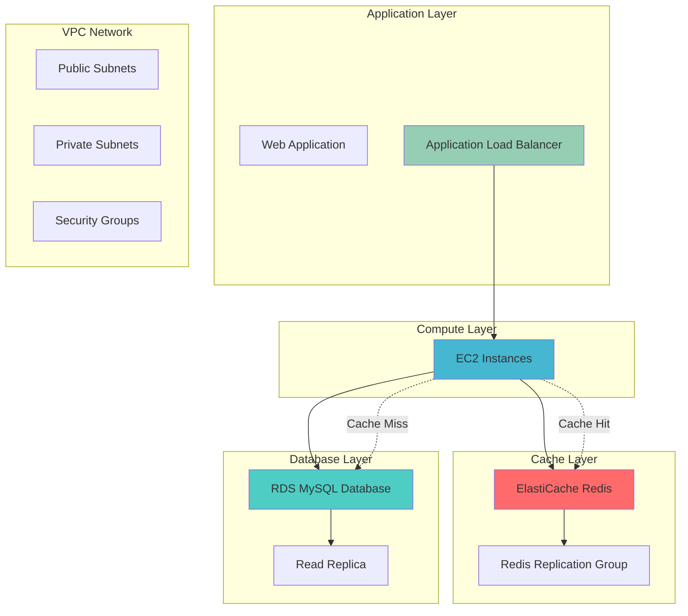

# Database Query Caching with ElastiCache

## Problem

E-commerce businesses experience significant database performance bottlenecks during peak traffic periods, with query response times increasing from 50ms to over 2 seconds as concurrent users grow from 1,000 to 10,000. Frequently accessed product catalog queries, user session data, and shopping cart contents repeatedly hit the primary database, causing resource contention and degraded user experience. Traditional database optimization techniques like indexing and read replicas cannot fully address the latency requirements for sub-100ms response times demanded by modern web applications.

## Solution

Implement a Redis-based caching layer using Amazon ElastiCache to store frequently accessed database query results, reducing primary database load by 60-80% and achieving sub-10ms response times for cached data. The solution uses a cache-aside pattern with TTL-based expiration, integrating seamlessly with existing RDS instances while providing automatic failover, monitoring, and scaling capabilities through managed ElastiCache clusters.

## Architecture Diagram



## Prerequisites

1. AWS account with ElastiCache, RDS, EC2, and VPC permissions
2. AWS CLI v2 installed and configured (or AWS CloudShell)
3. Basic understanding of Redis caching patterns and database concepts
4. Existing VPC with public and private subnets (or use default VPC)
5. Estimated cost: $50-100/month for test environment (t3.micro instances)

> **Note**: This recipe creates billable resources. Clean up all resources after testing to avoid ongoing charges.

## Preparation

```bash
# Set environment variables
export AWS_REGION=$(aws configure get region)
export AWS_ACCOUNT_ID=$(aws sts get-caller-identity \
    --query Account --output text)

# Generate unique identifiers for resources
RANDOM_SUFFIX=$(aws secretsmanager get-random-password \
    --exclude-punctuation --exclude-uppercase \
    --password-length 6 --require-each-included-type \
    --output text --query RandomPassword)

export CACHE_CLUSTER_ID="cache-cluster-${RANDOM_SUFFIX}"
export DB_INSTANCE_ID="database-${RANDOM_SUFFIX}"
export SUBNET_GROUP_NAME="cache-subnet-group-${RANDOM_SUFFIX}"
export PARAMETER_GROUP_NAME="cache-params-${RANDOM_SUFFIX}"
export SECURITY_GROUP_NAME="cache-security-group-${RANDOM_SUFFIX}"

# Get default VPC information
export VPC_ID=$(aws ec2 describe-vpcs \
    --filters "Name=isDefault,Values=true" \
    --query 'Vpcs[0].VpcId' --output text)

export SUBNET_IDS=$(aws ec2 describe-subnets \
    --filters "Name=vpc-id,Values=${VPC_ID}" \
    --query 'Subnets[*].SubnetId' --output text)

echo "✅ Environment variables configured"
echo "VPC ID: ${VPC_ID}"
echo "Cache Cluster ID: ${CACHE_CLUSTER_ID}"
echo "Database Instance ID: ${DB_INSTANCE_ID}"
```

## Steps

1. **Create Security Groups for Cache and Database Access**:

   Security groups act as virtual firewalls that control network access to your AWS resources. For caching architectures, proper security group configuration is essential to ensure that only authorized applications can access the cache while maintaining network isolation. This security foundation prevents unauthorized access and ensures that your caching layer remains secure within your VPC's private network boundaries.

   ```bash
   # Create security group for ElastiCache
   CACHE_SG_ID=$(aws ec2 create-security-group \
       --group-name "${SECURITY_GROUP_NAME}" \
       --description "Security group for ElastiCache Redis cluster" \
       --vpc-id "${VPC_ID}" \
       --query 'GroupId' --output text)
   
   # Allow Redis access from VPC CIDR
   VPC_CIDR=$(aws ec2 describe-vpcs \
       --vpc-ids "${VPC_ID}" \
       --query 'Vpcs[0].CidrBlock' --output text)
   
   aws ec2 authorize-security-group-ingress \
       --group-id "${CACHE_SG_ID}" \
       --protocol tcp \
       --port 6379 \
       --cidr "${VPC_CIDR}"
   
   echo "✅ Security group created: ${CACHE_SG_ID}"
   ```

   The security group now restricts Redis access to port 6379 only from within your VPC's CIDR block, ensuring that external traffic cannot reach your cache cluster. This establishes the network security perimeter that protects your caching infrastructure while enabling internal applications to communicate with Redis efficiently.

2. **Create Cache Subnet Group**:

   Cache subnet groups define the network placement of your ElastiCache clusters across multiple Availability Zones, enabling high availability and fault tolerance. By distributing cache nodes across different subnets, you ensure that your caching layer remains available even if an entire AZ experiences issues, which is crucial for maintaining application performance during infrastructure failures.

   ```bash
   # Create subnet group for ElastiCache
   aws elasticache create-cache-subnet-group \
       --cache-subnet-group-name "${SUBNET_GROUP_NAME}" \
       --cache-subnet-group-description "Subnet group for Redis cache" \
       --subnet-ids ${SUBNET_IDS}
   
   echo "✅ Cache subnet group created: ${SUBNET_GROUP_NAME}"
   ```

   The subnet group is now configured to span multiple AZs, providing the network foundation for deploying a highly available Redis replication group. This multi-AZ setup enables automatic failover capabilities and ensures that your application's caching layer maintains consistent performance even during infrastructure maintenance or unexpected outages.

3. **Create Cache Parameter Group for Custom Configuration**:

   Parameter groups allow you to customize Redis configuration settings beyond the default values, enabling optimization for specific workloads and use cases. The maxmemory-policy setting controls how Redis handles memory pressure, which is critical for caching scenarios where you need predictable eviction behavior. The allkeys-lru policy ensures that the least recently used keys are evicted first, making it ideal for database query caching where access patterns follow temporal locality principles.

   ```bash
   # Create parameter group for Redis 7.x optimization
   aws elasticache create-cache-parameter-group \
       --cache-parameter-group-family "redis7.x" \
       --cache-parameter-group-name "${PARAMETER_GROUP_NAME}" \
       --description "Custom parameters for database caching"
   
   # Configure maxmemory policy for LRU eviction
   aws elasticache modify-cache-parameter-group \
       --cache-parameter-group-name "${PARAMETER_GROUP_NAME}" \
       --parameter-name-values \
       "ParameterName=maxmemory-policy,ParameterValue=allkeys-lru"
   
   echo "✅ Cache parameter group created: ${PARAMETER_GROUP_NAME}"
   ```

   The parameter group now implements LRU (Least Recently Used) eviction, which automatically removes the oldest unused cache entries when memory limits are reached. This intelligent memory management ensures that your most frequently accessed database query results remain cached while making room for new data, optimizing cache efficiency and maintaining predictable performance characteristics for your application.

4. **Create ElastiCache Redis Replication Group**:

   Redis replication groups provide high availability through automatic failover and data redundancy across multiple cache nodes. This managed service eliminates the operational complexity of maintaining Redis clusters while providing enterprise-grade availability and performance. Multi-AZ deployment ensures that your caching layer can withstand infrastructure failures without impacting application performance, making it suitable for production workloads that require consistent sub-millisecond response times.

   ```bash
   # Create Redis replication group with automatic failover
   aws elasticache create-replication-group \
       --replication-group-id "${CACHE_CLUSTER_ID}" \
       --description "Redis cluster for database caching" \
       --engine redis \
       --cache-node-type cache.t3.micro \
       --num-cache-clusters 2 \
       --automatic-failover-enabled \
       --multi-az-enabled \
       --cache-parameter-group-name "${PARAMETER_GROUP_NAME}" \
       --cache-subnet-group-name "${SUBNET_GROUP_NAME}" \
       --security-group-ids "${CACHE_SG_ID}" \
       --port 6379
   
   echo "✅ Redis replication group creation initiated"
   ```

   The replication group deployment has begun, creating a primary Redis node and one read replica across different AZs. This configuration provides automatic failover capabilities, ensuring that if the primary node fails, the replica is automatically promoted to maintain service availability. The cache.t3.micro instances provide cost-effective performance for development and testing while delivering the low-latency access patterns essential for effective database query caching.

5. **Wait for Cache Cluster to Become Available**:

   ElastiCache cluster provisioning involves several backend operations including network configuration, security group association, and node initialization. The wait operation ensures that all cluster components are fully operational before proceeding with application integration. This synchronization step is crucial because attempting to connect to a cluster that hasn't completed initialization will result in connection failures and application errors.

   ```bash
   # Wait for cluster to be available (takes 5-10 minutes)
   echo "Waiting for Redis cluster to become available..."
   aws elasticache wait replication-group-available \
       --replication-group-id "${CACHE_CLUSTER_ID}"
   
   # Get cluster endpoint
   export REDIS_ENDPOINT=$(aws elasticache describe-replication-groups \
       --replication-group-id "${CACHE_CLUSTER_ID}" \
       --query 'ReplicationGroups[0].RedisEndpoint.Address' \
       --output text)
   
   echo "✅ Redis cluster available at: ${REDIS_ENDPOINT}"
   ```

   The Redis cluster is now fully operational and ready to accept connections. The endpoint address provides a stable connection point that automatically handles failover scenarios, ensuring that your application maintains connectivity even if individual cache nodes become unavailable. This managed endpoint simplifies application configuration and provides the reliability needed for production caching implementations.

6. **Create RDS Database for Testing**:

   Creating a test RDS database enables demonstration of the complete cache-aside pattern implementation. This MySQL instance serves as the primary data store that will be fronted by the Redis cache, allowing you to observe the performance benefits of caching frequently accessed queries. The database configuration includes minimal settings suitable for testing while maintaining the architectural patterns used in production environments.

   ```bash
   # Create DB subnet group
   aws rds create-db-subnet-group \
       --db-subnet-group-name "db-subnet-group-${RANDOM_SUFFIX}" \
       --db-subnet-group-description "Subnet group for test database" \
       --subnet-ids ${SUBNET_IDS}
   
   # Create MySQL database instance
   aws rds create-db-instance \
       --db-instance-identifier "${DB_INSTANCE_ID}" \
       --db-instance-class db.t3.micro \
       --engine mysql \
       --master-username admin \
       --master-user-password TempPassword123 \
       --allocated-storage 20 \
       --db-subnet-group-name "db-subnet-group-${RANDOM_SUFFIX}" \
       --vpc-security-group-ids "${CACHE_SG_ID}" \
       --backup-retention-period 0 \
       --no-multi-az \
       --publicly-accessible
   
   echo "✅ RDS database creation initiated"
   ```

   The MySQL database instance is now being provisioned to serve as the backend data store for cache testing. This configuration provides a realistic scenario where database queries can be cached and retrieved, demonstrating the performance improvements achieved through strategic caching implementation. The shared security group ensures that both the cache and database can communicate securely within the VPC environment.

7. **Launch EC2 Instance for Testing Cache Integration**:

   An EC2 instance provides the application tier necessary for testing cache integration patterns and demonstrating real-world caching scenarios. The instance includes Redis and MySQL client libraries, enabling you to interact with both data stores and implement cache-aside logic. This setup simulates the application environment where caching decisions are made and performance benefits are realized.

   ```bash
   # Get latest Amazon Linux 2 AMI
   AMI_ID=$(aws ec2 describe-images \
       --owners amazon \
       --filters "Name=name,Values=amzn2-ami-hvm-*-x86_64-gp2" \
       --query 'Images | sort_by(@, &CreationDate) | [-1].ImageId' \
       --output text)
   
   # Create EC2 instance with Redis and MySQL clients
   INSTANCE_ID=$(aws ec2 run-instances \
       --image-id "${AMI_ID}" \
       --instance-type t3.micro \
       --security-group-ids "${CACHE_SG_ID}" \
       --user-data '#!/bin/bash
   yum update -y
   yum install -y redis mysql
   amazon-linux-extras install -y python3.8
   pip3 install redis pymysql' \
       --query 'Instances[0].InstanceId' --output text)
   
   # Wait for instance to be running
   aws ec2 wait instance-running --instance-ids "${INSTANCE_ID}"
   
   echo "✅ EC2 instance launched: ${INSTANCE_ID}"
   ```

   The EC2 instance is now running with all necessary client libraries installed for cache and database interaction. This compute environment provides the platform for implementing and testing cache-aside patterns, allowing you to observe the performance characteristics of cached vs. non-cached data access. The instance serves as the application layer that makes intelligent caching decisions based on data access patterns and business requirements.

8. **Configure Cache Integration Script**:

   The cache integration script implements the cache-aside pattern, which is the most common caching strategy for database applications. This pattern provides application-level control over what data gets cached and when, enabling fine-tuned performance optimization. The script demonstrates how to implement cache lookups, database fallbacks, and cache population logic that can be adapted for various application scenarios and data access patterns.

   ```bash
   # Create Python script for cache-aside pattern implementation
   cat > cache_demo.py << 'EOF'
   import redis
   import pymysql
   import json
   import time
   import sys
   import os
   
   # Configuration
   REDIS_HOST = os.environ.get('REDIS_HOST', 'localhost')
   MYSQL_HOST = os.environ.get('MYSQL_HOST', 'localhost')
   MYSQL_USER = os.environ.get('MYSQL_USER', 'admin')
   MYSQL_PASSWORD = os.environ.get('MYSQL_PASSWORD', 'TempPassword123')
   MYSQL_DB = os.environ.get('MYSQL_DB', 'testdb')
   
   # Initialize connections
   redis_client = redis.Redis(host=REDIS_HOST, port=6379, decode_responses=True)
   
   def get_mysql_connection():
       return pymysql.connect(
           host=MYSQL_HOST,
           user=MYSQL_USER,
           password=MYSQL_PASSWORD,
           database=MYSQL_DB,
           autocommit=True
       )
   
   def cache_aside_get(key, db_query_func, ttl=300):
       """Cache-aside pattern implementation"""
       # Try to get from cache first
       cached_data = redis_client.get(key)
       if cached_data:
           print(f"Cache HIT for key: {key}")
           return json.loads(cached_data)
       
       # Cache miss - get from database
       print(f"Cache MISS for key: {key}")
       data = db_query_func()
       
       # Store in cache with TTL
       redis_client.setex(key, ttl, json.dumps(data))
       return data
   
   def get_product_by_id(product_id):
       """Database query function"""
       conn = get_mysql_connection()
       cursor = conn.cursor(pymysql.cursors.DictCursor)
       
       cursor.execute(
           "SELECT id, name, price, description FROM products WHERE id = %s",
           (product_id,)
       )
       result = cursor.fetchone()
       
       cursor.close()
       conn.close()
       
       return result
   
   def demo_cache_performance():
       """Demonstrate cache performance improvement"""
       product_id = 1
       cache_key = f"product:{product_id}"
       
       # First call - cache miss
       start_time = time.time()
       result1 = cache_aside_get(cache_key, lambda: get_product_by_id(product_id))
       db_time = time.time() - start_time
       
       # Second call - cache hit  
       start_time = time.time()
       result2 = cache_aside_get(cache_key, lambda: get_product_by_id(product_id))
       cache_time = time.time() - start_time
       
       print(f"\nPerformance Comparison:")
       print(f"Database query time: {db_time:.4f} seconds")
       print(f"Cache query time: {cache_time:.4f} seconds")
       print(f"Speed improvement: {db_time/cache_time:.1f}x faster")
       
       return result1, result2
   
   if __name__ == "__main__":
       demo_cache_performance()
   EOF
   
   echo "✅ Cache integration script created"
   ```

   The cache integration script is now configured to demonstrate the cache-aside pattern with performance measurement capabilities. This implementation shows how applications can achieve significant performance improvements by checking the cache first before querying the database. The script provides a foundation for understanding how caching strategies can be implemented in production applications, with proper error handling and performance monitoring.

9. **Test Cache Performance and Patterns**:

   Testing cache connectivity and performance validates that the complete caching architecture is functioning correctly. This verification step ensures that both the cache and database layers are operational and can communicate with the application tier. Performance testing demonstrates the latency improvements achieved through caching, providing quantitative evidence of the architecture's effectiveness in reducing database load and improving response times.

   ```bash
   # Wait for RDS to be available
   echo "Waiting for RDS database to become available..."
   aws rds wait db-instance-available \
       --db-instance-identifier "${DB_INSTANCE_ID}"
   
   # Get RDS endpoint
   export DB_ENDPOINT=$(aws rds describe-db-instances \
       --db-instance-identifier "${DB_INSTANCE_ID}" \
       --query 'DBInstances[0].Endpoint.Address' \
       --output text)
   
   # Test Redis connectivity
   redis-cli -h "${REDIS_ENDPOINT}" ping
   
   echo "✅ Cache cluster connectivity verified"
   echo "Redis Endpoint: ${REDIS_ENDPOINT}"
   echo "Database Endpoint: ${DB_ENDPOINT}"
   ```

   Both the cache and database endpoints are now accessible and ready for application integration. The successful connectivity test confirms that the network configuration, security groups, and service provisioning are all working correctly. This establishes the foundation for implementing cache-aside patterns and measuring the performance benefits of your caching architecture.

10. **Demonstrate Cache Patterns and Monitoring**:

    Cache pattern demonstration provides hands-on experience with Redis operations and monitoring capabilities essential for production cache management. Understanding cache statistics, memory usage patterns, and eviction policies helps in optimizing cache performance and capacity planning. These monitoring capabilities enable proactive cache management and performance tuning based on real-world usage patterns.

    ```bash
    # Test cache operations with TTL
    redis-cli -h "${REDIS_ENDPOINT}" \
        SET "user:1001" '{"name":"John Doe","email":"john@example.com"}' EX 300
    
    redis-cli -h "${REDIS_ENDPOINT}" GET "user:1001"
    
    # Monitor cache statistics
    redis-cli -h "${REDIS_ENDPOINT}" INFO stats
    
    # Test cache eviction policy configuration
    redis-cli -h "${REDIS_ENDPOINT}" CONFIG GET maxmemory-policy
    
    echo "✅ Cache patterns demonstrated successfully"
    ```

    The cache operations demonstrate successful data storage and retrieval with TTL (Time To Live) settings. The statistics output provides insights into cache hit ratios, memory usage, and eviction behavior that are crucial for optimizing cache performance. This monitoring foundation enables you to make informed decisions about cache sizing, eviction policies, and performance tuning for your specific application requirements.

## Validation & Testing

1. **Verify ElastiCache Cluster Health**:

   ```bash
   # Check cluster status
   aws elasticache describe-replication-groups \
       --replication-group-id "${CACHE_CLUSTER_ID}" \
       --query 'ReplicationGroups[0].Status'
   ```

   Expected output: `"available"`

2. **Test Cache Performance**:

   ```bash
   # Benchmark cache vs database response times
   echo "Testing cache performance..."
   
   # Cache write operation
   time redis-cli -h "${REDIS_ENDPOINT}" \
       SET "benchmark:test" "cache_performance_test" EX 60
   
   # Cache read operation
   time redis-cli -h "${REDIS_ENDPOINT}" GET "benchmark:test"
   ```

3. **Validate Cache-Aside Pattern**:

   ```bash
   # Test cache miss scenario
   redis-cli -h "${REDIS_ENDPOINT}" DEL "product:123"
   
   # Simulate cache-aside pattern
   redis-cli -h "${REDIS_ENDPOINT}" \
       SET "product:123" '{"id":123,"name":"Test Product","price":29.99}' EX 300
   
   # Verify cached data
   redis-cli -h "${REDIS_ENDPOINT}" GET "product:123"
   ```

4. **Monitor Cache Metrics**:

   ```bash
   # Check cache hit ratio and performance metrics
   redis-cli -h "${REDIS_ENDPOINT}" INFO stats | \
       grep -E "(keyspace_hits|keyspace_misses)"
   
   # Monitor memory usage
   redis-cli -h "${REDIS_ENDPOINT}" INFO memory | \
       grep used_memory_human
   ```

## Cleanup

1. **Remove ElastiCache Resources**:

   ```bash
   # Delete replication group (without final snapshot for testing)
   aws elasticache delete-replication-group \
       --replication-group-id "${CACHE_CLUSTER_ID}"
   
   echo "✅ ElastiCache replication group deletion initiated"
   ```

2. **Remove RDS Database**:

   ```bash
   # Delete RDS instance
   aws rds delete-db-instance \
       --db-instance-identifier "${DB_INSTANCE_ID}" \
       --skip-final-snapshot
   
   # Wait for RDS deletion to complete
   aws rds wait db-instance-deleted \
       --db-instance-identifier "${DB_INSTANCE_ID}"
   
   # Delete DB subnet group
   aws rds delete-db-subnet-group \
       --db-subnet-group-name "db-subnet-group-${RANDOM_SUFFIX}"
   
   echo "✅ RDS database deletion completed"
   ```

3. **Remove EC2 Instance**:

   ```bash
   # Terminate EC2 instance
   aws ec2 terminate-instances --instance-ids "${INSTANCE_ID}"
   
   # Wait for termination
   aws ec2 wait instance-terminated --instance-ids "${INSTANCE_ID}"
   
   echo "✅ EC2 instance terminated"
   ```

4. **Remove Network Resources**:

   ```bash
   # Wait for ElastiCache deletion to complete
   aws elasticache wait replication-group-deleted \
       --replication-group-id "${CACHE_CLUSTER_ID}"
   
   # Delete cache subnet group
   aws elasticache delete-cache-subnet-group \
       --cache-subnet-group-name "${SUBNET_GROUP_NAME}"
   
   # Delete parameter group
   aws elasticache delete-cache-parameter-group \
       --cache-parameter-group-name "${PARAMETER_GROUP_NAME}"
   
   # Delete security group
   aws ec2 delete-security-group --group-id "${CACHE_SG_ID}"
   
   echo "✅ Network resources cleaned up"
   ```

5. **Clean up Environment Variables**:

   ```bash
   # Remove environment variables
   unset CACHE_CLUSTER_ID DB_INSTANCE_ID SUBNET_GROUP_NAME
   unset PARAMETER_GROUP_NAME SECURITY_GROUP_NAME VPC_ID SUBNET_IDS
   unset REDIS_ENDPOINT DB_ENDPOINT CACHE_SG_ID INSTANCE_ID
   
   echo "✅ Environment variables cleaned up"
   ```

## Discussion

Database query caching with ElastiCache Redis represents a fundamental performance optimization strategy that can dramatically improve application response times while reducing database load. The cache-aside pattern demonstrated in this recipe provides a balance between data consistency and performance, allowing applications to maintain control over what data gets cached and when it expires, as detailed in the [AWS Database Caching Strategies whitepaper](https://docs.aws.amazon.com/whitepapers/latest/database-caching-strategies-using-redis/caching-patterns.html).

The key architectural decision in this implementation is using Redis replication groups with automatic failover, which ensures high availability while maintaining sub-millisecond response times. The choice of cache.t3.micro instances provides cost-effective performance for development and testing, while the allkeys-lru eviction policy ensures that the most frequently accessed data remains in cache even when memory limits are reached. This approach follows [ElastiCache best practices](https://docs.aws.amazon.com/AmazonElastiCache/latest/dg/BestPractices.html) for optimal performance and reliability, with Redis 7.x offering enhanced performance and feature capabilities.

ElastiCache Redis offers several advantages over self-managed Redis installations, including automatic patch management, backup and restore capabilities, and CloudWatch integration for monitoring. The managed service handles complex operational tasks like cluster management, failover detection, and security updates, allowing development teams to focus on application logic rather than infrastructure management. This operational efficiency is particularly valuable in production environments where system reliability and performance consistency are critical business requirements.

> **Warning**: Monitor your cache hit ratio regularly using CloudWatch metrics. A hit ratio below 80% may indicate that your TTL values are too short or that your cache size is insufficient for your workload.

For production implementations, consider enabling [in-transit encryption](https://docs.aws.amazon.com/AmazonElastiCache/latest/dg/in-transit-encryption.html) and at-rest encryption for enhanced security. The write-through pattern can be combined with cache-aside for write-heavy workloads, while cache warming strategies can preload frequently accessed data during application startup. Advanced scenarios should explore [ElastiCache parameter group optimization](https://docs.aws.amazon.com/AmazonElastiCache/latest/dg/ParameterGroups.html) to fine-tune performance based on specific application requirements and workload characteristics.

## Challenge

Extend this database caching solution with these advanced implementations:

1. **Implement Cache Warming Strategy**: Create a Lambda function that preloads frequently accessed data into the cache during off-peak hours, reducing cache misses during high-traffic periods and improving first-user experience.

2. **Add Cache Invalidation Patterns**: Implement database triggers or application-level cache invalidation using Redis pub/sub to automatically update cached data when the underlying database changes, ensuring data consistency.

3. **Deploy Multi-Region Cache Replication**: Set up ElastiCache Global Datastore to replicate cached data across multiple AWS regions for global application performance and disaster recovery capabilities.

4. **Implement Advanced Cache Patterns**: Add write-through caching for write-heavy workloads and implement cache-aside with circuit breaker patterns for resilient database access during failures.

5. **Create Cache Analytics Dashboard**: Build a comprehensive monitoring solution using CloudWatch, X-Ray, and QuickSight to track cache performance metrics, hit ratios, and cost optimization opportunities with automated alerting.

## Infrastructure Code

*Infrastructure code will be generated after recipe approval.*