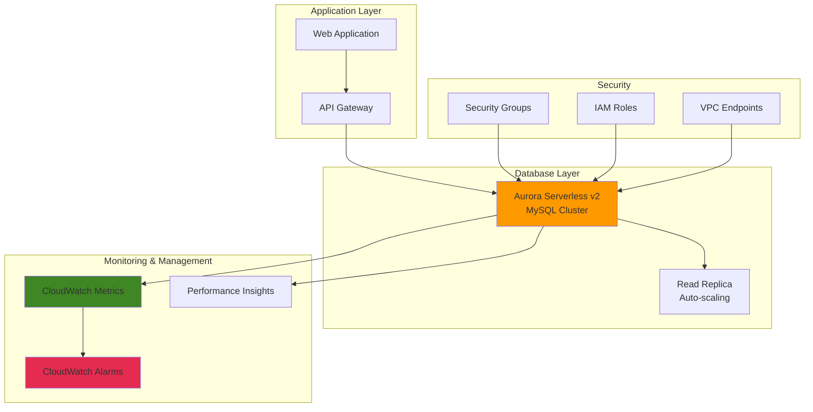

# Database Scaling with Aurora Serverless


## Problem

E-commerce companies face unpredictable database workloads with significant traffic spikes during sales events, seasonal promotions, or viral content. Traditional provisioned databases require constant capacity planning and often result in over-provisioning to handle peak loads, leading to unnecessary costs during low-traffic periods. Manual scaling processes are too slow to respond to sudden demand changes, potentially causing performance degradation or downtime during critical business moments.

## Solution

Aurora Serverless v2 provides automatic database scaling that adjusts compute capacity based on actual demand in real-time. By configuring capacity ranges and scaling policies, organizations can ensure optimal performance during traffic spikes while minimizing costs during idle periods. The solution includes monitoring, alerting, and cost optimization strategies to maintain both performance and budget efficiency.

## Architecture Diagram



## Prerequisites

1. AWS account with permissions for RDS, CloudWatch, IAM, and VPC management
2. AWS CLI v2 installed and configured (or AWS CloudShell)
3. Basic understanding of database concepts and Aurora architecture
4. VPC with at least two subnets in different Availability Zones
5. Estimated cost: $15-50 for Aurora Serverless v2 capacity during testing (0.5-16 ACUs)

> **Note**: Aurora Serverless v2 charges based on Aurora Capacity Units (ACUs) consumed. Minimum billing is 0.5 ACU per hour when active.

## Preparation

```bash
# Set environment variables
export AWS_REGION=$(aws configure get region)
export AWS_ACCOUNT_ID=$(aws sts get-caller-identity \
    --query Account --output text)

# Generate unique identifiers for resources
RANDOM_SUFFIX=$(aws secretsmanager get-random-password \
    --exclude-punctuation --exclude-uppercase \
    --password-length 6 --require-each-included-type \
    --output text --query RandomPassword)

export CLUSTER_ID="aurora-serverless-${RANDOM_SUFFIX}"
export DB_USERNAME="admin"
export DB_PASSWORD="ServerlessTest123!"
export SUBNET_GROUP_NAME="aurora-serverless-subnet-group-${RANDOM_SUFFIX}"

# Get default VPC ID and subnets
export VPC_ID=$(aws ec2 describe-vpcs \
    --filters "Name=is-default,Values=true" \
    --query 'Vpcs[0].VpcId' --output text)

export SUBNET_IDS=$(aws ec2 describe-subnets \
    --filters "Name=vpc-id,Values=${VPC_ID}" \
    --query 'Subnets[0:2].SubnetId' --output text)

# Create DB subnet group
aws rds create-db-subnet-group \
    --db-subnet-group-name $SUBNET_GROUP_NAME \
    --db-subnet-group-description "Subnet group for Aurora Serverless" \
    --subnet-ids $SUBNET_IDS

echo "✅ Environment prepared with cluster ID: $CLUSTER_ID"
```

## Steps

1. **Create Security Group for Aurora Serverless**:

   Security groups act as virtual firewalls that control inbound and outbound traffic for your Aurora cluster. Proper security group configuration is essential for database security, ensuring only authorized resources can access your Aurora Serverless cluster while maintaining network isolation. Aurora Serverless benefits from VPC security groups that provide network-level access control, complementing Aurora's built-in authentication and authorization mechanisms.

   ```bash
   # Create security group
   export SG_ID=$(aws ec2 create-security-group \
       --group-name "aurora-serverless-sg-${RANDOM_SUFFIX}" \
       --description "Security group for Aurora Serverless cluster" \
       --vpc-id $VPC_ID \
       --query 'GroupId' --output text)
   
   # Allow MySQL access from within VPC
   aws ec2 authorize-security-group-ingress \
       --group-id $SG_ID \
       --protocol tcp \
       --port 3306 \
       --cidr 10.0.0.0/8
   
   echo "✅ Security group created: $SG_ID"
   ```

   The security group is now configured to allow MySQL connections (port 3306) from within the VPC's private network ranges. This configuration follows AWS security best practices by restricting access to internal networks only. For production environments, consider implementing more restrictive CIDR blocks or specific security group references. Learn more about [Aurora security groups](https://docs.aws.amazon.com/AmazonRDS/latest/UserGuide/Overview.RDSSecurityGroups.html).

2. **Create Aurora Serverless v2 Cluster**:

   Aurora Serverless v2 represents a breakthrough in database scaling technology, providing automatic capacity adjustment based on actual workload demands. Unlike traditional provisioned instances, Aurora Serverless v2 can scale in increments as small as 0.5 Aurora Capacity Units (ACUs), enabling precise cost optimization for variable workloads. This configuration enables your database to automatically scale from 0.5 ACUs (1 GB RAM, 2 vCPUs) to 16 ACUs (32 GB RAM, 8 vCPUs) based on CPU utilization, connection count, and query complexity.

   ```bash
   # Create Aurora MySQL cluster with Serverless v2 scaling
   aws rds create-db-cluster \
       --db-cluster-identifier $CLUSTER_ID \
       --engine aurora-mysql \
       --engine-version 8.0.mysql_aurora.3.02.0 \
       --master-username $DB_USERNAME \
       --master-user-password $DB_PASSWORD \
       --db-subnet-group-name $SUBNET_GROUP_NAME \
       --vpc-security-group-ids $SG_ID \
       --serverless-v2-scaling-configuration \
           MinCapacity=0.5,MaxCapacity=16 \
       --enable-cloudwatch-logs-exports error,general,slowquery \
       --backup-retention-period 7 \
       --deletion-protection
   
   echo "✅ Aurora Serverless v2 cluster creation initiated"
   ```

   The cluster is now being created with automatic scaling enabled and comprehensive logging configured. The serverless v2 scaling configuration ensures cost-effective operations by scaling down during low-demand periods while maintaining the ability to handle traffic spikes automatically. CloudWatch logs export enables detailed monitoring and troubleshooting capabilities. Explore more about [Aurora Serverless v2 capabilities](https://docs.aws.amazon.com/AmazonRDS/latest/AuroraUserGuide/aurora-serverless-v2.html).

3. **Create the Primary (Writer) DB Instance**:

   Aurora's architecture separates compute from storage, enabling multiple database instances to access the same underlying storage layer. The writer instance handles all write operations and can also serve read queries, providing the primary point of data modification for your applications. Aurora Serverless v2 writer instances use the `db.serverless` class, which automatically adjusts compute resources based on workload demands without manual intervention.

   ```bash
   # Create writer instance for the cluster
   aws rds create-db-instance \
       --db-instance-identifier "${CLUSTER_ID}-writer" \
       --db-cluster-identifier $CLUSTER_ID \
       --engine aurora-mysql \
       --db-instance-class db.serverless \
       --promotion-tier 1 \
       --enable-performance-insights \
       --performance-insights-retention-period 7
   
   # Wait for cluster to become available
   echo "Waiting for cluster to become available..."
   aws rds wait db-cluster-available \
       --db-cluster-identifier $CLUSTER_ID
   
   echo "✅ Writer instance created and cluster is available"
   ```

   The writer instance is now operational with Performance Insights enabled for advanced monitoring. Performance Insights provides detailed database performance metrics, wait events, and query analysis to help optimize application performance. The promotion tier setting ensures proper failover behavior in multi-instance configurations. The cluster is ready to accept connections and handle database operations.

4. **Add Aurora Serverless v2 Read Replica**:

   Aurora read replicas distribute read workloads across multiple instances, improving application performance and providing high availability. Each Aurora Serverless v2 read replica can scale independently based on its specific workload, allowing optimal resource utilization for different types of read operations. This architecture enables horizontal scaling for read-heavy workloads while maintaining strong consistency through Aurora's shared storage layer.

   ```bash
   # Create read replica with independent scaling
   aws rds create-db-instance \
       --db-instance-identifier "${CLUSTER_ID}-reader" \
       --db-cluster-identifier $CLUSTER_ID \
       --engine aurora-mysql \
       --db-instance-class db.serverless \
       --promotion-tier 2 \
       --enable-performance-insights \
       --performance-insights-retention-period 7
   
   # Wait for reader instance to be available
   aws rds wait db-instance-available \
       --db-instance-identifier "${CLUSTER_ID}-reader"
   
   echo "✅ Read replica created and available"
   ```

   The read replica is now available to handle read-only queries, providing additional capacity for read-heavy workloads. Applications can connect to the reader endpoint for reporting, analytics, or read-only operations, reducing load on the primary writer instance. The independent scaling capability ensures each instance optimizes resources based on its specific workload patterns. Learn more about [Aurora read scaling](https://docs.aws.amazon.com/AmazonRDS/latest/AuroraUserGuide/Aurora.Managing.Performance.html).

5. **Configure CloudWatch Monitoring and Alarms**:

   CloudWatch monitoring provides essential visibility into Aurora Serverless v2 performance and scaling behavior. By monitoring ACU (Aurora Capacity Units) consumption, you can optimize capacity settings and identify scaling patterns that indicate application behavior changes. Proper alerting ensures proactive response to performance issues and cost optimization opportunities, enabling data-driven decisions about scaling configurations.

   ```bash
   # Create alarm for high ACU utilization
   aws cloudwatch put-metric-alarm \
       --alarm-name "Aurora-${CLUSTER_ID}-High-ACU" \
       --alarm-description "Alert when ACU usage is high" \
       --metric-name ServerlessDatabaseCapacity \
       --namespace AWS/RDS \
       --statistic Average \
       --period 300 \
       --threshold 12 \
       --comparison-operator GreaterThanThreshold \
       --evaluation-periods 2 \
       --dimensions Name=DBClusterIdentifier,Value=$CLUSTER_ID
   
   # Create alarm for low ACU utilization
   aws cloudwatch put-metric-alarm \
       --alarm-name "Aurora-${CLUSTER_ID}-Low-ACU" \
       --alarm-description "Alert when ACU usage is consistently low" \
       --metric-name ServerlessDatabaseCapacity \
       --namespace AWS/RDS \
       --statistic Average \
       --period 900 \
       --threshold 1 \
       --comparison-operator LessThanThreshold \
       --evaluation-periods 4 \
       --dimensions Name=DBClusterIdentifier,Value=$CLUSTER_ID
   
   echo "✅ CloudWatch alarms configured for capacity monitoring"
   ```

   The monitoring alarms are now actively tracking ACU consumption patterns. The high-ACU alarm triggers when usage approaches maximum capacity, indicating potential need for increased limits or application optimization. The low-ACU alarm identifies extended periods of minimal usage, suggesting opportunities for minimum capacity adjustments. These metrics enable continuous optimization of cost and performance balance. Explore [CloudWatch monitoring for Aurora](https://docs.aws.amazon.com/AmazonRDS/latest/UserGuide/monitoring-cloudwatch.html) for additional metrics.

   > **Tip**: Configure CloudWatch alarms with appropriate thresholds to balance between early warning and false positive alerts.

6. **Retrieve Database Connection Endpoints**:

   Aurora provides distinct endpoints for different types of database operations, enabling optimal connection routing and load distribution. The writer endpoint directs connections to the primary instance for read-write operations, while the reader endpoint automatically load-balances connections across available read replicas. This endpoint separation enables applications to optimize performance by directing appropriate workloads to the most suitable instances.

   ```bash
   # Get cluster endpoint
   export CLUSTER_ENDPOINT=$(aws rds describe-db-clusters \
       --db-cluster-identifier $CLUSTER_ID \
       --query 'DBClusters[0].Endpoint' --output text)
   
   export READER_ENDPOINT=$(aws rds describe-db-clusters \
       --db-cluster-identifier $CLUSTER_ID \
       --query 'DBClusters[0].ReaderEndpoint' --output text)
   
   echo "Writer Endpoint: $CLUSTER_ENDPOINT"
   echo "Reader Endpoint: $READER_ENDPOINT"
   echo "✅ Cluster endpoints retrieved"
   ```

   The endpoints are now available for application connections. Applications should use the writer endpoint for transactions requiring data modification and the reader endpoint for read-only operations like reporting or analytics. This connection pattern optimizes performance and enables horizontal scaling of read operations across multiple instances.

7. **Prepare Database Schema and Test Data**:

   Database schema design significantly impacts Aurora Serverless v2 scaling behavior, as query patterns and indexing strategies influence resource consumption. Well-designed schemas with appropriate indexing reduce CPU and memory usage, enabling more efficient scaling. This sample schema demonstrates e-commerce patterns that commonly benefit from Aurora's automatic scaling capabilities during traffic variations.

   ```bash
   # Note: For actual database connection, you would use mysql client
   # This example shows the connection parameters
   cat > aurora_connection_test.sql << 'EOF'
   -- Create sample database and table for testing
   CREATE DATABASE IF NOT EXISTS ecommerce;
   USE ecommerce;
   
   CREATE TABLE IF NOT EXISTS products (
       id INT AUTO_INCREMENT PRIMARY KEY,
       name VARCHAR(255) NOT NULL,
       price DECIMAL(10,2),
       category VARCHAR(100),
       created_at TIMESTAMP DEFAULT CURRENT_TIMESTAMP,
       INDEX idx_category (category),
       INDEX idx_price (price)
   );
   
   -- Insert sample data
   INSERT INTO products (name, price, category) VALUES
   ('Laptop Pro', 1299.99, 'Electronics'),
   ('Wireless Headphones', 199.99, 'Electronics'),
   ('Coffee Maker', 89.99, 'Kitchen'),
   ('Running Shoes', 129.99, 'Sports'),
   ('Tablet', 399.99, 'Electronics');
   EOF
   
   echo "✅ Sample SQL script created for database testing"
   echo "Connect using: mysql -h $CLUSTER_ENDPOINT -u $DB_USERNAME -p"
   ```

   The sample schema includes strategic indexing on commonly queried columns (category, price) that optimize query performance and reduce scaling overhead. The table structure represents typical e-commerce workloads that benefit from Aurora's automatic scaling during peak shopping periods. Execute this schema using the MySQL client to establish the foundation for testing scaling behavior.

8. **Configure Database Parameter Groups for Optimization**:

   Parameter groups control database engine configuration and significantly impact Aurora Serverless v2 scaling efficiency. Custom parameter groups enable fine-tuning of connection handling, query optimization, and resource utilization that can improve scaling responsiveness and cost efficiency. Proper parameter configuration ensures Aurora can scale smoothly while maintaining application performance during capacity transitions.

   ```bash
   # Create custom parameter group for Aurora Serverless
   aws rds create-db-cluster-parameter-group \
       --db-cluster-parameter-group-name \
           "aurora-serverless-params-${RANDOM_SUFFIX}" \
       --db-parameter-group-family aurora-mysql8.0 \
       --description "Custom parameters for Aurora Serverless"
   
   # Modify cluster to use custom parameter group
   aws rds modify-db-cluster \
       --db-cluster-identifier $CLUSTER_ID \
       --db-cluster-parameter-group-name \
           "aurora-serverless-params-${RANDOM_SUFFIX}" \
       --apply-immediately
   
   echo "✅ Custom parameter group created and applied"
   ```

   The custom parameter group is now associated with your Aurora cluster, enabling future parameter modifications without affecting other clusters. This foundation supports advanced configurations like connection pooling settings, query cache optimization, and performance-related parameters that enhance scaling behavior. Consider parameters like `max_connections`, `innodb_buffer_pool_size`, and `query_cache_size` for workload-specific optimizations. Learn more about [Aurora parameter groups](https://docs.aws.amazon.com/AmazonRDS/latest/AuroraUserGuide/USER_WorkingWithDBClusterParamGroups.html).

## Validation & Testing

1. **Verify cluster configuration and status**:

   ```bash
   # Check cluster details and scaling configuration
   aws rds describe-db-clusters \
       --db-cluster-identifier $CLUSTER_ID \
       --query 'DBClusters[0].{Status:Status,Engine:Engine,ServerlessV2Scaling:ServerlessV2ScalingConfiguration,MultiAZ:MultiAZ}'
   ```

   Expected output: Status should be "available" with ServerlessV2Scaling showing MinCapacity: 0.5, MaxCapacity: 16.0

2. **Test scaling metrics**:

   ```bash
   # Monitor current ACU usage
   aws cloudwatch get-metric-statistics \
       --namespace AWS/RDS \
       --metric-name ServerlessDatabaseCapacity \
       --dimensions Name=DBClusterIdentifier,Value=$CLUSTER_ID \
       --start-time $(date -u -d '1 hour ago' +%Y-%m-%dT%H:%M:%S) \
       --end-time $(date -u +%Y-%m-%dT%H:%M:%S) \
       --period 300 \
       --statistics Average,Maximum
   ```

3. **Verify Performance Insights is enabled**:

   ```bash
   # Check Performance Insights status
   aws rds describe-db-instances \
       --db-instance-identifier "${CLUSTER_ID}-writer" \
       --query 'DBInstances[0].{PerformanceInsights:PerformanceInsightsEnabled,MonitoringInterval:MonitoringInterval}'
   ```

4. **Test connection endpoints**:

   ```bash
   # Test endpoint resolution
   nslookup $CLUSTER_ENDPOINT
   nslookup $READER_ENDPOINT
   
   echo "✅ Endpoints resolved successfully"
   ```

## Cleanup

1. **Remove CloudWatch alarms**:

   ```bash
   # Delete CloudWatch alarms
   aws cloudwatch delete-alarms \
       --alarm-names "Aurora-${CLUSTER_ID}-High-ACU" \
                     "Aurora-${CLUSTER_ID}-Low-ACU"
   
   echo "✅ CloudWatch alarms deleted"
   ```

2. **Delete Aurora Serverless instances**:

   ```bash
   # Delete read replica first
   aws rds delete-db-instance \
       --db-instance-identifier "${CLUSTER_ID}-reader" \
       --skip-final-snapshot
   
   # Delete writer instance
   aws rds delete-db-instance \
       --db-instance-identifier "${CLUSTER_ID}-writer" \
       --skip-final-snapshot
   
   # Wait for instances to be deleted
   aws rds wait db-instance-deleted \
       --db-instance-identifier "${CLUSTER_ID}-reader"
   aws rds wait db-instance-deleted \
       --db-instance-identifier "${CLUSTER_ID}-writer"
   
   echo "✅ DB instances deleted"
   ```

3. **Delete Aurora cluster**:

   ```bash
   # Remove deletion protection and delete cluster
   aws rds modify-db-cluster \
       --db-cluster-identifier $CLUSTER_ID \
       --no-deletion-protection \
       --apply-immediately
   
   aws rds delete-db-cluster \
       --db-cluster-identifier $CLUSTER_ID \
       --skip-final-snapshot
   
   echo "✅ Aurora cluster deletion initiated"
   ```

4. **Clean up supporting resources**:

   ```bash
   # Delete parameter group
   aws rds delete-db-cluster-parameter-group \
       --db-cluster-parameter-group-name \
           "aurora-serverless-params-${RANDOM_SUFFIX}"
   
   # Delete subnet group
   aws rds delete-db-subnet-group \
       --db-subnet-group-name $SUBNET_GROUP_NAME
   
   # Delete security group
   aws ec2 delete-security-group --group-id $SG_ID
   
   # Clean up local files
   rm -f aurora_connection_test.sql
   
   echo "✅ All resources cleaned up"
   ```

## Discussion

Aurora Serverless v2 represents a significant evolution in database scaling technology, offering fine-grained automatic scaling that responds to workload changes in real-time. Unlike traditional provisioned instances that require manual intervention or scheduled scaling, Aurora Serverless v2 can scale in increments as small as 0.5 ACUs, providing precise capacity matching for variable workloads.

The key architectural advantage lies in its ability to scale both compute and storage independently. While storage scales automatically based on data growth, compute capacity adjusts based on CPU utilization, connections, and query complexity. This dual-scaling approach ensures optimal performance while minimizing costs, particularly beneficial for applications with unpredictable traffic patterns.

Cost optimization with Aurora Serverless v2 requires careful consideration of minimum and maximum capacity settings. Setting the minimum too low may cause performance issues during sudden traffic spikes, while setting it too high negates cost benefits during idle periods. The scaling metrics and CloudWatch alarms implemented in this recipe provide visibility into actual usage patterns, enabling data-driven capacity optimization decisions.

Performance monitoring through Performance Insights and CloudWatch metrics is crucial for understanding scaling behavior and identifying optimization opportunities. The scaling process typically completes within seconds, but monitoring helps identify patterns and potential bottlenecks that could benefit from application-level optimizations or parameter tuning. For detailed guidance on Aurora Serverless v2 performance optimization, refer to the [Aurora Serverless v2 scaling documentation](https://docs.aws.amazon.com/AmazonRDS/latest/AuroraUserGuide/aurora-serverless-v2.setting-capacity.html).

> **Tip**: Use Aurora Serverless v2's automatic pause feature for development environments by setting a very low minimum capacity (0.5 ACU) to minimize costs during inactive periods.

## Challenge

Extend this solution by implementing these enhancements:

1. **Implement multi-region Aurora Global Database** with Aurora Serverless v2 in secondary regions for disaster recovery and read scaling across geographic locations.

2. **Create intelligent scaling automation** using Lambda functions that analyze historical traffic patterns and pre-scale capacity before predicted high-traffic events like sales or product launches.

3. **Build application-level connection pooling** with RDS Proxy to optimize connection management and improve scaling efficiency during rapid capacity changes.

4. **Develop cost optimization dashboards** in QuickSight that analyze ACU usage patterns, identify optimization opportunities, and provide scaling recommendations based on application performance requirements.

5. **Implement automated testing frameworks** that simulate various load patterns to validate scaling behavior and performance characteristics under different scenarios.

## Infrastructure Code

*Infrastructure code will be generated after recipe approval.*