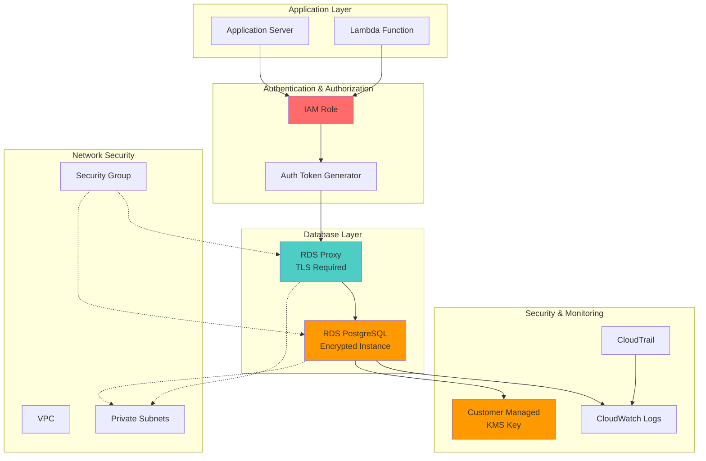

# Database Security with Encryption and IAM

## Problem

Financial institutions and healthcare organizations face stringent regulatory requirements for database security, including encryption at rest and in transit, authentication auditing, and access controls. Traditional database authentication using usernames and passwords creates security vulnerabilities through credential exposure, password rotation challenges, and difficulty in centralized access management. Additionally, compliance frameworks like PCI-DSS, HIPAA, and SOC 2 require comprehensive database security controls that can be complex to implement and maintain with standard database authentication methods.

## Solution

This solution implements a comprehensive database security architecture using Amazon RDS with AWS KMS encryption, IAM database authentication, and CloudWatch monitoring. The approach eliminates password-based authentication by leveraging IAM roles and policies, provides end-to-end encryption using customer-managed KMS keys, and establishes comprehensive security monitoring and auditing. This architecture ensures compliance with enterprise security standards while simplifying credential management and providing centralized access control.

## Architecture Diagram



## Prerequisites

1. AWS account with administrative permissions for RDS, KMS, IAM, and CloudWatch
2. AWS CLI v2 installed and configured (or AWS CloudShell)
3. Understanding of database security concepts and IAM authentication
4. Familiarity with PostgreSQL database administration
5. Knowledge of encryption at rest and in transit concepts
6. Estimated cost: $50-100/month for db.r5.large instance with associated resources

> **Note**: This recipe creates production-grade security controls that may impact database performance and increase costs. Review the [AWS RDS pricing](https://aws.amazon.com/rds/pricing/) before proceeding.

## Preparation

```bash
# Set environment variables
export AWS_REGION=$(aws configure get region)
export AWS_ACCOUNT_ID=$(aws sts get-caller-identity \
    --query Account --output text)

# Generate unique identifiers for resources
RANDOM_SUFFIX=$(aws secretsmanager get-random-password \
    --exclude-punctuation --exclude-uppercase \
    --password-length 6 --require-each-included-type \
    --output text --query RandomPassword)

export DB_INSTANCE_ID="secure-db-${RANDOM_SUFFIX}"
export DB_PROXY_NAME="secure-proxy-${RANDOM_SUFFIX}"
export KMS_KEY_ALIAS="alias/rds-security-key-${RANDOM_SUFFIX}"
export DB_SUBNET_GROUP_NAME="secure-db-subnet-group-${RANDOM_SUFFIX}"
export SECURITY_GROUP_NAME="secure-db-sg-${RANDOM_SUFFIX}"
export IAM_ROLE_NAME="DatabaseAccessRole-${RANDOM_SUFFIX}"
export IAM_POLICY_NAME="DatabaseAccessPolicy-${RANDOM_SUFFIX}"
export DB_USER_NAME="app_user"

# Get default VPC and subnets
export VPC_ID=$(aws ec2 describe-vpcs \
    --filters "Name=is-default,Values=true" \
    --query 'Vpcs[0].VpcId' --output text)

export SUBNET_IDS=$(aws ec2 describe-subnets \
    --filters "Name=vpc-id,Values=${VPC_ID}" \
    --query 'Subnets[*].SubnetId' --output text)

echo "Environment variables configured for region: ${AWS_REGION}"
echo "Database instance ID: ${DB_INSTANCE_ID}"
echo "KMS key alias: ${KMS_KEY_ALIAS}"
```

## Steps

1. **Create Customer-Managed KMS Key for Database Encryption**:

   Customer-managed KMS keys provide complete control over encryption keys, enabling compliance with regulatory requirements and organizational security policies. Unlike AWS-managed keys, customer-managed keys allow you to define key policies, enable/disable keys, and manage key rotation schedules. For database encryption, this ensures that sensitive data is protected with keys under your direct control, meeting the highest security standards for financial and healthcare applications.

   ```bash
   # Create KMS key policy for RDS encryption
   cat > kms-key-policy.json << EOF
   {
     "Version": "2012-10-17",
     "Statement": [
       {
         "Sid": "Enable IAM User Permissions",
         "Effect": "Allow",
         "Principal": {
           "AWS": "arn:aws:iam::${AWS_ACCOUNT_ID}:root"
         },
         "Action": "kms:*",
         "Resource": "*"
       },
       {
         "Sid": "Allow RDS Service",
         "Effect": "Allow",
         "Principal": {
           "Service": "rds.amazonaws.com"
         },
         "Action": [
           "kms:Decrypt",
           "kms:GenerateDataKey",
           "kms:DescribeKey"
         ],
         "Resource": "*",
         "Condition": {
           "StringEquals": {
             "kms:ViaService": "rds.${AWS_REGION}.amazonaws.com"
           }
         }
       }
     ]
   }
   EOF
   
   # Create KMS key
   KMS_KEY_ID=$(aws kms create-key \
       --description "Customer managed key for RDS encryption" \
       --policy file://kms-key-policy.json \
       --query 'KeyMetadata.KeyId' --output text)
   
   # Create key alias
   aws kms create-alias \
       --alias-name "${KMS_KEY_ALIAS}" \
       --target-key-id "${KMS_KEY_ID}"
   
   echo "✅ Created KMS key: ${KMS_KEY_ID}"
   ```

   The KMS key is now created with appropriate permissions for RDS encryption operations. This key will be used to encrypt the database storage, backups, and Performance Insights data, ensuring comprehensive encryption coverage throughout the database lifecycle.

2. **Create Security Group for Database Access**:

   Network security forms the foundation of database protection by controlling traffic at the network level. Security groups act as virtual firewalls that filter traffic based on protocols, ports, and source/destination addresses. For database security, implementing restrictive security groups ensures that only authorized applications and users can establish network connections to the database, preventing unauthorized access attempts and reducing the attack surface.

   ```bash
   # Create security group for database
   SECURITY_GROUP_ID=$(aws ec2 create-security-group \
       --group-name "${SECURITY_GROUP_NAME}" \
       --description "Security group for secure RDS instance" \
       --vpc-id "${VPC_ID}" \
       --query 'GroupId' --output text)
   
   # Allow PostgreSQL access from within VPC
   aws ec2 authorize-security-group-ingress \
       --group-id "${SECURITY_GROUP_ID}" \
       --protocol tcp \
       --port 5432 \
       --source-group "${SECURITY_GROUP_ID}"
   
   # Add tags to security group
   aws ec2 create-tags \
       --resources "${SECURITY_GROUP_ID}" \
       --tags Key=Name,Value="${SECURITY_GROUP_NAME}" \
              Key=Purpose,Value="Database Security" \
              Key=Environment,Value="Production"
   
   echo "✅ Created security group: ${SECURITY_GROUP_ID}"
   ```

   The security group now restricts database access to resources within the same security group, implementing the principle of least privilege. This configuration ensures that only explicitly authorized applications can connect to the database, while preventing external access attempts.

3. **Create Database Subnet Group**:

   Database subnet groups define the network placement of RDS instances within your VPC, enabling multi-AZ deployments and network isolation. By deploying databases in private subnets across multiple Availability Zones, you achieve both high availability and enhanced security. This configuration ensures that database instances are not directly accessible from the internet while maintaining the ability to scale and failover across AZs.

   ```bash
   # Create DB subnet group
   aws rds create-db-subnet-group \
       --db-subnet-group-name "${DB_SUBNET_GROUP_NAME}" \
       --db-subnet-group-description "Subnet group for secure database" \
       --subnet-ids ${SUBNET_IDS} \
       --tags Key=Name,Value="${DB_SUBNET_GROUP_NAME}" \
              Key=Purpose,Value="Database Security"
   
   echo "✅ Created DB subnet group: ${DB_SUBNET_GROUP_NAME}"
   ```

   The database subnet group establishes the network foundation for RDS deployment, ensuring the database instance will be placed in appropriate subnets with proper network isolation and availability zone distribution.

4. **Create IAM Role for Enhanced Monitoring**:

   Enhanced monitoring requires an IAM role that allows the RDS service to publish detailed metrics to CloudWatch. This role must be created before the RDS instance to ensure proper monitoring configuration. The monitoring role enables comprehensive performance visibility and security event tracking.

   ```bash
   # Create IAM role for enhanced monitoring
   cat > monitoring-trust-policy.json << EOF
   {
     "Version": "2012-10-17",
     "Statement": [
       {
         "Effect": "Allow",
         "Principal": {
           "Service": "monitoring.rds.amazonaws.com"
         },
         "Action": "sts:AssumeRole"
       }
     ]
   }
   EOF
   
   # Create monitoring role
   aws iam create-role \
       --role-name "rds-monitoring-role" \
       --assume-role-policy-document file://monitoring-trust-policy.json
   
   # Attach AWS managed policy for enhanced monitoring
   aws iam attach-role-policy \
       --role-name "rds-monitoring-role" \
       --policy-arn "arn:aws:iam::aws:policy/service-role/AmazonRDSEnhancedMonitoringRole"
   
   echo "✅ Created enhanced monitoring role"
   ```

   The monitoring role is now configured to enable detailed RDS performance monitoring and will be referenced during RDS instance creation.

5. **Create IAM Role and Policy for Database Authentication**:

   IAM database authentication eliminates the need for database passwords by using AWS IAM credentials to generate temporary authentication tokens. This approach provides centralized access management, automatic credential rotation, and detailed audit trails. The IAM role defines which AWS principals can assume database access permissions, while the policy specifies the exact database resources and operations that are permitted.

   ```bash
   # Create IAM policy for database access
   cat > database-access-policy.json << EOF
   {
     "Version": "2012-10-17",
     "Statement": [
       {
         "Effect": "Allow",
         "Action": [
           "rds-db:connect"
         ],
         "Resource": [
           "arn:aws:rds-db:${AWS_REGION}:${AWS_ACCOUNT_ID}:dbuser:${DB_INSTANCE_ID}/${DB_USER_NAME}"
         ]
       },
       {
         "Effect": "Allow",
         "Action": [
           "rds:DescribeDBInstances",
           "rds:DescribeDBProxies"
         ],
         "Resource": "*"
       }
     ]
   }
   EOF
   
   # Create IAM policy
   POLICY_ARN=$(aws iam create-policy \
       --policy-name "${IAM_POLICY_NAME}" \
       --policy-document file://database-access-policy.json \
       --query 'Policy.Arn' --output text)
   
   # Create trust policy for IAM role
   cat > trust-policy.json << EOF
   {
     "Version": "2012-10-17",
     "Statement": [
       {
         "Effect": "Allow",
         "Principal": {
           "Service": ["lambda.amazonaws.com", "ec2.amazonaws.com"]
         },
         "Action": "sts:AssumeRole"
       }
     ]
   }
   EOF
   
   # Create IAM role
   ROLE_ARN=$(aws iam create-role \
       --role-name "${IAM_ROLE_NAME}" \
       --assume-role-policy-document file://trust-policy.json \
       --query 'Role.Arn' --output text)
   
   # Attach policy to role
   aws iam attach-role-policy \
       --role-name "${IAM_ROLE_NAME}" \
       --policy-arn "${POLICY_ARN}"
   
   echo "✅ Created IAM role: ${ROLE_ARN}"
   ```

   The IAM role and policy are now configured to enable secure database authentication without passwords. Applications assuming this role can generate temporary authentication tokens that provide secure, auditable access to the database while maintaining centralized access control through IAM.

6. **Create Encrypted RDS Instance with IAM Authentication**:

   The RDS instance configuration implements multiple layers of security including encryption at rest, IAM authentication, SSL enforcement, and enhanced monitoring. Parameter groups enforce SSL connections, while encryption protects data storage and backups. Performance Insights provides detailed monitoring capabilities while maintaining encryption for sensitive performance data.

   ```bash
   # Create parameter group for enhanced security
   aws rds create-db-parameter-group \
       --db-parameter-group-name "secure-postgres-params-${RANDOM_SUFFIX}" \
       --db-parameter-group-family "postgres16" \
       --description "Security-enhanced PostgreSQL parameters"
   
   # Modify parameter group to force SSL
   aws rds modify-db-parameter-group \
       --db-parameter-group-name "secure-postgres-params-${RANDOM_SUFFIX}" \
       --parameters "ParameterName=rds.force_ssl,ParameterValue=1,ApplyMethod=immediate"
   
   # Create RDS instance with encryption and IAM authentication
   aws rds create-db-instance \
       --db-instance-identifier "${DB_INSTANCE_ID}" \
       --db-instance-class "db.r5.large" \
       --engine "postgres" \
       --engine-version "16.6" \
       --master-username "dbadmin" \
       --master-user-password "TempPassword123!" \
       --allocated-storage 100 \
       --storage-type "gp3" \
       --storage-encrypted \
       --kms-key-id "${KMS_KEY_ID}" \
       --vpc-security-group-ids "${SECURITY_GROUP_ID}" \
       --db-subnet-group-name "${DB_SUBNET_GROUP_NAME}" \
       --db-parameter-group-name "secure-postgres-params-${RANDOM_SUFFIX}" \
       --backup-retention-period 7 \
       --preferred-backup-window "03:00-04:00" \
       --preferred-maintenance-window "sun:04:00-sun:05:00" \
       --enable-iam-database-authentication \
       --monitoring-interval 60 \
       --monitoring-role-arn "arn:aws:iam::${AWS_ACCOUNT_ID}:role/rds-monitoring-role" \
       --enable-performance-insights \
       --performance-insights-kms-key-id "${KMS_KEY_ID}" \
       --performance-insights-retention-period 7 \
       --deletion-protection \
       --tags Key=Name,Value="${DB_INSTANCE_ID}" \
              Key=Environment,Value="Production" \
              Key=Security,Value="Encrypted"
   
   echo "✅ Created encrypted RDS instance: ${DB_INSTANCE_ID}"
   echo "Waiting for instance to be available..."
   
   # Wait for instance to be available
   aws rds wait db-instance-available \
       --db-instance-identifier "${DB_INSTANCE_ID}"
   
   echo "✅ RDS instance is now available"
   ```

   The RDS instance is now deployed with comprehensive security controls including customer-managed KMS encryption, IAM authentication, SSL enforcement, and enhanced monitoring. This configuration provides enterprise-grade security while maintaining high availability and performance monitoring capabilities.

7. **Create RDS Proxy for Enhanced Security**:

   RDS Proxy provides additional security layers including connection pooling, automatic failover, and TLS enforcement. By acting as an intermediary between applications and the database, RDS Proxy reduces the number of direct database connections while maintaining security through IAM authentication and TLS encryption. This architecture improves scalability and resilience while enforcing consistent security policies.

   ```bash
   # Create RDS proxy for connection pooling and security
   aws rds create-db-proxy \
       --db-proxy-name "${DB_PROXY_NAME}" \
       --engine-family "POSTGRESQL" \
       --auth Description="IAM authentication for secure database access",AuthScheme="IAM" \
       --role-arn "${ROLE_ARN}" \
       --vpc-subnet-ids ${SUBNET_IDS} \
       --vpc-security-group-ids "${SECURITY_GROUP_ID}" \
       --require-tls \
       --idle-client-timeout 1800 \
       --debug-logging \
       --tags Key=Name,Value="${DB_PROXY_NAME}" \
              Key=Environment,Value="Production"
   
   # Register the RDS instance with the proxy
   aws rds register-db-proxy-targets \
       --db-proxy-name "${DB_PROXY_NAME}" \
       --db-instance-identifiers "${DB_INSTANCE_ID}"
   
   echo "✅ Created RDS proxy with TLS requirement: ${DB_PROXY_NAME}"
   ```

   The RDS Proxy is now configured to provide secure, scalable database connections with TLS enforcement and IAM authentication. Applications connecting through the proxy benefit from connection pooling, improved failover handling, and consistent security policy enforcement.

8. **Configure Database User for IAM Authentication**:

   Database user configuration for IAM authentication involves creating a PostgreSQL user with the `rds_iam` role, which enables token-based authentication. This eliminates the need for traditional passwords while maintaining proper database permissions. The user is granted appropriate privileges on application schemas and tables while being configured to accept IAM authentication tokens.

   ```bash
   # Get RDS instance endpoint
   DB_ENDPOINT=$(aws rds describe-db-instances \
       --db-instance-identifier "${DB_INSTANCE_ID}" \
       --query 'DBInstances[0].Endpoint.Address' \
       --output text)
   
   # Create temporary connection script
   cat > setup_db_user.sql << EOF
   -- Create database user for IAM authentication
   CREATE USER ${DB_USER_NAME};
   GRANT rds_iam TO ${DB_USER_NAME};
   
   -- Create application database and grant permissions
   CREATE DATABASE secure_app_db;
   GRANT CONNECT ON DATABASE secure_app_db TO ${DB_USER_NAME};
   
   -- Connect to the application database
   \c secure_app_db
   
   -- Create schema and grant permissions
   CREATE SCHEMA app_schema;
   GRANT USAGE ON SCHEMA app_schema TO ${DB_USER_NAME};
   GRANT CREATE ON SCHEMA app_schema TO ${DB_USER_NAME};
   GRANT SELECT, INSERT, UPDATE, DELETE ON ALL TABLES IN SCHEMA app_schema TO ${DB_USER_NAME};
   ALTER DEFAULT PRIVILEGES IN SCHEMA app_schema GRANT SELECT, INSERT, UPDATE, DELETE ON TABLES TO ${DB_USER_NAME};
   
   -- Create sample table for testing
   CREATE TABLE app_schema.secure_data (
       id SERIAL PRIMARY KEY,
       sensitive_info VARCHAR(255) NOT NULL,
       created_at TIMESTAMP DEFAULT CURRENT_TIMESTAMP
   );
   
   INSERT INTO app_schema.secure_data (sensitive_info) VALUES ('Sample encrypted data');
   EOF
   
   # Execute SQL using temporary admin password
   PGPASSWORD="TempPassword123!" psql \
       -h "${DB_ENDPOINT}" \
       -U "dbadmin" \
       -d "postgres" \
       -p 5432 \
       -f setup_db_user.sql
   
   echo "✅ Configured database user for IAM authentication"
   ```

   The database user is now configured with IAM authentication capabilities and appropriate application permissions. This user can authenticate using IAM tokens instead of passwords, providing secure and auditable database access.

9. **Set Up CloudWatch Monitoring and Alerts**:

   CloudWatch monitoring provides comprehensive visibility into database security events, performance metrics, and operational health. Security monitoring includes tracking authentication failures, connection patterns, and unusual activity. The alerting configuration enables proactive response to security incidents and performance issues, ensuring continuous monitoring of the database environment.

   ```bash
   # Create CloudWatch log group for database monitoring
   aws logs create-log-group \
       --log-group-name "/aws/rds/instance/${DB_INSTANCE_ID}/postgresql" \
       --retention-in-days 30
   
   # Create CloudWatch alarm for high CPU usage
   aws cloudwatch put-metric-alarm \
       --alarm-name "RDS-HighCPU-${DB_INSTANCE_ID}" \
       --alarm-description "High CPU usage on RDS instance" \
       --metric-name CPUUtilization \
       --namespace AWS/RDS \
       --statistic Average \
       --period 300 \
       --threshold 80.0 \
       --comparison-operator GreaterThanThreshold \
       --evaluation-periods 2 \
       --dimensions Name=DBInstanceIdentifier,Value="${DB_INSTANCE_ID}"
   
   # Create CloudWatch alarm for failed authentication attempts
   aws cloudwatch put-metric-alarm \
       --alarm-name "RDS-AuthFailures-${DB_INSTANCE_ID}" \
       --alarm-description "High number of authentication failures" \
       --metric-name DatabaseConnections \
       --namespace AWS/RDS \
       --statistic Sum \
       --period 300 \
       --threshold 50.0 \
       --comparison-operator GreaterThanThreshold \
       --evaluation-periods 1 \
       --dimensions Name=DBInstanceIdentifier,Value="${DB_INSTANCE_ID}"
   
   echo "✅ Configured CloudWatch monitoring and alarms"
   ```

   CloudWatch monitoring is now configured to track database performance and security events. The alarms will trigger when abnormal conditions are detected, enabling proactive incident response and security monitoring.

10. **Create Security Compliance Report**:

    A comprehensive security compliance report documents all implemented security controls, providing evidence for audit requirements and compliance frameworks. This report catalogs encryption settings, authentication methods, network security configurations, and monitoring capabilities, serving as documentation for security assessments and compliance audits.

    ```bash
    # Generate security compliance report
    cat > security-compliance-report.json << EOF
    {
      "database_security_audit": {
        "encryption_at_rest": {
          "enabled": true,
          "kms_key_id": "${KMS_KEY_ID}",
          "customer_managed_key": true
        },
        "encryption_in_transit": {
          "enabled": true,
          "tls_required": true,
          "force_ssl": true
        },
        "iam_authentication": {
          "enabled": true,
          "db_user": "${DB_USER_NAME}",
          "iam_role": "${IAM_ROLE_NAME}"
        },
        "network_security": {
          "vpc_security_group": "${SECURITY_GROUP_ID}",
          "private_subnets": true,
          "db_subnet_group": "${DB_SUBNET_GROUP_NAME}"
        },
        "monitoring": {
          "enhanced_monitoring": true,
          "performance_insights": true,
          "cloudwatch_logs": true,
          "cloudwatch_alarms": true
        },
        "backup_security": {
          "backup_retention_days": 7,
          "backup_encryption": true,
          "point_in_time_recovery": true
        }
      }
    }
    EOF
    
    echo "✅ Security compliance report generated"
    ```

    The security compliance report provides comprehensive documentation of all implemented security controls, serving as evidence for compliance audits and security assessments.

## Validation & Testing

1. **Verify Database Encryption Status**:

   ```bash
   # Check encryption status
   aws rds describe-db-instances \
       --db-instance-identifier "${DB_INSTANCE_ID}" \
       --query 'DBInstances[0].{Encrypted:StorageEncrypted,KmsKeyId:KmsKeyId,IAMAuth:IAMDatabaseAuthenticationEnabled}' \
       --output table
   ```

   Expected output: Shows `Encrypted: true`, KMS key ID, and `IAMAuth: true`

2. **Test IAM Database Authentication**:

   ```bash
   # Generate authentication token
   AUTH_TOKEN=$(aws rds generate-db-auth-token \
       --hostname "${DB_ENDPOINT}" \
       --port 5432 \
       --region "${AWS_REGION}" \
       --username "${DB_USER_NAME}")
   
   # Test connection with IAM authentication
   PGPASSWORD="${AUTH_TOKEN}" psql \
       -h "${DB_ENDPOINT}" \
       -U "${DB_USER_NAME}" \
       -d "secure_app_db" \
       -p 5432 \
       -c "SELECT 'IAM Authentication successful' AS status;"
   ```

3. **Verify TLS/SSL Connection**:

   ```bash
   # Test SSL connection
   PGPASSWORD="${AUTH_TOKEN}" psql \
       -h "${DB_ENDPOINT}" \
       -U "${DB_USER_NAME}" \
       -d "secure_app_db" \
       -p 5432 \
       -c "SELECT ssl_is_used() AS ssl_enabled;"
   ```

   Expected output: `ssl_enabled: true`

4. **Test RDS Proxy Connection**:

   ```bash
   # Get proxy endpoint
   PROXY_ENDPOINT=$(aws rds describe-db-proxies \
       --db-proxy-name "${DB_PROXY_NAME}" \
       --query 'DBProxies[0].Endpoint' \
       --output text)
   
   # Test connection through proxy
   PGPASSWORD="${AUTH_TOKEN}" psql \
       -h "${PROXY_ENDPOINT}" \
       -U "${DB_USER_NAME}" \
       -d "secure_app_db" \
       -p 5432 \
       -c "SELECT 'Proxy connection successful' AS status;"
   ```

5. **Verify Security Monitoring**:

   ```bash
   # Check CloudWatch alarms
   aws cloudwatch describe-alarms \
       --alarm-name-prefix "RDS-" \
       --query 'MetricAlarms[*].{Name:AlarmName,State:StateValue}' \
       --output table
   ```

## Cleanup

1. **Delete RDS Proxy**:

   ```bash
   # Delete proxy targets first
   aws rds deregister-db-proxy-targets \
       --db-proxy-name "${DB_PROXY_NAME}" \
       --db-instance-identifiers "${DB_INSTANCE_ID}"
   
   # Delete RDS proxy
   aws rds delete-db-proxy \
       --db-proxy-name "${DB_PROXY_NAME}"
   
   echo "✅ Deleted RDS proxy"
   ```

2. **Delete RDS Instance**:

   ```bash
   # Disable deletion protection
   aws rds modify-db-instance \
       --db-instance-identifier "${DB_INSTANCE_ID}" \
       --no-deletion-protection \
       --apply-immediately
   
   # Delete RDS instance
   aws rds delete-db-instance \
       --db-instance-identifier "${DB_INSTANCE_ID}" \
       --skip-final-snapshot
   
   echo "✅ Deleted RDS instance"
   ```

3. **Delete Supporting Resources**:

   ```bash
   # Delete parameter group
   aws rds delete-db-parameter-group \
       --db-parameter-group-name "secure-postgres-params-${RANDOM_SUFFIX}"
   
   # Delete subnet group
   aws rds delete-db-subnet-group \
       --db-subnet-group-name "${DB_SUBNET_GROUP_NAME}"
   
   # Delete security group
   aws ec2 delete-security-group \
       --group-id "${SECURITY_GROUP_ID}"
   
   echo "✅ Deleted supporting resources"
   ```

4. **Delete IAM Resources**:

   ```bash
   # Detach and delete IAM policy
   aws iam detach-role-policy \
       --role-name "${IAM_ROLE_NAME}" \
       --policy-arn "${POLICY_ARN}"
   
   aws iam delete-policy \
       --policy-arn "${POLICY_ARN}"
   
   # Delete IAM role
   aws iam delete-role \
       --role-name "${IAM_ROLE_NAME}"
   
   # Delete monitoring role
   aws iam detach-role-policy \
       --role-name "rds-monitoring-role" \
       --policy-arn "arn:aws:iam::aws:policy/service-role/AmazonRDSEnhancedMonitoringRole"
   
   aws iam delete-role \
       --role-name "rds-monitoring-role"
   
   echo "✅ Deleted IAM resources"
   ```

5. **Delete KMS Key and CloudWatch Resources**:

   ```bash
   # Delete KMS key alias
   aws kms delete-alias \
       --alias-name "${KMS_KEY_ALIAS}"
   
   # Schedule KMS key deletion
   aws kms schedule-key-deletion \
       --key-id "${KMS_KEY_ID}" \
       --pending-window-in-days 7
   
   # Delete CloudWatch alarms
   aws cloudwatch delete-alarms \
       --alarm-names "RDS-HighCPU-${DB_INSTANCE_ID}" "RDS-AuthFailures-${DB_INSTANCE_ID}"
   
   # Delete CloudWatch log group
   aws logs delete-log-group \
       --log-group-name "/aws/rds/instance/${DB_INSTANCE_ID}/postgresql"
   
   # Clean up temporary files
   rm -f kms-key-policy.json database-access-policy.json trust-policy.json \
         monitoring-trust-policy.json setup_db_user.sql security-compliance-report.json
   
   echo "✅ Deleted KMS key and CloudWatch resources"
   ```

## Discussion

This comprehensive database security implementation demonstrates enterprise-grade security controls that address multiple compliance frameworks and security best practices. The solution eliminates traditional password-based authentication vulnerabilities by implementing [IAM database authentication](https://docs.aws.amazon.com/AmazonRDS/latest/UserGuide/UsingWithRDS.IAMDBAuth.html), which provides centralized access control and automatic credential rotation through temporary authentication tokens.

The encryption architecture uses customer-managed KMS keys to ensure complete control over encryption keys, meeting the highest security standards. The implementation of TLS/SSL enforcement ensures all data in transit is encrypted, while storage encryption protects data at rest. [RDS Proxy](https://docs.aws.amazon.com/AmazonRDS/latest/UserGuide/rds-proxy.html) adds an additional security layer by providing connection pooling, failover capabilities, and enforcing TLS connections.

The monitoring and alerting configuration provides comprehensive visibility into database security events, including authentication failures, connection patterns, and performance metrics. CloudWatch integration enables real-time security monitoring and automated incident response capabilities. Performance Insights with encrypted storage provides detailed database performance monitoring without compromising security.

The security architecture implements defense-in-depth principles with multiple layers of protection including network security groups, VPC isolation, IAM authentication, encryption at multiple levels, and comprehensive monitoring. This approach ensures compliance with standards like PCI-DSS, HIPAA, and SOC 2 while maintaining high availability and performance. For additional security guidance, refer to the [RDS Security Best Practices](https://docs.aws.amazon.com/AmazonRDS/latest/UserGuide/CHAP_BestPractices.Security.html) documentation.

> **Warning**: This configuration implements production-grade security controls that may impact database performance and increase costs. Ensure proper testing and capacity planning before deploying to production environments.

> **Tip**: Configure CloudWatch alarms with appropriate thresholds based on your application's normal operating patterns to balance between early warning and false positive alerts.

## Challenge

Extend this solution by implementing these security enhancements:

1. **Implement Database Activity Streams** with Amazon Kinesis Data Streams for real-time security monitoring and compliance auditing
2. **Add AWS Secrets Manager integration** for application credential management with automatic rotation and fine-grained access controls
3. **Create cross-region encrypted backup strategy** with automated failover and disaster recovery capabilities using Aurora Global Database
4. **Implement advanced threat detection** using Amazon GuardDuty RDS Protection and AWS Security Hub integration for centralized security findings
5. **Add AWS Config compliance monitoring** with custom rules for database security configuration compliance and automated remediation

## Infrastructure Code

### Available Infrastructure as Code:

- [Infrastructure Code Overview](code/README.md) - Detailed description of all infrastructure components
- [AWS CDK (Python)](code/cdk-python/) - AWS CDK Python implementation
- [AWS CDK (TypeScript)](code/cdk-typescript/) - AWS CDK TypeScript implementation
- [CloudFormation](code/cloudformation.yaml) - AWS CloudFormation template
- [Bash CLI Scripts](code/scripts/) - Example bash scripts using AWS CLI commands to deploy infrastructure
- [Terraform](code/terraform/) - Terraform configuration files