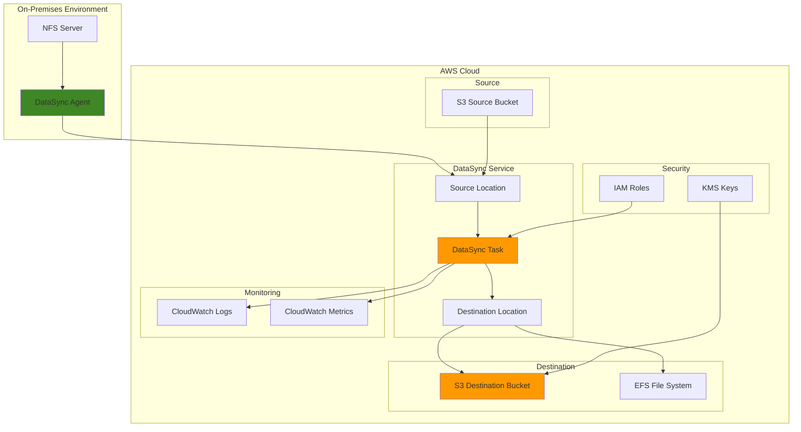

# Implementing DataSync for Data Transfer Automation

## Problem

Organizations face significant challenges when attempting to transfer large volumes of data between on-premises environments and AWS, or between AWS services. Manual data transfer processes are time-consuming, error-prone, and lack proper validation mechanisms. Without automated data transfer solutions, businesses experience extended migration timelines, increased operational overhead, and potential data integrity issues that can impact critical business operations and compliance requirements.

## Solution

AWS DataSync provides a fully managed data transfer service that simplifies, automates, and accelerates copying large amounts of data between on-premises storage systems and AWS storage services, or between AWS services. DataSync automatically handles encryption, data validation, network optimization, and provides comprehensive monitoring and reporting capabilities, enabling organizations to achieve reliable, secure, and efficient data transfer automation.

## Architecture Diagram



## Prerequisites

1. AWS account with appropriate permissions for DataSync, S3, IAM, and CloudWatch
2. AWS CLI v2 installed and configured (or AWS CloudShell)
3. Basic understanding of AWS storage services and IAM roles
4. For on-premises scenarios: VM environment or EC2 instance to deploy DataSync agent
5. Understanding of data transfer patterns and network bandwidth considerations
6. Estimated cost: $0.04-0.08 per GB transferred plus storage costs

> **Note**: DataSync charges are based on the amount of data transferred. Review the [DataSync pricing page](https://aws.amazon.com/datasync/pricing/) for current rates and factor in your data volume when estimating costs.

## Preparation

```bash
# Set environment variables
export AWS_REGION=$(aws configure get region)
export AWS_ACCOUNT_ID=$(aws sts get-caller-identity \
    --query Account --output text)

# Generate unique identifiers for resources
RANDOM_SUFFIX=$(aws secretsmanager get-random-password \
    --exclude-punctuation --exclude-uppercase \
    --password-length 8 --require-each-included-type \
    --output text --query RandomPassword)

# Set resource names
export SOURCE_BUCKET_NAME="datasync-source-${RANDOM_SUFFIX}"
export DEST_BUCKET_NAME="datasync-dest-${RANDOM_SUFFIX}"
export DATASYNC_ROLE_NAME="DataSyncServiceRole-${RANDOM_SUFFIX}"
export DATASYNC_TASK_NAME="DataSyncTask-${RANDOM_SUFFIX}"

# Create source S3 bucket for demonstration
if [ "${AWS_REGION}" = "us-east-1" ]; then
    aws s3api create-bucket \
        --bucket ${SOURCE_BUCKET_NAME} \
        --region ${AWS_REGION}
else
    aws s3api create-bucket \
        --bucket ${SOURCE_BUCKET_NAME} \
        --region ${AWS_REGION} \
        --create-bucket-configuration LocationConstraint=${AWS_REGION}
fi

# Create destination S3 bucket
if [ "${AWS_REGION}" = "us-east-1" ]; then
    aws s3api create-bucket \
        --bucket ${DEST_BUCKET_NAME} \
        --region ${AWS_REGION}
else
    aws s3api create-bucket \
        --bucket ${DEST_BUCKET_NAME} \
        --region ${AWS_REGION} \
        --create-bucket-configuration LocationConstraint=${AWS_REGION}
fi

# Upload sample data to source bucket
echo "Sample data for DataSync transfer" > sample-file.txt
aws s3 cp sample-file.txt s3://${SOURCE_BUCKET_NAME}/
aws s3 cp sample-file.txt s3://${SOURCE_BUCKET_NAME}/folder1/
aws s3 cp sample-file.txt s3://${SOURCE_BUCKET_NAME}/folder2/

echo "✅ Preparation complete with buckets and sample data"
```

## Steps

1. **Create IAM Role for DataSync Service**:

   DataSync requires an IAM service role to securely access AWS resources on your behalf. This role enables DataSync to read from source locations, write to destination locations, and interact with supporting services like CloudWatch. The service role follows the principle of least privilege, granting only the minimum permissions required for successful data transfers. This security foundation is essential for maintaining data integrity and compliance in enterprise environments.

   ```bash
   # Create trust policy for DataSync service
   cat > datasync-trust-policy.json << EOF
   {
       "Version": "2012-10-17",
       "Statement": [
           {
               "Effect": "Allow",
               "Principal": {
                   "Service": "datasync.amazonaws.com"
               },
               "Action": "sts:AssumeRole"
           }
       ]
   }
   EOF
   
   # Create IAM role
   aws iam create-role \
       --role-name ${DATASYNC_ROLE_NAME} \
       --assume-role-policy-document file://datasync-trust-policy.json
   
   # Store the role ARN
   export DATASYNC_ROLE_ARN=$(aws iam get-role \
       --role-name ${DATASYNC_ROLE_NAME} \
       --query Role.Arn --output text)
   
   echo "✅ Created IAM role for DataSync service"
   ```

   The IAM role is now established and ready for policy attachment. This foundational security component ensures DataSync can perform transfers while maintaining strict access controls and audit trails.

   > **Note**: Follow the [principle of least privilege](https://docs.aws.amazon.com/IAM/latest/UserGuide/best-practices.html#grant-least-privilege) when configuring IAM permissions for production environments.

2. **Create IAM Policy for S3 Access**:

   S3 bucket permissions must be explicitly granted to enable DataSync to perform read and write operations. This policy defines the exact S3 actions DataSync requires: listing buckets, reading objects, writing objects, and managing multipart uploads. The policy follows AWS security best practices by restricting access to specific bucket resources and actions, ensuring DataSync cannot access unauthorized S3 resources.

   ```bash
   # Create policy for S3 access
   cat > datasync-s3-policy.json << EOF
   {
       "Version": "2012-10-17",
       "Statement": [
           {
               "Effect": "Allow",
               "Action": [
                   "s3:GetBucketLocation",
                   "s3:ListBucket",
                   "s3:ListBucketMultipartUploads"
               ],
               "Resource": [
                   "arn:aws:s3:::${SOURCE_BUCKET_NAME}",
                   "arn:aws:s3:::${DEST_BUCKET_NAME}"
               ]
           },
           {
               "Effect": "Allow",
               "Action": [
                   "s3:GetObject",
                   "s3:GetObjectTagging",
                   "s3:GetObjectVersion",
                   "s3:GetObjectVersionTagging",
                   "s3:PutObject",
                   "s3:PutObjectTagging",
                   "s3:DeleteObject",
                   "s3:AbortMultipartUpload",
                   "s3:ListMultipartUploadParts"
               ],
               "Resource": [
                   "arn:aws:s3:::${SOURCE_BUCKET_NAME}/*",
                   "arn:aws:s3:::${DEST_BUCKET_NAME}/*"
               ]
           }
       ]
   }
   EOF
   
   # Create and attach policy
   aws iam put-role-policy \
       --role-name ${DATASYNC_ROLE_NAME} \
       --policy-name DataSyncS3Policy \
       --policy-document file://datasync-s3-policy.json
   
   echo "✅ Created and attached S3 access policy"
   ```

   The S3 access policy is now attached to the DataSync role, enabling secure access to both source and destination buckets. This configuration ensures DataSync can perform all necessary S3 operations while maintaining security boundaries.

3. **Create DataSync Source Location (S3)**:

   DataSync locations define the endpoints for data transfer operations. A source location specifies where data originates and includes the necessary access credentials and configuration. Creating an S3 location establishes the connection parameters DataSync uses to authenticate and access your S3 bucket. This abstraction layer allows DataSync to optimize transfer performance based on the location type and configuration.

   ```bash
   # Create source location for S3 bucket
   SOURCE_LOCATION_ARN=$(aws datasync create-location-s3 \
       --s3-bucket-arn "arn:aws:s3:::${SOURCE_BUCKET_NAME}" \
       --s3-config BucketAccessRoleArn=${DATASYNC_ROLE_ARN} \
       --query LocationArn --output text)
   
   echo "✅ Created source location: ${SOURCE_LOCATION_ARN}"
   ```

   The source location is now registered with DataSync and ready for task configuration. This location provides the access credentials and configuration parameters DataSync needs to efficiently read data from your S3 bucket.

4. **Create DataSync Destination Location (S3)**:

   The destination location defines where DataSync will write transferred data. Similar to source locations, destinations include access credentials and configuration parameters optimized for write operations. Separating source and destination locations enables DataSync to apply different optimization strategies for read versus write operations, improving overall transfer performance.

   ```bash
   # Create destination location for S3 bucket
   DEST_LOCATION_ARN=$(aws datasync create-location-s3 \
       --s3-bucket-arn "arn:aws:s3:::${DEST_BUCKET_NAME}" \
       --s3-config BucketAccessRoleArn=${DATASYNC_ROLE_ARN} \
       --query LocationArn --output text)
   
   echo "✅ Created destination location: ${DEST_LOCATION_ARN}"
   ```

   The destination location is now configured and ready to receive transferred data. This location provides the write access credentials and configuration parameters DataSync needs to efficiently store data in your destination S3 bucket.

5. **Create DataSync Task with Options**:

   DataSync tasks define the data transfer operation, including source and destination locations, transfer options, and validation settings. The task configuration controls critical behaviors like verification modes, overwrite policies, and performance settings. POINT_IN_TIME_CONSISTENT verification ensures data integrity by validating files haven't changed during transfer, while CHANGED transfer mode optimizes subsequent runs by only copying modified files. These settings balance data integrity, performance, and cost considerations based on your specific requirements.

   ```bash
   # Create DataSync task with comprehensive options
   TASK_ARN=$(aws datasync create-task \
       --source-location-arn ${SOURCE_LOCATION_ARN} \
       --destination-location-arn ${DEST_LOCATION_ARN} \
       --name ${DATASYNC_TASK_NAME} \
       --options '{
           "VerifyMode": "POINT_IN_TIME_CONSISTENT",
           "OverwriteMode": "ALWAYS",
           "PreserveDeletedFiles": "PRESERVE",
           "PreserveDevices": "NONE",
           "PosixPermissions": "NONE",
           "BytesPerSecond": -1,
           "TaskQueueing": "ENABLED",
           "LogLevel": "TRANSFER",
           "TransferMode": "CHANGED"
       }' \
       --query TaskArn --output text)
   
   echo "✅ Created DataSync task: ${TASK_ARN}"
   ```

   The DataSync task is now configured with optimal settings for secure, efficient data transfer. This task definition includes validation options, performance controls, and operational settings that ensure reliable data movement while maintaining data integrity throughout the transfer process.

6. **Configure CloudWatch Logging**:

   CloudWatch logging provides detailed operational visibility into DataSync transfer activities. Logs capture transfer progress, error conditions, file-level details, and performance metrics essential for troubleshooting and operational monitoring. This logging capability is crucial for enterprise environments requiring audit trails, compliance reporting, and operational insights. The logging configuration enables proactive monitoring and rapid issue resolution.

   ```bash
   # Create CloudWatch log group for DataSync
   aws logs create-log-group \
       --log-group-name /aws/datasync/${DATASYNC_TASK_NAME}
   
   # Update task with CloudWatch logging
   aws datasync update-task \
       --task-arn ${TASK_ARN} \
       --cloud-watch-log-group-arn \
       "arn:aws:logs:${AWS_REGION}:${AWS_ACCOUNT_ID}:log-group:/aws/datasync/${DATASYNC_TASK_NAME}"
   
   echo "✅ Configured CloudWatch logging for DataSync task"
   ```

   CloudWatch logging is now active and will capture detailed transfer information. This monitoring foundation enables operational visibility, troubleshooting capabilities, and compliance reporting essential for production data transfer operations.

   > **Tip**: Configure CloudWatch alarms with appropriate thresholds to balance between early warning and false positive alerts. Reference the [DataSync monitoring guide](https://docs.aws.amazon.com/datasync/latest/userguide/monitor-datasync.html) for detailed metrics and alarm recommendations.

7. **Execute DataSync Task**:

   Task execution initiates the actual data transfer operation using the configured source and destination locations. DataSync handles network optimization, retry logic, and progress tracking automatically. The execution process includes pre-transfer validation, data movement, and post-transfer verification steps. Monitoring execution status provides real-time feedback on transfer progress and enables immediate response to any issues.

   ```bash
   # Start the DataSync task execution
   TASK_EXECUTION_ARN=$(aws datasync start-task-execution \
       --task-arn ${TASK_ARN} \
       --query TaskExecutionArn --output text)
   
   echo "✅ Started task execution: ${TASK_EXECUTION_ARN}"
   
   # Monitor task execution status
   echo "Monitoring task execution status..."
   while true; do
       STATUS=$(aws datasync describe-task-execution \
           --task-execution-arn ${TASK_EXECUTION_ARN} \
           --query Status --output text)
       
       echo "Current status: ${STATUS}"
       
       if [[ "${STATUS}" == "SUCCESS" || "${STATUS}" == "ERROR" ]]; then
           break
       fi
       
       sleep 10
   done
   
   echo "✅ Task execution completed with status: ${STATUS}"
   ```

   The data transfer operation is now complete with comprehensive validation and reporting. DataSync has successfully moved data while maintaining integrity checks, performance optimization, and detailed logging throughout the process.

8. **Create Task Report Configuration**:

   Task reports provide detailed information about individual file transfers, including success/failure status, error details, and performance metrics. These reports are essential for audit trails, compliance verification, and operational analysis. The ERRORS_ONLY report level focuses on issues requiring attention while minimizing storage costs. Reports enable detailed analysis of transfer patterns and identification of optimization opportunities.

   ```bash
   # Create task report configuration
   aws datasync put-task \
       --task-arn ${TASK_ARN} \
       --task-report-config '{
           "Destination": {
               "S3": {
                   "BucketArn": "arn:aws:s3:::'"${DEST_BUCKET_NAME}"'",
                   "Subdirectory": "datasync-reports",
                   "BucketAccessRoleArn": "'"${DATASYNC_ROLE_ARN}"'"
               }
           },
           "OutputType": "STANDARD",
           "ReportLevel": "ERRORS_ONLY"
       }'
   
   echo "✅ Configured task reporting"
   ```

   Task reporting is now active and will generate detailed transfer reports in your S3 bucket. These reports provide the audit trail and operational insights needed for compliance requirements and performance optimization.

9. **Set Up Scheduled Task Execution**:

   Automated scheduling enables regular, consistent data transfers without manual intervention. EventBridge provides reliable, serverless scheduling capabilities that integrate seamlessly with DataSync. This automation pattern is essential for data backup, synchronization, and migration workflows. The scheduled execution ensures data stays current while reducing operational overhead and human error.

   ```bash
   # Create EventBridge rule for scheduled execution
   aws events put-rule \
       --name DataSyncScheduledExecution \
       --schedule-expression "rate(1 day)" \
       --description "Daily DataSync task execution"
   
   # Create IAM role for EventBridge
   cat > eventbridge-trust-policy.json << EOF
   {
       "Version": "2012-10-17",
       "Statement": [
           {
               "Effect": "Allow",
               "Principal": {
                   "Service": "events.amazonaws.com"
               },
               "Action": "sts:AssumeRole"
           }
       ]
   }
   EOF
   
   aws iam create-role \
       --role-name DataSyncEventBridgeRole \
       --assume-role-policy-document file://eventbridge-trust-policy.json
   
   # Create policy for EventBridge to invoke DataSync
   cat > eventbridge-datasync-policy.json << EOF
   {
       "Version": "2012-10-17",
       "Statement": [
           {
               "Effect": "Allow",
               "Action": [
                   "datasync:StartTaskExecution"
               ],
               "Resource": "${TASK_ARN}"
           }
       ]
   }
   EOF
   
   aws iam put-role-policy \
       --role-name DataSyncEventBridgeRole \
       --policy-name DataSyncExecutionPolicy \
       --policy-document file://eventbridge-datasync-policy.json
   
   # Get EventBridge role ARN
   EVENTBRIDGE_ROLE_ARN=$(aws iam get-role \
       --role-name DataSyncEventBridgeRole \
       --query Role.Arn --output text)
   
   # Add target to EventBridge rule
   aws events put-targets \
       --rule DataSyncScheduledExecution \
       --targets "Id"="1","Arn"="${TASK_ARN}","RoleArn"="${EVENTBRIDGE_ROLE_ARN}"
   
   echo "✅ Configured scheduled task execution"
   ```

   Automated scheduling is now active, enabling regular data transfers without manual intervention. This automation foundation supports consistent data synchronization, backup operations, and migration workflows essential for business continuity.

10. **Configure Performance Monitoring**:

    Performance monitoring provides visibility into transfer metrics, enabling optimization and capacity planning. CloudWatch dashboards aggregate key performance indicators including bytes transferred, transfer rates, and file counts. This monitoring capability helps identify performance bottlenecks, optimize scheduling, and validate service level agreements. The dashboard provides a centralized view of DataSync operations across multiple tasks and time periods.

    ```bash
    # Create CloudWatch dashboard for DataSync metrics
    cat > datasync-dashboard.json << EOF
    {
        "widgets": [
            {
                "type": "metric",
                "properties": {
                    "metrics": [
                        ["AWS/DataSync", "BytesTransferred", "TaskArn", "${TASK_ARN}"],
                        ["AWS/DataSync", "FilesTransferred", "TaskArn", "${TASK_ARN}"]
                    ],
                    "period": 300,
                    "stat": "Sum",
                    "region": "${AWS_REGION}",
                    "title": "DataSync Transfer Metrics"
                }
            }
        ]
    }
    EOF
    
    aws cloudwatch put-dashboard \
        --dashboard-name DataSyncMonitoring \
        --dashboard-body file://datasync-dashboard.json
    
    echo "✅ Created CloudWatch dashboard for monitoring"
    ```

    Performance monitoring is now configured with comprehensive metrics and visualization. This monitoring foundation enables proactive performance management, capacity planning, and operational optimization for your data transfer operations.

## Validation & Testing

1. **Verify Task Execution Results**:

   ```bash
   # Check task execution details
   aws datasync describe-task-execution \
       --task-execution-arn ${TASK_EXECUTION_ARN} \
       --query '{
           Status: Status,
           BytesTransferred: BytesTransferred,
           FilesTransferred: FilesTransferred,
           StartTime: StartTime,
           EstimatedFilesToTransfer: EstimatedFilesToTransfer
       }'
   ```

   Expected output: JSON showing successful transfer with file counts and bytes transferred.

2. **Validate Transferred Data**:

   ```bash
   # List objects in destination bucket
   aws s3 ls s3://${DEST_BUCKET_NAME}/ --recursive
   
   # Compare file checksums
   aws s3api head-object \
       --bucket ${DEST_BUCKET_NAME} \
       --key sample-file.txt \
       --query ETag --output text
   ```

3. **Test Task Filtering**:

   ```bash
   # Create a task with include filters
   FILTERED_TASK_ARN=$(aws datasync create-task \
       --source-location-arn ${SOURCE_LOCATION_ARN} \
       --destination-location-arn ${DEST_LOCATION_ARN} \
       --name "FilteredTask-${RANDOM_SUFFIX}" \
       --includes '[{
           "FilterType": "SIMPLE_PATTERN",
           "Value": "folder1/*"
       }]' \
       --query TaskArn --output text)
   
   echo "✅ Created filtered task: ${FILTERED_TASK_ARN}"
   ```

4. **Monitor CloudWatch Logs**:

   ```bash
   # View DataSync logs
   aws logs describe-log-streams \
       --log-group-name /aws/datasync/${DATASYNC_TASK_NAME} \
       --query 'logStreams[0].logStreamName' \
       --output text
   ```

## Cleanup

1. **Stop Scheduled Execution**:

   ```bash
   # Remove EventBridge rule targets
   aws events remove-targets \
       --rule DataSyncScheduledExecution \
       --ids 1
   
   # Delete EventBridge rule
   aws events delete-rule \
       --name DataSyncScheduledExecution
   
   echo "✅ Removed scheduled execution"
   ```

2. **Delete DataSync Resources**:

   ```bash
   # Delete DataSync task
   aws datasync delete-task \
       --task-arn ${TASK_ARN}
   
   # Delete source location
   aws datasync delete-location \
       --location-arn ${SOURCE_LOCATION_ARN}
   
   # Delete destination location
   aws datasync delete-location \
       --location-arn ${DEST_LOCATION_ARN}
   
   echo "✅ Deleted DataSync resources"
   ```

3. **Remove CloudWatch Resources**:

   ```bash
   # Delete CloudWatch dashboard
   aws cloudwatch delete-dashboards \
       --dashboard-names DataSyncMonitoring
   
   # Delete log group
   aws logs delete-log-group \
       --log-group-name /aws/datasync/${DATASYNC_TASK_NAME}
   
   echo "✅ Removed CloudWatch resources"
   ```

4. **Delete IAM Resources**:

   ```bash
   # Delete IAM role policies
   aws iam delete-role-policy \
       --role-name ${DATASYNC_ROLE_NAME} \
       --policy-name DataSyncS3Policy
   
   aws iam delete-role-policy \
       --role-name DataSyncEventBridgeRole \
       --policy-name DataSyncExecutionPolicy
   
   # Delete IAM roles
   aws iam delete-role \
       --role-name ${DATASYNC_ROLE_NAME}
   
   aws iam delete-role \
       --role-name DataSyncEventBridgeRole
   
   echo "✅ Removed IAM resources"
   ```

5. **Delete S3 Buckets**:

   ```bash
   # Empty and delete source bucket
   aws s3 rm s3://${SOURCE_BUCKET_NAME} --recursive
   aws s3api delete-bucket \
       --bucket ${SOURCE_BUCKET_NAME}
   
   # Empty and delete destination bucket
   aws s3 rm s3://${DEST_BUCKET_NAME} --recursive
   aws s3api delete-bucket \
       --bucket ${DEST_BUCKET_NAME}
   
   # Remove local files
   rm -f sample-file.txt *.json
   
   echo "✅ Cleaned up S3 buckets and local files"
   ```

## Discussion

AWS DataSync represents a significant advancement in data transfer automation, addressing the complex challenges organizations face when moving large volumes of data between storage systems. The service's architecture provides built-in network optimization, automatic retry mechanisms, and comprehensive data validation, making it an ideal solution for hybrid cloud scenarios, data lake ingestion, and content distribution workflows. DataSync's fully managed nature eliminates the need for custom scripts or third-party tools, reducing operational complexity and maintenance overhead.

The configuration demonstrated in this recipe showcases DataSync's flexibility in handling different transfer scenarios. The task options provide granular control over transfer behavior, including verification modes, overwrite policies, and bandwidth throttling. The POINT_IN_TIME_CONSISTENT verification mode ensures data integrity by validating that files haven't changed during transfer, while the CHANGED transfer mode optimizes subsequent transfers by only copying modified files. These capabilities enable organizations to balance data integrity requirements with performance and cost considerations.

DataSync's integration with CloudWatch and EventBridge enables sophisticated monitoring and automation capabilities. The service provides detailed metrics on transfer performance, including bytes transferred, files processed, and transfer rates, enabling organizations to optimize their data transfer workflows and troubleshoot performance issues. The scheduled execution capability allows for automated, recurring transfers that can support business continuity and disaster recovery scenarios. For comprehensive monitoring guidance, refer to the [DataSync monitoring documentation](https://docs.aws.amazon.com/datasync/latest/userguide/monitoring-overview.html).

When implementing DataSync in production environments, consider the network bandwidth requirements and transfer windows. DataSync can consume significant bandwidth during large transfers, so scheduling transfers during off-peak hours or implementing bandwidth throttling may be necessary. The service's ability to resume interrupted transfers and its built-in retry mechanisms ensure reliable data movement even in unstable network conditions. For detailed information about DataSync capabilities and use cases, consult the [DataSync User Guide](https://docs.aws.amazon.com/datasync/latest/userguide/what-is-datasync.html).

> **Tip**: Use DataSync task reports to gain insights into transfer performance and identify potential issues. The reports provide detailed information about individual file transfers, including any errors or skipped files, which can be invaluable for auditing and troubleshooting.

## Challenge

Extend this solution by implementing these enhancements:

1. **Multi-Source Aggregation**: Create multiple DataSync tasks to aggregate data from different source locations (NFS, SMB, S3) into a central data lake, implementing intelligent routing based on file types and metadata.

2. **Cross-Region Disaster Recovery**: Implement a disaster recovery solution using DataSync to replicate critical data across multiple AWS regions, with automated failover triggers and cross-region monitoring.

3. **Data Validation Pipeline**: Build a comprehensive data validation pipeline that uses DataSync task reports, Lambda functions, and Step Functions to automatically verify data integrity, generate compliance reports, and trigger remediation workflows.

4. **Hybrid Cloud Synchronization**: Deploy DataSync agents in on-premises environments and create bidirectional synchronization workflows that maintain data consistency between on-premises NFS/SMB shares and cloud storage.

5. **Performance Optimization Framework**: Develop an advanced monitoring and optimization framework that uses CloudWatch metrics, custom dashboards, and automated scaling to optimize DataSync performance based on network conditions and transfer patterns.

## Infrastructure Code

*Infrastructure code will be generated after recipe approval.*