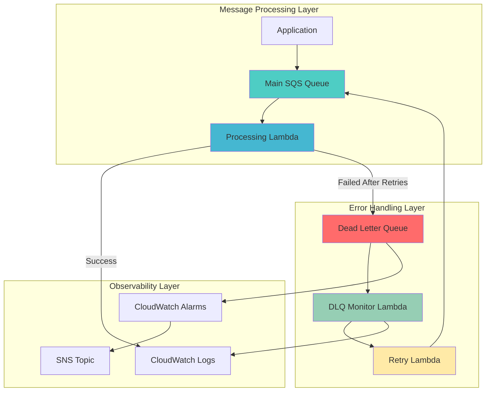

# Dead Letter Queue Processing with SQS

## Problem

E-commerce applications processing thousands of orders daily often experience message processing failures due to temporary service outages, malformed payloads, or downstream system unavailability. When these failures occur, critical order processing messages are lost, leading to customer dissatisfaction, revenue loss, and operational blind spots that can cost businesses thousands of dollars per incident.

## Solution

Implement a comprehensive dead letter queue (DLQ) processing system using Amazon SQS and AWS Lambda that automatically captures failed messages, analyzes error patterns, and provides automated retry mechanisms. This solution ensures no critical business messages are lost while providing detailed visibility into failure patterns and automated recovery workflows.

## Architecture Diagram



## Prerequisites

1. AWS account with appropriate permissions for SQS, Lambda, IAM, and CloudWatch
2. AWS CLI v2 installed and configured (or AWS CloudShell)
3. Basic understanding of message queuing concepts and Lambda functions
4. Familiarity with error handling patterns and retry strategies
5. Estimated cost: $5-10 per month for development workloads (includes Lambda invocations, SQS requests, and CloudWatch logs)

> **Note**: This recipe creates resources that incur charges. Monitor your usage and clean up resources after testing. For detailed pricing information, see the [AWS SQS Pricing Guide](https://aws.amazon.com/sqs/pricing/) and [AWS Lambda Pricing](https://aws.amazon.com/lambda/pricing/).

## Preparation

```bash
# Set environment variables
export AWS_REGION=$(aws configure get region)
export AWS_ACCOUNT_ID=$(aws sts get-caller-identity \
    --query Account --output text)

# Generate unique identifiers for resources
RANDOM_SUFFIX=$(aws secretsmanager get-random-password \
    --exclude-punctuation --exclude-uppercase \
    --password-length 6 --require-each-included-type \
    --output text --query RandomPassword)

export QUEUE_NAME="order-processing-${RANDOM_SUFFIX}"
export DLQ_NAME="order-processing-dlq-${RANDOM_SUFFIX}"
export LAMBDA_ROLE_NAME="dlq-processing-role-${RANDOM_SUFFIX}"

# Create IAM role for Lambda functions
aws iam create-role \
    --role-name ${LAMBDA_ROLE_NAME} \
    --assume-role-policy-document '{
        "Version": "2012-10-17",
        "Statement": [
            {
                "Effect": "Allow",
                "Principal": {
                    "Service": "lambda.amazonaws.com"
                },
                "Action": "sts:AssumeRole"
            }
        ]
    }'

# Attach necessary policies
aws iam attach-role-policy \
    --role-name ${LAMBDA_ROLE_NAME} \
    --policy-arn arn:aws:iam::aws:policy/service-role/AWSLambdaBasicExecutionRole

aws iam attach-role-policy \
    --role-name ${LAMBDA_ROLE_NAME} \
    --policy-arn arn:aws:iam::aws:policy/AmazonSQSFullAccess

aws iam attach-role-policy \
    --role-name ${LAMBDA_ROLE_NAME} \
    --policy-arn arn:aws:iam::aws:policy/CloudWatchAgentServerPolicy

# Wait for role to be available
echo "Waiting for IAM role to be available..."
sleep 10

echo "✅ IAM role created: ${LAMBDA_ROLE_NAME}"
```

## Steps

1. **Create the Dead Letter Queue**:

   Dead letter queues (DLQs) serve as essential safety nets in distributed messaging systems, capturing messages that fail processing after multiple attempts. Amazon SQS DLQs provide 99.999999999% (11 9's) durability and enable detailed failure analysis without losing critical business data. This foundational component ensures that no order processing failures go unnoticed, enabling comprehensive error tracking and recovery workflows.

   ```bash
   # Create the dead letter queue first
   DLQ_URL=$(aws sqs create-queue \
       --queue-name ${DLQ_NAME} \
       --attributes '{
           "MessageRetentionPeriod": "1209600",
           "VisibilityTimeoutSeconds": "300"
       }' \
       --query 'QueueUrl' --output text)
   
   # Get DLQ ARN for main queue configuration
   DLQ_ARN=$(aws sqs get-queue-attributes \
       --queue-url ${DLQ_URL} \
       --attribute-names QueueArn \
       --query 'Attributes.QueueArn' --output text)
   
   echo "✅ Dead Letter Queue created: ${DLQ_URL}"
   echo "✅ DLQ ARN: ${DLQ_ARN}"
   ```

   The DLQ is now configured with a 14-day message retention period and 5-minute visibility timeout, providing sufficient time for error analysis and recovery operations. This queue will automatically receive messages that fail processing in the main queue after the configured retry attempts, enabling systematic error handling and business continuity.

2. **Create the Main Processing Queue with DLQ Configuration**:

   The main processing queue acts as the primary ingestion point for order messages, configured with a redrive policy that automatically routes failed messages to the dead letter queue. The `maxReceiveCount` parameter of 3 ensures that transient failures (network timeouts, temporary service outages) are retried appropriately while preventing infinite retry loops that could overwhelm the system.

   ```bash
   # Create main queue with dead letter queue configuration
   MAIN_QUEUE_URL=$(aws sqs create-queue \
       --queue-name ${QUEUE_NAME} \
       --attributes '{
           "VisibilityTimeoutSeconds": "300",
           "MessageRetentionPeriod": "1209600",
           "RedrivePolicy": "{\"deadLetterTargetArn\":\"'${DLQ_ARN}'\",\"maxReceiveCount\":3}"
       }' \
       --query 'QueueUrl' --output text)
   
   # Get main queue ARN
   MAIN_QUEUE_ARN=$(aws sqs get-queue-attributes \
       --queue-url ${MAIN_QUEUE_URL} \
       --attribute-names QueueArn \
       --query 'Attributes.QueueArn' --output text)
   
   echo "✅ Main processing queue created: ${MAIN_QUEUE_URL}"
   echo "✅ Main queue ARN: ${MAIN_QUEUE_ARN}"
   ```

   The main queue is now configured with intelligent retry behavior through the redrive policy, automatically managing message lifecycle from initial processing through failure handling. This configuration balances system resilience with operational efficiency, ensuring that legitimate failures are captured while preventing resource waste from excessive retries.

3. **Create the Main Processing Lambda Function**:

   AWS Lambda provides serverless compute that automatically scales based on message volume, eliminating the need for server management while ensuring consistent processing performance. This main processor function demonstrates event-driven architecture patterns, processing SQS messages in batches for optimal cost and performance efficiency. The function implements proper error handling that works seamlessly with SQS's retry mechanisms and dead letter queue routing.

   ```bash
   # Create the main processing function code
   cat > /tmp/main_processor.py << 'EOF'
import json
import logging
import random
import boto3
from datetime import datetime

logger = logging.getLogger()
logger.setLevel(logging.INFO)

def lambda_handler(event, context):
    """
    Main order processing function that simulates processing failures
    """
    for record in event['Records']:
        try:
            # Parse the message
            message_body = json.loads(record['body'])
            order_id = message_body.get('orderId')
            
            logger.info(f"Processing order: {order_id}")
            
            # Simulate processing logic with intentional failures
            # In real scenarios, this would be actual business logic
            if random.random() < 0.3:  # 30% failure rate for demo
                raise ValueError(f"Processing failed for order {order_id}")
            
            # Simulate successful processing
            logger.info(f"Successfully processed order: {order_id}")
            
            # In real scenarios, you would:
            # - Validate order data
            # - Update inventory
            # - Process payment
            # - Send confirmation email
            
        except Exception as e:
            logger.error(f"Error processing message: {str(e)}")
            # Let SQS handle the retry mechanism
            raise
    
    return {
        'statusCode': 200,
        'body': json.dumps('Processing completed')
    }
EOF

   # Create deployment package
   cd /tmp
   zip main_processor.zip main_processor.py
   
   # Create Lambda function
   LAMBDA_ARN=$(aws lambda create-function \
       --function-name "order-processor-${RANDOM_SUFFIX}" \
       --runtime python3.12 \
       --role "arn:aws:iam::${AWS_ACCOUNT_ID}:role/${LAMBDA_ROLE_NAME}" \
       --handler main_processor.lambda_handler \
       --zip-file fileb://main_processor.zip \
       --timeout 30 \
       --memory-size 128 \
       --query 'FunctionArn' --output text)
   
   echo "✅ Main processing Lambda created: ${LAMBDA_ARN}"
   ```

   The Lambda function is now deployed with optimized configuration for SQS processing, including appropriate timeout and memory settings for typical order processing workloads. This serverless approach ensures automatic scaling during peak order volumes while maintaining cost efficiency during low-traffic periods, providing the foundation for resilient message processing architecture.

4. **Create the DLQ Monitor Lambda Function**:

   The DLQ monitor function implements intelligent error analysis and automated recovery workflows, going beyond simple message capture to provide actionable insights into failure patterns. This function demonstrates advanced Lambda patterns including custom CloudWatch metrics, conditional retry logic, and integration with multiple AWS services for comprehensive error handling. The monitor categorizes errors by business impact, enabling prioritized response to critical failures.

   ```bash
   # Create the DLQ monitoring function code
   cat > /tmp/dlq_monitor.py << 'EOF'
import json
import logging
import boto3
from datetime import datetime

logger = logging.getLogger()
logger.setLevel(logging.INFO)

sqs = boto3.client('sqs')

def lambda_handler(event, context):
    """
    Monitor and analyze messages in the dead letter queue
    """
    for record in event['Records']:
        try:
            # Parse the failed message
            message_body = json.loads(record['body'])
            receipt_handle = record['receiptHandle']
            
            # Extract error information
            order_id = message_body.get('orderId')
            error_count = int(record.get('attributes', {}).get('ApproximateReceiveCount', '1'))
            
            logger.info(f"Analyzing failed message for order: {order_id}")
            logger.info(f"Error count: {error_count}")
            
            # Categorize error types
            error_category = categorize_error(message_body)
            
            # Log detailed error information
            logger.info(f"Error category: {error_category}")
            logger.info(f"Message attributes: {record.get('messageAttributes', {})}")
            
            # Create error metrics
            try:
                cloudwatch = boto3.client('cloudwatch')
                cloudwatch.put_metric_data(
                    Namespace='DLQ/Processing',
                    MetricData=[
                        {
                            'MetricName': 'FailedMessages',
                            'Value': 1,
                            'Unit': 'Count',
                            'Dimensions': [
                                {
                                    'Name': 'ErrorCategory',
                                    'Value': error_category
                                }
                            ]
                        }
                    ]
                )
            except Exception as cw_error:
                logger.warning(f"Failed to send CloudWatch metrics: {str(cw_error)}")
            
            # Determine if message should be retried
            if should_retry(message_body, error_count):
                logger.info(f"Message will be retried for order: {order_id}")
                send_to_retry_queue(message_body)
            else:
                logger.warning(f"Message permanently failed for order: {order_id}")
                # In production, you might send to a manual review queue
                # or trigger an alert for manual investigation
                
        except Exception as e:
            logger.error(f"Error processing DLQ message: {str(e)}")
            raise
    
    return {
        'statusCode': 200,
        'body': json.dumps('DLQ monitoring completed')
    }

def categorize_error(message_body):
    """Categorize the type of error for better analysis"""
    # In real scenarios, this would analyze the actual error
    # For demo purposes, we'll categorize based on order value
    order_value = message_body.get('orderValue', 0)
    
    if order_value > 1000:
        return 'HighValueOrder'
    elif order_value > 100:
        return 'MediumValueOrder'
    else:
        return 'LowValueOrder'

def should_retry(message_body, error_count):
    """Determine if a message should be retried"""
    # Retry logic based on error count and order characteristics
    max_retries = 2
    order_value = message_body.get('orderValue', 0)
    
    # High-value orders get more retry attempts
    if order_value > 1000:
        max_retries = 5
    
    return error_count < max_retries

def send_to_retry_queue(message_body):
    """Send message back to main queue for retry"""
    import os
    main_queue_url = os.environ.get('MAIN_QUEUE_URL')
    
    if main_queue_url:
        try:
            sqs.send_message(
                QueueUrl=main_queue_url,
                MessageBody=json.dumps(message_body),
                MessageAttributes={
                    'RetryAttempt': {
                        'StringValue': 'true',
                        'DataType': 'String'
                    }
                }
            )
            logger.info("Message sent to retry queue")
        except Exception as e:
            logger.error(f"Failed to send message to retry queue: {str(e)}")
    else:
        logger.error("MAIN_QUEUE_URL environment variable not set")
EOF

   # Create deployment package
   zip dlq_monitor.zip dlq_monitor.py
   
   # Create DLQ monitor Lambda function
   DLQ_MONITOR_ARN=$(aws lambda create-function \
       --function-name "dlq-monitor-${RANDOM_SUFFIX}" \
       --runtime python3.12 \
       --role "arn:aws:iam::${AWS_ACCOUNT_ID}:role/${LAMBDA_ROLE_NAME}" \
       --handler dlq_monitor.lambda_handler \
       --zip-file fileb://dlq_monitor.zip \
       --timeout 60 \
       --memory-size 256 \
       --environment Variables="{MAIN_QUEUE_URL=${MAIN_QUEUE_URL}}" \
       --query 'FunctionArn' --output text)
   
   echo "✅ DLQ monitor Lambda created: ${DLQ_MONITOR_ARN}"
   ```

   The DLQ monitor is now deployed with enhanced memory allocation and extended timeout to handle complex error analysis workflows. This function serves as the intelligence layer of the error handling system, providing automated triage and recovery capabilities that reduce operational overhead while improving system reliability and business continuity.

5. **Configure SQS Event Source Mappings**:

   Event source mappings establish the connection between SQS queues and Lambda functions, enabling automatic invocation when messages arrive. The batch size and batching window parameters are optimized for different workload characteristics: the main queue uses larger batches (10 messages) with shorter wait times (5 seconds) for high-throughput processing, while the DLQ uses smaller batches (5 messages) with longer wait times (10 seconds) for careful error analysis. This configuration balances throughput with processing quality.

   ```bash
   # Create event source mapping for main queue
   aws lambda create-event-source-mapping \
       --event-source-arn ${MAIN_QUEUE_ARN} \
       --function-name "order-processor-${RANDOM_SUFFIX}" \
       --batch-size 10 \
       --maximum-batching-window-in-seconds 5
   
   # Create event source mapping for DLQ
   aws lambda create-event-source-mapping \
       --event-source-arn ${DLQ_ARN} \
       --function-name "dlq-monitor-${RANDOM_SUFFIX}" \
       --batch-size 5 \
       --maximum-batching-window-in-seconds 10
   
   echo "✅ Event source mappings configured"
   ```

   The event source mappings are now active, creating a real-time processing pipeline that automatically scales with message volume. Lambda will poll the queues and invoke functions based on message availability, providing seamless integration between SQS and Lambda that requires no additional infrastructure management or scaling configuration.

   > **Warning**: Event source mappings with SQS have specific configuration requirements for optimal performance. Review the [Lambda SQS Event Source Mapping documentation](https://docs.aws.amazon.com/lambda/latest/dg/with-sqs.html) to understand batching behavior, error handling, and scaling patterns.

6. **Create CloudWatch Alarms for DLQ Monitoring**:

   CloudWatch alarms provide proactive monitoring that enables rapid response to system failures before they impact customers. The DLQ message count alarm triggers immediately when any message enters the dead letter queue, ensuring zero-delay notification of processing failures. The error rate alarm monitors trends over time, detecting systemic issues that require architectural or operational interventions. This multi-layered monitoring approach provides both tactical and strategic visibility into system health.

   ```bash
   # Create alarm for DLQ message count
   aws cloudwatch put-metric-alarm \
       --alarm-name "DLQ-Messages-${RANDOM_SUFFIX}" \
       --alarm-description "Alert when messages appear in DLQ" \
       --metric-name ApproximateNumberOfVisibleMessages \
       --namespace AWS/SQS \
       --statistic Sum \
       --period 300 \
       --threshold 1 \
       --comparison-operator GreaterThanOrEqualToThreshold \
       --evaluation-periods 1 \
       --dimensions Name=QueueName,Value=${DLQ_NAME}
   
   # Create alarm for high error rate
   aws cloudwatch put-metric-alarm \
       --alarm-name "DLQ-ErrorRate-${RANDOM_SUFFIX}" \
       --alarm-description "Alert on high error rate" \
       --metric-name FailedMessages \
       --namespace DLQ/Processing \
       --statistic Sum \
       --period 300 \
       --threshold 5 \
       --comparison-operator GreaterThanThreshold \
       --evaluation-periods 2
   
   echo "✅ CloudWatch alarms configured"
   ```

   The monitoring system is now active, providing automated alerting that reduces mean time to detection (MTTD) and enables rapid incident response. These alarms integrate with SNS topics, PagerDuty, or other notification systems to ensure that operations teams are immediately aware of processing failures, enabling proactive system maintenance and customer impact mitigation.

7. **Create Test Messages to Simulate Processing**:

   Comprehensive testing with realistic message payloads validates the entire error handling pipeline, from successful processing through failure capture and analysis. The test messages include varied order values to trigger different error categorization paths, demonstrating how the system handles diverse failure scenarios. This testing approach ensures that the dead letter queue processing system performs correctly under realistic load conditions with representative business data.

   ```bash
   # Send test messages to simulate order processing
   for i in {1..10}; do
       ORDER_VALUE=$((RANDOM % 2000 + 50))
       aws sqs send-message \
           --queue-url ${MAIN_QUEUE_URL} \
           --message-body '{
               "orderId": "ORD-'$(date +%s)'-'${i}'",
               "orderValue": '${ORDER_VALUE}',
               "customerId": "CUST-'${i}'",
               "items": [
                   {
                       "productId": "PROD-'${i}'",
                       "quantity": 2,
                       "price": '${ORDER_VALUE}'
                   }
               ],
               "timestamp": "'$(date -u +%Y-%m-%dT%H:%M:%SZ)'"
           }'
   done
   
   echo "✅ Test messages sent to main queue"
   ```

   The test message injection simulates realistic e-commerce order processing scenarios, providing diverse data points for system validation. With the configured 30% failure rate, approximately 3-4 messages will be processed successfully while 6-7 will fail and be routed to the dead letter queue, demonstrating both successful processing and comprehensive error handling capabilities.

8. **Wait and Monitor Processing Results**:

   Real-time monitoring of queue depths provides immediate visibility into message processing performance and error rates. The main queue depth should approach zero as messages are processed successfully, while the DLQ depth reflects the number of messages that failed processing after the configured retry attempts. This monitoring approach enables rapid assessment of system health and processing effectiveness, providing operational teams with actionable metrics for system optimization.

   ```bash
   # Wait for processing to complete
   echo "Waiting for message processing..."
   sleep 30
   
   # Check queue depths
   MAIN_QUEUE_DEPTH=$(aws sqs get-queue-attributes \
       --queue-url ${MAIN_QUEUE_URL} \
       --attribute-names ApproximateNumberOfMessages \
       --query 'Attributes.ApproximateNumberOfMessages' --output text)
   
   DLQ_DEPTH=$(aws sqs get-queue-attributes \
       --queue-url ${DLQ_URL} \
       --attribute-names ApproximateNumberOfMessages \
       --query 'Attributes.ApproximateNumberOfMessages' --output text)
   
   echo "Main queue depth: ${MAIN_QUEUE_DEPTH}"
   echo "DLQ depth: ${DLQ_DEPTH}"
   
   echo "✅ Processing monitoring complete"
   ```

   The monitoring results demonstrate the complete message processing lifecycle, from initial queue ingestion through successful processing or error handling via the dead letter queue. This visibility enables continuous optimization of batch sizes, retry policies, and processing timeouts based on actual system performance and business requirements.

## Validation & Testing

1. **Verify Queue Configuration**:

   ```bash
   # Check main queue configuration
   aws sqs get-queue-attributes \
       --queue-url ${MAIN_QUEUE_URL} \
       --attribute-names RedrivePolicy
   ```

   Expected output: Should show the dead letter queue ARN and maxReceiveCount of 3.

2. **Test Error Processing and DLQ Flow**:

   ```bash
   # Send a message that will definitely fail
   aws sqs send-message \
       --queue-url ${MAIN_QUEUE_URL} \
       --message-body '{
           "orderId": "FAIL-TEST-001",
           "orderValue": 999,
           "forceFailure": true
       }'
   
   # Wait and check if message ends up in DLQ
   sleep 60
   
   # Check DLQ for failed messages
   aws sqs receive-message \
       --queue-url ${DLQ_URL} \
       --max-number-of-messages 1
   ```

3. **Verify Lambda Function Logs**:

   ```bash
   # Check main processor logs
   aws logs filter-log-events \
       --log-group-name "/aws/lambda/order-processor-${RANDOM_SUFFIX}" \
       --start-time $(date -d '10 minutes ago' +%s)000 \
       --filter-pattern "ERROR"
   
   # Check DLQ monitor logs
   aws logs filter-log-events \
       --log-group-name "/aws/lambda/dlq-monitor-${RANDOM_SUFFIX}" \
       --start-time $(date -d '10 minutes ago' +%s)000
   ```

4. **Check CloudWatch Metrics**:

   ```bash
   # Check DLQ metrics
   aws cloudwatch get-metric-statistics \
       --namespace DLQ/Processing \
       --metric-name FailedMessages \
       --start-time $(date -d '30 minutes ago' -u +%Y-%m-%dT%H:%M:%SZ) \
       --end-time $(date -u +%Y-%m-%dT%H:%M:%SZ) \
       --period 300 \
       --statistics Sum
   ```

## Cleanup

1. **Delete Lambda Functions**:

   ```bash
   # Delete Lambda functions
   aws lambda delete-function \
       --function-name "order-processor-${RANDOM_SUFFIX}"
   
   aws lambda delete-function \
       --function-name "dlq-monitor-${RANDOM_SUFFIX}"
   
   echo "✅ Lambda functions deleted"
   ```

2. **Delete SQS Queues**:

   ```bash
   # Delete SQS queues
   aws sqs delete-queue --queue-url ${MAIN_QUEUE_URL}
   aws sqs delete-queue --queue-url ${DLQ_URL}
   
   echo "✅ SQS queues deleted"
   ```

3. **Delete CloudWatch Alarms**:

   ```bash
   # Delete CloudWatch alarms
   aws cloudwatch delete-alarms \
       --alarm-names "DLQ-Messages-${RANDOM_SUFFIX}" \
                    "DLQ-ErrorRate-${RANDOM_SUFFIX}"
   
   echo "✅ CloudWatch alarms deleted"
   ```

4. **Delete IAM Role**:

   ```bash
   # Detach policies from role
   aws iam detach-role-policy \
       --role-name ${LAMBDA_ROLE_NAME} \
       --policy-arn arn:aws:iam::aws:policy/service-role/AWSLambdaBasicExecutionRole
   
   aws iam detach-role-policy \
       --role-name ${LAMBDA_ROLE_NAME} \
       --policy-arn arn:aws:iam::aws:policy/AmazonSQSFullAccess
   
   aws iam detach-role-policy \
       --role-name ${LAMBDA_ROLE_NAME} \
       --policy-arn arn:aws:iam::aws:policy/CloudWatchAgentServerPolicy
   
   # Delete role
   aws iam delete-role --role-name ${LAMBDA_ROLE_NAME}
   
   echo "✅ IAM role deleted"
   ```

5. **Clean Up Local Files**:

   ```bash
   # Remove temporary files
   rm -f /tmp/main_processor.py /tmp/main_processor.zip
   rm -f /tmp/dlq_monitor.py /tmp/dlq_monitor.zip
   
   echo "✅ Local files cleaned up"
   ```

## Discussion

Dead letter queues are essential for building resilient distributed systems, particularly in e-commerce and financial services where message loss can have significant business impact. This implementation demonstrates a comprehensive approach to error handling that goes beyond simple message capture to include intelligent analysis, categorization, and automated recovery.

The key architectural decision is the separation of concerns between the main processing logic and error handling. The main processor focuses on business logic while remaining simple and fast, while the DLQ monitor handles the complex error analysis and retry logic. This separation allows for independent scaling and maintenance of each component. The retry mechanism is particularly important as it distinguishes between transient failures (network timeouts, temporary service unavailability) and permanent failures (malformed data, business rule violations).

The CloudWatch integration provides crucial observability into error patterns and system health. By categorizing errors and creating custom metrics, operations teams can identify systemic issues before they impact customers. The alarm configuration ensures that DLQ activity triggers immediate notifications, enabling rapid response to processing failures. This approach follows AWS Well-Architected Framework operational excellence principles by implementing comprehensive monitoring and automated alerting. For comprehensive monitoring strategies, consult the [SQS CloudWatch Monitoring documentation](https://docs.aws.amazon.com/AWSSimpleQueueService/latest/SQSDeveloperGuide/monitoring-using-cloudwatch.html) and the [AWS Well-Architected Operational Excellence pillar](https://docs.aws.amazon.com/wellarchitected/latest/operational-excellence-pillar/welcome.html).

> **Tip**: Set different maxReceiveCount values based on message criticality. High-value transactions might warrant more retry attempts, while low-priority messages can fail faster to reduce processing costs. This configuration approach helps optimize both system reliability and operational costs while following AWS cost optimization best practices. For detailed guidance on DLQ configuration, refer to the [SQS Dead Letter Queue documentation](https://docs.aws.amazon.com/AWSSimpleQueueService/latest/SQSDeveloperGuide/sqs-dead-letter-queues.html).

## Challenge

Extend this solution by implementing these enhancements:

1. **Implement Priority-Based Processing**: Create separate queues for high-priority orders with different retry policies and processing Lambda configurations to ensure critical orders get preferential treatment.

2. **Add Message Enrichment**: Integrate with external services (payment processors, inventory systems) to enrich messages with additional context before processing, improving success rates and error diagnostics.

3. **Create Automated Remediation**: Build Lambda functions that can automatically fix common error conditions (data validation, format conversion) and resubmit corrected messages to the main queue.

4. **Implement Circuit Breaker Pattern**: Add logic to temporarily halt processing when downstream services are experiencing issues, preventing cascade failures and reducing unnecessary DLQ traffic.

5. **Build Error Analytics Dashboard**: Create a real-time dashboard using CloudWatch Dashboards or QuickSight that visualizes error patterns, processing rates, and system health metrics for operational insights.

## Infrastructure Code

*Infrastructure code will be generated after recipe approval.*