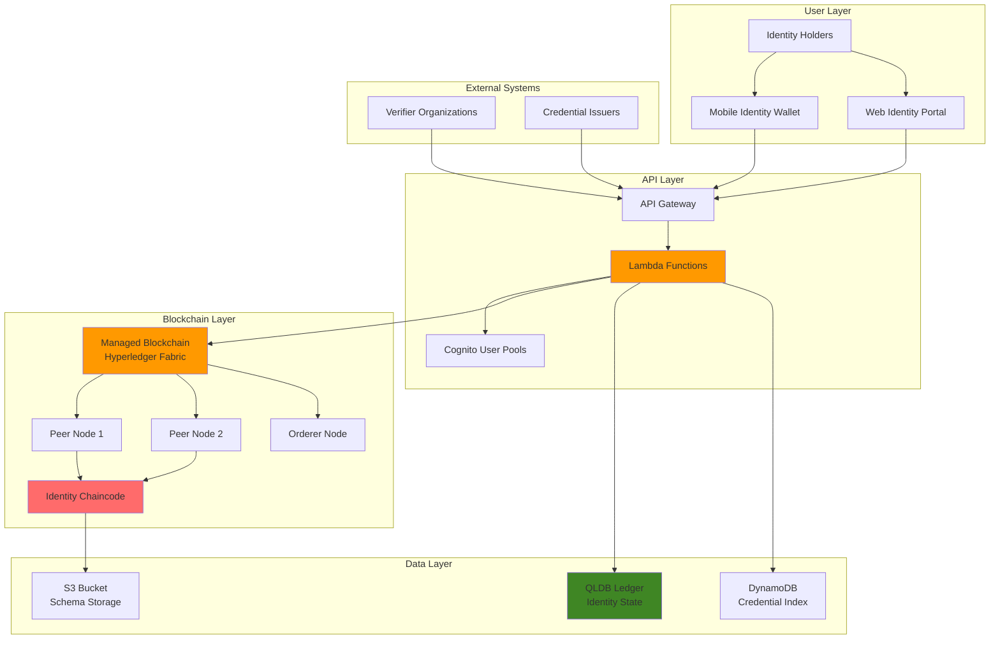

# Implementing Decentralized Identity Management with Blockchain

## Problem

Organizations struggle with centralized identity management systems that create single points of failure, require users to manage multiple credentials across platforms, and lack transparency in identity verification processes. Traditional identity systems expose sensitive personal data to breaches, suffer from vendor lock-in, and cannot provide cryptographically verifiable identity proofs that users control independently. Financial institutions, healthcare providers, and government agencies need a secure, decentralized approach where users own their digital identities while maintaining compliance with privacy regulations.

## Solution

This solution implements a decentralized identity management system using AWS Managed Blockchain with Hyperledger Fabric to create immutable identity records, AWS QLDB for maintaining an auditable identity state database, and AWS Lambda for processing identity verification requests. The architecture enables users to generate, manage, and selectively share verified digital credentials through cryptographic proofs, while organizations can verify identity claims without accessing underlying personal data.

## Architecture Diagram



## Prerequisites

1. AWS account with appropriate permissions for Managed Blockchain, QLDB, IAM, Lambda, and API Gateway
2. AWS CLI v2 installed and configured (or AWS CloudShell)
3. Node.js 18+ for chaincode development and client applications
4. Docker Desktop for local chaincode development and testing
5. Understanding of blockchain concepts, cryptographic signatures, and identity standards
6. Familiarity with Hyperledger Fabric architecture and smart contract development
7. Estimated cost: $150-250 for full deployment over 4-5 hours (includes blockchain network, compute, and storage)

> **Note**: This recipe implements production-ready decentralized identity infrastructure. Ensure you understand the regulatory implications of identity management in your jurisdiction before deployment.

## Preparation

```bash
# Set environment variables
export AWS_REGION=$(aws configure get region)
export AWS_ACCOUNT_ID=$(aws sts get-caller-identity \
    --query Account --output text)

# Generate unique identifiers for resources
RANDOM_SUFFIX=$(aws secretsmanager get-random-password \
    --exclude-punctuation --exclude-uppercase \
    --password-length 8 --require-each-included-type \
    --output text --query RandomPassword)

export NETWORK_NAME="identity-network-${RANDOM_SUFFIX}"
export MEMBER_NAME="identity-org-${RANDOM_SUFFIX}"
export ADMIN_USERNAME="admin"
export ADMIN_PASSWORD="TempPassword123!"
export QLDB_LEDGER_NAME="identity-ledger-${RANDOM_SUFFIX}"

# Create S3 bucket for chaincode and schema storage
aws s3 mb s3://identity-blockchain-assets-${RANDOM_SUFFIX} \
    --region ${AWS_REGION}

# Create DynamoDB table for credential indexing
aws dynamodb create-table \
    --table-name identity-credentials-${RANDOM_SUFFIX} \
    --attribute-definitions \
        AttributeName=did,AttributeType=S \
        AttributeName=credential_id,AttributeType=S \
    --key-schema \
        AttributeName=did,KeyType=HASH \
        AttributeName=credential_id,KeyType=RANGE \
    --provisioned-throughput \
        ReadCapacityUnits=5,WriteCapacityUnits=5 \
    --region ${AWS_REGION}

echo "✅ Preparation complete with suffix: ${RANDOM_SUFFIX}"
```

## Steps

1. **Create Managed Blockchain Network**:

   AWS Managed Blockchain provides a fully managed blockchain infrastructure that eliminates the complexity of setting up and managing blockchain networks. For decentralized identity management, blockchain serves as the immutable source of truth for identity records, ensuring that identity transactions cannot be altered or deleted once recorded. Hyperledger Fabric, the blockchain framework used in this implementation, provides enterprise-grade security, permissioned access controls, and smart contract capabilities essential for identity management systems.

   The blockchain network will store all identity-related transactions including DID creation, credential issuance, and revocation events. This creates a tamper-proof audit trail that enables trust without requiring a central authority. The network's consensus mechanism ensures that all participants agree on the state of identity records, preventing double-spending or fraudulent identity claims.

   ```bash
   # Create the blockchain network with initial member
   NETWORK_ID=$(aws managedblockchain create-network \
       --name ${NETWORK_NAME} \
       --framework HYPERLEDGER_FABRIC \
       --framework-version 2.2 \
       --member-configuration \
           Name=${MEMBER_NAME} \
           Description="Identity management organization" \
           FrameworkConfiguration='{
               "MemberFabricConfiguration": {
                   "AdminUsername": "'${ADMIN_USERNAME}'",
                   "AdminPassword": "'${ADMIN_PASSWORD}'"
               }
           }' \
       --voting-policy ApprovalThresholdPolicy='{
           ThresholdPercentage=50,
           ProposalDurationInHours=24,
           ThresholdComparator=GREATER_THAN
       }' \
       --query 'NetworkId' --output text)

   # Wait for network creation
   aws managedblockchain get-network \
       --network-id ${NETWORK_ID} \
       --query 'Network.Status' --output text
   
   echo "✅ Created blockchain network: ${NETWORK_ID}"
   ```

   The blockchain network is now established with initial governance policies and member configuration. The network ID will be used to identify this specific blockchain instance throughout the deployment process. The voting policy ensures that network changes require consensus from members, maintaining the decentralized governance model essential for identity management systems. See the [AWS Managed Blockchain documentation](https://docs.aws.amazon.com/managed-blockchain/latest/hyperledger-fabric-dev/what-is-managed-blockchain.html) for more details on network configuration options.

2. **Create Member and Peer Nodes**:

   In Hyperledger Fabric, peer nodes are the computational workhorses that maintain the blockchain state and execute smart contracts (chaincode). Each member organization requires at least one peer node to participate in the network. Peer nodes store a local copy of the blockchain ledger, validate transactions, and maintain the world state database that contains the current values of all blockchain keys.

   For identity management, peer nodes process identity verification requests, execute identity chaincode, and maintain consensus on identity state changes. Multiple peer nodes provide redundancy and fault tolerance, ensuring that identity operations remain available even if individual nodes fail. The peer nodes also enable organizations to query identity information and validate credentials without relying on external services.

   ```bash
   # Get member ID
   MEMBER_ID=$(aws managedblockchain list-members \
       --network-id ${NETWORK_ID} \
       --query 'Members[0].Id' --output text)

   # Create VPC endpoint for blockchain access
   VPC_ENDPOINT_ID=$(aws managedblockchain create-accessor \
       --accessor-type BILLING_TOKEN \
       --query 'AccessorId' --output text)

   # Create peer node
   PEER_NODE_ID=$(aws managedblockchain create-node \
       --network-id ${NETWORK_ID} \
       --member-id ${MEMBER_ID} \
       --node-configuration \
           InstanceType=bc.t3.small \
           AvailabilityZone=${AWS_REGION}a \
       --query 'NodeId' --output text)

   # Wait for peer node creation
   aws managedblockchain get-node \
       --network-id ${NETWORK_ID} \
       --member-id ${MEMBER_ID} \
       --node-id ${PEER_NODE_ID} \
       --query 'Node.Status' --output text
   
   echo "✅ Created peer node: ${PEER_NODE_ID}"
   ```

   The peer node is now operational and ready to join blockchain channels for identity transaction processing. This node will execute the identity chaincode and maintain the local ledger state for all identity operations. The VPC endpoint provides secure, private connectivity between your AWS resources and the blockchain network, ensuring that identity data remains protected during transmission. Learn more about [peer node configuration](https://docs.aws.amazon.com/managed-blockchain/latest/hyperledger-fabric-dev/managed-blockchain-hyperledger-peer-nodes.html) in the AWS documentation.

3. **Create QLDB Ledger for Identity State**:

   Amazon QLDB (Quantum Ledger Database) complements the blockchain by providing a fully managed, centralized ledger database with built-in cryptographic verification. While the blockchain maintains the immutable transaction history, QLDB offers fast query performance and SQL-like querying capabilities for identity state information. This dual-ledger approach combines blockchain's trust and immutability with QLDB's operational efficiency and query flexibility.

   QLDB maintains cryptographic proof of data integrity through a built-in journal that tracks every change to the data. For identity management, QLDB enables real-time identity lookups, credential status checks, and complex queries across multiple identity attributes. The ledger's transparent and tamper-evident nature ensures that identity state changes are verifiable and auditable, supporting compliance requirements and forensic analysis.

   ```bash
   # Create QLDB ledger for identity state management
   aws qldb create-ledger \
       --name ${QLDB_LEDGER_NAME} \
       --permissions-mode STANDARD \
       --kms-key-id alias/aws/qldb \
       --region ${AWS_REGION}

   # Wait for ledger creation
   aws qldb describe-ledger \
       --name ${QLDB_LEDGER_NAME} \
       --query 'State' --output text

   # Create identity table in QLDB
   aws qldb-session send-command \
       --session-token $(aws qldb-session start-session \
           --ledger-name ${QLDB_LEDGER_NAME} \
           --query 'SessionToken' --output text) \
       --start-transaction '{}' \
       --execute-statement \
           Statement="CREATE TABLE IdentityRecords"

   echo "✅ Created QLDB ledger: ${QLDB_LEDGER_NAME}"
   ```

   The QLDB ledger is now ready to store identity state information with cryptographic verification. The IdentityRecords table provides a structured storage layer for identity metadata, enabling efficient queries and analytics on identity data. The ledger's built-in encryption and access controls ensure that identity information remains secure while maintaining the transparency required for decentralized identity systems. For more information on QLDB capabilities, see the [Amazon QLDB documentation](https://docs.aws.amazon.com/qldb/latest/developerguide/what-is.html).

4. **Deploy Identity Chaincode**:

   Chaincode (also called smart contracts) defines the business logic for identity management operations on the blockchain. This code governs how identities are created, how credentials are issued and verified, and how identity state changes are processed. The chaincode ensures that all identity operations follow predetermined rules and maintain cryptographic integrity throughout the identity lifecycle.

   The identity chaincode implements core functions for decentralized identity management including DID generation, credential issuance, verification, and revocation. Each function includes validation logic to ensure that only authorized parties can perform specific operations and that all identity changes maintain cryptographic proof of authenticity. The chaincode also emits events that can be consumed by external systems for real-time identity monitoring and integration.

   ```bash
   # Create chaincode directory structure
   mkdir -p chaincode/identity-management
   cd chaincode/identity-management

   # Create package.json for Node.js chaincode
   cat > package.json << 'EOF'
{
  "name": "identity-management-chaincode",
  "version": "1.0.0",
  "description": "Decentralized Identity Management Chaincode",
  "main": "index.js",
  "scripts": {
    "start": "fabric-chaincode-node start"
  },
  "dependencies": {
    "fabric-contract-api": "^2.4.1",
    "fabric-shim": "^2.4.1",
    "crypto": "^1.0.1"
  }
}
EOF

   # Create identity chaincode implementation
   cat > identity-chaincode.js << 'EOF'
const { Contract } = require('fabric-contract-api');
const crypto = require('crypto');

class IdentityContract extends Contract {
    
    async createDID(ctx, publicKey, metadata) {
        // Generate DID (Decentralized Identifier)
        const did = `did:fabric:${crypto.createHash('sha256')
            .update(publicKey).digest('hex').substring(0, 16)}`;
        
        const identity = {
            did: did,
            publicKey: publicKey,
            metadata: JSON.parse(metadata),
            created: new Date().toISOString(),
            status: 'active',
            credentialCount: 0
        };
        
        await ctx.stub.putState(did, Buffer.from(JSON.stringify(identity)));
        
        // Emit event for identity creation
        ctx.stub.setEvent('IdentityCreated', Buffer.from(JSON.stringify({
            did: did,
            timestamp: identity.created
        })));
        
        return did;
    }
    
    async issueCredential(ctx, did, credentialType, claims, issuerDID) {
        // Verify DID exists
        const identityBytes = await ctx.stub.getState(did);
        if (!identityBytes || identityBytes.length === 0) {
            throw new Error(`Identity ${did} does not exist`);
        }
        
        const identity = JSON.parse(identityBytes.toString());
        
        // Create credential
        const credentialId = crypto.randomBytes(16).toString('hex');
        const credential = {
            id: credentialId,
            type: credentialType,
            holder: did,
            issuer: issuerDID,
            claims: JSON.parse(claims),
            issued: new Date().toISOString(),
            status: 'active',
            proof: {
                type: 'Ed25519Signature2020',
                created: new Date().toISOString(),
                verificationMethod: `${issuerDID}#key-1`,
                proofPurpose: 'assertionMethod'
            }
        };
        
        // Store credential
        await ctx.stub.putState(credentialId, 
            Buffer.from(JSON.stringify(credential)));
        
        // Update identity credential count
        identity.credentialCount++;
        await ctx.stub.putState(did, Buffer.from(JSON.stringify(identity)));
        
        // Emit event
        ctx.stub.setEvent('CredentialIssued', Buffer.from(JSON.stringify({
            credentialId: credentialId,
            did: did,
            type: credentialType,
            timestamp: credential.issued
        })));
        
        return credentialId;
    }
    
    async verifyCredential(ctx, credentialId) {
        const credentialBytes = await ctx.stub.getState(credentialId);
        if (!credentialBytes || credentialBytes.length === 0) {
            throw new Error(`Credential ${credentialId} does not exist`);
        }
        
        const credential = JSON.parse(credentialBytes.toString());
        
        // Verify holder identity exists
        const identityBytes = await ctx.stub.getState(credential.holder);
        if (!identityBytes || identityBytes.length === 0) {
            return { valid: false, reason: 'Holder identity not found' };
        }
        
        const identity = JSON.parse(identityBytes.toString());
        
        // Check credential and identity status
        if (credential.status !== 'active' || identity.status !== 'active') {
            return { valid: false, reason: 'Credential or identity is not active' };
        }
        
        return {
            valid: true,
            credential: credential,
            identity: identity,
            verifiedAt: new Date().toISOString()
        };
    }
    
    async revokeCredential(ctx, credentialId, reason) {
        const credentialBytes = await ctx.stub.getState(credentialId);
        if (!credentialBytes || credentialBytes.length === 0) {
            throw new Error(`Credential ${credentialId} does not exist`);
        }
        
        const credential = JSON.parse(credentialBytes.toString());
        credential.status = 'revoked';
        credential.revocationReason = reason;
        credential.revokedAt = new Date().toISOString();
        
        await ctx.stub.putState(credentialId, 
            Buffer.from(JSON.stringify(credential)));
        
        // Emit event
        ctx.stub.setEvent('CredentialRevoked', Buffer.from(JSON.stringify({
            credentialId: credentialId,
            reason: reason,
            timestamp: credential.revokedAt
        })));
        
        return true;
    }
    
    async queryIdentity(ctx, did) {
        const identityBytes = await ctx.stub.getState(did);
        if (!identityBytes || identityBytes.length === 0) {
            throw new Error(`Identity ${did} does not exist`);
        }
        
        return JSON.parse(identityBytes.toString());
    }
    
    async queryCredentialsByDID(ctx, did) {
        const query = {
            selector: {
                holder: did,
                status: "active"
            }
        };
        
        const iterator = await ctx.stub.getQueryResult(JSON.stringify(query));
        const credentials = [];
        
        let result = await iterator.next();
        while (!result.done) {
            const record = result.value;
            credentials.push(JSON.parse(record.value.toString()));
            result = await iterator.next();
        }
        
        await iterator.close();
        return credentials;
    }
}

module.exports = IdentityContract;
EOF

   # Create chaincode index
   cat > index.js << 'EOF'
const IdentityContract = require('./identity-chaincode');
module.exports.IdentityContract = IdentityContract;
module.exports.contracts = [IdentityContract];
EOF

   # Package chaincode
   peer lifecycle chaincode package identity-management.tar.gz \
       --path . --lang node --label identity-management_1.0

   echo "✅ Identity chaincode packaged successfully"
   ```

   The identity chaincode is now packaged and ready for deployment to the blockchain network. This code establishes the core identity management protocols that all network participants must follow. The chaincode includes comprehensive validation logic, event emission for external integration, and cryptographic proof generation for all identity operations. Once deployed, this chaincode will process all identity-related transactions on the blockchain, ensuring consistent and secure identity management across the entire network.

5. **Create Lambda Functions for Identity Operations**:

   AWS Lambda provides serverless compute capabilities that serve as the integration layer between external applications and the blockchain network. Lambda functions abstract the complexity of blockchain interactions, providing RESTful APIs for identity operations while managing the underlying blockchain communication protocols. This serverless architecture ensures cost-effective scaling and eliminates the need to manage server infrastructure for identity services.

   The Lambda functions handle the orchestration of identity operations across multiple systems including the blockchain network, QLDB ledger, and DynamoDB index. Each function processes incoming identity requests, validates parameters, executes the appropriate blockchain operations, and updates supporting data stores. The functions also provide error handling, logging, and monitoring capabilities essential for production identity management systems.

   ```bash
   # Create Lambda function for identity creation
   cat > identity-lambda.js << 'EOF'
const AWS = require('aws-sdk');
const { execSync } = require('child_process');

const qldb = new AWS.QLDB();
const dynamodb = new AWS.DynamoDB.DocumentClient();

exports.handler = async (event, context) => {
    const { action, did, credentialType, claims, publicKey } = event;
    
    try {
        switch (action) {
            case 'createIdentity':
                return await createIdentity(publicKey, event.metadata);
            case 'issueCredential':
                return await issueCredential(did, credentialType, claims);
            case 'verifyCredential':
                return await verifyCredential(event.credentialId);
            case 'revokeCredential':
                return await revokeCredential(event.credentialId, event.reason);
            default:
                throw new Error(`Unknown action: ${action}`);
        }
    } catch (error) {
        console.error('Identity operation failed:', error);
        return {
            statusCode: 500,
            body: JSON.stringify({ error: error.message })
        };
    }
};

async function createIdentity(publicKey, metadata) {
    // Call chaincode via Fabric SDK
    const command = `peer chaincode invoke -o orderer.example.com:7050 \
        --tls --cafile /opt/fabric/orderer/tls/ca.crt \
        -C mychannel -n identity-management \
        -c '{"function":"createDID","Args":["${publicKey}","${JSON.stringify(metadata)}"]}'`;
    
    const result = execSync(command, { encoding: 'utf8' });
    const did = JSON.parse(result).payload;
    
    // Store in QLDB for fast queries
    await qldb.executeStatement({
        Statement: `INSERT INTO IdentityRecords VALUE {
            'did': '${did}',
            'publicKey': '${publicKey}',
            'metadata': '${JSON.stringify(metadata)}',
            'created': '${new Date().toISOString()}'
        }`
    }).promise();
    
    return {
        statusCode: 200,
        body: JSON.stringify({ did: did })
    };
}

async function issueCredential(did, credentialType, claims) {
    // Call chaincode
    const command = `peer chaincode invoke -o orderer.example.com:7050 \
        --tls --cafile /opt/fabric/orderer/tls/ca.crt \
        -C mychannel -n identity-management \
        -c '{"function":"issueCredential","Args":["${did}","${credentialType}","${JSON.stringify(claims)}","did:fabric:issuer"]}'`;
    
    const result = execSync(command, { encoding: 'utf8' });
    const credentialId = JSON.parse(result).payload;
    
    // Index in DynamoDB
    await dynamodb.put({
        TableName: process.env.CREDENTIAL_TABLE,
        Item: {
            did: did,
            credential_id: credentialId,
            type: credentialType,
            issued: new Date().toISOString(),
            status: 'active'
        }
    }).promise();
    
    return {
        statusCode: 200,
        body: JSON.stringify({ credentialId: credentialId })
    };
}

async function verifyCredential(credentialId) {
    const command = `peer chaincode query -C mychannel -n identity-management \
        -c '{"function":"verifyCredential","Args":["${credentialId}"]}'`;
    
    const result = execSync(command, { encoding: 'utf8' });
    const verification = JSON.parse(result);
    
    return {
        statusCode: 200,
        body: JSON.stringify(verification)
    };
}

async function revokeCredential(credentialId, reason) {
    const command = `peer chaincode invoke -o orderer.example.com:7050 \
        --tls --cafile /opt/fabric/orderer/tls/ca.crt \
        -C mychannel -n identity-management \
        -c '{"function":"revokeCredential","Args":["${credentialId}","${reason}"]}'`;
    
    const result = execSync(command, { encoding: 'utf8' });
    
    return {
        statusCode: 200,
        body: JSON.stringify({ success: true })
    };
}
EOF

   # Create Lambda deployment package
   zip -r identity-lambda.zip identity-lambda.js node_modules/

   # Deploy Lambda function
   aws lambda create-function \
       --function-name identity-management-${RANDOM_SUFFIX} \
       --runtime nodejs18.x \
       --role arn:aws:iam::${AWS_ACCOUNT_ID}:role/lambda-execution-role \
       --handler identity-lambda.handler \
       --zip-file fileb://identity-lambda.zip \
       --timeout 30 \
       --memory-size 256 \
       --environment Variables="{CREDENTIAL_TABLE=identity-credentials-${RANDOM_SUFFIX}}"

   echo "✅ Lambda function deployed successfully"
   ```

   The Lambda function is now deployed and ready to process identity operations. This function serves as the primary integration point between client applications and the blockchain network, handling complex multi-system transactions in a scalable serverless environment. The function automatically manages connections to blockchain peers, QLDB, and DynamoDB, ensuring consistent identity state across all systems. For more information on Lambda capabilities, see the [AWS Lambda documentation](https://docs.aws.amazon.com/lambda/latest/dg/welcome.html).

6. **Create API Gateway for Identity Services**:

   Amazon API Gateway provides a managed service for creating, deploying, and managing APIs at scale. For identity management systems, API Gateway serves as the public-facing interface that client applications use to perform identity operations. The service provides essential features including request authentication, rate limiting, request/response transformation, and comprehensive logging that are critical for production identity services.

   API Gateway enables organizations to expose identity management capabilities through standard REST APIs while maintaining security and control over access patterns. The service automatically handles scaling, SSL termination, and distributed denial-of-service protection, ensuring that identity services remain available and responsive. Integration with AWS Lambda provides seamless serverless execution of identity operations without managing infrastructure.

   ```bash
   # Create API Gateway
   API_ID=$(aws apigateway create-rest-api \
       --name identity-management-api-${RANDOM_SUFFIX} \
       --description "Decentralized Identity Management API" \
       --query 'id' --output text)

   # Get root resource ID
   ROOT_RESOURCE_ID=$(aws apigateway get-resources \
       --rest-api-id ${API_ID} \
       --query 'items[0].id' --output text)

   # Create /identity resource
   IDENTITY_RESOURCE_ID=$(aws apigateway create-resource \
       --rest-api-id ${API_ID} \
       --parent-id ${ROOT_RESOURCE_ID} \
       --path-part identity \
       --query 'id' --output text)

   # Create POST method for identity creation
   aws apigateway put-method \
       --rest-api-id ${API_ID} \
       --resource-id ${IDENTITY_RESOURCE_ID} \
       --http-method POST \
       --authorization-type NONE

   # Integrate with Lambda
   aws apigateway put-integration \
       --rest-api-id ${API_ID} \
       --resource-id ${IDENTITY_RESOURCE_ID} \
       --http-method POST \
       --type AWS_PROXY \
       --integration-http-method POST \
       --uri arn:aws:apigateway:${AWS_REGION}:lambda:path/2015-03-31/functions/arn:aws:lambda:${AWS_REGION}:${AWS_ACCOUNT_ID}:function:identity-management-${RANDOM_SUFFIX}/invocations

   # Deploy API
   aws apigateway create-deployment \
       --rest-api-id ${API_ID} \
       --stage-name prod

   echo "✅ API Gateway deployed: https://${API_ID}.execute-api.${AWS_REGION}.amazonaws.com/prod"
   ```

   The API Gateway is now deployed and providing a public endpoint for identity management operations. Client applications can now access the identity services through standard HTTPS requests, with the API Gateway handling authentication, authorization, and request routing to the appropriate Lambda functions. The production stage deployment ensures that the API is ready for real-world usage with proper versioning and monitoring capabilities. Learn more about [API Gateway features](https://docs.aws.amazon.com/apigateway/latest/developerguide/welcome.html) in the AWS documentation.

7. **Configure IAM Roles and Policies**:

   AWS Identity and Access Management (IAM) provides fine-grained access control for AWS resources, ensuring that only authorized services and users can perform specific identity operations. For decentralized identity management, IAM roles and policies implement the principle of least privilege, granting Lambda functions only the minimum permissions required to perform their designated tasks. This security model prevents unauthorized access to sensitive identity data and blockchain operations.

   IAM roles enable Lambda functions to securely access multiple AWS services including Managed Blockchain, QLDB, and DynamoDB without embedding credentials in code. The roles use temporary credentials that are automatically rotated by AWS, eliminating the security risks associated with long-term access keys. Custom IAM policies define the specific permissions required for identity operations, ensuring that the system maintains strong security boundaries while enabling necessary functionality.

   ```bash
   # Create IAM role for Lambda
   aws iam create-role \
       --role-name identity-lambda-role-${RANDOM_SUFFIX} \
       --assume-role-policy-document '{
           "Version": "2012-10-17",
           "Statement": [
               {
                   "Effect": "Allow",
                   "Principal": {
                       "Service": "lambda.amazonaws.com"
                   },
                   "Action": "sts:AssumeRole"
               }
           ]
       }'

   # Create policy for identity management
   aws iam create-policy \
       --policy-name identity-management-policy-${RANDOM_SUFFIX} \
       --policy-document '{
           "Version": "2012-10-17",
           "Statement": [
               {
                   "Effect": "Allow",
                   "Action": [
                       "qldb:ExecuteStatement",
                       "qldb:StartSession",
                       "qldb:SendCommand"
                   ],
                   "Resource": "*"
               },
               {
                   "Effect": "Allow",
                   "Action": [
                       "dynamodb:PutItem",
                       "dynamodb:GetItem",
                       "dynamodb:UpdateItem",
                       "dynamodb:DeleteItem",
                       "dynamodb:Query"
                   ],
                   "Resource": "*"
               },
               {
                   "Effect": "Allow",
                   "Action": [
                       "managedblockchain:*"
                   ],
                   "Resource": "*"
               }
           ]
       }'

   # Attach policies to role
   aws iam attach-role-policy \
       --role-name identity-lambda-role-${RANDOM_SUFFIX} \
       --policy-arn arn:aws:iam::aws:policy/service-role/AWSLambdaBasicExecutionRole

   aws iam attach-role-policy \
       --role-name identity-lambda-role-${RANDOM_SUFFIX} \
       --policy-arn arn:aws:iam::${AWS_ACCOUNT_ID}:policy/identity-management-policy-${RANDOM_SUFFIX}

   echo "✅ IAM roles and policies configured successfully"
   ```

   The IAM roles and policies are now configured to provide secure access to AWS services for the Lambda functions. The identity management policy grants specific permissions for blockchain operations, QLDB transactions, and DynamoDB operations while maintaining the principle of least privilege. These security configurations ensure that the identity management system operates with appropriate access controls and follows AWS security best practices.

   > **Note**: Follow the [principle of least privilege](https://docs.aws.amazon.com/IAM/latest/UserGuide/best-practices.html#grant-least-privilege) when configuring IAM permissions for production environments.

## Validation & Testing

1. **Test Identity Creation**:

   ```bash
   # Generate test key pair
   openssl genrsa -out private_key.pem 2048
   openssl rsa -in private_key.pem -pubout -out public_key.pem
   
   # Extract public key
   PUBLIC_KEY=$(cat public_key.pem | base64 -w 0)
   
   # Test identity creation via API
   curl -X POST \
       https://${API_ID}.execute-api.${AWS_REGION}.amazonaws.com/prod/identity \
       -H "Content-Type: application/json" \
       -d '{
           "action": "createIdentity",
           "publicKey": "'${PUBLIC_KEY}'",
           "metadata": {
               "name": "Test User",
               "email": "test@example.com"
           }
       }'
   ```

   Expected output: JSON response with generated DID

2. **Test Credential Issuance**:

   ```bash
   # Issue a test credential
   curl -X POST \
       https://${API_ID}.execute-api.${AWS_REGION}.amazonaws.com/prod/identity \
       -H "Content-Type: application/json" \
       -d '{
           "action": "issueCredential",
           "did": "did:fabric:abc123...",
           "credentialType": "UniversityDegree",
           "claims": {
               "degree": "Bachelor of Science",
               "university": "Example University",
               "graduationYear": 2023
           }
       }'
   ```

   Expected output: JSON response with credential ID

3. **Test Credential Verification**:

   ```bash
   # Verify credential
   curl -X POST \
       https://${API_ID}.execute-api.${AWS_REGION}.amazonaws.com/prod/identity \
       -H "Content-Type: application/json" \
       -d '{
           "action": "verifyCredential",
           "credentialId": "credential-id-here"
       }'
   ```

   Expected output: JSON response with verification status and credential details

4. **Test Blockchain Network Status**:

   ```bash
   # Check network status
   aws managedblockchain get-network \
       --network-id ${NETWORK_ID} \
       --query 'Network.Status'
   
   # Check peer node status
   aws managedblockchain get-node \
       --network-id ${NETWORK_ID} \
       --member-id ${MEMBER_ID} \
       --node-id ${PEER_NODE_ID} \
       --query 'Node.Status'
   ```

   Expected output: Both should show "AVAILABLE"

5. **Test QLDB Ledger Operations**:

   ```bash
   # Query identity records in QLDB
   aws qldb-session send-command \
       --session-token $(aws qldb-session start-session \
           --ledger-name ${QLDB_LEDGER_NAME} \
           --query 'SessionToken' --output text) \
       --execute-statement \
           Statement="SELECT * FROM IdentityRecords"
   ```

   Expected output: JSON array of identity records

## Cleanup

1. **Remove API Gateway and Lambda**:

   ```bash
   # Delete API Gateway
   aws apigateway delete-rest-api \
       --rest-api-id ${API_ID}
   
   # Delete Lambda function
   aws lambda delete-function \
       --function-name identity-management-${RANDOM_SUFFIX}
   
   echo "✅ Deleted API Gateway and Lambda function"
   ```

2. **Remove Blockchain Network**:

   ```bash
   # Delete peer node
   aws managedblockchain delete-node \
       --network-id ${NETWORK_ID} \
       --member-id ${MEMBER_ID} \
       --node-id ${PEER_NODE_ID}
   
   # Delete member
   aws managedblockchain delete-member \
       --network-id ${NETWORK_ID} \
       --member-id ${MEMBER_ID}
   
   # Delete network
   aws managedblockchain delete-network \
       --network-id ${NETWORK_ID}
   
   echo "✅ Deleted blockchain network"
   ```

3. **Remove QLDB Ledger**:

   ```bash
   # Delete QLDB ledger
   aws qldb delete-ledger \
       --name ${QLDB_LEDGER_NAME}
   
   echo "✅ Deleted QLDB ledger"
   ```

4. **Remove Storage and Database Resources**:

   ```bash
   # Delete DynamoDB table
   aws dynamodb delete-table \
       --table-name identity-credentials-${RANDOM_SUFFIX}
   
   # Delete S3 bucket contents and bucket
   aws s3 rm s3://identity-blockchain-assets-${RANDOM_SUFFIX} \
       --recursive
   aws s3 rb s3://identity-blockchain-assets-${RANDOM_SUFFIX}
   
   echo "✅ Deleted storage and database resources"
   ```

5. **Remove IAM Resources**:

   ```bash
   # Detach policies from role
   aws iam detach-role-policy \
       --role-name identity-lambda-role-${RANDOM_SUFFIX} \
       --policy-arn arn:aws:iam::aws:policy/service-role/AWSLambdaBasicExecutionRole
   
   aws iam detach-role-policy \
       --role-name identity-lambda-role-${RANDOM_SUFFIX} \
       --policy-arn arn:aws:iam::${AWS_ACCOUNT_ID}:policy/identity-management-policy-${RANDOM_SUFFIX}
   
   # Delete custom policy
   aws iam delete-policy \
       --policy-arn arn:aws:iam::${AWS_ACCOUNT_ID}:policy/identity-management-policy-${RANDOM_SUFFIX}
   
   # Delete role
   aws iam delete-role \
       --role-name identity-lambda-role-${RANDOM_SUFFIX}
   
   echo "✅ Deleted IAM resources"
   ```

## Discussion

This decentralized identity management system represents a paradigm shift from traditional centralized identity models to a user-controlled, cryptographically secure approach. The architecture leverages AWS Managed Blockchain with Hyperledger Fabric to create an immutable ledger of identity transactions, while QLDB provides fast query capabilities for real-time identity verification. The combination ensures both blockchain's security benefits and traditional database performance.

The implementation follows W3C Decentralized Identifiers (DIDs) and Verifiable Credentials specifications, ensuring interoperability with other DID-compliant systems. Users generate their own DIDs through public key cryptography, maintaining control over their identity without relying on centralized authorities. Credential issuers can cryptographically sign and issue verifiable credentials that are stored on the blockchain, while verifiers can independently validate these credentials without accessing the issuer's systems.

AWS Lambda functions serve as the integration layer, abstracting blockchain complexity while providing RESTful APIs for identity operations. The API Gateway adds authentication, rate limiting, and monitoring capabilities, making the system production-ready. The architecture supports selective disclosure, allowing users to share only necessary credential attributes while maintaining privacy. Additionally, the system includes credential revocation mechanisms and comprehensive audit trails through both blockchain transactions and QLDB logging.

Security considerations include proper key management, secure communication channels, and compliance with privacy regulations like GDPR. The blockchain's immutability ensures that identity records cannot be tampered with, while the cryptographic proofs provide non-repudiation. Organizations can verify identity claims without storing personal data, reducing privacy risks and compliance overhead.

> **Tip**: Implement credential schemas using JSON Schema to ensure consistency and validation across different credential types and issuers.

## Challenge

Extend this solution by implementing these enhancements:

1. **Multi-Organization Network**: Add support for multiple organizations as blockchain members, each with their own credential issuance authority and governance policies through Managed Blockchain's voting mechanisms.

2. **Zero-Knowledge Proof Integration**: Implement zero-knowledge proofs using zk-SNARKs to enable credential verification without revealing underlying personal information, enhancing privacy protection.

3. **Mobile Identity Wallet**: Develop a React Native mobile application that generates DIDs locally, stores credentials securely using device biometrics, and provides QR code-based credential sharing.

4. **Advanced Credential Types**: Implement support for complex credential types like educational transcripts, professional licenses, and healthcare records with expiration dates and renewal workflows.

5. **Cross-Chain Interoperability**: Integrate with other blockchain networks using bridges or oracles to enable credential portability across different DID ecosystems and enhance user mobility.

## Infrastructure Code

*Infrastructure code will be generated after recipe approval.*