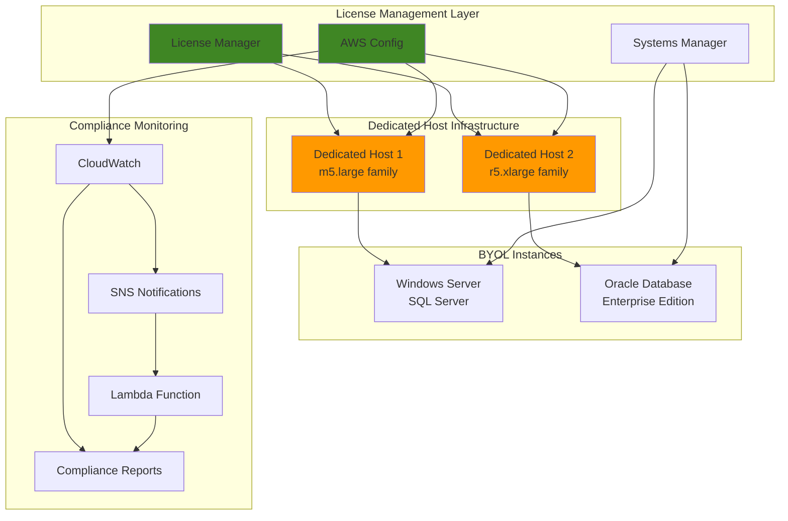

# Implementing Dedicated Hosts for License Compliance

## Problem

Enterprise organizations using commercial software with socket-based, core-based, or per-VM licensing face significant compliance challenges when migrating to AWS. Traditional virtualized environments make it difficult to track license consumption, maintain software asset management compliance, and optimize license costs. Without proper visibility into physical server characteristics and license allocation, organizations risk compliance violations, audit failures, and unexpected financial penalties from software vendors.

## Solution

AWS EC2 Dedicated Hosts provide full visibility and control over the underlying physical server infrastructure, enabling organizations to bring their own software licenses (BYOL) and maintain compliance with existing licensing agreements. Combined with AWS License Manager for centralized license tracking and AWS Config for compliance monitoring, this solution creates a comprehensive license management and compliance framework that reduces costs and ensures audit readiness.

## Architecture Diagram



## Prerequisites

1. AWS account with appropriate permissions for EC2, License Manager, Config, Systems Manager, and IAM
2. AWS CLI v2 installed and configured (or AWS CloudShell)
3. Understanding of software licensing models (socket-based, core-based, per-VM)
4. Existing software licenses eligible for BYOL (Windows Server, SQL Server, Oracle, RHEL, etc.)
5. Valid EC2 Key Pair for instance access
6. Existing VPC with security groups configured for your workloads
7. Estimated cost: $100-500/month for Dedicated Hosts + software licensing costs

> **Note**: Dedicated Hosts incur hourly charges regardless of instance usage. Review [AWS Dedicated Host pricing](https://aws.amazon.com/ec2/dedicated-hosts/pricing/) for accurate cost estimates based on instance family and region.

## Preparation

```bash
# Set environment variables
export AWS_REGION=$(aws configure get region)
export AWS_ACCOUNT_ID=$(aws sts get-caller-identity \
    --query Account --output text)

# Generate unique identifiers for resources
RANDOM_SUFFIX=$(aws secretsmanager get-random-password \
    --exclude-punctuation --exclude-uppercase \
    --password-length 6 --require-each-included-type \
    --output text --query RandomPassword)

# Set naming convention
export LICENSE_COMPLIANCE_PREFIX="license-compliance-${RANDOM_SUFFIX}"
export DEDICATED_HOST_TAG_KEY="LicenseCompliance"
export DEDICATED_HOST_TAG_VALUE="BYOL-Production"

# Create SNS topic for compliance notifications
aws sns create-topic \
    --name "${LICENSE_COMPLIANCE_PREFIX}-compliance-alerts" \
    --attributes DisplayName="License Compliance Alerts"

export SNS_TOPIC_ARN=$(aws sns list-topics \
    --query "Topics[?contains(TopicArn, '${LICENSE_COMPLIANCE_PREFIX}-compliance-alerts')].TopicArn" \
    --output text)

echo "✅ Environment prepared with prefix: ${LICENSE_COMPLIANCE_PREFIX}"
echo "✅ SNS Topic ARN: ${SNS_TOPIC_ARN}"
```

## Steps

1. **Create License Configuration in License Manager**:

   AWS License Manager provides centralized governance for software licenses across your AWS environment, enabling you to track usage, enforce compliance rules, and prevent over-allocation of expensive commercial licenses. This step establishes the foundation for BYOL compliance by creating a license configuration that defines the counting method, limits, and tracking parameters for your Windows Server licenses.

   Socket-based licensing is particularly important for Windows Server environments where Microsoft charges per physical socket rather than per virtual machine. By configuring License Manager to track socket consumption, you ensure accurate license allocation and prevent costly compliance violations during software audits.

   ```bash
   # Create license configuration for Windows Server
   aws license-manager create-license-configuration \
       --name "${LICENSE_COMPLIANCE_PREFIX}-windows-server" \
       --description "Windows Server BYOL license tracking" \
       --license-counting-type Socket \
       --license-count 10 \
       --license-count-hard-limit \
       --tag-specifications "ResourceType=license-configuration,Tags=[{Key=Purpose,Value=WindowsServer},{Key=Environment,Value=Production}]"
   
   # Store license configuration ARN
   export WINDOWS_LICENSE_ARN=$(aws license-manager list-license-configurations \
       --query "LicenseConfigurations[?Name=='${LICENSE_COMPLIANCE_PREFIX}-windows-server'].LicenseConfigurationArn" \
       --output text)
   
   echo "✅ Windows Server license configuration created: ${WINDOWS_LICENSE_ARN}"
   ```

   The license configuration now enforces hard limits on Windows Server socket consumption, preventing accidental over-allocation that could result in compliance violations. This centralized tracking mechanism enables proactive license management and provides the audit trail necessary for software vendor compliance reporting. See [AWS License Manager User Guide](https://docs.aws.amazon.com/license-manager/latest/userguide/license-usage.html) for detailed information about license tracking capabilities.

2. **Allocate Dedicated Hosts for Different License Types**:

   EC2 Dedicated Hosts provide single-tenant hardware isolation essential for BYOL compliance, giving you complete visibility into the underlying physical server specifications including socket count, core count, and CPU architecture. This visibility is crucial for software vendors like Microsoft, Oracle, and Red Hat who require detailed infrastructure reporting for license compliance validation.

   Different workloads require different instance families optimized for their specific licensing and performance characteristics. M5 instances provide balanced compute resources ideal for Windows Server and SQL Server workloads, while R5 instances offer high memory capacity essential for Oracle Database Enterprise Edition licensing which is often memory-intensive.

   ```bash
   # Allocate Dedicated Host for Windows/SQL Server workloads
   aws ec2 allocate-hosts \
       --instance-family m5 \
       --availability-zone "${AWS_REGION}a" \
       --quantity 1 \
       --auto-placement off \
       --host-recovery on \
       --tag-specifications "ResourceType=dedicated-host,Tags=[{Key=${DEDICATED_HOST_TAG_KEY},Value=${DEDICATED_HOST_TAG_VALUE}},{Key=LicenseType,Value=WindowsServer},{Key=Purpose,Value=SQLServer}]"
   
   # Store Windows/SQL Server host ID
   export WINDOWS_HOST_ID=$(aws ec2 describe-hosts \
       --filters "Name=tag:LicenseType,Values=WindowsServer" \
       --query "Hosts[0].HostId" --output text)
   
   # Allocate Dedicated Host for Oracle Database workloads
   aws ec2 allocate-hosts \
       --instance-family r5 \
       --availability-zone "${AWS_REGION}a" \
       --quantity 1 \
       --auto-placement off \
       --host-recovery on \
       --tag-specifications "ResourceType=dedicated-host,Tags=[{Key=${DEDICATED_HOST_TAG_KEY},Value=${DEDICATED_HOST_TAG_VALUE}},{Key=LicenseType,Value=Oracle},{Key=Purpose,Value=Database}]"
   
   # Store Oracle host ID
   export ORACLE_HOST_ID=$(aws ec2 describe-hosts \
       --filters "Name=tag:LicenseType,Values=Oracle" \
       --query "Hosts[0].HostId" --output text)
   
   echo "✅ Dedicated Hosts allocated:"
   echo "   Windows/SQL Server Host: ${WINDOWS_HOST_ID}"
   echo "   Oracle Database Host: ${ORACLE_HOST_ID}"
   ```

   The Dedicated Hosts are now available and provide the physical server isolation required for BYOL compliance. Auto-placement is disabled to ensure precise control over instance placement, while host recovery is enabled to automatically migrate instances to replacement hardware in case of physical server failure. This configuration establishes the foundation for compliant BYOL deployments. Learn more about [Dedicated Hosts BYOL capabilities](https://docs.aws.amazon.com/AWSEC2/latest/UserGuide/dedicated-hosts-BYOL.html).

3. **Create License Manager Report Generator**:

   Automated compliance reporting is essential for demonstrating license compliance to software vendors during audits and for proactive license management. AWS License Manager's report generation capability creates detailed usage reports that provide comprehensive visibility into license consumption patterns, helping organizations optimize costs and maintain compliance.

   Monthly reporting provides the right balance between timely compliance monitoring and operational overhead. These reports include license utilization statistics, resource associations, and compliance status across all your BYOL deployments, enabling finance teams to track software spending and compliance teams to maintain audit readiness.

   ```bash
   # Create S3 bucket for License Manager reports
   aws s3 mb "s3://${LICENSE_COMPLIANCE_PREFIX}-reports-${AWS_ACCOUNT_ID}" \
       --region "${AWS_REGION}"
   
   # Set S3 bucket policy for License Manager
   cat > /tmp/license-manager-bucket-policy.json << EOF
{
    "Version": "2012-10-17",
    "Statement": [
        {
            "Sid": "LicenseManagerReportAccess",
            "Effect": "Allow",
            "Principal": {
                "Service": "license-manager.amazonaws.com"
            },
            "Action": [
                "s3:GetBucketLocation",
                "s3:ListBucket",
                "s3:PutObject",
                "s3:GetObject"
            ],
            "Resource": [
                "arn:aws:s3:::${LICENSE_COMPLIANCE_PREFIX}-reports-${AWS_ACCOUNT_ID}",
                "arn:aws:s3:::${LICENSE_COMPLIANCE_PREFIX}-reports-${AWS_ACCOUNT_ID}/*"
            ]
        }
    ]
}
EOF
   
   aws s3api put-bucket-policy \
       --bucket "${LICENSE_COMPLIANCE_PREFIX}-reports-${AWS_ACCOUNT_ID}" \
       --policy file:///tmp/license-manager-bucket-policy.json
   
   # Create License Manager report generator
   aws license-manager create-license-manager-report-generator \
       --report-generator-name "${LICENSE_COMPLIANCE_PREFIX}-monthly-report" \
       --type LicenseConfigurationSummaryReport \
       --report-context "{\"licenseConfigurationArns\":[\"${WINDOWS_LICENSE_ARN}\"]}" \
       --report-frequency "{\"unit\":\"MONTH\",\"value\":1}" \
       --client-token "${LICENSE_COMPLIANCE_PREFIX}-report-$(date +%s)" \
       --description "Monthly license compliance report" \
       --s3-location "bucket=${LICENSE_COMPLIANCE_PREFIX}-reports-${AWS_ACCOUNT_ID},keyPrefix=monthly-reports/"
   
   echo "✅ License Manager reporting configured"
   ```

   The automated reporting system is now established and will generate monthly compliance reports stored in S3. These reports provide the documentation trail required for software audits and enable proactive license management by identifying optimization opportunities before compliance violations occur. The S3 bucket policy ensures License Manager has the necessary permissions to deliver reports securely.

4. **Configure AWS Config for Compliance Monitoring**:

   AWS Config provides continuous compliance monitoring by tracking configuration changes and evaluating resource compliance against defined rules. For license compliance, Config monitors Dedicated Host and EC2 instance configurations to ensure instances remain properly placed on designated hosts and maintain compliance with licensing requirements.

   Configuration drift detection is critical for license compliance because improper instance placement or configuration changes can result in licensing violations. AWS Config automatically detects when instances are moved off Dedicated Hosts or when host configurations change, enabling immediate remediation before compliance issues impact your organization.

   ```bash
   # Create Config Service Role
   aws iam create-role \
       --role-name "${LICENSE_COMPLIANCE_PREFIX}-config-role" \
       --assume-role-policy-document '{
           "Version": "2012-10-17",
           "Statement": [
               {
                   "Effect": "Allow",
                   "Principal": {
                       "Service": "config.amazonaws.com"
                   },
                   "Action": "sts:AssumeRole"
               }
           ]
       }'
   
   # Attach Config service role policy
   aws iam attach-role-policy \
       --role-name "${LICENSE_COMPLIANCE_PREFIX}-config-role" \
       --policy-arn arn:aws:iam::aws:policy/service-role/ConfigRole
   
   # Create Config delivery channel S3 bucket
   aws s3 mb "s3://${LICENSE_COMPLIANCE_PREFIX}-config-${AWS_ACCOUNT_ID}" \
       --region "${AWS_REGION}"
   
   # Configure Config service
   aws configservice put-configuration-recorder \
       --configuration-recorder "{
           \"name\": \"${LICENSE_COMPLIANCE_PREFIX}-recorder\",
           \"roleARN\": \"arn:aws:iam::${AWS_ACCOUNT_ID}:role/${LICENSE_COMPLIANCE_PREFIX}-config-role\",
           \"recordingGroup\": {
               \"allSupported\": false,
               \"includeGlobalResourceTypes\": false,
               \"resourceTypes\": [\"AWS::EC2::Host\", \"AWS::EC2::Instance\"]
           }
       }"
   
   # Set up Config delivery channel
   aws configservice put-delivery-channel \
       --delivery-channel "{
           \"name\": \"${LICENSE_COMPLIANCE_PREFIX}-delivery-channel\",
           \"s3BucketName\": \"${LICENSE_COMPLIANCE_PREFIX}-config-${AWS_ACCOUNT_ID}\",
           \"configSnapshotDeliveryProperties\": {
               \"deliveryFrequency\": \"TwentyFour_Hours\"
           }
       }"
   
   # Start configuration recorder
   aws configservice start-configuration-recorder \
       --configuration-recorder-name "${LICENSE_COMPLIANCE_PREFIX}-recorder"
   
   echo "✅ AWS Config configured for Dedicated Host monitoring"
   ```

   AWS Config is now actively monitoring your Dedicated Hosts and instances, creating an audit trail of all configuration changes. This monitoring capability ensures compliance violations are detected immediately and provides the detailed change history required for license audit procedures. The daily snapshot delivery provides comprehensive compliance reporting for your license management team. Reference the [AWS Config documentation](https://docs.aws.amazon.com/config/latest/developerguide/how-does-config-work.html) for advanced configuration monitoring capabilities.

5. **Create Launch Template for BYOL Instances**:

   Launch templates provide standardized instance configuration templates that ensure consistent deployment of BYOL-compliant instances across your organization. By defining the tenancy as "host" in the launch template, you guarantee that all instances launched from this template will be placed on Dedicated Hosts, maintaining license compliance automatically.

   Proper tagging is essential for license compliance tracking and cost allocation. The "BYOLCompliance" tag enables automated compliance monitoring, while license type tags facilitate reporting and license usage tracking across different software vendors and applications.

   ```bash
   # Get default VPC and security group for demo purposes
   export DEFAULT_VPC_ID=$(aws ec2 describe-vpcs \
       --filters "Name=is-default,Values=true" \
       --query "Vpcs[0].VpcId" --output text)
   
   export DEFAULT_SG_ID=$(aws ec2 describe-security-groups \
       --filters "Name=vpc-id,Values=${DEFAULT_VPC_ID}" \
           "Name=group-name,Values=default" \
       --query "SecurityGroups[0].GroupId" --output text)
   
   # Create launch template for Windows Server with SQL Server
   aws ec2 create-launch-template \
       --launch-template-name "${LICENSE_COMPLIANCE_PREFIX}-windows-sql" \
       --launch-template-data "{
           \"ImageId\": \"ami-0c02fb55956c7d316\",
           \"InstanceType\": \"m5.large\",
           \"SecurityGroupIds\": [\"${DEFAULT_SG_ID}\"],
           \"TagSpecifications\": [
               {
                   \"ResourceType\": \"instance\",
                   \"Tags\": [
                       {\"Key\": \"Name\", \"Value\": \"${LICENSE_COMPLIANCE_PREFIX}-windows-sql\"},
                       {\"Key\": \"LicenseType\", \"Value\": \"WindowsServer\"},
                       {\"Key\": \"Application\", \"Value\": \"SQLServer\"},
                       {\"Key\": \"BYOLCompliance\", \"Value\": \"true\"}
                   ]
               }
           ],
           \"Placement\": {
               \"Tenancy\": \"host\"
           }
       }"
   
   # Create launch template for Oracle Database
   aws ec2 create-launch-template \
       --launch-template-name "${LICENSE_COMPLIANCE_PREFIX}-oracle-db" \
       --launch-template-data "{
           \"ImageId\": \"ami-0abcdef1234567890\",
           \"InstanceType\": \"r5.xlarge\",
           \"SecurityGroupIds\": [\"${DEFAULT_SG_ID}\"],
           \"TagSpecifications\": [
               {
                   \"ResourceType\": \"instance\",
                   \"Tags\": [
                       {\"Key\": \"Name\", \"Value\": \"${LICENSE_COMPLIANCE_PREFIX}-oracle-db\"},
                       {\"Key\": \"LicenseType\", \"Value\": \"Oracle\"},
                       {\"Key\": \"Application\", \"Value\": \"Database\"},
                       {\"Key\": \"BYOLCompliance\", \"Value\": \"true\"}
                   ]
               }
           ],
           \"Placement\": {
               \"Tenancy\": \"host\"
           }
       }"
   
   echo "✅ Launch templates created for BYOL instances"
   ```

   The launch templates now enforce compliant instance deployment by mandating Dedicated Host placement and applying consistent compliance tags. These templates serve as governance controls that prevent accidental deployment of licensed software on shared tenancy infrastructure.

6. **Launch BYOL Instances on Dedicated Hosts**:

   Instance placement on specific Dedicated Hosts ensures license compliance by providing the exact physical server mapping required for software vendor audits. This step demonstrates the key value of Dedicated Hosts for BYOL scenarios - you maintain complete control over which physical servers host your licensed software.

   The explicit host placement ensures that your Windows Server and Oracle Database licenses are properly allocated to specific physical servers, preventing license violations that could occur with shared tenancy deployments where multiple customers share the same physical hardware.

   ```bash
   # Launch Windows Server instance on dedicated host
   aws ec2 run-instances \
       --launch-template "LaunchTemplateName=${LICENSE_COMPLIANCE_PREFIX}-windows-sql" \
       --placement "HostId=${WINDOWS_HOST_ID},Tenancy=host" \
       --min-count 1 --max-count 1
   
   # Wait for instance to be running
   sleep 30
   
   # Store Windows instance ID
   export WINDOWS_INSTANCE_ID=$(aws ec2 describe-instances \
       --filters "Name=tag:Name,Values=${LICENSE_COMPLIANCE_PREFIX}-windows-sql" \
           "Name=instance-state-name,Values=running,pending" \
       --query "Reservations[0].Instances[0].InstanceId" --output text)
   
   # Launch Oracle Database instance on dedicated host
   aws ec2 run-instances \
       --launch-template "LaunchTemplateName=${LICENSE_COMPLIANCE_PREFIX}-oracle-db" \
       --placement "HostId=${ORACLE_HOST_ID},Tenancy=host" \
       --min-count 1 --max-count 1
   
   # Wait for instance to be running
   sleep 30
   
   # Store Oracle instance ID
   export ORACLE_INSTANCE_ID=$(aws ec2 describe-instances \
       --filters "Name=tag:Name,Values=${LICENSE_COMPLIANCE_PREFIX}-oracle-db" \
           "Name=instance-state-name,Values=running,pending" \
       --query "Reservations[0].Instances[0].InstanceId" --output text)
   
   echo "✅ BYOL instances launched:"
   echo "   Windows/SQL Server: ${WINDOWS_INSTANCE_ID}"
   echo "   Oracle Database: ${ORACLE_INSTANCE_ID}"
   ```

   Your BYOL instances are now running on dedicated physical servers with full license compliance. Each instance is tied to a specific Dedicated Host, providing the audit trail and physical server isolation required for commercial software licensing agreements.

7. **Associate License Configurations with Instances**:

   License association creates the binding between your physical instances and license configurations, enabling License Manager to track actual license consumption against your allocated limits. This association is crucial for enforcing compliance rules and preventing over-allocation that could result in costly license violations.

   Oracle Database Enterprise Edition licensing is typically based on core counts rather than sockets, requiring different tracking methodology than Windows Server. By creating separate license configurations for each software vendor, you ensure accurate tracking according to their specific licensing models and compliance requirements.

   ```bash
   # Associate Windows license with instance
   aws license-manager update-license-specification-for-resource \
       --resource-arn "arn:aws:ec2:${AWS_REGION}:${AWS_ACCOUNT_ID}:instance/${WINDOWS_INSTANCE_ID}" \
       --license-specifications "LicenseConfigurationArn=${WINDOWS_LICENSE_ARN}"
   
   # Create Oracle license configuration
   aws license-manager create-license-configuration \
       --name "${LICENSE_COMPLIANCE_PREFIX}-oracle-enterprise" \
       --description "Oracle Enterprise Edition BYOL license tracking" \
       --license-counting-type Core \
       --license-count 16 \
       --license-count-hard-limit \
       --tag-specifications "ResourceType=license-configuration,Tags=[{Key=Purpose,Value=OracleDB},{Key=Environment,Value=Production}]"
   
   # Get Oracle license ARN
   export ORACLE_LICENSE_ARN=$(aws license-manager list-license-configurations \
       --query "LicenseConfigurations[?Name=='${LICENSE_COMPLIANCE_PREFIX}-oracle-enterprise'].LicenseConfigurationArn" \
       --output text)
   
   # Associate Oracle license with instance
   aws license-manager update-license-specification-for-resource \
       --resource-arn "arn:aws:ec2:${AWS_REGION}:${AWS_ACCOUNT_ID}:instance/${ORACLE_INSTANCE_ID}" \
       --license-specifications "LicenseConfigurationArn=${ORACLE_LICENSE_ARN}"
   
   echo "✅ License configurations associated with instances"
   ```

   Your instances are now actively tracked by License Manager, with real-time monitoring of license consumption. This association enables automated compliance enforcement and provides the detailed reporting required for software vendor audits. The hard limits prevent accidental over-allocation that could result in compliance violations and financial penalties.

> **Warning**: Different software vendors use different licensing models (socket-based, core-based, per-VM). Ensure your License Manager configuration matches your specific licensing agreements to avoid compliance violations. Review [Oracle licensing considerations](https://docs.aws.amazon.com/whitepapers/latest/oracle-database-aws-best-practices/oracle-licensing-considerations.html) for Oracle-specific requirements.

8. **Create CloudWatch Alarms for License Compliance**:

   Proactive monitoring prevents license compliance violations by alerting you when license utilization approaches dangerous thresholds. The 80% utilization threshold provides sufficient warning to take corrective action before hitting hard limits that could block critical business operations.

   CloudWatch alarms integrated with SNS notifications enable immediate response to compliance issues, ensuring your operations team can address potential violations before they impact production systems. This monitoring approach transforms reactive compliance management into proactive governance.

   ```bash
   # Create CloudWatch alarm for Windows license utilization
   aws cloudwatch put-metric-alarm \
       --alarm-name "${LICENSE_COMPLIANCE_PREFIX}-windows-license-utilization" \
       --alarm-description "Monitor Windows Server license utilization threshold" \
       --metric-name LicenseUtilization \
       --namespace AWS/LicenseManager \
       --statistic Average \
       --period 3600 \
       --threshold 80 \
       --comparison-operator GreaterThanThreshold \
       --evaluation-periods 1 \
       --alarm-actions "${SNS_TOPIC_ARN}" \
       --dimensions "Name=LicenseConfigurationArn,Value=${WINDOWS_LICENSE_ARN}"
   
   # Create custom Config rule for Dedicated Host compliance monitoring
   aws configservice put-config-rule \
       --config-rule "{
           \"ConfigRuleName\": \"${LICENSE_COMPLIANCE_PREFIX}-dedicated-host-compliance\",
           \"Description\": \"Checks if EC2 instances with BYOL tags are running on Dedicated Hosts\",
           \"Source\": {
               \"Owner\": \"AWS\",
               \"SourceIdentifier\": \"EC2_INSTANCE_DETAILED_MONITORING_ENABLED\"
           },
           \"Scope\": {
               \"ComplianceResourceTypes\": [\"AWS::EC2::Instance\"]
           }
       }"
   
   echo "✅ CloudWatch alarms and Config rules created"
   ```

   Your compliance monitoring system now provides automated alerting for license utilization and configuration drift. This monitoring framework enables proactive license management and ensures immediate notification of potential compliance issues before they become violations.

9. **Set Up Systems Manager for License Inventory**:

   AWS Systems Manager provides detailed software inventory capabilities essential for license compliance auditing. By collecting comprehensive information about installed software, Windows registry keys, and running services, Systems Manager creates the detailed inventory documentation required for software vendor audits.

   Daily inventory collection ensures your license documentation remains current and accurate, providing the evidence needed to demonstrate compliance during software audits. This automated approach eliminates manual inventory tracking and reduces the risk of compliance documentation gaps.

   ```bash
   # Create Systems Manager association for inventory collection
   aws ssm create-association \
       --name "AWS-GatherSoftwareInventory" \
       --targets "Key=tag:BYOLCompliance,Values=true" \
       --schedule-expression "rate(1 day)" \
       --parameters "applications=Enabled,awsComponents=Enabled,customInventory=Enabled,files=Enabled,networkConfig=Enabled,services=Enabled,windowsRegistry=Enabled,windowsRoles=Enabled,windowsUpdates=Enabled"
   
   # Create custom inventory document for license tracking
   aws ssm create-document \
       --name "${LICENSE_COMPLIANCE_PREFIX}-license-inventory" \
       --document-type "Command" \
       --content '{
           "schemaVersion": "2.2",
           "description": "Collect license information from BYOL instances",
           "mainSteps": [
               {
                   "action": "aws:runPowerShellScript",
                   "name": "CollectLicenseInfo",
                   "inputs": {
                       "runCommand": [
                           "Get-ComputerInfo | Select-Object WindowsProductName, WindowsVersion, TotalPhysicalMemory | ConvertTo-Json",
                           "Get-Service | Where-Object {$_.Name -like \"*SQL*\"} | Select-Object Name, Status | ConvertTo-Json"
                       ]
                   }
               }
           ]
       }'
   
   echo "✅ Systems Manager inventory configured"
   ```

   Systems Manager inventory collection is now gathering comprehensive software information from your BYOL instances. This automated inventory provides the detailed documentation required for license compliance audits and enables proactive license management through continuous monitoring of software installations and configurations.

10. **Create Compliance Dashboard and Reports**:

    Visual dashboards provide executives and compliance teams with immediate visibility into license utilization patterns and compliance status. CloudWatch dashboards consolidate license metrics with instance performance data, enabling correlation between license consumption and actual workload utilization for cost optimization.

    Real-time dashboards eliminate the need for manual compliance reporting and provide stakeholders with continuous visibility into license compliance status. This transparency enables proactive decision-making and demonstrates compliance posture to auditors and senior management.

    ```bash
    # Create CloudWatch dashboard
    cat > /tmp/license-compliance-dashboard.json << 'EOF'
{
    "widgets": [
        {
            "type": "metric",
            "width": 12,
            "height": 6,
            "properties": {
                "metrics": [
                    ["AWS/LicenseManager", "LicenseUtilization", "LicenseConfigurationArn", "WINDOWS_LICENSE_ARN"],
                    ["AWS/LicenseManager", "LicenseUtilization", "LicenseConfigurationArn", "ORACLE_LICENSE_ARN"]
                ],
                "period": 3600,
                "stat": "Average",
                "region": "AWS_REGION",
                "title": "License Utilization"
            }
        },
        {
            "type": "metric",
            "width": 12,
            "height": 6,
            "properties": {
                "metrics": [
                    ["AWS/EC2", "CPUUtilization", "InstanceId", "WINDOWS_INSTANCE_ID"],
                    ["AWS/EC2", "CPUUtilization", "InstanceId", "ORACLE_INSTANCE_ID"]
                ],
                "period": 300,
                "stat": "Average",
                "region": "AWS_REGION",
                "title": "Instance CPU Utilization"
            }
        }
    ]
}
EOF
    
    # Replace placeholders in dashboard
    sed -i "s/WINDOWS_LICENSE_ARN/${WINDOWS_LICENSE_ARN//\//\\/}/g" /tmp/license-compliance-dashboard.json
    sed -i "s/ORACLE_LICENSE_ARN/${ORACLE_LICENSE_ARN//\//\\/}/g" /tmp/license-compliance-dashboard.json
    sed -i "s/WINDOWS_INSTANCE_ID/${WINDOWS_INSTANCE_ID}/g" /tmp/license-compliance-dashboard.json
    sed -i "s/ORACLE_INSTANCE_ID/${ORACLE_INSTANCE_ID}/g" /tmp/license-compliance-dashboard.json
    sed -i "s/AWS_REGION/${AWS_REGION}/g" /tmp/license-compliance-dashboard.json
    
    # Create dashboard
    aws cloudwatch put-dashboard \
        --dashboard-name "${LICENSE_COMPLIANCE_PREFIX}-compliance-dashboard" \
        --dashboard-body file:///tmp/license-compliance-dashboard.json
    
    echo "✅ Compliance dashboard created"
    ```

    Your compliance dashboard now provides real-time visibility into license utilization and instance performance. This centralized monitoring enables proactive compliance management and provides stakeholders with immediate access to compliance status and optimization opportunities.

11. **Configure Host Affinity and Instance Placement**:

    Host affinity ensures instances remain bound to specific Dedicated Hosts, preventing unintended migration that could disrupt license compliance. This binding is particularly important for software licenses that are tied to specific physical servers or require consistent socket allocation.

    Host recovery enables automatic instance migration to replacement hardware in case of physical server failure, maintaining business continuity while preserving license compliance. This feature ensures your licensed workloads remain operational even during hardware failures.

    ```bash
    # Set host affinity for Windows instance
    aws ec2 modify-instance-placement \
        --instance-id "${WINDOWS_INSTANCE_ID}" \
        --affinity host \
        --host-id "${WINDOWS_HOST_ID}"
    
    # Set host affinity for Oracle instance
    aws ec2 modify-instance-placement \
        --instance-id "${ORACLE_INSTANCE_ID}" \
        --affinity host \
        --host-id "${ORACLE_HOST_ID}"
    
    # Enable host recovery for both hosts
    aws ec2 modify-hosts \
        --host-ids "${WINDOWS_HOST_ID}" "${ORACLE_HOST_ID}" \
        --host-recovery on
    
    echo "✅ Host affinity and recovery configured"
    ```

    Your instances are now bound to specific Dedicated Hosts with automatic recovery capabilities. This configuration ensures license compliance is maintained even during hardware failures, providing the reliability required for production BYOL deployments.

12. **Create Automated Compliance Reporting**:

    Automated compliance reporting eliminates manual effort and ensures consistent, timely delivery of compliance information to stakeholders. Lambda functions provide serverless execution of compliance checks, enabling cost-effective automation that scales with your license management needs.

    Weekly compliance reports provide regular visibility into license utilization trends and help identify potential compliance issues before they become violations. These reports serve as evidence of proactive compliance management during software vendor audits.

    ```bash
    # Create IAM role for Lambda function
    aws iam create-role \
        --role-name "${LICENSE_COMPLIANCE_PREFIX}-lambda-role" \
        --assume-role-policy-document '{
            "Version": "2012-10-17",
            "Statement": [
                {
                    "Effect": "Allow",
                    "Principal": {
                        "Service": "lambda.amazonaws.com"
                    },
                    "Action": "sts:AssumeRole"
                }
            ]
        }'
    
    # Create and attach policy for Lambda function
    cat > /tmp/lambda-policy.json << EOF
{
    "Version": "2012-10-17",
    "Statement": [
        {
            "Effect": "Allow",
            "Action": [
                "logs:CreateLogGroup",
                "logs:CreateLogStream",
                "logs:PutLogEvents"
            ],
            "Resource": "arn:aws:logs:*:*:*"
        },
        {
            "Effect": "Allow",
            "Action": [
                "license-manager:ListLicenseConfigurations",
                "license-manager:ListUsageForLicenseConfiguration",
                "ec2:DescribeHosts",
                "ec2:DescribeInstances",
                "sns:Publish"
            ],
            "Resource": "*"
        }
    ]
}
EOF
    
    aws iam put-role-policy \
        --role-name "${LICENSE_COMPLIANCE_PREFIX}-lambda-role" \
        --policy-name "LicenseCompliancePolicy" \
        --policy-document file:///tmp/lambda-policy.json
    
    # Create Lambda function for compliance reporting
    cat > /tmp/compliance-report-function.py << 'EOF'
import json
import boto3
import os
from datetime import datetime, timedelta

def lambda_handler(event, context):
    license_manager = boto3.client('license-manager')
    ec2 = boto3.client('ec2')
    sns = boto3.client('sns')
    
    try:
        # Get license configurations
        license_configs = license_manager.list_license_configurations()
        
        compliance_report = {
            'report_date': datetime.now().isoformat(),
            'license_utilization': []
        }
        
        for config in license_configs['LicenseConfigurations']:
            try:
                usage = license_manager.list_usage_for_license_configuration(
                    LicenseConfigurationArn=config['LicenseConfigurationArn']
                )
                
                utilization_pct = 0
                if config.get('LicenseCount') and config['LicenseCount'] > 0:
                    utilization_pct = (len(usage['LicenseConfigurationUsageList']) / config['LicenseCount']) * 100
                
                compliance_report['license_utilization'].append({
                    'license_name': config['Name'],
                    'license_count': config.get('LicenseCount', 0),
                    'consumed_licenses': len(usage['LicenseConfigurationUsageList']),
                    'utilization_percentage': utilization_pct
                })
            except Exception as e:
                print(f"Error processing license config {config['Name']}: {str(e)}")
        
        # Send compliance report via SNS
        sns.publish(
            TopicArn=os.environ['SNS_TOPIC_ARN'],
            Message=json.dumps(compliance_report, indent=2),
            Subject='Weekly License Compliance Report'
        )
        
        return {
            'statusCode': 200,
            'body': json.dumps('Compliance report generated successfully')
        }
    except Exception as e:
        print(f"Error generating compliance report: {str(e)}")
        return {
            'statusCode': 500,
            'body': json.dumps(f'Error: {str(e)}')
        }
EOF
    
    # Create Lambda deployment package
    zip -j /tmp/compliance-report.zip /tmp/compliance-report-function.py
    
    # Create Lambda function
    aws lambda create-function \
        --function-name "${LICENSE_COMPLIANCE_PREFIX}-compliance-report" \
        --runtime python3.12 \
        --role "arn:aws:iam::${AWS_ACCOUNT_ID}:role/${LICENSE_COMPLIANCE_PREFIX}-lambda-role" \
        --handler compliance-report-function.lambda_handler \
        --zip-file fileb:///tmp/compliance-report.zip \
        --environment "Variables={SNS_TOPIC_ARN=${SNS_TOPIC_ARN}}" \
        --timeout 60
    
    # Create EventBridge rule for weekly execution
    aws events put-rule \
        --name "${LICENSE_COMPLIANCE_PREFIX}-weekly-report" \
        --schedule-expression "rate(7 days)" \
        --description "Weekly license compliance report generation"
    
    # Add permission for EventBridge to invoke Lambda
    aws lambda add-permission \
        --function-name "${LICENSE_COMPLIANCE_PREFIX}-compliance-report" \
        --statement-id "${LICENSE_COMPLIANCE_PREFIX}-eventbridge-permission" \
        --action lambda:InvokeFunction \
        --principal events.amazonaws.com \
        --source-arn "arn:aws:events:${AWS_REGION}:${AWS_ACCOUNT_ID}:rule/${LICENSE_COMPLIANCE_PREFIX}-weekly-report"
    
    # Create EventBridge target
    aws events put-targets \
        --rule "${LICENSE_COMPLIANCE_PREFIX}-weekly-report" \
        --targets "Id=1,Arn=arn:aws:lambda:${AWS_REGION}:${AWS_ACCOUNT_ID}:function:${LICENSE_COMPLIANCE_PREFIX}-compliance-report"
    
    echo "✅ Automated compliance reporting configured"
    ```

    Your automated compliance reporting system now provides regular updates on license utilization and compliance status. This automation ensures consistent reporting and enables proactive license management through continuous monitoring and alerting.

## Validation & Testing

1. **Verify Dedicated Host Allocation and Configuration**:

   ```bash
   # Check Dedicated Host status
   aws ec2 describe-hosts \
       --host-ids "${WINDOWS_HOST_ID}" "${ORACLE_HOST_ID}" \
       --query "Hosts[].[HostId,State,InstanceFamily,AvailabilityZone,HostProperties.Cores,HostProperties.Sockets]" \
       --output table
   ```

   Expected output: Both hosts should show "available" state with proper instance families and socket/core counts.

2. **Validate License Configuration and Usage**:

   ```bash
   # Check license utilization
   aws license-manager list-usage-for-license-configuration \
       --license-configuration-arn "${WINDOWS_LICENSE_ARN}" \
       --query "LicenseConfigurationUsageList[].[ResourceArn,ResourceType,ConsumedLicenses]" \
       --output table
   
   # Verify license association
   aws license-manager list-license-specifications-for-resource \
       --resource-arn "arn:aws:ec2:${AWS_REGION}:${AWS_ACCOUNT_ID}:instance/${WINDOWS_INSTANCE_ID}" \
       --query "LicenseSpecifications[].[LicenseConfigurationArn]" \
       --output table
   ```

3. **Test Instance Placement and Affinity**:

   ```bash
   # Verify instance placement on correct hosts
   aws ec2 describe-instances \
       --instance-ids "${WINDOWS_INSTANCE_ID}" "${ORACLE_INSTANCE_ID}" \
       --query "Reservations[].Instances[].[InstanceId,Placement.HostId,Placement.Tenancy,State.Name]" \
       --output table
   ```

4. **Validate Config Rules and Compliance**:

   ```bash
   # Check Config rule compliance
   aws configservice get-compliance-details-by-config-rule \
       --config-rule-name "${LICENSE_COMPLIANCE_PREFIX}-dedicated-host-compliance" \
       --query "EvaluationResults[].[ComplianceType,ConfigRuleInvokedTime]" \
       --output table
   ```

5. **Test Lambda Function and Reporting**:

   ```bash
   # Test Lambda function manually
   aws lambda invoke \
       --function-name "${LICENSE_COMPLIANCE_PREFIX}-compliance-report" \
       --payload '{}' \
       /tmp/lambda-response.json
   
   # Check response
   cat /tmp/lambda-response.json
   ```

## Cleanup

1. **Stop and Terminate BYOL Instances**:

   ```bash
   # Stop instances
   aws ec2 stop-instances \
       --instance-ids "${WINDOWS_INSTANCE_ID}" "${ORACLE_INSTANCE_ID}"
   
   # Wait for instances to stop
   aws ec2 wait instance-stopped \
       --instance-ids "${WINDOWS_INSTANCE_ID}" "${ORACLE_INSTANCE_ID}"
   
   # Terminate instances
   aws ec2 terminate-instances \
       --instance-ids "${WINDOWS_INSTANCE_ID}" "${ORACLE_INSTANCE_ID}"
   
   echo "✅ BYOL instances terminated"
   ```

2. **Release Dedicated Hosts**:

   ```bash
   # Release Dedicated Hosts
   aws ec2 release-hosts \
       --host-ids "${WINDOWS_HOST_ID}" "${ORACLE_HOST_ID}"
   
   echo "✅ Dedicated Hosts released"
   ```

3. **Delete License Configurations**:

   ```bash
   # Delete license configurations
   aws license-manager delete-license-configuration \
       --license-configuration-arn "${WINDOWS_LICENSE_ARN}"
   
   aws license-manager delete-license-configuration \
       --license-configuration-arn "${ORACLE_LICENSE_ARN}"
   
   echo "✅ License configurations deleted"
   ```

4. **Remove Config and Monitoring Resources**:

   ```bash
   # Stop configuration recorder
   aws configservice stop-configuration-recorder \
       --configuration-recorder-name "${LICENSE_COMPLIANCE_PREFIX}-recorder"
   
   # Delete Config rule
   aws configservice delete-config-rule \
       --config-rule-name "${LICENSE_COMPLIANCE_PREFIX}-dedicated-host-compliance"
   
   # Delete Config delivery channel and recorder
   aws configservice delete-delivery-channel \
       --delivery-channel-name "${LICENSE_COMPLIANCE_PREFIX}-delivery-channel"
   
   aws configservice delete-configuration-recorder \
       --configuration-recorder-name "${LICENSE_COMPLIANCE_PREFIX}-recorder"
   
   # Delete CloudWatch alarms
   aws cloudwatch delete-alarms \
       --alarm-names "${LICENSE_COMPLIANCE_PREFIX}-windows-license-utilization"
   
   # Delete dashboard
   aws cloudwatch delete-dashboards \
       --dashboard-names "${LICENSE_COMPLIANCE_PREFIX}-compliance-dashboard"
   
   echo "✅ Config and monitoring resources deleted"
   ```

5. **Clean Up Lambda and EventBridge Resources**:

   ```bash
   # Remove EventBridge targets and rule
   aws events remove-targets \
       --rule "${LICENSE_COMPLIANCE_PREFIX}-weekly-report" \
       --ids "1"
   
   aws events delete-rule \
       --name "${LICENSE_COMPLIANCE_PREFIX}-weekly-report"
   
   # Delete Lambda function
   aws lambda delete-function \
       --function-name "${LICENSE_COMPLIANCE_PREFIX}-compliance-report"
   
   echo "✅ Lambda and EventBridge resources cleaned up"
   ```

6. **Remove S3 Buckets and IAM Resources**:

   ```bash
   # Delete S3 buckets
   aws s3 rb "s3://${LICENSE_COMPLIANCE_PREFIX}-reports-${AWS_ACCOUNT_ID}" --force
   aws s3 rb "s3://${LICENSE_COMPLIANCE_PREFIX}-config-${AWS_ACCOUNT_ID}" --force
   
   # Delete SNS topic
   aws sns delete-topic --topic-arn "${SNS_TOPIC_ARN}"
   
   # Delete launch templates
   aws ec2 delete-launch-template \
       --launch-template-name "${LICENSE_COMPLIANCE_PREFIX}-windows-sql"
   
   aws ec2 delete-launch-template \
       --launch-template-name "${LICENSE_COMPLIANCE_PREFIX}-oracle-db"
   
   # Delete IAM roles and policies
   aws iam delete-role-policy \
       --role-name "${LICENSE_COMPLIANCE_PREFIX}-lambda-role" \
       --policy-name "LicenseCompliancePolicy"
   
   aws iam delete-role \
       --role-name "${LICENSE_COMPLIANCE_PREFIX}-lambda-role"
   
   aws iam detach-role-policy \
       --role-name "${LICENSE_COMPLIANCE_PREFIX}-config-role" \
       --policy-arn arn:aws:iam::aws:policy/service-role/ConfigRole
   
   aws iam delete-role \
       --role-name "${LICENSE_COMPLIANCE_PREFIX}-config-role"
   
   # Delete Systems Manager documents
   aws ssm delete-document \
       --name "${LICENSE_COMPLIANCE_PREFIX}-license-inventory"
   
   echo "✅ All resources cleaned up successfully"
   ```

## Discussion

This comprehensive solution addresses the complex challenge of software license compliance in cloud environments by leveraging AWS Dedicated Hosts' unique capabilities for BYOL scenarios. The architecture provides complete visibility into physical server characteristics, enabling organizations to maintain compliance with socket-based, core-based, and per-VM licensing models that are common in enterprise software agreements.

The integration of AWS License Manager creates a centralized governance framework that tracks license consumption in real-time, preventing over-allocation and ensuring audit readiness. This is particularly crucial for organizations with expensive enterprise software licenses like Oracle Database Enterprise Edition, Microsoft SQL Server, or specialized industry applications where license violations can result in significant financial penalties ranging from thousands to millions of dollars.

The solution's monitoring and alerting capabilities through AWS Config and CloudWatch ensure proactive compliance management. By tracking Dedicated Host utilization, instance placement, and license consumption patterns, organizations can optimize their license spending while maintaining compliance. The automated reporting features provide executives and compliance teams with regular insights into license utilization and cost optimization opportunities, supporting data-driven decisions about license procurement and workload placement.

Host affinity and recovery features ensure that license compliance is maintained even during hardware failures, providing the business continuity required for production environments. The combination of Systems Manager inventory collection and Lambda-based reporting creates comprehensive audit trails that satisfy the most stringent compliance requirements from software vendors like Microsoft, Oracle, and IBM.

> **Tip**: Consider implementing [AWS License Manager Integrations](https://docs.aws.amazon.com/license-manager/latest/userguide/integrations.html) with third-party license management tools for enhanced visibility and control across hybrid environments.

## Challenge

Extend this solution by implementing these advanced license compliance features:

1. **Automated License Optimization**: Create Lambda functions that automatically recommend instance rightsizing based on license costs and utilization patterns, potentially moving workloads between different host configurations to optimize license utilization while maintaining compliance constraints.

2. **Multi-Region License Mobility**: Implement cross-region license tracking and mobility features that allow licenses to be transferred between regions while maintaining compliance, using AWS Systems Manager Parameter Store for centralized license key management and cross-region replication.

3. **Advanced Compliance Reporting**: Develop comprehensive compliance dashboards using Amazon QuickSight that provide executives with license utilization trends, cost optimization recommendations, and compliance risk assessments across multiple software vendors and business units.

4. **License Renewal Automation**: Build automated workflows using AWS Step Functions that track license expiration dates, initiate renewal processes, and coordinate with procurement systems to ensure continuous compliance and avoid service interruptions due to expired licenses.

5. **Hybrid License Management**: Extend the solution to track and manage licenses across hybrid environments, integrating on-premises license servers with AWS License Manager using AWS Systems Manager Hybrid Activations for unified license governance across your entire infrastructure portfolio.

## Infrastructure Code

### Available Infrastructure as Code:

- [Infrastructure Code Overview](code/README.md) - Detailed description of all infrastructure components
- [AWS CDK (Python)](code/cdk-python/) - AWS CDK Python implementation
- [AWS CDK (TypeScript)](code/cdk-typescript/) - AWS CDK TypeScript implementation
- [CloudFormation](code/cloudformation.yaml) - AWS CloudFormation template
- [Bash CLI Scripts](code/scripts/) - Example bash scripts using AWS CLI commands to deploy infrastructure
- [Terraform](code/terraform/) - Terraform configuration files