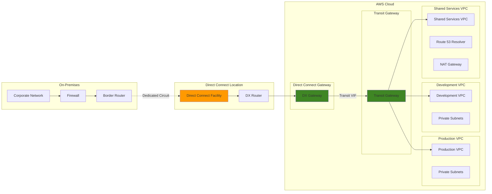

# Dedicated Hybrid Cloud Connectivity

## Problem

Organizations implementing hybrid cloud architectures struggle with inconsistent network performance, security concerns over internet-based connections, and high bandwidth costs for data transfer between on-premises and AWS. Traditional VPN connections lack the reliability, performance, and cost-effectiveness required for mission-critical workloads and large-scale data synchronization, limiting hybrid cloud adoption and operational efficiency.

## Solution

Establish dedicated network connectivity between on-premises infrastructure and AWS using Direct Connect with private and transit virtual interfaces. This solution provides consistent network performance, enhanced security through private connectivity, reduced data transfer costs, and the ability to access multiple VPCs across regions through a single connection using Direct Connect Gateway and Transit Gateway integration.

## Architecture Diagram



## Prerequisites

1. AWS account with appropriate permissions for Direct Connect, VPC, and Transit Gateway
2. AWS CLI v2 installed and configured (or AWS CloudShell)
3. Established connection with Direct Connect partner or colocation facility
4. On-premises border router supporting BGP and 802.1Q VLAN encapsulation
5. Estimated cost: $300-1000/month for 1Gbps dedicated connection plus data transfer charges

> **Note**: Direct Connect requires physical connectivity setup which can take 2-4 weeks. This recipe assumes the physical connection is established.

## Preparation

```bash
# Set environment variables
export AWS_REGION=$(aws configure get region)
export AWS_ACCOUNT_ID=$(aws sts get-caller-identity \
    --query Account --output text)

# Generate unique identifiers for resources
PROJECT_ID=$(aws secretsmanager get-random-password \
    --exclude-punctuation --exclude-uppercase \
    --password-length 8 --require-each-included-type \
    --output text --query RandomPassword)

export DX_CONNECTION_NAME="corp-datacenter-${PROJECT_ID}"
export DX_GATEWAY_NAME="corporate-dx-gateway-${PROJECT_ID}"
export TRANSIT_GATEWAY_NAME="corporate-tgw-${PROJECT_ID}"

# On-premises network configuration
export ON_PREM_ASN="65000"
export ON_PREM_CIDR="10.0.0.0/8"
export AWS_ASN="64512"

# VLAN IDs for virtual interfaces
export PRIVATE_VIF_VLAN="100"
export TRANSIT_VIF_VLAN="200"

echo "Project ID: ${PROJECT_ID}"
echo "DX Gateway: ${DX_GATEWAY_NAME}"
echo "Transit Gateway: ${TRANSIT_GATEWAY_NAME}"
```

## Steps

1. **Create VPC Infrastructure for Hybrid Connectivity**:

   VPC (Virtual Private Cloud) provides the foundational network layer for your hybrid cloud architecture. Creating multiple VPCs enables workload isolation, security segmentation, and compliance adherence while maintaining centralized connectivity through Transit Gateway. This multi-VPC design supports enterprise requirements for separating production, development, and shared services environments.

   ```bash
   # Create production VPC
   PROD_VPC_ID=$(aws ec2 create-vpc \
       --cidr-block 10.1.0.0/16 \
       --tag-specifications \
           'ResourceType=vpc,Tags=[{Key=Name,Value=Production-VPC-'${PROJECT_ID}'},{Key=Environment,Value=Production}]' \
       --query 'Vpc.VpcId' --output text)
   
   # Create development VPC
   DEV_VPC_ID=$(aws ec2 create-vpc \
       --cidr-block 10.2.0.0/16 \
       --tag-specifications \
           'ResourceType=vpc,Tags=[{Key=Name,Value=Development-VPC-'${PROJECT_ID}'},{Key=Environment,Value=Development}]' \
       --query 'Vpc.VpcId' --output text)
   
   # Create shared services VPC
   SHARED_VPC_ID=$(aws ec2 create-vpc \
       --cidr-block 10.3.0.0/16 \
       --tag-specifications \
           'ResourceType=vpc,Tags=[{Key=Name,Value=Shared-Services-VPC-'${PROJECT_ID}'},{Key=Environment,Value=Shared}]' \
       --query 'Vpc.VpcId' --output text)
   
   echo "✅ VPC infrastructure created"
   echo "Production VPC: ${PROD_VPC_ID}"
   echo "Development VPC: ${DEV_VPC_ID}"
   echo "Shared Services VPC: ${SHARED_VPC_ID}"
   ```

   The three VPCs now provide isolated network environments with non-overlapping CIDR blocks (10.1.0.0/16, 10.2.0.0/16, 10.3.0.0/16). This IP address separation ensures clean routing and prevents conflicts when connecting to on-premises networks that typically use 10.0.0.0/8 addressing.

2. **Create Transit Gateway for Multi-VPC Connectivity**:

   AWS Transit Gateway acts as a network hub that simplifies connectivity between VPCs, on-premises networks, and other AWS services. It eliminates the complexity of managing multiple VPC peering connections and provides centralized routing control. The BGP ASN configuration enables route exchange with on-premises networks through Direct Connect, creating a seamless hybrid network topology.

   ```bash
   # Create Transit Gateway
   TRANSIT_GATEWAY_ID=$(aws ec2 create-transit-gateway \
       --description "Corporate hybrid connectivity gateway" \
       --options \
           'AmazonSideAsn='${AWS_ASN}',AutoAcceptSharedAttachments=enable,DefaultRouteTableAssociation=enable,DefaultRouteTablePropagation=enable' \
       --tag-specifications \
           'ResourceType=transit-gateway,Tags=[{Key=Name,Value='${TRANSIT_GATEWAY_NAME}'}]' \
       --query 'TransitGateway.TransitGatewayId' --output text)
   
   # Wait for Transit Gateway to become available
   aws ec2 wait transit-gateway-available \
       --transit-gateway-ids ${TRANSIT_GATEWAY_ID}
   
   echo "✅ Transit Gateway created: ${TRANSIT_GATEWAY_ID}"
   ```

   The Transit Gateway is now operational and ready to accept VPC attachments. The configured ASN (64512) enables BGP routing with on-premises infrastructure, while the auto-accept and default route table settings simplify attachment management for enterprise-scale deployments.

   > **Note**: Transit Gateway supports up to 5,000 attachments and can handle 50 Gbps of traffic per attachment. For high-bandwidth requirements, consider multiple attachments or dedicated connections. See [AWS Transit Gateway documentation](https://docs.aws.amazon.com/vpc/latest/tgw/) for scaling guidelines.

3. **Attach VPCs to Transit Gateway**:

   Transit Gateway attachments require dedicated subnets in each VPC to establish connectivity. These subnets serve as the attachment points and must be in different Availability Zones for high availability in production environments. The attachment process creates secure tunnels between the VPCs and Transit Gateway, enabling inter-VPC communication and routing to on-premises networks.

   ```bash
   # Create private subnets for TGW attachments
   PROD_TGW_SUBNET=$(aws ec2 create-subnet \
       --vpc-id ${PROD_VPC_ID} \
       --cidr-block 10.1.1.0/24 \
       --availability-zone ${AWS_REGION}a \
       --tag-specifications \
           'ResourceType=subnet,Tags=[{Key=Name,Value=Prod-TGW-Subnet-'${PROJECT_ID}'}]' \
       --query 'Subnet.SubnetId' --output text)
   
   DEV_TGW_SUBNET=$(aws ec2 create-subnet \
       --vpc-id ${DEV_VPC_ID} \
       --cidr-block 10.2.1.0/24 \
       --availability-zone ${AWS_REGION}a \
       --tag-specifications \
           'ResourceType=subnet,Tags=[{Key=Name,Value=Dev-TGW-Subnet-'${PROJECT_ID}'}]' \
       --query 'Subnet.SubnetId' --output text)
   
   SHARED_TGW_SUBNET=$(aws ec2 create-subnet \
       --vpc-id ${SHARED_VPC_ID} \
       --cidr-block 10.3.1.0/24 \
       --availability-zone ${AWS_REGION}a \
       --tag-specifications \
           'ResourceType=subnet,Tags=[{Key=Name,Value=Shared-TGW-Subnet-'${PROJECT_ID}'}]' \
       --query 'Subnet.SubnetId' --output text)
   
   # Attach VPCs to Transit Gateway
   PROD_ATTACHMENT=$(aws ec2 create-transit-gateway-vpc-attachment \
       --transit-gateway-id ${TRANSIT_GATEWAY_ID} \
       --vpc-id ${PROD_VPC_ID} \
       --subnet-ids ${PROD_TGW_SUBNET} \
       --tag-specifications \
           'ResourceType=transit-gateway-attachment,Tags=[{Key=Name,Value=Prod-TGW-Attachment}]' \
       --query 'TransitGatewayVpcAttachment.TransitGatewayAttachmentId' --output text)
   
   DEV_ATTACHMENT=$(aws ec2 create-transit-gateway-vpc-attachment \
       --transit-gateway-id ${TRANSIT_GATEWAY_ID} \
       --vpc-id ${DEV_VPC_ID} \
       --subnet-ids ${DEV_TGW_SUBNET} \
       --tag-specifications \
           'ResourceType=transit-gateway-attachment,Tags=[{Key=Name,Value=Dev-TGW-Attachment}]' \
       --query 'TransitGatewayVpcAttachment.TransitGatewayAttachmentId' --output text)
   
   SHARED_ATTACHMENT=$(aws ec2 create-transit-gateway-vpc-attachment \
       --transit-gateway-id ${TRANSIT_GATEWAY_ID} \
       --vpc-id ${SHARED_VPC_ID} \
       --subnet-ids ${SHARED_TGW_SUBNET} \
       --tag-specifications \
           'ResourceType=transit-gateway-attachment,Tags=[{Key=Name,Value=Shared-TGW-Attachment}]' \
       --query 'TransitGatewayVpcAttachment.TransitGatewayAttachmentId' --output text)
   
   echo "✅ VPC attachments created"
   ```

   All three VPCs are now connected to the Transit Gateway, creating a hub-and-spoke network topology. This enables any VPC to communicate with others through the central gateway and provides the foundation for routing traffic to on-premises networks through Direct Connect.

4. **Create Direct Connect Gateway**:

   Direct Connect Gateway serves as the bridge between AWS Direct Connect and your cloud infrastructure, enabling connectivity to multiple VPCs and regions through a single Direct Connect connection. This centralized approach reduces connection costs and simplifies network management compared to individual VPC connections. The gateway supports BGP routing and provides redundancy for mission-critical hybrid workloads.

   ```bash
   # Create Direct Connect Gateway
   DX_GATEWAY_ID=$(aws directconnect create-direct-connect-gateway \
       --name ${DX_GATEWAY_NAME} \
       --amazon-side-asn ${AWS_ASN} \
       --query 'directConnectGateway.directConnectGatewayId' --output text)
   
   echo "✅ Direct Connect Gateway created: ${DX_GATEWAY_ID}"
   
   # Associate Direct Connect Gateway with Transit Gateway
   aws ec2 create-transit-gateway-direct-connect-gateway-attachment \
       --transit-gateway-id ${TRANSIT_GATEWAY_ID} \
       --direct-connect-gateway-id ${DX_GATEWAY_ID} \
       --tag-specifications \
           'ResourceType=transit-gateway-attachment,Tags=[{Key=Name,Value=DX-TGW-Attachment-'${PROJECT_ID}'}]'
   
   echo "✅ DX Gateway associated with Transit Gateway"
   ```

   The Direct Connect Gateway is now integrated with Transit Gateway, creating a unified routing domain that spans from on-premises to all attached VPCs. This architecture enables consistent network policies and simplified routing while maintaining the performance benefits of dedicated connectivity.

5. **Create Virtual Interfaces (Simulated - Manual Configuration Required)**:

   Virtual Interfaces (VIFs) establish the Layer 3 connectivity over your Direct Connect physical connection. Transit VIFs enable connectivity to multiple VPCs through Direct Connect Gateway, while BGP (Border Gateway Protocol) provides dynamic routing and redundancy. The /30 subnet provides point-to-point connectivity between your router and AWS, with BGP timers optimized for enterprise stability and convergence speed.

   ```bash
   # Note: In a real environment, you would create actual virtual interfaces
   # This section provides the configuration details needed
   
   echo "📋 Virtual Interface Configuration Required:"
   echo ""
   echo "1. Create Transit Virtual Interface:"
   echo "   Connection ID: <Your-DX-Connection-ID>"
   echo "   VLAN: ${TRANSIT_VIF_VLAN}"
   echo "   BGP ASN: ${ON_PREM_ASN}"
   echo "   Direct Connect Gateway: ${DX_GATEWAY_ID}"
   echo "   Customer Address: 192.168.100.1/30"
   echo "   Amazon Address: 192.168.100.2/30"
   echo ""
   echo "2. BGP Configuration Commands for On-Premises Router:"
   
   cat > bgp-config-template.txt << EOF
   # BGP Configuration Template for On-Premises Router
   
   router bgp ${ON_PREM_ASN}
    bgp router-id 192.168.100.1
    neighbor 192.168.100.2 remote-as ${AWS_ASN}
    neighbor 192.168.100.2 password <BGP-AUTH-KEY>
    neighbor 192.168.100.2 timers 10 30
    neighbor 192.168.100.2 soft-reconfiguration inbound
    
    address-family ipv4
     network ${ON_PREM_CIDR}
     neighbor 192.168.100.2 activate
     neighbor 192.168.100.2 prefix-list ALLOWED-PREFIXES out
     neighbor 192.168.100.2 prefix-list AWS-PREFIXES in
    exit-address-family
   
   # Prefix lists
   ip prefix-list ALLOWED-PREFIXES seq 10 permit ${ON_PREM_CIDR}
   ip prefix-list AWS-PREFIXES seq 10 permit 10.1.0.0/16
   ip prefix-list AWS-PREFIXES seq 20 permit 10.2.0.0/16
   ip prefix-list AWS-PREFIXES seq 30 permit 10.3.0.0/16
   EOF
   
   echo "✅ BGP configuration template created"
   ```

   The BGP configuration template provides secure routing with prefix filtering to control route advertisements between on-premises and AWS. The 10/30 second timers offer rapid convergence for production environments, while soft reconfiguration enables route policy changes without session resets.

6. **Configure Route Tables and Routing**:

   Route table configuration ensures traffic flows correctly between VPCs and on-premises networks through Transit Gateway. The routing design implements a hub-and-spoke model where Transit Gateway maintains the central routing table, while each VPC route table directs on-premises traffic to the gateway. This centralized approach simplifies route management and provides consistent routing policies across the hybrid infrastructure.

   ```bash
   # Get default Transit Gateway route table
   TGW_ROUTE_TABLE=$(aws ec2 describe-transit-gateways \
       --transit-gateway-ids ${TRANSIT_GATEWAY_ID} \
       --query 'TransitGateways[0].Options.DefaultRouteTableId' --output text)
   
   # Create route for on-premises traffic
   aws ec2 create-route \
       --route-table-id ${TGW_ROUTE_TABLE} \
       --destination-cidr-block ${ON_PREM_CIDR} \
       --transit-gateway-attachment-id ${DX_ATTACHMENT_ID:-"<DX-Attachment-ID>"}
   
   # Update VPC route tables to route traffic through Transit Gateway
   for VPC_ID in ${PROD_VPC_ID} ${DEV_VPC_ID} ${SHARED_VPC_ID}; do
       ROUTE_TABLE=$(aws ec2 describe-route-tables \
           --filters "Name=vpc-id,Values=${VPC_ID}" "Name=association.main,Values=true" \
           --query 'RouteTables[0].RouteTableId' --output text)
       
       # Add route for on-premises networks
       aws ec2 create-route \
           --route-table-id ${ROUTE_TABLE} \
           --destination-cidr-block ${ON_PREM_CIDR} \
           --transit-gateway-id ${TRANSIT_GATEWAY_ID}
   done
   
   echo "✅ Route tables configured"
   ```

   The routing configuration now provides bidirectional connectivity between all VPCs and on-premises networks. Traffic from any VPC destined for on-premises networks (10.0.0.0/8) will route through Transit Gateway to Direct Connect, while return traffic follows the reverse path through BGP route advertisements.

7. **Set Up DNS Resolution for Hybrid Environment**:

   Route 53 Resolver endpoints enable seamless DNS resolution between on-premises and AWS environments, eliminating the complexity of managing split-brain DNS configurations. Inbound endpoints allow on-premises systems to resolve AWS resource names, while outbound endpoints enable AWS resources to query on-premises DNS servers. This bidirectional DNS resolution is essential for hybrid applications and service discovery.

   ```bash
   # Create Route 53 Resolver endpoints for hybrid DNS
   
   # Create security group for resolver endpoints
   RESOLVER_SG=$(aws ec2 create-security-group \
       --group-name resolver-endpoints-sg-${PROJECT_ID} \
       --description "Security group for Route 53 Resolver endpoints" \
       --vpc-id ${SHARED_VPC_ID} \
       --tag-specifications \
           'ResourceType=security-group,Tags=[{Key=Name,Value=Resolver-SG-'${PROJECT_ID}'}]' \
       --query 'GroupId' --output text)
   
   # Allow DNS traffic from on-premises
   aws ec2 authorize-security-group-ingress \
       --group-id ${RESOLVER_SG} \
       --protocol udp \
       --port 53 \
       --cidr ${ON_PREM_CIDR}
   
   aws ec2 authorize-security-group-ingress \
       --group-id ${RESOLVER_SG} \
       --protocol tcp \
       --port 53 \
       --cidr ${ON_PREM_CIDR}
   
   # Create inbound resolver endpoint
   INBOUND_ENDPOINT=$(aws route53resolver create-resolver-endpoint \
       --creator-request-id "inbound-${PROJECT_ID}" \
       --security-group-ids ${RESOLVER_SG} \
       --direction INBOUND \
       --ip-addresses SubnetId=${SHARED_TGW_SUBNET},Ip=10.3.1.100 \
       --name "Inbound-Resolver-${PROJECT_ID}" \
       --query 'ResolverEndpoint.Id' --output text)
   
   # Create outbound resolver endpoint
   OUTBOUND_ENDPOINT=$(aws route53resolver create-resolver-endpoint \
       --creator-request-id "outbound-${PROJECT_ID}" \
       --security-group-ids ${RESOLVER_SG} \
       --direction OUTBOUND \
       --ip-addresses SubnetId=${SHARED_TGW_SUBNET},Ip=10.3.1.101 \
       --name "Outbound-Resolver-${PROJECT_ID}" \
       --query 'ResolverEndpoint.Id' --output text)
   
   echo "✅ DNS resolver endpoints created"
   echo "Inbound Endpoint: ${INBOUND_ENDPOINT}"
   echo "Outbound Endpoint: ${OUTBOUND_ENDPOINT}"
   ```

   The DNS resolver endpoints are now operational with static IP addresses (10.3.1.100 for inbound, 10.3.1.101 for outbound) that can be configured in on-premises DNS forwarders. This creates unified name resolution across the hybrid infrastructure, enabling applications to discover services regardless of their location.

8. **Configure Monitoring and Alerting**:

   CloudWatch monitoring provides visibility into Direct Connect performance and availability, enabling proactive management of your hybrid connectivity. Connection state monitoring ensures immediate notification of outages, while bandwidth metrics help optimize capacity planning and identify performance bottlenecks. These metrics are essential for maintaining SLA compliance and supporting business-critical hybrid workloads.

   ```bash
   # Create CloudWatch dashboard for Direct Connect monitoring
   cat > dx-dashboard.json << EOF
   {
       "widgets": [
           {
               "type": "metric",
               "properties": {
                   "metrics": [
                       ["AWS/DX", "ConnectionState", "ConnectionId", "<DX-Connection-ID>"],
                       [".", "ConnectionBpsEgress", ".", "."],
                       [".", "ConnectionBpsIngress", ".", "."],
                       [".", "ConnectionPacketsInEgress", ".", "."],
                       [".", "ConnectionPacketsInIngress", ".", "."]
                   ],
                   "period": 300,
                   "stat": "Average",
                   "region": "${AWS_REGION}",
                   "title": "Direct Connect Connection Metrics"
               }
           }
       ]
   }
   EOF
   
   aws cloudwatch put-dashboard \
       --dashboard-name "DirectConnect-${PROJECT_ID}" \
       --dashboard-body file://dx-dashboard.json
   
   # Create CloudWatch alarms for connection monitoring
   aws cloudwatch put-metric-alarm \
       --alarm-name "DX-Connection-Down-${PROJECT_ID}" \
       --alarm-description "Direct Connect connection is down" \
       --metric-name ConnectionState \
       --namespace AWS/DX \
       --statistic Maximum \
       --period 300 \
       --threshold 1 \
       --comparison-operator LessThanThreshold \
       --evaluation-periods 2 \
       --alarm-actions arn:aws:sns:${AWS_REGION}:${AWS_ACCOUNT_ID}:dx-alerts-${PROJECT_ID}
   
   echo "✅ Monitoring and alerting configured"
   ```

   The monitoring infrastructure now provides real-time visibility into connection health and performance metrics. The dashboard displays connection state, bandwidth utilization, and packet statistics, while the alarm triggers within 10 minutes of connection failure, enabling rapid incident response.

   > **Tip**: Configure additional alarms for bandwidth utilization (>80%) and packet loss to identify performance issues before they impact applications. Use CloudWatch Logs to correlate BGP session events with performance degradation.

9. **Implement Security Controls**:

   Network Access Control Lists (NACLs) provide subnet-level security that complements security group rules, creating defense-in-depth protection for hybrid connectivity. VPC Flow Logs capture all network traffic for security monitoring, compliance auditing, and troubleshooting. These controls are essential for maintaining security posture across the hybrid infrastructure and meeting regulatory requirements.

   ```bash
   # Create NACLs for additional security
   SHARED_NACL=$(aws ec2 create-network-acl \
       --vpc-id ${SHARED_VPC_ID} \
       --tag-specifications \
           'ResourceType=network-acl,Tags=[{Key=Name,Value=Shared-Services-NACL-'${PROJECT_ID}'}]' \
       --query 'NetworkAcl.NetworkAclId' --output text)
   
   # Allow inbound traffic from on-premises
   aws ec2 create-network-acl-entry \
       --network-acl-id ${SHARED_NACL} \
       --rule-number 100 \
       --protocol tcp \
       --port-range From=443,To=443 \
       --cidr-block ${ON_PREM_CIDR} \
       --rule-action allow
   
   aws ec2 create-network-acl-entry \
       --network-acl-id ${SHARED_NACL} \
       --rule-number 200 \
       --protocol tcp \
       --port-range From=22,To=22 \
       --cidr-block ${ON_PREM_CIDR} \
       --rule-action allow
   
   # Create VPC Flow Logs for monitoring
   aws ec2 create-flow-logs \
       --resource-type VPC \
       --resource-ids ${PROD_VPC_ID} ${DEV_VPC_ID} ${SHARED_VPC_ID} \
       --traffic-type ALL \
       --log-destination-type cloud-watch-logs \
       --log-group-name "/aws/vpc/flowlogs-${PROJECT_ID}" \
       --deliver-logs-permission-arn arn:aws:iam::${AWS_ACCOUNT_ID}:role/flowlogsRole
   
   echo "✅ Security controls implemented"
   ```

   The security controls now provide comprehensive monitoring and protection for hybrid traffic. NACLs restrict access to essential ports (HTTPS and SSH), while Flow Logs capture all network activity for security analysis and compliance reporting. This layered security approach protects against unauthorized access while maintaining operational visibility.

10. **Create Connection Testing and Validation Scripts**:

    Automated testing scripts enable continuous validation of hybrid connectivity and rapid troubleshooting of network issues. These scripts verify BGP session health, route propagation, and DNS resolution functionality, providing comprehensive connectivity testing without manual intervention. Regular execution of these scripts helps maintain operational excellence and quickly identify configuration drift or connectivity problems.

    ```bash
    # Create connectivity testing script
    cat > test-hybrid-connectivity.sh << 'EOF'
    #!/bin/bash
    
    echo "Testing Hybrid Connectivity..."
    
    # Test 1: BGP session status
    echo "1. Checking BGP session status..."
    aws directconnect describe-virtual-interfaces \
        --query 'virtualInterfaces[*].{Name:virtualInterfaceName,State:virtualInterfaceState,BGP:bgpStatus}' \
        --output table
    
    # Test 2: Route propagation
    echo "2. Checking Transit Gateway route tables..."
    aws ec2 describe-transit-gateway-route-tables \
        --query 'TransitGatewayRouteTables[*].{TableId:TransitGatewayRouteTableId,State:State}' \
        --output table
    
    # Test 3: VPC connectivity
    echo "3. Testing VPC to VPC connectivity via Transit Gateway..."
    # This would typically involve launching test instances and performing ping tests
    
    # Test 4: DNS resolution
    echo "4. Testing DNS resolution..."
    aws route53resolver list-resolver-endpoints \
        --query 'ResolverEndpoints[*].{Id:Id,Direction:Direction,Status:Status}' \
        --output table
    
    echo "Connectivity tests completed."
    EOF
    
    chmod +x test-hybrid-connectivity.sh
    
    # Create network monitoring script
    cat > monitor-dx-metrics.py << 'EOF'
    import boto3
    import datetime
    
    def get_dx_metrics():
        cloudwatch = boto3.client('cloudwatch')
        
        end_time = datetime.datetime.utcnow()
        start_time = end_time - datetime.timedelta(hours=1)
        
        # Get connection state metrics
        response = cloudwatch.get_metric_statistics(
            Namespace='AWS/DX',
            MetricName='ConnectionState',
            StartTime=start_time,
            EndTime=end_time,
            Period=300,
            Statistics=['Maximum']
        )
        
        print("Direct Connect Connection Metrics:")
        for datapoint in response['Datapoints']:
            print(f"Time: {datapoint['Timestamp']}, State: {datapoint['Maximum']}")
    
    if __name__ == '__main__':
        get_dx_metrics()
    EOF
    
    echo "✅ Testing and monitoring scripts created"
    ```

    The testing and monitoring scripts are now available for ongoing connectivity validation. These tools provide automated health checks for all hybrid connectivity components and can be integrated into monitoring systems or executed as part of regular operational procedures to ensure consistent network performance.

## Validation & Testing

1. Verify Direct Connect Gateway creation:

   ```bash
   # Check Direct Connect Gateway status
   aws directconnect describe-direct-connect-gateways \
       --direct-connect-gateway-id ${DX_GATEWAY_ID} \
       --query 'directConnectGateways[0].{Name:name,State:directConnectGatewayState,ASN:amazonSideAsn}' \
       --output table
   ```

   Expected output: Gateway in "available" state

2. Validate Transit Gateway attachments:

   ```bash
   # List Transit Gateway attachments
   aws ec2 describe-transit-gateway-attachments \
       --filters Name=transit-gateway-id,Values=${TRANSIT_GATEWAY_ID} \
       --query 'TransitGatewayAttachments[*].{Type:ResourceType,ID:ResourceId,State:State}' \
       --output table
   ```

3. Test route propagation:

   ```bash
   # Check Transit Gateway route table
   aws ec2 search-transit-gateway-routes \
       --transit-gateway-route-table-id ${TGW_ROUTE_TABLE} \
       --filters Name=state,Values=active \
       --query 'Routes[*].{CIDR:DestinationCidrBlock,Type:Type,State:State}' \
       --output table
   ```

4. Verify DNS resolver endpoints:

   ```bash
   # Check resolver endpoint status
   aws route53resolver list-resolver-endpoints \
       --query 'ResolverEndpoints[*].{Direction:Direction,Status:Status,IPs:IpAddressCount}' \
       --output table
   ```

## Cleanup

1. Remove Direct Connect Gateway associations:

   ```bash
   # Delete Transit Gateway Direct Connect Gateway attachment
   DX_TGW_ATTACHMENT=$(aws ec2 describe-transit-gateway-attachments \
       --filters Name=resource-type,Values=direct-connect-gateway \
       --query 'TransitGatewayAttachments[0].TransitGatewayAttachmentId' --output text)
   
   aws ec2 delete-transit-gateway-direct-connect-gateway-attachment \
       --transit-gateway-attachment-id ${DX_TGW_ATTACHMENT}
   
   echo "✅ DX Gateway attachment deleted"
   ```

2. Delete DNS resolver endpoints:

   ```bash
   # Delete resolver endpoints
   aws route53resolver delete-resolver-endpoint \
       --resolver-endpoint-id ${INBOUND_ENDPOINT}
   
   aws route53resolver delete-resolver-endpoint \
       --resolver-endpoint-id ${OUTBOUND_ENDPOINT}
   
   echo "✅ DNS resolver endpoints deleted"
   ```

3. Remove Transit Gateway and VPC attachments:

   ```bash
   # Delete VPC attachments
   for ATTACHMENT in ${PROD_ATTACHMENT} ${DEV_ATTACHMENT} ${SHARED_ATTACHMENT}; do
       aws ec2 delete-transit-gateway-vpc-attachment \
           --transit-gateway-attachment-id ${ATTACHMENT}
   done
   
   # Wait for attachments to be deleted
   sleep 60
   
   # Delete Transit Gateway
   aws ec2 delete-transit-gateway \
       --transit-gateway-id ${TRANSIT_GATEWAY_ID}
   
   echo "✅ Transit Gateway resources deleted"
   ```

4. Clean up VPC resources:

   ```bash
   # Delete VPCs
   for VPC_ID in ${PROD_VPC_ID} ${DEV_VPC_ID} ${SHARED_VPC_ID}; do
       # Delete subnets first
       SUBNETS=$(aws ec2 describe-subnets \
           --filters Name=vpc-id,Values=${VPC_ID} \
           --query 'Subnets[].SubnetId' --output text)
       
       for SUBNET in ${SUBNETS}; do
           aws ec2 delete-subnet --subnet-id ${SUBNET}
       done
       
       # Delete VPC
       aws ec2 delete-vpc --vpc-id ${VPC_ID}
   done
   
   # Delete security groups and NACLs are automatically cleaned up
   
   echo "✅ VPC resources cleaned up"
   ```

5. Remove monitoring and local files:

   ```bash
   # Delete CloudWatch dashboard
   aws cloudwatch delete-dashboards \
       --dashboard-names "DirectConnect-${PROJECT_ID}"
   
   # Delete CloudWatch alarms
   aws cloudwatch delete-alarms \
       --alarm-names "DX-Connection-Down-${PROJECT_ID}"
   
   # Clean up local files
   rm -f bgp-config-template.txt
   rm -f dx-dashboard.json
   rm -f test-hybrid-connectivity.sh
   rm -f monitor-dx-metrics.py
   
   echo "✅ Monitoring and local files cleaned up"
   ```

## Discussion

AWS Direct Connect provides enterprises with a reliable, high-performance alternative to internet-based connectivity for hybrid cloud architectures. The service addresses critical limitations of VPN connections by offering dedicated bandwidth, consistent network performance, and reduced data transfer costs for high-volume workloads.

The integration of Direct Connect Gateway with Transit Gateway creates a powerful hub-and-spoke architecture that simplifies network management while providing scalable connectivity to multiple VPCs across regions. This design eliminates the need for complex VPC peering arrangements and reduces the operational overhead of managing multiple Direct Connect connections.

Virtual interface configuration is crucial for security and performance optimization. Transit virtual interfaces enable centralized connectivity management, while private virtual interfaces provide dedicated access to specific VPC resources. The BGP routing configuration ensures optimal path selection and enables granular control over traffic flows between on-premises and cloud environments.

Route 53 Resolver endpoints facilitate seamless DNS resolution across hybrid environments, enabling consistent service discovery and reducing the complexity of split-brain DNS configurations. The inbound and outbound resolver endpoints ensure that both cloud and on-premises resources can resolve names efficiently.

> **Warning**: Direct Connect provides a single point of failure. Implement redundant connections or backup VPN connectivity for mission-critical applications.

## Challenge

Extend this hybrid connectivity solution by implementing these enhancements:

1. **Multi-Region Redundancy**: Deploy redundant Direct Connect connections across multiple AWS regions with automated failover using Route 53 health checks and BGP routing.

2. **Bandwidth Auto-Scaling**: Implement CloudWatch-based monitoring that automatically provisions additional virtual interfaces when bandwidth utilization exceeds thresholds.

3. **Zero-Trust Security**: Integrate AWS Private Certificate Authority and implement mutual TLS authentication for all hybrid connectivity traffic.

4. **SD-WAN Integration**: Extend the solution to integrate with software-defined WAN solutions, enabling dynamic path selection based on application requirements and network conditions.

5. **Cost Optimization Automation**: Develop Lambda functions that analyze traffic patterns and automatically adjust virtual interface configurations to optimize data transfer costs across different pricing tiers.

## Infrastructure Code

*Infrastructure code will be generated after recipe approval.*