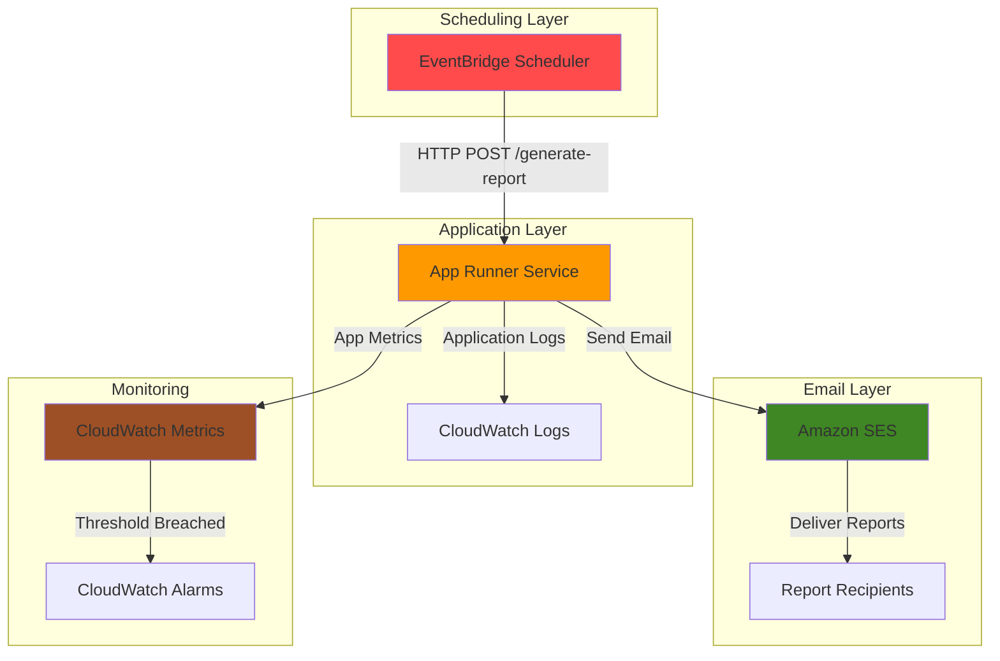

# Delivering Scheduled Reports with App Runner and SES

## Problem

Organizations need to distribute business reports automatically to stakeholders without manual intervention, but managing email infrastructure and scheduling systems requires significant operational overhead. Teams struggle with maintaining server infrastructure, scaling email sending capabilities, and ensuring reliable delivery of time-sensitive reports across different time zones and schedules.

## Solution

Build a serverless email reporting system using AWS App Runner to host a containerized Flask application that generates business reports, Amazon SES for reliable email delivery, and EventBridge Scheduler for automated scheduling. This solution provides automatic scaling, simplified deployment, and robust email delivery with minimal operational overhead.

## Architecture Diagram



## Prerequisites

1. AWS account with appropriate permissions for App Runner, SES, EventBridge Scheduler, and CloudWatch
2. AWS CLI v2 installed and configured (or AWS CloudShell)
3. Docker installed locally for container testing
4. Basic knowledge of Python, Flask, and containerization concepts
5. Verified email address or domain in Amazon SES
6. Estimated cost: $5-15/month for basic usage (App Runner vCPU/memory, SES email volume, EventBridge invocations)

> **Note**: This recipe uses EventBridge Scheduler which provides improved scalability and flexibility over traditional EventBridge rules for scheduled tasks.

## Preparation

```bash
# Set environment variables
export AWS_REGION=$(aws configure get region)
export AWS_ACCOUNT_ID=$(aws sts get-caller-identity \
    --query Account --output text)

# Generate unique identifiers for resources
RANDOM_SUFFIX=$(aws secretsmanager get-random-password \
    --exclude-punctuation --exclude-uppercase \
    --password-length 6 --require-each-included-type \
    --output text --query RandomPassword)

# Set resource names
export APP_RUNNER_SERVICE_NAME="email-reports-service-${RANDOM_SUFFIX}"
export SES_VERIFIED_EMAIL="your-verified-email@example.com"
export SCHEDULE_NAME="daily-report-schedule-${RANDOM_SUFFIX}"

# Create project directory
mkdir -p email-reports-app && cd email-reports-app

echo "✅ Environment configured with unique suffix: ${RANDOM_SUFFIX}"
```

## Steps

1. **Create the Report Generation Application**:

   AWS App Runner simplifies containerized application deployment by handling infrastructure provisioning, load balancing, and auto-scaling automatically. We'll create a Flask application that generates business reports and sends them via email, leveraging App Runner's built-in integration with container registries and source code repositories.

   ```bash
   # Create the main application file
   cat > app.py << 'EOF'
   from flask import Flask, request, jsonify
   import boto3
   import json
   import logging
   from datetime import datetime
   import os
   
   app = Flask(__name__)
   logging.basicConfig(level=logging.INFO)
   
   # Initialize AWS clients
   ses_client = boto3.client('ses')
   cloudwatch = boto3.client('cloudwatch')
   
   @app.route('/health', methods=['GET'])
   def health_check():
       return jsonify({'status': 'healthy', 'timestamp': datetime.now().isoformat()})
   
   @app.route('/generate-report', methods=['POST'])
   def generate_report():
       try:
           # Generate sample business report
           report_data = {
               'date': datetime.now().strftime('%Y-%m-%d'),
               'total_users': 1250,
               'active_sessions': 892,
               'revenue': 45780.50,
               'conversion_rate': 3.2
           }
           
           # Create HTML email content
           html_body = f"""
           <html>
           <body>
               <h2>Daily Business Report - {report_data['date']}</h2>
               <table border="1" style="border-collapse: collapse;">
                   <tr><td><strong>Total Users</strong></td><td>{report_data['total_users']}</td></tr>
                   <tr><td><strong>Active Sessions</strong></td><td>{report_data['active_sessions']}</td></tr>
                   <tr><td><strong>Revenue</strong></td><td>${report_data['revenue']:,.2f}</td></tr>
                   <tr><td><strong>Conversion Rate</strong></td><td>{report_data['conversion_rate']}%</td></tr>
               </table>
           </body>
           </html>
           """
           
           # Send email via SES
           response = ses_client.send_email(
               Source=os.environ.get('SES_VERIFIED_EMAIL'),
               Destination={'ToAddresses': [os.environ.get('SES_VERIFIED_EMAIL')]},
               Message={
                   'Subject': {'Data': f'Daily Business Report - {report_data["date"]}'},
                   'Body': {'Html': {'Data': html_body}}
               }
           )
           
           # Send custom metric to CloudWatch
           cloudwatch.put_metric_data(
               Namespace='EmailReports',
               MetricData=[
                   {
                       'MetricName': 'ReportsGenerated',
                       'Value': 1,
                       'Unit': 'Count'
                   }
               ]
           )
           
           logging.info(f"Report sent successfully. MessageId: {response['MessageId']}")
           return jsonify({'status': 'success', 'message_id': response['MessageId']})
           
       except Exception as e:
           logging.error(f"Error generating report: {str(e)}")
           return jsonify({'status': 'error', 'message': str(e)}), 500
   
   if __name__ == '__main__':
       app.run(host='0.0.0.0', port=8000)
   EOF
   
   echo "✅ Flask application created"
   ```

2. **Create Container Configuration Files**:

   App Runner requires specific configuration files to understand how to build and run your containerized application. The Dockerfile defines the container environment while the apprunner.yaml file provides service-specific configuration for scaling, environment variables, and health checks.

   ```bash
   # Create Dockerfile for containerization
   cat > Dockerfile << 'EOF'
   FROM python:3.11-slim
   
   WORKDIR /app
   
   COPY requirements.txt .
   RUN pip install --no-cache-dir -r requirements.txt
   
   COPY app.py .
   
   EXPOSE 8000
   
   CMD ["python", "app.py"]
   EOF
   
   # Create requirements.txt
   cat > requirements.txt << 'EOF'
   Flask==3.0.0
   boto3==1.35.0
   EOF
   
   # Create App Runner configuration
   cat > apprunner.yaml << 'EOF'
   version: 1.0
   runtime: python3
   build:
     commands:
       build:
         - pip install -r requirements.txt
   run:
     runtime-version: 3.11
     command: python app.py
     network:
       port: 8000
   EOF
   
   echo "✅ Container configuration files created"
   ```

3. **Initialize Git Repository and Push to GitHub**:

   App Runner integrates seamlessly with GitHub repositories, providing automatic deployments when code changes are pushed. This approach enables continuous integration and deployment workflows while maintaining version control and change tracking for your email reporting application.

   ```bash
   # Initialize git repository
   git init
   git add .
   git commit -m "Initial commit: Email reports application"
   
   # Create GitHub repository (you'll need to create this manually)
   echo "📝 Create a GitHub repository named 'email-reports-app'"
   echo "📝 Then run: git remote add origin https://github.com/YOUR-USERNAME/email-reports-app.git"
   echo "📝 Finally run: git push -u origin main"
   
   # Note: Replace YOUR-USERNAME with your actual GitHub username
   read -p "Press Enter after creating GitHub repository and pushing code..."
   
   echo "✅ Code repository prepared"
   ```

4. **Create IAM Role for App Runner Service**:

   App Runner requires specific IAM permissions to access other AWS services on your behalf. This role grants the minimum necessary permissions to send emails through SES and publish metrics to CloudWatch, following the principle of least privilege for security best practices.

   ```bash
   # Create trust policy for App Runner
   cat > trust-policy.json << 'EOF'
   {
       "Version": "2012-10-17",
       "Statement": [
           {
               "Effect": "Allow",
               "Principal": {
                   "Service": "tasks.apprunner.amazonaws.com"
               },
               "Action": "sts:AssumeRole"
           }
       ]
   }
   EOF
   
   # Create permissions policy
   cat > permissions-policy.json << 'EOF'
   {
       "Version": "2012-10-17",
       "Statement": [
           {
               "Effect": "Allow",
               "Action": [
                   "ses:SendEmail",
                   "ses:SendRawEmail"
               ],
               "Resource": "*"
           },
           {
               "Effect": "Allow",
               "Action": [
                   "cloudwatch:PutMetricData"
               ],
               "Resource": "*"
           }
       ]
   }
   EOF
   
   # Create IAM role
   ROLE_NAME="AppRunnerEmailReportsRole-${RANDOM_SUFFIX}"
   aws iam create-role \
       --role-name ${ROLE_NAME} \
       --assume-role-policy-document file://trust-policy.json
   
   # Attach permissions policy
   aws iam put-role-policy \
       --role-name ${ROLE_NAME} \
       --policy-name EmailReportsPolicy \
       --policy-document file://permissions-policy.json
   
   # Get role ARN
   ROLE_ARN=$(aws iam get-role --role-name ${ROLE_NAME} \
       --query 'Role.Arn' --output text)
   
   echo "✅ IAM role created: ${ROLE_ARN}"
   ```

5. **Create App Runner Service**:

   App Runner provides a fully managed container application service that automatically handles infrastructure provisioning, load balancing, and scaling. By connecting to your GitHub repository, it establishes a continuous deployment pipeline that rebuilds and deploys your application whenever you push code changes.

   ```bash
   # Create App Runner service configuration
   cat > service-config.json << EOF
   {
       "ServiceName": "${APP_RUNNER_SERVICE_NAME}",
       "SourceConfiguration": {
           "CodeRepository": {
               "RepositoryUrl": "https://github.com/YOUR-USERNAME/email-reports-app",
               "SourceCodeVersion": {
                   "Type": "BRANCH",
                   "Value": "main"
               },
               "CodeConfiguration": {
                   "ConfigurationSource": "REPOSITORY"
               }
           },
           "AutoDeploymentsEnabled": true
       },
       "InstanceConfiguration": {
           "Cpu": "0.25 vCPU",
           "Memory": "0.5 GB",
           "InstanceRoleArn": "${ROLE_ARN}",
           "EnvironmentVariables": {
               "SES_VERIFIED_EMAIL": "${SES_VERIFIED_EMAIL}"
           }
       },
       "HealthCheckConfiguration": {
           "Protocol": "HTTP",
           "Path": "/health",
           "Interval": 10,
           "Timeout": 5,
           "HealthyThreshold": 1,
           "UnhealthyThreshold": 5
       }
   }
   EOF
   
   # Create App Runner service
   aws apprunner create-service \
       --cli-input-json file://service-config.json
   
   # Wait for service to be ready
   echo "⏳ Waiting for App Runner service to be ready..."
   aws apprunner wait service-running \
       --service-name ${APP_RUNNER_SERVICE_NAME}
   
   # Get service URL
   SERVICE_URL=$(aws apprunner describe-service \
       --service-name ${APP_RUNNER_SERVICE_NAME} \
       --query 'Service.ServiceUrl' --output text)
   
   echo "✅ App Runner service created: https://${SERVICE_URL}"
   ```

6. **Set Up SES Email Verification**:

   Amazon SES requires email address verification in sandbox mode to prevent spam and ensure legitimate email sending. This step verifies your email address for both sending and receiving reports, establishing the foundation for secure email communication.

   ```bash
   # Verify sender email address
   aws ses verify-email-identity \
       --email-address ${SES_VERIFIED_EMAIL}
   
   # Check verification status
   aws ses get-identity-verification-attributes \
       --identities ${SES_VERIFIED_EMAIL}
   
   echo "📧 Check your email (${SES_VERIFIED_EMAIL}) for verification link"
   read -p "Press Enter after clicking verification link..."
   
   # Verify the email is now verified
   VERIFICATION_STATUS=$(aws ses get-identity-verification-attributes \
       --identities ${SES_VERIFIED_EMAIL} \
       --query "VerificationAttributes.\"${SES_VERIFIED_EMAIL}\".VerificationStatus" \
       --output text)
   
   echo "✅ Email verification status: ${VERIFICATION_STATUS}"
   ```

7. **Create IAM Role for EventBridge Scheduler**:

   EventBridge Scheduler requires specific permissions to invoke HTTP endpoints. This role enables the scheduler to authenticate and make HTTP POST requests to your application's report generation endpoint, ensuring secure and reliable automated execution. Note that for HTTP targets, minimal permissions are required since the scheduler invokes external HTTP endpoints.

   ```bash
   # Create trust policy for EventBridge Scheduler
   cat > scheduler-trust-policy.json << 'EOF'
   {
       "Version": "2012-10-17",
       "Statement": [
           {
               "Effect": "Allow",
               "Principal": {
                   "Service": "scheduler.amazonaws.com"
               },
               "Action": "sts:AssumeRole"
           }
       ]
   }
   EOF
   
   # Create minimal permissions policy for HTTP invocation
   cat > scheduler-permissions-policy.json << 'EOF'
   {
       "Version": "2012-10-17",
       "Statement": [
           {
               "Effect": "Allow",
               "Action": [
                   "logs:CreateLogGroup",
                   "logs:CreateLogStream",
                   "logs:PutLogEvents"
               ],
               "Resource": "arn:aws:logs:*:*:*"
           }
       ]
   }
   EOF
   
   # Create IAM role for scheduler
   SCHEDULER_ROLE_NAME="EventBridgeSchedulerRole-${RANDOM_SUFFIX}"
   aws iam create-role \
       --role-name ${SCHEDULER_ROLE_NAME} \
       --assume-role-policy-document file://scheduler-trust-policy.json
   
   # Attach permissions policy
   aws iam put-role-policy \
       --role-name ${SCHEDULER_ROLE_NAME} \
       --policy-name SchedulerHttpPolicy \
       --policy-document file://scheduler-permissions-policy.json
   
   # Get scheduler role ARN
   SCHEDULER_ROLE_ARN=$(aws iam get-role --role-name ${SCHEDULER_ROLE_NAME} \
       --query 'Role.Arn' --output text)
   
   echo "✅ EventBridge Scheduler role created: ${SCHEDULER_ROLE_ARN}"
   ```

8. **Create EventBridge Schedule**:

   EventBridge Scheduler provides serverless, highly scalable scheduling capabilities that can invoke your App Runner service at specified intervals. This schedule automatically triggers report generation daily at 9 AM UTC, demonstrating how to build reliable automation workflows without managing infrastructure.

   ```bash
   # Create schedule configuration
   cat > schedule-config.json << EOF
   {
       "Name": "${SCHEDULE_NAME}",
       "ScheduleExpression": "cron(0 9 * * ? *)",
       "ScheduleExpressionTimezone": "UTC",
       "Description": "Daily email report generation",
       "State": "ENABLED",
       "FlexibleTimeWindow": {
           "Mode": "OFF"
       },
       "Target": {
           "Arn": "arn:aws:scheduler:::http-invoke",
           "RoleArn": "${SCHEDULER_ROLE_ARN}",
           "HttpParameters": {
               "HttpMethod": "POST",
               "Url": "https://${SERVICE_URL}/generate-report",
               "PathParameterValues": {},
               "QueryStringParameters": {},
               "HeaderParameters": {
                   "Content-Type": "application/json"
               }
           }
       },
       "RetryPolicy": {
           "MaximumRetryAttempts": 3,
           "MaximumEventAge": 86400
       }
   }
   EOF
   
   # Create the schedule
   aws scheduler create-schedule \
       --cli-input-json file://schedule-config.json
   
   echo "✅ EventBridge Schedule created: ${SCHEDULE_NAME}"
   ```

9. **Configure CloudWatch Monitoring**:

   CloudWatch provides comprehensive monitoring capabilities for your email reporting system, including application logs, custom metrics, and automated alerting. This configuration enables proactive monitoring of report generation success rates and system performance.

   ```bash
   # Create CloudWatch alarm for failed report generation
   aws cloudwatch put-metric-alarm \
       --alarm-name "EmailReports-GenerationFailures-${RANDOM_SUFFIX}" \
       --alarm-description "Alert when email report generation fails" \
       --metric-name ReportsGenerated \
       --namespace EmailReports \
       --statistic Sum \
       --period 3600 \
       --threshold 1 \
       --comparison-operator LessThanThreshold \
       --evaluation-periods 1 \
       --treat-missing-data notBreaching
   
   # Create dashboard for monitoring
   cat > dashboard-config.json << EOF
   {
       "widgets": [
           {
               "type": "metric",
               "properties": {
                   "metrics": [
                       ["EmailReports", "ReportsGenerated"]
                   ],
                   "period": 300,
                   "stat": "Sum",
                   "region": "${AWS_REGION}",
                   "title": "Email Reports Generated"
               }
           },
           {
               "type": "log",
               "properties": {
                   "query": "SOURCE '/aws/apprunner/${APP_RUNNER_SERVICE_NAME}' | fields @timestamp, @message | filter @message like /Report sent successfully/ | sort @timestamp desc | limit 20",
                   "region": "${AWS_REGION}",
                   "title": "Recent Report Generation Success"
               }
           }
       ]
   }
   EOF
   
   aws cloudwatch put-dashboard \
       --dashboard-name "EmailReports-Dashboard-${RANDOM_SUFFIX}" \
       --dashboard-body file://dashboard-config.json
   
   echo "✅ CloudWatch monitoring configured"
   ```

## Validation & Testing

1. **Test the App Runner Service Health**:

   ```bash
   # Check service health endpoint
   curl -s https://${SERVICE_URL}/health | jq '.'
   ```

   Expected output: `{"status": "healthy", "timestamp": "2025-07-23T10:00:00.000000"}`

2. **Manually Trigger Report Generation**:

   ```bash
   # Test report generation endpoint
   curl -X POST https://${SERVICE_URL}/generate-report \
       -H "Content-Type: application/json" \
       -d '{}' | jq '.'
   ```

   Expected output: `{"status": "success", "message_id": "0000014a-f4d4-4f36-b8ca-..."}`

3. **Verify Email Delivery**:

   ```bash
   # Check SES sending statistics
   aws ses get-send-statistics
   ```

   Check your email inbox for the generated business report.

4. **Test EventBridge Schedule**:

   ```bash
   # List schedules to verify creation
   aws scheduler list-schedules \
       --name-prefix ${SCHEDULE_NAME}
   
   # Check schedule details
   aws scheduler get-schedule \
       --name ${SCHEDULE_NAME}
   ```

5. **Monitor CloudWatch Metrics**:

   ```bash
   # Check custom metrics
   aws cloudwatch get-metric-statistics \
       --namespace EmailReports \
       --metric-name ReportsGenerated \
       --start-time $(date -u -d '1 hour ago' +%Y-%m-%dT%H:%M:%S) \
       --end-time $(date -u +%Y-%m-%dT%H:%M:%S) \
       --period 3600 \
       --statistics Sum
   ```

## Cleanup

1. **Delete EventBridge Schedule**:

   ```bash
   # Delete the schedule
   aws scheduler delete-schedule \
       --name ${SCHEDULE_NAME}
   
   echo "✅ EventBridge Schedule deleted"
   ```

2. **Delete App Runner Service**:

   ```bash
   # Delete App Runner service
   aws apprunner delete-service \
       --service-name ${APP_RUNNER_SERVICE_NAME}
   
   # Wait for service deletion
   aws apprunner wait service-deleted \
       --service-name ${APP_RUNNER_SERVICE_NAME}
   
   echo "✅ App Runner service deleted"
   ```

3. **Remove IAM Roles**:

   ```bash
   # Delete IAM policies and roles
   aws iam delete-role-policy \
       --role-name ${ROLE_NAME} \
       --policy-name EmailReportsPolicy
   
   aws iam delete-role \
       --role-name ${ROLE_NAME}
   
   aws iam delete-role-policy \
       --role-name ${SCHEDULER_ROLE_NAME} \
       --policy-name SchedulerHttpPolicy
   
   aws iam delete-role \
       --role-name ${SCHEDULER_ROLE_NAME}
   
   echo "✅ IAM roles deleted"
   ```

4. **Remove CloudWatch Resources**:

   ```bash
   # Delete CloudWatch alarm
   aws cloudwatch delete-alarms \
       --alarm-names "EmailReports-GenerationFailures-${RANDOM_SUFFIX}"
   
   # Delete CloudWatch dashboard
   aws cloudwatch delete-dashboards \
       --dashboard-names "EmailReports-Dashboard-${RANDOM_SUFFIX}"
   
   echo "✅ CloudWatch resources deleted"
   ```

5. **Clean Up Local Files**:

   ```bash
   # Remove project directory
   cd .. && rm -rf email-reports-app
   
   # Clean up environment variables
   unset APP_RUNNER_SERVICE_NAME SES_VERIFIED_EMAIL SCHEDULE_NAME RANDOM_SUFFIX
   
   echo "✅ Local cleanup completed"
   ```

## Discussion

This recipe demonstrates how to build a comprehensive email reporting system using AWS serverless services that automatically scales based on demand while maintaining cost efficiency. AWS App Runner provides the ideal platform for containerized applications by abstracting away infrastructure management while still offering the flexibility of containers. The service automatically handles load balancing, health checks, and scaling, making it perfect for applications that need to run continuously but with variable traffic patterns.

The integration between EventBridge Scheduler and App Runner showcases modern event-driven architecture patterns where scheduled events trigger application functionality without requiring dedicated server resources. EventBridge Scheduler offers significant advantages over traditional cron jobs by providing built-in retry mechanisms, flexible time windows, and integration with AWS IAM for security. This approach eliminates the need to manage scheduling infrastructure while providing enterprise-grade reliability and monitoring capabilities. For HTTP targets, EventBridge Scheduler requires minimal IAM permissions since it's invoking external endpoints rather than AWS services.

Amazon SES provides enterprise-grade email delivery capabilities with built-in reputation management, bounce handling, and delivery optimization. The service automatically handles email authentication protocols like SPF, DKIM, and DMARC, ensuring high deliverability rates. When combined with CloudWatch monitoring, you can track email sending metrics, delivery rates, and bounce rates to optimize your email reporting strategy. This integration enables proactive monitoring and alerting for email delivery issues.

The CloudWatch integration demonstrates how to implement comprehensive observability for serverless applications. By combining application logs, custom metrics, and automated alarms, you can maintain visibility into system performance and quickly identify issues. This approach follows AWS Well-Architected Framework principles by implementing operational excellence through automated monitoring and alerting, ensuring your email reporting system remains reliable and performant.

> **Tip**: Consider implementing email template management using Amazon SES templates for more sophisticated report formatting and personalization capabilities. Also, App Runner now supports Python 3.11 which provides improved performance and security features.

*Documentation Sources:*
- [AWS App Runner Developer Guide](https://docs.aws.amazon.com/apprunner/latest/dg/getting-started.html)
- [Amazon SES Developer Guide](https://docs.aws.amazon.com/ses/latest/DeveloperGuide/send-email.html)
- [EventBridge Scheduler User Guide](https://docs.aws.amazon.com/scheduler/latest/UserGuide/what-is-scheduler.html)
- [Amazon CloudWatch User Guide](https://docs.aws.amazon.com/AmazonCloudWatch/latest/monitoring/WhatIsCloudWatch.html)
- [AWS Well-Architected Framework](https://docs.aws.amazon.com/wellarchitected/latest/framework/welcome.html)
- [EventBridge Scheduler Managing Targets](https://docs.aws.amazon.com/scheduler/latest/UserGuide/managing-targets.html)

## Challenge

Extend this solution by implementing these enhancements:

1. **Multi-Format Report Generation**: Modify the Flask application to generate reports in multiple formats (PDF, CSV, Excel) using libraries like reportlab or pandas, and attach them to emails as file attachments.

2. **Dynamic Report Recipients**: Integrate with Amazon DynamoDB to store and manage report recipient lists, allowing dynamic subscription management and personalized report delivery based on user preferences.

3. **Report Data Integration**: Connect the application to real data sources like Amazon RDS, DynamoDB, or external APIs to generate reports with actual business metrics instead of static sample data.

4. **Advanced Scheduling**: Implement multiple schedule types (daily, weekly, monthly) with different report formats and recipients using multiple EventBridge Schedules and Lambda functions for orchestration.

5. **Email Analytics Dashboard**: Build a comprehensive analytics dashboard using Amazon QuickSight to visualize email delivery metrics, engagement rates, and report generation trends over time.

## Infrastructure Code

*Infrastructure code will be generated after recipe approval.*