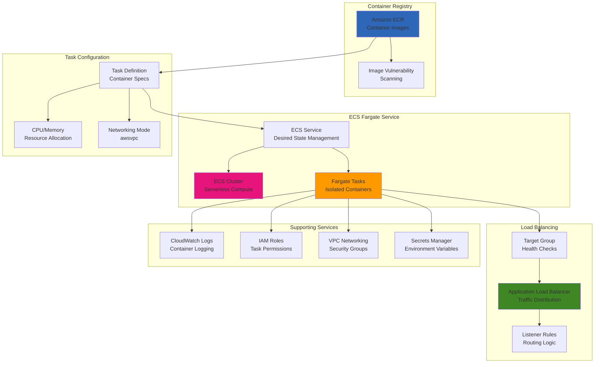

# Deploying Fargate Containers with Application Load Balancer

## Problem

Your organization wants to deploy containerized applications without managing the underlying infrastructure, servers, or clusters. Traditional container deployments require provisioning and managing EC2 instances, handling cluster scaling, patching, and capacity planning. You need a solution that provides the benefits of containerization while eliminating infrastructure management overhead, with automatic scaling, high availability, and seamless integration with AWS services while maintaining cost efficiency and operational simplicity.

## Solution

Implement serverless container deployment using AWS Fargate with Amazon ECS, integrated with Application Load Balancer for traffic distribution and Amazon ECR for container image management. This solution provides fully managed container hosting where you only specify CPU and memory requirements, with automatic scaling, built-in security isolation, and pay-per-use pricing. The architecture includes health checks, service discovery, logging integration, and supports both Linux and Windows containers with multiple deployment strategies for zero-downtime updates.

## Architecture Diagram



## Prerequisites

1. AWS account with permissions for ECS, Fargate, ECR, ALB, and CloudWatch
2. AWS CLI v2 installed and configured with appropriate credentials
3. Docker installed locally for building container images
4. VPC with public subnets across multiple Availability Zones
5. Basic understanding of containerization and load balancing concepts
6. Estimated cost: $30-60/month for moderate workloads (pay-per-use pricing)

> **Note**: Fargate pricing is based on vCPU and memory resources allocated to your containers, with no upfront costs or minimum fees. You pay only for the resources your containers actually use.

## Preparation

```bash
# Set environment variables
export AWS_REGION=$(aws configure get region)
export AWS_ACCOUNT_ID=$(aws sts get-caller-identity \
    --query Account --output text)

# Generate unique identifiers for resources
RANDOM_SUFFIX=$(aws secretsmanager get-random-password \
    --exclude-punctuation --exclude-uppercase \
    --password-length 6 --require-each-included-type \
    --output text --query RandomPassword)

export CLUSTER_NAME="fargate-cluster-${RANDOM_SUFFIX}"
export SERVICE_NAME="fargate-service-${RANDOM_SUFFIX}"
export TASK_FAMILY="fargate-task-${RANDOM_SUFFIX}"
export ECR_REPO_NAME="fargate-demo-${RANDOM_SUFFIX}"
export ALB_NAME="fargate-alb-${RANDOM_SUFFIX}"
export SECURITY_GROUP_NAME="fargate-sg-${RANDOM_SUFFIX}"

# Get default VPC and subnets
export VPC_ID=$(aws ec2 describe-vpcs \
    --filters "Name=is-default,Values=true" \
    --query 'Vpcs[0].VpcId' --output text)

# Get public subnets in different AZs
export SUBNET_IDS=$(aws ec2 describe-subnets \
    --filters "Name=vpc-id,Values=${VPC_ID}" "Name=default-for-az,Values=true" \
    --query 'Subnets[*].SubnetId' --output text | tr '\t' ',')

echo "✅ Environment prepared"
echo "VPC ID: ${VPC_ID}"
echo "Subnet IDs: ${SUBNET_IDS}"
```

## Steps

1. **Create ECR repository for container images**:

   Amazon ECR provides a secure, scalable, and reliable registry for your container images. The repository stores your application images with built-in vulnerability scanning and encryption, enabling secure container deployments across your infrastructure.

   ```bash
   # Create ECR repository
   aws ecr create-repository \
       --repository-name ${ECR_REPO_NAME} \
       --image-scanning-configuration scanOnPush=true \
       --encryption-configuration encryptionType=AES256
   
   # Get repository URI
   ECR_URI=$(aws ecr describe-repositories \
       --repository-names ${ECR_REPO_NAME} \
       --query 'repositories[0].repositoryUri' --output text)
   
   echo "✅ Created ECR repository: ${ECR_REPO_NAME}"
   echo "Repository URI: ${ECR_URI}"
   ```

2. **Create sample containerized application**:

   This step creates a production-ready Node.js application with proper health checks, graceful shutdown handling, and observability endpoints. The application demonstrates containerization best practices including non-root user execution, proper signal handling, and comprehensive logging.

   ```bash
   # Create application directory
   mkdir -p fargate-demo-app
   cd fargate-demo-app
   
   # Create simple Node.js web application
   cat > app.js << 'EOF'
   const express = require('express');
   const os = require('os');
   const app = express();
   const port = process.env.PORT || 3000;
   
   // Health check endpoint
   app.get('/health', (req, res) => {
       res.status(200).json({
           status: 'healthy',
           timestamp: new Date().toISOString(),
           hostname: os.hostname(),
           uptime: process.uptime()
       });
   });
   
   // Main application endpoint
   app.get('/', (req, res) => {
       const response = {
           message: 'Hello from AWS Fargate!',
           container: {
               hostname: os.hostname(),
               platform: os.platform(),
               architecture: os.arch(),
               memory: `${Math.round(process.memoryUsage().rss / 1024 / 1024)} MB`,
               uptime: `${Math.round(process.uptime())} seconds`
           },
           environment: {
               nodeVersion: process.version,
               port: port,
               timestamp: new Date().toISOString()
           },
           request: {
               method: req.method,
               url: req.url,
               headers: req.headers['user-agent'],
               ip: req.ip
           }
       };
       
       res.json(response);
   });
   
   // Metrics endpoint
   app.get('/metrics', (req, res) => {
       const metrics = {
           memory: process.memoryUsage(),
           cpu: process.cpuUsage(),
           uptime: process.uptime(),
           timestamp: Date.now()
       };
       res.json(metrics);
   });
   
   app.listen(port, '0.0.0.0', () => {
       console.log(`Server running on port ${port}`);
       console.log(`Health check available at /health`);
       console.log(`Metrics available at /metrics`);
   });
   
   // Graceful shutdown
   process.on('SIGTERM', () => {
       console.log('SIGTERM received, shutting down gracefully');
       process.exit(0);
   });
   EOF
   
   # Create package.json
   cat > package.json << 'EOF'
   {
       "name": "fargate-demo-app",
       "version": "1.0.0",
       "description": "Demo application for AWS Fargate",
       "main": "app.js",
       "scripts": {
           "start": "node app.js"
       },
       "dependencies": {
           "express": "^4.18.2"
       },
       "engines": {
           "node": ">=18.0"
       }
   }
   EOF
   
   # Create Dockerfile
   cat > Dockerfile << 'EOF'
   FROM node:18-alpine
   
   # Install curl for health checks
   RUN apk add --no-cache curl
   
   # Set working directory
   WORKDIR /app
   
   # Copy package files
   COPY package*.json ./
   
   # Install dependencies
   RUN npm ci --only=production && npm cache clean --force
   
   # Copy application code
   COPY app.js .
   
   # Create non-root user
   RUN addgroup -g 1001 -S nodejs && \
       adduser -S nodejs -u 1001
   
   # Change ownership of app directory
   RUN chown -R nodejs:nodejs /app
   USER nodejs
   
   # Expose port
   EXPOSE 3000
   
   # Health check
   HEALTHCHECK --interval=30s --timeout=3s --start-period=5s --retries=3 \
       CMD curl -f http://localhost:3000/health || exit 1
   
   # Start application
   CMD ["npm", "start"]
   EOF
   
   echo "✅ Created containerized application"
   cd ..
   ```

   > **Note**: The Dockerfile follows container security best practices by using a non-root user, minimal base image, and proper dependency management. Learn more about [Docker security best practices](https://docs.docker.com/develop/security-best-practices/).

3. **Build and push container image to ECR**:

   ECR serves as your private Docker registry with enterprise-grade security features including encryption at rest, vulnerability scanning, and lifecycle policies. Pushing images to ECR enables seamless integration with ECS Fargate, providing secure image distribution and version management across your container infrastructure.

   ```bash
   cd fargate-demo-app
   
   # Get ECR login token
   aws ecr get-login-password --region ${AWS_REGION} | \
       docker login --username AWS --password-stdin ${ECR_URI}
   
   # Build Docker image
   docker build -t ${ECR_REPO_NAME} .
   
   # Tag image for ECR
   docker tag ${ECR_REPO_NAME}:latest ${ECR_URI}:latest
   docker tag ${ECR_REPO_NAME}:latest ${ECR_URI}:v1.0
   
   # Push image to ECR
   docker push ${ECR_URI}:latest
   docker push ${ECR_URI}:v1.0
   
   echo "✅ Built and pushed container image"
   echo "Image URI: ${ECR_URI}:latest"
   
   cd ..
   ```

   The container image is now stored in ECR with vulnerability scanning enabled and encrypted at rest. This secure registry provides the foundation for your Fargate deployments, ensuring only authorized users can access your container images while maintaining version control and compliance.

4. **Create security groups for Fargate tasks and ALB**:

   Security groups act as virtual firewalls controlling traffic to and from your Fargate tasks and load balancer. The ALB security group allows inbound HTTP/HTTPS traffic from the internet, while the Fargate security group only allows traffic from the ALB, implementing defense-in-depth security.

   ```bash
   # Create security group for ALB
   ALB_SG_ID=$(aws ec2 create-security-group \
       --group-name "${ALB_NAME}-sg" \
       --description "Security group for Fargate ALB" \
       --vpc-id ${VPC_ID} \
       --query 'GroupId' --output text)
   
   # Allow HTTP and HTTPS traffic to ALB
   aws ec2 authorize-security-group-ingress \
       --group-id ${ALB_SG_ID} \
       --protocol tcp \
       --port 80 \
       --cidr 0.0.0.0/0
   
   aws ec2 authorize-security-group-ingress \
       --group-id ${ALB_SG_ID} \
       --protocol tcp \
       --port 443 \
       --cidr 0.0.0.0/0
   
   # Create security group for Fargate tasks
   FARGATE_SG_ID=$(aws ec2 create-security-group \
       --group-name ${SECURITY_GROUP_NAME} \
       --description "Security group for Fargate tasks" \
       --vpc-id ${VPC_ID} \
       --query 'GroupId' --output text)
   
   # Allow traffic from ALB to Fargate tasks
   aws ec2 authorize-security-group-ingress \
       --group-id ${FARGATE_SG_ID} \
       --protocol tcp \
       --port 3000 \
       --source-group ${ALB_SG_ID}
   
   # Allow outbound HTTPS traffic for Fargate tasks
   aws ec2 authorize-security-group-egress \
       --group-id ${FARGATE_SG_ID} \
       --protocol tcp \
       --port 443 \
       --cidr 0.0.0.0/0
   
   # Allow outbound HTTP traffic for Fargate tasks
   aws ec2 authorize-security-group-egress \
       --group-id ${FARGATE_SG_ID} \
       --protocol tcp \
       --port 80 \
       --cidr 0.0.0.0/0
   
   echo "✅ Created security groups"
   echo "ALB Security Group: ${ALB_SG_ID}"
   echo "Fargate Security Group: ${FARGATE_SG_ID}"
   ```

5. **Create IAM roles for Fargate tasks**:

   Fargate requires two distinct IAM roles: the task execution role (used by ECS to pull images and write logs) and the task role (used by your application code). This separation follows the principle of least privilege by granting only the minimum permissions necessary for each function.

   ```bash
   # Create task execution role trust policy
   cat > task-execution-role-trust-policy.json << 'EOF'
   {
       "Version": "2012-10-17",
       "Statement": [
           {
               "Effect": "Allow",
               "Principal": {
                   "Service": "ecs-tasks.amazonaws.com"
               },
               "Action": "sts:AssumeRole"
           }
       ]
   }
   EOF
   
   EXECUTION_ROLE_NAME="ecsTaskExecutionRole-${RANDOM_SUFFIX}"
   aws iam create-role \
       --role-name ${EXECUTION_ROLE_NAME} \
       --assume-role-policy-document file://task-execution-role-trust-policy.json
   
   # Attach managed policy for task execution
   aws iam attach-role-policy \
       --role-name ${EXECUTION_ROLE_NAME} \
       --policy-arn arn:aws:iam::aws:policy/service-role/AmazonECSTaskExecutionRolePolicy
   
   # Create task role for application permissions
   TASK_ROLE_NAME="ecsTaskRole-${RANDOM_SUFFIX}"
   aws iam create-role \
       --role-name ${TASK_ROLE_NAME} \
       --assume-role-policy-document file://task-execution-role-trust-policy.json
   
   # Create custom policy for task role
   cat > task-role-policy.json << 'EOF'
   {
       "Version": "2012-10-17",
       "Statement": [
           {
               "Effect": "Allow",
               "Action": [
                   "logs:CreateLogStream",
                   "logs:PutLogEvents",
                   "cloudwatch:PutMetricData"
               ],
               "Resource": "*"
           }
       ]
   }
   EOF
   
   aws iam create-policy \
       --policy-name "${TASK_ROLE_NAME}-Policy" \
       --policy-document file://task-role-policy.json
   
   TASK_POLICY_ARN=$(aws iam list-policies \
       --query "Policies[?PolicyName=='${TASK_ROLE_NAME}-Policy'].Arn" \
       --output text)
   
   aws iam attach-role-policy \
       --role-name ${TASK_ROLE_NAME} \
       --policy-arn ${TASK_POLICY_ARN}
   
   # Get role ARNs
   EXECUTION_ROLE_ARN=$(aws iam get-role \
       --role-name ${EXECUTION_ROLE_NAME} \
       --query 'Role.Arn' --output text)
   
   TASK_ROLE_ARN=$(aws iam get-role \
       --role-name ${TASK_ROLE_NAME} \
       --query 'Role.Arn' --output text)
   
   echo "✅ Created IAM roles"
   echo "Execution Role ARN: ${EXECUTION_ROLE_ARN}"
   echo "Task Role ARN: ${TASK_ROLE_ARN}"
   ```

6. **Create ECS cluster and task definition**:

   The ECS cluster provides the compute environment for your containers, while the task definition acts as a blueprint specifying container configurations, resource requirements, and networking settings. Fargate capacity providers enable cost optimization by using spot instances when appropriate.

   ```bash
   # Create ECS cluster
   aws ecs create-cluster \
       --cluster-name ${CLUSTER_NAME} \
       --capacity-providers FARGATE FARGATE_SPOT \
       --default-capacity-provider-strategy \
           capacityProvider=FARGATE,weight=1,base=1 \
           capacityProvider=FARGATE_SPOT,weight=4
   
   # Create CloudWatch log group
   aws logs create-log-group \
       --log-group-name "/ecs/${TASK_FAMILY}" \
       --retention-in-days 7
   
   # Create task definition
   cat > task-definition.json << EOF
   {
       "family": "${TASK_FAMILY}",
       "networkMode": "awsvpc",
       "requiresCompatibilities": ["FARGATE"],
       "cpu": "256",
       "memory": "512",
       "executionRoleArn": "${EXECUTION_ROLE_ARN}",
       "taskRoleArn": "${TASK_ROLE_ARN}",
       "containerDefinitions": [
           {
               "name": "fargate-demo-container",
               "image": "${ECR_URI}:latest",
               "portMappings": [
                   {
                       "containerPort": 3000,
                       "protocol": "tcp"
                   }
               ],
               "essential": true,
               "logConfiguration": {
                   "logDriver": "awslogs",
                   "options": {
                       "awslogs-group": "/ecs/${TASK_FAMILY}",
                       "awslogs-region": "${AWS_REGION}",
                       "awslogs-stream-prefix": "ecs"
                   }
               },
               "environment": [
                   {
                       "name": "NODE_ENV",
                       "value": "production"
                   },
                   {
                       "name": "PORT",
                       "value": "3000"
                   }
               ],
               "healthCheck": {
                   "command": [
                       "CMD-SHELL",
                       "curl -f http://localhost:3000/health || exit 1"
                   ],
                   "interval": 30,
                   "timeout": 5,
                   "retries": 3,
                   "startPeriod": 60
               }
           }
       ]
   }
   EOF
   
   # Register task definition
   aws ecs register-task-definition \
       --cli-input-json file://task-definition.json
   
   echo "✅ Created ECS cluster and task definition"
   echo "Cluster: ${CLUSTER_NAME}"
   echo "Task Definition: ${TASK_FAMILY}"
   ```

   > **Warning**: Choose appropriate CPU and memory values for your workload. Fargate offers specific combinations of CPU and memory. For example, 256 CPU units support memory from 512MB to 2GB. Oversizing resources increases costs unnecessarily.

7. **Create Application Load Balancer and target group**:

   The Application Load Balancer provides Layer 7 load balancing with advanced routing capabilities, health checks, and SSL termination. The target group configuration uses IP targeting for Fargate tasks, enabling dynamic service discovery and health monitoring at the container level for optimal traffic distribution.

   ```bash
   # Create Application Load Balancer
   ALB_ARN=$(aws elbv2 create-load-balancer \
       --name ${ALB_NAME} \
       --subnets $(echo ${SUBNET_IDS} | tr ',' ' ') \
       --security-groups ${ALB_SG_ID} \
       --scheme internet-facing \
       --type application \
       --ip-address-type ipv4 \
       --query 'LoadBalancers[0].LoadBalancerArn' --output text)
   
   # Get ALB DNS name
   ALB_DNS=$(aws elbv2 describe-load-balancers \
       --load-balancer-arns ${ALB_ARN} \
       --query 'LoadBalancers[0].DNSName' --output text)
   
   # Create target group for Fargate service
   TARGET_GROUP_ARN=$(aws elbv2 create-target-group \
       --name "fargate-tg-${RANDOM_SUFFIX}" \
       --protocol HTTP \
       --port 3000 \
       --vpc-id ${VPC_ID} \
       --target-type ip \
       --health-check-enabled \
       --health-check-path "/health" \
       --health-check-interval-seconds 30 \
       --health-check-timeout-seconds 5 \
       --healthy-threshold-count 2 \
       --unhealthy-threshold-count 3 \
       --matcher HttpCode=200 \
       --query 'TargetGroups[0].TargetGroupArn' --output text)
   
   # Create listener for ALB
   aws elbv2 create-listener \
       --load-balancer-arn ${ALB_ARN} \
       --protocol HTTP \
       --port 80 \
       --default-actions Type=forward,TargetGroupArn=${TARGET_GROUP_ARN}
   
   echo "✅ Created Application Load Balancer"
   echo "ALB DNS: ${ALB_DNS}"
   echo "Target Group ARN: ${TARGET_GROUP_ARN}"
   ```

   The Application Load Balancer is now configured with health checks pointing to your container's `/health` endpoint. This setup ensures traffic is only routed to healthy container instances while providing a single entry point for your Fargate service with automatic failover capabilities.

8. **Create ECS service with Fargate launch type**:

   The ECS service maintains the desired number of tasks and integrates with the load balancer for traffic distribution. The service configuration includes deployment settings for rolling updates, circuit breaker protection, and health check grace periods to ensure reliable deployments.

   ```bash
   # Create ECS service
   cat > service-definition.json << EOF
   {
       "serviceName": "${SERVICE_NAME}",
       "cluster": "${CLUSTER_NAME}",
       "taskDefinition": "${TASK_FAMILY}",
       "desiredCount": 3,
       "launchType": "FARGATE",
       "platformVersion": "LATEST",
       "networkConfiguration": {
           "awsvpcConfiguration": {
               "subnets": [$(echo ${SUBNET_IDS} | sed 's/,/","/g' | sed 's/^/"/' | sed 's/$/"/')],
               "securityGroups": ["${FARGATE_SG_ID}"],
               "assignPublicIp": "ENABLED"
           }
       },
       "loadBalancers": [
           {
               "targetGroupArn": "${TARGET_GROUP_ARN}",
               "containerName": "fargate-demo-container",
               "containerPort": 3000
           }
       ],
       "healthCheckGracePeriodSeconds": 120,
       "deploymentConfiguration": {
           "maximumPercent": 200,
           "minimumHealthyPercent": 50,
           "deploymentCircuitBreaker": {
               "enable": true,
               "rollback": true
           }
       },
       "enableExecuteCommand": true
   }
   EOF
   
   # Create the service
   aws ecs create-service \
       --cli-input-json file://service-definition.json
   
   echo "✅ Created ECS service with Fargate"
   echo "Service: ${SERVICE_NAME}"
   echo "Desired count: 3 tasks"
   ```

9. **Set up auto scaling for the Fargate service**:

   Auto scaling ensures your application automatically responds to changing demand by adding or removing tasks based on CPU and memory utilization. This maintains performance during traffic spikes while minimizing costs during low-usage periods.

   ```bash
   # Register scalable target
   aws application-autoscaling register-scalable-target \
       --service-namespace ecs \
       --resource-id "service/${CLUSTER_NAME}/${SERVICE_NAME}" \
       --scalable-dimension ecs:service:DesiredCount \
       --min-capacity 2 \
       --max-capacity 10
   
   # Create scaling policy for CPU utilization
   CPU_SCALING_POLICY_ARN=$(aws application-autoscaling put-scaling-policy \
       --service-namespace ecs \
       --resource-id "service/${CLUSTER_NAME}/${SERVICE_NAME}" \
       --scalable-dimension ecs:service:DesiredCount \
       --policy-name "${SERVICE_NAME}-cpu-scaling" \
       --policy-type TargetTrackingScaling \
       --target-tracking-scaling-policy-configuration '{
           "TargetValue": 70.0,
           "PredefinedMetricSpecification": {
               "PredefinedMetricType": "ECSServiceAverageCPUUtilization"
           },
           "ScaleOutCooldown": 300,
           "ScaleInCooldown": 300
       }' \
       --query 'PolicyARN' --output text)
   
   # Create scaling policy for memory utilization
   MEMORY_SCALING_POLICY_ARN=$(aws application-autoscaling put-scaling-policy \
       --service-namespace ecs \
       --resource-id "service/${CLUSTER_NAME}/${SERVICE_NAME}" \
       --scalable-dimension ecs:service:DesiredCount \
       --policy-name "${SERVICE_NAME}-memory-scaling" \
       --policy-type TargetTrackingScaling \
       --target-tracking-scaling-policy-configuration '{
           "TargetValue": 80.0,
           "PredefinedMetricSpecification": {
               "PredefinedMetricType": "ECSServiceAverageMemoryUtilization"
           },
           "ScaleOutCooldown": 300,
           "ScaleInCooldown": 300
       }' \
       --query 'PolicyARN' --output text)
   
   echo "✅ Configured auto scaling"
   echo "CPU scaling policy: ${CPU_SCALING_POLICY_ARN}"
   echo "Memory scaling policy: ${MEMORY_SCALING_POLICY_ARN}"
   ```

   > **Tip**: Monitor your scaling events through CloudWatch to fine-tune scaling policies. Consider using custom metrics for more sophisticated scaling decisions based on application-specific metrics like request queue length or response time. Learn more about [ECS auto scaling](https://docs.aws.amazon.com/AmazonECS/latest/developerguide/service-auto-scaling.html).

## Validation & Testing

1. **Verify ECS service and tasks are running**:

   ```bash
   # Check service status
   aws ecs describe-services \
       --cluster ${CLUSTER_NAME} \
       --services ${SERVICE_NAME} \
       --query 'services[0].[serviceName,status,runningCount,pendingCount,desiredCount]'
   
   # List running tasks
   aws ecs list-tasks \
       --cluster ${CLUSTER_NAME} \
       --service-name ${SERVICE_NAME} \
       --query 'taskArns'
   
   # Get task details
   TASK_ARNS=$(aws ecs list-tasks \
       --cluster ${CLUSTER_NAME} \
       --service-name ${SERVICE_NAME} \
       --query 'taskArns' --output text)
   
   if [ ! -z "$TASK_ARNS" ]; then
       aws ecs describe-tasks \
           --cluster ${CLUSTER_NAME} \
           --tasks ${TASK_ARNS} \
           --query 'tasks[*].[taskArn,lastStatus,healthStatus,cpu,memory]' \
           --output table
   fi
   ```

   Expected output: Shows service as ACTIVE with running tasks having HEALTHY status and correct resource allocations.

2. **Test Application Load Balancer and application**:

   ```bash
   # Wait for targets to become healthy
   echo "Waiting for targets to become healthy..."
   sleep 60
   
   # Check target group health
   aws elbv2 describe-target-health \
       --target-group-arn ${TARGET_GROUP_ARN} \
       --query 'TargetHealthDescriptions[*].[Target.Id,TargetHealth.State,TargetHealth.Description]' \
       --output table
   
   # Test application endpoints
   echo "Testing application..."
   echo "Main endpoint:"
   curl -s http://${ALB_DNS}/ | jq '.message, .container.hostname'
   
   echo ""
   echo "Health check endpoint:"
   curl -s http://${ALB_DNS}/health | jq '.status, .hostname'
   
   echo ""
   echo "Metrics endpoint:"
   curl -s http://${ALB_DNS}/metrics | jq '.uptime'
   
   echo ""
   echo "Application URL: http://${ALB_DNS}"
   ```

   Expected output: Target health shows "healthy" state, and all endpoints return valid JSON responses with container information.

3. **Test container scaling and load distribution**:

   ```bash
   # Generate load to test scaling
   echo "Generating load to test auto scaling..."
   for i in {1..20}; do
       curl -s http://${ALB_DNS}/ | jq -r '.container.hostname'
   done | sort | uniq -c
   
   # Monitor service events
   aws ecs describe-services \
       --cluster ${CLUSTER_NAME} \
       --services ${SERVICE_NAME} \
       --query 'services[0].events[0:5].[createdAt,message]' \
       --output table
   ```

   Expected output: Shows requests distributed across multiple container hostnames, demonstrating load balancing functionality.

4. **Verify logging and monitoring**:

   ```bash
   # Check CloudWatch logs
   aws logs describe-log-streams \
       --log-group-name "/ecs/${TASK_FAMILY}" \
       --query 'logStreams[0:3].[logStreamName,creationTime]'
   
   # Get recent log events
   LOG_STREAM=$(aws logs describe-log-streams \
       --log-group-name "/ecs/${TASK_FAMILY}" \
       --order-by LastEventTime \
       --descending \
       --max-items 1 \
       --query 'logStreams[0].logStreamName' --output text)
   
   if [ "$LOG_STREAM" != "None" ]; then
       aws logs get-log-events \
           --log-group-name "/ecs/${TASK_FAMILY}" \
           --log-stream-name "${LOG_STREAM}" \
           --limit 5 \
           --query 'events[*].message'
   fi
   ```

   Expected output: Shows log streams for each task and recent application logs indicating successful startup and health check responses.

## Cleanup

1. **Delete ECS service and cluster**:

   ```bash
   # Update service to zero desired count
   aws ecs update-service \
       --cluster ${CLUSTER_NAME} \
       --service ${SERVICE_NAME} \
       --desired-count 0
   
   # Wait for tasks to stop
   echo "Waiting for tasks to stop..."
   sleep 60
   
   # Delete service
   aws ecs delete-service \
       --cluster ${CLUSTER_NAME} \
       --service ${SERVICE_NAME} \
       --force
   
   # Delete cluster
   aws ecs delete-cluster \
       --cluster ${CLUSTER_NAME}
   
   echo "✅ Deleted ECS service and cluster"
   ```

2. **Delete Application Load Balancer and target group**:

   ```bash
   # Delete listener
   LISTENER_ARN=$(aws elbv2 describe-listeners \
       --load-balancer-arn ${ALB_ARN} \
       --query 'Listeners[0].ListenerArn' --output text)
   
   aws elbv2 delete-listener --listener-arn ${LISTENER_ARN}
   
   # Delete target group
   aws elbv2 delete-target-group --target-group-arn ${TARGET_GROUP_ARN}
   
   # Delete load balancer
   aws elbv2 delete-load-balancer --load-balancer-arn ${ALB_ARN}
   
   echo "✅ Deleted Application Load Balancer"
   ```

3. **Remove auto scaling configuration**:

   ```bash
   # Delete scaling policies
   aws application-autoscaling delete-scaling-policy \
       --service-namespace ecs \
       --resource-id "service/${CLUSTER_NAME}/${SERVICE_NAME}" \
       --scalable-dimension ecs:service:DesiredCount \
       --policy-name "${SERVICE_NAME}-cpu-scaling"
   
   aws application-autoscaling delete-scaling-policy \
       --service-namespace ecs \
       --resource-id "service/${CLUSTER_NAME}/${SERVICE_NAME}" \
       --scalable-dimension ecs:service:DesiredCount \
       --policy-name "${SERVICE_NAME}-memory-scaling"
   
   # Deregister scalable target
   aws application-autoscaling deregister-scalable-target \
       --service-namespace ecs \
       --resource-id "service/${CLUSTER_NAME}/${SERVICE_NAME}" \
       --scalable-dimension ecs:service:DesiredCount
   
   echo "✅ Removed auto scaling configuration"
   ```

4. **Clean up supporting resources**:

   ```bash
   # Delete task definition (deregister)
   aws ecs deregister-task-definition \
       --task-definition ${TASK_FAMILY}:1
   
   # Delete CloudWatch log group
   aws logs delete-log-group \
       --log-group-name "/ecs/${TASK_FAMILY}"
   
   # Delete security groups
   aws ec2 delete-security-group --group-id ${FARGATE_SG_ID}
   aws ec2 delete-security-group --group-id ${ALB_SG_ID}
   
   # Delete IAM roles and policies
   aws iam detach-role-policy \
       --role-name ${EXECUTION_ROLE_NAME} \
       --policy-arn arn:aws:iam::aws:policy/service-role/AmazonECSTaskExecutionRolePolicy
   
   aws iam detach-role-policy \
       --role-name ${TASK_ROLE_NAME} \
       --policy-arn ${TASK_POLICY_ARN}
   
   aws iam delete-policy --policy-arn ${TASK_POLICY_ARN}
   aws iam delete-role --role-name ${EXECUTION_ROLE_NAME}
   aws iam delete-role --role-name ${TASK_ROLE_NAME}
   
   # Delete ECR repository
   aws ecr delete-repository \
       --repository-name ${ECR_REPO_NAME} \
       --force
   
   # Clean up local files
   rm -rf fargate-demo-app/
   rm -f task-execution-role-trust-policy.json task-role-policy.json
   rm -f task-definition.json service-definition.json
   
   echo "✅ Cleaned up all resources"
   ```

## Discussion

AWS Fargate represents a paradigm shift in container deployment, eliminating the complexity of infrastructure management while providing enterprise-grade security and scalability. The serverless container model allows developers to focus entirely on application logic rather than cluster management, patching, or capacity planning. This solution demonstrates how Fargate integrates seamlessly with other AWS services to create a robust, production-ready container platform that follows the [AWS Well-Architected Framework](https://docs.aws.amazon.com/wellarchitected/latest/framework/welcome.html) principles.

The architecture's strength lies in its automatic scaling capabilities and built-in high availability. Fargate tasks run in isolated environments with dedicated CPU, memory, and network resources, providing better security than traditional shared infrastructure. The integration with Application Load Balancer enables sophisticated traffic routing, health checks, and blue-green deployments, while CloudWatch provides comprehensive monitoring and logging without additional configuration. The use of security groups implements defense-in-depth by restricting network access at multiple layers.

Cost optimization comes through Fargate's pay-per-use model where you only pay for the exact CPU and memory resources your containers consume. The ability to mix Fargate and Fargate Spot capacity providers can provide additional savings for fault-tolerant workloads. The automatic scaling ensures you're not paying for idle capacity while maintaining performance during traffic spikes. For production workloads, consider implementing [cost optimization strategies](https://docs.aws.amazon.com/whitepapers/latest/cost-optimization-pillar/welcome.html) such as right-sizing resources and using reserved capacity when predictable.

The solution demonstrates several AWS security best practices including the use of IAM roles with least privilege access, encryption at rest for container images, vulnerability scanning in ECR, and network segmentation through security groups. Container health checks ensure only healthy instances receive traffic, while the circuit breaker pattern prevents cascading failures during deployments.

> **Tip**: Use Fargate Spot for development environments and fault-tolerant production workloads to achieve up to 70% cost savings compared to regular Fargate pricing. Learn more about [Fargate pricing models](https://aws.amazon.com/fargate/pricing/) and [Fargate Spot best practices](https://docs.aws.amazon.com/AmazonECS/latest/developerguide/fargate-capacity-providers.html).

## Challenge

Extend this solution by implementing these enhancements:

1. **Blue-Green Deployments**: Implement automated blue-green deployment strategies using CodeDeploy and multiple target groups for zero-downtime updates with rollback capabilities

2. **Multi-Region Architecture**: Create a global Fargate deployment with cross-region load balancing using Route 53 and CloudFront for improved performance and disaster recovery

3. **Service Mesh Integration**: Add AWS App Mesh to provide advanced traffic management, observability, and security features for microservices communication

4. **CI/CD Pipeline**: Build a complete CI/CD pipeline using CodePipeline, CodeBuild, and CodeDeploy that automatically builds, tests, and deploys container updates with quality gates

5. **Advanced Monitoring**: Implement distributed tracing with AWS X-Ray, custom CloudWatch metrics, and automated alerting for comprehensive application observability and performance insights

## Infrastructure Code

*Infrastructure code will be generated after recipe approval.*