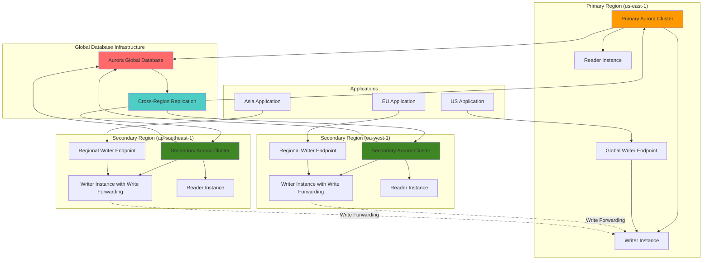

# Deploying Global Database Replication with Aurora Global Database

## Problem

Global enterprises face significant challenges when their applications require low-latency database access across multiple geographic regions while maintaining data consistency. Traditional single-master replication approaches force applications to route write operations to a single region, creating latency bottlenecks for users in distant locations and potential single points of failure. When a multinational e-commerce platform experiences slow database writes for customers in Europe while the primary database resides in North America, sales conversions drop and customer satisfaction suffers due to poor application performance.

## Solution

Aurora Global Database with write forwarding provides a globally distributed database solution that spans multiple AWS Regions with automated replication and the ability to accept write operations from any region. The primary cluster handles all actual write operations while secondary clusters can forward writes through the global database infrastructure, enabling applications to write locally while maintaining strong consistency. This architecture delivers sub-second cross-region replication, automatic failover capabilities, and reduced application complexity by eliminating the need to route writes to specific regions.

## Architecture Diagram



## Prerequisites

1. AWS account with appropriate permissions for Aurora, RDS, and Global Database operations
2. AWS CLI v2 installed and configured (or AWS CloudShell)
3. Understanding of Aurora cluster architecture and database replication concepts
4. Basic knowledge of MySQL/PostgreSQL and database connection management
5. Familiarity with multi-region AWS architectures and networking
6. Estimated cost: $500-800/month for global database setup across 3 regions with db.r5.large instances

> **Warning**: Aurora Global Database incurs cross-region data transfer charges and requires multiple Aurora clusters running simultaneously, resulting in significant monthly costs.

## Preparation

```bash
# Set environment variables for multi-region setup
export PRIMARY_REGION="us-east-1"
export SECONDARY_REGION_1="eu-west-1"
export SECONDARY_REGION_2="ap-southeast-1"
export AWS_ACCOUNT_ID=$(aws sts get-caller-identity \
    --query Account --output text)

# Generate unique identifiers for resources
RANDOM_SUFFIX=$(aws secretsmanager get-random-password \
    --exclude-punctuation --exclude-uppercase \
    --password-length 6 --require-each-included-type \
    --output text --query RandomPassword)

# Set global database identifiers
export GLOBAL_DB_IDENTIFIER="global-ecommerce-db-${RANDOM_SUFFIX}"
export PRIMARY_CLUSTER_ID="primary-cluster-${RANDOM_SUFFIX}"
export SECONDARY_CLUSTER_1_ID="secondary-eu-${RANDOM_SUFFIX}"
export SECONDARY_CLUSTER_2_ID="secondary-asia-${RANDOM_SUFFIX}"

# Database configuration
export DB_ENGINE="aurora-mysql"
export ENGINE_VERSION="8.0.mysql_aurora.3.02.0"
export DB_INSTANCE_CLASS="db.r5.large"
export MASTER_USERNAME="globaladmin"

# Generate secure password
export MASTER_PASSWORD=$(aws secretsmanager get-random-password \
    --exclude-characters '"@/\' --password-length 16 \
    --require-each-included-type --output text \
    --query RandomPassword)

echo "Global Database Configuration:"
echo "Global DB ID: ${GLOBAL_DB_IDENTIFIER}"
echo "Primary Region: ${PRIMARY_REGION}"
echo "Secondary Regions: ${SECONDARY_REGION_1}, ${SECONDARY_REGION_2}"
echo "Master Username: ${MASTER_USERNAME}"
echo "Password stored in: MASTER_PASSWORD variable"
```

## Steps

1. **Create Aurora Global Database**:

   Aurora Global Database provides the foundation for globally distributed database infrastructure by creating a container that spans multiple AWS regions. This global cluster enables Aurora to replicate data across regions with sub-second latency using dedicated storage-level replication, which is significantly faster than traditional database-level replication methods. Understanding this architecture is crucial because it separates the replication mechanism from the database engine, allowing for better performance and consistency guarantees.

   ```bash
   # Create the global database cluster
   aws rds create-global-cluster \
       --global-cluster-identifier ${GLOBAL_DB_IDENTIFIER} \
       --engine ${DB_ENGINE} \
       --engine-version ${ENGINE_VERSION} \
       --region ${PRIMARY_REGION}
   
   # Wait for global database creation
   aws rds wait global-cluster-available \
       --global-cluster-identifier ${GLOBAL_DB_IDENTIFIER} \
       --region ${PRIMARY_REGION}
   
   echo "✅ Global database ${GLOBAL_DB_IDENTIFIER} created successfully"
   ```

   The global database cluster is now established and ready to accept regional Aurora clusters. This foundational step creates the control plane that manages cross-region replication and coordinates write forwarding operations across all participating regions.

2. **Create Primary Aurora Cluster**:

   The primary cluster serves as the authoritative source for all write operations in the global database architecture. Aurora Global Database uses a single-writer, multi-reader model where the primary cluster in one region handles all write operations, ensuring strong consistency and eliminating the complexities of multi-master conflict resolution. This design choice provides better performance and reliability than traditional multi-master approaches.

   ```bash
   # Create primary cluster in us-east-1
   aws rds create-db-cluster \
       --global-cluster-identifier ${GLOBAL_DB_IDENTIFIER} \
       --db-cluster-identifier ${PRIMARY_CLUSTER_ID} \
       --engine ${DB_ENGINE} \
       --engine-version ${ENGINE_VERSION} \
       --master-username ${MASTER_USERNAME} \
       --master-user-password ${MASTER_PASSWORD} \
       --backup-retention-period 7 \
       --preferred-backup-window "07:00-09:00" \
       --preferred-maintenance-window "sun:09:00-sun:11:00" \
       --region ${PRIMARY_REGION}
   
   # Wait for primary cluster creation
   aws rds wait db-cluster-available \
       --db-cluster-identifier ${PRIMARY_CLUSTER_ID} \
       --region ${PRIMARY_REGION}
   
   echo "✅ Primary cluster ${PRIMARY_CLUSTER_ID} created in ${PRIMARY_REGION}"
   ```

   The primary cluster is now operational and serves as the foundation for the global database. All write operations from any region will ultimately be processed by this cluster, ensuring data consistency across the global infrastructure.

3. **Create Primary Cluster Database Instances**:

   Database instances provide the compute resources that execute database operations within the Aurora cluster. Creating both writer and reader instances in the primary region ensures high availability and allows for read scaling within the primary region. The writer instance handles all write operations, while reader instances can serve read queries to reduce load on the writer and improve performance for read-heavy workloads.

   ```bash
   # Create writer instance for primary cluster
   aws rds create-db-instance \
       --db-cluster-identifier ${PRIMARY_CLUSTER_ID} \
       --db-instance-identifier "${PRIMARY_CLUSTER_ID}-writer" \
       --db-instance-class ${DB_INSTANCE_CLASS} \
       --engine ${DB_ENGINE} \
       --engine-version ${ENGINE_VERSION} \
       --region ${PRIMARY_REGION}
   
   # Create reader instance for primary cluster
   aws rds create-db-instance \
       --db-cluster-identifier ${PRIMARY_CLUSTER_ID} \
       --db-instance-identifier "${PRIMARY_CLUSTER_ID}-reader" \
       --db-instance-class ${DB_INSTANCE_CLASS} \
       --engine ${DB_ENGINE} \
       --engine-version ${ENGINE_VERSION} \
       --region ${PRIMARY_REGION}
   
   # Wait for instances to be available
   aws rds wait db-instance-available \
       --db-instance-identifier "${PRIMARY_CLUSTER_ID}-writer" \
       --region ${PRIMARY_REGION}
   
   aws rds wait db-instance-available \
       --db-instance-identifier "${PRIMARY_CLUSTER_ID}-reader" \
       --region ${PRIMARY_REGION}
   
   echo "✅ Primary cluster instances created and available"
   ```

   Both instances are now running and ready to handle database operations. The primary cluster can now accept connections and process transactions while simultaneously replicating data to secondary regions as they come online.

4. **Create First Secondary Cluster in Europe**:

   Secondary clusters extend the global database to additional regions, providing low-latency read access for applications in those regions. The `--enable-global-write-forwarding` flag is crucial as it allows this secondary cluster to accept write operations and forward them to the primary cluster, eliminating the need for applications to route writes to specific regions. This capability significantly simplifies application architecture for global deployments.

   ```bash
   # Create secondary cluster in eu-west-1 with write forwarding
   aws rds create-db-cluster \
       --global-cluster-identifier ${GLOBAL_DB_IDENTIFIER} \
       --db-cluster-identifier ${SECONDARY_CLUSTER_1_ID} \
       --engine ${DB_ENGINE} \
       --engine-version ${ENGINE_VERSION} \
       --enable-global-write-forwarding \
       --region ${SECONDARY_REGION_1}
   
   # Wait for secondary cluster creation
   aws rds wait db-cluster-available \
       --db-cluster-identifier ${SECONDARY_CLUSTER_1_ID} \
       --region ${SECONDARY_REGION_1}
   
   echo "✅ Secondary cluster ${SECONDARY_CLUSTER_1_ID} created in ${SECONDARY_REGION_1}"
   ```

   The European secondary cluster is now part of the global database and ready to receive replicated data from the primary cluster. Write forwarding is enabled, allowing European applications to write locally while maintaining global consistency.

5. **Create Database Instances for European Secondary Cluster**:

   Secondary cluster instances provide the compute resources needed to serve database operations in the European region. The writer instance in a secondary cluster with write forwarding enabled can accept write operations from applications and forward them to the primary cluster, while also serving read operations directly from the local replicated data.

   ```bash
   # Create writer instance for European secondary cluster
   aws rds create-db-instance \
       --db-cluster-identifier ${SECONDARY_CLUSTER_1_ID} \
       --db-instance-identifier "${SECONDARY_CLUSTER_1_ID}-writer" \
       --db-instance-class ${DB_INSTANCE_CLASS} \
       --engine ${DB_ENGINE} \
       --engine-version ${ENGINE_VERSION} \
       --region ${SECONDARY_REGION_1}
   
   # Create reader instance for European secondary cluster
   aws rds create-db-instance \
       --db-cluster-identifier ${SECONDARY_CLUSTER_1_ID} \
       --db-instance-identifier "${SECONDARY_CLUSTER_1_ID}-reader" \
       --db-instance-class ${DB_INSTANCE_CLASS} \
       --engine ${DB_ENGINE} \
       --engine-version ${ENGINE_VERSION} \
       --region ${SECONDARY_REGION_1}
   
   # Wait for instances to be available
   aws rds wait db-instance-available \
       --db-instance-identifier "${SECONDARY_CLUSTER_1_ID}-writer" \
       --region ${SECONDARY_REGION_1}
   
   aws rds wait db-instance-available \
       --db-instance-identifier "${SECONDARY_CLUSTER_1_ID}-reader" \
       --region ${SECONDARY_REGION_1}
   
   echo "✅ European secondary cluster instances created and available"
   ```

   European applications can now connect to these instances for both read and write operations. The infrastructure is optimized for low-latency access from European users while maintaining global data consistency.

6. **Create Second Secondary Cluster in Asia**:

   Adding a third region further enhances the global reach of the database infrastructure, providing low-latency access for Asian markets. This multi-region approach ensures that applications can serve users worldwide with consistent performance characteristics, regardless of their geographic location.

   ```bash
   # Create secondary cluster in ap-southeast-1 with write forwarding
   aws rds create-db-cluster \
       --global-cluster-identifier ${GLOBAL_DB_IDENTIFIER} \
       --db-cluster-identifier ${SECONDARY_CLUSTER_2_ID} \
       --engine ${DB_ENGINE} \
       --engine-version ${ENGINE_VERSION} \
       --enable-global-write-forwarding \
       --region ${SECONDARY_REGION_2}
   
   # Wait for secondary cluster creation
   aws rds wait db-cluster-available \
       --db-cluster-identifier ${SECONDARY_CLUSTER_2_ID} \
       --region ${SECONDARY_REGION_2}
   
   echo "✅ Secondary cluster ${SECONDARY_CLUSTER_2_ID} created in ${SECONDARY_REGION_2}"
   ```

   The Asian secondary cluster extends the global database to a third region, completing the global infrastructure setup and providing comprehensive geographic coverage for worldwide applications.

7. **Create Database Instances for Asian Secondary Cluster**:

   Completing the Asian cluster infrastructure ensures that applications serving Asian markets have the same level of performance and functionality as those in other regions. This consistent global architecture simplifies application deployment and management across all regions.

   ```bash
   # Create writer instance for Asian secondary cluster
   aws rds create-db-instance \
       --db-cluster-identifier ${SECONDARY_CLUSTER_2_ID} \
       --db-instance-identifier "${SECONDARY_CLUSTER_2_ID}-writer" \
       --db-instance-class ${DB_INSTANCE_CLASS} \
       --engine ${DB_ENGINE} \
       --engine-version ${ENGINE_VERSION} \
       --region ${SECONDARY_REGION_2}
   
   # Create reader instance for Asian secondary cluster
   aws rds create-db-instance \
       --db-cluster-identifier ${SECONDARY_CLUSTER_2_ID} \
       --db-instance-identifier "${SECONDARY_CLUSTER_2_ID}-reader" \
       --db-instance-class ${DB_INSTANCE_CLASS} \
       --engine ${DB_ENGINE} \
       --engine-version ${ENGINE_VERSION} \
       --region ${SECONDARY_REGION_2}
   
   # Wait for instances to be available
   aws rds wait db-instance-available \
       --db-instance-identifier "${SECONDARY_CLUSTER_2_ID}-writer" \
       --region ${SECONDARY_REGION_2}
   
   aws rds wait db-instance-available \
       --db-instance-identifier "${SECONDARY_CLUSTER_2_ID}-reader" \
       --region ${SECONDARY_REGION_2}
   
   echo "✅ Asian secondary cluster instances created and available"
   ```

   The global database infrastructure is now complete with three regions providing comprehensive coverage for worldwide applications. All clusters are operational and ready to handle production workloads.

8. **Retrieve Database Endpoints**:

   Database endpoints provide the connection points that applications use to access the Aurora clusters. Understanding the different endpoint types is crucial for application design: cluster endpoints provide high availability by automatically switching to healthy instances, while individual instance endpoints offer more granular control over connection routing.

   ```bash
   # Get primary cluster endpoints
   PRIMARY_WRITER_ENDPOINT=$(aws rds describe-db-clusters \
       --db-cluster-identifier ${PRIMARY_CLUSTER_ID} \
       --query 'DBClusters[0].Endpoint' \
       --output text --region ${PRIMARY_REGION})
   
   PRIMARY_READER_ENDPOINT=$(aws rds describe-db-clusters \
       --db-cluster-identifier ${PRIMARY_CLUSTER_ID} \
       --query 'DBClusters[0].ReaderEndpoint' \
       --output text --region ${PRIMARY_REGION})
   
   # Get secondary cluster endpoints
   SECONDARY_1_WRITER_ENDPOINT=$(aws rds describe-db-clusters \
       --db-cluster-identifier ${SECONDARY_CLUSTER_1_ID} \
       --query 'DBClusters[0].Endpoint' \
       --output text --region ${SECONDARY_REGION_1})
   
   SECONDARY_2_WRITER_ENDPOINT=$(aws rds describe-db-clusters \
       --db-cluster-identifier ${SECONDARY_CLUSTER_2_ID} \
       --query 'DBClusters[0].Endpoint' \
       --output text --region ${SECONDARY_REGION_2})
   
   echo "Database Endpoints:"
   echo "Primary Writer: ${PRIMARY_WRITER_ENDPOINT}"
   echo "Primary Reader: ${PRIMARY_READER_ENDPOINT}"
   echo "EU Writer (with forwarding): ${SECONDARY_1_WRITER_ENDPOINT}"
   echo "Asia Writer (with forwarding): ${SECONDARY_2_WRITER_ENDPOINT}"
   ```

   These endpoints are now available for application configuration. Applications can connect to the appropriate regional endpoint to optimize performance while maintaining global data consistency.

9. **Configure Database Schema and Test Data**:

   Creating a representative database schema and test data enables validation of the global database functionality and provides a foundation for testing cross-region operations. This step simulates real-world application data patterns and helps verify that the global database infrastructure works correctly with actual data.

   ```bash
   # Create sample database and table on primary cluster
   # Note: Replace with actual database connection method
   mysql -h ${PRIMARY_WRITER_ENDPOINT} \
       -u ${MASTER_USERNAME} -p${MASTER_PASSWORD} \
       --execute "
       CREATE DATABASE ecommerce;
       USE ecommerce;
       CREATE TABLE products (
           id INT PRIMARY KEY AUTO_INCREMENT,
           name VARCHAR(255) NOT NULL,
           price DECIMAL(10,2) NOT NULL,
           region VARCHAR(50) NOT NULL,
           created_at TIMESTAMP DEFAULT CURRENT_TIMESTAMP,
           updated_at TIMESTAMP DEFAULT CURRENT_TIMESTAMP ON UPDATE CURRENT_TIMESTAMP
       );
       INSERT INTO products (name, price, region) VALUES
       ('Global Widget', 29.99, 'us-east-1'),
       ('International Gadget', 49.99, 'us-east-1');"
   
   echo "✅ Database schema and test data created"
   ```

   The schema and initial data are now replicated across all regions, providing a consistent foundation for testing and validation. This establishes the baseline for verifying cross-region functionality.

10. **Test Write Forwarding from Secondary Regions**:

    Write forwarding is the key capability that allows applications to write to any region while maintaining consistency. Testing this functionality from secondary regions validates that the global database can accept writes from multiple locations and properly forward them to the primary cluster for processing.

    ```bash
    # Test write forwarding from European cluster
    # Note: In practice, you'll need to configure session parameters
    mysql -h ${SECONDARY_1_WRITER_ENDPOINT} \
        -u ${MASTER_USERNAME} -p${MASTER_PASSWORD} \
        --execute "
        USE ecommerce;
        SET SESSION aurora_replica_read_consistency = 'session';
        INSERT INTO products (name, price, region) 
        VALUES ('European Product', 39.99, 'eu-west-1');"
    
    # Test write forwarding from Asian cluster
    mysql -h ${SECONDARY_2_WRITER_ENDPOINT} \
        -u ${MASTER_USERNAME} -p${MASTER_PASSWORD} \
        --execute "
        USE ecommerce;
        SET SESSION aurora_replica_read_consistency = 'session';
        INSERT INTO products (name, price, region) 
        VALUES ('Asian Product', 59.99, 'ap-southeast-1');"
    
    echo "✅ Write forwarding tests completed"
    ```

    Write forwarding is now verified and working correctly from both secondary regions. Applications can confidently write to any region while maintaining global data consistency.

11. **Configure CloudWatch Monitoring**:

    Monitoring is essential for maintaining global database performance and identifying potential issues before they impact applications. Performance Insights provides detailed database performance metrics, query analysis, and wait event monitoring that helps optimize database performance across all regions.

    ```bash
    # Enable enhanced monitoring for all instances
    for region in ${PRIMARY_REGION} ${SECONDARY_REGION_1} ${SECONDARY_REGION_2}; do
        for cluster in ${PRIMARY_CLUSTER_ID} ${SECONDARY_CLUSTER_1_ID} ${SECONDARY_CLUSTER_2_ID}; do
            # Skip clusters not in current region
            if [[ ${cluster} == *"eu"* && ${region} != ${SECONDARY_REGION_1} ]]; then
                continue
            elif [[ ${cluster} == *"asia"* && ${region} != ${SECONDARY_REGION_2} ]]; then
                continue
            elif [[ ${cluster} == *"primary"* && ${region} != ${PRIMARY_REGION} ]]; then
                continue
            fi
            
            # Enable Performance Insights for writer instances
            aws rds modify-db-instance \
                --db-instance-identifier "${cluster}-writer" \
                --enable-performance-insights \
                --performance-insights-retention-period 7 \
                --region ${region}
        done
    done
    
    echo "✅ CloudWatch monitoring configured for all clusters"
    ```

    Enhanced monitoring is now active across all regions, providing comprehensive visibility into database performance and enabling proactive optimization of the global database infrastructure.

12. **Set Up Global Database Monitoring Dashboard**:

    A centralized monitoring dashboard provides operational visibility into the global database infrastructure, enabling teams to monitor key metrics like replication lag, connection counts, and overall system health from a single location. This operational foundation is crucial for maintaining global database performance and reliability.

    ```bash
    # Create CloudWatch dashboard for global database monitoring
    cat > global-db-dashboard.json << EOF
    {
        "widgets": [
            {
                "type": "metric",
                "properties": {
                    "metrics": [
                        ["AWS/RDS", "DatabaseConnections", "DBClusterIdentifier", "${PRIMARY_CLUSTER_ID}"],
                        ["AWS/RDS", "DatabaseConnections", "DBClusterIdentifier", "${SECONDARY_CLUSTER_1_ID}"],
                        ["AWS/RDS", "DatabaseConnections", "DBClusterIdentifier", "${SECONDARY_CLUSTER_2_ID}"]
                    ],
                    "period": 300,
                    "stat": "Average",
                    "region": "${PRIMARY_REGION}",
                    "title": "Global Database Connections"
                }
            },
            {
                "type": "metric",
                "properties": {
                    "metrics": [
                        ["AWS/RDS", "AuroraGlobalDBReplicationLag", "DBClusterIdentifier", "${SECONDARY_CLUSTER_1_ID}"],
                        ["AWS/RDS", "AuroraGlobalDBReplicationLag", "DBClusterIdentifier", "${SECONDARY_CLUSTER_2_ID}"]
                    ],
                    "period": 300,
                    "stat": "Average",
                    "region": "${PRIMARY_REGION}",
                    "title": "Global Database Replication Lag"
                }
            }
        ]
    }
    EOF
    
    aws cloudwatch put-dashboard \
        --dashboard-name "Aurora-Global-Database-${RANDOM_SUFFIX}" \
        --dashboard-body file://global-db-dashboard.json \
        --region ${PRIMARY_REGION}
    
    echo "✅ Global database monitoring dashboard created"
    ```

    The monitoring dashboard is now available in CloudWatch, providing real-time visibility into global database performance and enabling proactive management of the infrastructure.

## Validation & Testing

1. **Verify Global Database Status**:

   ```bash
   # Check global database cluster status
   aws rds describe-global-clusters \
       --global-cluster-identifier ${GLOBAL_DB_IDENTIFIER} \
       --region ${PRIMARY_REGION}
   ```

   Expected output: Global cluster status should be "available" with all three regional clusters listed.

2. **Test Cross-Region Replication**:

   ```bash
   # Insert test data in primary region
   mysql -h ${PRIMARY_WRITER_ENDPOINT} \
       -u ${MASTER_USERNAME} -p${MASTER_PASSWORD} \
       --execute "
       USE ecommerce;
       INSERT INTO products (name, price, region) 
       VALUES ('Replication Test', 19.99, 'primary-test');"
   
   # Wait for replication
   sleep 5
   
   # Verify data appears in secondary regions
   mysql -h ${SECONDARY_1_WRITER_ENDPOINT} \
       -u ${MASTER_USERNAME} -p${MASTER_PASSWORD} \
       --execute "
       USE ecommerce;
       SELECT * FROM products WHERE name = 'Replication Test';"
   ```

3. **Test Write Forwarding Performance**:

   ```bash
   # Test write forwarding latency from European cluster
   time mysql -h ${SECONDARY_1_WRITER_ENDPOINT} \
       -u ${MASTER_USERNAME} -p${MASTER_PASSWORD} \
       --execute "
       USE ecommerce;
       SET SESSION aurora_replica_read_consistency = 'session';
       INSERT INTO products (name, price, region) 
       VALUES ('Latency Test EU', 25.99, 'eu-latency-test');"
   
   echo "Write forwarding latency test completed"
   ```

4. **Verify Write Forwarding Configuration**:

   ```bash
   # Check write forwarding status for secondary clusters
   aws rds describe-db-clusters \
       --db-cluster-identifier ${SECONDARY_CLUSTER_1_ID} \
       --query 'DBClusters[0].GlobalWriteForwardingStatus' \
       --output text --region ${SECONDARY_REGION_1}
   
   aws rds describe-db-clusters \
       --db-cluster-identifier ${SECONDARY_CLUSTER_2_ID} \
       --query 'DBClusters[0].GlobalWriteForwardingStatus' \
       --output text --region ${SECONDARY_REGION_2}
   ```

   Expected output: Both secondary clusters should show "enabled" for write forwarding status.

5. **Test Multi-Region Application Connectivity**:

   ```bash
   # Test connectivity from each region
   for region in ${PRIMARY_REGION} ${SECONDARY_REGION_1} ${SECONDARY_REGION_2}; do
       echo "Testing connectivity from ${region}..."
       
       # Set appropriate endpoint based on region
       case ${region} in
           ${PRIMARY_REGION})
               ENDPOINT=${PRIMARY_WRITER_ENDPOINT}
               ;;
           ${SECONDARY_REGION_1})
               ENDPOINT=${SECONDARY_1_WRITER_ENDPOINT}
               ;;
           ${SECONDARY_REGION_2})
               ENDPOINT=${SECONDARY_2_WRITER_ENDPOINT}
               ;;
       esac
       
       mysql -h ${ENDPOINT} \
           -u ${MASTER_USERNAME} -p${MASTER_PASSWORD} \
           --execute "SELECT 'Connected from ${region}' as status;"
   done
   ```

## Cleanup

1. **Remove Database Instances**:

   ```bash
   # Delete instances in Asian secondary cluster
   aws rds delete-db-instance \
       --db-instance-identifier "${SECONDARY_CLUSTER_2_ID}-writer" \
       --skip-final-snapshot \
       --region ${SECONDARY_REGION_2}
   
   aws rds delete-db-instance \
       --db-instance-identifier "${SECONDARY_CLUSTER_2_ID}-reader" \
       --skip-final-snapshot \
       --region ${SECONDARY_REGION_2}
   
   # Delete instances in European secondary cluster
   aws rds delete-db-instance \
       --db-instance-identifier "${SECONDARY_CLUSTER_1_ID}-writer" \
       --skip-final-snapshot \
       --region ${SECONDARY_REGION_1}
   
   aws rds delete-db-instance \
       --db-instance-identifier "${SECONDARY_CLUSTER_1_ID}-reader" \
       --skip-final-snapshot \
       --region ${SECONDARY_REGION_1}
   
   # Delete instances in primary cluster
   aws rds delete-db-instance \
       --db-instance-identifier "${PRIMARY_CLUSTER_ID}-writer" \
       --skip-final-snapshot \
       --region ${PRIMARY_REGION}
   
   aws rds delete-db-instance \
       --db-instance-identifier "${PRIMARY_CLUSTER_ID}-reader" \
       --skip-final-snapshot \
       --region ${PRIMARY_REGION}
   
   echo "✅ Database instances deletion initiated"
   ```

2. **Remove Aurora Clusters**:

   ```bash
   # Wait for instances to be deleted before removing clusters
   sleep 300
   
   # Delete secondary clusters
   aws rds delete-db-cluster \
       --db-cluster-identifier ${SECONDARY_CLUSTER_2_ID} \
       --skip-final-snapshot \
       --region ${SECONDARY_REGION_2}
   
   aws rds delete-db-cluster \
       --db-cluster-identifier ${SECONDARY_CLUSTER_1_ID} \
       --skip-final-snapshot \
       --region ${SECONDARY_REGION_1}
   
   # Delete primary cluster
   aws rds delete-db-cluster \
       --db-cluster-identifier ${PRIMARY_CLUSTER_ID} \
       --skip-final-snapshot \
       --region ${PRIMARY_REGION}
   
   echo "✅ Aurora clusters deletion initiated"
   ```

3. **Remove Global Database**:

   ```bash
   # Wait for clusters to be deleted
   sleep 600
   
   # Delete global database cluster
   aws rds delete-global-cluster \
       --global-cluster-identifier ${GLOBAL_DB_IDENTIFIER} \
       --region ${PRIMARY_REGION}
   
   echo "✅ Global database ${GLOBAL_DB_IDENTIFIER} deleted"
   ```

4. **Remove CloudWatch Dashboard**:

   ```bash
   # Delete monitoring dashboard
   aws cloudwatch delete-dashboards \
       --dashboard-names "Aurora-Global-Database-${RANDOM_SUFFIX}" \
       --region ${PRIMARY_REGION}
   
   echo "✅ CloudWatch dashboard deleted"
   ```

5. **Clean Up Environment Variables**:

   ```bash
   # Remove sensitive environment variables
   unset MASTER_PASSWORD
   unset GLOBAL_DB_IDENTIFIER
   unset PRIMARY_CLUSTER_ID
   unset SECONDARY_CLUSTER_1_ID
   unset SECONDARY_CLUSTER_2_ID
   
   # Clean up temporary files
   rm -f global-db-dashboard.json
   
   echo "✅ Environment variables and temporary files cleaned up"
   ```

## Discussion

Aurora Global Database with write forwarding represents a sophisticated approach to global database replication that addresses the complex requirements of modern distributed applications. Unlike traditional multi-master replication systems that can suffer from conflict resolution issues and eventual consistency problems, Aurora Global Database maintains a single-master architecture where all writes are processed by the primary cluster, ensuring strong consistency across all regions while allowing local write operations through the write forwarding mechanism.

The write forwarding feature is particularly valuable for applications that need to provide consistent user experiences across multiple geographic regions without requiring complex application-level routing logic. When a write operation is submitted to a secondary cluster, Aurora automatically forwards the statement to the primary cluster along with all necessary session and transactional context, processes the write operation, and then replicates the changes back to all secondary clusters. This approach eliminates the need for applications to maintain region-specific write routing while providing sub-second replication latency between regions.

From a performance perspective, Aurora Global Database provides significant advantages over traditional cross-region replication approaches. The dedicated replication infrastructure operates at the storage layer rather than the database engine level, which means replication has minimal impact on the performance of the primary cluster. Additionally, applications can leverage local read replicas in each region for read-heavy workloads while using write forwarding for write operations, providing an optimal balance between performance and consistency.

The architecture also provides robust disaster recovery capabilities with both planned switchover and emergency failover mechanisms. In the event of a regional outage, Aurora Global Database can promote a secondary cluster to become the new primary cluster, typically completing the process within minutes and with minimal data loss. This level of resilience is crucial for mission-critical applications that cannot tolerate extended downtime or significant data loss.

> **Tip**: Monitor the AuroraGlobalDBReplicationLag metric closely to ensure replication performance meets your application requirements. High replication lag can indicate network issues or high write volume that may require optimization.

> **Note**: Write forwarding adds network latency to write operations from secondary regions, so consider your application's latency requirements when designing the overall architecture. For applications with strict latency requirements, consider caching strategies or read-heavy workload patterns.

## Challenge

Extend this global database solution by implementing these advanced enhancements:

1. **Implement Application-Level Connection Pooling**: Create a sophisticated connection management system that automatically routes read operations to the nearest regional cluster while using write forwarding for writes, including retry logic and connection failover mechanisms.

2. **Build Automated Failover Orchestration**: Develop a comprehensive failover automation system using AWS Step Functions and Lambda that can detect regional outages, perform health checks, execute controlled switchovers, and update application configurations to point to the new primary region.

3. **Create Cross-Region Performance Monitoring**: Implement a detailed monitoring solution that tracks write forwarding latency, cross-region replication lag, and query performance across all regions, with automated alerting for performance degradation and capacity planning recommendations.

4. **Develop Multi-Region Data Compliance Framework**: Build a data governance system that ensures compliance with regional data residency requirements by implementing data classification, automated data routing based on content sensitivity, and audit trails for cross-border data transfers.

5. **Implement Global Database Capacity Management**: Create an intelligent scaling system that monitors workload patterns across all regions and automatically adjusts instance classes, read replica counts, and connection limits based on regional demand patterns and predicted growth.

## Infrastructure Code

*Infrastructure code will be generated after recipe approval.*