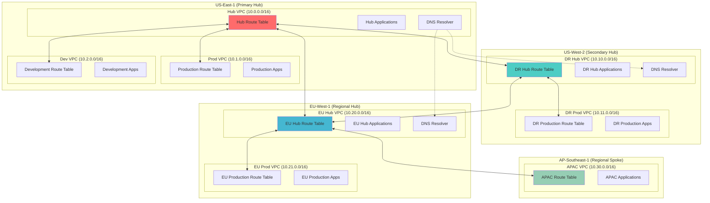

# Designing Advanced VPC Peering with Complex Routing Scenarios

## Problem

Global enterprises need to establish secure, high-performance connectivity between VPCs across multiple AWS regions to support disaster recovery, data replication, and geographically distributed applications. Traditional inter-region connectivity solutions often create complex routing scenarios with overlapping CIDR blocks, asymmetric routing paths, and difficult-to-manage route table configurations. Organizations struggle with implementing hub-and-spoke architectures that span regions while maintaining optimal traffic flow, preventing routing loops, and ensuring consistent network policies across different geographic locations.

## Solution

This solution implements a sophisticated multi-region VPC peering architecture with hub-and-spoke topology, complex routing scenarios, and intelligent traffic steering. The architecture uses strategic CIDR block design, route table prioritization, and Route 53 Resolver for cross-region DNS resolution to create a scalable and manageable global network infrastructure that supports advanced use cases like partial mesh connectivity, transit routing, and failover scenarios.

## Architecture Diagram



## Prerequisites

1. AWS account with appropriate permissions for VPC, Route Tables, and Route 53 operations across multiple regions
2. AWS CLI v2 installed and configured (or AWS CloudShell)
3. Understanding of advanced networking concepts, CIDR block planning, and routing protocols
4. Familiarity with multi-region AWS architectures and cross-region data transfer costs
5. Estimated cost: $400-600/month for VPC peering connections, data transfer, and Route 53 Resolver endpoints

> **Warning**: Cross-region data transfer charges can be substantial. Monitor your usage carefully and implement cost controls to prevent unexpected charges.

## Preparation

```bash
# Set environment variables for multi-region deployment
export PRIMARY_REGION="us-east-1"
export SECONDARY_REGION="us-west-2"
export EU_REGION="eu-west-1"
export APAC_REGION="ap-southeast-1"
export AWS_ACCOUNT_ID=$(aws sts get-caller-identity \
    --query Account --output text)

# Generate unique identifiers for resources
RANDOM_SUFFIX=$(aws secretsmanager get-random-password \
    --exclude-punctuation --exclude-uppercase \
    --password-length 6 --require-each-included-type \
    --output text --query RandomPassword)

# Set resource naming convention
export PROJECT_NAME="global-peering-${RANDOM_SUFFIX}"

# Create VPC in Primary Region (US-East-1) - Hub
aws ec2 create-vpc \
    --region $PRIMARY_REGION \
    --cidr-block 10.0.0.0/16 \
    --tag-specifications "ResourceType=vpc,Tags=[{Key=Name,Value=${PROJECT_NAME}-hub-vpc},{Key=Region,Value=${PRIMARY_REGION}},{Key=Role,Value=hub}]" \
    --query 'Vpc.VpcId' --output text > /tmp/hub-vpc-id

export HUB_VPC_ID=$(cat /tmp/hub-vpc-id)

# Create Production VPC in Primary Region
aws ec2 create-vpc \
    --region $PRIMARY_REGION \
    --cidr-block 10.1.0.0/16 \
    --tag-specifications "ResourceType=vpc,Tags=[{Key=Name,Value=${PROJECT_NAME}-prod-vpc},{Key=Region,Value=${PRIMARY_REGION}},{Key=Role,Value=spoke}]" \
    --query 'Vpc.VpcId' --output text > /tmp/prod-vpc-id

export PROD_VPC_ID=$(cat /tmp/prod-vpc-id)

# Create Development VPC in Primary Region
aws ec2 create-vpc \
    --region $PRIMARY_REGION \
    --cidr-block 10.2.0.0/16 \
    --tag-specifications "ResourceType=vpc,Tags=[{Key=Name,Value=${PROJECT_NAME}-dev-vpc},{Key=Region,Value=${PRIMARY_REGION}},{Key=Role,Value=spoke}]" \
    --query 'Vpc.VpcId' --output text > /tmp/dev-vpc-id

export DEV_VPC_ID=$(cat /tmp/dev-vpc-id)

# Create DR Hub VPC in Secondary Region (US-West-2)
aws ec2 create-vpc \
    --region $SECONDARY_REGION \
    --cidr-block 10.10.0.0/16 \
    --tag-specifications "ResourceType=vpc,Tags=[{Key=Name,Value=${PROJECT_NAME}-dr-hub-vpc},{Key=Region,Value=${SECONDARY_REGION}},{Key=Role,Value=hub}]" \
    --query 'Vpc.VpcId' --output text > /tmp/dr-hub-vpc-id

export DR_HUB_VPC_ID=$(cat /tmp/dr-hub-vpc-id)

# Create DR Production VPC in Secondary Region
aws ec2 create-vpc \
    --region $SECONDARY_REGION \
    --cidr-block 10.11.0.0/16 \
    --tag-specifications "ResourceType=vpc,Tags=[{Key=Name,Value=${PROJECT_NAME}-dr-prod-vpc},{Key=Region,Value=${SECONDARY_REGION}},{Key=Role,Value=spoke}]" \
    --query 'Vpc.VpcId' --output text > /tmp/dr-prod-vpc-id

export DR_PROD_VPC_ID=$(cat /tmp/dr-prod-vpc-id)

# Create EU Hub VPC in EU Region
aws ec2 create-vpc \
    --region $EU_REGION \
    --cidr-block 10.20.0.0/16 \
    --tag-specifications "ResourceType=vpc,Tags=[{Key=Name,Value=${PROJECT_NAME}-eu-hub-vpc},{Key=Region,Value=${EU_REGION}},{Key=Role,Value=hub}]" \
    --query 'Vpc.VpcId' --output text > /tmp/eu-hub-vpc-id

export EU_HUB_VPC_ID=$(cat /tmp/eu-hub-vpc-id)

# Create EU Production VPC
aws ec2 create-vpc \
    --region $EU_REGION \
    --cidr-block 10.21.0.0/16 \
    --tag-specifications "ResourceType=vpc,Tags=[{Key=Name,Value=${PROJECT_NAME}-eu-prod-vpc},{Key=Region,Value=${EU_REGION}},{Key=Role,Value=spoke}]" \
    --query 'Vpc.VpcId' --output text > /tmp/eu-prod-vpc-id

export EU_PROD_VPC_ID=$(cat /tmp/eu-prod-vpc-id)

# Create APAC VPC in APAC Region
aws ec2 create-vpc \
    --region $APAC_REGION \
    --cidr-block 10.30.0.0/16 \
    --tag-specifications "ResourceType=vpc,Tags=[{Key=Name,Value=${PROJECT_NAME}-apac-vpc},{Key=Region,Value=${APAC_REGION}},{Key=Role,Value=spoke}]" \
    --query 'Vpc.VpcId' --output text > /tmp/apac-vpc-id

export APAC_VPC_ID=$(cat /tmp/apac-vpc-id)

echo "✅ Created VPCs across multiple regions for complex peering scenarios"
```

## Steps

1. **Create Subnets in Each VPC for Testing and Applications**:

   Subnets provide isolated network segments within VPCs and enable precise placement of resources across availability zones for high availability and fault tolerance. Creating dedicated subnets in each VPC establishes the foundation for deploying test instances, applications, and network endpoints that will validate our multi-region peering connectivity. This step ensures we have specific network segments to test routing functionality and verify that traffic flows correctly through our complex peering architecture.

   ```bash
   # Create subnets in Hub VPC (US-East-1)
   aws ec2 create-subnet \
       --region $PRIMARY_REGION \
       --vpc-id $HUB_VPC_ID \
       --cidr-block 10.0.1.0/24 \
       --availability-zone ${PRIMARY_REGION}a \
       --tag-specifications "ResourceType=subnet,Tags=[{Key=Name,Value=hub-subnet-a}]" \
       --query 'Subnet.SubnetId' --output text > /tmp/hub-subnet-id
   
   # Create subnets in Production VPC (US-East-1)
   aws ec2 create-subnet \
       --region $PRIMARY_REGION \
       --vpc-id $PROD_VPC_ID \
       --cidr-block 10.1.1.0/24 \
       --availability-zone ${PRIMARY_REGION}a \
       --tag-specifications "ResourceType=subnet,Tags=[{Key=Name,Value=prod-subnet-a}]" \
       --query 'Subnet.SubnetId' --output text > /tmp/prod-subnet-id
   
   # Create subnets in Development VPC (US-East-1)
   aws ec2 create-subnet \
       --region $PRIMARY_REGION \
       --vpc-id $DEV_VPC_ID \
       --cidr-block 10.2.1.0/24 \
       --availability-zone ${PRIMARY_REGION}a \
       --tag-specifications "ResourceType=subnet,Tags=[{Key=Name,Value=dev-subnet-a}]" \
       --query 'Subnet.SubnetId' --output text > /tmp/dev-subnet-id
   
   # Create subnets in DR Hub VPC (US-West-2)
   aws ec2 create-subnet \
       --region $SECONDARY_REGION \
       --vpc-id $DR_HUB_VPC_ID \
       --cidr-block 10.10.1.0/24 \
       --availability-zone ${SECONDARY_REGION}a \
       --tag-specifications "ResourceType=subnet,Tags=[{Key=Name,Value=dr-hub-subnet-a}]" \
       --query 'Subnet.SubnetId' --output text > /tmp/dr-hub-subnet-id
   
   # Create subnets in DR Production VPC (US-West-2)
   aws ec2 create-subnet \
       --region $SECONDARY_REGION \
       --vpc-id $DR_PROD_VPC_ID \
       --cidr-block 10.11.1.0/24 \
       --availability-zone ${SECONDARY_REGION}a \
       --tag-specifications "ResourceType=subnet,Tags=[{Key=Name,Value=dr-prod-subnet-a}]" \
       --query 'Subnet.SubnetId' --output text > /tmp/dr-prod-subnet-id
   
   # Create subnets in EU Hub VPC
   aws ec2 create-subnet \
       --region $EU_REGION \
       --vpc-id $EU_HUB_VPC_ID \
       --cidr-block 10.20.1.0/24 \
       --availability-zone ${EU_REGION}a \
       --tag-specifications "ResourceType=subnet,Tags=[{Key=Name,Value=eu-hub-subnet-a}]" \
       --query 'Subnet.SubnetId' --output text > /tmp/eu-hub-subnet-id
   
   # Create subnets in EU Production VPC
   aws ec2 create-subnet \
       --region $EU_REGION \
       --vpc-id $EU_PROD_VPC_ID \
       --cidr-block 10.21.1.0/24 \
       --availability-zone ${EU_REGION}a \
       --tag-specifications "ResourceType=subnet,Tags=[{Key=Name,Value=eu-prod-subnet-a}]" \
       --query 'Subnet.SubnetId' --output text > /tmp/eu-prod-subnet-id
   
   # Create subnets in APAC VPC
   aws ec2 create-subnet \
       --region $APAC_REGION \
       --vpc-id $APAC_VPC_ID \
       --cidr-block 10.30.1.0/24 \
       --availability-zone ${APAC_REGION}a \
       --tag-specifications "ResourceType=subnet,Tags=[{Key=Name,Value=apac-subnet-a}]" \
       --query 'Subnet.SubnetId' --output text > /tmp/apac-subnet-id
   
   # Store subnet IDs
   export HUB_SUBNET_ID=$(cat /tmp/hub-subnet-id)
   export PROD_SUBNET_ID=$(cat /tmp/prod-subnet-id)
   export DEV_SUBNET_ID=$(cat /tmp/dev-subnet-id)
   export DR_HUB_SUBNET_ID=$(cat /tmp/dr-hub-subnet-id)
   export DR_PROD_SUBNET_ID=$(cat /tmp/dr-prod-subnet-id)
   export EU_HUB_SUBNET_ID=$(cat /tmp/eu-hub-subnet-id)
   export EU_PROD_SUBNET_ID=$(cat /tmp/eu-prod-subnet-id)
   export APAC_SUBNET_ID=$(cat /tmp/apac-subnet-id)
   
   echo "✅ Created subnets in all regions for testing and applications"
   ```

   These subnets are now available for deploying test instances and applications across all regions. Each subnet provides an isolated network segment within its respective VPC, enabling you to validate connectivity patterns and test complex routing scenarios. The subnet infrastructure supports future deployment of monitoring tools, test applications, and validation scripts that will verify the effectiveness of our multi-region peering architecture.

2. **Establish Inter-Region Hub-to-Hub Peering Connections**:

   VPC peering enables secure, private connectivity between VPCs across AWS regions without traversing the public internet, providing low-latency, high-bandwidth communication essential for enterprise applications. Inter-region hub-to-hub peering forms the backbone of our global network architecture, enabling each regional hub to act as an aggregation point for local spoke VPCs while maintaining connectivity to other regional hubs. This design pattern supports disaster recovery scenarios, global data replication, and geographic load distribution while minimizing the total number of peering connections required.

   > **Tip**: Inter-region VPC peering connections automatically encrypt traffic in transit and provide consistent network performance. Monitor CloudWatch metrics for peering connections to optimize routing decisions and identify potential bottlenecks.

   ```bash
   # Create peering connection: US-East-1 Hub to US-West-2 DR Hub
   aws ec2 create-vpc-peering-connection \
       --region $PRIMARY_REGION \
       --vpc-id $HUB_VPC_ID \
       --peer-vpc-id $DR_HUB_VPC_ID \
       --peer-region $SECONDARY_REGION \
       --tag-specifications "ResourceType=vpc-peering-connection,Tags=[{Key=Name,Value=hub-to-dr-hub-peering}]" \
       --query 'VpcPeeringConnection.VpcPeeringConnectionId' --output text > /tmp/hub-dr-peering-id
   
   export HUB_DR_PEERING_ID=$(cat /tmp/hub-dr-peering-id)
   
   # Accept the peering connection in the peer region
   aws ec2 accept-vpc-peering-connection \
       --region $SECONDARY_REGION \
       --vpc-peering-connection-id $HUB_DR_PEERING_ID
   
   # Create peering connection: US-East-1 Hub to EU-West-1 Hub
   aws ec2 create-vpc-peering-connection \
       --region $PRIMARY_REGION \
       --vpc-id $HUB_VPC_ID \
       --peer-vpc-id $EU_HUB_VPC_ID \
       --peer-region $EU_REGION \
       --tag-specifications "ResourceType=vpc-peering-connection,Tags=[{Key=Name,Value=hub-to-eu-hub-peering}]" \
       --query 'VpcPeeringConnection.VpcPeeringConnectionId' --output text > /tmp/hub-eu-peering-id
   
   export HUB_EU_PEERING_ID=$(cat /tmp/hub-eu-peering-id)
   
   # Accept the peering connection in EU region
   aws ec2 accept-vpc-peering-connection \
       --region $EU_REGION \
       --vpc-peering-connection-id $HUB_EU_PEERING_ID
   
   # Create peering connection: US-West-2 DR Hub to EU-West-1 Hub
   aws ec2 create-vpc-peering-connection \
       --region $SECONDARY_REGION \
       --vpc-id $DR_HUB_VPC_ID \
       --peer-vpc-id $EU_HUB_VPC_ID \
       --peer-region $EU_REGION \
       --tag-specifications "ResourceType=vpc-peering-connection,Tags=[{Key=Name,Value=dr-hub-to-eu-hub-peering}]" \
       --query 'VpcPeeringConnection.VpcPeeringConnectionId' --output text > /tmp/dr-eu-peering-id
   
   export DR_EU_PEERING_ID=$(cat /tmp/dr-eu-peering-id)
   
   # Accept the peering connection in EU region
   aws ec2 accept-vpc-peering-connection \
       --region $EU_REGION \
       --vpc-peering-connection-id $DR_EU_PEERING_ID
   
   # Wait for all peering connections to become active
   aws ec2 wait vpc-peering-connection-exists \
       --region $PRIMARY_REGION \
       --vpc-peering-connection-ids $HUB_DR_PEERING_ID $HUB_EU_PEERING_ID
   
   aws ec2 wait vpc-peering-connection-exists \
       --region $SECONDARY_REGION \
       --vpc-peering-connection-ids $DR_EU_PEERING_ID
   
   echo "✅ Established inter-region hub-to-hub peering connections"
   ```

   The inter-region hub peering connections are now active and form the global backbone of our network architecture. These connections enable secure, private communication between regional hubs without internet traversal, supporting enterprise requirements for data sovereignty, low latency, and high availability. The hub-to-hub mesh topology provides redundant paths and enables intelligent traffic routing based on regional policies and compliance requirements.

3. **Create Intra-Region Hub-to-Spoke Peering Connections**:

   Hub-and-spoke topology within each region provides centralized connectivity management while maintaining network segmentation between different application environments. This architectural pattern enables shared services deployment in hub VPCs (such as DNS, monitoring, and security tools) while isolating production, development, and other workloads in dedicated spoke VPCs. Intra-region peering connections have lower latency than inter-region connections and incur no data transfer charges, making them ideal for high-throughput communications within regional boundaries.

   ```bash
   # US-East-1: Hub to Production VPC peering
   aws ec2 create-vpc-peering-connection \
       --region $PRIMARY_REGION \
       --vpc-id $HUB_VPC_ID \
       --peer-vpc-id $PROD_VPC_ID \
       --tag-specifications "ResourceType=vpc-peering-connection,Tags=[{Key=Name,Value=hub-to-prod-peering}]" \
       --query 'VpcPeeringConnection.VpcPeeringConnectionId' --output text > /tmp/hub-prod-peering-id
   
   export HUB_PROD_PEERING_ID=$(cat /tmp/hub-prod-peering-id)
   
   aws ec2 accept-vpc-peering-connection \
       --region $PRIMARY_REGION \
       --vpc-peering-connection-id $HUB_PROD_PEERING_ID
   
   # US-East-1: Hub to Development VPC peering
   aws ec2 create-vpc-peering-connection \
       --region $PRIMARY_REGION \
       --vpc-id $HUB_VPC_ID \
       --peer-vpc-id $DEV_VPC_ID \
       --tag-specifications "ResourceType=vpc-peering-connection,Tags=[{Key=Name,Value=hub-to-dev-peering}]" \
       --query 'VpcPeeringConnection.VpcPeeringConnectionId' --output text > /tmp/hub-dev-peering-id
   
   export HUB_DEV_PEERING_ID=$(cat /tmp/hub-dev-peering-id)
   
   aws ec2 accept-vpc-peering-connection \
       --region $PRIMARY_REGION \
       --vpc-peering-connection-id $HUB_DEV_PEERING_ID
   
   # US-West-2: DR Hub to DR Production VPC peering
   aws ec2 create-vpc-peering-connection \
       --region $SECONDARY_REGION \
       --vpc-id $DR_HUB_VPC_ID \
       --peer-vpc-id $DR_PROD_VPC_ID \
       --tag-specifications "ResourceType=vpc-peering-connection,Tags=[{Key=Name,Value=dr-hub-to-dr-prod-peering}]" \
       --query 'VpcPeeringConnection.VpcPeeringConnectionId' --output text > /tmp/dr-hub-prod-peering-id
   
   export DR_HUB_PROD_PEERING_ID=$(cat /tmp/dr-hub-prod-peering-id)
   
   aws ec2 accept-vpc-peering-connection \
       --region $SECONDARY_REGION \
       --vpc-peering-connection-id $DR_HUB_PROD_PEERING_ID
   
   # EU-West-1: EU Hub to EU Production VPC peering
   aws ec2 create-vpc-peering-connection \
       --region $EU_REGION \
       --vpc-id $EU_HUB_VPC_ID \
       --peer-vpc-id $EU_PROD_VPC_ID \
       --tag-specifications "ResourceType=vpc-peering-connection,Tags=[{Key=Name,Value=eu-hub-to-eu-prod-peering}]" \
       --query 'VpcPeeringConnection.VpcPeeringConnectionId' --output text > /tmp/eu-hub-prod-peering-id
   
   export EU_HUB_PROD_PEERING_ID=$(cat /tmp/eu-hub-prod-peering-id)
   
   aws ec2 accept-vpc-peering-connection \
       --region $EU_REGION \
       --vpc-peering-connection-id $EU_HUB_PROD_PEERING_ID
   
   echo "✅ Created intra-region hub-to-spoke peering connections"
   ```

   Regional hub-and-spoke connections are now established, providing centralized connectivity management within each geographic region. This architecture enables efficient resource sharing, centralized security policy enforcement, and simplified network management while maintaining isolation between different application environments. The spoke VPCs can now access shared services deployed in hub VPCs and communicate with other regions through their regional hub.

4. **Establish Cross-Region Spoke-to-Hub Connectivity**:

   Cross-region spoke-to-hub connectivity demonstrates advanced routing scenarios where specific geographic or compliance requirements dictate non-standard traffic flows. The APAC VPC connecting directly to the EU Hub exemplifies scenarios where data sovereignty requirements, regulatory compliance, or business relationships require traffic to flow through specific regional centers rather than the nearest hub. This pattern supports complex enterprise architectures where different business units or regions have specific routing requirements that override standard geographic proximity rules.

   ```bash
   # APAC to EU Hub peering (cross-region spoke to hub)
   aws ec2 create-vpc-peering-connection \
       --region $APAC_REGION \
       --vpc-id $APAC_VPC_ID \
       --peer-vpc-id $EU_HUB_VPC_ID \
       --peer-region $EU_REGION \
       --tag-specifications "ResourceType=vpc-peering-connection,Tags=[{Key=Name,Value=apac-to-eu-hub-peering}]" \
       --query 'VpcPeeringConnection.VpcPeeringConnectionId' --output text > /tmp/apac-eu-peering-id
   
   export APAC_EU_PEERING_ID=$(cat /tmp/apac-eu-peering-id)
   
   # Accept the peering connection in EU region
   aws ec2 accept-vpc-peering-connection \
       --region $EU_REGION \
       --vpc-peering-connection-id $APAC_EU_PEERING_ID
   
   # Wait for peering connection to become active
   aws ec2 wait vpc-peering-connection-exists \
       --region $APAC_REGION \
       --vpc-peering-connection-ids $APAC_EU_PEERING_ID
   
   echo "✅ Established cross-region spoke-to-hub connectivity"
   ```

   The cross-region spoke-to-hub connection enables the APAC region to communicate with global resources through the EU hub, demonstrating flexibility in routing design for compliance and business requirements. This architecture supports scenarios where data processing must occur in specific regions, where business partnerships require traffic through particular geographic centers, or where regulatory requirements mandate specific data flows for audit and compliance purposes.

5. **Configure Complex Route Tables with Transit Routing**:

   Route tables control traffic flow within and between VPCs by defining which destinations are reachable through specific network interfaces, gateways, or peering connections. Retrieving route table identifiers is essential for implementing complex routing policies that enable transit routing scenarios where traffic from one VPC can reach another VPC through an intermediate hub VPC. This capability transforms individual VPC peering connections into a cohesive global network that supports advanced enterprise architectures and traffic flow requirements.

   ```bash
   # Get default route table IDs for each VPC
   export HUB_RT_ID=$(aws ec2 describe-route-tables \
       --region $PRIMARY_REGION \
       --filters "Name=vpc-id,Values=$HUB_VPC_ID" \
       --query 'RouteTables[0].RouteTableId' --output text)
   
   export PROD_RT_ID=$(aws ec2 describe-route-tables \
       --region $PRIMARY_REGION \
       --filters "Name=vpc-id,Values=$PROD_VPC_ID" \
       --query 'RouteTables[0].RouteTableId' --output text)
   
   export DEV_RT_ID=$(aws ec2 describe-route-tables \
       --region $PRIMARY_REGION \
       --filters "Name=vpc-id,Values=$DEV_VPC_ID" \
       --query 'RouteTables[0].RouteTableId' --output text)
   
   export DR_HUB_RT_ID=$(aws ec2 describe-route-tables \
       --region $SECONDARY_REGION \
       --filters "Name=vpc-id,Values=$DR_HUB_VPC_ID" \
       --query 'RouteTables[0].RouteTableId' --output text)
   
   export DR_PROD_RT_ID=$(aws ec2 describe-route-tables \
       --region $SECONDARY_REGION \
       --filters "Name=vpc-id,Values=$DR_PROD_VPC_ID" \
       --query 'RouteTables[0].RouteTableId' --output text)
   
   export EU_HUB_RT_ID=$(aws ec2 describe-route-tables \
       --region $EU_REGION \
       --filters "Name=vpc-id,Values=$EU_HUB_VPC_ID" \
       --query 'RouteTables[0].RouteTableId' --output text)
   
   export EU_PROD_RT_ID=$(aws ec2 describe-route-tables \
       --region $EU_REGION \
       --filters "Name=vpc-id,Values=$EU_PROD_VPC_ID" \
       --query 'RouteTables[0].RouteTableId' --output text)
   
   export APAC_RT_ID=$(aws ec2 describe-route-tables \
       --region $APAC_REGION \
       --filters "Name=vpc-id,Values=$APAC_VPC_ID" \
       --query 'RouteTables[0].RouteTableId' --output text)
   
   echo "✅ Retrieved route table IDs for all VPCs"
   ```

   Route table identifiers are now captured for all VPCs across all regions, enabling the implementation of sophisticated routing policies. These route tables will be configured with specific routes that enable transit routing, where spoke VPCs can reach remote destinations through their regional hubs. This foundation supports the creation of a global network topology that functions as a cohesive enterprise network despite being built on individual VPC peering connections.

6. **Configure Hub Route Tables for Transit Routing**:

   Hub route table configuration implements transit routing capabilities that enable spoke VPCs to communicate with remote networks through their regional hub, eliminating the need for direct peering connections between every VPC pair. The US-East-1 hub serves as the primary transit center for global connectivity, with routes configured to direct traffic to appropriate regional hubs based on destination CIDR blocks. This configuration demonstrates how VPC peering can support complex routing scenarios including traffic aggregation, policy enforcement points, and centralized connectivity management.

   ```bash
   # US-East-1 Hub routes (transit hub for all regions)
   
   # Route to DR Hub (US-West-2)
   aws ec2 create-route \
       --region $PRIMARY_REGION \
       --route-table-id $HUB_RT_ID \
       --destination-cidr-block 10.10.0.0/16 \
       --vpc-peering-connection-id $HUB_DR_PEERING_ID
   
   # Route to DR Production via DR Hub
   aws ec2 create-route \
       --region $PRIMARY_REGION \
       --route-table-id $HUB_RT_ID \
       --destination-cidr-block 10.11.0.0/16 \
       --vpc-peering-connection-id $HUB_DR_PEERING_ID
   
   # Route to EU Hub
   aws ec2 create-route \
       --region $PRIMARY_REGION \
       --route-table-id $HUB_RT_ID \
       --destination-cidr-block 10.20.0.0/16 \
       --vpc-peering-connection-id $HUB_EU_PEERING_ID
   
   # Route to EU Production via EU Hub
   aws ec2 create-route \
       --region $PRIMARY_REGION \
       --route-table-id $HUB_RT_ID \
       --destination-cidr-block 10.21.0.0/16 \
       --vpc-peering-connection-id $HUB_EU_PEERING_ID
   
   # Route to APAC via EU Hub (transit routing)
   aws ec2 create-route \
       --region $PRIMARY_REGION \
       --route-table-id $HUB_RT_ID \
       --destination-cidr-block 10.30.0.0/16 \
       --vpc-peering-connection-id $HUB_EU_PEERING_ID
   
   # Routes to local spokes
   aws ec2 create-route \
       --region $PRIMARY_REGION \
       --route-table-id $HUB_RT_ID \
       --destination-cidr-block 10.1.0.0/16 \
       --vpc-peering-connection-id $HUB_PROD_PEERING_ID
   
   aws ec2 create-route \
       --region $PRIMARY_REGION \
       --route-table-id $HUB_RT_ID \
       --destination-cidr-block 10.2.0.0/16 \
       --vpc-peering-connection-id $HUB_DEV_PEERING_ID
   
   echo "✅ Configured US-East-1 Hub route table for transit routing"
   ```

   The primary hub route table now enables global transit routing, allowing any spoke VPC in the US-East-1 region to reach resources in any other region through the appropriate hub connections. This configuration transforms the hub from a simple connectivity point into an intelligent routing center that can direct traffic based on destination requirements, support traffic engineering policies, and provide centralized control over inter-region communications.

7. **Configure DR Hub Route Tables**:

   Disaster recovery hub configuration ensures business continuity by providing redundant routing paths and enabling failover scenarios when primary regional connectivity is disrupted. The DR hub routes mirror the primary hub's connectivity patterns while establishing independent paths to all other regions, supporting both active-standby and active-active deployment models. This routing configuration enables seamless failover capabilities where applications can redirect traffic through the DR hub when primary connections experience issues or maintenance activities.

   ```bash
   # US-West-2 DR Hub routes
   
   # Route to Primary Hub (US-East-1)
   aws ec2 create-route \
       --region $SECONDARY_REGION \
       --route-table-id $DR_HUB_RT_ID \
       --destination-cidr-block 10.0.0.0/16 \
       --vpc-peering-connection-id $HUB_DR_PEERING_ID
   
   # Route to Primary Production via Primary Hub
   aws ec2 create-route \
       --region $SECONDARY_REGION \
       --route-table-id $DR_HUB_RT_ID \
       --destination-cidr-block 10.1.0.0/16 \
       --vpc-peering-connection-id $HUB_DR_PEERING_ID
   
   # Route to Primary Development via Primary Hub
   aws ec2 create-route \
       --region $SECONDARY_REGION \
       --route-table-id $DR_HUB_RT_ID \
       --destination-cidr-block 10.2.0.0/16 \
       --vpc-peering-connection-id $HUB_DR_PEERING_ID
   
   # Route to EU Hub
   aws ec2 create-route \
       --region $SECONDARY_REGION \
       --route-table-id $DR_HUB_RT_ID \
       --destination-cidr-block 10.20.0.0/16 \
       --vpc-peering-connection-id $DR_EU_PEERING_ID
   
   # Route to EU Production via EU Hub
   aws ec2 create-route \
       --region $SECONDARY_REGION \
       --route-table-id $DR_HUB_RT_ID \
       --destination-cidr-block 10.21.0.0/16 \
       --vpc-peering-connection-id $DR_EU_PEERING_ID
   
   # Route to APAC via EU Hub (transit routing)
   aws ec2 create-route \
       --region $SECONDARY_REGION \
       --route-table-id $DR_HUB_RT_ID \
       --destination-cidr-block 10.30.0.0/16 \
       --vpc-peering-connection-id $DR_EU_PEERING_ID
   
   # Route to local DR Production
   aws ec2 create-route \
       --region $SECONDARY_REGION \
       --route-table-id $DR_HUB_RT_ID \
       --destination-cidr-block 10.11.0.0/16 \
       --vpc-peering-connection-id $DR_HUB_PROD_PEERING_ID
   
   echo "✅ Configured US-West-2 DR Hub route table"
   ```

   The disaster recovery hub routing is now operational, providing redundant connectivity paths that support business continuity requirements. This configuration enables automatic or manual traffic redirection during primary hub failures, regional outages, or planned maintenance activities. The DR hub can function independently to maintain global connectivity, ensuring that critical business operations continue even during significant infrastructure disruptions in the primary region.

8. **Configure EU Hub Route Tables**:

   European hub configuration addresses data sovereignty requirements and compliance regulations that mandate specific routing paths for sensitive data processing and storage. The EU hub routing table includes direct connections to APAC regions, supporting scenarios where European data protection regulations require specific geographic routing for compliance auditing and data residency requirements. This configuration demonstrates how global network architectures can accommodate regional regulatory requirements while maintaining operational efficiency and security standards.

   ```bash
   # EU-West-1 Hub routes
   
   # Route to Primary Hub (US-East-1)
   aws ec2 create-route \
       --region $EU_REGION \
       --route-table-id $EU_HUB_RT_ID \
       --destination-cidr-block 10.0.0.0/16 \
       --vpc-peering-connection-id $HUB_EU_PEERING_ID
   
   # Route to Primary Production via Primary Hub
   aws ec2 create-route \
       --region $EU_REGION \
       --route-table-id $EU_HUB_RT_ID \
       --destination-cidr-block 10.1.0.0/16 \
       --vpc-peering-connection-id $HUB_EU_PEERING_ID
   
   # Route to Primary Development via Primary Hub
   aws ec2 create-route \
       --region $EU_REGION \
       --route-table-id $EU_HUB_RT_ID \
       --destination-cidr-block 10.2.0.0/16 \
       --vpc-peering-connection-id $HUB_EU_PEERING_ID
   
   # Route to DR Hub (US-West-2)
   aws ec2 create-route \
       --region $EU_REGION \
       --route-table-id $EU_HUB_RT_ID \
       --destination-cidr-block 10.10.0.0/16 \
       --vpc-peering-connection-id $DR_EU_PEERING_ID
   
   # Route to DR Production via DR Hub
   aws ec2 create-route \
       --region $EU_REGION \
       --route-table-id $EU_HUB_RT_ID \
       --destination-cidr-block 10.11.0.0/16 \
       --vpc-peering-connection-id $DR_EU_PEERING_ID
   
   # Route to APAC (direct connection)
   aws ec2 create-route \
       --region $EU_REGION \
       --route-table-id $EU_HUB_RT_ID \
       --destination-cidr-block 10.30.0.0/16 \
       --vpc-peering-connection-id $APAC_EU_PEERING_ID
   
   # Route to local EU Production
   aws ec2 create-route \
       --region $EU_REGION \
       --route-table-id $EU_HUB_RT_ID \
       --destination-cidr-block 10.21.0.0/16 \
       --vpc-peering-connection-id $EU_HUB_PROD_PEERING_ID
   
   echo "✅ Configured EU-West-1 Hub route table"
   ```

   The European hub routing configuration supports both regional connectivity requirements and global compliance mandates, enabling GDPR-compliant data flows and supporting cross-border business operations. This routing design provides the EU hub with comprehensive global connectivity while maintaining the flexibility to implement region-specific policies, data sovereignty controls, and compliance-driven traffic steering based on regulatory requirements.

9. **Configure Spoke Route Tables with Intelligent Routing**:

   Spoke VPC route configuration implements intelligent routing policies that direct traffic through regional hubs using broad CIDR routes for simplified management and automatic coverage of new network segments. The use of 10.0.0.0/8 routes for transit traffic ensures that any new VPCs added to the architecture automatically inherit connectivity without requiring individual route table updates. This approach balances routing specificity with operational scalability, enabling the network to grow organically while maintaining consistent connectivity patterns across all regions and environments.

   > **Note**: Broad CIDR routes simplify management but may cause routing conflicts if not carefully planned. Ensure your IP addressing scheme reserves specific ranges for different purposes and document routing decisions for future reference. See [AWS VPC Route Tables Documentation](https://docs.aws.amazon.com/vpc/latest/userguide/VPC_Route_Tables.html) for detailed routing guidelines.

   ```bash
   # Primary Production VPC routes (US-East-1)
   aws ec2 create-route \
       --region $PRIMARY_REGION \
       --route-table-id $PROD_RT_ID \
       --destination-cidr-block 10.0.0.0/16 \
       --vpc-peering-connection-id $HUB_PROD_PEERING_ID
   
   # Route all other networks via hub (transit routing)
   aws ec2 create-route \
       --region $PRIMARY_REGION \
       --route-table-id $PROD_RT_ID \
       --destination-cidr-block 10.10.0.0/8 \
       --vpc-peering-connection-id $HUB_PROD_PEERING_ID
   
   # Primary Development VPC routes (US-East-1)
   aws ec2 create-route \
       --region $PRIMARY_REGION \
       --route-table-id $DEV_RT_ID \
       --destination-cidr-block 10.0.0.0/16 \
       --vpc-peering-connection-id $HUB_DEV_PEERING_ID
   
   # Route all other networks via hub
   aws ec2 create-route \
       --region $PRIMARY_REGION \
       --route-table-id $DEV_RT_ID \
       --destination-cidr-block 10.10.0.0/8 \
       --vpc-peering-connection-id $HUB_DEV_PEERING_ID
   
   # DR Production VPC routes (US-West-2)
   aws ec2 create-route \
       --region $SECONDARY_REGION \
       --route-table-id $DR_PROD_RT_ID \
       --destination-cidr-block 10.10.0.0/16 \
       --vpc-peering-connection-id $DR_HUB_PROD_PEERING_ID
   
   # Route all other networks via DR hub
   aws ec2 create-route \
       --region $SECONDARY_REGION \
       --route-table-id $DR_PROD_RT_ID \
       --destination-cidr-block 10.0.0.0/8 \
       --vpc-peering-connection-id $DR_HUB_PROD_PEERING_ID
   
   # EU Production VPC routes
   aws ec2 create-route \
       --region $EU_REGION \
       --route-table-id $EU_PROD_RT_ID \
       --destination-cidr-block 10.20.0.0/16 \
       --vpc-peering-connection-id $EU_HUB_PROD_PEERING_ID
   
   # Route all other networks via EU hub
   aws ec2 create-route \
       --region $EU_REGION \
       --route-table-id $EU_PROD_RT_ID \
       --destination-cidr-block 10.0.0.0/8 \
       --vpc-peering-connection-id $EU_HUB_PROD_PEERING_ID
   
   # APAC VPC routes (route via EU Hub)
   aws ec2 create-route \
       --region $APAC_REGION \
       --route-table-id $APAC_RT_ID \
       --destination-cidr-block 10.20.0.0/16 \
       --vpc-peering-connection-id $APAC_EU_PEERING_ID
   
   # Route all other networks via EU hub
   aws ec2 create-route \
       --region $APAC_REGION \
       --route-table-id $APAC_RT_ID \
       --destination-cidr-block 10.0.0.0/8 \
       --vpc-peering-connection-id $APAC_EU_PEERING_ID
   
   echo "✅ Configured spoke route tables with intelligent routing"
   ```

   Spoke VPC routing is now configured to provide automatic connectivity to all global network segments through regional hubs, enabling applications to reach any destination without complex routing knowledge. The intelligent routing design ensures that network expansion is seamless, new regions are automatically reachable, and traffic flows follow optimal paths based on the hub-and-spoke topology. This configuration provides the foundation for a self-managing global network that supports business growth and geographic expansion.

10. **Set Up Route 53 Resolver for Cross-Region DNS**:

    Route 53 Resolver enables unified DNS resolution across the global VPC architecture, providing consistent hostname resolution and supporting service discovery patterns that span multiple regions. Cross-region DNS capabilities are essential for implementing global load balancing, disaster recovery scenarios, and distributed application architectures where services need to discover and communicate with resources regardless of their physical location. The resolver configuration includes CloudWatch monitoring to ensure DNS reliability and performance meet enterprise application requirements.

    ```bash
    # Create Route 53 Resolver rules for cross-region DNS resolution
    
    # Create resolver rule for internal domain resolution
    aws route53resolver create-resolver-rule \
        --region $PRIMARY_REGION \
        --creator-request-id "global-peering-$(date +%s)" \
        --name "global-internal-domain" \
        --rule-type FORWARD \
        --domain-name "internal.global.local" \
        --target-ips Ip=10.0.1.100,Port=53 \
        --tags Key=Name,Value=global-internal-resolver \
        --query 'ResolverRule.Id' --output text > /tmp/resolver-rule-id
    
    # Share resolver rule with other regions (if using multiple accounts)
    export RESOLVER_RULE_ID=$(cat /tmp/resolver-rule-id)
    
    # Create VPC associations for the resolver rule in each region
    for vpc_id in $HUB_VPC_ID $PROD_VPC_ID $DEV_VPC_ID; do
        aws route53resolver associate-resolver-rule \
            --region $PRIMARY_REGION \
            --resolver-rule-id $RESOLVER_RULE_ID \
            --vpc-id $vpc_id
    done
    
    # Create CloudWatch monitoring for DNS resolution
    aws cloudwatch put-metric-alarm \
        --region $PRIMARY_REGION \
        --alarm-name "Route53-Resolver-Query-Failures" \
        --alarm-description "High DNS query failures in Route53 Resolver" \
        --metric-name QueryCount \
        --namespace AWS/Route53Resolver \
        --statistic Sum \
        --period 300 \
        --threshold 100 \
        --comparison-operator LessThanThreshold \
        --dimensions Name=ResolverRuleId,Value=$RESOLVER_RULE_ID
    
    echo "✅ Configured Route 53 Resolver for cross-region DNS resolution"
    ```

    Cross-region DNS resolution is now operational, providing unified hostname resolution across the entire global network architecture. This capability enables applications to use consistent DNS names regardless of their deployment region, supports geographic load balancing scenarios, and facilitates disaster recovery operations where services may be relocated across regions. The DNS infrastructure complements the network routing configuration to provide a complete foundation for globally distributed applications.

## Validation & Testing

1. **Verify VPC Peering Connection Status**:

   ```bash
   # Check all peering connections are active
   aws ec2 describe-vpc-peering-connections \
       --region $PRIMARY_REGION \
       --vpc-peering-connection-ids $HUB_DR_PEERING_ID $HUB_EU_PEERING_ID $HUB_PROD_PEERING_ID $HUB_DEV_PEERING_ID \
       --query 'VpcPeeringConnections[*].[VpcPeeringConnectionId,Status.Code]' \
       --output table
   ```

   Expected output: All connections should show `"active"` status

2. **Test Route Table Configuration**:

   ```bash
   # Verify routes in Hub route table
   aws ec2 describe-route-tables \
       --region $PRIMARY_REGION \
       --route-table-ids $HUB_RT_ID \
       --query 'RouteTables[0].Routes[*].[DestinationCidrBlock,VpcPeeringConnectionId,State]' \
       --output table
   ```

   Expected output: Should show routes to all target CIDR blocks with active peering connections

3. **Validate Cross-Region Connectivity**:

   ```bash
   # Check effective routes for cross-region access
   aws ec2 describe-route-tables \
       --region $APAC_REGION \
       --route-table-ids $APAC_RT_ID \
       --query 'RouteTables[0].Routes[*].[DestinationCidrBlock,VpcPeeringConnectionId,State]' \
       --output table
   ```

   Expected output: Should show routes via EU Hub for accessing other regions

4. **Test DNS Resolution Configuration**:

   ```bash
   # Verify Route 53 Resolver rule associations
   aws route53resolver list-resolver-rule-associations \
       --region $PRIMARY_REGION \
       --query 'ResolverRuleAssociations[*].[VpcId,ResolverRuleId,Status]' \
       --output table
   ```

   Expected output: Should show associations for each VPC

5. **Verify Network Reachability (if instances are deployed)**:

   ```bash
   # Check route table entries for a specific destination
   aws ec2 describe-route-tables \
       --region $PRIMARY_REGION \
       --route-table-ids $PROD_RT_ID \
       --query 'RouteTables[0].Routes[?DestinationCidrBlock==`10.30.0.0/16`]' \
       --output table
   ```

   Expected output: Should show route via hub for APAC access

## Cleanup

1. **Remove Route 53 Resolver Configurations**:

   ```bash
   # Disassociate resolver rules from VPCs
   for vpc_id in $HUB_VPC_ID $PROD_VPC_ID $DEV_VPC_ID; do
       ASSOCIATION_ID=$(aws route53resolver list-resolver-rule-associations \
           --region $PRIMARY_REGION \
           --filters Name=VPCId,Values=$vpc_id \
           --query 'ResolverRuleAssociations[0].Id' --output text)
       
       if [ "$ASSOCIATION_ID" != "None" ] && [ "$ASSOCIATION_ID" != "" ]; then
           aws route53resolver disassociate-resolver-rule \
               --region $PRIMARY_REGION \
               --vpc-id $vpc_id \
               --resolver-rule-id $RESOLVER_RULE_ID
       fi
   done
   
   # Delete resolver rule
   aws route53resolver delete-resolver-rule \
       --region $PRIMARY_REGION \
       --resolver-rule-id $RESOLVER_RULE_ID
   
   # Delete CloudWatch alarms
   aws cloudwatch delete-alarms \
       --region $PRIMARY_REGION \
       --alarm-names "Route53-Resolver-Query-Failures"
   
   echo "✅ Removed Route 53 Resolver configurations"
   ```

2. **Delete VPC Peering Connections**:

   ```bash
   # Delete inter-region peering connections
   aws ec2 delete-vpc-peering-connection \
       --region $PRIMARY_REGION \
       --vpc-peering-connection-id $HUB_DR_PEERING_ID
   
   aws ec2 delete-vpc-peering-connection \
       --region $PRIMARY_REGION \
       --vpc-peering-connection-id $HUB_EU_PEERING_ID
   
   aws ec2 delete-vpc-peering-connection \
       --region $SECONDARY_REGION \
       --vpc-peering-connection-id $DR_EU_PEERING_ID
   
   # Delete intra-region peering connections
   aws ec2 delete-vpc-peering-connection \
       --region $PRIMARY_REGION \
       --vpc-peering-connection-id $HUB_PROD_PEERING_ID
   
   aws ec2 delete-vpc-peering-connection \
       --region $PRIMARY_REGION \
       --vpc-peering-connection-id $HUB_DEV_PEERING_ID
   
   aws ec2 delete-vpc-peering-connection \
       --region $SECONDARY_REGION \
       --vpc-peering-connection-id $DR_HUB_PROD_PEERING_ID
   
   aws ec2 delete-vpc-peering-connection \
       --region $EU_REGION \
       --vpc-peering-connection-id $EU_HUB_PROD_PEERING_ID
   
   # Delete cross-region spoke peering
   aws ec2 delete-vpc-peering-connection \
       --region $APAC_REGION \
       --vpc-peering-connection-id $APAC_EU_PEERING_ID
   
   echo "✅ Deleted all VPC peering connections"
   ```

3. **Delete Subnets in All Regions**:

   ```bash
   # Delete subnets in each region
   aws ec2 delete-subnet --region $PRIMARY_REGION --subnet-id $HUB_SUBNET_ID
   aws ec2 delete-subnet --region $PRIMARY_REGION --subnet-id $PROD_SUBNET_ID
   aws ec2 delete-subnet --region $PRIMARY_REGION --subnet-id $DEV_SUBNET_ID
   
   aws ec2 delete-subnet --region $SECONDARY_REGION --subnet-id $DR_HUB_SUBNET_ID
   aws ec2 delete-subnet --region $SECONDARY_REGION --subnet-id $DR_PROD_SUBNET_ID
   
   aws ec2 delete-subnet --region $EU_REGION --subnet-id $EU_HUB_SUBNET_ID
   aws ec2 delete-subnet --region $EU_REGION --subnet-id $EU_PROD_SUBNET_ID
   
   aws ec2 delete-subnet --region $APAC_REGION --subnet-id $APAC_SUBNET_ID
   
   echo "✅ Deleted all subnets"
   ```

4. **Delete VPCs in All Regions**:

   ```bash
   # Delete VPCs in each region
   aws ec2 delete-vpc --region $PRIMARY_REGION --vpc-id $HUB_VPC_ID
   aws ec2 delete-vpc --region $PRIMARY_REGION --vpc-id $PROD_VPC_ID
   aws ec2 delete-vpc --region $PRIMARY_REGION --vpc-id $DEV_VPC_ID
   
   aws ec2 delete-vpc --region $SECONDARY_REGION --vpc-id $DR_HUB_VPC_ID
   aws ec2 delete-vpc --region $SECONDARY_REGION --vpc-id $DR_PROD_VPC_ID
   
   aws ec2 delete-vpc --region $EU_REGION --vpc-id $EU_HUB_VPC_ID
   aws ec2 delete-vpc --region $EU_REGION --vpc-id $EU_PROD_VPC_ID
   
   aws ec2 delete-vpc --region $APAC_REGION --vpc-id $APAC_VPC_ID
   
   echo "✅ Deleted all VPCs"
   ```

5. **Clean Up Temporary Files**:

   ```bash
   # Remove all temporary files
   rm -f /tmp/*-vpc-id /tmp/*-subnet-id /tmp/*-peering-id /tmp/resolver-rule-id
   
   echo "✅ Cleaned up all temporary files and completed cleanup"
   ```

## Discussion

Multi-region VPC peering with complex routing scenarios requires careful planning of CIDR blocks, route table priorities, and traffic flow patterns to avoid routing conflicts and ensure optimal performance. This recipe demonstrates a hub-and-spoke topology that balances complexity with manageability, where regional hubs serve as aggregation points for local spokes while maintaining inter-hub connectivity for global reach. The asymmetric routing design allows for different traffic patterns based on geographic and business requirements, such as routing APAC traffic through the EU hub for compliance reasons.

The implementation of transit routing through VPC peering connections enables spoke VPCs to communicate with resources in other regions without requiring direct peering relationships. This approach significantly reduces the number of peering connections required while maintaining security boundaries and network segmentation. However, organizations must carefully consider the bandwidth and latency implications of transit routing, particularly for high-throughput applications or real-time communication requirements.

Route table management becomes increasingly complex as the number of regions and VPCs grows, requiring standardized naming conventions, documentation, and automated validation processes. The use of broad CIDR routes (like 10.0.0.0/8) for transit routing simplifies configuration but may mask more specific routing issues. Organizations should implement comprehensive monitoring and alerting to detect routing anomalies, asymmetric paths, and performance degradation that could impact application performance.

Cross-region DNS resolution using Route 53 Resolver provides a unified namespace for global applications while maintaining the ability to implement region-specific DNS policies. This capability is essential for supporting multi-region active-active architectures, disaster recovery scenarios, and content delivery optimization. The integration with CloudWatch enables proactive monitoring of DNS query patterns and resolution failures that could indicate network connectivity issues or DNS configuration problems.

## Challenge

Extend this solution by implementing these enhancements:

1. **Implement Dynamic Failover Routing**: Create Lambda functions that automatically update route tables based on health checks and CloudWatch metrics to redirect traffic during regional outages or performance degradation, including automatic DNS record updates.

2. **Build Cost Optimization Automation**: Develop automated cost analysis tools that monitor cross-region data transfer charges and recommend routing optimizations, including the implementation of regional traffic steering based on cost thresholds.

3. **Deploy Advanced Network Monitoring**: Implement comprehensive network monitoring using VPC Flow Logs analysis, custom CloudWatch metrics, and automated anomaly detection to identify routing loops, asymmetric paths, and performance bottlenecks across the global network.

4. **Create Compliance-Aware Routing**: Build automated routing policies that ensure data sovereignty compliance by implementing geography-based routing rules, data residency validation, and automated compliance reporting for multi-national organizations.

5. **Implement Network Security Automation**: Develop automated security group and NACL management that adapts to routing changes, implements micro-segmentation across regions, and provides centralized security policy enforcement for the global network infrastructure.

## Infrastructure Code

*Infrastructure code will be generated after recipe approval.*