# Development Environment Provisioning with WorkSpaces

## Problem

Development teams often struggle with inconsistent development environments, lengthy setup times, and manual provisioning processes that can take hours or days to configure properly. Without standardized developer workstations, teams face compatibility issues, security vulnerabilities from unmanaged personal devices, and significant overhead in maintaining development tool consistency across team members.

## Solution

Build an automated system that provisions standardized WorkSpaces Personal environments with pre-configured development tools, security policies, and team-specific software stacks. Using Lambda for orchestration and Systems Manager for configuration management, this solution automatically creates consistent, secure development environments that can be deployed in minutes rather than hours.

## Architecture Diagram

```mermaid
graph TB
    subgraph "Identity Layer"
        AD[Active Directory]
        USER[Development Team Users]
    end
    
    subgraph "Automation Layer"
        EB[EventBridge]
        LAMBDA[Lambda Function]
        SSM[Systems Manager]
    end
    
    subgraph "Management Layer"
        SM[Secrets Manager]
        IAM[IAM Roles]
        CW[CloudWatch Logs]
    end
    
    subgraph "WorkSpaces Layer"
        WS1[WorkSpace Dev-1]
        WS2[WorkSpace Dev-2]
        WS3[WorkSpace Dev-3]
        WSN[WorkSpace Dev-N]
    end
    
    USER-->AD
    EB-->LAMBDA
    LAMBDA-->AD
    LAMBDA-->SSM
    LAMBDA-->SM
    LAMBDA-->WS1
    LAMBDA-->WS2
    LAMBDA-->WS3
    LAMBDA-->WSN
    SSM-->WS1
    SSM-->WS2
    SSM-->WS3
    SSM-->WSN
    IAM-->LAMBDA
    LAMBDA-->CW
    
    style LAMBDA fill:#FF9900
    style SSM fill:#3F8624
    style WS1 fill:#232F3E
    style WS2 fill:#232F3E
    style WS3 fill:#232F3E
    style WSN fill:#232F3E
```



## Prerequisites

1. AWS account with WorkSpaces, Lambda, Systems Manager, and EventBridge permissions
2. Active Directory setup (Simple AD, Managed Microsoft AD, or AD Connector)
3. VPC with subnets in at least two Availability Zones for WorkSpaces deployment
4. AWS CLI installed and configured (version 2.0 or later)
5. Basic knowledge of Python, JSON, and AWS automation services
6. Estimated cost: $200-400/month for 10 developer WorkSpaces (Standard bundle, auto-stop billing)

> **Note**: WorkSpaces Personal provides persistent virtual desktops ideal for developers who need personalized environments with installed applications and saved configurations. This solution follows AWS Well-Architected Framework principles for operational excellence and cost optimization.

## Preparation

```bash
# Set environment variables
export AWS_REGION=$(aws configure get region)
export AWS_ACCOUNT_ID=$(aws sts get-caller-identity \
    --query Account --output text)

# Generate unique identifiers for resources
RANDOM_SUFFIX=$(aws secretsmanager get-random-password \
    --exclude-punctuation --exclude-uppercase \
    --password-length 6 --require-each-included-type \
    --output text --query RandomPassword)

# Set resource names
export PROJECT_NAME="devenv-automation"
export LAMBDA_FUNCTION_NAME="${PROJECT_NAME}-provisioner-${RANDOM_SUFFIX}"
export IAM_ROLE_NAME="${PROJECT_NAME}-lambda-role-${RANDOM_SUFFIX}"
export SECRET_NAME="${PROJECT_NAME}-ad-credentials-${RANDOM_SUFFIX}"
export SSM_DOCUMENT_NAME="${PROJECT_NAME}-dev-setup-${RANDOM_SUFFIX}"
export EVENTBRIDGE_RULE_NAME="${PROJECT_NAME}-daily-provisioning-${RANDOM_SUFFIX}"

echo "✅ Environment variables configured"
echo "Random suffix: ${RANDOM_SUFFIX}"
echo "Lambda function: ${LAMBDA_FUNCTION_NAME}"
```

## Steps

1. **Create Secrets Manager Secret for AD Credentials**:

   AWS Secrets Manager provides secure storage for sensitive credentials needed by our Lambda function to authenticate with Active Directory. This eliminates hardcoded passwords and enables automatic credential rotation, following AWS security best practices for credential management.

   ```bash
   # Create secret for AD service account password
   aws secretsmanager create-secret \
       --name ${SECRET_NAME} \
       --description "AD service account credentials for WorkSpaces automation" \
       --secret-string '{"username":"workspaces-service","password":"YourSecurePassword123!"}'
   
   # Get the secret ARN for IAM policy
   SECRET_ARN=$(aws secretsmanager describe-secret \
       --secret-id ${SECRET_NAME} \
       --query ARN --output text)
   
   echo "✅ Secret created with ARN: ${SECRET_ARN}"
   ```

   The secret stores both username and password in JSON format, enabling secure retrieval by the Lambda function without exposing credentials in code or environment variables.

2. **Create IAM Role and Trust Policy for Lambda Function**:

   IAM roles provide secure, temporary credentials for the Lambda function to access WorkSpaces, Systems Manager, and Secrets Manager services. This follows the principle of least privilege by granting only the permissions necessary for automated provisioning tasks.

   ```bash
   # Create trust policy for Lambda
   cat > lambda-trust-policy.json << 'EOF'
   {
     "Version": "2012-10-17",
     "Statement": [
       {
         "Effect": "Allow",
         "Principal": {
           "Service": "lambda.amazonaws.com"
         },
         "Action": "sts:AssumeRole"
       }
     ]
   }
   EOF
   
   # Create IAM role
   aws iam create-role \
       --role-name ${IAM_ROLE_NAME} \
       --assume-role-policy-document file://lambda-trust-policy.json \
       --description "Service role for WorkSpaces automation Lambda function"
   
   echo "✅ IAM role created: ${IAM_ROLE_NAME}"
   ```

3. **Create IAM Policy with Required Permissions**:

   The IAM policy grants specific permissions for WorkSpaces lifecycle management, Systems Manager operations, and secure access to stored credentials. This comprehensive policy enables full automation capabilities while maintaining security boundaries.

   ```bash
   # Create IAM policy with WorkSpaces and SSM permissions
   cat > lambda-permissions-policy.json << EOF
   {
     "Version": "2012-10-17",
     "Statement": [
       {
         "Effect": "Allow",
         "Action": [
           "workspaces:CreateWorkspaces",
           "workspaces:TerminateWorkspaces",
           "workspaces:DescribeWorkspaces",
           "workspaces:DescribeWorkspaceDirectories",
           "workspaces:DescribeWorkspaceBundles",
           "workspaces:ModifyWorkspaceProperties"
         ],
         "Resource": "*"
       },
       {
         "Effect": "Allow",
         "Action": [
           "ssm:SendCommand",
           "ssm:GetCommandInvocation",
           "ssm:DescribeInstanceInformation",
           "ssm:GetDocument",
           "ssm:ListDocuments",
           "ssm:DescribeDocumentParameters"
         ],
         "Resource": "*"
       },
       {
         "Effect": "Allow",
         "Action": [
           "secretsmanager:GetSecretValue"
         ],
         "Resource": "${SECRET_ARN}"
       },
       {
         "Effect": "Allow",
         "Action": [
           "logs:CreateLogGroup",
           "logs:CreateLogStream",
           "logs:PutLogEvents"
         ],
         "Resource": "arn:aws:logs:${AWS_REGION}:${AWS_ACCOUNT_ID}:log-group:/aws/lambda/${LAMBDA_FUNCTION_NAME}:*"
       },
       {
         "Effect": "Allow",
         "Action": [
           "ec2:CreateNetworkInterface",
           "ec2:DescribeNetworkInterfaces",
           "ec2:DeleteNetworkInterface",
           "ec2:AttachNetworkInterface",
           "ec2:DetachNetworkInterface"
         ],
         "Resource": "*"
       }
     ]
   }
   EOF
   
   # Create and attach the policy
   aws iam create-policy \
       --policy-name "${PROJECT_NAME}-lambda-policy-${RANDOM_SUFFIX}" \
       --policy-document file://lambda-permissions-policy.json \
       --description "Permissions for WorkSpaces automation Lambda function"
   
   aws iam attach-role-policy \
       --role-name ${IAM_ROLE_NAME} \
       --policy-arn "arn:aws:iam::${AWS_ACCOUNT_ID}:policy/${PROJECT_NAME}-lambda-policy-${RANDOM_SUFFIX}"
   
   echo "✅ IAM policy created and attached"
   ```

4. **Create Systems Manager Document for Development Environment Setup**:

   Systems Manager documents define standardized configuration scripts that ensure consistent development environment setup across all provisioned WorkSpaces. This approach enables declarative infrastructure configuration and repeatable deployment patterns.

   ```bash
   # Create SSM document for development environment configuration
   cat > dev-environment-setup.json << 'EOF'
   {
     "schemaVersion": "2.2",
     "description": "Configure development environment on WorkSpaces",
     "parameters": {
       "developmentTools": {
         "type": "String",
         "description": "Comma-separated list of development tools to install",
         "default": "git,vscode,nodejs,python,docker"
       },
       "teamConfiguration": {
         "type": "String",
         "description": "Team-specific configuration settings",
         "default": "standard"
       }
     },
     "mainSteps": [
       {
         "action": "aws:runPowerShellScript",
         "name": "InstallChocolatey",
         "inputs": {
           "runCommand": [
             "Write-Output 'Installing Chocolatey package manager...'",
             "Set-ExecutionPolicy Bypass -Scope Process -Force",
             "[System.Net.ServicePointManager]::SecurityProtocol = [System.Net.ServicePointManager]::SecurityProtocol -bor 3072",
             "iex ((New-Object System.Net.WebClient).DownloadString('https://community.chocolatey.org/install.ps1'))",
             "Write-Output 'Chocolatey installation completed'"
           ]
         }
       },
       {
         "action": "aws:runPowerShellScript",
         "name": "InstallDevelopmentTools",
         "inputs": {
           "runCommand": [
             "Write-Output 'Installing development tools...'",
             "$tools = '{{ developmentTools }}'.Split(',')",
             "foreach ($tool in $tools) {",
             "  $trimmedTool = $tool.Trim()",
             "  Write-Output \"Installing $trimmedTool...\"",
             "  switch ($trimmedTool) {",
             "    'git' { choco install git -y --no-progress }",
             "    'vscode' { choco install vscode -y --no-progress }",
             "    'nodejs' { choco install nodejs -y --no-progress }",
             "    'python' { choco install python -y --no-progress }",
             "    'docker' { choco install docker-desktop -y --no-progress }",
             "    default { Write-Output \"Unknown tool: $trimmedTool\" }",
             "  }",
             "}",
             "Write-Output 'Development environment setup completed successfully'"
           ]
         }
       },
       {
         "action": "aws:runPowerShellScript",
         "name": "ConfigureEnvironment",
         "inputs": {
           "runCommand": [
             "Write-Output 'Configuring development environment...'",
             "# Set Git global configuration",
             "git config --global init.defaultBranch main",
             "git config --global pull.rebase false",
             "# Create development directories",
             "New-Item -ItemType Directory -Force -Path C:\\Dev\\Projects",
             "New-Item -ItemType Directory -Force -Path C:\\Dev\\Tools",
             "Write-Output 'Environment configuration completed'"
           ]
         }
       }
     ]
   }
   EOF
   
   # Create the SSM document
   aws ssm create-document \
       --name ${SSM_DOCUMENT_NAME} \
       --document-type "Command" \
       --document-format JSON \
       --content file://dev-environment-setup.json \
       --tags Key=Project,Value=${PROJECT_NAME} \
              Key=Purpose,Value=DevEnvironmentAutomation
   
   echo "✅ Systems Manager document created: ${SSM_DOCUMENT_NAME}"
   ```

5. **Create Lambda Function for WorkSpaces Automation**:

   The Lambda function orchestrates the entire provisioning workflow, from Active Directory group membership validation to WorkSpaces creation and configuration. This serverless approach ensures cost-effective automation that scales automatically with demand.

   ```bash
   # Create Lambda deployment package directory
   mkdir -p lambda-package && cd lambda-package
   
   # Create Lambda function code
   cat > lambda_function.py << 'EOF'
   import json
   import boto3
   import logging
   import time
   from botocore.exceptions import ClientError
   from typing import Dict, List, Any
   
   # Configure logging
   logger = logging.getLogger()
   logger.setLevel(logging.INFO)
   
   def lambda_handler(event: Dict[str, Any], context: Any) -> Dict[str, Any]:
       """
       Main Lambda handler for WorkSpaces automation
       
       Args:
           event: Event data containing configuration parameters
           context: Lambda runtime information
           
       Returns:
           Response with status and results
       """
       try:
           # Initialize AWS clients
           workspaces_client = boto3.client('workspaces')
           ssm_client = boto3.client('ssm')
           secrets_client = boto3.client('secretsmanager')
           
           logger.info("Starting WorkSpaces automation process")
           
           # Validate required event parameters
           required_params = ['secret_name', 'directory_id', 'bundle_id']
           for param in required_params:
               if param not in event:
                   raise ValueError(f"Missing required parameter: {param}")
           
           # Get AD credentials from Secrets Manager
           credentials = get_ad_credentials(secrets_client, event['secret_name'])
           
           # Get current WorkSpaces
           current_workspaces = get_current_workspaces(workspaces_client, event['directory_id'])
           logger.info(f"Found {len(current_workspaces)} existing WorkSpaces")
           
           # Get users who should have WorkSpaces (simplified for demo)
           target_users = get_target_users(event)
           logger.info(f"Target users: {target_users}")
           
           # Provision WorkSpaces for new users
           provision_results = provision_workspaces(
               workspaces_client, ssm_client, 
               target_users, current_workspaces, event
           )
           
           # Configure new WorkSpaces
           configuration_results = configure_workspaces(
               ssm_client, provision_results, event
           )
           
           response = {
               'statusCode': 200,
               'body': json.dumps({
                   'message': 'WorkSpaces provisioning completed successfully',
                   'provisioned': provision_results,
                   'configured': configuration_results,
                   'timestamp': time.strftime('%Y-%m-%d %H:%M:%S UTC', time.gmtime())
               })
           }
           
           logger.info("WorkSpaces automation completed successfully")
           return response
           
       except Exception as e:
           logger.error(f"Error in WorkSpaces automation: {str(e)}")
           return {
               'statusCode': 500,
               'body': json.dumps({
                   'error': str(e),
                   'message': 'WorkSpaces automation failed'
               })
           }
   
   def get_ad_credentials(secrets_client: Any, secret_name: str) -> Dict[str, str]:
       """Retrieve AD credentials from Secrets Manager"""
       try:
           response = secrets_client.get_secret_value(SecretId=secret_name)
           return json.loads(response['SecretString'])
       except ClientError as e:
           logger.error(f"Failed to retrieve credentials: {e}")
           raise
   
   def get_current_workspaces(workspaces_client: Any, directory_id: str) -> Dict[str, str]:
       """Get list of current WorkSpaces for the directory"""
       try:
           response = workspaces_client.describe_workspaces(
               DirectoryId=directory_id
           )
           return {
               ws['UserName']: ws['WorkspaceId'] 
               for ws in response['Workspaces']
               if ws['State'] in ['AVAILABLE', 'PENDING', 'STARTING', 'REBUILDING']
           }
       except ClientError as e:
           logger.error(f"Failed to describe WorkSpaces: {e}")
           return {}
   
   def get_target_users(event: Dict[str, Any]) -> List[str]:
       """Get list of users who should have WorkSpaces"""
       # In production, this would query Active Directory
       # For demo purposes, using a static list from event or default
       return event.get('target_users', ['developer1', 'developer2', 'developer3'])
   
   def provision_workspaces(
       workspaces_client: Any, 
       ssm_client: Any,
       target_users: List[str], 
       current_workspaces: Dict[str, str], 
       event: Dict[str, Any]
   ) -> List[Dict[str, str]]:
       """Provision WorkSpaces for users who don't have them"""
       results = []
       
       for user in target_users:
           if user not in current_workspaces:
               try:
                   logger.info(f"Creating WorkSpace for user: {user}")
                   
                   response = workspaces_client.create_workspaces(
                       Workspaces=[{
                           'DirectoryId': event['directory_id'],
                           'UserName': user,
                           'BundleId': event['bundle_id'],
                           'WorkspaceProperties': {
                               'RunningMode': 'AUTO_STOP',
                               'RunningModeAutoStopTimeoutInMinutes': 60,
                               'UserVolumeEncryptionEnabled': True,
                               'RootVolumeEncryptionEnabled': True
                           },
                           'Tags': [
                               {'Key': 'Project', 'Value': 'DevEnvironmentAutomation'},
                               {'Key': 'User', 'Value': user},
                               {'Key': 'Environment', 'Value': 'Development'}
                           ]
                       }]
                   )
                   
                   if response['PendingRequests']:
                       workspace_id = response['PendingRequests'][0]['WorkspaceId']
                       results.append({
                           'user': user,
                           'workspace_id': workspace_id,
                           'status': 'created'
                       })
                       logger.info(f"Successfully created WorkSpace {workspace_id} for {user}")
                   
               except ClientError as e:
                   logger.error(f"Failed to create WorkSpace for {user}: {e}")
                   results.append({
                       'user': user,
                       'status': 'failed',
                       'error': str(e)
                   })
           else:
               logger.info(f"User {user} already has WorkSpace: {current_workspaces[user]}")
       
       return results
   
   def configure_workspaces(
       ssm_client: Any, 
       provision_results: List[Dict[str, str]], 
       event: Dict[str, Any]
   ) -> List[Dict[str, str]]:
       """Configure newly provisioned WorkSpaces"""
       configuration_results = []
       
       # Note: In production, you would wait for WorkSpaces to be available
       # and then send SSM commands to configure them
       
       for result in provision_results:
           if result.get('status') == 'created':
               configuration_results.append({
                   'workspace_id': result['workspace_id'],
                   'user': result['user'],
                   'configuration_status': 'scheduled'
               })
       
       return configuration_results
   EOF
   
   # Create deployment package
   zip -r ../lambda-deployment-package.zip .
   cd ..
   
   echo "✅ Lambda deployment package created"
   ```

6. **Deploy Lambda Function**:

   Deploying the Lambda function establishes the core automation engine that responds to scheduled events or manual triggers. The function uses Python 3.12 runtime for improved performance and includes appropriate timeout settings for WorkSpaces operations.

   ```bash
   # Get IAM role ARN
   ROLE_ARN=$(aws iam get-role --role-name ${IAM_ROLE_NAME} \
       --query Role.Arn --output text)
   
   # Wait for role to be ready
   sleep 10
   
   # Create Lambda function
   aws lambda create-function \
       --function-name ${LAMBDA_FUNCTION_NAME} \
       --runtime python3.12 \
       --role ${ROLE_ARN} \
       --handler lambda_function.lambda_handler \
       --zip-file fileb://lambda-deployment-package.zip \
       --timeout 300 \
       --memory-size 256 \
       --description "Automated WorkSpaces provisioning for development teams" \
       --tags Project=${PROJECT_NAME},Purpose=DevEnvironmentAutomation
   
   echo "✅ Lambda function deployed: ${LAMBDA_FUNCTION_NAME}"
   ```

7. **Create EventBridge Rule for Automation Scheduling**:

   EventBridge enables scheduled automation that regularly checks Active Directory group membership and provisions or decommissions WorkSpaces accordingly. This ensures development environment access remains synchronized with team membership changes.

   ```bash
   # Create EventBridge rule for daily automation
   aws events put-rule \
       --name ${EVENTBRIDGE_RULE_NAME} \
       --schedule-expression "rate(24 hours)" \
       --description "Daily WorkSpaces provisioning automation" \
       --state ENABLED \
       --tags Key=Project,Value=${PROJECT_NAME}
   
   # Get Lambda function ARN
   LAMBDA_ARN=$(aws lambda get-function \
       --function-name ${LAMBDA_FUNCTION_NAME} \
       --query Configuration.FunctionArn --output text)
   
   # Add Lambda permission for EventBridge
   aws lambda add-permission \
       --function-name ${LAMBDA_FUNCTION_NAME} \
       --statement-id "allow-eventbridge-invocation" \
       --action "lambda:InvokeFunction" \
       --principal events.amazonaws.com \
       --source-arn "arn:aws:events:${AWS_REGION}:${AWS_ACCOUNT_ID}:rule/${EVENTBRIDGE_RULE_NAME}"
   
   # Create target for the rule (update with your actual directory and bundle IDs)
   aws events put-targets \
       --rule ${EVENTBRIDGE_RULE_NAME} \
       --targets "Id=1,Arn=${LAMBDA_ARN},Input={\"secret_name\":\"${SECRET_NAME}\",\"directory_id\":\"d-906734e6b2\",\"bundle_id\":\"wsb-b0s22j3d7\",\"target_users\":[\"developer1\",\"developer2\",\"developer3\"],\"ssm_document\":\"${SSM_DOCUMENT_NAME}\"}"
   
   echo "✅ EventBridge rule created and configured"
   ```

8. **Test the Automation System**:

   Testing validates that the automation system correctly provisions WorkSpaces, applies development environment configurations, and integrates properly with directory services. This verification step ensures reliable operation before production deployment.

   ```bash
   # Create test event with sample configuration
   cat > test-event.json << EOF
   {
     "secret_name": "${SECRET_NAME}",
     "directory_id": "d-906734e6b2",
     "bundle_id": "wsb-b0s22j3d7",
     "target_users": ["testuser1", "testuser2"],
     "ssm_document": "${SSM_DOCUMENT_NAME}"
   }
   EOF
   
   # Invoke Lambda function for testing
   aws lambda invoke \
       --function-name ${LAMBDA_FUNCTION_NAME} \
       --payload file://test-event.json \
       --cli-binary-format raw-in-base64-out \
       response.json
   
   # Check the response
   echo "Lambda function response:"
   cat response.json | python3 -m json.tool
   
   echo "✅ Lambda function test completed"
   ```

## Validation & Testing

1. Verify Lambda function creation and configuration:

   ```bash
   # Check Lambda function status and configuration
   aws lambda get-function --function-name ${LAMBDA_FUNCTION_NAME} \
       --query 'Configuration.[FunctionName,State,Runtime,Timeout,MemorySize]' \
       --output table
   ```

   Expected output: Function should show "Active" state with Python 3.12 runtime and 300-second timeout.

2. Test Systems Manager document functionality:

   ```bash
   # Verify SSM document exists and is valid
   aws ssm describe-document \
       --name ${SSM_DOCUMENT_NAME} \
       --query 'Document.[Name,Status,DocumentType,SchemaVersion]' \
       --output table
   ```

3. Validate IAM permissions are correctly configured:

   ```bash
   # Check attached policies for the Lambda role
   aws iam list-attached-role-policies \
       --role-name ${IAM_ROLE_NAME} \
       --output table
   ```

4. Test EventBridge rule configuration:

   ```bash
   # Verify rule is enabled and properly configured
   aws events describe-rule \
       --name ${EVENTBRIDGE_RULE_NAME} \
       --query '[Name,State,ScheduleExpression,Description]' \
       --output table
   ```

5. Verify Secrets Manager secret is accessible:

   ```bash
   # Test secret retrieval (without showing the actual secret)
   aws secretsmanager describe-secret \
       --secret-id ${SECRET_NAME} \
       --query '[Name,ARN,CreatedDate]' \
       --output table
   ```

## Cleanup

1. Remove EventBridge rule and targets:

   ```bash
   # Remove targets from the rule
   aws events remove-targets \
       --rule ${EVENTBRIDGE_RULE_NAME} \
       --ids "1"
   
   # Delete the rule
   aws events delete-rule \
       --name ${EVENTBRIDGE_RULE_NAME}
   
   echo "✅ EventBridge rule removed"
   ```

2. Delete Lambda function:

   ```bash
   # Delete Lambda function
   aws lambda delete-function \
       --function-name ${LAMBDA_FUNCTION_NAME}
   
   echo "✅ Lambda function deleted"
   ```

3. Remove IAM role and policy:

   ```bash
   # Detach policy from role
   aws iam detach-role-policy \
       --role-name ${IAM_ROLE_NAME} \
       --policy-arn "arn:aws:iam::${AWS_ACCOUNT_ID}:policy/${PROJECT_NAME}-lambda-policy-${RANDOM_SUFFIX}"
   
   # Delete policy
   aws iam delete-policy \
       --policy-arn "arn:aws:iam::${AWS_ACCOUNT_ID}:policy/${PROJECT_NAME}-lambda-policy-${RANDOM_SUFFIX}"
   
   # Delete role
   aws iam delete-role --role-name ${IAM_ROLE_NAME}
   
   echo "✅ IAM role and policy removed"
   ```

4. Delete Systems Manager document:

   ```bash
   # Delete SSM document
   aws ssm delete-document \
       --name ${SSM_DOCUMENT_NAME}
   
   echo "✅ Systems Manager document deleted"
   ```

5. Remove Secrets Manager secret:

   ```bash
   # Delete secret (with immediate deletion)
   aws secretsmanager delete-secret \
       --secret-id ${SECRET_NAME} \
       --force-delete-without-recovery
   
   echo "✅ Secret deleted from Secrets Manager"
   ```

6. Clean up local files:

   ```bash
   # Remove temporary files and directories
   rm -rf lambda-package/ lambda-deployment-package.zip
   rm -f lambda-trust-policy.json lambda-permissions-policy.json
   rm -f dev-environment-setup.json test-event.json response.json
   
   echo "✅ Local files cleaned up"
   ```

## Discussion

This automated WorkSpaces provisioning solution demonstrates the power of serverless automation for managing development environments at scale. By combining Lambda's event-driven architecture with Systems Manager's configuration management capabilities, organizations can achieve consistent, secure, and cost-effective development environment provisioning that follows AWS Well-Architected Framework principles.

The solution addresses several critical challenges in development environment management. Traditional manual provisioning processes often lead to configuration drift, security vulnerabilities, and significant time overhead. This automated approach ensures that all development environments are provisioned from approved base images with standardized tool installations and security configurations, reducing the risk of inconsistencies that can impact productivity and security posture.

WorkSpaces Personal provides the ideal foundation for developer workstations because it offers persistent storage, customizable configurations, and the ability to install specialized development tools. Unlike non-persistent solutions, developers can maintain their personalized settings, installed applications, and local development data across sessions, improving productivity and user satisfaction while maintaining centralized security and compliance controls.

The integration with Active Directory enables organizations to leverage existing identity management workflows and security policies. When developers join or leave teams, their WorkSpaces access is automatically managed through standard directory group membership processes, reducing administrative overhead and ensuring appropriate access controls. For more information on WorkSpaces directory integration, see the [AWS WorkSpaces Administration Guide](https://docs.aws.amazon.com/workspaces/latest/adminguide/manage-workspaces-directory.html).

Systems Manager Automation provides powerful configuration management capabilities that ensure consistent development environment setup across all provisioned WorkSpaces. The SSM documents can be versioned, tested, and deployed systematically, enabling infrastructure as code practices for desktop environment management. This approach allows teams to maintain development environment consistency while adapting to changing technology requirements. Additional information on automation best practices can be found in the [AWS Systems Manager User Guide](https://docs.aws.amazon.com/systems-manager/latest/userguide/systems-manager-automation.html).

> **Tip**: Consider implementing cost optimization by using Auto-Stop WorkSpaces that automatically shut down during non-business hours. This configuration, already implemented in the Lambda function, can reduce costs by up to 80% for developers who don't need 24/7 access to their development environments.

## Challenge

Extend this solution by implementing these enhancements:

1. **Multi-Team Environment Support**: Modify the Lambda function to support multiple development teams with different bundle configurations and tool sets. Implement team-specific Active Directory groups and corresponding WorkSpaces bundles for frontend, backend, and data science teams with customized development tool installations.

2. **Advanced Configuration Management**: Integrate with AWS Config to monitor WorkSpaces compliance and automatically remediate configuration drift. Implement custom Config rules that verify development tool versions, security configurations, and compliance with organizational policies.

3. **Cost Optimization Dashboard**: Build a CloudWatch dashboard that tracks WorkSpaces usage patterns and costs per team. Implement automated recommendations for right-sizing bundles based on actual resource utilization data collected through CloudWatch metrics and WorkSpaces connection logs.

4. **Self-Service Portal**: Create a web-based self-service portal using AWS Amplify that allows developers to request specific development environments, track provisioning status, and manage their WorkSpaces lifecycle through a user-friendly interface with approval workflows.

5. **Backup and Disaster Recovery**: Implement automated backup strategies using WorkSpaces Personal backup capabilities and cross-region replication for critical development environments, ensuring business continuity and data protection with automated recovery procedures.

## Infrastructure Code

*Infrastructure code will be generated after recipe approval.*