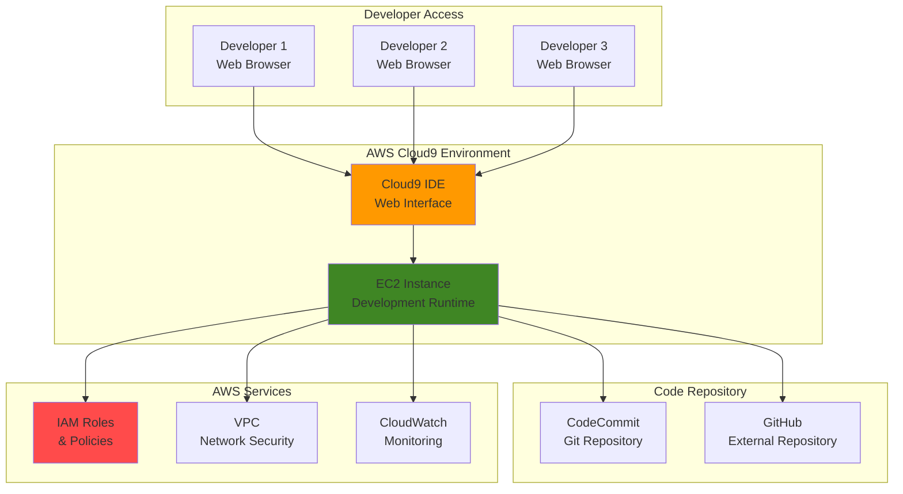

# Developer Environments with Cloud9

## Problem

Development teams struggle with environment consistency when developers work on different local machines with varied configurations, operating systems, and installed tools. This leads to "it works on my machine" issues, lengthy onboarding processes for new team members, and difficulty maintaining consistent development standards across the organization. Traditional local development environments also require significant time investment for setup and maintenance, reducing overall developer productivity.

## Solution

AWS Cloud9 provides a cloud-based integrated development environment (IDE) that runs in a web browser, offering consistent development environments for all team members. By creating standardized Cloud9 environments with pre-configured tools, dependencies, and settings, teams can eliminate environment-related issues and enable instant collaboration through shared development spaces.

## Architecture Diagram



## Prerequisites

1. AWS account with appropriate permissions for Cloud9, EC2, IAM, and VPC
2. AWS CLI v2 installed and configured (or AWS CloudShell)
3. Basic knowledge of web development and Git version control
4. Understanding of AWS IAM roles and policies
5. Estimated cost: $10-50/month depending on instance type and usage

> **Warning**: AWS Cloud9 is no longer available to new customers as of July 25, 2024. Existing customers can continue using the service. This recipe is provided for educational purposes and for teams already using Cloud9.

> **Tip**: For teams seeking similar collaborative development experiences, consider GitHub Codespaces, AWS CodeWhisperer with local IDEs, GitPod, or container-based development environments using Docker and AWS CodeBuild. These alternatives provide similar benefits with modern tooling and continued support.

> **Note**: When configuring Cloud9 environments, consider the trade-offs between instance types and costs. Smaller instances (t3.small) reduce costs but may impact performance for resource-intensive tasks, while larger instances (t3.large or above) provide better performance but increase operational costs. Monitor usage patterns to optimize sizing decisions.

## Preparation

```bash
# Set environment variables
export AWS_REGION=$(aws configure get region)
export AWS_ACCOUNT_ID=$(aws sts get-caller-identity \
    --query Account --output text)

# Generate unique identifiers for resources
RANDOM_SUFFIX=$(aws secretsmanager get-random-password \
    --exclude-punctuation --exclude-uppercase \
    --password-length 6 --require-each-included-type \
    --output text --query RandomPassword 2>/dev/null || \
    echo $(date +%s | tail -c 6))

export CLOUD9_ENV_NAME="dev-environment-${RANDOM_SUFFIX}"
export CLOUD9_DESCRIPTION="Shared development environment for team collaboration"
export INSTANCE_TYPE="t3.medium"
export SUBNET_ID=$(aws ec2 describe-subnets \
    --filters "Name=default-for-az,Values=true" \
    --query 'Subnets[0].SubnetId' --output text)

# Create IAM role for Cloud9 environment
aws iam create-role \
    --role-name Cloud9-${RANDOM_SUFFIX}-Role \
    --assume-role-policy-document '{
        "Version": "2012-10-17",
        "Statement": [
            {
                "Effect": "Allow",
                "Principal": {
                    "Service": "ec2.amazonaws.com"
                },
                "Action": "sts:AssumeRole"
            }
        ]
    }'

# Attach basic policies for development
aws iam attach-role-policy \
    --role-name Cloud9-${RANDOM_SUFFIX}-Role \
    --policy-arn arn:aws:iam::aws:policy/AWSCloud9EnvironmentMember

echo "✅ Environment variables set and IAM role created"
```

## Steps

1. **Create Cloud9 Development Environment**:

   AWS Cloud9 provides a cloud-based integrated development environment that eliminates the need for local development setup while ensuring consistency across team members. This browser-based IDE automatically provisions and manages the underlying EC2 infrastructure, allowing developers to focus on coding rather than environment management. The automatic hibernation feature helps control costs by stopping instances when not in use, following AWS Well-Architected Framework cost optimization principles.

   ```bash
   # Create the Cloud9 environment
   ENVIRONMENT_ID=$(aws cloud9 create-environment-ec2 \
       --name "${CLOUD9_ENV_NAME}" \
       --description "${CLOUD9_DESCRIPTION}" \
       --instance-type "${INSTANCE_TYPE}" \
       --image-id amazonlinux-2023-x86_64 \
       --subnet-id "${SUBNET_ID}" \
       --automatic-stop-time-minutes 60 \
       --query 'environmentId' --output text)

   export ENVIRONMENT_ID
   echo "✅ Cloud9 environment created with ID: ${ENVIRONMENT_ID}"
   ```

   The Cloud9 environment is now provisioning with a t3.medium instance running Amazon Linux 2023, providing a balanced compute environment suitable for most development tasks. The automatic stop configuration ensures cost control by hibernating the instance after 60 minutes of inactivity. For detailed Cloud9 setup options, see the [AWS Cloud9 User Guide](https://docs.aws.amazon.com/cloud9/latest/user-guide/welcome.html).

2. **Wait for Environment to be Ready**:

   Cloud9 environment provisioning involves creating an EC2 instance, installing the Cloud9 IDE software, and configuring network connectivity. This process typically takes 2-3 minutes as AWS provisions the compute resources and sets up the development environment. Understanding this initialization process is crucial for automation workflows that depend on environment readiness.

   ```bash
   # Wait for the environment to be ready
   echo "Waiting for environment to be ready..."
   aws cloud9 describe-environment-status \
       --environment-id "${ENVIRONMENT_ID}" \
       --query 'status' --output text
   
   # Poll until ready (this may take 2-3 minutes)
   while true; do
       STATUS=$(aws cloud9 describe-environment-status \
           --environment-id "${ENVIRONMENT_ID}" \
           --query 'status' --output text)
       if [ "$STATUS" = "ready" ]; then
           echo "✅ Environment is ready"
           break
       fi
       echo "Environment status: $STATUS - waiting..."
       sleep 30
   done
   ```

   The environment is now fully operational and ready for development work. The underlying EC2 instance is running and the Cloud9 IDE is accessible through the AWS Console, providing a complete development environment accessible from any web browser.

3. **Configure Environment Settings**:

   Environment configuration allows customization of the development space to meet specific project requirements. Updating metadata like descriptions helps with environment management and provides context for team members. This step establishes the foundation for a well-organized development workspace that can be easily identified and managed across multiple environments.

   ```bash
   # Update environment with custom settings
   aws cloud9 update-environment \
       --environment-id "${ENVIRONMENT_ID}" \
       --description "Development environment with pre-configured tools and settings"
   
   # Get environment details
   aws cloud9 describe-environments \
       --environment-ids "${ENVIRONMENT_ID}" \
       --query 'environments[0].{Name:name,Type:type,Status:lifecycle.status}'
   
   echo "✅ Environment settings configured"
   ```

   The environment metadata is now updated with descriptive information that helps team members understand the purpose and configuration of this development space. This organizational step becomes increasingly important as teams scale and manage multiple environments.

4. **Add Team Members to Environment**:

   Cloud9's collaborative features enable real-time pair programming and shared development sessions. Team members can be granted different permission levels (read-only, read-write) to control access and maintain security boundaries. This collaborative approach eliminates the need for screen sharing tools and provides seamless code collaboration with proper access controls following IAM best practices.

   ```bash
   # Create a second IAM user for demonstration (replace with actual user ARNs)
   DEMO_USER_ARN="arn:aws:iam::${AWS_ACCOUNT_ID}:user/demo-developer"
   
   # Note: In practice, you would use existing user ARNs
   echo "Example command to add team member:"
   echo "aws cloud9 create-environment-membership \\"
   echo "    --environment-id ${ENVIRONMENT_ID} \\"
   echo "    --user-arn ${DEMO_USER_ARN} \\"
   echo "    --permissions read-write"
   
   # List current environment members
   aws cloud9 describe-environment-memberships \
       --environment-id "${ENVIRONMENT_ID}" \
       --query 'memberships[].{UserArn:userArn,Permissions:permissions}'
   
   echo "✅ Environment membership configured"
   ```

   The collaborative workspace is now configured to support team development. Members with appropriate permissions can access the same development environment, enabling instant collaboration without the complexity of local environment synchronization.

5. **Set Up Development Tools Configuration**:

   Standardizing development tools across team environments ensures consistency and reduces setup time for new projects. This automated setup script installs essential development tools, language runtimes, and utilities that developers commonly need. Creating this repeatable configuration process eliminates manual setup steps and ensures all team members have identical development capabilities, following infrastructure as code principles.

   ```bash
   # Create a setup script that will be used in the Cloud9 environment
   cat > cloud9-setup.sh << 'EOF'
   #!/bin/bash
   # Cloud9 Environment Setup Script
   
   # Update system packages
   sudo yum update -y
   
   # Install additional development tools
   sudo yum install -y git htop tree jq
   
   # Install Node.js and npm (latest LTS)
   curl -o- https://raw.githubusercontent.com/nvm-sh/nvm/v0.39.0/install.sh | bash
   source ~/.bashrc
   nvm install --lts
   nvm use --lts
   
   # Install Python tools
   pip3 install --user virtualenv pytest flake8
   
   # Configure Git (users should set their own credentials)
   git config --global init.defaultBranch main
   git config --global pull.rebase false
   
   # Create common project structure
   mkdir -p ~/projects/{frontend,backend,scripts}
   
   echo "Development environment setup complete!"
   EOF
   
   echo "✅ Setup script created: cloud9-setup.sh"
   ```

   The setup script is now ready to be executed within the Cloud9 environment. This script provides a standardized development toolchain including Node.js, Python development tools, and common utilities, ensuring all team members work with identical configurations.

6. **Configure Environment Variables and Aliases**:

   Consistent environment configuration across team members reduces context switching and improves productivity. This configuration script establishes common paths, environment variables, and helpful aliases that developers frequently use. The standardized aliases provide shortcuts for common Git operations and development tasks, improving workflow efficiency across the team.

   ```bash
   # Create environment configuration file
   cat > environment-config.sh << 'EOF'
   #!/bin/bash
   # Cloud9 Environment Configuration
   
   # Common environment variables
   export NODE_ENV=development
   export PYTHONPATH="$HOME/projects:$PYTHONPATH"
   export PATH="$HOME/.local/bin:$PATH"
   
   # Helpful aliases
   alias ll='ls -la'
   alias la='ls -la'
   alias proj='cd ~/projects'
   alias gs='git status'
   alias gp='git pull'
   alias gc='git commit'
   alias gco='git checkout'
   
   # AWS CLI shortcuts
   alias awsprofile='aws configure list'
   alias awsregion='aws configure get region'
   
   # Development shortcuts
   alias serve='python3 -m http.server 8080'
   alias venv='python3 -m venv'
   
   echo "Environment configuration loaded"
   EOF
   
   echo "✅ Environment configuration file created"
   ```

   The environment configuration is now standardized across the development team, providing consistent shortcuts and environment variables that improve developer productivity and reduce onboarding complexity.

7. **Set Up Code Repository Integration**:

   AWS CodeCommit provides secure, scalable Git repositories that integrate seamlessly with Cloud9 environments and follow AWS security best practices. Using CodeCommit eliminates the need for external Git hosting while maintaining full Git functionality with enhanced security through IAM integration. This approach provides version control that's fully integrated with the AWS development ecosystem and supports audit trails through CloudTrail.

   ```bash
   # Create a sample CodeCommit repository for the team
   REPO_NAME="team-development-repo-${RANDOM_SUFFIX}"
   
   aws codecommit create-repository \
       --repository-name "${REPO_NAME}" \
       --repository-description "Team development repository for Cloud9 environment"
   
   # Get repository clone URL
   REPO_URL=$(aws codecommit get-repository \
       --repository-name "${REPO_NAME}" \
       --query 'repositoryMetadata.cloneUrlHttp' --output text)
   
   export REPO_URL
   echo "✅ CodeCommit repository created: ${REPO_URL}"
   ```

   The CodeCommit repository is now available for team collaboration with full Git functionality. This repository can be cloned directly into Cloud9 environments, providing seamless integration between development and version control systems. Learn more about CodeCommit integration in the [AWS CodeCommit User Guide](https://docs.aws.amazon.com/codecommit/latest/userguide/how-to-migrate-repository-existing.html).

8. **Create Project Templates**:

   Project templates accelerate development by providing pre-configured starting points for common application types. These templates include best practices for file structure, dependency management, and configuration patterns. Having standardized templates ensures consistent project organization across the team and reduces the time required to start new initiatives.

   ```bash
   # Create a basic project template structure
   mkdir -p project-templates/{web-app,api-service,data-pipeline}
   
   # Web application template
   cat > project-templates/web-app/index.html << 'EOF'
   <!DOCTYPE html>
   <html lang="en">
   <head>
       <meta charset="UTF-8">
       <meta name="viewport" content="width=device-width, initial-scale=1.0">
       <title>Cloud9 Web App</title>
       <style>
           body { font-family: Arial, sans-serif; margin: 40px; }
           .container { max-width: 800px; margin: 0 auto; }
       </style>
   </head>
   <body>
       <div class="container">
           <h1>Welcome to Cloud9 Development</h1>
           <p>This is a template for web applications in Cloud9.</p>
       </div>
   </body>
   </html>
   EOF
   
   # API service template
   cat > project-templates/api-service/app.py << 'EOF'
   from flask import Flask, jsonify
   
   app = Flask(__name__)
   
   @app.route('/')
   def hello():
       return jsonify({"message": "Hello from Cloud9 API!"})
   
   @app.route('/health')
   def health():
       return jsonify({"status": "healthy"})
   
   if __name__ == '__main__':
       app.run(host='0.0.0.0', port=8080, debug=True)
   EOF
   
   # Requirements file for Python projects
   cat > project-templates/api-service/requirements.txt << 'EOF'
   Flask==2.3.3
   requests==2.31.0
   python-dotenv==1.0.0
   EOF
   
   echo "✅ Project templates created"
   ```

   The project templates are now available to accelerate development across different technology stacks. These templates provide a consistent starting point for web applications and API services, incorporating best practices and common dependencies.

9. **Configure Environment Permissions**:

   IAM policies control access to AWS resources from the Cloud9 environment, enabling developers to interact with AWS services securely while following the principle of least privilege. Creating custom policies ensures developers have only the permissions needed for development tasks, maintaining security boundaries while enabling productive development workflows that integrate with AWS services.

   ```bash
   # Create custom IAM policy for Cloud9 development
   cat > cloud9-dev-policy.json << 'EOF'
   {
       "Version": "2012-10-17",
       "Statement": [
           {
               "Effect": "Allow",
               "Action": [
                   "s3:GetObject",
                   "s3:PutObject",
                   "s3:DeleteObject",
                   "s3:ListBucket"
               ],
               "Resource": "*"
           },
           {
               "Effect": "Allow",
               "Action": [
                   "dynamodb:GetItem",
                   "dynamodb:PutItem",
                   "dynamodb:UpdateItem",
                   "dynamodb:DeleteItem",
                   "dynamodb:Query",
                   "dynamodb:Scan"
               ],
               "Resource": "*"
           },
           {
               "Effect": "Allow",
               "Action": [
                   "lambda:InvokeFunction",
                   "lambda:GetFunction",
                   "lambda:CreateFunction",
                   "lambda:UpdateFunctionCode"
               ],
               "Resource": "*"
           }
       ]
   }
   EOF
   
   # Create the policy
   aws iam create-policy \
       --policy-name Cloud9-Development-Policy-${RANDOM_SUFFIX} \
       --policy-document file://cloud9-dev-policy.json
   
   echo "✅ Custom IAM policy created for development permissions"
   ```

   The custom IAM policy now provides controlled access to essential AWS services for development work. This policy enables developers to interact with S3, DynamoDB, and Lambda services while maintaining security boundaries. For more information on IAM policies for EC2 instances, refer to the [IAM Roles for Amazon EC2 documentation](https://docs.aws.amazon.com/AWSEC2/latest/UserGuide/iam-roles-for-amazon-ec2.html).

10. **Set Up Environment Monitoring**:

    CloudWatch monitoring provides visibility into development environment performance and usage patterns, enabling observability and operational excellence. Monitoring CPU utilization, network traffic, and other metrics helps optimize instance sizing and identify potential issues before they impact development productivity. This observability approach enables data-driven decisions about resource allocation and environment management.

    ```bash
    # Create CloudWatch dashboard for environment monitoring
    cat > dashboard-config.json << EOF
    {
        "widgets": [
            {
                "type": "metric",
                "x": 0,
                "y": 0,
                "width": 12,
                "height": 6,
                "properties": {
                    "metrics": [
                        ["AWS/EC2", "CPUUtilization", "InstanceId", "AUTO"],
                        ["AWS/EC2", "NetworkIn", "InstanceId", "AUTO"],
                        ["AWS/EC2", "NetworkOut", "InstanceId", "AUTO"]
                    ],
                    "view": "timeSeries",
                    "stacked": false,
                    "region": "${AWS_REGION}",
                    "title": "Cloud9 Environment Metrics",
                    "period": 300
                }
            }
        ]
    }
    EOF
    
    # Create dashboard
    aws cloudwatch put-dashboard \
        --dashboard-name "Cloud9-${RANDOM_SUFFIX}-Dashboard" \
        --dashboard-body file://dashboard-config.json
    
    echo "✅ CloudWatch dashboard created for environment monitoring"
    ```

    The monitoring dashboard is now configured to track key performance metrics for the Cloud9 environment. This visibility enables proactive management of development resources and helps optimize costs by identifying underutilized instances that could be downsized.

## Validation & Testing

1. **Verify Environment Status**:

   ```bash
   # Check environment status
   aws cloud9 describe-environment-status \
       --environment-id "${ENVIRONMENT_ID}"
   ```

   Expected output: `{"status": "ready", "message": "Environment is ready to use"}`

2. **Test Environment Access**:

   ```bash
   # Get environment URL (this would be accessed via AWS Console)
   aws cloud9 describe-environments \
       --environment-ids "${ENVIRONMENT_ID}" \
       --query 'environments[0].{Name:name,Type:type,OwnerArn:ownerArn}'
   ```

3. **Verify Repository Integration**:

   ```bash
   # Test CodeCommit repository access
   aws codecommit get-repository \
       --repository-name "${REPO_NAME}" \
       --query 'repositoryMetadata.{Name:repositoryName,CloneUrl:cloneUrlHttp}'
   ```

4. **Test Environment Membership**:

   ```bash
   # List all environment members
   aws cloud9 describe-environment-memberships \
       --environment-id "${ENVIRONMENT_ID}"
   ```

5. **Verify CloudWatch Dashboard**:

   ```bash
   # Check dashboard creation
   aws cloudwatch get-dashboard \
       --dashboard-name "Cloud9-${RANDOM_SUFFIX}-Dashboard" \
       --query 'DashboardName'
   ```

## Cleanup

1. **Delete Cloud9 Environment**:

   ```bash
   # Delete the Cloud9 environment (this will also terminate the EC2 instance)
   aws cloud9 delete-environment \
       --environment-id "${ENVIRONMENT_ID}"
   
   echo "✅ Cloud9 environment deleted"
   ```

2. **Remove CodeCommit Repository**:

   ```bash
   # Delete the CodeCommit repository
   aws codecommit delete-repository \
       --repository-name "${REPO_NAME}"
   
   echo "✅ CodeCommit repository deleted"
   ```

3. **Delete IAM Resources**:

   ```bash
   # Detach and delete IAM policies
   aws iam detach-role-policy \
       --role-name Cloud9-${RANDOM_SUFFIX}-Role \
       --policy-arn arn:aws:iam::aws:policy/AWSCloud9EnvironmentMember
   
   aws iam delete-role \
       --role-name Cloud9-${RANDOM_SUFFIX}-Role
   
   # Delete custom policy
   POLICY_ARN="arn:aws:iam::${AWS_ACCOUNT_ID}:policy/Cloud9-Development-Policy-${RANDOM_SUFFIX}"
   aws iam delete-policy --policy-arn "${POLICY_ARN}"
   
   echo "✅ IAM resources deleted"
   ```

4. **Remove CloudWatch Dashboard**:

   ```bash
   # Delete CloudWatch dashboard
   aws cloudwatch delete-dashboards \
       --dashboard-names "Cloud9-${RANDOM_SUFFIX}-Dashboard"
   
   echo "✅ CloudWatch dashboard deleted"
   ```

5. **Clean Up Local Files**:

   ```bash
   # Remove local configuration files
   rm -f cloud9-setup.sh environment-config.sh
   rm -f cloud9-dev-policy.json dashboard-config.json
   rm -rf project-templates/
   
   echo "✅ Local files cleaned up"
   ```

## Discussion

AWS Cloud9 provided a powerful solution for creating consistent, collaborative development environments in the cloud. By leveraging browser-based IDEs backed by EC2 instances, teams could eliminate the complexity of local environment setup and ensure all developers worked with identical tooling and configurations. This approach followed AWS Well-Architected Framework principles, particularly in operational excellence and cost optimization.

The key architectural benefit of Cloud9 was its ability to provide instant collaboration through shared environments, where multiple developers could work simultaneously on the same codebase with real-time editing capabilities. This approach significantly reduced onboarding time for new team members and eliminated common "works on my machine" issues that plague traditional development workflows. The browser-based access model also enabled development from any device with internet connectivity.

From a cost perspective, Cloud9 environments could be configured with automatic hibernation, stopping EC2 instances when not in use to minimize costs. The pay-as-you-go model meant teams only paid for actual compute time, making it more cost-effective than maintaining always-on development servers. However, teams needed to balance instance types carefully - smaller instances kept costs low but might impact performance for resource-intensive development tasks.

Since AWS Cloud9 is no longer available to new customers as of July 25, 2024, teams should consider modern alternatives such as GitHub Codespaces, GitPod, AWS CodeWhisperer with local IDEs, or container-based development environments using AWS CodeCommit and CodeBuild. These alternatives provide similar collaborative development experiences with continued support and modern tooling. For more information on migration paths, see the [AWS blog post on migrating from Cloud9](https://aws.amazon.com/blogs/devops/how-to-migrate-from-aws-cloud9-to-aws-ide-toolkits-or-aws-cloudshell/).

> **Note**: For existing Cloud9 users, the service remains fully functional and supported. Teams can continue using Cloud9 environments while evaluating migration paths to alternative solutions when appropriate for their development workflows.

## Challenge

Extend this solution by implementing these enhancements:

1. **Container-Based Development**: Create Docker containers with pre-configured development environments that can be deployed to any Cloud9 instance for consistent tooling across different projects and technology stacks
2. **Automated Project Scaffolding**: Build Lambda functions that automatically create project structures and configure git repositories when new Cloud9 environments are created, reducing manual setup overhead
3. **Environment Templates**: Develop CloudFormation templates that create Cloud9 environments with specific configurations for different project types (web development, data science, mobile development) to standardize team workflows
4. **Integration with CI/CD**: Connect Cloud9 environments to AWS CodePipeline for automated testing and deployment when code is committed from the development environment, enabling continuous integration workflows
5. **Advanced Monitoring**: Implement custom CloudWatch metrics to track development environment usage, performance, and collaboration patterns across team members, providing insights for resource optimization

## Infrastructure Code

*Infrastructure code will be generated after recipe approval.*