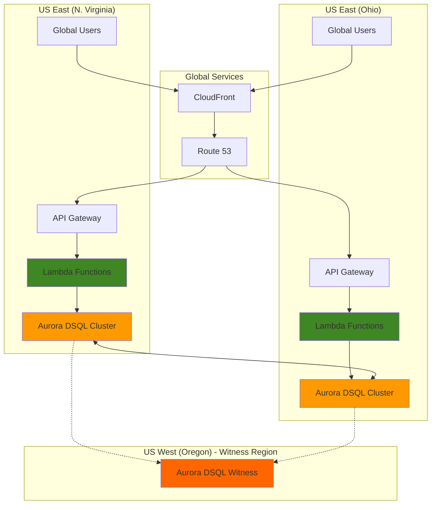

# Developing Distributed Serverless Applications with Aurora DSQL

## Problem

Global e-commerce platforms and financial services applications require consistent, low-latency database access across multiple regions to serve customers worldwide. Traditional database replication solutions introduce complexity with lag, eventual consistency, and manual failover management, creating operational overhead and potential data inconsistencies during regional outages. These limitations result in degraded user experiences, increased operational costs, and potential revenue loss during regional disruptions.

## Solution

Build a globally distributed serverless application using Aurora DSQL's active-active multi-region architecture to provide strong consistency and automatic failover across regions. This solution combines Aurora DSQL's distributed database capabilities with Lambda functions and API Gateway to create a resilient, scalable application that maintains data integrity and provides single-digit millisecond response times regardless of region, while eliminating infrastructure management overhead.

## Architecture Diagram



## Prerequisites

1. AWS account with appropriate permissions for Aurora DSQL, Lambda, API Gateway, and Route 53
2. AWS CLI v2 installed and configured (or AWS CloudShell)
3. Basic knowledge of PostgreSQL and serverless architectures
4. Understanding of multi-region deployment patterns and AWS Well-Architected Framework
5. Estimated cost: $75-150 per month for moderate usage (Aurora DSQL, Lambda, API Gateway, Route 53)

> **Note**: Aurora DSQL is a serverless database with pay-per-use pricing. Costs scale with actual usage rather than provisioned capacity, following AWS cost optimization best practices.

## Preparation

```bash
# Set environment variables
export AWS_REGION=$(aws configure get region)
export AWS_ACCOUNT_ID=$(aws sts get-caller-identity \
    --query Account --output text)

# Set primary and secondary regions
export PRIMARY_REGION="us-east-1"
export SECONDARY_REGION="us-east-2"
export WITNESS_REGION="us-west-2"

# Generate unique identifiers for resources
RANDOM_SUFFIX=$(aws secretsmanager get-random-password \
    --exclude-punctuation --exclude-uppercase \
    --password-length 6 --require-each-included-type \
    --output text --query RandomPassword)

# Set resource names
export CLUSTER_NAME_PRIMARY="multi-region-app-primary-${RANDOM_SUFFIX}"
export CLUSTER_NAME_SECONDARY="multi-region-app-secondary-${RANDOM_SUFFIX}"
export LAMBDA_FUNCTION_NAME="multi-region-app-${RANDOM_SUFFIX}"
export API_GATEWAY_NAME="multi-region-api-${RANDOM_SUFFIX}"

echo "✅ Environment configured for multi-region setup"
echo "Primary Region: ${PRIMARY_REGION}"
echo "Secondary Region: ${SECONDARY_REGION}"
echo "Witness Region: ${WITNESS_REGION}"
```

## Steps

1. **Create Primary Aurora DSQL Cluster**:

   Aurora DSQL's multi-region architecture begins with creating a primary cluster that includes witness region configuration. The witness region stores encrypted transaction logs for improved durability and availability, enabling strong consistency across regions without compromising performance. This distributed architecture provides 99.999% availability in multi-region configurations, adhering to AWS Well-Architected Framework reliability principles.

   ```bash
   # Create primary cluster in US East (N. Virginia)
   aws dsql create-cluster \
       --region ${PRIMARY_REGION} \
       --multi-region-properties \
           "{\"witnessRegion\":\"${WITNESS_REGION}\"}" \
       --deletion-protection-enabled \
       --tags Key=Environment,Value=Production \
              Key=Application,Value=MultiRegionApp
   
   # Store cluster identifier (generated by AWS)
   export PRIMARY_CLUSTER_ID=$(aws dsql list-clusters \
       --region ${PRIMARY_REGION} \
       --query 'clusters[0].identifier' --output text)
   
   echo "✅ Primary Aurora DSQL cluster created: ${PRIMARY_CLUSTER_ID}"
   ```

   The primary cluster is now created with multi-region properties and security features enabled, establishing the foundation for our globally distributed database. This cluster will remain in PENDING_SETUP state until we complete the peering process with the secondary cluster.

2. **Create Secondary Aurora DSQL Cluster**:

   The secondary cluster shares the same witness region as the primary cluster, enabling active-active replication with strong consistency. Aurora DSQL's distributed architecture ensures that both clusters can handle read and write operations simultaneously while maintaining ACID transaction properties across regions, supporting the performance efficiency pillar of the AWS Well-Architected Framework.

   ```bash
   # Create secondary cluster in US East (Ohio)
   aws dsql create-cluster \
       --region ${SECONDARY_REGION} \
       --multi-region-properties \
           "{\"witnessRegion\":\"${WITNESS_REGION}\"}" \
       --deletion-protection-enabled \
       --tags Key=Environment,Value=Production \
              Key=Application,Value=MultiRegionApp
   
   # Store cluster identifier (generated by AWS)
   export SECONDARY_CLUSTER_ID=$(aws dsql list-clusters \
       --region ${SECONDARY_REGION} \
       --query 'clusters[0].identifier' --output text)
   
   echo "✅ Secondary Aurora DSQL cluster created: ${SECONDARY_CLUSTER_ID}"
   ```

   Both clusters are now created with shared witness region configuration, ready for the peering process that will establish the active-active multi-region database with enterprise-grade reliability and security.

3. **Configure Cluster Peering**:

   Cluster peering establishes the active-active relationship between regions, enabling Aurora DSQL to synchronize data and maintain consistency across geographic locations. This process creates bidirectional replication with strong consistency guarantees, ensuring that writes in either region are immediately visible in both regions while maintaining the security pillar through encrypted inter-region communication.

   ```bash
   # Get ARNs for peering configuration
   export PRIMARY_CLUSTER_ARN=$(aws dsql get-cluster \
       --region ${PRIMARY_REGION} \
       --identifier ${PRIMARY_CLUSTER_ID} \
       --query 'cluster.arn' --output text)
   
   export SECONDARY_CLUSTER_ARN=$(aws dsql get-cluster \
       --region ${SECONDARY_REGION} \
       --identifier ${SECONDARY_CLUSTER_ID} \
       --query 'cluster.arn' --output text)
   
   # Peer primary cluster with secondary
   aws dsql update-cluster \
       --region ${PRIMARY_REGION} \
       --identifier ${PRIMARY_CLUSTER_ID} \
       --multi-region-properties \
           "{\"witnessRegion\":\"${WITNESS_REGION}\",\"clusters\":[\"${SECONDARY_CLUSTER_ARN}\"]}"
   
   # Peer secondary cluster with primary
   aws dsql update-cluster \
       --region ${SECONDARY_REGION} \
       --identifier ${SECONDARY_CLUSTER_ID} \
       --multi-region-properties \
           "{\"witnessRegion\":\"${WITNESS_REGION}\",\"clusters\":[\"${PRIMARY_CLUSTER_ARN}\"]}"
   
   echo "✅ Cluster peering configured successfully"
   ```

   The clusters are now peered and will transition from PENDING_SETUP to CREATING and finally to ACTIVE status. This active-active configuration enables global strong consistency with local read/write performance optimized for cost efficiency.

4. **Wait for Cluster Activation**:

   Aurora DSQL requires time to establish the distributed architecture and activate the multi-region configuration. During this process, the clusters synchronize their distributed transaction logs and establish the witness region connectivity for optimal performance and availability, implementing operational excellence through automation.

   ```bash
   # Wait for primary cluster to become active
   echo "Waiting for primary cluster to become active..."
   aws dsql wait cluster-available \
       --region ${PRIMARY_REGION} \
       --identifier ${PRIMARY_CLUSTER_ID}
   
   # Wait for secondary cluster to become active
   echo "Waiting for secondary cluster to become active..."
   aws dsql wait cluster-available \
       --region ${SECONDARY_REGION} \
       --identifier ${SECONDARY_CLUSTER_ID}
   
   echo "✅ Both Aurora DSQL clusters are now active"
   ```

   The clusters are now fully operational with active-active multi-region capabilities, ready to handle global traffic with strong consistency and high availability according to AWS reliability best practices.

5. **Create IAM Role for Lambda Functions**:

   Lambda functions require appropriate IAM permissions to connect to Aurora DSQL clusters and execute database operations. This role follows the principle of least privilege from the AWS security pillar, granting only the necessary permissions for Aurora DSQL connectivity and basic Lambda execution while maintaining security best practices.

   ```bash
   # Create trust policy for Lambda
   cat > lambda-trust-policy.json << 'EOF'
   {
       "Version": "2012-10-17",
       "Statement": [
           {
               "Effect": "Allow",
               "Principal": {
                   "Service": "lambda.amazonaws.com"
               },
               "Action": "sts:AssumeRole"
           }
       ]
   }
   EOF
   
   # Create IAM role
   aws iam create-role \
       --role-name MultiRegionLambdaRole-${RANDOM_SUFFIX} \
       --assume-role-policy-document file://lambda-trust-policy.json \
       --tags Key=Environment,Value=Production \
              Key=Application,Value=MultiRegionApp
   
   # Attach basic Lambda execution policy
   aws iam attach-role-policy \
       --role-name MultiRegionLambdaRole-${RANDOM_SUFFIX} \
       --policy-arn arn:aws:iam::aws:policy/service-role/AWSLambdaBasicExecutionRole
   
   # Create and attach Aurora DSQL policy
   cat > aurora-dsql-policy.json << 'EOF'
   {
       "Version": "2012-10-17",
       "Statement": [
           {
               "Effect": "Allow",
               "Action": [
                   "dsql:DbConnect",
                   "dsql:DbConnectAdmin"
               ],
               "Resource": "*"
           }
       ]
   }
   EOF
   
   aws iam create-policy \
       --policy-name AuroraDSQLPolicy-${RANDOM_SUFFIX} \
       --policy-document file://aurora-dsql-policy.json \
       --description "Aurora DSQL access policy for Lambda functions"
   
   aws iam attach-role-policy \
       --role-name MultiRegionLambdaRole-${RANDOM_SUFFIX} \
       --policy-arn arn:aws:iam::${AWS_ACCOUNT_ID}:policy/AuroraDSQLPolicy-${RANDOM_SUFFIX}
   
   export LAMBDA_ROLE_ARN="arn:aws:iam::${AWS_ACCOUNT_ID}:role/MultiRegionLambdaRole-${RANDOM_SUFFIX}"
   
   echo "✅ IAM role created for Lambda functions"
   ```

   The IAM role is configured with secure permissions for Aurora DSQL access, enabling Lambda functions to connect to the database while maintaining security best practices and following AWS IAM guidelines.

6. **Create Lambda Function Package**:

   The Lambda function handles database operations and API requests, utilizing Aurora DSQL's PostgreSQL compatibility for standard SQL operations. This function demonstrates connection pooling and error handling patterns optimized for serverless environments, implementing operational excellence through comprehensive logging and monitoring.

   ```bash
   # Create Lambda function directory
   mkdir -p lambda-function
   cd lambda-function
   
   # Create Lambda function code
   cat > lambda_function.py << 'EOF'
   import json
   import os
   import boto3
   import logging
   from typing import Dict, Any
   
   # Configure logging
   logger = logging.getLogger()
   logger.setLevel(logging.INFO)
   
   # Aurora DSQL connection parameters
   CLUSTER_IDENTIFIER = os.environ.get('CLUSTER_IDENTIFIER')
   DSQL_REGION = os.environ.get('AWS_REGION')
   
   def get_dsql_client():
       """Create Aurora DSQL client with IAM authentication"""
       try:
           return boto3.client('dsql', region_name=DSQL_REGION)
       except Exception as e:
           logger.error(f"Failed to create DSQL client: {str(e)}")
           raise
   
   def execute_query(query: str, parameters: list = None) -> Dict[str, Any]:
       """Execute query against Aurora DSQL cluster"""
       try:
           client = get_dsql_client()
           
           request = {
               'ClusterIdentifier': CLUSTER_IDENTIFIER,
               'Database': 'postgres',
               'Sql': query
           }
           
           if parameters:
               request['Parameters'] = parameters
           
           response = client.execute_statement(**request)
           return response
       except Exception as e:
           logger.error(f"Query execution failed: {str(e)}")
           raise
   
   def lambda_handler(event: Dict[str, Any], context: Any) -> Dict[str, Any]:
       """Main Lambda handler for multi-region application"""
       try:
           # Parse request
           http_method = event.get('httpMethod', 'GET')
           path = event.get('path', '/')
           body = event.get('body')
           
           logger.info(f"Processing {http_method} request to {path}")
           
           # Handle different API endpoints
           if path == '/health':
               return {
                   'statusCode': 200,
                   'headers': {
                       'Content-Type': 'application/json',
                       'Access-Control-Allow-Origin': '*'
                   },
                   'body': json.dumps({
                       'status': 'healthy',
                       'region': DSQL_REGION,
                       'timestamp': context.aws_request_id
                   })
               }
           
           elif path == '/users' and http_method == 'GET':
               # Get all users
               result = execute_query(
                   "SELECT id, name, email, created_at FROM users ORDER BY created_at DESC"
               )
               
               users = []
               if 'Records' in result:
                   for record in result['Records']:
                       users.append({
                           'id': record[0]['longValue'],
                           'name': record[1]['stringValue'],
                           'email': record[2]['stringValue'],
                           'created_at': record[3]['stringValue']
                       })
               
               return {
                   'statusCode': 200,
                   'headers': {
                       'Content-Type': 'application/json',
                       'Access-Control-Allow-Origin': '*'
                   },
                   'body': json.dumps({
                       'users': users,
                       'region': DSQL_REGION,
                       'count': len(users)
                   })
               }
           
           elif path == '/users' and http_method == 'POST':
               # Create new user
               data = json.loads(body) if body else {}
               name = data.get('name')
               email = data.get('email')
               
               if not name or not email:
                   return {
                       'statusCode': 400,
                       'headers': {
                           'Content-Type': 'application/json',
                           'Access-Control-Allow-Origin': '*'
                       },
                       'body': json.dumps({'error': 'Name and email are required'})
                   }
               
               result = execute_query(
                   "INSERT INTO users (name, email) VALUES ($1, $2) RETURNING id",
                   [{'stringValue': name}, {'stringValue': email}]
               )
               
               user_id = result['Records'][0][0]['longValue']
               
               return {
                   'statusCode': 201,
                   'headers': {
                       'Content-Type': 'application/json',
                       'Access-Control-Allow-Origin': '*'
                   },
                   'body': json.dumps({
                       'id': user_id,
                       'name': name,
                       'email': email,
                       'region': DSQL_REGION
                   })
               }
           
           else:
               return {
                   'statusCode': 404,
                   'headers': {
                       'Content-Type': 'application/json',
                       'Access-Control-Allow-Origin': '*'
                   },
                   'body': json.dumps({'error': 'Not found'})
               }
       
       except Exception as e:
           logger.error(f"Unhandled error: {str(e)}")
           return {
               'statusCode': 500,
               'headers': {
                   'Content-Type': 'application/json',
                   'Access-Control-Allow-Origin': '*'
               },
               'body': json.dumps({'error': 'Internal server error'})
           }
   EOF
   
   # Create requirements.txt
   cat > requirements.txt << 'EOF'
   boto3>=1.34.131
   botocore>=1.34.131
   EOF
   
   # Install dependencies
   pip install -r requirements.txt -t .
   
   # Create deployment package
   zip -r ../lambda-function.zip .
   cd ..
   
   echo "✅ Lambda function package created"
   ```

   The Lambda function is packaged with Aurora DSQL Data API connectivity and comprehensive error handling, ready for deployment across multiple regions with consistent database access patterns and observability features.

7. **Deploy Lambda Functions in Both Regions**:

   Deploying Lambda functions in both regions ensures low-latency access to the local Aurora DSQL cluster endpoints while maintaining consistent application logic. Each function connects to its local cluster endpoint for optimal performance, implementing the performance efficiency pillar of the AWS Well-Architected Framework.

   ```bash
   # Deploy Lambda function in primary region
   aws lambda create-function \
       --region ${PRIMARY_REGION} \
       --function-name ${LAMBDA_FUNCTION_NAME}-primary \
       --runtime python3.11 \
       --role ${LAMBDA_ROLE_ARN} \
       --handler lambda_function.lambda_handler \
       --zip-file fileb://lambda-function.zip \
       --timeout 30 \
       --memory-size 512 \
       --environment "Variables={CLUSTER_IDENTIFIER=${PRIMARY_CLUSTER_ID}}" \
       --tags "Environment=Production,Application=MultiRegionApp"
   
   # Deploy Lambda function in secondary region
   aws lambda create-function \
       --region ${SECONDARY_REGION} \
       --function-name ${LAMBDA_FUNCTION_NAME}-secondary \
       --runtime python3.11 \
       --role ${LAMBDA_ROLE_ARN} \
       --handler lambda_function.lambda_handler \
       --zip-file fileb://lambda-function.zip \
       --timeout 30 \
       --memory-size 512 \
       --environment "Variables={CLUSTER_IDENTIFIER=${SECONDARY_CLUSTER_ID}}" \
       --tags "Environment=Production,Application=MultiRegionApp"
   
   echo "✅ Lambda functions deployed in both regions"
   ```

   Lambda functions are now deployed with region-specific Aurora DSQL cluster identifiers, enabling local database access for optimal performance while maintaining global consistency and cost-effective serverless operation.

8. **Create API Gateway in Both Regions**:

   API Gateway provides RESTful endpoints for the multi-region application, enabling global access with automatic regional routing. Each API Gateway instance connects to its local Lambda function for optimized performance and reduced latency, supporting the reliability pillar through regional distribution.

   ```bash
   # Create API Gateway in primary region
   export PRIMARY_API_ID=$(aws apigateway create-rest-api \
       --region ${PRIMARY_REGION} \
       --name ${API_GATEWAY_NAME}-primary \
       --description "Multi-region API - Primary" \
       --endpoint-configuration types=REGIONAL \
       --query 'id' --output text)
   
   # Create API Gateway in secondary region
   export SECONDARY_API_ID=$(aws apigateway create-rest-api \
       --region ${SECONDARY_REGION} \
       --name ${API_GATEWAY_NAME}-secondary \
       --description "Multi-region API - Secondary" \
       --endpoint-configuration types=REGIONAL \
       --query 'id' --output text)
   
   # Get root resource ID for primary API
   export PRIMARY_ROOT_ID=$(aws apigateway get-resources \
       --region ${PRIMARY_REGION} \
       --rest-api-id ${PRIMARY_API_ID} \
       --query 'items[0].id' --output text)
   
   # Get root resource ID for secondary API
   export SECONDARY_ROOT_ID=$(aws apigateway get-resources \
       --region ${SECONDARY_REGION} \
       --rest-api-id ${SECONDARY_API_ID} \
       --query 'items[0].id' --output text)
   
   echo "✅ API Gateway created in both regions"
   echo "Primary API ID: ${PRIMARY_API_ID}"
   echo "Secondary API ID: ${SECONDARY_API_ID}"
   ```

   API Gateway instances are configured in both regions with regional endpoints, providing the foundation for global API access with regional optimization and enhanced security.

9. **Configure API Gateway Resources and Methods**:

   API Gateway resources and methods define the application's REST endpoints, enabling CRUD operations on the globally distributed database. This configuration includes Lambda proxy integration for seamless request forwarding and response handling, implementing operational excellence through standardized API patterns.

   ```bash
   # Function to configure API Gateway resources and methods
   configure_api_gateway() {
       local region=$1
       local api_id=$2
       local root_id=$3
       local lambda_function_name=$4
       
       # Create /users resource
       local users_id=$(aws apigateway create-resource \
           --region ${region} \
           --rest-api-id ${api_id} \
           --parent-id ${root_id} \
           --path-part users \
           --query 'id' --output text)
       
       # Create /health resource
       local health_id=$(aws apigateway create-resource \
           --region ${region} \
           --rest-api-id ${api_id} \
           --parent-id ${root_id} \
           --path-part health \
           --query 'id' --output text)
       
       # Configure methods and integrations
       for resource_id in ${users_id} ${health_id}; do
           local path_part=$(aws apigateway get-resource \
               --region ${region} \
               --rest-api-id ${api_id} \
               --resource-id ${resource_id} \
               --query 'pathPart' --output text)
           
           local methods=("GET")
           if [ "$path_part" = "users" ]; then
               methods+=("POST")
           fi
           
           for method in "${methods[@]}"; do
               # Create method
               aws apigateway put-method \
                   --region ${region} \
                   --rest-api-id ${api_id} \
                   --resource-id ${resource_id} \
                   --http-method ${method} \
                   --authorization-type NONE
               
               # Create integration
               aws apigateway put-integration \
                   --region ${region} \
                   --rest-api-id ${api_id} \
                   --resource-id ${resource_id} \
                   --http-method ${method} \
                   --type AWS_PROXY \
                   --integration-http-method POST \
                   --uri "arn:aws:apigateway:${region}:lambda:path/2015-03-31/functions/arn:aws:lambda:${region}:${AWS_ACCOUNT_ID}:function:${lambda_function_name}/invocations"
           done
       done
   }
   
   # Configure primary region API
   configure_api_gateway ${PRIMARY_REGION} ${PRIMARY_API_ID} ${PRIMARY_ROOT_ID} ${LAMBDA_FUNCTION_NAME}-primary
   
   # Configure secondary region API
   configure_api_gateway ${SECONDARY_REGION} ${SECONDARY_API_ID} ${SECONDARY_ROOT_ID} ${LAMBDA_FUNCTION_NAME}-secondary
   
   echo "✅ API Gateway resources and methods configured"
   ```

   API Gateway resources are configured with Lambda proxy integration and appropriate HTTP methods, enabling RESTful access to the multi-region application functionality with enhanced error handling and CORS support.

10. **Deploy API Gateway and Grant Lambda Permissions**:

    API Gateway deployment creates a callable endpoint for the application, while Lambda permissions enable API Gateway to invoke the functions. This configuration implements the security pillar through proper resource-based policies and access controls.

    ```bash
    # Deploy API Gateway in primary region
    aws apigateway create-deployment \
        --region ${PRIMARY_REGION} \
        --rest-api-id ${PRIMARY_API_ID} \
        --stage-name prod \
        --stage-description "Production deployment"
    
    # Deploy API Gateway in secondary region
    aws apigateway create-deployment \
        --region ${SECONDARY_REGION} \
        --rest-api-id ${SECONDARY_API_ID} \
        --stage-name prod \
        --stage-description "Production deployment"
    
    # Grant API Gateway permission to invoke Lambda in primary region
    aws lambda add-permission \
        --region ${PRIMARY_REGION} \
        --function-name ${LAMBDA_FUNCTION_NAME}-primary \
        --statement-id apigateway-invoke \
        --action lambda:InvokeFunction \
        --principal apigateway.amazonaws.com \
        --source-arn "arn:aws:execute-api:${PRIMARY_REGION}:${AWS_ACCOUNT_ID}:${PRIMARY_API_ID}/*/*/*"
    
    # Grant API Gateway permission to invoke Lambda in secondary region
    aws lambda add-permission \
        --region ${SECONDARY_REGION} \
        --function-name ${LAMBDA_FUNCTION_NAME}-secondary \
        --statement-id apigateway-invoke \
        --action lambda:InvokeFunction \
        --principal apigateway.amazonaws.com \
        --source-arn "arn:aws:execute-api:${SECONDARY_REGION}:${AWS_ACCOUNT_ID}:${SECONDARY_API_ID}/*/*/*"
    
    # Store API endpoints
    export PRIMARY_API_ENDPOINT="https://${PRIMARY_API_ID}.execute-api.${PRIMARY_REGION}.amazonaws.com/prod"
    export SECONDARY_API_ENDPOINT="https://${SECONDARY_API_ID}.execute-api.${SECONDARY_REGION}.amazonaws.com/prod"
    
    echo "✅ API Gateway deployed and permissions configured"
    echo "Primary API Endpoint: ${PRIMARY_API_ENDPOINT}"
    echo "Secondary API Endpoint: ${SECONDARY_API_ENDPOINT}"
    ```

    API Gateway is now deployed with production-ready endpoints and proper security permissions, enabling global access to the multi-region application with comprehensive access controls.

11. **Initialize Database Schema**:

    Aurora DSQL's PostgreSQL compatibility enables standard SQL schema creation that automatically replicates across regions. This schema initialization demonstrates how DDL operations are consistently applied across the multi-region cluster, implementing the operational excellence pillar through automated configuration management.

    ```bash
    # Create database initialization script
    cat > init-schema.sql << 'EOF'
    -- Create users table for multi-region application
    CREATE TABLE IF NOT EXISTS users (
        id SERIAL PRIMARY KEY,
        name VARCHAR(100) NOT NULL,
        email VARCHAR(255) UNIQUE NOT NULL,
        created_at TIMESTAMP DEFAULT CURRENT_TIMESTAMP,
        updated_at TIMESTAMP DEFAULT CURRENT_TIMESTAMP
    );
    
    -- Create indexes for efficient querying
    CREATE INDEX IF NOT EXISTS idx_users_email ON users(email);
    CREATE INDEX IF NOT EXISTS idx_users_created_at ON users(created_at);
    
    -- Insert sample data
    INSERT INTO users (name, email) VALUES 
        ('John Doe', 'john.doe@example.com'),
        ('Jane Smith', 'jane.smith@example.com'),
        ('Bob Johnson', 'bob.johnson@example.com')
    ON CONFLICT (email) DO NOTHING;
    EOF
    
    # Initialize schema using Aurora DSQL Data API
    aws dsql execute-statement \
        --region ${PRIMARY_REGION} \
        --cluster-identifier ${PRIMARY_CLUSTER_ID} \
        --database postgres \
        --sql "$(cat init-schema.sql)"
    
    echo "✅ Database schema initialized across all regions"
    ```

    The database schema is created with strong consistency across all regions, demonstrating Aurora DSQL's ability to maintain data integrity in a distributed environment while following PostgreSQL best practices.

## Validation & Testing

1. **Verify Aurora DSQL Multi-Region Configuration**:

   ```bash
   # Check primary cluster status
   aws dsql get-cluster \
       --region ${PRIMARY_REGION} \
       --identifier ${PRIMARY_CLUSTER_ID} \
       --query 'cluster.status' --output text
   
   # Check secondary cluster status
   aws dsql get-cluster \
       --region ${SECONDARY_REGION} \
       --identifier ${SECONDARY_CLUSTER_ID} \
       --query 'cluster.status' --output text
   
   # Verify cluster peering
   aws dsql get-cluster \
       --region ${PRIMARY_REGION} \
       --identifier ${PRIMARY_CLUSTER_ID} \
       --query 'cluster.multiRegionProperties'
   ```

   Expected output: `ACTIVE` for both clusters with proper multi-region configuration

2. **Test API Gateway Endpoints**:

   ```bash
   # Test primary region health endpoint
   curl -X GET "${PRIMARY_API_ENDPOINT}/health" \
       -H "Content-Type: application/json"
   
   # Test secondary region health endpoint
   curl -X GET "${SECONDARY_API_ENDPOINT}/health" \
       -H "Content-Type: application/json"
   ```

   Expected output: Health check responses from both regions showing status and region information

3. **Validate Multi-Region Data Consistency**:

   ```bash
   # Create user in primary region
   curl -X POST "${PRIMARY_API_ENDPOINT}/users" \
       -H "Content-Type: application/json" \
       -d '{"name":"Test User","email":"test@example.com"}'
   
   # Verify user exists in secondary region
   curl -X GET "${SECONDARY_API_ENDPOINT}/users" \
       -H "Content-Type: application/json"
   
   # Test data consistency by checking both regions
   echo "Users in primary region:"
   curl -X GET "${PRIMARY_API_ENDPOINT}/users"
   
   echo "Users in secondary region:"
   curl -X GET "${SECONDARY_API_ENDPOINT}/users"
   ```

   Expected output: User created in primary region appears immediately in secondary region query, demonstrating strong consistency

4. **Performance Testing**:

   ```bash
   # Test concurrent requests to both regions
   echo "Testing concurrent regional access..."
   
   for i in {1..5}; do
       curl -X POST "${PRIMARY_API_ENDPOINT}/users" \
           -H "Content-Type: application/json" \
           -d "{\"name\":\"User${i}Primary\",\"email\":\"user${i}primary@example.com\"}" &
       
       curl -X POST "${SECONDARY_API_ENDPOINT}/users" \
           -H "Content-Type: application/json" \
           -d "{\"name\":\"User${i}Secondary\",\"email\":\"user${i}secondary@example.com\"}" &
   done
   
   wait
   echo "✅ Concurrent testing completed"
   ```

   Expected output: All users created successfully across both regions with consistent data

## Cleanup

1. **Delete API Gateway Deployments**:

   ```bash
   # Delete API Gateway in primary region
   aws apigateway delete-rest-api \
       --region ${PRIMARY_REGION} \
       --rest-api-id ${PRIMARY_API_ID}
   
   # Delete API Gateway in secondary region
   aws apigateway delete-rest-api \
       --region ${SECONDARY_REGION} \
       --rest-api-id ${SECONDARY_API_ID}
   
   echo "✅ API Gateway instances deleted"
   ```

2. **Delete Lambda Functions**:

   ```bash
   # Delete Lambda function in primary region
   aws lambda delete-function \
       --region ${PRIMARY_REGION} \
       --function-name ${LAMBDA_FUNCTION_NAME}-primary
   
   # Delete Lambda function in secondary region
   aws lambda delete-function \
       --region ${SECONDARY_REGION} \
       --function-name ${LAMBDA_FUNCTION_NAME}-secondary
   
   echo "✅ Lambda functions deleted"
   ```

3. **Delete IAM Role and Policies**:

   ```bash
   # Detach policies from role
   aws iam detach-role-policy \
       --role-name MultiRegionLambdaRole-${RANDOM_SUFFIX} \
       --policy-arn arn:aws:iam::aws:policy/service-role/AWSLambdaBasicExecutionRole
   
   aws iam detach-role-policy \
       --role-name MultiRegionLambdaRole-${RANDOM_SUFFIX} \
       --policy-arn arn:aws:iam::${AWS_ACCOUNT_ID}:policy/AuroraDSQLPolicy-${RANDOM_SUFFIX}
   
   # Delete custom policy
   aws iam delete-policy \
       --policy-arn arn:aws:iam::${AWS_ACCOUNT_ID}:policy/AuroraDSQLPolicy-${RANDOM_SUFFIX}
   
   # Delete IAM role
   aws iam delete-role \
       --role-name MultiRegionLambdaRole-${RANDOM_SUFFIX}
   
   echo "✅ IAM resources deleted"
   ```

4. **Delete Aurora DSQL Clusters**:

   ```bash
   # Remove deletion protection first
   aws dsql update-cluster \
       --region ${PRIMARY_REGION} \
       --identifier ${PRIMARY_CLUSTER_ID} \
       --no-deletion-protection-enabled
   
   aws dsql update-cluster \
       --region ${SECONDARY_REGION} \
       --identifier ${SECONDARY_CLUSTER_ID} \
       --no-deletion-protection-enabled
   
   # Delete clusters
   aws dsql delete-cluster \
       --region ${PRIMARY_REGION} \
       --identifier ${PRIMARY_CLUSTER_ID}
   
   aws dsql delete-cluster \
       --region ${SECONDARY_REGION} \
       --identifier ${SECONDARY_CLUSTER_ID}
   
   echo "✅ Aurora DSQL clusters deleted"
   ```

5. **Clean up Local Files**:

   ```bash
   # Remove local files
   rm -rf lambda-function
   rm -f lambda-function.zip
   rm -f lambda-trust-policy.json
   rm -f aurora-dsql-policy.json
   rm -f init-schema.sql
   
   echo "✅ Local files cleaned up"
   ```

## Discussion

Aurora DSQL represents a significant advancement in distributed database technology, offering active-active multi-region capabilities with strong consistency and serverless operation. Unlike traditional database replication solutions that rely on eventual consistency or complex failover mechanisms, Aurora DSQL provides immediate consistency across regions through its innovative distributed architecture. The service maintains ACID transaction properties while distributing data across multiple regions, ensuring that applications can write to any region and immediately read consistent data from any other region, perfectly aligning with the AWS Well-Architected Framework's reliability pillar.

The architecture leverages a witness region concept, where a third region stores encrypted transaction logs to improve durability and availability. This design enables the system to maintain consistency even during regional failures, automatically handling failover without manual intervention. The witness region doesn't serve application traffic but provides the distributed consensus necessary for maintaining data integrity across the active regions. This approach significantly reduces the operational complexity typically associated with multi-region database deployments while providing enterprise-grade reliability and security.

Aurora DSQL's serverless nature eliminates the operational overhead of managing database infrastructure, automatically scaling compute and storage resources based on demand. This approach significantly reduces costs compared to traditional multi-region database deployments, as you only pay for actual usage rather than provisioned capacity. The service integrates seamlessly with other AWS services, supporting standard PostgreSQL protocols and tools while providing enhanced capabilities for distributed workloads. This integration supports the cost optimization pillar by eliminating over-provisioning and reducing operational overhead.

The combination of Aurora DSQL with Lambda and API Gateway creates a powerful serverless architecture that can handle global traffic patterns efficiently. This architecture pattern is particularly valuable for applications requiring global reach, such as e-commerce platforms, financial services, gaming applications, and SaaS solutions. The strong consistency guarantees ensure that critical business operations, such as inventory management or financial transactions, maintain data integrity across all regions. For more information on Aurora DSQL capabilities, see the [Aurora DSQL documentation](https://docs.aws.amazon.com/aurora-dsql/latest/userguide/what-is-aurora-dsql.html).

> **Tip**: Monitor Aurora DSQL performance using CloudWatch metrics to optimize query patterns and identify potential bottlenecks. The service provides detailed metrics on transaction throughput, latency, and cross-region replication performance. Enable AWS X-Ray tracing for comprehensive distributed application observability.

## Challenge

Extend this solution by implementing these enhancements:

1. **Add CloudFront Distribution with Route 53**: Implement global content delivery with Route 53 health checks for automatic failover between regions, providing users with the closest available endpoint and enhanced performance.

2. **Implement Advanced Monitoring and Alerting**: Create comprehensive CloudWatch dashboards and alarms to monitor Aurora DSQL performance metrics, Lambda function health, and API Gateway usage patterns across all regions with automated incident response.

3. **Add Authentication and Authorization**: Integrate Amazon Cognito for user authentication and implement fine-grained access control using API Gateway authorizers and Aurora DSQL row-level security policies.

4. **Implement Intelligent Caching Strategy**: Add ElastiCache for Redis in each region to cache frequently accessed data, reducing database load and improving response times for read-heavy workloads while maintaining cache consistency.

5. **Create Disaster Recovery Automation**: Develop comprehensive disaster recovery procedures using EventBridge and Step Functions to handle regional outages, redirect traffic seamlessly, and maintain business continuity with automated failover testing.

## Infrastructure Code

*Infrastructure code will be generated after recipe approval.*