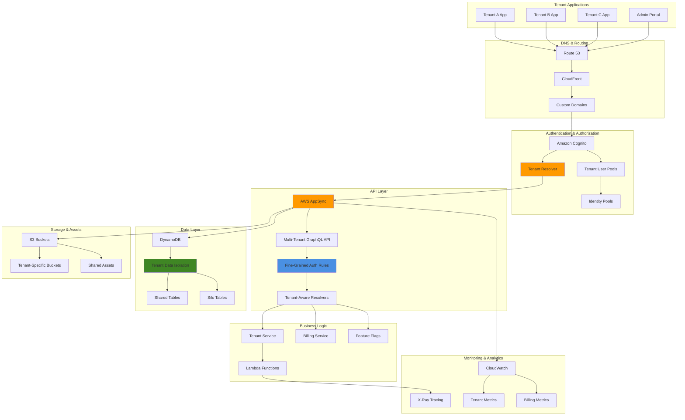

# Developing Secure Multi-Tenant SaaS with Amplify and Fine-Grained Authorization

## Problem

Building secure multi-tenant SaaS applications requires complex data isolation, tenant-specific access controls, billing management, and customizable features while maintaining operational efficiency and cost-effectiveness. Traditional approaches struggle with data leakage between tenants, complex permission models, tenant-specific configurations, and the need for both shared infrastructure for cost efficiency and isolated data for security compliance. Development teams face challenges implementing proper tenant isolation, dynamic authorization rules, tenant-aware APIs, and the ability to scale both horizontally and per-tenant without compromising security or performance.

## Solution

AWS Amplify with AppSync provides a comprehensive platform for building secure multi-tenant SaaS applications through fine-grained authorization rules, tenant-aware GraphQL resolvers, and isolated data access patterns. This solution leverages Cognito for tenant-aware authentication, DynamoDB with tenant partitioning for data isolation, AppSync authorization rules for dynamic access control, and Lambda functions for tenant-specific business logic. The architecture supports both silo and pool isolation patterns while providing centralized management and tenant-specific customization capabilities.

## Architecture Diagram



## Prerequisites

1. AWS account with appropriate permissions for Amplify, AppSync, Cognito, DynamoDB, Lambda, and CloudWatch
2. AWS CLI v2 installed and configured (or AWS CloudShell)
3. Node.js 18+ and npm installed locally
4. Amplify CLI installed globally (`npm install -g @aws-amplify/cli`)
5. React or Next.js development environment setup
6. Advanced knowledge of GraphQL, multi-tenancy patterns, and authorization models
7. Understanding of SaaS architecture patterns and data isolation strategies
8. Estimated cost: $50-150/month depending on tenant count and usage patterns

> **Note**: Multi-tenant applications have complex pricing considerations including per-tenant DynamoDB usage, AppSync request costs, and Lambda execution time that scale with tenant activity.

## Preparation

```bash
# Set environment variables
export AWS_REGION=$(aws configure get region)
export AWS_ACCOUNT_ID=$(aws sts get-caller-identity \
    --query Account --output text)

# Generate unique identifiers for resources
RANDOM_SUFFIX=$(aws secretsmanager get-random-password \
    --exclude-punctuation --exclude-uppercase \
    --password-length 6 --require-each-included-type \
    --output text --query RandomPassword)

export APP_NAME="multitenant-saas-${RANDOM_SUFFIX}"
export PROJECT_NAME="saas-platform-${RANDOM_SUFFIX}"

# Create project directory
mkdir -p ~/amplify-projects/${PROJECT_NAME}
cd ~/amplify-projects/${PROJECT_NAME}

# Initialize Next.js application for better SSR support
npx create-next-app@latest frontend --typescript --tailwind --eslint --app
cd frontend

# Install Amplify and multi-tenant dependencies
npm install aws-amplify @aws-amplify/ui-react
npm install uuid @types/uuid
npm install @aws-sdk/client-dynamodb @aws-sdk/lib-dynamodb
npm install jsonwebtoken @types/jsonwebtoken

echo "✅ Environment prepared for multi-tenant SaaS: ${PROJECT_NAME}"
```

## Steps

1. **Initialize Amplify with Multi-Tenant Architecture**:

   AWS Amplify serves as the foundational platform for our multi-tenant SaaS application, providing managed infrastructure for authentication, APIs, and hosting. Amplify's declarative approach enables rapid development while maintaining production-grade security and scalability. The initialization process establishes the core infrastructure that will support tenant isolation, user management, and secure data access patterns essential for enterprise SaaS applications.

   ```bash
   # Initialize Amplify project with comprehensive configuration
   amplify init --yes \
       --name ${PROJECT_NAME} \
       --region ${AWS_REGION} \
       --profile default
   
   # Add authentication with multi-tenant support
   amplify add auth
   
   # Select: Manual configuration
   # User Sign-Up, Sign-In, connected with AWS IAM controls
   # Allow unauthenticated logins: No
   # Enable 3rd party authentication: No (for now)
   # User Groups: Yes
   # Add admin queries API: Yes
   # Lambda triggers: Yes (for tenant resolution)
   
   echo "✅ Amplify initialized with multi-tenant authentication"
   ```

   This configuration establishes Amazon Cognito as the identity provider with advanced features including user groups for role-based access control and Lambda triggers for tenant-aware authentication workflows. The manual configuration approach ensures we have granular control over security policies and can implement the sophisticated authorization patterns required for multi-tenancy. User groups enable us to create tenant-specific and role-specific access controls, while Lambda triggers provide the hooks necessary for custom tenant resolution and authorization logic.

2. **Create Multi-Tenant GraphQL Schema**:

   AWS AppSync provides a fully managed GraphQL API service that excels at implementing fine-grained authorization rules essential for multi-tenant architectures. GraphQL's type system and AppSync's authorization directives enable us to create sophisticated data access patterns that ensure complete tenant isolation while maintaining query efficiency. The schema design implements both technical multi-tenancy (shared infrastructure) and logical data separation, allowing for cost-effective scaling while meeting enterprise security requirements.

   ```bash
   # Add GraphQL API with multi-tenant schema
   amplify add api
   
   # Select: GraphQL
   # API name: MultiTenantSaaSAPI
   # Authorization type: Amazon Cognito User Pool
   # Additional auth types: Yes, IAM
   # Conflict resolution: Auto Merge
   # Enable DataStore: Yes
   
   # Create comprehensive multi-tenant schema
   cat > amplify/backend/api/*/schema.graphql << 'EOF'
   # Tenant Management
   type Tenant @model @auth(rules: [
     { allow: groups, groups: ["SuperAdmins"] }
     { allow: groups, groups: ["TenantAdmins"], operations: [read, update] }
   ]) {
     id: ID!
     name: String!
     domain: String!
     subdomain: String!
     status: TenantStatus!
     plan: SubscriptionPlan!
     settings: TenantSettings
     features: [FeatureFlag] @hasMany(indexName: "byTenant", fields: ["id"])
     users: [User] @hasMany(indexName: "byTenant", fields: ["id"])
     projects: [Project] @hasMany(indexName: "byTenant", fields: ["id"])
     billingInfo: BillingInfo @hasOne(fields: ["id"])
     usage: TenantUsage @hasOne(fields: ["id"])
     createdAt: AWSDateTime!
     updatedAt: AWSDateTime!
     
     # Tenant-specific configuration
     customCSS: String
     logo: String
     primaryColor: String
     secondaryColor: String
     timezone: String!
     locale: String!
   }
   
   type User @model @auth(rules: [
     { allow: owner, ownerField: "userId" }
     { allow: groups, groups: ["SuperAdmins"] }
     { allow: groups, groups: ["TenantAdmins"], operations: [read, update] }
     { allow: private, operations: [read], provider: iam }
   ]) {
     id: ID!
     userId: String! @auth(rules: [{ allow: owner, operations: [read] }])
     tenantId: ID! @index(name: "byTenant", sortKeyFields: ["createdAt"])
     tenant: Tenant @belongsTo(fields: ["tenantId"])
     email: String!
     firstName: String!
     lastName: String!
     role: UserRole!
     permissions: [String]!
     isActive: Boolean!
     lastLoginAt: AWSDateTime
     profile: UserProfile @hasOne(fields: ["id"])
     projects: [ProjectMember] @hasMany(indexName: "byUser", fields: ["id"])
     activities: [ActivityLog] @hasMany(indexName: "byUser", fields: ["id"])
     createdAt: AWSDateTime!
     updatedAt: AWSDateTime!
   }
   
   type Project @model @auth(rules: [
     { allow: owner, ownerField: "createdBy", operations: [read, update, delete] }
     { allow: groups, groups: ["SuperAdmins"] }
     { allow: groups, groups: ["TenantAdmins"] }
     { allow: private, operations: [read], provider: iam }
   ]) {
     id: ID!
     tenantId: ID! @index(name: "byTenant", sortKeyFields: ["createdAt"])
     tenant: Tenant @belongsTo(fields: ["tenantId"])
     name: String!
     description: String
     status: ProjectStatus!
     createdBy: String! @auth(rules: [{ allow: owner, operations: [read] }])
     members: [ProjectMember] @hasMany(indexName: "byProject", fields: ["id"])
     tasks: [Task] @hasMany(indexName: "byProject", fields: ["id"])
     settings: ProjectSettings
     createdAt: AWSDateTime!
     updatedAt: AWSDateTime!
   }
   
   type Task @model @auth(rules: [
     { allow: owner, ownerField: "assignedTo", operations: [read, update] }
     { allow: owner, ownerField: "createdBy", operations: [read, update, delete] }
     { allow: groups, groups: ["SuperAdmins"] }
     { allow: groups, groups: ["TenantAdmins"] }
   ]) {
     id: ID!
     tenantId: ID! @index(name: "byTenantAndStatus", sortKeyFields: ["status", "createdAt"])
     projectId: ID! @index(name: "byProject", sortKeyFields: ["status", "createdAt"])
     project: Project @belongsTo(fields: ["projectId"])
     title: String!
     description: String
     status: TaskStatus!
     priority: TaskPriority!
     assignedTo: String
     createdBy: String! @auth(rules: [{ allow: owner, operations: [read] }])
     dueDate: AWSDateTime
     completedAt: AWSDateTime
     comments: [TaskComment] @hasMany(indexName: "byTask", fields: ["id"])
     attachments: [String]
     tags: [String]
     estimatedHours: Float
     actualHours: Float
     createdAt: AWSDateTime!
     updatedAt: AWSDateTime!
   }
   
   type ProjectMember @model @auth(rules: [
     { allow: groups, groups: ["SuperAdmins"] }
     { allow: groups, groups: ["TenantAdmins"] }
     { allow: owner, ownerField: "userId", operations: [read] }
   ]) {
     id: ID!
     tenantId: ID!
     projectId: ID! @index(name: "byProject", sortKeyFields: ["createdAt"])
     project: Project @belongsTo(fields: ["projectId"])
     userId: ID! @index(name: "byUser", sortKeyFields: ["createdAt"])
     user: User @belongsTo(fields: ["userId"])
     role: ProjectRole!
     permissions: [String]!
     joinedAt: AWSDateTime!
     createdAt: AWSDateTime!
     updatedAt: AWSDateTime!
   }
   
   type FeatureFlag @model @auth(rules: [
     { allow: groups, groups: ["SuperAdmins"] }
     { allow: groups, groups: ["TenantAdmins"], operations: [read] }
   ]) {
     id: ID!
     tenantId: ID! @index(name: "byTenant", sortKeyFields: ["createdAt"])
     tenant: Tenant @belongsTo(fields: ["tenantId"])
     featureName: String!
     isEnabled: Boolean!
     configuration: AWSJSON
     description: String
     rolloutPercentage: Float
     targetUserGroups: [String]
     validFrom: AWSDateTime
     validUntil: AWSDateTime
     createdAt: AWSDateTime!
     updatedAt: AWSDateTime!
   }
   
   type BillingInfo @model @auth(rules: [
     { allow: groups, groups: ["SuperAdmins"] }
     { allow: groups, groups: ["TenantAdmins"], operations: [read, update] }
   ]) {
     id: ID!
     tenantId: ID!
     plan: SubscriptionPlan!
     status: BillingStatus!
     currentPeriodStart: AWSDateTime!
     currentPeriodEnd: AWSDateTime!
     monthlyUsage: AWSJSON
     billingHistory: [BillingRecord] @hasMany(indexName: "byBilling", fields: ["id"])
     paymentMethod: PaymentMethod
     invoiceEmail: String
     billingAddress: Address
     taxId: String
     createdAt: AWSDateTime!
     updatedAt: AWSDateTime!
   }
   
   type TenantUsage @model @auth(rules: [
     { allow: groups, groups: ["SuperAdmins"] }
     { allow: groups, groups: ["TenantAdmins"], operations: [read] }
   ]) {
     id: ID!
     tenantId: ID!
     month: String! @index(name: "byMonth", sortKeyFields: ["tenantId"])
     apiCalls: Int!
     storageUsed: Float!
     usersActive: Int!
     projectsCreated: Int!
     tasksCreated: Int!
     dataTransfer: Float!
     computeHours: Float!
     lastUpdated: AWSDateTime!
     createdAt: AWSDateTime!
     updatedAt: AWSDateTime!
   }
   
   type ActivityLog @model @auth(rules: [
     { allow: groups, groups: ["SuperAdmins"] }
     { allow: groups, groups: ["TenantAdmins"] }
     { allow: owner, ownerField: "userId", operations: [read] }
   ]) {
     id: ID!
     tenantId: ID! @index(name: "byTenantAndAction", sortKeyFields: ["action", "createdAt"])
     userId: ID! @index(name: "byUser", sortKeyFields: ["createdAt"])
     user: User @belongsTo(fields: ["userId"])
     action: String!
     resource: String!
     resourceId: String
     metadata: AWSJSON
     ipAddress: String
     userAgent: String
     createdAt: AWSDateTime!
   }
   
   # Supporting Types
   type TenantSettings {
     maxUsers: Int!
     maxProjects: Int!
     maxStorageGB: Float!
     allowedFeatures: [String]!
     ssoEnabled: Boolean!
     auditingEnabled: Boolean!
     dataRetentionDays: Int!
     customDomain: String
     apiRateLimit: Int!
   }
   
   type UserProfile {
     avatar: String
     bio: String
     phoneNumber: String
     department: String
     jobTitle: String
     timezone: String
     preferences: AWSJSON
   }
   
   type ProjectSettings {
     isPublic: Boolean!
     allowGuestAccess: Boolean!
     defaultTaskPriority: TaskPriority!
     notificationSettings: AWSJSON
     customFields: AWSJSON
   }
   
   type PaymentMethod {
     type: PaymentType!
     last4: String
     expiryMonth: Int
     expiryYear: Int
     brand: String
   }
   
   type Address {
     line1: String!
     line2: String
     city: String!
     state: String!
     postalCode: String!
     country: String!
   }
   
   # Enums
   enum TenantStatus {
     ACTIVE
     SUSPENDED
     TRIAL
     EXPIRED
     CANCELLED
   }
   
   enum SubscriptionPlan {
     TRIAL
     BASIC
     PROFESSIONAL
     ENTERPRISE
     CUSTOM
   }
   
   enum UserRole {
     TENANT_ADMIN
     PROJECT_MANAGER
     TEAM_LEAD
     DEVELOPER
     VIEWER
     GUEST
   }
   
   enum ProjectRole {
     OWNER
     ADMIN
     MEMBER
     VIEWER
   }
   
   enum ProjectStatus {
     PLANNING
     ACTIVE
     ON_HOLD
     COMPLETED
     CANCELLED
   }
   
   enum TaskStatus {
     TODO
     IN_PROGRESS
     REVIEW
     DONE
     CANCELLED
   }
   
   enum TaskPriority {
     LOW
     MEDIUM
     HIGH
     URGENT
   }
   
   enum BillingStatus {
     ACTIVE
     PAST_DUE
     CANCELLED
     TRIALING
   }
   
   enum PaymentType {
     CREDIT_CARD
     BANK_TRANSFER
     INVOICE
   }
   
   # Mutations for tenant management
   type Mutation {
     createTenant(input: CreateTenantInput!): Tenant
       @auth(rules: [{ allow: groups, groups: ["SuperAdmins"] }])
     
     updateTenantSettings(tenantId: ID!, settings: TenantSettingsInput!): Tenant
       @auth(rules: [
         { allow: groups, groups: ["SuperAdmins"] }
         { allow: groups, groups: ["TenantAdmins"] }
       ])
     
     provisionTenantUser(input: ProvisionUserInput!): User
       @auth(rules: [
         { allow: groups, groups: ["SuperAdmins"] }
         { allow: groups, groups: ["TenantAdmins"] }
       ])
     
     updateUserRole(userId: ID!, role: UserRole!, permissions: [String]!): User
       @auth(rules: [
         { allow: groups, groups: ["SuperAdmins"] }
         { allow: groups, groups: ["TenantAdmins"] }
       ])
     
     updateBillingInfo(tenantId: ID!, billingInfo: BillingInfoInput!): BillingInfo
       @auth(rules: [
         { allow: groups, groups: ["SuperAdmins"] }
         { allow: groups, groups: ["TenantAdmins"] }
       ])
   }
   
   # Custom inputs
   input CreateTenantInput {
     name: String!
     domain: String!
     subdomain: String!
     plan: SubscriptionPlan!
     adminEmail: String!
     adminName: String!
   }
   
   input TenantSettingsInput {
     maxUsers: Int
     maxProjects: Int
     maxStorageGB: Float
     allowedFeatures: [String]
     ssoEnabled: Boolean
     auditingEnabled: Boolean
     dataRetentionDays: Int
     customDomain: String
     apiRateLimit: Int
   }
   
   input ProvisionUserInput {
     tenantId: ID!
     email: String!
     firstName: String!
     lastName: String!
     role: UserRole!
     tempPassword: String!
   }
   
   input BillingInfoInput {
     plan: SubscriptionPlan
     paymentMethod: PaymentMethodInput
     billingAddress: AddressInput
     invoiceEmail: String
   }
   
   input PaymentMethodInput {
     type: PaymentType!
     token: String!
   }
   
   input AddressInput {
     line1: String!
     line2: String
     city: String!
     state: String!
     postalCode: String!
     country: String!
   }
   EOF
   
   echo "✅ Multi-tenant GraphQL schema created"
   ```

   This comprehensive schema establishes the complete data model for a production-ready multi-tenant SaaS platform. The authorization rules leverage AppSync's @auth directive to create multiple security layers: group-based access for administrative functions, owner-based access for user data, and tenant-aware filters that prevent cross-tenant data access. The schema supports complex SaaS requirements including subscription plans, billing management, feature flags, and detailed audit trails, while maintaining the flexibility to scale from startup to enterprise customers.

3. **Create Tenant Resolution Lambda Functions**:

   AWS Lambda functions serve as the business logic layer for complex tenant management operations that require server-side validation, data consistency checks, and integration with external systems. These functions implement sophisticated tenant provisioning workflows, enforce subscription limits, and maintain data integrity across the multi-tenant system. Lambda's serverless architecture ensures we only pay for actual compute time while providing automatic scaling and high availability for critical tenant operations.

   ```bash
   # Add Lambda function for tenant management
   amplify add function
   
   # Function name: tenantResolver
   # Runtime: NodeJS
   # Template: Hello World
   # Advanced settings: Yes
   # Environment variables: Yes
   
   # Create comprehensive tenant resolution logic
   cat > amplify/backend/function/tenantResolver/src/index.js << 'EOF'
   const AWS = require('aws-sdk');
   const jwt = require('jsonwebtoken');
   const dynamodb = new AWS.DynamoDB.DocumentClient();
   
   const TENANT_TABLE = process.env.TENANT_TABLE;
   const USER_TABLE = process.env.USER_TABLE;
   
   exports.handler = async (event) => {
     console.log('Tenant resolver event:', JSON.stringify(event, null, 2));
     
     const { field, source, arguments: args, identity, request } = event;
     
     try {
       switch (field) {
         case 'createTenant':
           return await createTenant(args.input, identity);
         
         case 'updateTenantSettings':
           return await updateTenantSettings(args.tenantId, args.settings, identity);
         
         case 'provisionTenantUser':
           return await provisionTenantUser(args.input, identity);
         
         case 'updateUserRole':
           return await updateUserRole(args.userId, args.role, args.permissions, identity);
         
         default:
           throw new Error(`Unknown field: ${field}`);
       }
     } catch (error) {
       console.error('Tenant resolver error:', error);
       throw new Error(`Tenant operation failed: ${error.message}`);
     }
   };
   
   async function createTenant(input, identity) {
     // Validate super admin permissions
     if (!hasRole(identity, 'SuperAdmins')) {
       throw new Error('Unauthorized: Only super admins can create tenants');
     }
     
     const tenantId = generateTenantId();
     const timestamp = new Date().toISOString();
     
     // Check if subdomain is available
     const existingTenant = await getTenantBySubdomain(input.subdomain);
     if (existingTenant) {
       throw new Error(`Subdomain ${input.subdomain} is already taken`);
     }
     
     // Create tenant record
     const tenant = {
       id: tenantId,
       name: input.name,
       domain: input.domain,
       subdomain: input.subdomain,
       status: 'TRIAL',
       plan: input.plan,
       settings: getDefaultTenantSettings(input.plan),
       customCSS: '',
       logo: '',
       primaryColor: '#4f46e5',
       secondaryColor: '#6b7280',
       timezone: 'America/New_York',
       locale: 'en-US',
       createdAt: timestamp,
       updatedAt: timestamp
     };
     
     await dynamodb.put({
       TableName: TENANT_TABLE,
       Item: tenant
     }).promise();
     
     // Create initial admin user
     await createTenantAdmin(tenantId, {
       email: input.adminEmail,
       name: input.adminName
     });
     
     // Initialize tenant resources
     await initializeTenantResources(tenantId);
     
     return tenant;
   }
   
   async function updateTenantSettings(tenantId, settingsInput, identity) {
     // Validate permissions
     if (!hasRole(identity, 'SuperAdmins') && !isTenantAdmin(identity, tenantId)) {
       throw new Error('Unauthorized: Insufficient permissions');
     }
     
     const tenant = await getTenantById(tenantId);
     if (!tenant) {
       throw new Error('Tenant not found');
     }
     
     // Validate settings against plan limits
     validateSettingsAgainstPlan(settingsInput, tenant.plan);
     
     const updatedTenant = {
       ...tenant,
       settings: {
         ...tenant.settings,
         ...settingsInput
       },
       updatedAt: new Date().toISOString()
     };
     
     await dynamodb.put({
       TableName: TENANT_TABLE,
       Item: updatedTenant
     }).promise();
     
     return updatedTenant;
   }
   
   async function provisionTenantUser(input, identity) {
     // Validate permissions
     if (!hasRole(identity, 'SuperAdmins') && !isTenantAdmin(identity, input.tenantId)) {
       throw new Error('Unauthorized: Insufficient permissions');
     }
     
     const tenant = await getTenantById(input.tenantId);
     if (!tenant) {
       throw new Error('Tenant not found');
     }
     
     // Check user limits
     const currentUserCount = await getUserCountForTenant(input.tenantId);
     if (currentUserCount >= tenant.settings.maxUsers) {
       throw new Error('User limit exceeded for this tenant');
     }
     
     // Create Cognito user
     const cognitoUser = await createCognitoUser({
       email: input.email,
       tempPassword: input.tempPassword,
       tenantId: input.tenantId
     });
     
     // Create user record
     const userId = cognitoUser.User.Username;
     const user = {
       id: generateUserId(),
       userId: userId,
       tenantId: input.tenantId,
       email: input.email,
       firstName: input.firstName,
       lastName: input.lastName,
       role: input.role,
       permissions: getPermissionsForRole(input.role),
       isActive: true,
       lastLoginAt: null,
       createdAt: new Date().toISOString(),
       updatedAt: new Date().toISOString()
     };
     
     await dynamodb.put({
       TableName: USER_TABLE,
       Item: user
     }).promise();
     
     // Add user to appropriate groups
     await addUserToTenantGroups(userId, input.tenantId, input.role);
     
     return user;
   }
   
   async function updateUserRole(userId, role, permissions, identity) {
     const user = await getUserById(userId);
     if (!user) {
       throw new Error('User not found');
     }
     
     // Validate permissions
     if (!hasRole(identity, 'SuperAdmins') && !isTenantAdmin(identity, user.tenantId)) {
       throw new Error('Unauthorized: Insufficient permissions');
     }
     
     const updatedUser = {
       ...user,
       role: role,
       permissions: permissions,
       updatedAt: new Date().toISOString()
     };
     
     await dynamodb.put({
       TableName: USER_TABLE,
       Item: updatedUser
     }).promise();
     
     // Update Cognito groups
     await updateUserGroups(userId, user.tenantId, role);
     
     return updatedUser;
   }
   
   // Helper functions
   function generateTenantId() {
     return `tenant_${Date.now()}_${Math.random().toString(36).substr(2, 9)}`;
   }
   
   function generateUserId() {
     return `user_${Date.now()}_${Math.random().toString(36).substr(2, 9)}`;
   }
   
   function getDefaultTenantSettings(plan) {
     const settingsMap = {
       TRIAL: {
         maxUsers: 5,
         maxProjects: 3,
         maxStorageGB: 1.0,
         allowedFeatures: ['basic_tasks', 'basic_projects'],
         ssoEnabled: false,
         auditingEnabled: false,
         dataRetentionDays: 30,
         apiRateLimit: 100
       },
       BASIC: {
         maxUsers: 25,
         maxProjects: 10,
         maxStorageGB: 5.0,
         allowedFeatures: ['basic_tasks', 'basic_projects', 'reporting'],
         ssoEnabled: false,
         auditingEnabled: true,
         dataRetentionDays: 90,
         apiRateLimit: 500
       },
       PROFESSIONAL: {
         maxUsers: 100,
         maxProjects: 50,
         maxStorageGB: 25.0,
         allowedFeatures: ['basic_tasks', 'basic_projects', 'reporting', 'advanced_analytics', 'integrations'],
         ssoEnabled: true,
         auditingEnabled: true,
         dataRetentionDays: 365,
         apiRateLimit: 2000
       },
       ENTERPRISE: {
         maxUsers: 1000,
         maxProjects: 500,
         maxStorageGB: 100.0,
         allowedFeatures: ['all'],
         ssoEnabled: true,
         auditingEnabled: true,
         dataRetentionDays: 2555, // 7 years
         apiRateLimit: 10000
       }
     };
     
     return settingsMap[plan] || settingsMap.TRIAL;
   }
   
   function getPermissionsForRole(role) {
     const rolePermissions = {
       TENANT_ADMIN: [
         'tenant:read', 'tenant:update', 'users:manage', 'projects:manage',
         'billing:read', 'billing:update', 'settings:update', 'audit:read'
       ],
       PROJECT_MANAGER: [
         'projects:create', 'projects:read', 'projects:update', 'projects:delete',
         'tasks:manage', 'users:read', 'reports:read'
       ],
       TEAM_LEAD: [
         'projects:read', 'projects:update', 'tasks:manage', 'users:read'
       ],
       DEVELOPER: [
         'projects:read', 'tasks:read', 'tasks:update', 'tasks:create'
       ],
       VIEWER: [
         'projects:read', 'tasks:read'
       ],
       GUEST: [
         'tasks:read'
       ]
     };
     
     return rolePermissions[role] || rolePermissions.GUEST;
   }
   
   function hasRole(identity, role) {
     const groups = identity.groups || [];
     return groups.includes(role);
   }
   
   function isTenantAdmin(identity, tenantId) {
     // Check if user is admin of the specific tenant
     const tenantClaim = identity.claims['custom:tenant_id'];
     const roles = identity.claims['custom:roles']?.split(',') || [];
     
     return tenantClaim === tenantId && roles.includes('TENANT_ADMIN');
   }
   
   async function getTenantById(tenantId) {
     const result = await dynamodb.get({
       TableName: TENANT_TABLE,
       Key: { id: tenantId }
     }).promise();
     
     return result.Item;
   }
   
   async function getTenantBySubdomain(subdomain) {
     const result = await dynamodb.scan({
       TableName: TENANT_TABLE,
       FilterExpression: 'subdomain = :subdomain',
       ExpressionAttributeValues: {
         ':subdomain': subdomain
       }
     }).promise();
     
     return result.Items.length > 0 ? result.Items[0] : null;
   }
   
   async function getUserById(userId) {
     const result = await dynamodb.scan({
       TableName: USER_TABLE,
       FilterExpression: 'userId = :userId',
       ExpressionAttributeValues: {
         ':userId': userId
       }
     }).promise();
     
     return result.Items.length > 0 ? result.Items[0] : null;
   }
   
   async function getUserCountForTenant(tenantId) {
     const result = await dynamodb.query({
       TableName: USER_TABLE,
       IndexName: 'byTenant',
       KeyConditionExpression: 'tenantId = :tenantId',
       ExpressionAttributeValues: {
         ':tenantId': tenantId
       },
       Select: 'COUNT'
     }).promise();
     
     return result.Count;
   }
   
   function validateSettingsAgainstPlan(settings, plan) {
     const planLimits = getDefaultTenantSettings(plan);
     
     if (settings.maxUsers && settings.maxUsers > planLimits.maxUsers) {
       throw new Error(`User limit exceeds plan maximum of ${planLimits.maxUsers}`);
     }
     
     if (settings.maxProjects && settings.maxProjects > planLimits.maxProjects) {
       throw new Error(`Project limit exceeds plan maximum of ${planLimits.maxProjects}`);
     }
     
     if (settings.maxStorageGB && settings.maxStorageGB > planLimits.maxStorageGB) {
       throw new Error(`Storage limit exceeds plan maximum of ${planLimits.maxStorageGB}GB`);
     }
   }
   
   // Cognito integration functions (placeholder implementations)
   async function createCognitoUser(userData) {
     // Implementation would use AWS Cognito Admin APIs
     console.log('Creating Cognito user:', userData);
     return { User: { Username: `user_${Date.now()}` } };
   }
   
   async function addUserToTenantGroups(userId, tenantId, role) {
     // Implementation would add user to Cognito groups
     console.log('Adding user to groups:', { userId, tenantId, role });
   }
   
   async function updateUserGroups(userId, tenantId, role) {
     // Implementation would update Cognito group memberships
     console.log('Updating user groups:', { userId, tenantId, role });
   }
   
   async function createTenantAdmin(tenantId, adminData) {
     // Implementation would create the initial tenant admin
     console.log('Creating tenant admin:', { tenantId, adminData });
   }
   
   async function initializeTenantResources(tenantId) {
     // Implementation would set up tenant-specific resources
     console.log('Initializing tenant resources:', tenantId);
   }
   EOF
   
   echo "✅ Tenant resolver Lambda function created"
   ```

   The tenant resolver function implements critical business logic including tenant provisioning, user limit enforcement, and subscription plan validation. This centralized approach ensures consistent application of business rules across all tenant operations while providing audit trails and error handling. The function leverages DynamoDB's atomic operations to maintain data consistency during complex multi-step tenant creation processes, preventing incomplete or corrupted tenant states that could compromise system integrity.

4. **Create Tenant-Aware Authentication Triggers**:

   Amazon Cognito Lambda triggers provide powerful hooks into the authentication lifecycle, enabling us to implement sophisticated tenant-aware authentication patterns. These triggers enforce tenant-specific policies, validate user limits, and inject custom claims into JWT tokens that drive client-side authorization decisions. This approach eliminates the need for additional API calls to determine user context, significantly improving application performance while maintaining strict security boundaries between tenants.

   ```bash
   # Create tenant-aware authentication Lambda triggers
   cat > amplify/backend/function/tenantAuthTriggers/src/index.js << 'EOF'
   const AWS = require('aws-sdk');
   const dynamodb = new AWS.DynamoDB.DocumentClient();
   const cognitoIdentityServiceProvider = new AWS.CognitoIdentityServiceProvider();
   
   exports.handler = async (event) => {
     console.log('Tenant auth trigger:', JSON.stringify(event, null, 2));
     
     try {
       switch (event.triggerSource) {
         case 'PreSignUp_SignUp':
         case 'PreSignUp_ExternalProvider':
           return await handlePreSignUp(event);
         
         case 'PostConfirmation_ConfirmSignUp':
         case 'PostConfirmation_ConfirmForgotPassword':
           return await handlePostConfirmation(event);
         
         case 'PreAuthentication_Authentication':
           return await handlePreAuthentication(event);
         
         case 'TokenGeneration_HostedAuth':
         case 'TokenGeneration_Authentication':
         case 'TokenGeneration_NewPasswordChallenge':
         case 'TokenGeneration_AuthenticateDevice':
           return await handleTokenGeneration(event);
         
         default:
           console.log('Unhandled trigger source:', event.triggerSource);
           return event;
       }
     } catch (error) {
       console.error('Tenant auth trigger error:', error);
       throw error;
     }
   };
   
   async function handlePreSignUp(event) {
     const { userAttributes } = event.request;
     const email = userAttributes.email;
     const domain = email.split('@')[1];
     
     // Extract tenant information from custom attributes or domain
     const tenantId = userAttributes['custom:tenant_id'];
     
     if (!tenantId) {
       // Try to resolve tenant from domain mapping
       const tenant = await getTenantByDomain(domain);
       if (!tenant) {
         throw new Error(`No tenant found for domain: ${domain}`);
       }
       
       // Add tenant ID to user attributes
       event.response.userAttributes = {
         ...event.response.userAttributes,
         'custom:tenant_id': tenant.id
       };
     }
     
     // Validate tenant status
     const tenant = await getTenantById(tenantId);
     if (!tenant || tenant.status !== 'ACTIVE') {
       throw new Error('Tenant is not active or does not exist');
     }
     
     // Check user limits
     const userCount = await getUserCountForTenant(tenantId);
     if (userCount >= tenant.settings.maxUsers) {
       throw new Error('User limit exceeded for this tenant');
     }
     
     return event;
   }
   
   async function handlePostConfirmation(event) {
     const { userPoolId, userName, userAttributes } = event;
     const tenantId = userAttributes['custom:tenant_id'];
     
     try {
       // Create user record in DynamoDB
       const user = {
         id: `user_${Date.now()}_${Math.random().toString(36).substr(2, 9)}`,
         userId: userName,
         tenantId: tenantId,
         email: userAttributes.email,
         firstName: userAttributes.given_name || '',
         lastName: userAttributes.family_name || '',
         role: 'VIEWER', // Default role
         permissions: ['tasks:read'],
         isActive: true,
         lastLoginAt: null,
         createdAt: new Date().toISOString(),
         updatedAt: new Date().toISOString()
       };
       
       await dynamodb.put({
         TableName: process.env.USER_TABLE,
         Item: user
       }).promise();
       
       // Add user to default tenant group
       await cognitoIdentityServiceProvider.adminAddUserToGroup({
         GroupName: `Tenant_${tenantId}_Users`,
         Username: userName,
         UserPoolId: userPoolId
       }).promise();
       
       // Log user creation
       await logActivity({
         tenantId: tenantId,
         userId: userName,
         action: 'USER_CREATED',
         resource: 'User',
         resourceId: userName,
         metadata: {
           email: userAttributes.email,
           role: 'VIEWER'
         }
       });
       
       return event;
     } catch (error) {
       console.error('Post confirmation error:', error);
       return event;
     }
   }
   
   async function handlePreAuthentication(event) {
     const { userPoolId, userName, userAttributes } = event;
     const tenantId = userAttributes['custom:tenant_id'];
     
     // Validate tenant status
     const tenant = await getTenantById(tenantId);
     if (!tenant) {
       throw new Error('Tenant not found');
     }
     
     if (tenant.status === 'SUSPENDED') {
       throw new Error('Tenant account is suspended');
     }
     
     if (tenant.status === 'EXPIRED') {
       throw new Error('Tenant subscription has expired');
     }
     
     // Check user status
     const user = await getUserByUserId(userName);
     if (!user || !user.isActive) {
       throw new Error('User account is inactive');
     }
     
     // Rate limiting check
     const recentLogins = await getRecentLoginAttempts(userName);
     if (recentLogins.length > 10) {
       throw new Error('Too many login attempts. Please try again later.');
     }
     
     return event;
   }
   
   async function handleTokenGeneration(event) {
     const { userName, userAttributes } = event.request;
     const tenantId = userAttributes['custom:tenant_id'];
     
     try {
       // Get user details
       const user = await getUserByUserId(userName);
       const tenant = await getTenantById(tenantId);
       
       if (user && tenant) {
         // Update last login time
         await updateUserLastLogin(userName);
         
         // Get user groups
         const groups = await getUserGroups(event.userPoolId, userName);
         
         // Add custom claims to token
         event.response = {
           claimsOverrideDetails: {
             claimsToAddOrOverride: {
               'custom:tenant_id': tenantId,
               'custom:tenant_name': tenant.name,
               'custom:tenant_plan': tenant.plan,
               'custom:user_role': user.role,
               'custom:permissions': user.permissions.join(','),
               'custom:groups': groups.join(','),
               'custom:features': tenant.settings.allowedFeatures.join(','),
               'custom:last_login': new Date().toISOString()
             },
             groupOverrideDetails: {
               groupsToOverride: groups,
               preferredRole: user.role
             }
           }
         };
         
         // Log successful authentication
         await logActivity({
           tenantId: tenantId,
           userId: userName,
           action: 'USER_LOGIN',
           resource: 'Authentication',
           metadata: {
             tenant: tenant.name,
             role: user.role
           }
         });
       }
       
       return event;
     } catch (error) {
       console.error('Token generation error:', error);
       return event;
     }
   }
   
   // Helper functions
   async function getTenantById(tenantId) {
     const result = await dynamodb.get({
       TableName: process.env.TENANT_TABLE,
       Key: { id: tenantId }
     }).promise();
     
     return result.Item;
   }
   
   async function getTenantByDomain(domain) {
     const result = await dynamodb.scan({
       TableName: process.env.TENANT_TABLE,
       FilterExpression: '#domain = :domain',
       ExpressionAttributeNames: {
         '#domain': 'domain'
       },
       ExpressionAttributeValues: {
         ':domain': domain
       }
     }).promise();
     
     return result.Items.length > 0 ? result.Items[0] : null;
   }
   
   async function getUserByUserId(userId) {
     const result = await dynamodb.scan({
       TableName: process.env.USER_TABLE,
       FilterExpression: 'userId = :userId',
       ExpressionAttributeValues: {
         ':userId': userId
       }
     }).promise();
     
     return result.Items.length > 0 ? result.Items[0] : null;
   }
   
   async function getUserCountForTenant(tenantId) {
     const result = await dynamodb.query({
       TableName: process.env.USER_TABLE,
       IndexName: 'byTenant',
       KeyConditionExpression: 'tenantId = :tenantId',
       ExpressionAttributeValues: {
         ':tenantId': tenantId
       },
       Select: 'COUNT'
     }).promise();
     
     return result.Count;
   }
   
   async function getUserGroups(userPoolId, userName) {
     try {
       const result = await cognitoIdentityServiceProvider.adminListGroupsForUser({
         UserPoolId: userPoolId,
         Username: userName
       }).promise();
       
       return result.Groups.map(group => group.GroupName);
     } catch (error) {
       console.error('Error getting user groups:', error);
       return [];
     }
   }
   
   async function updateUserLastLogin(userId) {
     try {
       await dynamodb.update({
         TableName: process.env.USER_TABLE,
         Key: { userId: userId },
         UpdateExpression: 'SET lastLoginAt = :timestamp',
         ExpressionAttributeValues: {
           ':timestamp': new Date().toISOString()
         }
       }).promise();
     } catch (error) {
       console.error('Error updating last login:', error);
     }
   }
   
   async function getRecentLoginAttempts(userId) {
     const oneHourAgo = new Date(Date.now() - 60 * 60 * 1000).toISOString();
     
     try {
       const result = await dynamodb.query({
         TableName: process.env.ACTIVITY_LOG_TABLE,
         IndexName: 'byUser',
         KeyConditionExpression: 'userId = :userId AND createdAt > :timestamp',
         FilterExpression: '#action = :action',
         ExpressionAttributeNames: {
           '#action': 'action'
         },
         ExpressionAttributeValues: {
           ':userId': userId,
           ':timestamp': oneHourAgo,
           ':action': 'LOGIN_ATTEMPT'
         }
       }).promise();
       
       return result.Items || [];
     } catch (error) {
       console.error('Error getting recent login attempts:', error);
       return [];
     }
   }
   
   async function logActivity(activity) {
     try {
       const logEntry = {
         id: `activity_${Date.now()}_${Math.random().toString(36).substr(2, 9)}`,
         ...activity,
         createdAt: new Date().toISOString()
       };
       
       await dynamodb.put({
         TableName: process.env.ACTIVITY_LOG_TABLE,
         Item: logEntry
       }).promise();
     } catch (error) {
       console.error('Error logging activity:', error);
     }
   }
   EOF
   
   echo "✅ Tenant-aware authentication triggers created"
   ```

   These authentication triggers create a seamless user experience while enforcing strict tenant boundaries throughout the authentication flow. The PreSignUp trigger validates tenant status and user limits before account creation, preventing unauthorized access and subscription overages. The TokenGeneration trigger enriches JWT tokens with tenant context, roles, and permissions, enabling sophisticated client-side authorization decisions without additional server round-trips. This design pattern is essential for SaaS applications that need to scale efficiently while maintaining enterprise-grade security.

5. **Deploy Multi-Tenant Backend**:

   The Amplify deployment process orchestrates the creation of all backend resources using AWS CloudFormation, ensuring consistent infrastructure provisioning and proper dependency management. This deployment establishes a production-ready multi-tenant architecture with sophisticated authorization controls, data isolation mechanisms, and scalable serverless components. The infrastructure follows AWS best practices for security, performance, and cost optimization while providing the foundation for enterprise SaaS applications.

   ```bash
   # Deploy all backend resources
   amplify push --yes
   
   # This creates:
   # - Multi-tenant GraphQL API with fine-grained authorization
   # - Cognito User Pool with tenant-aware groups
   # - DynamoDB tables with tenant partitioning
   # - Lambda functions for tenant management
   # - IAM roles and policies for tenant isolation
   
   echo "✅ Multi-tenant backend deployed"
   ```

   The deployment establishes a complete serverless backend capable of supporting thousands of tenants with automatic scaling, built-in monitoring, and enterprise-grade security. DynamoDB provides single-digit millisecond response times with global replication capabilities, while AppSync handles GraphQL query optimization and caching. The infrastructure costs scale linearly with usage, making it economical for both small startups and large enterprises while maintaining consistent performance characteristics.

6. **Create Multi-Tenant Frontend Components**:

   The frontend architecture leverages React's component model and context system to create a tenant-aware user interface that adapts dynamically based on user permissions, subscription plans, and tenant-specific configurations. This approach enables a single codebase to serve multiple tenants while providing customized experiences that feel native to each organization. The component structure supports both administrative functions for platform management and tenant-specific dashboards for end users.

   ```bash
   # Create multi-tenant React components
   mkdir -p src/components/{tenant,admin,dashboard,billing}
   mkdir -p src/hooks
   mkdir -p src/utils
   mkdir -p src/services
   
   # Create tenant context hook
   cat > src/hooks/useTenant.ts << 'EOF'
   import { createContext, useContext, useEffect, useState } from 'react';
   import { getCurrentUser, fetchAuthSession } from 'aws-amplify/auth';
   import { jwtDecode } from 'jwt-decode';
   
   interface TenantInfo {
     tenantId: string;
     tenantName: string;
     tenantPlan: string;
     userRole: string;
     permissions: string[];
     features: string[];
     subdomain?: string;
   }
   
   interface TenantContextType {
     tenant: TenantInfo | null;
     isLoading: boolean;
     error: string | null;
     hasPermission: (permission: string) => boolean;
     hasFeature: (feature: string) => boolean;
     refreshTenant: () => Promise<void>;
   }
   
   const TenantContext = createContext<TenantContextType | null>(null);
   
   export const useTenant = () => {
     const context = useContext(TenantContext);
     if (!context) {
       throw new Error('useTenant must be used within a TenantProvider');
     }
     return context;
   };
   
   export const TenantProvider: React.FC<{ children: React.ReactNode }> = ({ children }) => {
     const [tenant, setTenant] = useState<TenantInfo | null>(null);
     const [isLoading, setIsLoading] = useState(true);
     const [error, setError] = useState<string | null>(null);
   
     useEffect(() => {
       loadTenantInfo();
     }, []);
   
     const loadTenantInfo = async () => {
       try {
         setIsLoading(true);
         setError(null);
         
         const user = await getCurrentUser();
         const session = await fetchAuthSession();
         
         if (session.tokens?.idToken) {
           const decodedToken = jwtDecode<any>(session.tokens.idToken.toString());
           
           const tenantInfo: TenantInfo = {
             tenantId: decodedToken['custom:tenant_id'],
             tenantName: decodedToken['custom:tenant_name'],
             tenantPlan: decodedToken['custom:tenant_plan'],
             userRole: decodedToken['custom:user_role'],
             permissions: decodedToken['custom:permissions']?.split(',') || [],
             features: decodedToken['custom:features']?.split(',') || [],
             subdomain: getSubdomainFromHost()
           };
           
           setTenant(tenantInfo);
         }
         
         setIsLoading(false);
       } catch (error) {
         console.error('Error loading tenant info:', error);
         setError(error instanceof Error ? error.message : 'Failed to load tenant information');
         setIsLoading(false);
       }
     };
   
     const hasPermission = (permission: string): boolean => {
       return tenant?.permissions.includes(permission) || false;
     };
   
     const hasFeature = (feature: string): boolean => {
       return tenant?.features.includes(feature) || tenant?.features.includes('all') || false;
     };
   
     const getSubdomainFromHost = (): string | undefined => {
       if (typeof window !== 'undefined') {
         const hostname = window.location.hostname;
         const parts = hostname.split('.');
         if (parts.length > 2) {
           return parts[0];
         }
       }
       return undefined;
     };
   
     const value: TenantContextType = {
       tenant,
       isLoading,
       error,
       hasPermission,
       hasFeature,
       refreshTenant: loadTenantInfo
     };
   
     return (
       <TenantContext.Provider value={value}>
         {children}
       </TenantContext.Provider>
     );
   };
   EOF
   
   echo "✅ Tenant context hook created"
   ```

   The tenant context hook serves as the cornerstone of the frontend architecture, extracting tenant information from JWT tokens and providing reactive access to user permissions and tenant features throughout the application. This pattern eliminates prop drilling while ensuring that UI components can make real-time authorization decisions. The context automatically updates when authentication state changes, providing a seamless user experience across tenant switching and role changes while maintaining strict security boundaries.

7. **Create Tenant Dashboard Component**:

   The tenant dashboard represents the primary user interface for end-users within their organizational context, providing a unified view of projects, users, billing information, and usage analytics. This component demonstrates advanced React patterns including conditional rendering based on permissions, dynamic tab management, and efficient data fetching strategies. The dashboard adapts its interface based on the user's role and the tenant's subscription plan, ensuring users only see features and data they're authorized to access.

   ```bash
   # Create comprehensive tenant dashboard
   cat > src/components/dashboard/TenantDashboard.tsx << 'EOF'
   import React, { useState, useEffect } from 'react';
   import { generateClient } from 'aws-amplify/api';
   import { useTenant } from '../../hooks/useTenant';
   import ProjectList from './ProjectList';
   import UserManagement from './UserManagement';
   import BillingSection from '../billing/BillingSection';
   import TenantSettings from './TenantSettings';
   import UsageAnalytics from './UsageAnalytics';
   import './TenantDashboard.css';
   
   const client = generateClient();
   
   const TenantDashboard: React.FC = () => {
     const { tenant, hasPermission, hasFeature } = useTenant();
     const [activeTab, setActiveTab] = useState('overview');
     const [dashboardData, setDashboardData] = useState({
       projects: 0,
       users: 0,
       tasks: 0,
       storageUsed: 0,
       recentActivity: []
     });
     const [loading, setLoading] = useState(true);
   
     useEffect(() => {
       if (tenant) {
         loadDashboardData();
       }
     }, [tenant]);
   
     const loadDashboardData = async () => {
       try {
         setLoading(true);
         
         // Load tenant statistics
         const [projectsData, usersData, tasksData, usageData] = await Promise.all([
           loadProjects(),
           loadUsers(),
           loadTasks(),
           loadUsage()
         ]);
         
         setDashboardData({
           projects: projectsData.length,
           users: usersData.length,
           tasks: tasksData.length,
           storageUsed: usageData.storageUsed || 0,
           recentActivity: usageData.recentActivity || []
         });
         
         setLoading(false);
       } catch (error) {
         console.error('Error loading dashboard data:', error);
         setLoading(false);
       }
     };
   
     const loadProjects = async () => {
       // Implementation would load tenant projects
       return [];
     };
   
     const loadUsers = async () => {
       // Implementation would load tenant users
       return [];
     };
   
     const loadTasks = async () => {
       // Implementation would load tenant tasks
       return [];
     };
   
     const loadUsage = async () => {
       // Implementation would load tenant usage data
       return { storageUsed: 0, recentActivity: [] };
     };
   
     if (!tenant) {
       return (
         <div className="dashboard-error">
           <p>No tenant information available</p>
         </div>
       );
     }
   
     if (loading) {
       return (
         <div className="dashboard-loading">
           <div className="loading-spinner"></div>
           <p>Loading dashboard...</p>
         </div>
       );
     }
   
     return (
       <div className="tenant-dashboard">
         <header className="dashboard-header">
           <div className="tenant-info">
             <h1>{tenant.tenantName}</h1>
             <div className="tenant-meta">
               <span className="plan-badge plan-{tenant.tenantPlan.toLowerCase()}">
                 {tenant.tenantPlan}
               </span>
               <span className="role-badge">
                 {tenant.userRole}
               </span>
               {tenant.subdomain && (
                 <span className="subdomain">
                   {tenant.subdomain}.app.com
                 </span>
               )}
             </div>
           </div>
           
           <div className="quick-stats">
             <div className="stat-card">
               <div className="stat-value">{dashboardData.projects}</div>
               <div className="stat-label">Projects</div>
             </div>
             <div className="stat-card">
               <div className="stat-value">{dashboardData.users}</div>
               <div className="stat-label">Users</div>
             </div>
             <div className="stat-card">
               <div className="stat-value">{dashboardData.tasks}</div>
               <div className="stat-label">Tasks</div>
             </div>
             <div className="stat-card">
               <div className="stat-value">{dashboardData.storageUsed.toFixed(1)}GB</div>
               <div className="stat-label">Storage</div>
             </div>
           </div>
         </header>
   
         <nav className="dashboard-nav">
           <button
             onClick={() => setActiveTab('overview')}
             className={`nav-tab ${activeTab === 'overview' ? 'active' : ''}`}
           >
             Overview
           </button>
           
           <button
             onClick={() => setActiveTab('projects')}
             className={`nav-tab ${activeTab === 'projects' ? 'active' : ''}`}
           >
             Projects
           </button>
           
           {hasPermission('users:read') && (
             <button
               onClick={() => setActiveTab('users')}
               className={`nav-tab ${activeTab === 'users' ? 'active' : ''}`}
             >
               Users
             </button>
           )}
           
           {hasFeature('advanced_analytics') && (
             <button
               onClick={() => setActiveTab('analytics')}
               className={`nav-tab ${activeTab === 'analytics' ? 'active' : ''}`}
             >
               Analytics
             </button>
           )}
           
           {hasPermission('billing:read') && (
             <button
               onClick={() => setActiveTab('billing')}
               className={`nav-tab ${activeTab === 'billing' ? 'active' : ''}`}
             >
               Billing
             </button>
           )}
           
           {hasPermission('settings:update') && (
             <button
               onClick={() => setActiveTab('settings')}
               className={`nav-tab ${activeTab === 'settings' ? 'active' : ''}`}
             >
               Settings
             </button>
           )}
         </nav>
   
         <main className="dashboard-content">
           {activeTab === 'overview' && (
             <div className="overview-section">
               <div className="overview-grid">
                 <div className="overview-card">
                   <h3>Recent Activity</h3>
                   <div className="activity-list">
                     {dashboardData.recentActivity.length === 0 ? (
                       <p>No recent activity</p>
                     ) : (
                       dashboardData.recentActivity.map((activity: any, index) => (
                         <div key={index} className="activity-item">
                           <span className="activity-action">{activity.action}</span>
                           <span className="activity-time">{activity.time}</span>
                         </div>
                       ))
                     )}
                   </div>
                 </div>
                 
                 <div className="overview-card">
                   <h3>Plan Usage</h3>
                   <div className="usage-bars">
                     <div className="usage-item">
                       <label>Users</label>
                       <div className="usage-bar">
                         <div 
                           className="usage-fill" 
                           style={{ width: `${(dashboardData.users / 100) * 100}%` }}
                         ></div>
                       </div>
                       <span>{dashboardData.users} / 100</span>
                     </div>
                     
                     <div className="usage-item">
                       <label>Storage</label>
                       <div className="usage-bar">
                         <div 
                           className="usage-fill" 
                           style={{ width: `${(dashboardData.storageUsed / 25) * 100}%` }}
                         ></div>
                       </div>
                       <span>{dashboardData.storageUsed.toFixed(1)} / 25 GB</span>
                     </div>
                   </div>
                 </div>
               </div>
             </div>
           )}
   
           {activeTab === 'projects' && (
             <ProjectList tenantId={tenant.tenantId} />
           )}
   
           {activeTab === 'users' && hasPermission('users:read') && (
             <UserManagement tenantId={tenant.tenantId} />
           )}
   
           {activeTab === 'analytics' && hasFeature('advanced_analytics') && (
             <UsageAnalytics tenantId={tenant.tenantId} />
           )}
   
           {activeTab === 'billing' && hasPermission('billing:read') && (
             <BillingSection tenantId={tenant.tenantId} />
           )}
   
           {activeTab === 'settings' && hasPermission('settings:update') && (
             <TenantSettings tenantId={tenant.tenantId} />
           )}
         </main>
       </div>
     );
   };
   
   export default TenantDashboard;
   EOF
   
   echo "✅ Tenant dashboard component created"
   ```

   The dashboard component showcases sophisticated multi-tenant UI patterns including permission-based navigation, subscription-aware feature visibility, and real-time usage monitoring. The component structure enables easy customization for different tenant tiers while maintaining a consistent user experience. The conditional rendering based on permissions ensures that the interface remains clean and relevant for each user's role, while the usage analytics provide transparency into subscription limits and consumption patterns essential for SaaS applications.

8. **Create Super Admin Portal**:

   The super admin portal provides platform-wide management capabilities for monitoring tenant health, managing subscriptions, and performing administrative operations across the entire SaaS platform. This specialized interface demonstrates role-based access control at the application level, sophisticated data aggregation patterns, and administrative workflows essential for operating a multi-tenant platform at scale. The portal includes tenant lifecycle management, usage analytics, and revenue tracking capabilities.

   ```bash
   # Create super admin portal for managing all tenants
   cat > src/components/admin/SuperAdminPortal.tsx << 'EOF'
   import React, { useState, useEffect } from 'react';
   import { generateClient } from 'aws-amplify/api';
   import { useTenant } from '../../hooks/useTenant';
   import './SuperAdminPortal.css';
   
   const client = generateClient();
   
   interface Tenant {
     id: string;
     name: string;
     domain: string;
     subdomain: string;
     status: string;
     plan: string;
     userCount: number;
     createdAt: string;
     lastActivity: string;
   }
   
   const SuperAdminPortal: React.FC = () => {
     const { tenant, hasPermission } = useTenant();
     const [tenants, setTenants] = useState<Tenant[]>([]);
     const [loading, setLoading] = useState(true);
     const [selectedTenant, setSelectedTenant] = useState<Tenant | null>(null);
     const [showCreateModal, setShowCreateModal] = useState(false);
     const [systemStats, setSystemStats] = useState({
       totalTenants: 0,
       activeTenants: 0,
       totalUsers: 0,
       monthlyRevenue: 0
     });
   
     useEffect(() => {
       if (hasPermission('superadmin:read')) {
         loadSystemData();
       }
     }, [hasPermission]);
   
     const loadSystemData = async () => {
       try {
         setLoading(true);
         
         // Load all tenants (super admin only)
         const tenantsData = await loadAllTenants();
         setTenants(tenantsData);
         
         // Calculate system statistics
         const stats = {
           totalTenants: tenantsData.length,
           activeTenants: tenantsData.filter(t => t.status === 'ACTIVE').length,
           totalUsers: tenantsData.reduce((sum, t) => sum + t.userCount, 0),
           monthlyRevenue: calculateMonthlyRevenue(tenantsData)
         };
         setSystemStats(stats);
         
         setLoading(false);
       } catch (error) {
         console.error('Error loading system data:', error);
         setLoading(false);
       }
     };
   
     const loadAllTenants = async (): Promise<Tenant[]> => {
       // Mock data - in real implementation, this would call GraphQL
       return [
         {
           id: 'tenant_1',
           name: 'Acme Corp',
           domain: 'acme.com',
           subdomain: 'acme',
           status: 'ACTIVE',
           plan: 'ENTERPRISE',
           userCount: 250,
           createdAt: '2024-01-15T00:00:00Z',
           lastActivity: '2024-01-20T15:30:00Z'
         },
         {
           id: 'tenant_2',
           name: 'StartupXYZ',
           subdomain: 'startupxyz',
           domain: 'startupxyz.com',
           status: 'TRIAL',
           plan: 'PROFESSIONAL',
           userCount: 15,
           createdAt: '2024-01-18T00:00:00Z',
           lastActivity: '2024-01-20T12:45:00Z'
         }
       ];
     };
   
     const calculateMonthlyRevenue = (tenants: Tenant[]): number => {
       const planPricing = {
         TRIAL: 0,
         BASIC: 29,
         PROFESSIONAL: 99,
         ENTERPRISE: 299
       };
       
       return tenants.reduce((sum, tenant) => {
         return sum + (planPricing[tenant.plan as keyof typeof planPricing] || 0);
       }, 0);
     };
   
     const handleCreateTenant = async (tenantData: any) => {
       try {
         // Call createTenant mutation
         console.log('Creating tenant:', tenantData);
         
         // Refresh tenant list
         await loadSystemData();
         setShowCreateModal(false);
       } catch (error) {
         console.error('Error creating tenant:', error);
       }
     };
   
     const handleTenantAction = async (tenantId: string, action: string) => {
       try {
         console.log(`Performing ${action} on tenant ${tenantId}`);
         
         // Refresh tenant list
         await loadSystemData();
       } catch (error) {
         console.error(`Error performing ${action}:`, error);
       }
     };
   
     if (!hasPermission('superadmin:read')) {
       return (
         <div className="access-denied">
           <h2>Access Denied</h2>
           <p>You don't have permission to access the super admin portal.</p>
         </div>
       );
     }
   
     if (loading) {
       return (
         <div className="admin-loading">
           <div className="loading-spinner"></div>
           <p>Loading system data...</p>
         </div>
       );
     }
   
     return (
       <div className="super-admin-portal">
         <header className="admin-header">
           <h1>Super Admin Portal</h1>
           <div className="system-stats">
             <div className="stat-card">
               <div className="stat-value">{systemStats.totalTenants}</div>
               <div className="stat-label">Total Tenants</div>
             </div>
             <div className="stat-card">
               <div className="stat-value">{systemStats.activeTenants}</div>
               <div className="stat-label">Active Tenants</div>
             </div>
             <div className="stat-card">
               <div className="stat-value">{systemStats.totalUsers}</div>
               <div className="stat-label">Total Users</div>
             </div>
             <div className="stat-card">
               <div className="stat-value">${systemStats.monthlyRevenue}</div>
               <div className="stat-label">Monthly Revenue</div>
             </div>
           </div>
         </header>
   
         <div className="admin-content">
           <div className="content-header">
             <h2>Tenant Management</h2>
             <button 
               onClick={() => setShowCreateModal(true)}
               className="create-tenant-button"
             >
               Create New Tenant
             </button>
           </div>
   
           <div className="tenants-table">
             <table>
               <thead>
                 <tr>
                   <th>Tenant Name</th>
                   <th>Subdomain</th>
                   <th>Plan</th>
                   <th>Status</th>
                   <th>Users</th>
                   <th>Created</th>
                   <th>Last Activity</th>
                   <th>Actions</th>
                 </tr>
               </thead>
               <tbody>
                 {tenants.map(tenant => (
                   <tr key={tenant.id}>
                     <td>
                       <div className="tenant-name">
                         <strong>{tenant.name}</strong>
                         <small>{tenant.domain}</small>
                       </div>
                     </td>
                     <td>
                       <code>{tenant.subdomain}</code>
                     </td>
                     <td>
                       <span className={`plan-badge ${tenant.plan.toLowerCase()}`}>
                         {tenant.plan}
                       </span>
                     </td>
                     <td>
                       <span className={`status-badge ${tenant.status.toLowerCase()}`}>
                         {tenant.status}
                       </span>
                     </td>
                     <td>{tenant.userCount}</td>
                     <td>{new Date(tenant.createdAt).toLocaleDateString()}</td>
                     <td>{new Date(tenant.lastActivity).toLocaleDateString()}</td>
                     <td>
                       <div className="tenant-actions">
                         <button 
                           onClick={() => setSelectedTenant(tenant)}
                           className="action-button view"
                         >
                           View
                         </button>
                         <button 
                           onClick={() => handleTenantAction(tenant.id, 'suspend')}
                           className="action-button suspend"
                         >
                           Suspend
                         </button>
                         <button 
                           onClick={() => handleTenantAction(tenant.id, 'delete')}
                           className="action-button delete"
                         >
                           Delete
                         </button>
                       </div>
                     </td>
                   </tr>
                 ))}
               </tbody>
             </table>
           </div>
         </div>
   
         {showCreateModal && (
           <div className="modal-overlay">
             <div className="modal">
               <h3>Create New Tenant</h3>
               <form onSubmit={(e) => {
                 e.preventDefault();
                 const formData = new FormData(e.target as HTMLFormElement);
                 handleCreateTenant(Object.fromEntries(formData));
               }}>
                 <div className="form-group">
                   <label>Tenant Name</label>
                   <input type="text" name="name" required />
                 </div>
                 <div className="form-group">
                   <label>Domain</label>
                   <input type="text" name="domain" required />
                 </div>
                 <div className="form-group">
                   <label>Subdomain</label>
                   <input type="text" name="subdomain" required />
                 </div>
                 <div className="form-group">
                   <label>Plan</label>
                   <select name="plan" required>
                     <option value="TRIAL">Trial</option>
                     <option value="BASIC">Basic</option>
                     <option value="PROFESSIONAL">Professional</option>
                     <option value="ENTERPRISE">Enterprise</option>
                   </select>
                 </div>
                 <div className="form-group">
                   <label>Admin Email</label>
                   <input type="email" name="adminEmail" required />
                 </div>
                 <div className="form-group">
                   <label>Admin Name</label>
                   <input type="text" name="adminName" required />
                 </div>
                 <div className="form-actions">
                   <button type="submit" className="submit-button">
                     Create Tenant
                   </button>
                   <button 
                     type="button" 
                     onClick={() => setShowCreateModal(false)}
                     className="cancel-button"
                   >
                     Cancel
                   </button>
                 </div>
               </form>
             </div>
           </div>
         )}
       </div>
     );
   };
   
   export default SuperAdminPortal;
   EOF
   
   echo "✅ Super admin portal component created"
   ```

   The super admin portal demonstrates advanced administrative patterns including bulk operations, tenant health monitoring, and revenue analytics aggregated across the entire platform. This interface provides the operational insights necessary for managing a successful SaaS business, including tenant onboarding tracking, subscription management, and usage pattern analysis. The component architecture ensures that sensitive administrative functions are properly protected while providing efficient workflows for platform management tasks.

9. **Create Main Application with Tenant Routing**:

   The main application orchestrates the entire multi-tenant experience, implementing intelligent routing based on user context and permissions while integrating with Amplify's authentication system. This component demonstrates production-ready patterns for session management, error handling, and progressive loading that create a polished user experience across different tenant contexts. The routing logic ensures users are directed to the appropriate interface based on their role and access level.

   ```bash
   # Update main App component for multi-tenant routing
   cat > src/app/layout.tsx << 'EOF'
   import { Inter } from 'next/font/google'
   import './globals.css'
   
   const inter = Inter({ subsets: ['latin'] })
   
   export const metadata = {
     title: 'Multi-Tenant SaaS Platform',
     description: 'Advanced multi-tenant SaaS application with fine-grained authorization',
   }
   
   export default function RootLayout({
     children,
   }: {
     children: React.ReactNode
   }) {
     return (
       <html lang="en">
         <body className={inter.className}>{children}</body>
       </html>
     )
   }
   EOF
   
   cat > src/app/page.tsx << 'EOF'
   'use client';
   
   import React, { useEffect, useState } from 'react';
   import { Amplify } from 'aws-amplify';
   import { withAuthenticator } from '@aws-amplify/ui-react';
   import { TenantProvider, useTenant } from '../hooks/useTenant';
   import TenantDashboard from '../components/dashboard/TenantDashboard';
   import SuperAdminPortal from '../components/admin/SuperAdminPortal';
   import awsExports from '../aws-exports';
   import '@aws-amplify/ui-react/styles.css';
   
   Amplify.configure(awsExports);
   
   const AppContent: React.FC = () => {
     const { tenant, isLoading, error, hasPermission } = useTenant();
     const [appMode, setAppMode] = useState<'tenant' | 'superadmin'>('tenant');
   
     useEffect(() => {
       // Determine app mode based on URL or permissions
       if (typeof window !== 'undefined') {
         const hostname = window.location.hostname;
         if (hostname.includes('admin.')) {
           setAppMode('superadmin');
         } else {
           setAppMode('tenant');
         }
       }
     }, []);
   
     if (isLoading) {
       return (
         <div className="app-loading">
           <div className="loading-spinner"></div>
           <p>Loading application...</p>
         </div>
       );
     }
   
     if (error) {
       return (
         <div className="app-error">
           <h2>Application Error</h2>
           <p>{error}</p>
         </div>
       );
     }
   
     if (!tenant) {
       return (
         <div className="app-error">
           <h2>No Tenant Information</h2>
           <p>Unable to determine tenant context. Please contact support.</p>
         </div>
       );
     }
   
     return (
       <div className="app">
         {appMode === 'superadmin' && hasPermission('superadmin:read') ? (
           <SuperAdminPortal />
         ) : (
           <TenantDashboard />
         )}
       </div>
     );
   };
   
   const App: React.FC = () => {
     return (
       <TenantProvider>
         <AppContent />
       </TenantProvider>
     );
   };
   
   export default withAuthenticator(App);
   EOF
   
   # Deploy the complete multi-tenant application
   amplify push --yes
   
   echo "✅ Multi-tenant SaaS application deployed successfully"
   ```

   The complete application demonstrates enterprise-grade multi-tenant architecture patterns including sophisticated authentication flows, dynamic UI adaptation, and seamless integration between frontend and backend components. This implementation provides a solid foundation for scaling from early-stage startups to enterprise customers while maintaining security, performance, and cost efficiency. The architecture supports continuous deployment, monitoring, and feature rollouts essential for modern SaaS applications.

## Validation & Testing

1. **Verify Multi-Tenant Infrastructure**:

   ```bash
   # Check GraphQL API with multi-tenant schema
   aws appsync list-graphql-apis \
       --region $AWS_REGION \
       --query 'graphqlApis[?contains(name, `${PROJECT_NAME}`)].{Name:name,ApiId:apiId,AuthenticationType:authenticationType}'
   
   # Verify DynamoDB tables for tenant data
   aws dynamodb list-tables \
       --region $AWS_REGION \
       --query 'TableNames[?contains(@, `Tenant`)]'
   
   # Check Cognito User Pool configuration
   USER_POOL_ID=$(aws cognito-idp list-user-pools \
       --max-results 50 \
       --query "UserPools[?contains(Name, '${PROJECT_NAME}')].Id" \
       --output text)
   
   echo "User Pool ID: ${USER_POOL_ID}"
   
   # Verify Lambda functions
   aws lambda list-functions \
       --region $AWS_REGION \
       --query 'Functions[?contains(FunctionName, `tenant`)].{Name:FunctionName,Runtime:Runtime}'
   ```

2. **Test Multi-Tenant Data Isolation**:

   ```bash
   # Start development server
   npm run dev
   
   # Multi-tenant testing checklist:
   echo "Multi-tenant testing:"
   echo "1. Create multiple test tenants"
   echo "2. Verify data isolation between tenants"
   echo "3. Test tenant-specific authorization rules"
   echo "4. Verify subdomain routing works"
   echo "5. Test role-based access within tenants"
   echo "6. Verify billing and usage tracking"
   echo "7. Test tenant settings and customization"
   echo "8. Verify super admin portal access"
   ```

3. **Validate Authorization Rules**:

   ```bash
   # Test GraphQL authorization
   API_ID=$(aws appsync list-graphql-apis \
       --region $AWS_REGION \
       --query "graphqlApis[?contains(name, '${PROJECT_NAME}')].apiId" \
       --output text)
   
   echo "GraphQL API ID: ${API_ID}"
   
   # Check authorization rules in schema
   aws appsync get-schema-creation-status \
       --api-id $API_ID
   
   # Test with different user roles
   echo "Authorization testing:"
   echo "1. Test tenant admin access to tenant data"
   echo "2. Verify users cannot access other tenant data"
   echo "3. Test super admin access to all tenant data"
   echo "4. Verify permission-based feature access"
   ```

4. **Test Tenant Provisioning**:

   ```bash
   # Test tenant creation flow
   echo "Tenant provisioning testing:"
   echo "1. Create new tenant via super admin portal"
   echo "2. Verify tenant admin user creation"
   echo "3. Test tenant-specific user registration"
   echo "4. Verify tenant settings initialization"
   echo "5. Test tenant data isolation"
   
   # Monitor CloudWatch logs for Lambda functions
   FUNCTION_NAME=$(aws lambda list-functions \
       --query "Functions[?contains(FunctionName, 'tenantResolver')].FunctionName" \
       --output text)
   
   aws logs describe-log-groups \
       --log-group-name-prefix "/aws/lambda/${FUNCTION_NAME}"
   ```

5. **Validate Billing and Usage Tracking**:

   ```bash
   # Check DynamoDB usage tracking tables
   aws dynamodb list-tables \
       --region $AWS_REGION \
       --query 'TableNames[?contains(@, `Usage`) || contains(@, `Billing`)]'
   
   # Test usage metrics collection
   echo "Usage tracking testing:"
   echo "1. Verify API call counting"
   echo "2. Test storage usage tracking"
   echo "3. Verify user activity logging"
   echo "4. Test billing calculations"
   echo "5. Verify usage limits enforcement"
   ```

## Cleanup

1. **Remove All Multi-Tenant Resources**:

   ```bash
   # Delete all Amplify backend resources
   amplify delete --yes
   
   # This removes:
   # - Multi-tenant GraphQL API
   # - Cognito User Pool with tenant groups
   # - DynamoDB tables for tenant data
   # - Lambda functions for tenant management
   # - IAM roles and policies
   
   echo "✅ All multi-tenant SaaS resources deleted"
   ```

2. **Clean Up Tenant-Specific Resources**:

   ```bash
   # Remove any tenant-specific S3 buckets
   aws s3 ls | grep ${PROJECT_NAME} | awk '{print $3}' | xargs -I {} aws s3 rb s3://{} --force
   
   # Clean up CloudWatch log groups
   aws logs describe-log-groups \
       --log-group-name-prefix "/aws/lambda/tenant" \
       --query "logGroups[].logGroupName" \
       --output text | xargs -I {} aws logs delete-log-group --log-group-name {}
   
   echo "✅ Tenant-specific resources cleaned up"
   ```

3. **Remove Local Development Environment**:

   ```bash
   # Remove project directory
   cd ~
   rm -rf ~/amplify-projects/${PROJECT_NAME}
   
   # Clean up environment variables
   unset APP_NAME PROJECT_NAME RANDOM_SUFFIX USER_POOL_ID API_ID FUNCTION_NAME
   
   echo "✅ Local development environment cleaned up"
   ```

## Discussion

Building multi-tenant SaaS applications with AWS Amplify represents the pinnacle of serverless application architecture, combining the scalability and cost-effectiveness of shared infrastructure with the security and isolation requirements of enterprise customers. This architecture demonstrates advanced patterns for data isolation, tenant-aware authorization, and scalable resource management that are essential for successful SaaS platforms.

The fine-grained authorization system implemented through AppSync authorization rules provides multiple layers of security, ensuring that tenant data is completely isolated while allowing for efficient shared infrastructure. The combination of tenant-based data partitioning in DynamoDB with GraphQL authorization rules creates a robust security model that prevents data leakage between tenants while maintaining query performance through proper indexing strategies.

The Lambda-based tenant resolver architecture provides flexibility for implementing complex business logic around tenant provisioning, user management, and billing operations. By centralizing tenant management logic in Lambda functions, the system can handle complex workflows like tenant onboarding, user role assignments, and feature flag management while maintaining consistency across the entire platform.

The JWT token customization approach enables rich client-side authorization decisions without additional API calls, improving application performance while ensuring security. Custom claims containing tenant information, user roles, permissions, and feature flags allow frontend applications to dynamically adapt their interface and functionality based on the user's context and subscription level.

The multi-tenant data model strikes a careful balance between data isolation and operational efficiency. By using tenant-aware indexes and authorization rules, the system can share infrastructure costs while maintaining complete data separation. This approach is particularly valuable for SaaS applications that need to support both small startups and large enterprise customers with varying security and compliance requirements.

> **Warning**: Always implement comprehensive data validation and sanitization in Lambda functions to prevent cross-tenant data access, even when authorization rules are in place, as defense-in-depth is critical for enterprise security.

> **Tip**: Implement tenant-aware monitoring and alerting to track per-tenant usage patterns, performance metrics, and potential security anomalies, enabling proactive customer success and security management.

## Challenge

Extend this multi-tenant SaaS architecture with these advanced enterprise features:

1. **Advanced Tenant Customization**: Implement comprehensive white-labeling capabilities with custom CSS injection, domain management, email templates, and tenant-specific branding while maintaining security isolation.

2. **Sophisticated Billing and Metering**: Build complex usage-based billing with real-time metering, proration calculations, dunning management, tax calculation, and integration with payment processors like Stripe or Chargebee.

3. **Enterprise Security and Compliance**: Implement advanced security features including field-level encryption, audit trails with tamper detection, compliance reporting for SOC2/GDPR, and integration with enterprise security tools.

4. **Cross-Tenant Analytics and ML**: Build platform-wide analytics that provide insights across tenants while maintaining data privacy, implement ML-based recommendations, and create benchmarking capabilities for tenant performance comparison.

5. **Advanced Deployment and Scaling**: Implement blue-green deployments for tenant-specific updates, auto-scaling based on tenant usage patterns, and geographic distribution with tenant affinity for compliance and performance optimization.

## Infrastructure Code

### Available Infrastructure as Code:

- [Infrastructure Code Overview](code/README.md) - Detailed description of all infrastructure components
- [AWS CDK (Python)](code/cdk-python/) - AWS CDK Python implementation
- [AWS CDK (TypeScript)](code/cdk-typescript/) - AWS CDK TypeScript implementation
- [CloudFormation](code/cloudformation.yaml) - AWS CloudFormation template
- [Bash CLI Scripts](code/scripts/) - Example bash scripts using AWS CLI commands to deploy infrastructure
- [Terraform](code/terraform/) - Terraform configuration files