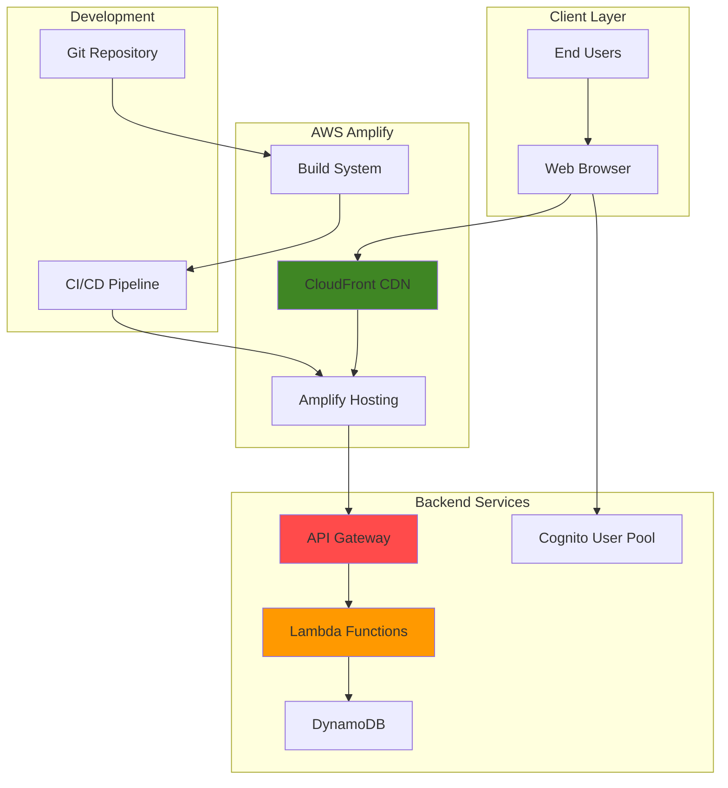

# Developing Web Apps with Amplify and Lambda

## Problem

Modern web applications require global scalability, cost-effective hosting, and seamless integration with backend services, but traditional server-based architectures struggle with unpredictable traffic patterns and high operational overhead. Development teams face challenges building full-stack applications that can handle sudden traffic spikes while maintaining low latency and minimizing infrastructure costs. Traditional hosting approaches require provisioning servers, managing scaling policies, and handling complex deployment pipelines that slow development velocity.

## Solution

AWS Amplify and Lambda provide a comprehensive serverless platform for building and deploying modern web applications. Amplify handles frontend hosting, continuous deployment, and backend resource provisioning, while Lambda functions provide scalable, event-driven backend logic. This architecture automatically scales based on demand, eliminates server management overhead, and integrates seamlessly with other AWS services like API Gateway for REST APIs and Cognito for user authentication.

## Architecture Diagram



## Prerequisites

1. AWS account with appropriate permissions for Amplify, Lambda, API Gateway, and Cognito
2. AWS CLI v2 installed and configured (or AWS CloudShell)
3. Node.js (v18 or later) and npm installed locally
4. Git installed and configured
5. Basic knowledge of JavaScript, React, and RESTful APIs
6. Estimated cost: $5-15 per month for development workloads

> **Note**: This recipe creates resources that incur charges. Monitor your usage and clean up resources when complete.

> **Warning**: Ensure your AWS CLI is configured with appropriate permissions for Amplify, Lambda, API Gateway, Cognito, and DynamoDB before proceeding. Missing permissions may cause deployment failures.

> **Tip**: Use Amplify's feature branch deployments to create isolated environments for each Git branch, enabling safe testing and review processes before production deployment. See [Amplify Documentation](https://docs.aws.amazon.com/amplify/latest/userguide/multi-environments.html) for details.

## Preparation

```bash
# Set environment variables
export AWS_REGION=$(aws configure get region)
export AWS_ACCOUNT_ID=$(aws sts get-caller-identity \
    --query Account --output text)

# Generate unique identifiers for resources
RANDOM_SUFFIX=$(aws secretsmanager get-random-password \
    --exclude-punctuation --exclude-uppercase \
    --password-length 6 --require-each-included-type \
    --output text --query RandomPassword)

export APP_NAME="serverless-web-app-${RANDOM_SUFFIX}"
export STACK_NAME="amplify-${APP_NAME}"
export LAMBDA_FUNCTION_NAME="api-${APP_NAME}"

# Create project directory
mkdir -p ~/amplify-projects/${APP_NAME}
cd ~/amplify-projects/${APP_NAME}

# Initialize React application
npx create-react-app frontend --template typescript
cd frontend

# Install Amplify CLI and libraries
npm install -g @aws-amplify/cli
npm install aws-amplify @aws-amplify/ui-react

echo "✅ AWS environment configured"
```

## Steps

1. **Initialize Amplify Project and Configure Backend**:

   AWS Amplify provides a complete development platform that simplifies full-stack application development by handling infrastructure provisioning, deployment, and management automatically. The Amplify CLI orchestrates the creation of backend resources including authentication (Cognito), APIs (API Gateway + Lambda), and storage (DynamoDB) while maintaining infrastructure as code principles through CloudFormation.

   ```bash
   # Initialize Amplify project
   amplify init --yes \
       --name ${APP_NAME} \
       --region ${AWS_REGION} \
       --profile default
   
   # Configure Amplify categories
   amplify add auth --defaults
   amplify add api --defaults
   amplify add storage --defaults
   
   echo "✅ Amplify project initialized with auth, API, and storage"
   ```

   This command creates the foundational Amplify project structure and provisions essential backend services. The auth category configures Amazon Cognito for secure user authentication, the API category sets up API Gateway with Lambda integration, and storage configures DynamoDB for persistent data. These services form the serverless backbone that eliminates server management while providing enterprise-grade scalability.

2. **Create Lambda Function for API Backend**:

   AWS Lambda enables serverless compute that automatically scales from zero to thousands of concurrent executions based on demand, making it ideal for API backends that experience variable traffic patterns. Lambda functions execute in a managed runtime environment with built-in high availability, automatic scaling, and pay-per-execution pricing that eliminates idle costs.

   ```bash
   # Create Lambda function directory
   mkdir -p amplify/backend/function/${LAMBDA_FUNCTION_NAME}/src
   
   # Create function source code
   cat > amplify/backend/function/${LAMBDA_FUNCTION_NAME}/src/index.js << 'EOF'
   const { DynamoDBClient } = require('@aws-sdk/client-dynamodb');
   const { DynamoDBDocumentClient, ScanCommand, PutCommand, \
       UpdateCommand, DeleteCommand } = require('@aws-sdk/lib-dynamodb');
   const { randomUUID } = require('crypto');
   
   const client = new DynamoDBClient({ region: process.env.AWS_REGION });
   const dynamodb = DynamoDBDocumentClient.from(client);
   
   exports.handler = async (event) => {
       console.log('Event:', JSON.stringify(event, null, 2));
       
       const { httpMethod, path, body } = event;
       const tableName = process.env.STORAGE_TODOLIST_NAME;
       
       const headers = {
           'Content-Type': 'application/json',
           'Access-Control-Allow-Origin': '*',
           'Access-Control-Allow-Headers': 'Content-Type',
           'Access-Control-Allow-Methods': 'GET,POST,PUT,DELETE,OPTIONS'
       };
       
       try {
           switch (httpMethod) {
               case 'GET':
                   return await getTodos(tableName, headers);
               case 'POST':
                   return await createTodo(tableName, JSON.parse(body), headers);
               case 'PUT':
                   return await updateTodo(tableName, JSON.parse(body), headers);
               case 'DELETE':
                   return await deleteTodo(tableName, event.pathParameters.id, headers);
               case 'OPTIONS':
                   return { statusCode: 200, headers };
               default:
                   return {
                       statusCode: 405,
                       headers,
                       body: JSON.stringify({ error: 'Method not allowed' })
                   };
           }
       } catch (error) {
           console.error('Error:', error);
           return {
               statusCode: 500,
               headers,
               body: JSON.stringify({ error: 'Internal server error' })
           };
       }
   };
   
   async function getTodos(tableName, headers) {
       const result = await dynamodb.send(new ScanCommand({
           TableName: tableName
       }));
       
       return {
           statusCode: 200,
           headers,
           body: JSON.stringify(result.Items || [])
       };
   }
   
   async function createTodo(tableName, todo, headers) {
       const item = {
           id: randomUUID(),
           ...todo,
           createdAt: new Date().toISOString()
       };
       
       await dynamodb.send(new PutCommand({
           TableName: tableName,
           Item: item
       }));
       
       return {
           statusCode: 201,
           headers,
           body: JSON.stringify(item)
       };
   }
   
   async function updateTodo(tableName, todo, headers) {
       await dynamodb.send(new UpdateCommand({
           TableName: tableName,
           Key: { id: todo.id },
           UpdateExpression: 'SET #title = :title, #completed = :completed',
           ExpressionAttributeNames: {
               '#title': 'title',
               '#completed': 'completed'
           },
           ExpressionAttributeValues: {
               ':title': todo.title,
               ':completed': todo.completed
           }
       }));
       
       return {
           statusCode: 200,
           headers,
           body: JSON.stringify(todo)
       };
   }
   
   async function deleteTodo(tableName, id, headers) {
       await dynamodb.send(new DeleteCommand({
           TableName: tableName,
           Key: { id }
       }));
       
       return {
           statusCode: 204,
           headers
       };
   }
   EOF
   
   echo "✅ Lambda function code created"
   ```

   The Lambda function implements a complete CRUD API using AWS SDK v3 for DynamoDB operations. The function handles HTTP method routing, implements proper error handling, and includes CORS headers for browser compatibility. This serverless approach eliminates the need for server provisioning, load balancing, or capacity planning while providing automatic scaling and fault tolerance.

3. **Create Lambda Function Configuration**:

   ```bash
   # Create Lambda function configuration
   cat > amplify/backend/function/${LAMBDA_FUNCTION_NAME}/function-parameters.json << EOF
   {
       "permissions": {
           "storage": {
               "todolist": ["read", "write"]
           }
       },
       "runtime": "nodejs20.x"
   }
   EOF
   
   # Create package.json for Lambda function
   cat > amplify/backend/function/${LAMBDA_FUNCTION_NAME}/src/package.json << 'EOF'
   {
       "name": "todo-api",
       "version": "1.0.0",
       "description": "Todo API Lambda function",
       "main": "index.js",
       "dependencies": {
           "@aws-sdk/client-dynamodb": "^3.0.0",
           "@aws-sdk/lib-dynamodb": "^3.0.0"
       }
   }
   EOF
   
   echo "✅ Lambda function configuration created"
   ```

4. **Create React Frontend Components**:

   The React frontend leverages Amplify's JavaScript libraries to seamlessly integrate with AWS services without requiring custom API clients or authentication handling. The Amplify UI components provide pre-built, accessible authentication flows while the core Amplify library manages API calls, authentication tokens, and error handling automatically.

   ```bash
   # Create main App component
   cat > src/App.tsx << 'EOF'
   import React, { useState, useEffect } from 'react';
   import { Amplify } from 'aws-amplify';
   import { withAuthenticator } from '@aws-amplify/ui-react';
   import '@aws-amplify/ui-react/styles.css';
   import { fetchAuthSession } from 'aws-amplify/auth';
   import awsExports from './aws-exports';
   import TodoList from './components/TodoList';
   import './App.css';
   
   Amplify.configure(awsExports);
   
   interface Todo {
       id: string;
       title: string;
       completed: boolean;
       createdAt: string;
   }
   
   function App({ signOut, user }: any) {
       const [todos, setTodos] = useState<Todo[]>([]);
       const [loading, setLoading] = useState(true);
       const [apiEndpoint, setApiEndpoint] = useState('');
   
       useEffect(() => {
           const getApiEndpoint = () => {
               const config = Amplify.getConfig();
               return config.API?.REST?.api?.endpoint || '';
           };
           
           setApiEndpoint(getApiEndpoint());
           fetchTodos();
       }, []);
   
       const fetchTodos = async () => {
           try {
               const session = await fetchAuthSession();
               const token = session.tokens?.idToken?.toString();
               
               const response = await fetch(`${apiEndpoint}/todos`, {
                   headers: {
                       'Authorization': `Bearer ${token}`,
                       'Content-Type': 'application/json'
                   }
               });
               
               if (response.ok) {
                   const data = await response.json();
                   setTodos(data);
               }
           } catch (error) {
               console.error('Error fetching todos:', error);
           } finally {
               setLoading(false);
           }
       };
   
       const createTodo = async (title: string) => {
           try {
               const session = await fetchAuthSession();
               const token = session.tokens?.idToken?.toString();
               
               const response = await fetch(`${apiEndpoint}/todos`, {
                   method: 'POST',
                   headers: {
                       'Authorization': `Bearer ${token}`,
                       'Content-Type': 'application/json',
                   },
                   body: JSON.stringify({ title, completed: false }),
               });
               
               if (response.ok) {
                   const newTodo = await response.json();
                   setTodos([...todos, newTodo]);
               }
           } catch (error) {
               console.error('Error creating todo:', error);
           }
       };
   
       const updateTodo = async (id: string, updates: Partial<Todo>) => {
           try {
               const session = await fetchAuthSession();
               const token = session.tokens?.idToken?.toString();
               const todo = todos.find(t => t.id === id);
               if (!todo) return;
   
               const response = await fetch(`${apiEndpoint}/todos/${id}`, {
                   method: 'PUT',
                   headers: {
                       'Authorization': `Bearer ${token}`,
                       'Content-Type': 'application/json',
                   },
                   body: JSON.stringify({ ...todo, ...updates }),
               });
               
               if (response.ok) {
                   const updatedTodo = await response.json();
                   setTodos(todos.map(t => t.id === id ? updatedTodo : t));
               }
           } catch (error) {
               console.error('Error updating todo:', error);
           }
       };
   
       const deleteTodo = async (id: string) => {
           try {
               const session = await fetchAuthSession();
               const token = session.tokens?.idToken?.toString();
               
               const response = await fetch(`${apiEndpoint}/todos/${id}`, {
                   method: 'DELETE',
                   headers: {
                       'Authorization': `Bearer ${token}`,
                   },
               });
               
               if (response.ok) {
                   setTodos(todos.filter(t => t.id !== id));
               }
           } catch (error) {
               console.error('Error deleting todo:', error);
           }
       };
   
       if (loading) {
           return <div className="loading">Loading...</div>;
       }
   
       return (
           <div className="App">
               <header className="App-header">
                   <h1>Serverless Todo App</h1>
                   <p>Welcome, {user.username}!</p>
                   <button onClick={signOut}>Sign Out</button>
               </header>
               <main>
                   <TodoList
                       todos={todos}
                       onCreateTodo={createTodo}
                       onUpdateTodo={updateTodo}
                       onDeleteTodo={deleteTodo}
                   />
               </main>
           </div>
       );
   }
   
   export default withAuthenticator(App);
   EOF
   
   # Create components directory
   mkdir -p src/components
   
   echo "✅ React frontend component created"
   ```

   The App component demonstrates modern React patterns with TypeScript for type safety and Amplify's `withAuthenticator` higher-order component for automatic authentication UI. This approach eliminates the need for custom login forms, token management, or session handling while providing a production-ready authentication experience.

5. **Create Todo List Component**:

   ```bash
   # Create TodoList component
   cat > src/components/TodoList.tsx << 'EOF'
   import React, { useState } from 'react';
   
   interface Todo {
       id: string;
       title: string;
       completed: boolean;
       createdAt: string;
   }
   
   interface TodoListProps {
       todos: Todo[];
       onCreateTodo: (title: string) => void;
       onUpdateTodo: (id: string, updates: Partial<Todo>) => void;
       onDeleteTodo: (id: string) => void;
   }
   
   const TodoList: React.FC<TodoListProps> = ({
       todos,
       onCreateTodo,
       onUpdateTodo,
       onDeleteTodo,
   }) => {
       const [newTodoTitle, setNewTodoTitle] = useState('');
   
       const handleSubmit = (e: React.FormEvent) => {
           e.preventDefault();
           if (newTodoTitle.trim()) {
               onCreateTodo(newTodoTitle.trim());
               setNewTodoTitle('');
           }
       };
   
       return (
           <div className="todo-list">
               <form onSubmit={handleSubmit} className="todo-form">
                   <input
                       type="text"
                       value={newTodoTitle}
                       onChange={(e) => setNewTodoTitle(e.target.value)}
                       placeholder="Add a new todo..."
                       className="todo-input"
                   />
                   <button type="submit" className="todo-submit">
                       Add Todo
                   </button>
               </form>
   
               <div className="todos">
                   {todos.map((todo) => (
                       <div key={todo.id} className="todo-item">
                           <input
                               type="checkbox"
                               checked={todo.completed}
                               onChange={(e) =>
                                   onUpdateTodo(todo.id, {
                                       completed: e.target.checked,
                                   })
                               }
                           />
                           <span
                               className={`todo-title ${
                                   todo.completed ? 'completed' : ''
                               }`}
                           >
                               {todo.title}
                           </span>
                           <button
                               onClick={() => onDeleteTodo(todo.id)}
                               className="todo-delete"
                           >
                               Delete
                           </button>
                       </div>
                   ))}
               </div>
   
               {todos.length === 0 && (
                   <div className="no-todos">
                       No todos yet. Add one above!
                   </div>
               )}
           </div>
       );
   };
   
   export default TodoList;
   EOF
   
   echo "✅ TodoList component created"
   ```

6. **Add CSS Styling**:

   ```bash
   # Create comprehensive CSS styles
   cat > src/App.css << 'EOF'
   .App {
       text-align: center;
       min-height: 100vh;
       background: linear-gradient(135deg, #667eea 0%, #764ba2 100%);
   }
   
   .App-header {
       background-color: rgba(255, 255, 255, 0.1);
       padding: 2rem;
       color: white;
       box-shadow: 0 4px 6px rgba(0, 0, 0, 0.1);
   }
   
   .App-header h1 {
       margin: 0 0 1rem 0;
       font-size: 2.5rem;
       font-weight: 300;
   }
   
   .App-header p {
       margin: 0 0 1rem 0;
       font-size: 1.2rem;
   }
   
   .App-header button {
       background-color: #ff4757;
       color: white;
       border: none;
       padding: 0.5rem 1rem;
       border-radius: 4px;
       cursor: pointer;
       font-size: 1rem;
       transition: background-color 0.3s;
   }
   
   .App-header button:hover {
       background-color: #ff3838;
   }
   
   main {
       max-width: 600px;
       margin: 2rem auto;
       padding: 0 1rem;
   }
   
   .loading {
       display: flex;
       justify-content: center;
       align-items: center;
       height: 100vh;
       font-size: 1.5rem;
       color: white;
   }
   
   .todo-list {
       background: white;
       border-radius: 8px;
       box-shadow: 0 10px 30px rgba(0, 0, 0, 0.2);
       overflow: hidden;
   }
   
   .todo-form {
       display: flex;
       padding: 1rem;
       background-color: #f8f9fa;
       border-bottom: 1px solid #e9ecef;
   }
   
   .todo-input {
       flex: 1;
       padding: 0.75rem;
       border: 1px solid #dee2e6;
       border-radius: 4px 0 0 4px;
       font-size: 1rem;
       outline: none;
   }
   
   .todo-input:focus {
       border-color: #667eea;
       box-shadow: 0 0 0 2px rgba(102, 126, 234, 0.2);
   }
   
   .todo-submit {
       padding: 0.75rem 1.5rem;
       background-color: #667eea;
       color: white;
       border: none;
       border-radius: 0 4px 4px 0;
       cursor: pointer;
       font-size: 1rem;
       transition: background-color 0.3s;
   }
   
   .todo-submit:hover {
       background-color: #5a67d8;
   }
   
   .todos {
       min-height: 200px;
   }
   
   .todo-item {
       display: flex;
       align-items: center;
       padding: 1rem;
       border-bottom: 1px solid #e9ecef;
       transition: background-color 0.3s;
   }
   
   .todo-item:hover {
       background-color: #f8f9fa;
   }
   
   .todo-item:last-child {
       border-bottom: none;
   }
   
   .todo-item input[type="checkbox"] {
       margin-right: 1rem;
       transform: scale(1.2);
   }
   
   .todo-title {
       flex: 1;
       text-align: left;
       font-size: 1.1rem;
       transition: all 0.3s;
   }
   
   .todo-title.completed {
       text-decoration: line-through;
       color: #6c757d;
   }
   
   .todo-delete {
       background-color: #ff4757;
       color: white;
       border: none;
       padding: 0.5rem 1rem;
       border-radius: 4px;
       cursor: pointer;
       font-size: 0.9rem;
       transition: background-color 0.3s;
   }
   
   .todo-delete:hover {
       background-color: #ff3838;
   }
   
   .no-todos {
       padding: 3rem;
       color: #6c757d;
       font-size: 1.1rem;
   }
   EOF
   
   echo "✅ CSS styling added"
   ```

7. **Deploy Backend Resources**:

   The Amplify deployment process uses AWS CloudFormation to provision and configure all backend resources in a coordinated manner. This infrastructure-as-code approach ensures reproducible deployments, proper resource dependencies, and automatic rollback capabilities if any deployment step fails.

   ```bash
   # Deploy Amplify backend
   amplify push --yes
   
   # Wait for deployment to complete
   echo "⏳ Waiting for backend deployment..."
   sleep 30
   
   # Verify backend deployment
   amplify status
   
   echo "✅ Backend resources deployed"
   ```

   The deployment creates a complete serverless backend stack including Cognito User Pool for authentication, API Gateway REST API, Lambda functions, and DynamoDB table. All resources are properly configured with IAM roles, security policies, and integration settings to work together seamlessly.

8. **Configure Hosting and Deploy Frontend**:

   Amplify Hosting provides a complete CI/CD solution with global content delivery through Amazon CloudFront. The hosting service builds your React application, optimizes assets, and deploys to a global CDN with automatic HTTPS certificates and custom domain support. This eliminates the need for separate build pipelines, CDN configuration, or SSL certificate management.

   ```bash
   # Add Amplify hosting
   amplify add hosting
   
   # Build the React application
   npm run build
   
   # Deploy to Amplify hosting
   amplify publish --yes
   
   echo "✅ Frontend deployed to Amplify hosting"
   ```

   The React application is now globally distributed through CloudFront CDN, providing low-latency access for users worldwide. Amplify hosting automatically handles build optimization, asset compression, and cache invalidation, ensuring optimal performance without manual configuration.

9. **Configure Lambda Function Environment Variables**:

   Environment variables enable Lambda functions to access configuration data and resource identifiers without hardcoding values in source code. This approach follows security best practices by keeping resource names and configuration separate from application logic while enabling the same function code to work across different environments (development, staging, production).

   ```bash
   # Get DynamoDB table name
   TABLE_NAME=$(aws dynamodb list-tables \
       --query "TableNames[?contains(@, '${APP_NAME}')]" \
       --output text)
   
   # Update Lambda function environment variables
   aws lambda update-function-configuration \
       --function-name ${LAMBDA_FUNCTION_NAME} \
       --environment Variables="{STORAGE_TODOLIST_NAME=${TABLE_NAME}}"
   
   echo "✅ Lambda environment variables configured"
   ```

   The Lambda function can now dynamically discover and connect to the DynamoDB table created by Amplify. This configuration pattern enables environment-specific deployments while maintaining security and flexibility in resource management.

10. **Add Monitoring and Logging**:

    CloudWatch provides comprehensive monitoring and logging for serverless applications, enabling observability into function performance, error rates, and operational metrics. Setting up proper monitoring is essential for production applications to quickly identify and resolve issues, optimize performance, and maintain service level agreements.

    ```bash
    # Enable CloudWatch Logs for Lambda
    aws logs create-log-group \
        --log-group-name /aws/lambda/${LAMBDA_FUNCTION_NAME}
    
    # Create CloudWatch Dashboard
    aws cloudwatch put-dashboard \
        --dashboard-name ${APP_NAME}-dashboard \
        --dashboard-body "{
            \"widgets\": [
                {
                    \"type\": \"metric\",
                    \"properties\": {
                        \"metrics\": [
                            [\"AWS/Lambda\", \"Duration\", \"FunctionName\", \"${LAMBDA_FUNCTION_NAME}\"],
                            [\"AWS/Lambda\", \"Errors\", \"FunctionName\", \"${LAMBDA_FUNCTION_NAME}\"],
                            [\"AWS/Lambda\", \"Invocations\", \"FunctionName\", \"${LAMBDA_FUNCTION_NAME}\"]
                        ],
                        \"period\": 300,
                        \"stat\": \"Average\",
                        \"region\": \"${AWS_REGION}\",
                        \"title\": \"Lambda Metrics\"
                    }
                }
            ]
        }"
    
    echo "✅ Monitoring and logging configured"
    ```

    The monitoring setup provides real-time visibility into Lambda function performance including execution duration, error rates, and invocation counts. The CloudWatch dashboard enables proactive monitoring and alerting to ensure optimal application performance and rapid issue resolution.

## Validation & Testing

1. **Verify Amplify App Deployment**:

   ```bash
   # Check Amplify app status
   amplify status
   
   # Get app URL
   APP_URL=$(amplify console --app)
   echo "App deployed at: $APP_URL"
   ```

   Expected output: All services should show as "Current" status

2. **Test Lambda Function**:

   ```bash
   # Test Lambda function directly
   aws lambda invoke \
       --function-name ${LAMBDA_FUNCTION_NAME} \
       --payload '{"httpMethod":"GET","path":"/todos"}' \
       --cli-binary-format raw-in-base64-out \
       /tmp/lambda-response.json
   
   # Check response
   cat /tmp/lambda-response.json
   ```

3. **Test API Gateway Endpoints**:

   ```bash
   # Get API Gateway endpoint
   API_ENDPOINT=$(aws apigateway get-rest-apis \
       --query "items[?name=='${APP_NAME}-api'].id" \
       --output text)
   
   # Test GET endpoint
   curl -X GET "https://${API_ENDPOINT}.execute-api.${AWS_REGION}.amazonaws.com/dev/todos"
   
   # Test POST endpoint
   curl -X POST "https://${API_ENDPOINT}.execute-api.${AWS_REGION}.amazonaws.com/dev/todos" \
       -H "Content-Type: application/json" \
       -d '{"title":"Test Todo","completed":false}'
   ```

4. **Test Frontend Application**:

   ```bash
   # Start local development server
   npm start
   
   # Test authentication flow
   echo "✅ Open http://localhost:3000 and test:"
   echo "- User registration/login"
   echo "- Create new todos"
   echo "- Mark todos as complete"
   echo "- Delete todos"
   ```

5. **Verify Auto-Scaling and Performance**:

   ```bash
   # Test concurrent requests
   for i in {1..10}; do
       curl -X GET "https://${API_ENDPOINT}.execute-api.${AWS_REGION}.amazonaws.com/dev/todos" &
   done
   wait
   
   # Check CloudWatch metrics
   aws cloudwatch get-metric-statistics \
       --namespace AWS/Lambda \
       --metric-name Invocations \
       --dimensions Name=FunctionName,Value=${LAMBDA_FUNCTION_NAME} \
       --start-time $(date -u -d '5 minutes ago' +%Y-%m-%dT%H:%M:%S) \
       --end-time $(date -u +%Y-%m-%dT%H:%M:%S) \
       --period 300 \
       --statistics Sum
   ```

## Cleanup

1. **Delete Amplify Resources**:

   ```bash
   # Delete Amplify app and all resources
   amplify delete --yes
   
   echo "✅ Amplify resources deleted"
   ```

2. **Remove Lambda Function**:

   ```bash
   # Delete Lambda function
   aws lambda delete-function \
       --function-name ${LAMBDA_FUNCTION_NAME}
   
   echo "✅ Lambda function deleted"
   ```

3. **Clean up CloudWatch Resources**:

   ```bash
   # Delete CloudWatch dashboard
   aws cloudwatch delete-dashboards \
       --dashboard-names ${APP_NAME}-dashboard
   
   # Delete log group
   aws logs delete-log-group \
       --log-group-name /aws/lambda/${LAMBDA_FUNCTION_NAME}
   
   echo "✅ CloudWatch resources deleted"
   ```

4. **Remove Local Files**:

   ```bash
   # Clean up local project files
   cd ~
   rm -rf ~/amplify-projects/${APP_NAME}
   rm -f /tmp/lambda-response.json
   
   # Unset environment variables
   unset APP_NAME STACK_NAME LAMBDA_FUNCTION_NAME
   
   echo "✅ Local files cleaned up"
   ```

## Discussion

This serverless web application architecture demonstrates the power of combining AWS Amplify with Lambda functions for modern web development. Amplify provides a complete development platform that handles frontend hosting, continuous deployment, and backend resource provisioning, while Lambda functions offer unlimited scalability and cost-effective compute for API endpoints. The integration between these services creates a robust, production-ready application that can handle varying traffic loads without manual scaling interventions.

The architecture follows serverless best practices by implementing event-driven processing, stateless Lambda functions, and managed services for authentication and data storage. Cognito User Pools provide secure authentication without requiring custom user management code, while DynamoDB offers single-digit millisecond performance for data operations. The API Gateway integration enables RESTful API design patterns while automatically handling request routing, throttling, and monitoring.

Cost optimization is inherent in this serverless approach, as you only pay for actual usage rather than provisioned capacity. Lambda functions scale automatically from zero to thousands of concurrent executions, making this architecture ideal for applications with unpredictable or intermittent traffic patterns. The Amplify hosting service provides global content delivery through CloudFront, ensuring low latency for users worldwide while maintaining cost-effectiveness through automatic optimization.

One of the key advantages of this architecture is the developer experience and deployment velocity it enables. The Amplify CLI streamlines the development workflow by automating resource provisioning, environment management, and deployment processes. Developers can focus on application logic rather than infrastructure concerns, significantly reducing time-to-market for new features and applications. For comprehensive guidance on serverless best practices, see the [AWS Well-Architected Serverless Applications Lens](https://docs.aws.amazon.com/wellarchitected/latest/serverless-applications-lens/welcome.html).

> **Note**: This architecture aligns with the AWS Well-Architected Framework principles, particularly focusing on operational excellence, security, reliability, performance efficiency, and cost optimization for serverless applications.

## Challenge

Extend this solution by implementing these enhancements:

1. **Add Real-time Updates**: Implement WebSocket connections using AWS AppSync or API Gateway WebSockets to enable real-time todo synchronization across multiple clients and devices.

2. **Implement Offline Support**: Use Amplify DataStore to add offline-first capabilities, allowing users to create and modify todos without internet connectivity and sync changes when reconnected.

3. **Add File Upload Capabilities**: Integrate S3 storage to enable file attachments for todos, including image uploads with automatic resizing using Lambda and thumbnail generation.

4. **Implement Advanced Security**: Add API key authentication, rate limiting with AWS WAF, and implement field-level encryption for sensitive todo data using AWS KMS.

5. **Create Analytics Dashboard**: Integrate Amazon Pinpoint for user analytics and create a business intelligence dashboard using Amazon QuickSight to track application usage patterns and user engagement metrics.

## Infrastructure Code

### Available Infrastructure as Code:

- [Infrastructure Code Overview](code/README.md) - Detailed description of all infrastructure components
- [AWS CDK (Python)](code/cdk-python/) - AWS CDK Python implementation
- [AWS CDK (TypeScript)](code/cdk-typescript/) - AWS CDK TypeScript implementation
- [CloudFormation](code/cloudformation.yaml) - AWS CloudFormation template
- [Bash CLI Scripts](code/scripts/) - Example bash scripts using AWS CLI commands to deploy infrastructure
- [Terraform](code/terraform/) - Terraform configuration files