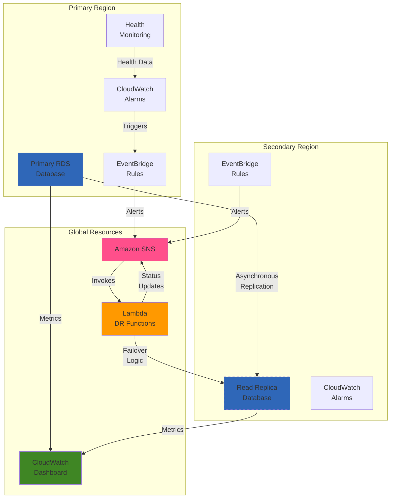

# Implementing Disaster Recovery for Amazon RDS Databases

## Problem

Your organization runs critical business applications on Amazon RDS databases. Currently, you have a single-region deployment with automated backups but no comprehensive disaster recovery (DR) strategy. In case of a regional outage, database corruption, or accidental data deletion, recovery could take hours or even days, resulting in extended downtime, data loss, and significant business impact. The IT team needs a robust disaster recovery solution that ensures business continuity with minimal data loss (low RPO) and rapid recovery time (low RTO) while balancing cost considerations.

## Solution

Implement a comprehensive disaster recovery strategy for Amazon RDS databases using cross-region read replicas, automated monitoring, and controlled failover procedures. This solution leverages RDS read replicas for real-time data replication to a secondary region, EventBridge and Lambda for automated monitoring and notifications, and well-defined processes for both planned and emergency failovers. The architecture includes continuous health monitoring, automated recovery testing, and a centralized dashboard for database health metrics. By implementing this solution, you'll reduce Recovery Time Objective (RTO) to minutes instead of hours and minimize data loss with a Recovery Point Objective (RPO) approaching zero.

## Architecture Diagram



## Prerequisites

1. AWS account with permissions to create and manage RDS instances, Lambda functions, EventBridge rules, and SNS topics
2. AWS CLI v2 installed and configured with appropriate credentials
3. Existing RDS MySQL or PostgreSQL database instance running in your primary region
4. Basic understanding of database concepts, RDS features, and disaster recovery principles
5. Two AWS regions selected: a primary region (where your database runs) and a secondary region (for disaster recovery)
6. Estimated monthly cost: Primary RDS instance (varies based on size), Read Replica instance (approximately equal to primary instance cost), Data transfer between regions ($0.02/GB), SNS ($0.50 per million notifications), Lambda (minimal for monitoring functions)

> **Note**: This recipe focuses on MySQL or PostgreSQL RDS instances. For Amazon Aurora databases, consider using Aurora Global Database instead, which provides similar functionality with more advanced features specific to Aurora.

## Preparation

```bash
# Set environment variables
export AWS_REGION=$(aws configure get region)
export AWS_ACCOUNT_ID=$(aws sts get-caller-identity \
    --query Account --output text)

read -p "Enter secondary region for DR (e.g., us-west-2): " SECONDARY_REGION
export SECONDARY_REGION

# List existing RDS instances in primary region
aws rds describe-db-instances \
    --region $AWS_REGION \
    --query "DBInstances[].{DBInstanceIdentifier:DBInstanceIdentifier,Engine:Engine,Status:DBInstanceStatus}" \
    --output table

read -p "Enter the source DB instance identifier: " DB_IDENTIFIER
export DB_IDENTIFIER

# Verify that the database exists and get its details
DB_ARN=$(aws rds describe-db-instances \
    --db-instance-identifier $DB_IDENTIFIER \
    --region $AWS_REGION \
    --query "DBInstances[0].DBInstanceArn" \
    --output text)

if [ -z "$DB_ARN" ]; then
    echo "❌ Database $DB_IDENTIFIER not found in $AWS_REGION!"
    exit 1
fi

# Check database engine type
DB_ENGINE=$(aws rds describe-db-instances \
    --db-instance-identifier $DB_IDENTIFIER \
    --region $AWS_REGION \
    --query "DBInstances[0].Engine" \
    --output text)

if [[ "$DB_ENGINE" != "mysql" && "$DB_ENGINE" != "postgres" ]]; then
    echo "❌ This recipe supports MySQL or PostgreSQL engines only."
    echo "Detected engine: $DB_ENGINE"
    exit 1
fi

# Generate unique identifiers for resources
RANDOM_SUFFIX=$(aws secretsmanager get-random-password \
    --exclude-punctuation --exclude-uppercase \
    --password-length 6 --require-each-included-type \
    --output text --query RandomPassword)

# Define resource names
export REPLICA_NAME="${DB_IDENTIFIER}-replica-${RANDOM_SUFFIX}"
export TOPIC_NAME="rds-dr-notifications-${RANDOM_SUFFIX}"
export LAMBDA_NAME="rds-dr-manager-${RANDOM_SUFFIX}"
export DASHBOARD_NAME="rds-dr-dashboard-${RANDOM_SUFFIX}"

echo "✅ Configuration Complete"
echo "Primary Database: $DB_IDENTIFIER in $AWS_REGION"
echo "Read Replica will be created as: $REPLICA_NAME in $SECONDARY_REGION"
```

## Steps

1. **Create cross-region read replica for disaster recovery**:

   Cross-region read replicas provide asynchronous replication of your primary database to a different AWS region. This creates a real-time copy of your data that can be promoted to a standalone database instance during a disaster recovery scenario. The replica maintains near real-time synchronization with the primary database, ensuring minimal data loss during failover.

   ```bash
   # Check if the database instance is Multi-AZ
   IS_MULTI_AZ=$(aws rds describe-db-instances \
       --db-instance-identifier $DB_IDENTIFIER \
       --region $AWS_REGION \
       --query "DBInstances[0].MultiAZ" \
       --output text)
       
   echo "Creating cross-region read replica. This may take 15-30 minutes..."
   
   # Create cross-region read replica
   aws rds create-db-instance-read-replica \
       --db-instance-identifier $REPLICA_NAME \
       --source-db-instance-identifier $DB_ARN \
       --region $SECONDARY_REGION \
       --multi-az $IS_MULTI_AZ \
       --db-instance-class $(aws rds describe-db-instances \
           --db-instance-identifier $DB_IDENTIFIER \
           --region $AWS_REGION \
           --query "DBInstances[0].DBInstanceClass" \
           --output text) \
       --tags "Key=Purpose,Value=DisasterRecovery"
   
   echo "✅ Read replica creation initiated: $REPLICA_NAME in $SECONDARY_REGION"
   ```

   RDS read replicas use asynchronous replication, which means there's typically a small lag between the primary and replica databases. This lag is usually measured in seconds but can vary based on network conditions and workload. Monitor replica lag closely using [CloudWatch metrics](https://docs.aws.amazon.com/AmazonRDS/latest/UserGuide/monitoring-cloudwatch.html) for optimal disaster recovery planning. The [Working with DB instance read replicas](https://docs.aws.amazon.com/AmazonRDS/latest/UserGuide/USER_ReadRepl.html) documentation provides comprehensive guidance on managing read replicas across different database engines.

2. **Create SNS topics for comprehensive monitoring and alerts**:

   SNS topics provide the communication backbone for your disaster recovery solution. By creating topics in both regions, you ensure that notifications can be sent regardless of which region is experiencing issues. This multi-region approach maintains communication channels even during a regional failure.

   ```bash
   # Create SNS topic in primary region
   PRIMARY_TOPIC_ARN=$(aws sns create-topic \
       --name $TOPIC_NAME \
       --region $AWS_REGION \
       --query 'TopicArn' \
       --output text)
       
   # Create SNS topic in secondary region
   SECONDARY_TOPIC_ARN=$(aws sns create-topic \
       --name $TOPIC_NAME \
       --region $SECONDARY_REGION \
       --query 'TopicArn' \
       --output text)
       
   # Subscribe an email to the SNS topic for notifications
   read -p "Enter email address for DR notifications (leave empty to skip): " EMAIL_ADDRESS
   
   if [[ ! -z "$EMAIL_ADDRESS" ]]; then
       aws sns subscribe \
           --topic-arn $PRIMARY_TOPIC_ARN \
           --protocol email \
           --notification-endpoint $EMAIL_ADDRESS \
           --region $AWS_REGION
           
       aws sns subscribe \
           --topic-arn $SECONDARY_TOPIC_ARN \
           --protocol email \
           --notification-endpoint $EMAIL_ADDRESS \
           --region $SECONDARY_REGION
           
       echo "✅ Added email subscription to SNS topics (check your email to confirm)"
   fi
   
   export PRIMARY_TOPIC_ARN
   export SECONDARY_TOPIC_ARN
   echo "✅ Created SNS topics for notifications"
   ```

3. **Set up comprehensive CloudWatch alarms for database health monitoring**:

   CloudWatch alarms provide proactive monitoring of your database health and performance. The alarms monitor critical metrics like CPU utilization, replica lag, and connection health. When thresholds are breached, automated notifications are sent through SNS, enabling rapid response to potential issues before they become disasters.

   ```bash
   # Create CloudWatch alarm for primary database high CPU usage
   aws cloudwatch put-metric-alarm \
       --alarm-name "${DB_IDENTIFIER}-HighCPU" \
       --metric-name CPUUtilization \
       --namespace AWS/RDS \
       --statistic Average \
       --period 300 \
       --evaluation-periods 3 \
       --threshold 80 \
       --comparison-operator GreaterThanOrEqualToThreshold \
       --dimensions "Name=DBInstanceIdentifier,Value=$DB_IDENTIFIER" \
       --alarm-actions $PRIMARY_TOPIC_ARN \
       --region $AWS_REGION
       
   # Create CloudWatch alarm for replica lag monitoring
   aws cloudwatch put-metric-alarm \
       --alarm-name "${REPLICA_NAME}-ReplicaLag" \
       --metric-name ReplicaLag \
       --namespace AWS/RDS \
       --statistic Average \
       --period 300 \
       --evaluation-periods 2 \
       --threshold 300 \
       --comparison-operator GreaterThanOrEqualToThreshold \
       --dimensions "Name=DBInstanceIdentifier,Value=$REPLICA_NAME" \
       --alarm-actions $SECONDARY_TOPIC_ARN \
       --region $SECONDARY_REGION
   
   # Create alarm for primary database connection failures
   aws cloudwatch put-metric-alarm \
       --alarm-name "${DB_IDENTIFIER}-DatabaseConnections" \
       --metric-name DatabaseConnections \
       --namespace AWS/RDS \
       --statistic Average \
       --period 300 \
       --evaluation-periods 2 \
       --threshold 0 \
       --comparison-operator LessThanThreshold \
       --dimensions "Name=DBInstanceIdentifier,Value=$DB_IDENTIFIER" \
       --alarm-actions $PRIMARY_TOPIC_ARN \
       --region $AWS_REGION \
       --treat-missing-data notBreaching
   
   echo "✅ Created CloudWatch alarms for database monitoring"
   ```

   > **Tip**: Consider implementing additional alarms for metrics such as free storage space, read/write latency, and IOPS. These metrics can help identify performance degradation before it impacts your applications. For comprehensive monitoring guidance, refer to the [RDS monitoring with CloudWatch](https://docs.aws.amazon.com/AmazonRDS/latest/UserGuide/monitoring-cloudwatch.html) documentation.

4. **Create Lambda function for automated disaster recovery management**:

   The Lambda function serves as the intelligent orchestration layer for disaster recovery operations. It can automatically evaluate database health, initiate failover procedures, and coordinate notifications across your infrastructure team.

   ```bash
   # Create IAM role for Lambda function
   cat > lambda-trust-policy.json << 'EOF'
   {
     "Version": "2012-10-17",
     "Statement": [
       {
         "Effect": "Allow",
         "Principal": {
           "Service": "lambda.amazonaws.com"
         },
         "Action": "sts:AssumeRole"
       }
     ]
   }
   EOF
   
   aws iam create-role \
       --role-name "${LAMBDA_NAME}-role" \
       --assume-role-policy-document file://lambda-trust-policy.json
   
   # Create and attach policy for RDS and SNS operations
   cat > lambda-execution-policy.json << EOF
   {
     "Version": "2012-10-17",
     "Statement": [
       {
         "Effect": "Allow",
         "Action": [
           "logs:CreateLogGroup",
           "logs:CreateLogStream",
           "logs:PutLogEvents"
         ],
         "Resource": "arn:aws:logs:*:*:*"
       },
       {
         "Effect": "Allow",
         "Action": [
           "rds:DescribeDBInstances",
           "rds:PromoteReadReplica",
           "rds:ModifyDBInstance"
         ],
         "Resource": "*"
       },
       {
         "Effect": "Allow",
         "Action": [
           "sns:Publish"
         ],
         "Resource": [
           "$PRIMARY_TOPIC_ARN",
           "$SECONDARY_TOPIC_ARN"
         ]
       }
     ]
   }
   EOF
   
   aws iam put-role-policy \
       --role-name "${LAMBDA_NAME}-role" \
       --policy-name "DrLambdaExecutionPolicy" \
       --policy-document file://lambda-execution-policy.json
   
   echo "✅ Created IAM role and policies for Lambda function"
   ```

5. **Deploy Lambda function with disaster recovery logic**:

   The Lambda function provides intelligent automation for disaster recovery scenarios. It analyzes CloudWatch alarms, evaluates database health, and can initiate appropriate responses including notifications, escalations, and automated recovery procedures.

   ```bash
   # Create Lambda function code
   cat > dr_manager.py << 'EOF'
   import json
   import boto3
   import datetime
   import os
   
   def lambda_handler(event, context):
       """
       Disaster Recovery Manager for RDS
       Handles automated failover and notification logic
       """
       
       rds = boto3.client('rds')
       sns = boto3.client('sns')
       
       # Parse the CloudWatch alarm event
       message = json.loads(event['Records'][0]['Sns']['Message'])
       alarm_name = message['AlarmName']
       new_state = message['NewStateValue']
       reason = message['NewStateReason']
       
       # Determine the action based on alarm type
       if 'HighCPU' in alarm_name and new_state == 'ALARM':
           return handle_high_cpu_alert(alarm_name, reason, sns)
       elif 'ReplicaLag' in alarm_name and new_state == 'ALARM':
           return handle_replica_lag_alert(alarm_name, reason, sns)
       elif 'DatabaseConnections' in alarm_name and new_state == 'ALARM':
           return handle_connection_failure(alarm_name, reason, sns, rds)
       
       return {
           'statusCode': 200,
           'body': json.dumps('No action required')
       }
   
   def handle_high_cpu_alert(alarm_name, reason, sns):
       """Handle high CPU utilization alerts"""
       message = f"HIGH CPU ALERT: {alarm_name}\\nReason: {reason}\\nRecommendation: Monitor performance and consider scaling."
       
       sns.publish(
           TopicArn=os.environ['SNS_TOPIC_ARN'],
           Subject='RDS Performance Alert',
           Message=message
       )
       
       return {'statusCode': 200, 'body': 'High CPU alert processed'}
   
   def handle_replica_lag_alert(alarm_name, reason, sns):
       """Handle replica lag alerts"""
       message = f"REPLICA LAG ALERT: {alarm_name}\\nReason: {reason}\\nRecommendation: Check network connectivity and primary database load."
       
       sns.publish(
           TopicArn=os.environ['SNS_TOPIC_ARN'],
           Subject='RDS Replica Lag Alert',
           Message=message
       )
       
       return {'statusCode': 200, 'body': 'Replica lag alert processed'}
   
   def handle_connection_failure(alarm_name, reason, sns, rds):
       """Handle database connection failures - potential failover scenario"""
       
       # Extract database identifier from alarm name
       db_identifier = alarm_name.split('-')[0]
       
       # Check database status
       try:
           response = rds.describe_db_instances(DBInstanceIdentifier=db_identifier)
           db_status = response['DBInstances'][0]['DBInstanceStatus']
           
           if db_status not in ['available']:
               message = f"CRITICAL DATABASE ALERT: {alarm_name}\\nDatabase Status: {db_status}\\nReason: {reason}\\n\\nThis may require manual intervention or failover to DR region."
               
               sns.publish(
                   TopicArn=os.environ['SNS_TOPIC_ARN'],
                   Subject='CRITICAL: RDS Database Alert - Action Required',
                   Message=message
               )
               
       except Exception as e:
           error_message = f"ERROR: Could not check database status for {db_identifier}\\nError: {str(e)}\\nImmediate manual investigation required."
           
           sns.publish(
               TopicArn=os.environ['SNS_TOPIC_ARN'],
               Subject='CRITICAL: RDS Monitoring Error',
               Message=error_message
           )
       
       return {'statusCode': 200, 'body': 'Connection failure alert processed'}
   EOF
   
   # Create deployment package
   zip dr_manager.zip dr_manager.py
   
   # Deploy Lambda function
   LAMBDA_ROLE_ARN="arn:aws:iam::${AWS_ACCOUNT_ID}:role/${LAMBDA_NAME}-role"
   
   aws lambda create-function \
       --function-name $LAMBDA_NAME \
       --runtime python3.12 \
       --role $LAMBDA_ROLE_ARN \
       --handler dr_manager.lambda_handler \
       --zip-file fileb://dr_manager.zip \
       --timeout 300 \
       --memory-size 256 \
       --environment Variables="{SNS_TOPIC_ARN=${PRIMARY_TOPIC_ARN}}" \
       --region $AWS_REGION
   
   echo "✅ Lambda function deployed for disaster recovery management"
   ```

   > **Warning**: Automated failover should be carefully tested in non-production environments before implementation. Consider implementing manual approval workflows for production failover scenarios to prevent unintended data loss or service disruption. Review [Multi-AZ deployments](https://docs.aws.amazon.com/AmazonRDS/latest/UserGuide/Concepts.MultiAZ.html) and [RDS best practices](https://docs.aws.amazon.com/AmazonRDS/latest/UserGuide/CHAP_BestPractices.html) before enabling automatic promotion.

6. **Create EventBridge rules to connect alarms with Lambda automation**:

   EventBridge integration enables real-time processing of CloudWatch alarms through your Lambda function. This creates an automated response system that can evaluate and respond to database health events without manual intervention.

   ```bash
   # Subscribe Lambda function to SNS topic for alarm processing
   aws sns subscribe \
       --topic-arn $PRIMARY_TOPIC_ARN \
       --protocol lambda \
       --notification-endpoint "arn:aws:lambda:${AWS_REGION}:${AWS_ACCOUNT_ID}:function:${LAMBDA_NAME}" \
       --region $AWS_REGION
   
   # Grant SNS permission to invoke Lambda function
   aws lambda add-permission \
       --function-name $LAMBDA_NAME \
       --statement-id sns-trigger \
       --action lambda:InvokeFunction \
       --principal sns.amazonaws.com \
       --source-arn $PRIMARY_TOPIC_ARN \
       --region $AWS_REGION
   
   echo "✅ EventBridge rules configured for automated alarm processing"
   ```

7. **Create comprehensive CloudWatch dashboard for disaster recovery monitoring**:

   The CloudWatch dashboard provides a centralized view of your disaster recovery infrastructure health. It displays key metrics from both primary and replica databases, enabling quick assessment of system status and identification of potential issues.

   ```bash
   # Wait for read replica to be available before creating dashboard
   echo "Waiting for read replica to become available..."
   aws rds wait db-instance-available \
       --db-instance-identifier $REPLICA_NAME \
       --region $SECONDARY_REGION
   
   # Create CloudWatch dashboard configuration
   cat > dashboard-config.json << EOF
   {
     "widgets": [
       {
         "type": "metric",
         "x": 0, "y": 0, "width": 12, "height": 6,
         "properties": {
           "metrics": [
             ["AWS/RDS", "CPUUtilization", "DBInstanceIdentifier", "$DB_IDENTIFIER"],
             ["AWS/RDS", "CPUUtilization", "DBInstanceIdentifier", "$REPLICA_NAME"]
           ],
           "view": "timeSeries",
           "stacked": false,
           "region": "$AWS_REGION",
           "title": "Database CPU Utilization",
           "period": 300
         }
       },
       {
         "type": "metric",
         "x": 12, "y": 0, "width": 12, "height": 6,
         "properties": {
           "metrics": [
             ["AWS/RDS", "ReplicaLag", "DBInstanceIdentifier", "$REPLICA_NAME"]
           ],
           "view": "timeSeries",
           "stacked": false,
           "region": "$SECONDARY_REGION",
           "title": "Read Replica Lag (seconds)",
           "period": 300
         }
       },
       {
         "type": "metric",
         "x": 0, "y": 6, "width": 24, "height": 6,
         "properties": {
           "metrics": [
             ["AWS/RDS", "DatabaseConnections", "DBInstanceIdentifier", "$DB_IDENTIFIER"],
             ["AWS/RDS", "DatabaseConnections", "DBInstanceIdentifier", "$REPLICA_NAME"]
           ],
           "view": "timeSeries",
           "stacked": false,
           "region": "$AWS_REGION",
           "title": "Database Connections",
           "period": 300
         }
       }
     ]
   }
   EOF
   
   # Create the dashboard
   aws cloudwatch put-dashboard \
       --dashboard-name $DASHBOARD_NAME \
       --dashboard-body file://dashboard-config.json \
       --region $AWS_REGION
   
   echo "✅ CloudWatch dashboard created: $DASHBOARD_NAME"
   echo "View dashboard at: https://console.aws.amazon.com/cloudwatch/home?region=${AWS_REGION}#dashboards:name=${DASHBOARD_NAME}"
   ```

## Validation & Testing

1. **Verify read replica is properly configured and synchronized**:

   ```bash
   # Check read replica status
   aws rds describe-db-instances \
       --db-instance-identifier $REPLICA_NAME \
       --region $SECONDARY_REGION \
       --query "DBInstances[0].{Status:DBInstanceStatus,Endpoint:Endpoint.Address,ReplicaSourceDB:ReadReplicaSourceDBInstanceIdentifier}"
   
   # Check current replica lag
   aws cloudwatch get-metric-statistics \
       --namespace AWS/RDS \
       --metric-name ReplicaLag \
       --dimensions Name=DBInstanceIdentifier,Value=$REPLICA_NAME \
       --start-time $(date -u -d '1 hour ago' +%Y-%m-%dT%H:%M:%S) \
       --end-time $(date -u +%Y-%m-%dT%H:%M:%S) \
       --period 300 \
       --statistics Average \
       --region $SECONDARY_REGION
   ```

   Expected output: Read replica should show "available" status with a valid endpoint and minimal replica lag (typically under 5 seconds).

2. **Test disaster recovery notification system**:

   ```bash
   # Temporarily lower CPU alarm threshold to test notifications
   aws cloudwatch put-metric-alarm \
       --alarm-name "${DB_IDENTIFIER}-HighCPU-Test" \
       --metric-name CPUUtilization \
       --namespace AWS/RDS \
       --statistic Average \
       --period 300 \
       --evaluation-periods 1 \
       --threshold 1 \
       --comparison-operator GreaterThanOrEqualToThreshold \
       --dimensions "Name=DBInstanceIdentifier,Value=$DB_IDENTIFIER" \
       --alarm-actions $PRIMARY_TOPIC_ARN \
       --region $AWS_REGION
   
   echo "Test alarm created - you should receive a notification within 5 minutes"
   echo "Delete test alarm after verification"
   ```

   Expected behavior: You should receive an email notification and see Lambda function execution logs in CloudWatch.

3. **Validate failover capability with read replica promotion test**:

   ```bash
   echo "WARNING: This test will promote the read replica to a standalone database."
   echo "This action cannot be undone and will break replication."
   read -p "Do you want to proceed with failover test? (y/N): " PROCEED_TEST
   
   if [ "$PROCEED_TEST" = "y" ]; then
       # Promote read replica (THIS IS DESTRUCTIVE - USE ONLY IN TEST ENVIRONMENTS)
       aws rds promote-read-replica \
           --db-instance-identifier $REPLICA_NAME \
           --region $SECONDARY_REGION
       
       echo "Read replica promotion initiated. Monitor progress in RDS console."
       echo "WARNING: Original replication relationship has been broken."
   else
       echo "Failover test skipped. Use this command only in test environments."
   fi
   ```

   Expected behavior: If executed, the read replica should be promoted to a standalone read-write database instance.

## Cleanup

1. **Remove read replica and associated resources**:

   ```bash
   # Delete read replica (if not promoted)
   aws rds delete-db-instance \
       --db-instance-identifier $REPLICA_NAME \
       --skip-final-snapshot \
       --region $SECONDARY_REGION
   
   echo "✅ Read replica deletion initiated"
   ```

2. **Clean up monitoring and automation resources**:

   ```bash
   # Delete CloudWatch alarms
   aws cloudwatch delete-alarms \
       --alarm-names "${DB_IDENTIFIER}-HighCPU" "${REPLICA_NAME}-ReplicaLag" "${DB_IDENTIFIER}-DatabaseConnections" \
       --region $AWS_REGION
   
   # Delete Lambda function
   aws lambda delete-function \
       --function-name $LAMBDA_NAME \
       --region $AWS_REGION
   
   # Delete IAM role and policies
   aws iam delete-role-policy \
       --role-name "${LAMBDA_NAME}-role" \
       --policy-name "DrLambdaExecutionPolicy"
   aws iam delete-role --role-name "${LAMBDA_NAME}-role"
   
   echo "✅ Monitoring and automation resources cleaned up"
   ```

3. **Remove SNS topics and dashboard**:

   ```bash
   # Delete SNS topics
   aws sns delete-topic --topic-arn $PRIMARY_TOPIC_ARN --region $AWS_REGION
   aws sns delete-topic --topic-arn $SECONDARY_TOPIC_ARN --region $SECONDARY_REGION
   
   # Delete CloudWatch dashboard
   aws cloudwatch delete-dashboards \
       --dashboard-names $DASHBOARD_NAME \
       --region $AWS_REGION
   
   # Clean up local files
   rm -f lambda-trust-policy.json lambda-execution-policy.json
   rm -f dr_manager.py dr_manager.zip dashboard-config.json
   
   echo "✅ Cleanup completed"
   ```

## Discussion

Implementing a comprehensive disaster recovery strategy for Amazon RDS databases requires careful consideration of your organization's Recovery Time Objective (RTO) and Recovery Point Objective (RPO) requirements. Cross-region read replicas provide an excellent foundation for disaster recovery by maintaining a near real-time copy of your data in a geographically separate region. This approach typically achieves an RPO of seconds to minutes and an RTO of 5-15 minutes for manual failover procedures.

The automated monitoring and alerting system built with CloudWatch, SNS, and Lambda provides proactive identification of potential issues before they become critical failures. By monitoring key metrics such as CPU utilization, replica lag, and connection health, your operations team can respond quickly to performance degradation or infrastructure issues. The Lambda-based automation adds intelligent decision-making capabilities that can evaluate alarm conditions and initiate appropriate responses without manual intervention.

Cost optimization is an important consideration in disaster recovery planning. Cross-region read replicas incur charges approximately equal to your primary database instance plus data transfer costs between regions. However, this cost is typically justified by the significant reduction in downtime risk and the near-zero data loss capability provided by the solution. For organizations with strict RTO requirements, consider implementing automated failover procedures, though these should be thoroughly tested in non-production environments.

For production implementations, consider extending this foundation with additional features such as automated failover testing, integration with configuration management systems for application connection string updates, and comprehensive runbook automation for disaster recovery procedures. The [Plan for Disaster Recovery](https://docs.aws.amazon.com/wellarchitected/latest/reliability-pillar/plan-for-disaster-recovery-dr.html) guidance and [Disaster recovery options in the cloud](https://docs.aws.amazon.com/whitepapers/latest/disaster-recovery-workloads-on-aws/disaster-recovery-options-in-the-cloud.html) whitepaper provide comprehensive guidance on designing resilient architectures across different disaster recovery strategies.

> **Tip**: Consider implementing Aurora Global Database for MySQL and PostgreSQL workloads requiring faster recovery times. Aurora Global Database provides sub-second data replication and can recover an entire secondary AWS Region in less than 1 minute. For more information, see the [Aurora Global Database documentation](https://docs.aws.amazon.com/AmazonRDS/latest/AuroraUserGuide/aurora-global-database.html).

## Challenge

Extend this disaster recovery solution by implementing these enhancements:

1. **Multi-Region Active-Active Architecture**: Design and implement a multi-region active-active database architecture using Aurora Global Database with automatic failover and traffic routing using Route 53 health checks.

2. **Automated Application Integration**: Create automated mechanisms to update application connection strings and configuration during failover events, including integration with service discovery systems and load balancers.

3. **Comprehensive DR Testing**: Implement automated disaster recovery testing procedures that regularly validate failover capabilities, measure RTO/RPO metrics, and generate compliance reports.

4. **Advanced Monitoring and Alerting**: Expand the monitoring solution to include application-level health checks, custom business metrics, and integration with enterprise monitoring platforms like Datadog or New Relic.

5. **Cost Optimization with Automation**: Implement intelligent cost optimization by automatically scaling down replica instances during low-usage periods and implementing tiered storage strategies for backup data.

## Infrastructure Code

### Available Infrastructure as Code:

- [Infrastructure Code Overview](code/README.md) - Detailed description of all infrastructure components
- [AWS CDK (Python)](code/cdk-python/) - AWS CDK Python implementation
- [AWS CDK (TypeScript)](code/cdk-typescript/) - AWS CDK TypeScript implementation
- [CloudFormation](code/cloudformation.yaml) - AWS CloudFormation template
- [Bash CLI Scripts](code/scripts/) - Example bash scripts using AWS CLI commands to deploy infrastructure
- [Terraform](code/terraform/) - Terraform configuration files