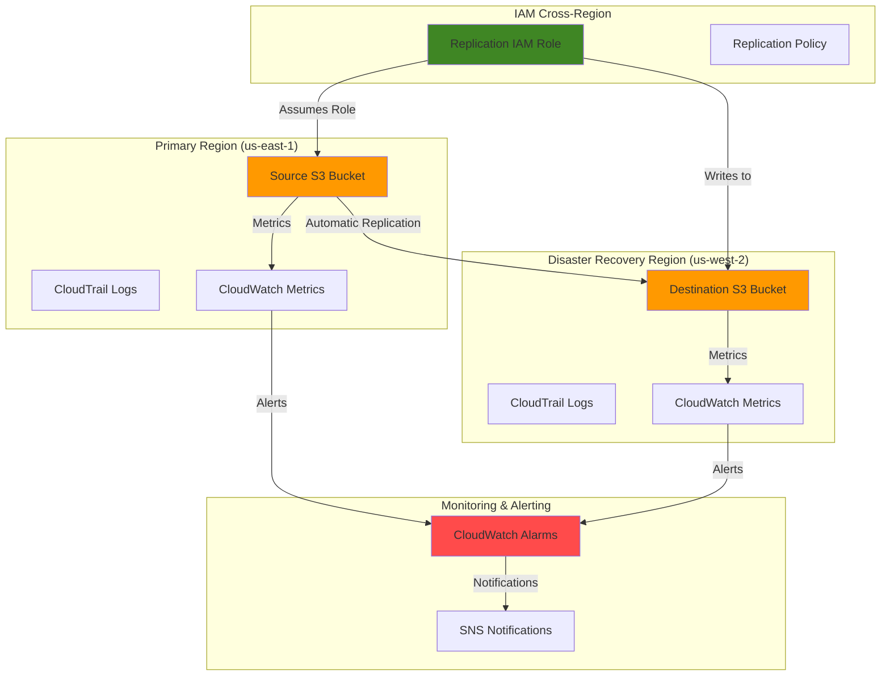

# Implementing Disaster Recovery with S3 Cross-Region Replication

## Problem

Organizations storing critical data in Amazon S3 need protection against regional disasters that could result in data loss and business continuity disruption. While S3 provides 99.999999999% (11 9's) durability within a single region, regulatory requirements and business risk management often demand cross-region data protection to ensure data availability during catastrophic regional events.

## Solution

S3 Cross-Region Replication (CRR) automatically replicates objects from source buckets to destination buckets in different AWS regions, providing robust disaster recovery capabilities. This solution combines CRR with proper IAM configurations and monitoring to create a comprehensive data protection strategy that meets Recovery Time Objectives (RTO) and Recovery Point Objectives (RPO) for business-critical data.

## Architecture Diagram



## Prerequisites

1. AWS account with appropriate permissions for S3, IAM, CloudWatch, and CloudTrail
2. AWS CLI v2 installed and configured (or AWS CloudShell)
3. Understanding of S3 bucket policies and IAM roles
4. Two different AWS regions selected for primary and disaster recovery locations
5. Estimated cost: $0.025 per GB for cross-region replication transfer, plus standard S3 storage costs in destination region

> **Note**: Cross-region replication incurs data transfer charges and duplicate storage costs. Review the [AWS S3 pricing documentation](https://aws.amazon.com/s3/pricing/) for accurate cost estimates based on your data volume.

## Preparation

```bash
# Set environment variables for primary region
export PRIMARY_REGION="us-east-1"
export DR_REGION="us-west-2"
export AWS_ACCOUNT_ID=$(aws sts get-caller-identity \
    --query Account --output text)

# Generate unique identifiers for resources
RANDOM_SUFFIX=$(aws secretsmanager get-random-password \
    --exclude-punctuation --exclude-uppercase \
    --password-length 6 --require-each-included-type \
    --region ${PRIMARY_REGION} \
    --output text --query RandomPassword)

# Set bucket names with unique suffixes
export SOURCE_BUCKET="dr-source-${RANDOM_SUFFIX}"
export DEST_BUCKET="dr-destination-${RANDOM_SUFFIX}"
export CLOUDTRAIL_BUCKET="dr-cloudtrail-${RANDOM_SUFFIX}"
export REPLICATION_ROLE_NAME="s3-replication-role-${RANDOM_SUFFIX}"

echo "Primary Region: ${PRIMARY_REGION}"
echo "DR Region: ${DR_REGION}"
echo "Source Bucket: ${SOURCE_BUCKET}"
echo "Destination Bucket: ${DEST_BUCKET}"
echo "CloudTrail Bucket: ${CLOUDTRAIL_BUCKET}"
```

## Steps

1. **Create Source S3 Bucket with Versioning**:

   S3 Cross-Region Replication requires versioning to be enabled on both source and destination buckets. Versioning protects against accidental object overwrites and provides the foundation for replication tracking. This step establishes the primary data storage location where your applications will read and write data.

   ```bash
   # Create source bucket in primary region
   aws s3 mb s3://${SOURCE_BUCKET} --region ${PRIMARY_REGION}
   
   # Enable versioning on source bucket
   aws s3api put-bucket-versioning \
       --bucket ${SOURCE_BUCKET} \
       --versioning-configuration Status=Enabled \
       --region ${PRIMARY_REGION}
   
   echo "✅ Source bucket created and versioning enabled"
   ```

   The source bucket is now configured with versioning, which creates unique version IDs for each object modification. This versioning capability is essential for replication integrity and provides additional protection against data corruption or accidental deletions.

2. **Create Destination S3 Bucket with Versioning**:

   The destination bucket in the disaster recovery region will automatically receive replicated objects. Configuring this bucket with versioning ensures that all object versions are preserved during replication, maintaining data integrity across regions.

   ```bash
   # Create destination bucket in DR region
   aws s3 mb s3://${DEST_BUCKET} --region ${DR_REGION}
   
   # Enable versioning on destination bucket
   aws s3api put-bucket-versioning \
       --bucket ${DEST_BUCKET} \
       --versioning-configuration Status=Enabled \
       --region ${DR_REGION}
   
   echo "✅ Destination bucket created and versioning enabled"
   ```

   The destination bucket is now ready to receive replicated objects. This bucket serves as your disaster recovery data store, providing immediate access to your data if the primary region becomes unavailable.

3. **Create CloudTrail Logging Bucket**:

   CloudTrail requires a dedicated S3 bucket to store audit logs. This bucket needs specific permissions to allow CloudTrail to write log files. Creating a separate bucket ensures proper security and prevents conflicts with your data replication setup.

   ```bash
   # Create CloudTrail logging bucket
   aws s3 mb s3://${CLOUDTRAIL_BUCKET} --region ${PRIMARY_REGION}
   
   # Create CloudTrail bucket policy
   cat > cloudtrail-bucket-policy.json << EOF
   {
     "Version": "2012-10-17",
     "Statement": [
       {
         "Sid": "AWSCloudTrailAclCheck",
         "Effect": "Allow",
         "Principal": {
           "Service": "cloudtrail.amazonaws.com"
         },
         "Action": "s3:GetBucketAcl",
         "Resource": "arn:aws:s3:::${CLOUDTRAIL_BUCKET}"
       },
       {
         "Sid": "AWSCloudTrailWrite",
         "Effect": "Allow",
         "Principal": {
           "Service": "cloudtrail.amazonaws.com"
         },
         "Action": "s3:PutObject",
         "Resource": "arn:aws:s3:::${CLOUDTRAIL_BUCKET}/*",
         "Condition": {
           "StringEquals": {
             "s3:x-amz-acl": "bucket-owner-full-control"
           }
         }
       }
     ]
   }
   EOF
   
   # Apply bucket policy to CloudTrail bucket
   aws s3api put-bucket-policy \
       --bucket ${CLOUDTRAIL_BUCKET} \
       --policy file://cloudtrail-bucket-policy.json \
       --region ${PRIMARY_REGION}
   
   echo "✅ CloudTrail bucket created with proper permissions"
   ```

   The CloudTrail bucket is now configured with the necessary permissions for CloudTrail to write audit logs securely.

4. **Create IAM Role for Cross-Region Replication**:

   S3 replication requires an IAM role that can read from the source bucket and write to the destination bucket. This role operates under the principle of least privilege, providing only the necessary permissions for replication operations while maintaining security best practices.

   ```bash
   # Create trust policy for replication role
   cat > replication-trust-policy.json << 'EOF'
   {
     "Version": "2012-10-17",
     "Statement": [
       {
         "Effect": "Allow",
         "Principal": {
           "Service": "s3.amazonaws.com"
         },
         "Action": "sts:AssumeRole"
       }
     ]
   }
   EOF
   
   # Create the replication role
   aws iam create-role \
       --role-name ${REPLICATION_ROLE_NAME} \
       --assume-role-policy-document file://replication-trust-policy.json
   
   # Store role ARN for later use
   export REPLICATION_ROLE_ARN=$(aws iam get-role \
       --role-name ${REPLICATION_ROLE_NAME} \
       --query Role.Arn --output text)
   
   echo "✅ Replication role created: ${REPLICATION_ROLE_ARN}"
   ```

   The IAM role is now established with the appropriate trust relationship, allowing S3 to assume this role for replication operations. This role will be attached to specific permissions in the next step.

5. **Create and Attach Replication Policy**:

   The replication policy defines the specific permissions required for cross-region replication operations. This policy allows the role to read object versions from the source bucket and write replicated objects to the destination bucket, following AWS security best practices.

   ```bash
   # Create replication policy document
   cat > replication-policy.json << EOF
   {
     "Version": "2012-10-17",
     "Statement": [
       {
         "Effect": "Allow",
         "Action": [
           "s3:GetObjectVersionForReplication",
           "s3:GetObjectVersionAcl",
           "s3:GetObjectVersionTagging"
         ],
         "Resource": [
           "arn:aws:s3:::${SOURCE_BUCKET}/*"
         ]
       },
       {
         "Effect": "Allow",
         "Action": [
           "s3:ListBucket"
         ],
         "Resource": [
           "arn:aws:s3:::${SOURCE_BUCKET}"
         ]
       },
       {
         "Effect": "Allow",
         "Action": [
           "s3:ReplicateObject",
           "s3:ReplicateDelete",
           "s3:ReplicateTags"
         ],
         "Resource": [
           "arn:aws:s3:::${DEST_BUCKET}/*"
         ]
       }
     ]
   }
   EOF
   
   # Create and attach the policy
   aws iam put-role-policy \
       --role-name ${REPLICATION_ROLE_NAME} \
       --policy-name ReplicationPolicy \
       --policy-document file://replication-policy.json
   
   echo "✅ Replication policy created and attached"
   ```

   The policy is now attached to the replication role, providing the necessary permissions for S3 to perform cross-region replication operations securely and efficiently.

6. **Configure Cross-Region Replication Rule**:

   The replication configuration defines how and when objects are replicated between regions. This configuration specifies the destination bucket, replication role, and any filtering rules that determine which objects should be replicated for disaster recovery purposes.

   ```bash
   # Create replication configuration
   cat > replication-config.json << EOF
   {
     "Role": "${REPLICATION_ROLE_ARN}",
     "Rules": [
       {
         "ID": "disaster-recovery-replication",
         "Status": "Enabled",
         "Priority": 1,
         "DeleteMarkerReplication": {
           "Status": "Enabled"
         },
         "Filter": {
           "Prefix": ""
         },
         "Destination": {
           "Bucket": "arn:aws:s3:::${DEST_BUCKET}",
           "StorageClass": "STANDARD_IA"
         }
       }
     ]
   }
   EOF
   
   # Apply replication configuration to source bucket
   aws s3api put-bucket-replication \
       --bucket ${SOURCE_BUCKET} \
       --replication-configuration file://replication-config.json \
       --region ${PRIMARY_REGION}
   
   echo "✅ Cross-region replication configured"
   ```

   Replication is now active and will automatically copy all new objects from the source bucket to the destination bucket. The STANDARD_IA storage class in the destination helps optimize costs for disaster recovery scenarios.

7. **Enable CloudTrail Logging for Audit Trail**:

   CloudTrail provides comprehensive logging of all S3 API calls, enabling you to monitor replication activities and maintain an audit trail for compliance purposes. This logging is essential for tracking data movement and troubleshooting replication issues.

   ```bash
   # Create CloudTrail for S3 API logging
   aws cloudtrail create-trail \
       --name s3-replication-trail-${RANDOM_SUFFIX} \
       --s3-bucket-name ${CLOUDTRAIL_BUCKET} \
       --s3-key-prefix cloudtrail-logs \
       --include-global-service-events \
       --is-multi-region-trail \
       --enable-log-file-validation \
       --region ${PRIMARY_REGION}
   
   # Start logging
   aws cloudtrail start-logging \
       --name s3-replication-trail-${RANDOM_SUFFIX} \
       --region ${PRIMARY_REGION}
   
   echo "✅ CloudTrail logging enabled"
   ```

   CloudTrail is now capturing all S3 API calls, providing visibility into replication operations and supporting compliance requirements for data governance and audit trails.

8. **Set Up CloudWatch Monitoring and Alarms**:

   CloudWatch monitoring provides real-time visibility into replication performance and health. Setting up alarms ensures you're notified of any replication failures or performance issues that could impact your disaster recovery capabilities.

   ```bash
   # Create SNS topic for alerts (optional - remove alarm-actions if not needed)
   aws sns create-topic \
       --name s3-replication-alerts-${RANDOM_SUFFIX} \
       --region ${PRIMARY_REGION} || true
   
   # Create CloudWatch alarm for replication metrics
   aws cloudwatch put-metric-alarm \
       --alarm-name "S3-Replication-Failures-${RANDOM_SUFFIX}" \
       --alarm-description "Monitor S3 replication failures" \
       --metric-name ReplicationLatency \
       --namespace AWS/S3 \
       --statistic Average \
       --period 300 \
       --threshold 900 \
       --comparison-operator GreaterThanThreshold \
       --evaluation-periods 2 \
       --dimensions Name=SourceBucket,Value=${SOURCE_BUCKET} \
       --region ${PRIMARY_REGION}
   
   echo "✅ CloudWatch monitoring configured"
   ```

   CloudWatch alarms are now monitoring replication performance, providing early warning of potential issues that could impact your disaster recovery readiness.

9. **Test Replication with Sample Data**:

   Testing the replication setup with sample data validates that the disaster recovery system is working correctly. This test simulates real-world data operations and confirms that objects are successfully replicated to the destination region.

   ```bash
   # Create test file with timestamp
   echo "Disaster Recovery Test - $(date)" > test-file.txt
   
   # Upload test file to source bucket
   aws s3 cp test-file.txt s3://${SOURCE_BUCKET}/test-file.txt \
       --region ${PRIMARY_REGION}
   
   # Wait for replication to complete
   echo "Waiting for replication to complete..."
   sleep 30
   
   # Verify replication in destination bucket
   aws s3 ls s3://${DEST_BUCKET}/ --region ${DR_REGION}
   
   echo "✅ Test data uploaded and replication initiated"
   ```

   The test file has been uploaded to the source bucket and should replicate to the destination bucket within minutes. This validates that your disaster recovery replication is functioning correctly.

## Validation & Testing

1. **Verify Replication Configuration**:

   ```bash
   # Check replication configuration
   aws s3api get-bucket-replication \
       --bucket ${SOURCE_BUCKET} \
       --region ${PRIMARY_REGION}
   ```

   Expected output: JSON configuration showing the replication rule with "Status": "Enabled"

2. **Test Object Replication**:

   ```bash
   # Upload additional test files
   echo "Test file 1" > test1.txt
   echo "Test file 2" > test2.txt
   
   aws s3 cp test1.txt s3://${SOURCE_BUCKET}/test1.txt \
       --region ${PRIMARY_REGION}
   aws s3 cp test2.txt s3://${SOURCE_BUCKET}/test2.txt \
       --region ${PRIMARY_REGION}
   
   # Wait and verify replication
   sleep 60
   aws s3 ls s3://${DEST_BUCKET}/ --region ${DR_REGION}
   ```

   Expected output: Both test files should appear in the destination bucket

3. **Monitor Replication Metrics**:

   ```bash
   # Check replication metrics
   aws cloudwatch get-metric-statistics \
       --namespace AWS/S3 \
       --metric-name ReplicationLatency \
       --start-time $(date -u -d '1 hour ago' +%Y-%m-%dT%H:%M:%S) \
       --end-time $(date -u +%Y-%m-%dT%H:%M:%S) \
       --period 300 \
       --statistics Average \
       --dimensions Name=SourceBucket,Value=${SOURCE_BUCKET} \
       --region ${PRIMARY_REGION}
   ```

   Expected output: Metrics showing replication latency times

4. **Test Disaster Recovery Scenario**:

   ```bash
   # Simulate disaster recovery by accessing data from DR region
   aws s3 sync s3://${DEST_BUCKET}/ ./dr-recovery-test/ \
       --region ${DR_REGION}
   
   # Verify data integrity
   ls -la ./dr-recovery-test/
   cat ./dr-recovery-test/test-file.txt
   ```

   Expected output: Successfully downloaded files with intact content

## Cleanup

1. **Remove Test Files**:

   ```bash
   # Remove local test files
   rm -f test-file.txt test1.txt test2.txt
   rm -rf ./dr-recovery-test/
   rm -f replication-trust-policy.json replication-policy.json
   rm -f replication-config.json cloudtrail-bucket-policy.json
   
   echo "✅ Local test files removed"
   ```

2. **Disable Replication and Delete Objects**:

   ```bash
   # Remove replication configuration
   aws s3api delete-bucket-replication \
       --bucket ${SOURCE_BUCKET} \
       --region ${PRIMARY_REGION}
   
   # Delete all objects and versions from source bucket
   aws s3api delete-objects \
       --bucket ${SOURCE_BUCKET} \
       --delete "$(aws s3api list-object-versions \
           --bucket ${SOURCE_BUCKET} \
           --query '{Objects: Versions[].{Key:Key,VersionId:VersionId}}' \
           --region ${PRIMARY_REGION})" \
       --region ${PRIMARY_REGION} 2>/dev/null || true
   
   # Delete all objects from destination bucket
   aws s3api delete-objects \
       --bucket ${DEST_BUCKET} \
       --delete "$(aws s3api list-object-versions \
           --bucket ${DEST_BUCKET} \
           --query '{Objects: Versions[].{Key:Key,VersionId:VersionId}}' \
           --region ${DR_REGION})" \
       --region ${DR_REGION} 2>/dev/null || true
   
   # Delete all objects from CloudTrail bucket
   aws s3 rm s3://${CLOUDTRAIL_BUCKET} --recursive \
       --region ${PRIMARY_REGION} 2>/dev/null || true
   
   echo "✅ Objects and replication configuration removed"
   ```

3. **Delete S3 Buckets**:

   ```bash
   # Delete source bucket
   aws s3 rb s3://${SOURCE_BUCKET} --region ${PRIMARY_REGION}
   
   # Delete destination bucket
   aws s3 rb s3://${DEST_BUCKET} --region ${DR_REGION}
   
   # Delete CloudTrail bucket
   aws s3 rb s3://${CLOUDTRAIL_BUCKET} --region ${PRIMARY_REGION}
   
   echo "✅ S3 buckets deleted"
   ```

4. **Remove IAM Role and CloudTrail**:

   ```bash
   # Delete IAM role policy
   aws iam delete-role-policy \
       --role-name ${REPLICATION_ROLE_NAME} \
       --policy-name ReplicationPolicy
   
   # Delete IAM role
   aws iam delete-role --role-name ${REPLICATION_ROLE_NAME}
   
   # Stop and delete CloudTrail
   aws cloudtrail stop-logging \
       --name s3-replication-trail-${RANDOM_SUFFIX} \
       --region ${PRIMARY_REGION}
   
   aws cloudtrail delete-trail \
       --name s3-replication-trail-${RANDOM_SUFFIX} \
       --region ${PRIMARY_REGION}
   
   echo "✅ IAM role and CloudTrail removed"
   ```

5. **Remove CloudWatch Alarms and SNS Topic**:

   ```bash
   # Delete CloudWatch alarm
   aws cloudwatch delete-alarms \
       --alarm-names "S3-Replication-Failures-${RANDOM_SUFFIX}" \
       --region ${PRIMARY_REGION}
   
   # Delete SNS topic (if created)
   SNS_TOPIC_ARN=$(aws sns list-topics \
       --query "Topics[?contains(TopicArn, 's3-replication-alerts-${RANDOM_SUFFIX}')].TopicArn" \
       --output text --region ${PRIMARY_REGION})
   
   if [ ! -z "$SNS_TOPIC_ARN" ]; then
     aws sns delete-topic --topic-arn ${SNS_TOPIC_ARN} \
         --region ${PRIMARY_REGION}
   fi
   
   echo "✅ CloudWatch alarms and SNS topic removed"
   ```

## Discussion

S3 Cross-Region Replication provides a robust foundation for disaster recovery strategies by automatically maintaining synchronized copies of your data across geographically separated AWS regions. This approach offers several key advantages for business continuity planning. The automatic, asynchronous replication ensures that your disaster recovery data stays current with minimal operational overhead, while the use of different regions provides protection against large-scale disasters that might affect entire data centers or regions.

The implementation demonstrates the principle of defense in depth by combining multiple AWS services to create a comprehensive disaster recovery solution. IAM roles provide secure, least-privilege access for replication operations, while CloudTrail offers complete audit trails for compliance and troubleshooting. CloudWatch monitoring ensures proactive detection of replication issues, enabling rapid response to potential problems that could impact your disaster recovery capabilities.

When implementing this solution in production environments, consider additional enhancements such as S3 Transfer Acceleration for faster replication of large files, lifecycle policies to automatically transition replicated objects to cheaper storage classes like Glacier for long-term archival, and cross-region VPC endpoints to reduce data transfer costs. For organizations with strict compliance requirements, consider implementing S3 Object Lock on the destination bucket to ensure immutable copies of critical data.

The cost-effectiveness of this approach depends on your specific use case, but generally provides excellent value for disaster recovery compared to traditional backup solutions. Regular testing of your disaster recovery procedures is essential to ensure that your RTO and RPO targets can be met during actual disaster scenarios. Consider implementing automated disaster recovery testing using AWS Lambda and Step Functions to regularly validate your recovery procedures. For comprehensive guidance, refer to the [AWS Well-Architected Framework](https://docs.aws.amazon.com/wellarchitected/latest/framework/welcome.html) and the [AWS Disaster Recovery whitepaper](https://docs.aws.amazon.com/whitepapers/latest/disaster-recovery-workloads-on-aws/disaster-recovery-workloads-on-aws.html).

> **Warning**: Cross-region replication incurs additional charges for data transfer and storage in the destination region. Monitor your AWS costs regularly and consider implementing S3 Intelligent-Tiering to optimize storage costs automatically.

## Challenge

Extend this disaster recovery solution by implementing these enhancements:

1. **Implement S3 Transfer Acceleration** to improve replication performance for large files by leveraging CloudFront's global edge locations for faster data transfer.

2. **Add S3 Object Lock** to the destination bucket to create Write-Once-Read-Many (WORM) storage that prevents accidental or malicious deletion of replicated objects.

3. **Create automated disaster recovery testing** using AWS Lambda and Step Functions to regularly validate replication integrity and recovery procedures, generating compliance reports.

4. **Implement cross-region VPC endpoints** to reduce data transfer costs and improve security by keeping replication traffic within the AWS network backbone.

5. **Build a comprehensive monitoring dashboard** using CloudWatch and AWS Systems Manager to track replication health, costs, and performance metrics across multiple buckets and regions.

## Infrastructure Code

*Infrastructure code will be generated after recipe approval.*