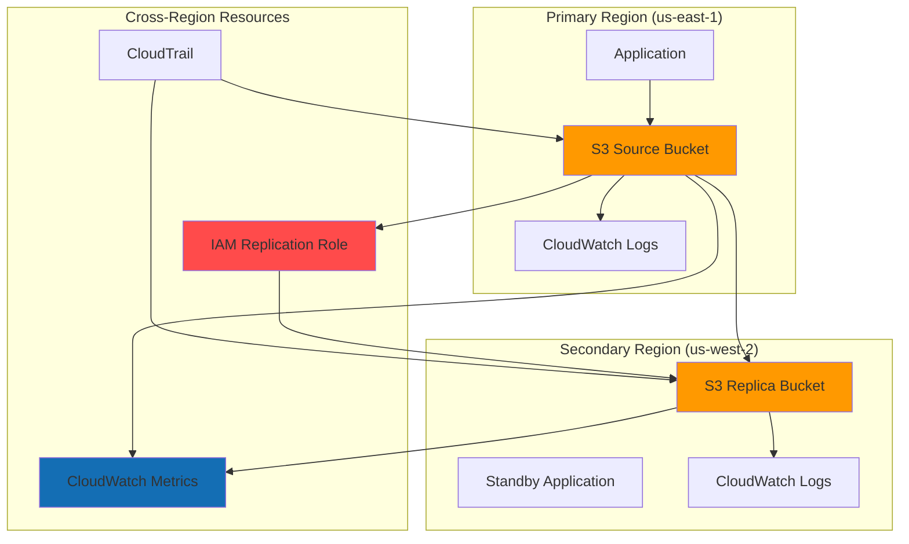

# S3 Disaster Recovery Solutions

## Problem

A multinational financial services company needs to ensure business continuity and regulatory compliance by implementing robust disaster recovery for their critical data stored in Amazon S3. Their current single-region architecture poses significant risks: if their primary region experiences an outage, they could lose access to customer financial records, trading data, and compliance documents for hours or days. Additionally, regulatory requirements mandate that financial data must be available within specific recovery time objectives (RTO) and maintain strict data integrity across geographically separated locations.

## Solution

Implement S3 Cross-Region Replication (CRR) to automatically replicate critical business data from a primary region to one or more secondary regions in near real-time. This solution uses S3's native replication capabilities combined with IAM roles for secure cross-region access, CloudWatch for monitoring replication metrics, and CloudTrail for audit logging. The approach ensures that if the primary region becomes unavailable, applications can quickly failover to the secondary region with minimal data loss and downtime.

## Architecture Diagram



## Prerequisites

1. AWS account with appropriate permissions for S3, IAM, CloudWatch, and CloudTrail
2. AWS CLI v2 installed and configured (or AWS CloudShell)
3. Understanding of S3 bucket policies and IAM roles
4. Knowledge of AWS disaster recovery concepts and RTO/RPO requirements
5. Estimated cost: $50-100/month for 1TB of data with replication across regions

> **Note**: Cross-region replication incurs additional costs for data transfer and storage in the destination region. Review [AWS S3 pricing](https://aws.amazon.com/s3/pricing/) for data transfer and storage costs before implementation. See [S3 Cross-Region Replication requirements](https://docs.aws.amazon.com/AmazonS3/latest/userguide/replication-requirements.html) for detailed implementation considerations.

## Preparation

```bash
# Set environment variables
export AWS_REGION=$(aws configure get region)
export AWS_ACCOUNT_ID=$(aws sts get-caller-identity \
    --query Account --output text)
export PRIMARY_REGION="us-east-1"
export SECONDARY_REGION="us-west-2"

# Generate unique identifiers for resources
RANDOM_SUFFIX=$(aws secretsmanager get-random-password \
    --exclude-punctuation --exclude-uppercase \
    --password-length 6 --require-each-included-type \
    --output text --query RandomPassword)

export SOURCE_BUCKET="dr-source-bucket-${RANDOM_SUFFIX}"
export REPLICA_BUCKET="dr-replica-bucket-${RANDOM_SUFFIX}"
export REPLICATION_ROLE="s3-replication-role-${RANDOM_SUFFIX}"

# Create CloudTrail for audit logging
aws cloudtrail create-trail \
    --name "s3-dr-audit-trail" \
    --s3-bucket-name "${SOURCE_BUCKET}" \
    --include-global-service-events \
    --is-multi-region-trail \
    --enable-log-file-validation \
    --region ${PRIMARY_REGION}

echo "✅ Environment prepared with unique identifiers"
```

## Steps

1. **Create Source Bucket in Primary Region**:

   Amazon S3 provides 99.999999999% (11 9's) durability and 99.99% availability, making it the ideal foundation for disaster recovery architectures. Creating a dedicated source bucket in your primary region establishes the central data repository that will serve as the authoritative source for all critical business data. This bucket becomes the origin point for cross-region replication, ensuring that every object stored here will be automatically replicated to your disaster recovery region.

   ```bash
   # Create source bucket with versioning enabled
   aws s3 mb s3://${SOURCE_BUCKET} \
       --region ${PRIMARY_REGION}
   
   # Enable versioning (required for replication)
   aws s3api put-bucket-versioning \
       --bucket ${SOURCE_BUCKET} \
       --versioning-configuration Status=Enabled
   
   # Add bucket tags for cost tracking
   aws s3api put-bucket-tagging \
       --bucket ${SOURCE_BUCKET} \
       --tagging 'TagSet=[
           {Key=Purpose,Value=DisasterRecovery},
           {Key=Environment,Value=Production},
           {Key=CostCenter,Value=IT-DR}
       ]'
   
   echo "✅ Source bucket created: ${SOURCE_BUCKET}"
   ```

   Versioning is mandatory for S3 replication because it enables AWS to track object changes and ensure data integrity during replication. Each object modification creates a new version, preventing data corruption and enabling point-in-time recovery. The resource tags provide essential metadata for cost allocation and compliance tracking across your disaster recovery infrastructure.

2. **Create Replica Bucket in Secondary Region**:

   The replica bucket in your secondary region serves as the disaster recovery target, providing geographic separation essential for business continuity. By placing this bucket in a different AWS region, you ensure that regional disasters, natural events, or infrastructure failures in the primary region won't affect your backup data. This geographic redundancy is crucial for meeting regulatory compliance requirements and achieving meaningful disaster recovery objectives.

   ```bash
   # Create replica bucket in secondary region
   aws s3 mb s3://${REPLICA_BUCKET} \
       --region ${SECONDARY_REGION}
   
   # Enable versioning on replica bucket
   aws s3api put-bucket-versioning \
       --bucket ${REPLICA_BUCKET} \
       --versioning-configuration Status=Enabled \
       --region ${SECONDARY_REGION}
   
   # Add bucket tags
   aws s3api put-bucket-tagging \
       --bucket ${REPLICA_BUCKET} \
       --tagging 'TagSet=[
           {Key=Purpose,Value=DisasterRecovery},
           {Key=Environment,Value=Production},
           {Key=CostCenter,Value=IT-DR}
       ]' \
       --region ${SECONDARY_REGION}
   
   echo "✅ Replica bucket created: ${REPLICA_BUCKET}"
   ```

   Both buckets must have versioning enabled to maintain consistency and enable S3's replication engine to track object changes accurately. The replica bucket becomes the failover target where applications can immediately access data if the primary region becomes unavailable, significantly reducing recovery time objectives (RTO).

3. **Create IAM Role for Cross-Region Replication**:

   IAM roles enable secure, temporary credential delegation without hardcoding secrets in application code or AWS services. For S3 replication, AWS needs permission to read objects from the source bucket and write them to the destination bucket across regions. This role follows the principle of least privilege, granting only the specific permissions needed for replication operations while maintaining security boundaries between AWS services and your data.

   ```bash
   # Create trust policy for S3 service
   cat > replication-trust-policy.json << EOF
   {
       "Version": "2012-10-17",
       "Statement": [
           {
               "Effect": "Allow",
               "Principal": {
                   "Service": "s3.amazonaws.com"
               },
               "Action": "sts:AssumeRole"
           }
       ]
   }
   EOF
   
   # Create IAM role
   aws iam create-role \
       --role-name ${REPLICATION_ROLE} \
       --assume-role-policy-document file://replication-trust-policy.json
   
   # Store role ARN
   REPLICATION_ROLE_ARN=$(aws iam get-role \
       --role-name ${REPLICATION_ROLE} \
       --query Role.Arn --output text)
   
   echo "✅ IAM role created: ${REPLICATION_ROLE_ARN}"
   ```

   The trust policy explicitly allows only the S3 service to assume this role, preventing unauthorized access from other AWS services or external entities. This security foundation enables S3 to perform replication operations using temporary, rotatable credentials rather than permanent access keys, reducing security attack surfaces while maintaining operational flexibility.

4. **Create and Attach Replication Permissions Policy**:

   The replication permissions policy defines the exact actions the S3 service can perform during replication operations. This policy is carefully crafted to provide minimal necessary permissions: read access to source bucket objects and metadata, and write access to the destination bucket. Each permission serves a specific purpose in the replication workflow, from reading object versions and metadata to writing replicated objects and preserving access controls.

   ```bash
   # Create replication permissions policy
   cat > replication-permissions-policy.json << EOF
   {
       "Version": "2012-10-17",
       "Statement": [
           {
               "Effect": "Allow",
               "Action": [
                   "s3:GetReplicationConfiguration",
                   "s3:ListBucket"
               ],
               "Resource": "arn:aws:s3:::${SOURCE_BUCKET}"
           },
           {
               "Effect": "Allow",
               "Action": [
                   "s3:GetObjectVersionForReplication",
                   "s3:GetObjectVersionAcl",
                   "s3:GetObjectVersionTagging"
               ],
               "Resource": "arn:aws:s3:::${SOURCE_BUCKET}/*"
           },
           {
               "Effect": "Allow",
               "Action": [
                   "s3:ReplicateObject",
                   "s3:ReplicateDelete",
                   "s3:ReplicateTags"
               ],
               "Resource": "arn:aws:s3:::${REPLICA_BUCKET}/*"
           }
       ]
   }
   EOF
   
   # Create and attach policy
   aws iam put-role-policy \
       --role-name ${REPLICATION_ROLE} \
       --policy-name S3ReplicationPolicy \
       --policy-document file://replication-permissions-policy.json
   
   echo "✅ Replication permissions policy attached"
   ```

   This granular permission model ensures that replication operations can access source objects and their metadata while maintaining strict security boundaries. The policy enables S3 to replicate not just object data, but also access control lists (ACLs), tags, and delete markers, preserving the complete state of your data in the destination region.

   > **Warning**: Ensure proper IAM permissions are configured before proceeding to avoid replication failures. The replication role must have both read permissions on the source bucket and write permissions on the destination bucket. Review [IAM policies for S3 replication](https://docs.aws.amazon.com/AmazonS3/latest/userguide/replication-walkthrough1.html) for detailed permission requirements.

5. **Configure Cross-Region Replication Rules**:

   Replication rules define the business logic for disaster recovery, determining which objects are replicated, where they go, and how they're stored. This configuration demonstrates tiered replication strategies: general data uses cost-effective Standard-IA storage, while critical financial data uses Standard storage for immediate access. Priority-based rules ensure that the most important data receives optimal treatment during replication processing.

   ```bash
   # Create replication configuration
   cat > replication-config.json << EOF
   {
       "Role": "${REPLICATION_ROLE_ARN}",
       "Rules": [
           {
               "ID": "ReplicateEverything",
               "Status": "Enabled",
               "Priority": 1,
               "Filter": {
                   "Prefix": ""
               },
               "DeleteMarkerReplication": {
                   "Status": "Enabled"
               },
               "Destination": {
                   "Bucket": "arn:aws:s3:::${REPLICA_BUCKET}",
                   "StorageClass": "STANDARD_IA"
               }
           },
           {
               "ID": "ReplicateCriticalData",
               "Status": "Enabled",
               "Priority": 2,
               "Filter": {
                   "And": {
                       "Prefix": "critical/",
                       "Tags": [
                           {
                               "Key": "Classification",
                               "Value": "Critical"
                           }
                       ]
                   }
               },
               "DeleteMarkerReplication": {
                   "Status": "Enabled"
               },
               "Destination": {
                   "Bucket": "arn:aws:s3:::${REPLICA_BUCKET}",
                   "StorageClass": "STANDARD"
               }
           }
       ]
   }
   EOF
   
   # Apply replication configuration
   aws s3api put-bucket-replication \
       --bucket ${SOURCE_BUCKET} \
       --replication-configuration file://replication-config.json
   
   echo "✅ Cross-region replication configured"
   ```

   The replication configuration enables automatic, asynchronous copying of objects from the source to destination bucket. Delete marker replication ensures that object deletions are also replicated, maintaining consistency between regions. This setup provides near real-time replication typically completing within 15 minutes for most objects, enabling rapid disaster recovery activation.

6. **Set Up CloudWatch Monitoring for Replication**:

   CloudWatch monitoring provides real-time visibility into replication performance and health, enabling proactive disaster recovery management. Replication latency metrics help ensure that Recovery Point Objectives (RPO) are met, while failure count monitoring enables immediate response to replication issues. This monitoring foundation supports SLA compliance and provides the operational intelligence needed for effective disaster recovery operations.

   ```bash
   # Create CloudWatch alarm for replication failures
   aws cloudwatch put-metric-alarm \
       --alarm-name "S3-Replication-Failure-${SOURCE_BUCKET}" \
       --alarm-description "S3 replication failure alarm" \
       --metric-name ReplicationLatency \
       --namespace AWS/S3 \
       --statistic Average \
       --period 300 \
       --threshold 900 \
       --comparison-operator GreaterThanThreshold \
       --evaluation-periods 2 \
       --alarm-actions "arn:aws:sns:${PRIMARY_REGION}:${AWS_ACCOUNT_ID}:s3-alerts" \
       --dimensions Name=SourceBucket,Value=${SOURCE_BUCKET} \
                   Name=DestinationBucket,Value=${REPLICA_BUCKET}
   
   # Create dashboard for monitoring
   aws cloudwatch put-dashboard \
       --dashboard-name "S3-DR-Dashboard" \
       --dashboard-body '{
           "widgets": [
               {
                   "type": "metric",
                   "properties": {
                       "metrics": [
                           ["AWS/S3", "ReplicationLatency", "SourceBucket", "'${SOURCE_BUCKET}'"],
                           ["AWS/S3", "ReplicationFailureCount", "SourceBucket", "'${SOURCE_BUCKET}'"]
                       ],
                       "period": 300,
                       "stat": "Average",
                       "region": "'${PRIMARY_REGION}'",
                       "title": "S3 Replication Metrics"
                   }
               }
           ]
       }'
   
   echo "✅ CloudWatch monitoring configured"
   ```

   The alarm triggers when replication latency exceeds 15 minutes (900 seconds), indicating potential replication issues that could impact disaster recovery capabilities. The dashboard provides centralized monitoring of replication health, enabling operations teams to quickly identify and respond to performance degradation or failures in the disaster recovery pipeline.

7. **Upload Test Data and Configure Lifecycle Policies**:

   Test data validates that replication rules work correctly for different data classifications and business requirements. The lifecycle policies demonstrate cost optimization strategies by automatically transitioning objects to cheaper storage classes as they age, reducing long-term storage costs while maintaining data availability. This approach balances cost efficiency with business requirements for data retention and disaster recovery.

   ```bash
   # Create test files with different classifications
   echo "Critical financial data - $(date)" > critical-data.txt
   echo "Standard business data - $(date)" > standard-data.txt
   echo "Archive data - $(date)" > archive-data.txt
   
   # Upload critical data with tags
   aws s3 cp critical-data.txt s3://${SOURCE_BUCKET}/critical/ \
       --metadata "classification=critical" \
       --tagging "Classification=Critical&DataType=Financial"
   
   # Upload standard data
   aws s3 cp standard-data.txt s3://${SOURCE_BUCKET}/standard/ \
       --metadata "classification=standard"
   
   # Upload archive data
   aws s3 cp archive-data.txt s3://${SOURCE_BUCKET}/archive/ \
       --metadata "classification=archive"
   
   # Configure lifecycle policy for cost optimization
   cat > lifecycle-policy.json << EOF
   {
       "Rules": [
           {
               "ID": "TransitionToIA",
               "Status": "Enabled",
               "Filter": {
                   "Prefix": "standard/"
               },
               "Transitions": [
                   {
                       "Days": 30,
                       "StorageClass": "STANDARD_IA"
                   },
                   {
                       "Days": 90,
                       "StorageClass": "GLACIER"
                   }
               ]
           }
       ]
   }
   EOF
   
   aws s3api put-bucket-lifecycle-configuration \
       --bucket ${SOURCE_BUCKET} \
       --lifecycle-configuration file://lifecycle-policy.json
   
   echo "✅ Test data uploaded and lifecycle policies configured"
   ```

   The test data demonstrates how different data classifications trigger appropriate replication rules - critical data with specific tags receives priority treatment and Standard storage class, while general data uses cost-effective Standard-IA. Lifecycle policies provide automated cost management by moving older data to cheaper storage tiers while maintaining disaster recovery capabilities.

8. **Configure Disaster Recovery Procedures**:

   Disaster recovery procedures provide standardized, tested workflows for switching between primary and secondary regions during emergencies. These scripts automate the critical tasks of reconfiguring applications to use replica buckets, verifying accessibility, and maintaining audit logs for compliance requirements. Having pre-built, tested procedures reduces human error and significantly decreases recovery time during high-stress disaster scenarios.

   ```bash
   # Create disaster recovery script
   cat > dr-failover-script.sh << 'EOF'
   #!/bin/bash
   
   # Disaster Recovery Failover Script
   REPLICA_BUCKET=$1
   APPLICATION_CONFIG=$2
   
   if [ -z "$REPLICA_BUCKET" ] || [ -z "$APPLICATION_CONFIG" ]; then
       echo "Usage: $0 <replica-bucket> <application-config>"
       exit 1
   fi
   
   echo "Starting DR failover to bucket: $REPLICA_BUCKET"
   
   # Update application configuration to point to replica bucket
   sed -i "s/bucket_name=.*/bucket_name=$REPLICA_BUCKET/" $APPLICATION_CONFIG
   
   # Verify bucket accessibility
   aws s3 ls s3://$REPLICA_BUCKET --region us-west-2 > /dev/null
   if [ $? -eq 0 ]; then
       echo "✅ Replica bucket is accessible"
   else
       echo "❌ Replica bucket is not accessible"
       exit 1
   fi
   
   # Log failover event
   echo "$(date): DR failover completed to $REPLICA_BUCKET" >> /var/log/dr-events.log
   
   echo "✅ DR failover completed successfully"
   EOF
   
   chmod +x dr-failover-script.sh
   
   # Create failback script
   cat > dr-failback-script.sh << 'EOF'
   #!/bin/bash
   
   # Disaster Recovery Failback Script
   SOURCE_BUCKET=$1
   APPLICATION_CONFIG=$2
   
   if [ -z "$SOURCE_BUCKET" ] || [ -z "$APPLICATION_CONFIG" ]; then
       echo "Usage: $0 <source-bucket> <application-config>"
       exit 1
   fi
   
   echo "Starting DR failback to bucket: $SOURCE_BUCKET"
   
   # Update application configuration to point back to source bucket
   sed -i "s/bucket_name=.*/bucket_name=$SOURCE_BUCKET/" $APPLICATION_CONFIG
   
   # Verify bucket accessibility
   aws s3 ls s3://$SOURCE_BUCKET --region us-east-1 > /dev/null
   if [ $? -eq 0 ]; then
       echo "✅ Source bucket is accessible"
   else
       echo "❌ Source bucket is not accessible"
       exit 1
   fi
   
   # Log failback event
   echo "$(date): DR failback completed to $SOURCE_BUCKET" >> /var/log/dr-events.log
   
   echo "✅ DR failback completed successfully"
   EOF
   
   chmod +x dr-failback-script.sh
   
   echo "✅ DR procedures configured"
   ```

   These automated scripts provide the operational foundation for disaster recovery, enabling rapid response to regional outages while maintaining detailed audit trails. The failover script switches applications to use replica buckets, while the failback script restores normal operations once the primary region is available, ensuring business continuity throughout the disaster recovery lifecycle.

## Validation & Testing

1. **Verify Replication Configuration**:

   ```bash
   # Check replication configuration
   aws s3api get-bucket-replication \
       --bucket ${SOURCE_BUCKET} \
       --query 'ReplicationConfiguration.Rules[0].Status'
   ```

   Expected output: `"Enabled"`

2. **Test Replication with New Objects**:

   ```bash
   # Upload a test file
   echo "Test replication - $(date)" > test-replication.txt
   aws s3 cp test-replication.txt s3://${SOURCE_BUCKET}/test/
   
   # Wait 30 seconds for replication
   sleep 30
   
   # Check if file exists in replica bucket
   aws s3 ls s3://${REPLICA_BUCKET}/test/ --region ${SECONDARY_REGION}
   ```

   Expected output: File should be listed in the replica bucket

3. **Validate Replication Metrics**:

   ```bash
   # Check replication metrics
   aws cloudwatch get-metric-statistics \
       --namespace AWS/S3 \
       --metric-name ReplicationLatency \
       --dimensions Name=SourceBucket,Value=${SOURCE_BUCKET} \
       --start-time $(date -u -d '1 hour ago' +%Y-%m-%dT%H:%M:%S) \
       --end-time $(date -u +%Y-%m-%dT%H:%M:%S) \
       --period 300 \
       --statistics Average
   ```

4. **Test Disaster Recovery Failover**:

   ```bash
   # Create mock application config
   echo "bucket_name=${SOURCE_BUCKET}" > app-config.txt
   
   # Test failover script
   ./dr-failover-script.sh ${REPLICA_BUCKET} app-config.txt
   
   # Verify configuration was updated
   grep "bucket_name" app-config.txt
   ```

   Expected output: Configuration should show replica bucket name

5. **Validate Cross-Region Access**:

   ```bash
   # Test reading from replica bucket in secondary region
   aws s3 cp s3://${REPLICA_BUCKET}/test/test-replication.txt \
       downloaded-from-replica.txt \
       --region ${SECONDARY_REGION}
   
   # Compare file contents
   diff test-replication.txt downloaded-from-replica.txt
   ```

   Expected output: No differences should be found

## Cleanup

1. **Remove Test Files and Objects**:

   ```bash
   # Delete objects from source bucket
   aws s3 rm s3://${SOURCE_BUCKET} --recursive
   
   # Delete objects from replica bucket
   aws s3 rm s3://${REPLICA_BUCKET} --recursive \
       --region ${SECONDARY_REGION}
   
   echo "✅ Test objects deleted"
   ```

2. **Remove Replication Configuration**:

   ```bash
   # Delete replication configuration
   aws s3api delete-bucket-replication \
       --bucket ${SOURCE_BUCKET}
   
   echo "✅ Replication configuration removed"
   ```

3. **Delete CloudWatch Resources**:

   ```bash
   # Delete CloudWatch alarm
   aws cloudwatch delete-alarms \
       --alarm-names "S3-Replication-Failure-${SOURCE_BUCKET}"
   
   # Delete CloudWatch dashboard
   aws cloudwatch delete-dashboards \
       --dashboard-names "S3-DR-Dashboard"
   
   echo "✅ CloudWatch resources deleted"
   ```

4. **Remove IAM Role and Policies**:

   ```bash
   # Delete role policy
   aws iam delete-role-policy \
       --role-name ${REPLICATION_ROLE} \
       --policy-name S3ReplicationPolicy
   
   # Delete IAM role
   aws iam delete-role \
       --role-name ${REPLICATION_ROLE}
   
   echo "✅ IAM resources deleted"
   ```

5. **Delete S3 Buckets**:

   ```bash
   # Delete source bucket
   aws s3 rb s3://${SOURCE_BUCKET} --force
   
   # Delete replica bucket
   aws s3 rb s3://${REPLICA_BUCKET} --force \
       --region ${SECONDARY_REGION}
   
   # Delete CloudTrail
   aws cloudtrail delete-trail \
       --name "s3-dr-audit-trail" \
       --region ${PRIMARY_REGION}
   
   # Clean up local files
   rm -f critical-data.txt standard-data.txt archive-data.txt
   rm -f test-replication.txt downloaded-from-replica.txt
   rm -f app-config.txt
   rm -f replication-*.json lifecycle-policy.json
   rm -f dr-failover-script.sh dr-failback-script.sh
   
   echo "✅ All resources cleaned up"
   ```

## Discussion

S3 Cross-Region Replication provides a robust foundation for disaster recovery by automatically replicating objects across AWS regions with minimal configuration overhead. The solution addresses key DR requirements: **Recovery Time Objective (RTO)** is significantly reduced because replica data is immediately available in the secondary region, and **Recovery Point Objective (RPO)** is minimized through near real-time replication that typically completes within 15 minutes for most objects.

The implementation demonstrates several best practices for enterprise DR solutions. **Selective replication rules** allow organizations to prioritize critical data while optimizing costs - for example, financial records might replicate to Standard storage class while less critical data uses Standard-IA. **Lifecycle policies** further optimize costs by automatically transitioning older data to cheaper storage classes. **Monitoring and alerting** through CloudWatch ensures operational teams are immediately notified of replication failures or performance degradation.

Security considerations are paramount in DR implementations. The IAM role follows the principle of least privilege, granting only the specific permissions needed for replication operations. **Encryption in transit** is automatic with S3 replication, and **encryption at rest** can be configured independently for source and destination buckets. **Audit logging** through CloudTrail provides comprehensive visibility into all replication-related activities for compliance purposes.

The disaster recovery procedures should be regularly tested and documented. Organizations should establish clear **RTO and RPO targets** based on business requirements, conduct quarterly DR drills, and maintain runbooks for both failover and failback scenarios. Consider implementing **two-way replication** for active-active architectures or **batch replication** for existing data that needs to be included in the DR scope.

> **Tip**: Enable S3 Replication Time Control (RTC) for mission-critical data that requires guaranteed replication within 15 minutes, backed by an SLA from AWS. Learn more about [S3 Replication Time Control](https://docs.aws.amazon.com/AmazonS3/latest/userguide/replication-time-control.html) and its compliance benefits for regulatory requirements.

## Challenge

Extend this disaster recovery solution by implementing these enhancements:

1. **Multi-Region Active-Active Setup**: Configure bidirectional replication between multiple regions to support active-active disaster recovery with conflict resolution strategies.

2. **Automated Failover with Route 53**: Integrate Route 53 health checks and DNS failover to automatically redirect traffic from primary to secondary regions during outages.

3. **Cross-Account Replication**: Implement replication to buckets in different AWS accounts for additional isolation and compliance requirements, including proper cross-account IAM policies.

4. **Advanced Monitoring Dashboard**: Create a comprehensive CloudWatch dashboard that displays replication lag, failure rates, cost metrics, and automated remediation workflows using Systems Manager.

5. **Compliance Reporting**: Develop automated compliance reports that track replication SLAs, audit successful DR tests, and generate regulatory compliance documentation for financial services requirements.

## Infrastructure Code

*Infrastructure code will be generated after recipe approval.*