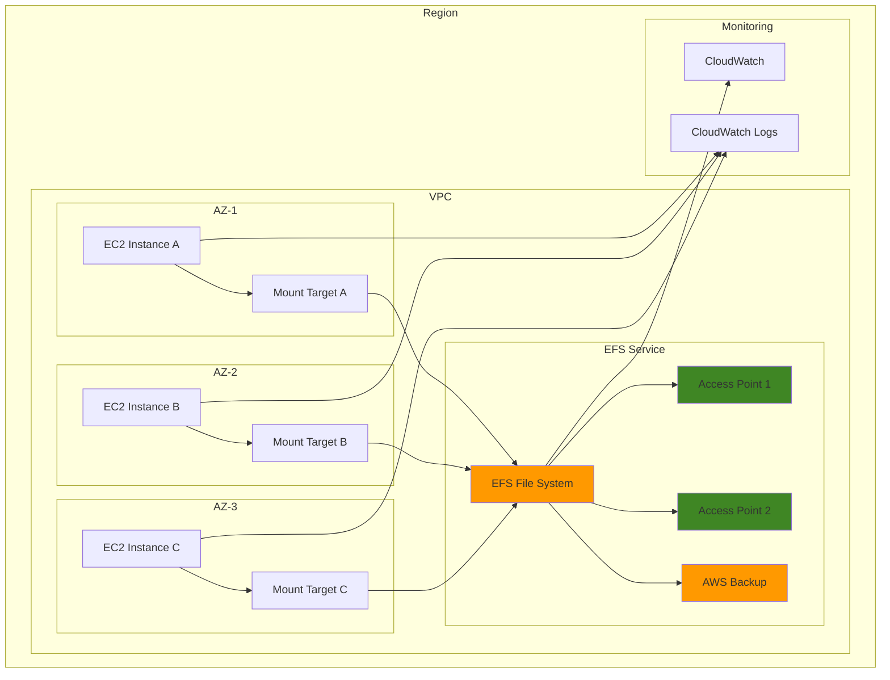

# Building Distributed File Systems with Amazon EFS

## Problem

Modern applications require scalable, distributed file storage that can be accessed simultaneously by multiple compute instances across different availability zones. Traditional network-attached storage (NAS) solutions are expensive, complex to manage, and lack the elasticity needed for cloud-native applications. Organizations struggle with file storage that needs to scale automatically, provide consistent performance, and maintain high availability while supporting concurrent access from distributed workloads.

## Solution

Amazon Elastic File System (EFS) provides a fully managed, scalable, and distributed file system that can be simultaneously mounted by multiple EC2 instances across multiple Availability Zones. EFS automatically scales from gigabytes to petabytes, provides consistent performance, and offers multiple throughput modes to optimize for different workload patterns. With built-in encryption, access points for fine-grained access control, and seamless integration with AWS services, EFS enables organizations to build resilient distributed applications with shared file storage.

## Architecture Diagram



## Prerequisites

1. AWS account with Administrator permissions for EFS, EC2, and VPC services
2. AWS CLI v2 installed and configured (or AWS CloudShell)
3. Basic understanding of Linux file systems and network protocols
4. Existing VPC with multiple subnets across different Availability Zones
5. Estimated cost: $0.10-0.50 per hour for EFS storage and EC2 instances

> **Note**: This recipe creates billable resources. Monitor your usage and clean up resources when finished to avoid unexpected charges. See the [AWS Pricing Calculator](https://calculator.aws/) to estimate costs.

## Preparation

```bash
# Set environment variables
export AWS_REGION=$(aws configure get region)
export AWS_ACCOUNT_ID=$(aws sts get-caller-identity \
    --query Account --output text)

# Generate unique identifiers for resources
RANDOM_SUFFIX=$(aws secretsmanager get-random-password \
    --exclude-punctuation --exclude-uppercase \
    --password-length 6 --require-each-included-type \
    --output text --query RandomPassword)

export EFS_NAME="distributed-efs-${RANDOM_SUFFIX}"
export KEY_PAIR_NAME="efs-demo-${RANDOM_SUFFIX}"

# Get VPC and subnet information
export VPC_ID=$(aws ec2 describe-vpcs \
    --filters "Name=is-default,Values=true" \
    --query 'Vpcs[0].VpcId' --output text)

# Get subnets from different AZs
export SUBNET_IDS=$(aws ec2 describe-subnets \
    --filters "Name=vpc-id,Values=${VPC_ID}" \
    --query 'Subnets[].SubnetId' --output text)

export SUBNET_1=$(echo $SUBNET_IDS | cut -d' ' -f1)
export SUBNET_2=$(echo $SUBNET_IDS | cut -d' ' -f2)
export SUBNET_3=$(echo $SUBNET_IDS | cut -d' ' -f3)

# Create key pair for EC2 instances
aws ec2 create-key-pair \
    --key-name $KEY_PAIR_NAME \
    --query 'KeyMaterial' --output text > ~/.ssh/${KEY_PAIR_NAME}.pem

chmod 600 ~/.ssh/${KEY_PAIR_NAME}.pem

echo "✅ Environment prepared with VPC: $VPC_ID"
echo "✅ Subnets: $SUBNET_1, $SUBNET_2, $SUBNET_3"
echo "✅ Key pair created: $KEY_PAIR_NAME"
```

## Steps

1. **Create security groups for EFS and EC2 instances**:

   Security groups act as virtual firewalls that control network traffic to and from AWS resources. For EFS, we need specific security group configurations to enable secure NFS (Network File System) communication on port 2049. Security groups provide stateful packet filtering, meaning return traffic is automatically allowed for established connections.

   ```bash
   # Create security group for EFS
   export EFS_SG_ID=$(aws ec2 create-security-group \
       --group-name "efs-sg-${RANDOM_SUFFIX}" \
       --description "Security group for EFS mount targets" \
       --vpc-id $VPC_ID \
       --query 'GroupId' --output text)

   # Create security group for EC2 instances
   export EC2_SG_ID=$(aws ec2 create-security-group \
       --group-name "efs-client-sg-${RANDOM_SUFFIX}" \
       --description "Security group for EFS client instances" \
       --vpc-id $VPC_ID \
       --query 'GroupId' --output text)

   # Configure EFS security group rules
   aws ec2 authorize-security-group-ingress \
       --group-id $EFS_SG_ID \
       --protocol tcp \
       --port 2049 \
       --source-group $EC2_SG_ID

   # Configure EC2 security group rules
   aws ec2 authorize-security-group-ingress \
       --group-id $EC2_SG_ID \
       --protocol tcp \
       --port 22 \
       --cidr 0.0.0.0/0

   aws ec2 authorize-security-group-ingress \
       --group-id $EC2_SG_ID \
       --protocol tcp \
       --port 80 \
       --cidr 0.0.0.0/0

   echo "✅ Security groups created - EFS: $EFS_SG_ID, EC2: $EC2_SG_ID"
   ```

   The security groups are now configured to allow secure NFS communication between EC2 instances and EFS mount targets. The EFS security group only accepts traffic from the EC2 security group, implementing the principle of least privilege for network access.

2. **Create EFS file system with optimal performance settings**:

   Amazon EFS offers two performance modes: General Purpose (default) and Max I/O. General Purpose mode provides the lowest latency per operation and can achieve up to 7,000 file operations per second, while Max I/O can scale to higher performance levels but with slightly higher latencies. The Elastic throughput mode automatically scales throughput up or down based on workload demands, providing better price-performance than Bursting mode for most use cases.

   ```bash
   # Create EFS file system with General Purpose performance mode
   # and Elastic throughput for automatic scaling
   export EFS_ID=$(aws efs create-file-system \
       --creation-token "${EFS_NAME}-token" \
       --performance-mode generalPurpose \
       --throughput-mode elastic \
       --encrypted \
       --tags Key=Name,Value=$EFS_NAME \
       --query 'FileSystemId' --output text)

   # Wait for EFS to become available
   aws efs wait file-system-available \
       --file-system-id $EFS_ID

   echo "✅ EFS file system created: $EFS_ID"
   ```

   The EFS file system is now created with encryption at rest and in transit enabled by default. The General Purpose performance mode with Elastic throughput provides optimal performance for most workloads, automatically scaling from baseline performance to burst performance as needed.

3. **Create mount targets in multiple Availability Zones**:

   Mount targets provide network endpoints for accessing EFS file systems within a VPC. By creating mount targets in multiple Availability Zones, we ensure high availability and fault tolerance. If one AZ becomes unavailable, applications can continue accessing the file system through mount targets in healthy AZs. Each mount target has a DNS name that resolves to the IP address of the mount target in that AZ.

   ```bash
   # Create mount target in first AZ
   export MT1_ID=$(aws efs create-mount-target \
       --file-system-id $EFS_ID \
       --subnet-id $SUBNET_1 \
       --security-groups $EFS_SG_ID \
       --query 'MountTargetId' --output text)

   # Create mount target in second AZ
   export MT2_ID=$(aws efs create-mount-target \
       --file-system-id $EFS_ID \
       --subnet-id $SUBNET_2 \
       --security-groups $EFS_SG_ID \
       --query 'MountTargetId' --output text)

   # Create mount target in third AZ
   export MT3_ID=$(aws efs create-mount-target \
       --file-system-id $EFS_ID \
       --subnet-id $SUBNET_3 \
       --security-groups $EFS_SG_ID \
       --query 'MountTargetId' --output text)

   # Wait for mount targets to become available
   aws efs wait mount-target-available \
       --mount-target-id $MT1_ID

   aws efs wait mount-target-available \
       --mount-target-id $MT2_ID

   aws efs wait mount-target-available \
       --mount-target-id $MT3_ID

   echo "✅ Mount targets created in all AZs"
   ```

   Mount targets are now available in all three Availability Zones, providing redundant access paths to the EFS file system. This multi-AZ deployment ensures that applications can continue operating even if an entire AZ experiences issues, supporting high availability requirements.

4. **Create EFS access points for application-specific access**:

   Access points provide fine-grained access control for EFS file systems by enforcing specific POSIX user and group identities, root directories, and file permissions. This enables secure multi-tenancy scenarios where different applications can share the same file system while maintaining isolation. Access points eliminate the need for complex directory structures and permission management at the application level.

   ```bash
   # Create access point for web application content
   export AP1_ID=$(aws efs create-access-point \
       --file-system-id $EFS_ID \
       --posix-user Uid=1000,Gid=1000 \
       --root-directory Path=/web-content,CreationInfo='{OwnerUid=1000,OwnerGid=1000,Permissions=755}' \
       --tags Key=Name,Value="${EFS_NAME}-web-content" \
       --query 'AccessPointId' --output text)

   # Create access point for shared data
   export AP2_ID=$(aws efs create-access-point \
       --file-system-id $EFS_ID \
       --posix-user Uid=1001,Gid=1001 \
       --root-directory Path=/shared-data,CreationInfo='{OwnerUid=1001,OwnerGid=1001,Permissions=750}' \
       --tags Key=Name,Value="${EFS_NAME}-shared-data" \
       --query 'AccessPointId' --output text)

   echo "✅ Access points created - Web: $AP1_ID, Data: $AP2_ID"
   ```

   Two access points have been created with different POSIX identities and root directories, demonstrating how applications can have isolated access to specific portions of the file system. This approach provides secure multi-tenancy without requiring complex application-level permission management.

5. **Launch EC2 instances in different Availability Zones**:

   Distributing EC2 instances across multiple Availability Zones ensures high availability and demonstrates EFS's ability to serve concurrent clients from different AZs. The user data script installs amazon-efs-utils, which provides the EFS mount helper for optimized mounting with encryption in transit and IAM authentication. CloudWatch agent installation enables monitoring of instance-level metrics.

   ```bash
   # Get Amazon Linux 2023 AMI ID
   export AMI_ID=$(aws ec2 describe-images \
       --owners amazon \
       --filters "Name=name,Values=al2023-ami-*-x86_64" \
       --query 'Images | sort_by(@, &CreationDate) | [-1].ImageId' \
       --output text)

   # Create user data script for EFS client setup
   cat > /tmp/user-data.sh << 'EOF'
#!/bin/bash
yum update -y
yum install -y amazon-efs-utils
mkdir -p /mnt/efs
mkdir -p /mnt/web-content
mkdir -p /mnt/shared-data

# Install CloudWatch agent
yum install -y amazon-cloudwatch-agent
cat > /opt/aws/amazon-cloudwatch-agent/etc/amazon-cloudwatch-agent.json << 'CW_EOF'
{
    "logs": {
        "logs_collected": {
            "files": {
                "collect_list": [
                    {
                        "file_path": "/var/log/messages",
                        "log_group_name": "/aws/ec2/efs-demo",
                        "log_stream_name": "{instance_id}/var/log/messages"
                    }
                ]
            }
        }
    }
}
CW_EOF

# Start CloudWatch agent
/opt/aws/amazon-cloudwatch-agent/bin/amazon-cloudwatch-agent-ctl \
    -a fetch-config -m ec2 -s \
    -c file:/opt/aws/amazon-cloudwatch-agent/etc/amazon-cloudwatch-agent.json
EOF

   # Launch instance in first AZ
   export INSTANCE1_ID=$(aws ec2 run-instances \
       --image-id $AMI_ID \
       --instance-type t3.micro \
       --key-name $KEY_PAIR_NAME \
       --security-group-ids $EC2_SG_ID \
       --subnet-id $SUBNET_1 \
       --user-data file:///tmp/user-data.sh \
       --tag-specifications "ResourceType=instance,Tags=[{Key=Name,Value=${EFS_NAME}-instance-1}]" \
       --query 'Instances[0].InstanceId' --output text)

   # Launch instance in second AZ
   export INSTANCE2_ID=$(aws ec2 run-instances \
       --image-id $AMI_ID \
       --instance-type t3.micro \
       --key-name $KEY_PAIR_NAME \
       --security-group-ids $EC2_SG_ID \
       --subnet-id $SUBNET_2 \
       --user-data file:///tmp/user-data.sh \
       --tag-specifications "ResourceType=instance,Tags=[{Key=Name,Value=${EFS_NAME}-instance-2}]" \
       --query 'Instances[0].InstanceId' --output text)

   # Wait for instances to be running
   aws ec2 wait instance-running --instance-ids $INSTANCE1_ID $INSTANCE2_ID

   echo "✅ EC2 instances launched: $INSTANCE1_ID, $INSTANCE2_ID"
   ```

   Two EC2 instances are now running in different Availability Zones, each configured with the EFS mount helper and CloudWatch monitoring. This distributed deployment demonstrates EFS's ability to serve multiple clients simultaneously while maintaining consistent performance and data consistency across AZs.

6. **Configure EFS mounting on EC2 instances**:

   The EFS mount helper provides enhanced security and performance by automatically configuring TLS encryption in transit and IAM authentication. Adding mount entries to /etc/fstab ensures the file system is automatically mounted on instance reboots. The _netdev option ensures the mount waits for network availability before attempting to mount.

   ```bash
   # Get public IP addresses
   export IP1=$(aws ec2 describe-instances \
       --instance-ids $INSTANCE1_ID \
       --query 'Reservations[0].Instances[0].PublicIpAddress' \
       --output text)

   export IP2=$(aws ec2 describe-instances \
       --instance-ids $INSTANCE2_ID \
       --query 'Reservations[0].Instances[0].PublicIpAddress' \
       --output text)

   # Wait for instances to be ready
   sleep 60

   # Configure mounting on first instance
   ssh -i ~/.ssh/${KEY_PAIR_NAME}.pem \
       -o StrictHostKeyChecking=no \
       ec2-user@$IP1 << EOF
   # Mount EFS file system
   sudo mount -t efs -o tls,iam ${EFS_ID}:/ /mnt/efs
   
   # Mount access points
   sudo mount -t efs -o tls,iam,accesspoint=${AP1_ID} ${EFS_ID}:/ /mnt/web-content
   sudo mount -t efs -o tls,iam,accesspoint=${AP2_ID} ${EFS_ID}:/ /mnt/shared-data
   
   # Add to fstab for persistent mounting
   echo "${EFS_ID}:/ /mnt/efs efs defaults,_netdev,tls,iam" | sudo tee -a /etc/fstab
   echo "${EFS_ID}:/ /mnt/web-content efs defaults,_netdev,tls,iam,accesspoint=${AP1_ID}" | sudo tee -a /etc/fstab
   echo "${EFS_ID}:/ /mnt/shared-data efs defaults,_netdev,tls,iam,accesspoint=${AP2_ID}" | sudo tee -a /etc/fstab
   
   # Create test files
   echo "Hello from instance 1" | sudo tee /mnt/efs/test1.txt
   echo "Web content from instance 1" | sudo tee /mnt/web-content/web1.txt
   echo "Shared data from instance 1" | sudo tee /mnt/shared-data/data1.txt
EOF

   # Configure mounting on second instance
   ssh -i ~/.ssh/${KEY_PAIR_NAME}.pem \
       -o StrictHostKeyChecking=no \
       ec2-user@$IP2 << EOF
   # Mount EFS file system
   sudo mount -t efs -o tls,iam ${EFS_ID}:/ /mnt/efs
   
   # Mount access points
   sudo mount -t efs -o tls,iam,accesspoint=${AP1_ID} ${EFS_ID}:/ /mnt/web-content
   sudo mount -t efs -o tls,iam,accesspoint=${AP2_ID} ${EFS_ID}:/ /mnt/shared-data
   
   # Add to fstab for persistent mounting
   echo "${EFS_ID}:/ /mnt/efs efs defaults,_netdev,tls,iam" | sudo tee -a /etc/fstab
   echo "${EFS_ID}:/ /mnt/web-content efs defaults,_netdev,tls,iam,accesspoint=${AP1_ID}" | sudo tee -a /etc/fstab
   echo "${EFS_ID}:/ /mnt/shared-data efs defaults,_netdev,tls,iam,accesspoint=${AP2_ID}" | sudo tee -a /etc/fstab
   
   # Create test files
   echo "Hello from instance 2" | sudo tee /mnt/efs/test2.txt
   echo "Web content from instance 2" | sudo tee /mnt/web-content/web2.txt
   echo "Shared data from instance 2" | sudo tee /mnt/shared-data/data2.txt
EOF

   echo "✅ EFS mounted on both instances with access points"
   ```

   The EFS file system is now mounted on both instances using secure TLS encryption and IAM authentication. Access points provide isolated access to different directories while the main mount provides full file system access. Files created on one instance are immediately visible on the other, demonstrating true shared storage capabilities.

7. **Set up CloudWatch monitoring for EFS performance**:

   CloudWatch metrics provide essential insights into EFS performance, including throughput, IOPS, and client connections. Monitoring these metrics helps optimize application performance and identify potential issues. The dashboard provides visual representation of key performance indicators, enabling proactive monitoring and troubleshooting.

   ```bash
   # Create CloudWatch log group
   aws logs create-log-group \
       --log-group-name "/aws/efs/${EFS_NAME}" \
       --retention-in-days 7

   # Create CloudWatch dashboard
   cat > /tmp/dashboard.json << EOF
{
    "widgets": [
        {
            "type": "metric",
            "properties": {
                "metrics": [
                    ["AWS/EFS", "TotalIOBytes", "FileSystemId", "${EFS_ID}"],
                    [".", "DataReadIOBytes", ".", "."],
                    [".", "DataWriteIOBytes", ".", "."]
                ],
                "period": 300,
                "stat": "Sum",
                "region": "${AWS_REGION}",
                "title": "EFS Data Transfer"
            }
        },
        {
            "type": "metric",
            "properties": {
                "metrics": [
                    ["AWS/EFS", "ClientConnections", "FileSystemId", "${EFS_ID}"],
                    [".", "TotalIOTime", ".", "."]
                ],
                "period": 300,
                "stat": "Average",
                "region": "${AWS_REGION}",
                "title": "EFS Performance"
            }
        }
    ]
}
EOF

   aws cloudwatch put-dashboard \
       --dashboard-name "EFS-${EFS_NAME}" \
       --dashboard-body file:///tmp/dashboard.json

   echo "✅ CloudWatch monitoring configured"
   ```

   CloudWatch monitoring is now configured with a custom dashboard showing EFS performance metrics. This enables real-time monitoring of throughput, IOPS, and client connections, providing visibility into file system performance and helping identify optimization opportunities.

8. **Configure automated backups with AWS Backup**:

   AWS Backup provides centralized backup management for EFS file systems with policy-based backup scheduling, lifecycle management, and cross-region replication capabilities. The backup vault provides secure storage for recovery points with encryption and access controls. Automated backups ensure data protection and business continuity without manual intervention.

   ```bash
   # Create backup vault
   export BACKUP_VAULT_NAME="efs-backup-${RANDOM_SUFFIX}"
   
   aws backup create-backup-vault \
       --backup-vault-name $BACKUP_VAULT_NAME \
       --backup-vault-kms-key-id alias/aws/backup

   # Create backup plan
   cat > /tmp/backup-plan.json << EOF
{
    "BackupPlanName": "EFS-Daily-Backup-${RANDOM_SUFFIX}",
    "Rules": [
        {
            "RuleName": "Daily-Backup",
            "TargetBackupVaultName": "${BACKUP_VAULT_NAME}",
            "ScheduleExpression": "cron(0 2 ? * * *)",
            "StartWindowMinutes": 60,
            "Lifecycle": {
                "DeleteAfterDays": 30
            },
            "RecoveryPointTags": {
                "EFS": "${EFS_NAME}"
            }
        }
    ]
}
EOF

   export BACKUP_PLAN_ID=$(aws backup create-backup-plan \
       --backup-plan file:///tmp/backup-plan.json \
       --query 'BackupPlanId' --output text)

   # Create backup selection
   cat > /tmp/backup-selection.json << EOF
{
    "SelectionName": "EFS-Selection-${RANDOM_SUFFIX}",
    "IamRoleArn": "arn:aws:iam::${AWS_ACCOUNT_ID}:role/service-role/AWSBackupDefaultServiceRole",
    "Resources": [
        "arn:aws:elasticfilesystem:${AWS_REGION}:${AWS_ACCOUNT_ID}:file-system/${EFS_ID}"
    ]
}
EOF

   aws backup create-backup-selection \
       --backup-plan-id $BACKUP_PLAN_ID \
       --backup-selection file:///tmp/backup-selection.json

   echo "✅ Automated backups configured"
   ```

   Automated daily backups are now configured with a 30-day retention policy. The backup vault provides secure storage for recovery points, and the backup plan ensures consistent data protection without manual intervention. This setup provides robust data protection and supports disaster recovery requirements.

9. **Test performance optimization settings**:

   Performance testing using tools like fio (Flexible I/O Tester) helps validate EFS throughput and latency characteristics. Testing both read and write performance with multiple concurrent jobs simulates real-world workloads and helps identify optimal configuration settings. Performance testing is crucial for validating that the file system meets application requirements.

   ```bash
   # Test throughput performance from first instance
   ssh -i ~/.ssh/${KEY_PAIR_NAME}.pem \
       -o StrictHostKeyChecking=no \
       ec2-user@$IP1 << 'EOF'
   # Install performance testing tools
   sudo yum install -y fio

   # Test write performance
   echo "Testing write performance..."
   sudo fio --name=write-test --directory=/mnt/efs \
       --rw=write --bs=1M --size=100M --numjobs=4 \
       --time_based --runtime=30 --group_reporting

   # Test read performance
   echo "Testing read performance..."
   sudo fio --name=read-test --directory=/mnt/efs \
       --rw=read --bs=1M --size=100M --numjobs=4 \
       --time_based --runtime=30 --group_reporting

   # Check mount status
   df -h /mnt/efs
   mount | grep efs
EOF

   echo "✅ Performance testing completed"
   ```

   Performance testing has validated the EFS configuration's ability to handle concurrent read and write operations. The results provide baseline performance metrics that can be used to optimize application workloads and identify scaling requirements as usage grows.

10. **Implement file system lifecycle policies**:

    Lifecycle policies automatically transition files to lower-cost storage classes (Infrequent Access) after specified periods of inactivity, reducing storage costs without affecting performance. File system policies provide additional security controls by enforcing encryption in transit and controlling access at the API level. These policies work together to optimize both cost and security.

    ```bash
    # Create lifecycle policy for cost optimization
    aws efs create-lifecycle-policy \
        --file-system-id $EFS_ID \
        --lifecycle-policy TransitionToIA=AFTER_30_DAYS,TransitionToPrimaryStorageClass=AFTER_1_ACCESS

    # Enable file system policy for access control
    cat > /tmp/file-system-policy.json << EOF
{
    "Version": "2012-10-17",
    "Statement": [
        {
            "Effect": "Allow",
            "Principal": {
                "AWS": "arn:aws:iam::${AWS_ACCOUNT_ID}:root"
            },
            "Action": [
                "elasticfilesystem:ClientMount",
                "elasticfilesystem:ClientWrite",
                "elasticfilesystem:ClientRootAccess"
            ],
            "Resource": "arn:aws:elasticfilesystem:${AWS_REGION}:${AWS_ACCOUNT_ID}:file-system/${EFS_ID}",
            "Condition": {
                "Bool": {
                    "aws:SecureTransport": "true"
                }
            }
        }
    ]
}
EOF

    aws efs describe-file-system-policy \
        --file-system-id $EFS_ID \
        --query 'Policy' --output text > /dev/null 2>&1 || \
    aws efs put-file-system-policy \
        --file-system-id $EFS_ID \
        --policy file:///tmp/file-system-policy.json

    echo "✅ Lifecycle policies and access controls configured"
    ```

    Lifecycle policies are now configured to automatically optimize storage costs by transitioning infrequently accessed files to lower-cost storage classes. File system policies enforce secure transport encryption and provide additional access controls at the API level, enhancing the overall security posture.

## Validation & Testing

1. **Verify EFS file system and mount targets are available**:

   ```bash
   # Check EFS file system status
   aws efs describe-file-systems \
       --file-system-id $EFS_ID \
       --query 'FileSystems[0].LifeCycleState' --output text
   ```

   Expected output: `available`

2. **Test file sharing between instances**:

   ```bash
   # Verify files are visible on both instances
   echo "Files on instance 1:"
   ssh -i ~/.ssh/${KEY_PAIR_NAME}.pem \
       -o StrictHostKeyChecking=no \
       ec2-user@$IP1 "ls -la /mnt/efs/"

   echo "Files on instance 2:"
   ssh -i ~/.ssh/${KEY_PAIR_NAME}.pem \
       -o StrictHostKeyChecking=no \
       ec2-user@$IP2 "ls -la /mnt/efs/"
   ```

   Expected output: Both instances should show the same files

3. **Test access point isolation**:

   ```bash
   # Verify access point separation
   ssh -i ~/.ssh/${KEY_PAIR_NAME}.pem \
       -o StrictHostKeyChecking=no \
       ec2-user@$IP1 << 'EOF'
   echo "Web content access point:"
   ls -la /mnt/web-content/
   echo "Shared data access point:"
   ls -la /mnt/shared-data/
EOF
   ```

4. **Verify performance metrics in CloudWatch**:

   ```bash
   # Check EFS metrics
   aws cloudwatch get-metric-statistics \
       --namespace AWS/EFS \
       --metric-name TotalIOBytes \
       --dimensions Name=FileSystemId,Value=$EFS_ID \
       --start-time $(date -u -d '1 hour ago' +%Y-%m-%dT%H:%M:%S) \
       --end-time $(date -u +%Y-%m-%dT%H:%M:%S) \
       --period 300 \
       --statistics Sum \
       --query 'Datapoints[0].Sum' --output text
   ```

5. **Test backup configuration**:

   ```bash
   # Check backup plan
   aws backup describe-backup-plan \
       --backup-plan-id $BACKUP_PLAN_ID \
       --query 'BackupPlan.BackupPlanName' --output text
   ```

## Cleanup

1. **Stop EC2 instances and remove mount points**:

   ```bash
   # Unmount EFS on instances before termination
   ssh -i ~/.ssh/${KEY_PAIR_NAME}.pem \
       -o StrictHostKeyChecking=no \
       ec2-user@$IP1 "sudo umount /mnt/efs /mnt/web-content /mnt/shared-data" || true

   ssh -i ~/.ssh/${KEY_PAIR_NAME}.pem \
       -o StrictHostKeyChecking=no \
       ec2-user@$IP2 "sudo umount /mnt/efs /mnt/web-content /mnt/shared-data" || true

   # Terminate EC2 instances
   aws ec2 terminate-instances \
       --instance-ids $INSTANCE1_ID $INSTANCE2_ID

   aws ec2 wait instance-terminated \
       --instance-ids $INSTANCE1_ID $INSTANCE2_ID

   echo "✅ Deleted EC2 instances"
   ```

2. **Remove backup resources**:

   ```bash
   # Delete backup selections
   aws backup delete-backup-selection \
       --backup-plan-id $BACKUP_PLAN_ID \
       --selection-id $(aws backup list-backup-selections \
           --backup-plan-id $BACKUP_PLAN_ID \
           --query 'BackupSelectionsList[0].SelectionId' --output text)

   # Delete backup plan
   aws backup delete-backup-plan \
       --backup-plan-id $BACKUP_PLAN_ID

   # Delete backup vault
   aws backup delete-backup-vault \
       --backup-vault-name $BACKUP_VAULT_NAME

   echo "✅ Deleted backup resources"
   ```

3. **Remove EFS access points**:

   ```bash
   # Delete access points
   aws efs delete-access-point --access-point-id $AP1_ID
   aws efs delete-access-point --access-point-id $AP2_ID

   echo "✅ Deleted access points"
   ```

4. **Remove mount targets**:

   ```bash
   # Delete mount targets
   aws efs delete-mount-target --mount-target-id $MT1_ID
   aws efs delete-mount-target --mount-target-id $MT2_ID
   aws efs delete-mount-target --mount-target-id $MT3_ID

   # Wait for mount targets to be deleted
   sleep 60

   echo "✅ Deleted mount targets"
   ```

5. **Remove EFS file system**:

   ```bash
   # Delete EFS file system
   aws efs delete-file-system --file-system-id $EFS_ID

   echo "✅ Deleted EFS file system"
   ```

6. **Remove security groups and key pair**:

   ```bash
   # Delete security groups
   aws ec2 delete-security-group --group-id $EFS_SG_ID
   aws ec2 delete-security-group --group-id $EC2_SG_ID

   # Delete key pair
   aws ec2 delete-key-pair --key-name $KEY_PAIR_NAME
   rm -f ~/.ssh/${KEY_PAIR_NAME}.pem

   # Delete CloudWatch resources
   aws cloudwatch delete-dashboards \
       --dashboard-names "EFS-${EFS_NAME}"

   aws logs delete-log-group \
       --log-group-name "/aws/efs/${EFS_NAME}"

   echo "✅ Deleted security groups and monitoring resources"
   ```

## Discussion

Amazon EFS represents a paradigm shift from traditional file storage solutions by providing a fully managed, scalable, and distributed file system that integrates seamlessly with AWS services. The architecture we've implemented demonstrates several key design principles that make EFS particularly suitable for modern cloud applications.

The choice of **General Purpose performance mode** with **Elastic throughput** provides the optimal balance between latency and scalability for most workloads. Unlike traditional NFS implementations that require careful capacity planning, EFS automatically scales both storage and throughput based on demand. The Elastic throughput mode can deliver up to 10 times higher performance than Bursting mode, making it ideal for applications with variable or unpredictable I/O patterns. For workloads requiring consistent high performance, Provisioned throughput mode allows you to specify exact throughput requirements independent of stored data size. Learn more about [EFS performance specifications](https://docs.aws.amazon.com/efs/latest/ug/performance.html).

**Access points** provide a powerful mechanism for implementing fine-grained access control and application isolation without requiring complex directory structures or permissions management. By enforcing specific POSIX user identities and root directories, access points enable secure multi-tenancy scenarios where different applications or users can share the same file system while maintaining isolation. This approach is particularly valuable for containerized applications where consistent file permissions and directory access are critical. See [Working with access points](https://docs.aws.amazon.com/efs/latest/ug/efs-access-points.html) for detailed implementation guidance.

The **multi-AZ deployment** strategy ensures high availability and fault tolerance by distributing mount targets across multiple Availability Zones. This design allows applications to continue operating even if an entire AZ becomes unavailable, with automatic failover to mount targets in healthy zones. The regional nature of EFS means that data is automatically replicated across multiple AZs, providing built-in disaster recovery capabilities that would be complex and expensive to implement with traditional storage solutions.

**Encryption and security** are built into EFS at multiple levels. Data is encrypted both at rest and in transit, with seamless integration with AWS KMS for key management. The file system policies and IAM integration provide granular access control that can be enforced at the API level, while security groups control network access to mount targets. This multi-layered security approach ensures that sensitive data remains protected throughout its lifecycle. For comprehensive security guidance, see [Security in Amazon EFS](https://docs.aws.amazon.com/efs/latest/ug/security.html).

> **Tip**: For workloads with predictable access patterns, consider using EFS Intelligent Tiering to automatically optimize costs by moving infrequently accessed files to lower-cost storage classes. Learn more about [EFS storage classes](https://docs.aws.amazon.com/efs/latest/ug/storage-classes.html).

## Challenge

Extend this solution by implementing these enhancements:

1. **Implement cross-region replication** for disaster recovery by creating an EFS replication configuration to replicate your file system to another AWS region, then test failover scenarios and measure recovery time objectives.

2. **Deploy EFS CSI driver on Amazon EKS** to enable persistent volume claims for containerized applications, including dynamic provisioning and storage class configuration for different performance requirements.

3. **Create a hybrid storage gateway** using AWS DataSync to synchronize data between on-premises NFS servers and EFS, implementing scheduled sync jobs and monitoring data transfer efficiency.

4. **Implement advanced monitoring and alerting** using CloudWatch custom metrics, AWS Config rules for compliance monitoring, and Lambda functions for automated response to performance or capacity thresholds.

5. **Build a file versioning system** using EFS access points, Lambda functions, and S3 to create point-in-time snapshots of critical directories and implement automated rollback capabilities.

## Infrastructure Code

*Infrastructure code will be generated after recipe approval.*