# Distributed Service Tracing with VPC Lattice and X-Ray

## Problem

Enterprise microservices architectures struggle with visibility into request flows across distributed services, making it difficult to identify performance bottlenecks, debug failures, and understand service dependencies. Traditional monitoring approaches provide limited insight into cross-service communication patterns, leading to prolonged troubleshooting sessions and poor customer experiences when service latency or errors occur.

## Solution

Implement comprehensive distributed tracing by combining VPC Lattice service mesh capabilities with AWS X-Ray application-level tracing. This approach provides end-to-end visibility into request flows across microservices while leveraging VPC Lattice's built-in observability features and X-Ray's detailed application performance insights to create a complete observability solution for distributed applications.

## Architecture Diagram

```mermaid
graph TB
    subgraph "Client Layer"
        CLIENT[Client Applications]
    end
    
    subgraph "VPC Lattice Service Network"
        LTG[Lattice Target Group]
        LB[Load Balancer]
    end
    
    subgraph "Application Services"
        SVC1[Order Service<br/>Lambda + X-Ray]
        SVC2[Payment Service<br/>Lambda + X-Ray]
        SVC3[Inventory Service<br/>Lambda + X-Ray]
    end
    
    subgraph "Observability Layer"
        XRAY[AWS X-Ray<br/>Trace Analysis]
        CW[CloudWatch<br/>Metrics & Logs]
        CWI[CloudWatch Insights<br/>Log Analysis]
    end
    
    CLIENT-->LTG
    LTG-->LB
    LB-->SVC1
    SVC1-->SVC2
    SVC2-->SVC3
    
    SVC1-->XRAY
    SVC2-->XRAY
    SVC3-->XRAY
    
    LTG-->CW
    LB-->CW
    SVC1-->CWI
    SVC2-->CWI
    SVC3-->CWI
    
    style SVC1 fill:#FF9900
    style SVC2 fill:#FF9900
    style SVC3 fill:#FF9900
    style XRAY fill:#3F8624
    style LTG fill:#232F3E
```



## Prerequisites

1. AWS account with permissions to create VPC Lattice, Lambda, X-Ray, and CloudWatch resources
2. AWS CLI v2 installed and configured (or AWS CloudShell)
3. Basic understanding of microservices architecture and distributed systems
4. Familiarity with Lambda functions and AWS networking concepts
5. Estimated cost: $10-15 for testing period (primarily Lambda invocations and X-Ray traces)

> **Note**: This recipe demonstrates observability patterns that follow AWS Well-Architected Framework principles for operational excellence and performance efficiency.

## Preparation

```bash
# Set environment variables
export AWS_REGION=$(aws configure get region)
export AWS_ACCOUNT_ID=$(aws sts get-caller-identity \
    --query Account --output text)

# Generate unique identifiers for resources
RANDOM_SUFFIX=$(aws secretsmanager get-random-password \
    --exclude-punctuation --exclude-uppercase \
    --password-length 6 --require-each-included-type \
    --output text --query RandomPassword)

# Create VPC for our services (if not using default)
VPC_ID=$(aws ec2 create-vpc \
    --cidr-block 10.0.0.0/16 \
    --tag-specifications \
    'ResourceType=vpc,Tags=[{Key=Name,Value=lattice-tracing-vpc}]' \
    --query 'Vpc.VpcId' --output text)

# Create subnet for Lambda functions
SUBNET_ID=$(aws ec2 create-subnet \
    --vpc-id ${VPC_ID} \
    --cidr-block 10.0.1.0/24 \
    --availability-zone ${AWS_REGION}a \
    --tag-specifications \
    'ResourceType=subnet,Tags=[{Key=Name,Value=lattice-tracing-subnet}]' \
    --query 'Subnet.SubnetId' --output text)

# Create IAM role for Lambda functions with X-Ray permissions
aws iam create-role \
    --role-name lattice-lambda-xray-role-${RANDOM_SUFFIX} \
    --assume-role-policy-document '{
        "Version": "2012-10-17",
        "Statement": [
            {
                "Effect": "Allow",
                "Principal": {
                    "Service": "lambda.amazonaws.com"
                },
                "Action": "sts:AssumeRole"
            }
        ]
    }'

# Attach necessary policies to Lambda role
aws iam attach-role-policy \
    --role-name lattice-lambda-xray-role-${RANDOM_SUFFIX} \
    --policy-arn arn:aws:iam::aws:policy/service-role/AWSLambdaBasicExecutionRole

aws iam attach-role-policy \
    --role-name lattice-lambda-xray-role-${RANDOM_SUFFIX} \
    --policy-arn arn:aws:iam::aws:policy/AWSXRayDaemonWriteAccess

echo "✅ AWS environment configured with VPC: ${VPC_ID}"
```

## Steps

1. **Create VPC Lattice Service Network**:

   VPC Lattice provides a service mesh that automatically handles service discovery, load balancing, and network connectivity between microservices. Creating a service network establishes the foundation for inter-service communication while providing built-in observability through CloudWatch metrics and access logs that capture request patterns, response times, and error rates.

   ```bash
   # Create VPC Lattice service network
   SERVICE_NETWORK_ID=$(aws vpc-lattice create-service-network \
       --name "tracing-network-${RANDOM_SUFFIX}" \
       --auth-type AWS_IAM \
       --tags Name=tracing-network \
       --query 'id' --output text)
   
   # Associate VPC with service network
   VPC_ASSOCIATION_ID=$(aws vpc-lattice create-service-network-vpc-association \
       --service-network-identifier ${SERVICE_NETWORK_ID} \
       --vpc-identifier ${VPC_ID} \
       --query 'id' --output text)
   
   echo "✅ Service network created: ${SERVICE_NETWORK_ID}"
   echo "✅ VPC associated: ${VPC_ASSOCIATION_ID}"
   ```

   The service network now provides the networking foundation for our microservices with automatic service discovery and load balancing capabilities. VPC Lattice handles TLS termination, health checking, and request routing while generating detailed CloudWatch metrics for infrastructure-level observability.

2. **Install X-Ray SDK Dependencies**:

   The AWS X-Ray SDK for Python enables automatic tracing and distributed request tracking in Lambda functions. Installing the SDK as a Lambda layer or deployment package allows functions to generate detailed trace segments that capture execution time, annotations, and metadata for comprehensive application observability.

   ```bash
   # Create directory for Lambda dependencies
   mkdir -p lambda-deps/python
   
   # Install X-Ray SDK for Python
   pip3 install aws-xray-sdk -t lambda-deps/python/
   
   # Create Lambda layer for X-Ray SDK
   cd lambda-deps && zip -r ../xray-layer.zip python/
   cd ..
   
   # Publish Lambda layer with X-Ray SDK
   XRAY_LAYER_ARN=$(aws lambda publish-layer-version \
       --layer-name xray-sdk-${RANDOM_SUFFIX} \
       --description "AWS X-Ray SDK for Python" \
       --zip-file fileb://xray-layer.zip \
       --compatible-runtimes python3.12 \
       --query 'LayerVersionArn' --output text)
   
   echo "✅ X-Ray SDK layer created: ${XRAY_LAYER_ARN}"
   ```

   The Lambda layer approach reduces deployment package size while providing the X-Ray SDK to all functions. This pattern follows AWS best practices for managing shared dependencies across multiple Lambda functions.

3. **Create Lambda Function for Order Service**:

   AWS Lambda provides serverless compute with native X-Ray integration, enabling automatic trace generation for function invocations. The order service will initiate request traces and demonstrate downstream service calls with complete observability through X-Ray's subsegment and annotation capabilities.

   ```bash
   # Create order service Lambda function
   cat > order-service.py << 'EOF'
import json
import boto3
import os
import time
from aws_xray_sdk.core import xray_recorder
from aws_xray_sdk.core import patch_all

# Patch all AWS SDK calls for X-Ray tracing
patch_all()

# Initialize Lambda client for downstream service calls
lambda_client = boto3.client('lambda')

@xray_recorder.capture('process_order')
def lambda_handler(event, context):
    # Extract order information
    order_id = event.get('order_id', 'default-order')
    customer_id = event.get('customer_id', 'unknown-customer')
    items = event.get('items', [])
    
    # Add annotations for filtering and searching traces
    xray_recorder.current_segment().put_annotation('order_id', order_id)
    xray_recorder.current_segment().put_annotation('customer_id', customer_id)
    xray_recorder.current_segment().put_annotation('item_count', len(items))
    
    # Create subsegment for payment processing
    with xray_recorder.in_subsegment('call_payment_service'):
        payment_response = call_payment_service(order_id, items)
    
    # Create subsegment for inventory check
    with xray_recorder.in_subsegment('call_inventory_service'):
        inventory_response = call_inventory_service(order_id, items)
    
    # Add metadata for detailed trace context
    xray_recorder.current_segment().put_metadata('order_details', {
        'order_id': order_id,
        'customer_id': customer_id,
        'items': items,
        'payment_status': payment_response,
        'inventory_status': inventory_response
    })
    
    return {
        'statusCode': 200,
        'body': json.dumps({
            'order_id': order_id,
            'customer_id': customer_id,
            'payment_status': payment_response,
            'inventory_status': inventory_response,
            'message': 'Order processed successfully'
        })
    }

@xray_recorder.capture('payment_call')
def call_payment_service(order_id, items):
    # Calculate total amount
    total_amount = sum(item.get('price', 0) * item.get('quantity', 1) for item in items)
    
    # Add service-specific annotations
    xray_recorder.current_subsegment().put_annotation('service', 'payment')
    xray_recorder.current_subsegment().put_annotation('total_amount', total_amount)
    xray_recorder.current_subsegment().put_metadata('payment_request', {
        'order_id': order_id,
        'amount': total_amount,
        'currency': 'USD'
    })
    
    # Simulate payment service call
    time.sleep(0.1)  # Simulate processing time
    return {'status': 'approved', 'amount': total_amount}

@xray_recorder.capture('inventory_call')  
def call_inventory_service(order_id, items):
    # Add service-specific annotations
    xray_recorder.current_subsegment().put_annotation('service', 'inventory')
    xray_recorder.current_subsegment().put_metadata('inventory_request', {
        'order_id': order_id,
        'items': items
    })
    
    # Simulate inventory service call
    time.sleep(0.05)  # Simulate processing time
    return {'status': 'reserved', 'items_reserved': len(items)}
EOF
   
   # Create deployment package
   zip order-service.zip order-service.py
   
   # Create Lambda function with X-Ray tracing enabled
   ORDER_FUNCTION_ARN=$(aws lambda create-function \
       --function-name order-service-${RANDOM_SUFFIX} \
       --runtime python3.12 \
       --role arn:aws:iam::${AWS_ACCOUNT_ID}:role/lattice-lambda-xray-role-${RANDOM_SUFFIX} \
       --handler order-service.lambda_handler \
       --zip-file fileb://order-service.zip \
       --timeout 30 \
       --memory-size 256 \
       --tracing-config Mode=Active \
       --layers ${XRAY_LAYER_ARN} \
       --query 'FunctionArn' --output text)
   
   echo "✅ Order service Lambda created: ${ORDER_FUNCTION_ARN}"
   ```

   The Lambda function now includes comprehensive X-Ray instrumentation with annotations for filtering traces by business criteria and metadata for detailed debugging context. The Active tracing mode ensures all invocations generate traces with automatic AWS SDK instrumentation.

4. **Create Additional Microservices**:

   Building multiple interconnected services demonstrates realistic distributed tracing scenarios where requests flow through multiple components, each contributing trace data for comprehensive request flow analysis. These services include error simulation and performance variations to showcase X-Ray's debugging capabilities.

   ```bash
   # Create payment service Lambda function
   cat > payment-service.py << 'EOF'
import json
import time
import random
from aws_xray_sdk.core import xray_recorder
from aws_xray_sdk.core import patch_all

patch_all()

@xray_recorder.capture('process_payment')
def lambda_handler(event, context):
    order_id = event.get('order_id', 'unknown')
    amount = event.get('amount', 100.00)
    
    # Simulate varying payment processing times
    processing_time = random.uniform(0.1, 0.5)
    time.sleep(processing_time)
    
    # Add annotations and metadata for tracing
    xray_recorder.current_segment().put_annotation('payment_amount', amount)
    xray_recorder.current_segment().put_annotation('processing_time', processing_time)
    xray_recorder.current_segment().put_annotation('payment_gateway', 'stripe')
    xray_recorder.current_segment().put_metadata('payment_details', {
        'order_id': order_id,
        'amount': amount,
        'currency': 'USD',
        'processing_time_ms': processing_time * 1000
    })
    
    # Simulate occasional failures for demonstration
    if random.random() < 0.1:  # 10% failure rate
        xray_recorder.current_segment().add_exception(Exception("Payment gateway timeout"))
        xray_recorder.current_segment().put_annotation('payment_status', 'failed')
        return {
            'statusCode': 500,
            'body': json.dumps({'error': 'Payment processing failed'})
        }
    
    xray_recorder.current_segment().put_annotation('payment_status', 'approved')
    return {
        'statusCode': 200,
        'body': json.dumps({
            'payment_id': f'pay_{order_id}_{int(time.time())}',
            'status': 'approved',
            'amount': amount,
            'processing_time': processing_time
        })
    }
EOF
   
   zip payment-service.zip payment-service.py
   
   PAYMENT_FUNCTION_ARN=$(aws lambda create-function \
       --function-name payment-service-${RANDOM_SUFFIX} \
       --runtime python3.12 \
       --role arn:aws:iam::${AWS_ACCOUNT_ID}:role/lattice-lambda-xray-role-${RANDOM_SUFFIX} \
       --handler payment-service.lambda_handler \
       --zip-file fileb://payment-service.zip \
       --timeout 30 \
       --memory-size 256 \
       --tracing-config Mode=Active \
       --layers ${XRAY_LAYER_ARN} \
       --query 'FunctionArn' --output text)
   
   # Create inventory service Lambda function
   cat > inventory-service.py << 'EOF'
import json
import time
import random
from aws_xray_sdk.core import xray_recorder
from aws_xray_sdk.core import patch_all

patch_all()

@xray_recorder.capture('check_inventory')
def lambda_handler(event, context):
    product_id = event.get('product_id', 'default-product')
    quantity = event.get('quantity', 1)
    
    # Simulate database lookup time with variance
    lookup_time = random.uniform(0.05, 0.3)
    time.sleep(lookup_time)
    
    # Add tracing annotations for filtering and analysis
    xray_recorder.current_segment().put_annotation('product_id', product_id)
    xray_recorder.current_segment().put_annotation('quantity_requested', quantity)
    xray_recorder.current_segment().put_annotation('lookup_time', lookup_time)
    xray_recorder.current_segment().put_annotation('database', 'dynamodb')
    
    # Simulate inventory levels
    available_stock = random.randint(0, 100)
    
    xray_recorder.current_segment().put_metadata('inventory_check', {
        'product_id': product_id,
        'available_stock': available_stock,
        'requested_quantity': quantity,
        'lookup_time_ms': lookup_time * 1000
    })
    
    if available_stock >= quantity:
        xray_recorder.current_segment().put_annotation('inventory_status', 'available')
        return {
            'statusCode': 200,
            'body': json.dumps({
                'status': 'available',
                'available_stock': available_stock,
                'reserved_quantity': quantity
            })
        }
    else:
        xray_recorder.current_segment().put_annotation('inventory_status', 'insufficient')
        return {
            'statusCode': 409,
            'body': json.dumps({
                'status': 'insufficient_stock',
                'available_stock': available_stock,
                'requested_quantity': quantity
            })
        }
EOF
   
   zip inventory-service.zip inventory-service.py
   
   INVENTORY_FUNCTION_ARN=$(aws lambda create-function \
       --function-name inventory-service-${RANDOM_SUFFIX} \
       --runtime python3.12 \
       --role arn:aws:iam::${AWS_ACCOUNT_ID}:role/lattice-lambda-xray-role-${RANDOM_SUFFIX} \
       --handler inventory-service.lambda_handler \
       --zip-file fileb://inventory-service.zip \
       --timeout 30 \
       --memory-size 256 \
       --tracing-config Mode=Active \
       --layers ${XRAY_LAYER_ARN} \
       --query 'FunctionArn' --output text)
   
   echo "✅ Payment service created: ${PAYMENT_FUNCTION_ARN}"
   echo "✅ Inventory service created: ${INVENTORY_FUNCTION_ARN}"
   ```

   The additional services now provide realistic microservice interactions with comprehensive X-Ray tracing, including error simulation and performance variations. Each service uses annotations to mark business outcomes and metadata to provide debugging context.

5. **Create VPC Lattice Services and Target Groups**:

   VPC Lattice target groups enable load balancing and health checking for Lambda functions while providing detailed CloudWatch metrics for each service. This integration creates a complete observability layer combining application-level tracing with infrastructure metrics for request patterns, response times, and error rates.

   ```bash
   # Create target group for order service
   ORDER_TG_ID=$(aws vpc-lattice create-target-group \
       --name "order-tg-${RANDOM_SUFFIX}" \
       --type LAMBDA \
       --config '{
           "healthCheck": {
               "enabled": true,
               "protocol": "HTTPS",
               "path": "/health"
           }
       }' \
       --query 'id' --output text)
   
   # Register Lambda function with target group
   aws vpc-lattice register-targets \
       --target-group-identifier ${ORDER_TG_ID} \
       --targets Id=${ORDER_FUNCTION_ARN}
   
   # Create VPC Lattice service for order processing
   ORDER_SERVICE_ID=$(aws vpc-lattice create-service \
       --name "order-service-${RANDOM_SUFFIX}" \
       --auth-type AWS_IAM \
       --query 'id' --output text)
   
   # Create listener for the service
   aws vpc-lattice create-listener \
       --service-identifier ${ORDER_SERVICE_ID} \
       --name "order-listener" \
       --protocol HTTPS \
       --port 443 \
       --default-action '{
           "forward": {
               "targetGroups": [
                   {
                       "targetGroupIdentifier": "'${ORDER_TG_ID}'",
                       "weight": 100
                   }
               ]
           }
       }'
   
   # Associate service with service network
   aws vpc-lattice create-service-network-service-association \
       --service-network-identifier ${SERVICE_NETWORK_ID} \
       --service-identifier ${ORDER_SERVICE_ID}
   
   echo "✅ Order service configured in VPC Lattice: ${ORDER_SERVICE_ID}"
   echo "✅ Target group created: ${ORDER_TG_ID}"
   ```

   The VPC Lattice service now provides managed networking and load balancing for our Lambda functions while generating detailed CloudWatch metrics for request patterns and performance. This infrastructure-level observability complements X-Ray's application tracing.

6. **Configure Enhanced Observability**:

   CloudWatch Insights enables powerful log analysis across all services while X-Ray provides application performance monitoring. This configuration creates comprehensive observability with both infrastructure and application-level insights, including access logs that capture every request flowing through VPC Lattice.

   ```bash
   # Create CloudWatch Log Groups for enhanced logging
   aws logs create-log-group \
       --log-group-name "/aws/lambda/order-service-${RANDOM_SUFFIX}"
   
   aws logs create-log-group \
       --log-group-name "/aws/lambda/payment-service-${RANDOM_SUFFIX}"
   
   aws logs create-log-group \
       --log-group-name "/aws/lambda/inventory-service-${RANDOM_SUFFIX}"
   
   # Create log group for VPC Lattice access logs
   aws logs create-log-group \
       --log-group-name "/aws/vpclattice/servicenetwork-${RANDOM_SUFFIX}"
   
   # Enable VPC Lattice access logging
   aws vpc-lattice put-access-log-subscription \
       --resource-identifier ${SERVICE_NETWORK_ID} \
       --destination-arn arn:aws:logs:${AWS_REGION}:${AWS_ACCOUNT_ID}:log-group:/aws/vpclattice/servicenetwork-${RANDOM_SUFFIX}
   
   # Create CloudWatch dashboard for observability
   cat > dashboard-definition.json << EOF
{
    "widgets": [
        {
            "type": "metric",
            "properties": {
                "metrics": [
                    ["AWS/VPC-Lattice", "RequestCount", "ServiceNetwork", "${SERVICE_NETWORK_ID}"],
                    [".", "ResponseTime", ".", "."],
                    [".", "ActiveConnectionCount", ".", "."]
                ],
                "period": 300,
                "stat": "Average",
                "region": "${AWS_REGION}",
                "title": "VPC Lattice Metrics"
            }
        },
        {
            "type": "metric",
            "properties": {
                "metrics": [
                    ["AWS/Lambda", "Duration", "FunctionName", "order-service-${RANDOM_SUFFIX}"],
                    [".", "Invocations", ".", "."],
                    [".", "Errors", ".", "."]
                ],
                "period": 300,
                "stat": "Average",
                "region": "${AWS_REGION}",
                "title": "Lambda Performance"
            }
        },
        {
            "type": "metric",
            "properties": {
                "metrics": [
                    ["AWS/X-Ray", "TracesReceived"],
                    [".", "LatencyHigh", "ServiceName", "order-service-${RANDOM_SUFFIX}"],
                    [".", "ErrorRate", ".", "."]
                ],
                "period": 300,
                "stat": "Average",
                "region": "${AWS_REGION}",
                "title": "X-Ray Trace Metrics"
            }
        }
    ]
}
EOF
   
   aws cloudwatch put-dashboard \
       --dashboard-name "Lattice-XRay-Observability-${RANDOM_SUFFIX}" \
       --dashboard-body file://dashboard-definition.json
   
   echo "✅ Enhanced observability configured"
   echo "✅ CloudWatch dashboard created"
   ```

   The observability stack now provides comprehensive monitoring with infrastructure metrics from VPC Lattice, application performance data from X-Ray, and access logs for detailed request analysis. This multi-layered approach enables both real-time monitoring and deep debugging.

7. **Create Test Data Generator**:

   Realistic testing requires varied request patterns and load scenarios to demonstrate the full capabilities of distributed tracing. This test generator creates diverse traffic patterns that highlight different observability features including error tracking, performance analysis, and service dependency mapping.

   ```bash
   # Create test script for generating distributed traces
   cat > test-distributed-tracing.py << 'EOF'
import boto3
import json
import time
import random
from concurrent.futures import ThreadPoolExecutor

lambda_client = boto3.client('lambda')

def invoke_order_service(order_id):
    """Invoke order service with test data"""
    try:
        response = lambda_client.invoke(
            FunctionName=f'order-service-{RANDOM_SUFFIX}',
            InvocationType='RequestResponse',
            Payload=json.dumps({
                'order_id': f'order-{order_id}',
                'customer_id': f'customer-{random.randint(1, 100)}',
                'items': [
                    {
                        'product_id': f'product-{random.randint(1, 50)}',
                        'quantity': random.randint(1, 5),
                        'price': round(random.uniform(10, 200), 2)
                    }
                ]
            })
        )
        return response['StatusCode'] == 200
    except Exception as e:
        print(f"Error invoking order service: {e}")
        return False

def generate_test_traffic(num_requests=50):
    """Generate test traffic for distributed tracing"""
    print(f"Generating {num_requests} test requests...")
    
    with ThreadPoolExecutor(max_workers=10) as executor:
        futures = []
        for i in range(num_requests):
            future = executor.submit(invoke_order_service, i)
            futures.append(future)
            # Vary request timing to simulate realistic load
            time.sleep(random.uniform(0.1, 0.5))
        
        # Wait for all requests to complete
        successful_requests = sum(1 for future in futures if future.result())
        print(f"Completed {successful_requests}/{num_requests} requests successfully")

if __name__ == "__main__":
    generate_test_traffic()
EOF
   
   # Make the script executable and set environment variable
   sed -i "s/RANDOM_SUFFIX/${RANDOM_SUFFIX}/g" test-distributed-tracing.py
   
   echo "✅ Test data generator created"
   echo "✅ Ready to generate distributed traces"
   ```

   The test generator will create realistic traffic patterns that demonstrate how requests flow through the distributed system with complete observability. The concurrent execution simulates realistic load patterns for meaningful trace analysis.

## Validation & Testing

1. **Generate Test Traffic and Traces**:

   ```bash
   # Install Python dependencies for test script
   pip3 install boto3 --user
   
   # Generate test traffic to create traces
   python3 test-distributed-tracing.py
   ```

   Expected output: Successful completion of 40+ requests out of 50 attempts (allowing for simulated failures).

2. **Verify X-Ray Trace Collection**:

   ```bash
   # Check X-Ray traces are being collected
   aws xray get-trace-summaries \
       --time-range-type TimeRangeByStartTime \
       --start-time $(date -d '5 minutes ago' -u +%Y-%m-%dT%H:%M:%SZ) \
       --end-time $(date -u +%Y-%m-%dT%H:%M:%SZ) \
       --query 'TraceSummaries[*].[Id,Duration,ResponseTime]' \
       --output table
   ```

   Expected output: List of trace IDs with duration and response time data showing distributed request flows.

3. **Validate VPC Lattice Metrics**:

   ```bash
   # Check VPC Lattice CloudWatch metrics
   aws cloudwatch get-metric-statistics \
       --namespace AWS/VPC-Lattice \
       --metric-name RequestCount \
       --dimensions Name=ServiceNetwork,Value=${SERVICE_NETWORK_ID} \
       --start-time $(date -d '10 minutes ago' -u +%Y-%m-%dT%H:%M:%SZ) \
       --end-time $(date -u +%Y-%m-%dT%H:%M:%SZ) \
       --period 300 \
       --statistics Sum
   ```

   Expected output: Metric data showing request counts for the service network indicating active traffic flow.

4. **Test Service Connectivity and Tracing**:

   ```bash
   # Verify Lambda functions are healthy and generating traces
   aws lambda invoke \
       --function-name order-service-${RANDOM_SUFFIX} \
       --payload '{"order_id": "test-order-123", "customer_id": "test-customer", "items": [{"product_id": "test-product", "quantity": 2, "price": 50.00}]}' \
       response.json
   
   cat response.json
   
   # Get trace ID from X-Ray for the test request
   aws xray get-trace-summaries \
       --time-range-type TimeRangeByStartTime \
       --start-time $(date -d '2 minutes ago' -u +%Y-%m-%dT%H:%M:%SZ) \
       --end-time $(date -u +%Y-%m-%dT%H:%M:%SZ) \
       --filter-expression 'annotation.order_id = "test-order-123"' \
       --query 'TraceSummaries[0].Id' --output text
   ```

   Expected output: JSON response with order processing confirmation and a trace ID for the specific test request.

## Cleanup

1. **Remove VPC Lattice Resources**:

   ```bash
   # Delete service network associations
   aws vpc-lattice delete-service-network-service-association \
       --service-network-service-association-identifier \
       $(aws vpc-lattice list-service-network-service-associations \
           --service-network-identifier ${SERVICE_NETWORK_ID} \
           --query 'items[0].id' --output text)
   
   # Delete VPC association
   aws vpc-lattice delete-service-network-vpc-association \
       --service-network-vpc-association-identifier ${VPC_ASSOCIATION_ID}
   
   # Delete service and target groups
   aws vpc-lattice delete-service \
       --service-identifier ${ORDER_SERVICE_ID}
   
   aws vpc-lattice delete-target-group \
       --target-group-identifier ${ORDER_TG_ID}
   
   # Delete service network
   aws vpc-lattice delete-service-network \
       --service-network-identifier ${SERVICE_NETWORK_ID}
   
   echo "✅ VPC Lattice resources cleaned up"
   ```

2. **Remove Lambda Functions and IAM Resources**:

   ```bash
   # Delete Lambda functions
   aws lambda delete-function \
       --function-name order-service-${RANDOM_SUFFIX}
   
   aws lambda delete-function \
       --function-name payment-service-${RANDOM_SUFFIX}
   
   aws lambda delete-function \
       --function-name inventory-service-${RANDOM_SUFFIX}
   
   # Delete Lambda layer
   aws lambda delete-layer-version \
       --layer-name xray-sdk-${RANDOM_SUFFIX} \
       --version-number 1
   
   # Delete IAM role
   aws iam detach-role-policy \
       --role-name lattice-lambda-xray-role-${RANDOM_SUFFIX} \
       --policy-arn arn:aws:iam::aws:policy/service-role/AWSLambdaBasicExecutionRole
   
   aws iam detach-role-policy \
       --role-name lattice-lambda-xray-role-${RANDOM_SUFFIX} \
       --policy-arn arn:aws:iam::aws:policy/AWSXRayDaemonWriteAccess
   
   aws iam delete-role \
       --role-name lattice-lambda-xray-role-${RANDOM_SUFFIX}
   
   echo "✅ Lambda functions and IAM resources cleaned up"
   ```

3. **Remove CloudWatch and Networking Resources**:

   ```bash
   # Delete CloudWatch dashboard
   aws cloudwatch delete-dashboards \
       --dashboard-names "Lattice-XRay-Observability-${RANDOM_SUFFIX}"
   
   # Delete log groups
   aws logs delete-log-group \
       --log-group-name "/aws/lambda/order-service-${RANDOM_SUFFIX}"
   
   aws logs delete-log-group \
       --log-group-name "/aws/lambda/payment-service-${RANDOM_SUFFIX}"
   
   aws logs delete-log-group \
       --log-group-name "/aws/lambda/inventory-service-${RANDOM_SUFFIX}"
   
   aws logs delete-log-group \
       --log-group-name "/aws/vpclattice/servicenetwork-${RANDOM_SUFFIX}"
   
   # Delete VPC resources
   aws ec2 delete-subnet --subnet-id ${SUBNET_ID}
   aws ec2 delete-vpc --vpc-id ${VPC_ID}
   
   # Clean up local files
   rm -f *.zip *.py *.json response.json xray-layer.zip
   rm -rf lambda-deps/
   
   echo "✅ All resources cleaned up successfully"
   ```

## Discussion

This recipe demonstrates a comprehensive approach to distributed observability by combining VPC Lattice's infrastructure-level monitoring with AWS X-Ray's application-level tracing. While VPC Lattice doesn't currently offer native X-Ray integration, this solution shows how to implement effective distributed tracing by instrumenting applications at the code level while leveraging VPC Lattice's built-in observability features for a complete monitoring solution.

VPC Lattice provides several key observability advantages including automatic CloudWatch metrics for request counts, response times, and error rates, plus access logs that capture detailed request and response information. These infrastructure-level insights complement X-Ray's application tracing, which captures function execution details, downstream service calls, and performance bottlenecks. Together, they create a complete picture of both infrastructure and application performance across the entire distributed system.

The X-Ray instrumentation in this recipe follows AWS best practices by using annotations and metadata to enhance trace searchability and analysis. Annotations enable filtering traces by business-relevant criteria like customer IDs or order values, while metadata provides detailed context for debugging. The combination of subsegments and automatic AWS SDK tracing ensures comprehensive coverage of all service interactions, making it easy to identify performance bottlenecks and trace request flows across service boundaries.

This observability approach scales effectively for enterprise microservices by providing both real-time monitoring through CloudWatch dashboards and detailed trace analysis through X-Ray service maps. The solution supports distributed debugging workflows where teams can start with high-level service metrics from VPC Lattice, then drill down into specific request traces using X-Ray to identify root causes of performance issues or errors. The Lambda layer approach for X-Ray SDK distribution reduces deployment package sizes while ensuring consistent instrumentation across all services.

> **Tip**: Use X-Ray service maps to visualize service dependencies and identify performance bottlenecks across your microservices architecture. The [AWS X-Ray Developer Guide](https://docs.aws.amazon.com/xray/latest/devguide/) provides comprehensive guidance on advanced tracing patterns and best practices for distributed systems.

**Key Documentation References:**
- [VPC Lattice Monitoring Overview](https://docs.aws.amazon.com/vpc-lattice/latest/ug/monitoring-overview.html)
- [AWS X-Ray with Lambda Functions](https://docs.aws.amazon.com/lambda/latest/dg/services-xray.html)
- [CloudWatch Metrics for VPC Lattice](https://docs.aws.amazon.com/vpc-lattice/latest/ug/monitoring-cloudwatch.html)
- [X-Ray Tracing Concepts](https://docs.aws.amazon.com/xray/latest/devguide/xray-concepts.html)
- [AWS Well-Architected Operational Excellence](https://docs.aws.amazon.com/wellarchitected/latest/operational-excellence-pillar/welcome.html)

## Challenge

Extend this distributed tracing solution by implementing these enhancements:

1. **Advanced Correlation Tracking**: Implement custom correlation IDs that flow through all services and are captured in both X-Ray traces and VPC Lattice access logs for end-to-end request tracking across service boundaries.

2. **Performance Anomaly Detection**: Create CloudWatch alarms and Lambda functions that analyze X-Ray trace data to automatically detect performance regressions and notify development teams when service response times exceed baseline thresholds.

3. **Multi-Region Tracing**: Extend the architecture across multiple AWS regions with VPC Lattice service networks in each region and implement X-Ray trace linking to show cross-region request flows for global applications.

4. **Custom Business Metrics**: Implement custom CloudWatch metrics that correlate business KPIs (order values, customer segments) with technical performance data from X-Ray and VPC Lattice to provide business-aware observability dashboards.

5. **Automated Remediation**: Build Step Functions workflows that respond to X-Ray error patterns and VPC Lattice health check failures by automatically scaling resources, routing traffic, or triggering incident response procedures.

## Infrastructure Code

### Available Infrastructure as Code:

- [Infrastructure Code Overview](code/README.md) - Detailed description of all infrastructure components
- [AWS CDK (Python)](code/cdk-python/) - AWS CDK Python implementation
- [AWS CDK (TypeScript)](code/cdk-typescript/) - AWS CDK TypeScript implementation
- [CloudFormation](code/cloudformation.yaml) - AWS CloudFormation template
- [Bash CLI Scripts](code/scripts/) - Example bash scripts using AWS CLI commands to deploy infrastructure
- [Terraform](code/terraform/) - Terraform configuration files