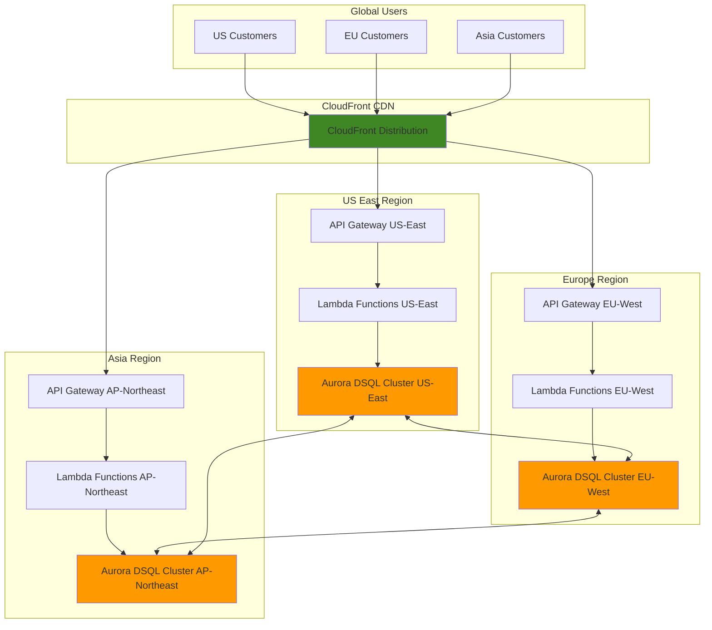

# Global E-commerce with Distributed SQL

## Problem

Modern e-commerce platforms face the challenge of serving millions of customers across multiple regions with sub-second response times while maintaining strong data consistency for transactions. Traditional databases struggle with global distribution, requiring complex sharding strategies and eventual consistency trade-offs that can lead to inventory inconsistencies, payment failures, and poor customer experiences during peak shopping periods.

## Solution

Aurora DSQL provides a serverless, distributed SQL database that enables active-active multi-region deployments with strong consistency and automatic scaling. By combining Aurora DSQL with API Gateway, Lambda, and CloudFront, we create a globally distributed e-commerce platform that scales automatically, maintains ACID transaction guarantees, and delivers low-latency responses to customers worldwide.

## Architecture Diagram



## Prerequisites

1. AWS account with appropriate permissions for Aurora DSQL, API Gateway, Lambda, and CloudFront
2. AWS CLI installed and configured (v2.0 or later)
3. Basic knowledge of SQL, REST APIs, and serverless architectures
4. Understanding of e-commerce transaction patterns and data consistency requirements
5. Estimated cost: $200-400/month for development environment (scales with usage)

> **Note**: Aurora DSQL is available in US East (N. Virginia), US East (Ohio), US West (Oregon), Europe (Ireland), Europe (London), Europe (Paris), and Asia Pacific regions. Multi-region clusters must be within the same region set.

## Preparation

```bash
# Set environment variables
export AWS_REGION=$(aws configure get region)
export AWS_ACCOUNT_ID=$(aws sts get-caller-identity \
    --query Account --output text)

# Generate unique identifiers for resources
RANDOM_SUFFIX=$(aws secretsmanager get-random-password \
    --exclude-punctuation --exclude-uppercase \
    --password-length 6 --require-each-included-type \
    --output text --query RandomPassword)

# Set Aurora DSQL cluster name
export DSQL_CLUSTER_NAME="ecommerce-cluster-${RANDOM_SUFFIX}"

# Create IAM role for Lambda functions
aws iam create-role \
    --role-name ecommerce-lambda-role-${RANDOM_SUFFIX} \
    --assume-role-policy-document '{
        "Version": "2012-10-17",
        "Statement": [
            {
                "Effect": "Allow",
                "Principal": {
                    "Service": "lambda.amazonaws.com"
                },
                "Action": "sts:AssumeRole"
            }
        ]
    }'

# Attach necessary policies to Lambda role
aws iam attach-role-policy \
    --role-name ecommerce-lambda-role-${RANDOM_SUFFIX} \
    --policy-arn arn:aws:iam::aws:policy/service-role/AWSLambdaBasicExecutionRole

# Create Aurora DSQL access policy
aws iam create-policy \
    --policy-name aurora-dsql-access-${RANDOM_SUFFIX} \
    --policy-document '{
        "Version": "2012-10-17",
        "Statement": [
            {
                "Effect": "Allow",
                "Action": [
                    "dsql:DbConnect",
                    "dsql:DbConnectAdmin"
                ],
                "Resource": "*"
            }
        ]
    }'

# Attach Aurora DSQL policy to Lambda role
aws iam attach-role-policy \
    --role-name ecommerce-lambda-role-${RANDOM_SUFFIX} \
    --policy-arn arn:aws:iam::${AWS_ACCOUNT_ID}:policy/aurora-dsql-access-${RANDOM_SUFFIX}

export LAMBDA_ROLE_ARN="arn:aws:iam::${AWS_ACCOUNT_ID}:role/ecommerce-lambda-role-${RANDOM_SUFFIX}"

echo "✅ AWS environment configured and IAM roles created"
```

## Steps

1. **Create Aurora DSQL Multi-Region Cluster**:

   Aurora DSQL's distributed architecture eliminates the need for traditional database sharding while providing active-active multi-region capabilities. This serverless database automatically scales compute, I/O, and storage independently, ensuring your e-commerce platform can handle traffic spikes during peak shopping seasons without manual intervention.

   ```bash
   # Create Aurora DSQL cluster in primary region
   aws dsql create-cluster \
       --cluster-name ${DSQL_CLUSTER_NAME} \
       --region ${AWS_REGION} \
       --deletion-protection-enabled
   
   # Wait for cluster to be active
   aws dsql wait cluster-available \
       --cluster-name ${DSQL_CLUSTER_NAME} \
       --region ${AWS_REGION}
   
   # Get cluster endpoint
   export DSQL_ENDPOINT=$(aws dsql describe-cluster \
       --cluster-name ${DSQL_CLUSTER_NAME} \
       --region ${AWS_REGION} \
       --query 'Cluster.ClusterEndpoint' \
       --output text)
   
   echo "✅ Aurora DSQL cluster created: ${DSQL_ENDPOINT}"
   ```

   The cluster now provides a single logical database accessible through PostgreSQL-compatible connections. Aurora DSQL's active-active design ensures that all regions can perform read and write operations simultaneously while maintaining strong consistency through its distributed transaction coordinator.

2. **Create E-commerce Database Schema**:

   Aurora DSQL uses PostgreSQL-compatible SQL with distributed transaction support. The schema design leverages DSQL's ability to handle high-concurrency transactional workloads while maintaining ACID properties across multiple regions.

   ```bash
   # Create database schema file
   cat > ecommerce-schema.sql << 'EOF'
   -- Create core e-commerce tables
   CREATE TABLE customers (
       customer_id UUID PRIMARY KEY DEFAULT gen_random_uuid(),
       email VARCHAR(255) UNIQUE NOT NULL,
       first_name VARCHAR(100) NOT NULL,
       last_name VARCHAR(100) NOT NULL,
       created_at TIMESTAMP DEFAULT CURRENT_TIMESTAMP,
       updated_at TIMESTAMP DEFAULT CURRENT_TIMESTAMP
   );
   
   CREATE TABLE products (
       product_id UUID PRIMARY KEY DEFAULT gen_random_uuid(),
       name VARCHAR(255) NOT NULL,
       description TEXT,
       price DECIMAL(10,2) NOT NULL,
       stock_quantity INTEGER NOT NULL DEFAULT 0,
       category VARCHAR(100),
       created_at TIMESTAMP DEFAULT CURRENT_TIMESTAMP,
       updated_at TIMESTAMP DEFAULT CURRENT_TIMESTAMP
   );
   
   CREATE TABLE orders (
       order_id UUID PRIMARY KEY DEFAULT gen_random_uuid(),
       customer_id UUID NOT NULL REFERENCES customers(customer_id),
       total_amount DECIMAL(10,2) NOT NULL,
       status VARCHAR(50) DEFAULT 'pending',
       created_at TIMESTAMP DEFAULT CURRENT_TIMESTAMP,
       updated_at TIMESTAMP DEFAULT CURRENT_TIMESTAMP
   );
   
   CREATE TABLE order_items (
       order_item_id UUID PRIMARY KEY DEFAULT gen_random_uuid(),
       order_id UUID NOT NULL REFERENCES orders(order_id),
       product_id UUID NOT NULL REFERENCES products(product_id),
       quantity INTEGER NOT NULL,
       unit_price DECIMAL(10,2) NOT NULL,
       created_at TIMESTAMP DEFAULT CURRENT_TIMESTAMP
   );
   
   -- Create indexes for performance
   CREATE INDEX idx_customers_email ON customers(email);
   CREATE INDEX idx_orders_customer_id ON orders(customer_id);
   CREATE INDEX idx_orders_status ON orders(status);
   CREATE INDEX idx_order_items_order_id ON order_items(order_id);
   CREATE INDEX idx_order_items_product_id ON order_items(product_id);
   CREATE INDEX idx_products_category ON products(category);
   
   -- Insert sample data
   INSERT INTO customers (email, first_name, last_name) VALUES
   ('john.doe@example.com', 'John', 'Doe'),
   ('jane.smith@example.com', 'Jane', 'Smith');
   
   INSERT INTO products (name, description, price, stock_quantity, category) VALUES
   ('Wireless Headphones', 'High-quality wireless headphones', 199.99, 100, 'Electronics'),
   ('Coffee Mug', 'Ceramic coffee mug', 12.99, 500, 'Home'),
   ('Laptop Stand', 'Adjustable laptop stand', 49.99, 50, 'Electronics');
   EOF
   
   # Execute schema creation using AWS CLI with proper authentication
   aws dsql execute-statement \
       --cluster-name ${DSQL_CLUSTER_NAME} \
       --database postgres \
       --statement "$(cat ecommerce-schema.sql)" \
       --region ${AWS_REGION}
   
   echo "✅ E-commerce database schema created with sample data"
   ```

   This schema design optimizes for Aurora DSQL's distributed architecture by using UUIDs for primary keys and avoiding sequences that could create contention across regions. The transactional design ensures inventory consistency during concurrent order processing.

3. **Create Lambda Functions for API Operations**:

   Lambda functions provide serverless compute that scales automatically with your e-commerce traffic. Each function handles specific business logic while maintaining transaction integrity through Aurora DSQL's distributed transaction support.

   ```bash
   # Create Lambda function for product operations
   cat > product-handler.py << 'EOF'
   import json
   import boto3
   import os
   from decimal import Decimal
   
   # Initialize Aurora DSQL client
   dsql_client = boto3.client('dsql')
   
   def lambda_handler(event, context):
       try:
           http_method = event['httpMethod']
           
           if http_method == 'GET':
               # Get all products
               response = dsql_client.execute_statement(
                   clusterName=os.environ['DSQL_CLUSTER_NAME'],
                   database='postgres',
                   statement="""
                       SELECT product_id, name, description, price, stock_quantity, category
                       FROM products
                       ORDER BY created_at DESC
                   """
               )
               
               products = []
               for row in response.get('records', []):
                   products.append({
                       'product_id': row[0]['stringValue'],
                       'name': row[1]['stringValue'],
                       'description': row[2]['stringValue'],
                       'price': float(row[3]['stringValue']),
                       'stock_quantity': int(row[4]['longValue']),
                       'category': row[5]['stringValue']
                   })
               
               return {
                   'statusCode': 200,
                   'headers': {
                       'Content-Type': 'application/json',
                       'Access-Control-Allow-Origin': '*'
                   },
                   'body': json.dumps(products)
               }
           
           elif http_method == 'POST':
               # Create new product
               body = json.loads(event['body'])
               
               response = dsql_client.execute_statement(
                   clusterName=os.environ['DSQL_CLUSTER_NAME'],
                   database='postgres',
                   statement="""
                       INSERT INTO products (name, description, price, stock_quantity, category)
                       VALUES ($1, $2, $3, $4, $5)
                       RETURNING product_id
                   """,
                   parameters=[
                       {'name': 'p1', 'value': {'stringValue': body['name']}},
                       {'name': 'p2', 'value': {'stringValue': body['description']}},
                       {'name': 'p3', 'value': {'stringValue': str(body['price'])}},
                       {'name': 'p4', 'value': {'longValue': body['stock_quantity']}},
                       {'name': 'p5', 'value': {'stringValue': body['category']}}
                   ]
               )
               
               product_id = response['records'][0][0]['stringValue']
               
               return {
                   'statusCode': 201,
                   'headers': {
                       'Content-Type': 'application/json',
                       'Access-Control-Allow-Origin': '*'
                   },
                   'body': json.dumps({'product_id': product_id})
               }
               
       except Exception as e:
           return {
               'statusCode': 500,
               'headers': {'Access-Control-Allow-Origin': '*'},
               'body': json.dumps({'error': str(e)})
           }
   EOF
   
   # Create deployment package
   mkdir -p lambda-package
   cp product-handler.py lambda-package/
   cd lambda-package
   zip -r ../product-handler.zip .
   cd ..
   
   # Deploy Lambda function
   aws lambda create-function \
       --function-name ecommerce-products-${RANDOM_SUFFIX} \
       --runtime python3.9 \
       --role ${LAMBDA_ROLE_ARN} \
       --handler product-handler.lambda_handler \
       --zip-file fileb://product-handler.zip \
       --timeout 30 \
       --memory-size 256 \
       --environment Variables="{DSQL_CLUSTER_NAME=${DSQL_CLUSTER_NAME}}"
   
   echo "✅ Product Lambda function deployed"
   ```

   The Lambda function leverages Aurora DSQL's native AWS SDK integration while benefiting from the distributed architecture's automatic scaling and high availability. Each function invocation connects to the globally consistent database through AWS APIs.

4. **Create Order Processing Lambda Function**:

   Order processing requires complex transactional logic to ensure inventory consistency and payment processing integrity. Aurora DSQL's distributed transaction support enables atomic operations across multiple tables while maintaining performance at scale.

   ```bash
   # Create order processing function
   cat > order-handler.py << 'EOF'
   import json
   import boto3
   import os
   from decimal import Decimal
   
   # Initialize Aurora DSQL client
   dsql_client = boto3.client('dsql')
   
   def lambda_handler(event, context):
       try:
           http_method = event['httpMethod']
           
           if http_method == 'POST':
               # Process new order
               body = json.loads(event['body'])
               customer_id = body['customer_id']
               items = body['items']
               
               # Start transaction
               transaction_id = dsql_client.begin_transaction(
                   clusterName=os.environ['DSQL_CLUSTER_NAME'],
                   database='postgres'
               )['transactionId']
               
               try:
                   # Create order record
                   order_response = dsql_client.execute_statement(
                       clusterName=os.environ['DSQL_CLUSTER_NAME'],
                       database='postgres',
                       transactionId=transaction_id,
                       statement="""
                           INSERT INTO orders (customer_id, total_amount, status)
                           VALUES ($1, $2, $3)
                           RETURNING order_id
                       """,
                       parameters=[
                           {'name': 'p1', 'value': {'stringValue': customer_id}},
                           {'name': 'p2', 'value': {'stringValue': '0.00'}},
                           {'name': 'p3', 'value': {'stringValue': 'processing'}}
                       ]
                   )
                   
                   order_id = order_response['records'][0][0]['stringValue']
                   total_amount = Decimal('0.00')
                   
                   # Process each item
                   for item in items:
                       product_id = item['product_id']
                       quantity = item['quantity']
                       
                       # Check stock and get price
                       stock_response = dsql_client.execute_statement(
                           clusterName=os.environ['DSQL_CLUSTER_NAME'],
                           database='postgres',
                           transactionId=transaction_id,
                           statement="""
                               SELECT price, stock_quantity
                               FROM products
                               WHERE product_id = $1
                           """,
                           parameters=[
                               {'name': 'p1', 'value': {'stringValue': product_id}}
                           ]
                       )
                       
                       if not stock_response['records']:
                           raise Exception(f"Product {product_id} not found")
                       
                       price = Decimal(stock_response['records'][0][0]['stringValue'])
                       stock = int(stock_response['records'][0][1]['longValue'])
                       
                       if stock < quantity:
                           raise Exception(f"Insufficient stock for product {product_id}")
                       
                       # Update inventory
                       dsql_client.execute_statement(
                           clusterName=os.environ['DSQL_CLUSTER_NAME'],
                           database='postgres',
                           transactionId=transaction_id,
                           statement="""
                               UPDATE products
                               SET stock_quantity = stock_quantity - $1
                               WHERE product_id = $2
                           """,
                           parameters=[
                               {'name': 'p1', 'value': {'longValue': quantity}},
                               {'name': 'p2', 'value': {'stringValue': product_id}}
                           ]
                       )
                       
                       # Add order item
                       dsql_client.execute_statement(
                           clusterName=os.environ['DSQL_CLUSTER_NAME'],
                           database='postgres',
                           transactionId=transaction_id,
                           statement="""
                               INSERT INTO order_items (order_id, product_id, quantity, unit_price)
                               VALUES ($1, $2, $3, $4)
                           """,
                           parameters=[
                               {'name': 'p1', 'value': {'stringValue': order_id}},
                               {'name': 'p2', 'value': {'stringValue': product_id}},
                               {'name': 'p3', 'value': {'longValue': quantity}},
                               {'name': 'p4', 'value': {'stringValue': str(price)}}
                           ]
                       )
                       
                       total_amount += price * quantity
                   
                   # Update order total
                   dsql_client.execute_statement(
                       clusterName=os.environ['DSQL_CLUSTER_NAME'],
                       database='postgres',
                       transactionId=transaction_id,
                       statement="""
                           UPDATE orders
                           SET total_amount = $1, status = $2
                           WHERE order_id = $3
                       """,
                       parameters=[
                           {'name': 'p1', 'value': {'stringValue': str(total_amount)}},
                           {'name': 'p2', 'value': {'stringValue': 'completed'}},
                           {'name': 'p3', 'value': {'stringValue': order_id}}
                       ]
                   )
                   
                   # Commit transaction
                   dsql_client.commit_transaction(
                       clusterName=os.environ['DSQL_CLUSTER_NAME'],
                       transactionId=transaction_id
                   )
                   
                   return {
                       'statusCode': 201,
                       'headers': {
                           'Content-Type': 'application/json',
                           'Access-Control-Allow-Origin': '*'
                       },
                       'body': json.dumps({
                           'order_id': order_id,
                           'total_amount': float(total_amount)
                       })
                   }
                   
               except Exception as e:
                   # Rollback transaction
                   dsql_client.rollback_transaction(
                       clusterName=os.environ['DSQL_CLUSTER_NAME'],
                       transactionId=transaction_id
                   )
                   raise e
                   
       except Exception as e:
           return {
               'statusCode': 400,
               'headers': {'Access-Control-Allow-Origin': '*'},
               'body': json.dumps({'error': str(e)})
           }
   EOF
   
   # Create deployment package
   cp order-handler.py lambda-package/
   cd lambda-package
   zip -r ../order-handler.zip .
   cd ..
   
   # Deploy Lambda function
   aws lambda create-function \
       --function-name ecommerce-orders-${RANDOM_SUFFIX} \
       --runtime python3.9 \
       --role ${LAMBDA_ROLE_ARN} \
       --handler order-handler.lambda_handler \
       --zip-file fileb://order-handler.zip \
       --timeout 30 \
       --memory-size 256 \
       --environment Variables="{DSQL_CLUSTER_NAME=${DSQL_CLUSTER_NAME}}"
   
   echo "✅ Order processing Lambda function deployed"
   ```

   This function demonstrates Aurora DSQL's distributed transaction capabilities through the AWS SDK by performing atomic operations across multiple tables while maintaining strong consistency. The transaction management ensures proper isolation and consistency in the distributed environment.

5. **Create API Gateway REST API**:

   API Gateway provides a managed REST API that integrates seamlessly with Lambda functions. The gateway handles request routing, authentication, and provides built-in features like rate limiting and caching to protect your backend services.

   ```bash
   # Create API Gateway
   export API_ID=$(aws apigateway create-rest-api \
       --name ecommerce-api-${RANDOM_SUFFIX} \
       --description "E-commerce API with Aurora DSQL" \
       --query 'id' --output text)
   
   # Get root resource ID
   export ROOT_RESOURCE_ID=$(aws apigateway get-resources \
       --rest-api-id ${API_ID} \
       --query 'items[0].id' --output text)
   
   # Create products resource
   export PRODUCTS_RESOURCE_ID=$(aws apigateway create-resource \
       --rest-api-id ${API_ID} \
       --parent-id ${ROOT_RESOURCE_ID} \
       --path-part products \
       --query 'id' --output text)
   
   # Create orders resource
   export ORDERS_RESOURCE_ID=$(aws apigateway create-resource \
       --rest-api-id ${API_ID} \
       --parent-id ${ROOT_RESOURCE_ID} \
       --path-part orders \
       --query 'id' --output text)
   
   # Get Lambda function ARNs
   export PRODUCTS_LAMBDA_ARN=$(aws lambda get-function \
       --function-name ecommerce-products-${RANDOM_SUFFIX} \
       --query 'Configuration.FunctionArn' --output text)
   
   export ORDERS_LAMBDA_ARN=$(aws lambda get-function \
       --function-name ecommerce-orders-${RANDOM_SUFFIX} \
       --query 'Configuration.FunctionArn' --output text)
   
   echo "✅ API Gateway resources created"
   ```

   API Gateway acts as the entry point for your global e-commerce platform, providing a unified interface that can be distributed through CloudFront to edge locations worldwide for optimal performance.

6. **Configure API Gateway Methods and Integrations**:

   Each API method requires specific integration configuration to properly route requests to Lambda functions. This setup enables Lambda proxy integration, which provides the full HTTP request context to your functions.

   ```bash
   # Add GET method for products
   aws apigateway put-method \
       --rest-api-id ${API_ID} \
       --resource-id ${PRODUCTS_RESOURCE_ID} \
       --http-method GET \
       --authorization-type NONE
   
   # Add POST method for products
   aws apigateway put-method \
       --rest-api-id ${API_ID} \
       --resource-id ${PRODUCTS_RESOURCE_ID} \
       --http-method POST \
       --authorization-type NONE
   
   # Add POST method for orders
   aws apigateway put-method \
       --rest-api-id ${API_ID} \
       --resource-id ${ORDERS_RESOURCE_ID} \
       --http-method POST \
       --authorization-type NONE
   
   # Configure Lambda integration for products GET
   aws apigateway put-integration \
       --rest-api-id ${API_ID} \
       --resource-id ${PRODUCTS_RESOURCE_ID} \
       --http-method GET \
       --type AWS_PROXY \
       --integration-http-method POST \
       --uri arn:aws:apigateway:${AWS_REGION}:lambda:path/2015-03-31/functions/${PRODUCTS_LAMBDA_ARN}/invocations
   
   # Configure Lambda integration for products POST
   aws apigateway put-integration \
       --rest-api-id ${API_ID} \
       --resource-id ${PRODUCTS_RESOURCE_ID} \
       --http-method POST \
       --type AWS_PROXY \
       --integration-http-method POST \
       --uri arn:aws:apigateway:${AWS_REGION}:lambda:path/2015-03-31/functions/${PRODUCTS_LAMBDA_ARN}/invocations
   
   # Configure Lambda integration for orders POST
   aws apigateway put-integration \
       --rest-api-id ${API_ID} \
       --resource-id ${ORDERS_RESOURCE_ID} \
       --http-method POST \
       --type AWS_PROXY \
       --integration-http-method POST \
       --uri arn:aws:apigateway:${AWS_REGION}:lambda:path/2015-03-31/functions/${ORDERS_LAMBDA_ARN}/invocations
   
   echo "✅ API Gateway methods and integrations configured"
   ```

   These integrations enable API Gateway to forward HTTP requests directly to Lambda functions using the AWS_PROXY integration type, which provides the most flexibility for handling different request patterns.

7. **Grant API Gateway Permission to Invoke Lambda Functions**:

   API Gateway requires explicit permission to invoke Lambda functions. These permissions are managed through Lambda's resource-based policy system, ensuring secure access control.

   ```bash
   # Grant API Gateway permission to invoke products Lambda
   aws lambda add-permission \
       --function-name ecommerce-products-${RANDOM_SUFFIX} \
       --statement-id apigateway-invoke-products \
       --action lambda:InvokeFunction \
       --principal apigateway.amazonaws.com \
       --source-arn "arn:aws:execute-api:${AWS_REGION}:${AWS_ACCOUNT_ID}:${API_ID}/*/*"
   
   # Grant API Gateway permission to invoke orders Lambda
   aws lambda add-permission \
       --function-name ecommerce-orders-${RANDOM_SUFFIX} \
       --statement-id apigateway-invoke-orders \
       --action lambda:InvokeFunction \
       --principal apigateway.amazonaws.com \
       --source-arn "arn:aws:execute-api:${AWS_REGION}:${AWS_ACCOUNT_ID}:${API_ID}/*/*"
   
   # Deploy API to stage
   aws apigateway create-deployment \
       --rest-api-id ${API_ID} \
       --stage-name prod
   
   # Get API endpoint URL
   export API_URL="https://${API_ID}.execute-api.${AWS_REGION}.amazonaws.com/prod"
   
   echo "✅ API deployed at: ${API_URL}"
   ```

   The API is now deployed and accessible through a dedicated HTTPS endpoint that can handle production traffic with built-in security and monitoring features.

8. **Create CloudFront Distribution for Global Delivery**:

   CloudFront provides global content delivery through edge locations worldwide, reducing latency by serving API responses from the nearest edge location. This integration significantly improves performance for international customers.

   ```bash
   # Create CloudFront distribution configuration
   cat > cloudfront-config.json << EOF
   {
       "CallerReference": "ecommerce-${RANDOM_SUFFIX}-$(date +%s)",
       "Comment": "E-commerce API distribution",
       "DefaultCacheBehavior": {
           "TargetOriginId": "api-origin",
           "ViewerProtocolPolicy": "redirect-to-https",
           "TrustedSigners": {
               "Enabled": false,
               "Quantity": 0
           },
           "ForwardedValues": {
               "QueryString": true,
               "Cookies": {
                   "Forward": "all"
               },
               "Headers": {
                   "Quantity": 4,
                   "Items": ["Authorization", "Content-Type", "Accept", "Origin"]
               }
           },
           "MinTTL": 0,
           "DefaultTTL": 0,
           "MaxTTL": 0
       },
       "Origins": {
           "Quantity": 1,
           "Items": [
               {
                   "Id": "api-origin",
                   "DomainName": "${API_ID}.execute-api.${AWS_REGION}.amazonaws.com",
                   "OriginPath": "/prod",
                   "CustomOriginConfig": {
                       "HTTPPort": 443,
                       "HTTPSPort": 443,
                       "OriginProtocolPolicy": "https-only"
                   }
               }
           ]
       },
       "Enabled": true,
       "PriceClass": "PriceClass_All"
   }
   EOF
   
   # Create CloudFront distribution
   export DISTRIBUTION_ID=$(aws cloudfront create-distribution \
       --distribution-config file://cloudfront-config.json \
       --query 'Distribution.Id' --output text)
   
   # Get CloudFront domain name
   export CLOUDFRONT_DOMAIN=$(aws cloudfront get-distribution \
       --id ${DISTRIBUTION_ID} \
       --query 'Distribution.DomainName' --output text)
   
   echo "✅ CloudFront distribution created: ${CLOUDFRONT_DOMAIN}"
   echo "✅ Distribution is deploying (this may take 10-15 minutes)"
   ```

   CloudFront now caches API responses at edge locations worldwide, reducing latency for global customers while maintaining the ability to serve dynamic content from your Aurora DSQL backend.

## Validation & Testing

1. **Verify Aurora DSQL Cluster Status**:

   ```bash
   # Check cluster status
   aws dsql describe-cluster \
       --cluster-name ${DSQL_CLUSTER_NAME} \
       --query 'Cluster.Status' --output text
   ```

   Expected output: `ACTIVE`

2. **Test Product API Endpoints**:

   ```bash
   # Test GET products
   curl -X GET "${API_URL}/products" \
       -H "Content-Type: application/json"
   
   # Test POST product creation
   curl -X POST "${API_URL}/products" \
       -H "Content-Type: application/json" \
       -d '{
           "name": "Test Product",
           "description": "Test description",
           "price": 29.99,
           "stock_quantity": 10,
           "category": "Test"
       }'
   ```

   Expected output: JSON array of products for GET, product_id for POST

3. **Test Order Processing**:

   ```bash
   # Get customer and product IDs for testing
   CUSTOMER_ID=$(aws dsql execute-statement \
       --cluster-name ${DSQL_CLUSTER_NAME} \
       --database postgres \
       --statement "SELECT customer_id FROM customers LIMIT 1" \
       --query 'records[0][0].stringValue' --output text)
   
   PRODUCT_ID=$(aws dsql execute-statement \
       --cluster-name ${DSQL_CLUSTER_NAME} \
       --database postgres \
       --statement "SELECT product_id FROM products LIMIT 1" \
       --query 'records[0][0].stringValue' --output text)
   
   # Test order creation
   curl -X POST "${API_URL}/orders" \
       -H "Content-Type: application/json" \
       -d "{
           \"customer_id\": \"${CUSTOMER_ID}\",
           \"items\": [
               {
                   \"product_id\": \"${PRODUCT_ID}\",
                   \"quantity\": 2
               }
           ]
       }"
   ```

   Expected output: JSON with order_id and total_amount

4. **Test CloudFront Global Distribution**:

   ```bash
   # Test CloudFront endpoint (may take 10-15 minutes after creation)
   curl -X GET "https://${CLOUDFRONT_DOMAIN}/products" \
       -H "Content-Type: application/json" \
       -w "Time: %{time_total}s\n"
   ```

   Expected output: Same product data with improved global response times

## Cleanup

1. **Delete CloudFront Distribution**:

   ```bash
   # Disable distribution first
   aws cloudfront get-distribution-config \
       --id ${DISTRIBUTION_ID} \
       --output json > dist-config.json
   
   # Update enabled status to false
   jq '.DistributionConfig.Enabled = false' dist-config.json > dist-config-disabled.json
   
   # Update distribution
   aws cloudfront update-distribution \
       --id ${DISTRIBUTION_ID} \
       --if-match $(jq -r '.ETag' dist-config.json) \
       --distribution-config file://dist-config-disabled.json
   
   # Wait for distribution to be deployed
   aws cloudfront wait distribution-deployed \
       --id ${DISTRIBUTION_ID}
   
   # Delete distribution
   aws cloudfront delete-distribution \
       --id ${DISTRIBUTION_ID} \
       --if-match $(aws cloudfront get-distribution \
           --id ${DISTRIBUTION_ID} \
           --query 'ETag' --output text)
   
   echo "✅ CloudFront distribution deleted"
   ```

2. **Delete API Gateway**:

   ```bash
   # Delete API Gateway
   aws apigateway delete-rest-api \
       --rest-api-id ${API_ID}
   
   echo "✅ API Gateway deleted"
   ```

3. **Delete Lambda Functions**:

   ```bash
   # Delete Lambda functions
   aws lambda delete-function \
       --function-name ecommerce-products-${RANDOM_SUFFIX}
   
   aws lambda delete-function \
       --function-name ecommerce-orders-${RANDOM_SUFFIX}
   
   echo "✅ Lambda functions deleted"
   ```

4. **Delete Aurora DSQL Cluster**:

   ```bash
   # Delete Aurora DSQL cluster
   aws dsql delete-cluster \
       --cluster-name ${DSQL_CLUSTER_NAME}
   
   echo "✅ Aurora DSQL cluster deleted"
   ```

5. **Delete IAM Resources**:

   ```bash
   # Detach policies and delete role
   aws iam detach-role-policy \
       --role-name ecommerce-lambda-role-${RANDOM_SUFFIX} \
       --policy-arn arn:aws:iam::aws:policy/service-role/AWSLambdaBasicExecutionRole
   
   aws iam detach-role-policy \
       --role-name ecommerce-lambda-role-${RANDOM_SUFFIX} \
       --policy-arn arn:aws:iam::${AWS_ACCOUNT_ID}:policy/aurora-dsql-access-${RANDOM_SUFFIX}
   
   aws iam delete-policy \
       --policy-arn arn:aws:iam::${AWS_ACCOUNT_ID}:policy/aurora-dsql-access-${RANDOM_SUFFIX}
   
   aws iam delete-role \
       --role-name ecommerce-lambda-role-${RANDOM_SUFFIX}
   
   echo "✅ IAM resources deleted"
   ```

## Discussion

Aurora DSQL represents a significant advancement in distributed database technology, combining the familiar PostgreSQL interface with a serverless, multi-region architecture that automatically handles the complexities of distributed systems. Unlike traditional databases that require manual sharding and complex replication strategies, Aurora DSQL provides a single logical database that spans multiple regions with active-active write capabilities.

The architecture demonstrated in this recipe leverages Aurora DSQL's unique strengths for e-commerce workloads, which require strong consistency for inventory management and financial transactions. The distributed design ensures that customer orders processed in different regions maintain data integrity without the eventual consistency challenges common in traditional distributed systems. This is particularly important for e-commerce platforms where overselling inventory or double-charging customers can have serious business consequences.

The integration with serverless technologies like Lambda and API Gateway creates a highly scalable architecture that can handle traffic spikes during peak shopping periods without pre-provisioning resources. CloudFront's global edge network further enhances performance by caching API responses and reducing latency for international customers. This combination provides a cost-effective solution that scales automatically while maintaining enterprise-grade reliability.

The recipe demonstrates best practices for distributed transaction processing using Aurora DSQL's native AWS SDK integration, including proper transaction management and atomic operations across multiple tables. Aurora DSQL's optimistic concurrency control and distributed transaction coordinator ensure that these operations maintain ACID properties even when spanning multiple regions. For more information on Aurora DSQL's transaction model, see the [Aurora DSQL User Guide](https://docs.aws.amazon.com/aurora-dsql/latest/userguide/what-is-aurora-dsql.html).

> **Tip**: Monitor your Aurora DSQL cluster's performance using CloudWatch metrics and set up alerts for high transaction rates or latency spikes to ensure optimal customer experience.

For production deployments, consider implementing additional security measures such as API Gateway authorizers, Lambda layers for shared dependencies, and AWS WAF for protecting against common web application attacks. The [AWS Well-Architected Framework](https://docs.aws.amazon.com/wellarchitected/latest/framework/welcome.html) provides comprehensive guidance on building secure, reliable, and cost-effective systems. Additionally, review the [API Gateway security best practices](https://docs.aws.amazon.com/apigateway/latest/developerguide/security.html) and [Lambda security documentation](https://docs.aws.amazon.com/lambda/latest/dg/lambda-security.html) for implementing defense-in-depth strategies.

## Challenge

Extend this global e-commerce platform by implementing these advanced features:

1. **Multi-Region Disaster Recovery**: Configure Aurora DSQL multi-region clusters across different region sets and implement automated failover mechanisms using Route 53 health checks and CloudFront origin groups.

2. **Real-time Inventory Synchronization**: Implement EventBridge integration to broadcast inventory changes across regions in real-time, ensuring customers see accurate stock levels regardless of their location.

3. **Advanced API Security**: Add Cognito user pools for customer authentication, implement API Gateway request validation, and configure AWS WAF rules to protect against common e-commerce attack patterns.

4. **Performance Optimization**: Implement API Gateway caching strategies, optimize Lambda function cold starts using provisioned concurrency, and add CloudWatch dashboards for monitoring key performance metrics.

5. **Event-Driven Order Processing**: Extend the order processing system using Step Functions to orchestrate complex workflows including payment processing, inventory reservation, and fulfillment tracking with proper error handling and retry mechanisms.

## Infrastructure Code

*Infrastructure code will be generated after recipe approval.*